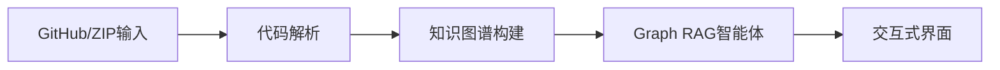
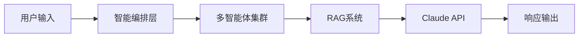
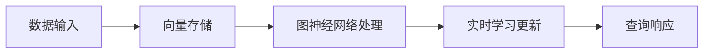
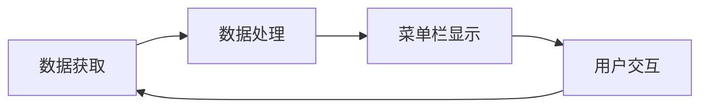
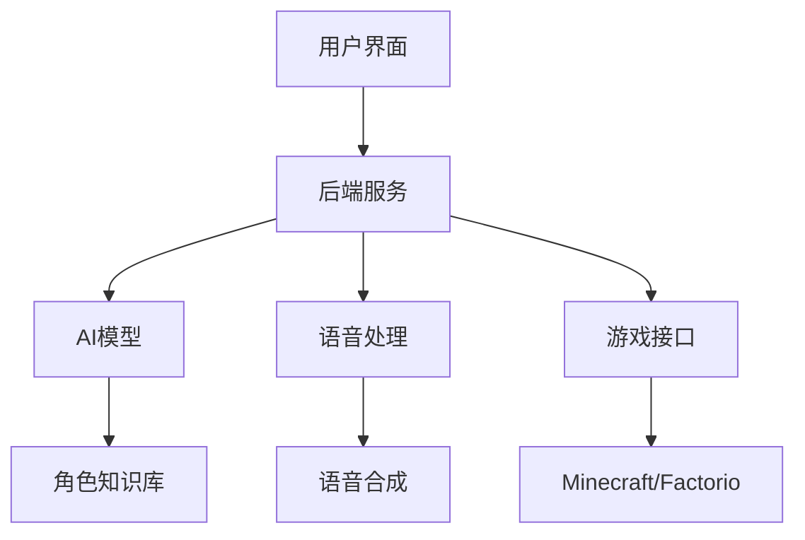
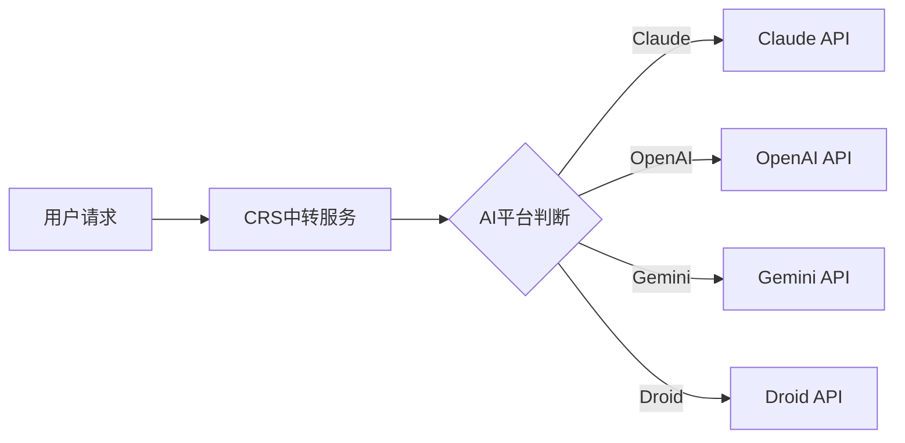

## 今日热点

今日GitHub热榜呈现AI代理系统爆发式增长趋势，边缘计算与嵌入式AI解决方案备受关注，Claude系列工具引领智能代理新潮流。

---

## 热门项目一览

| 排名 | 项目 | 语言 | 今日 | 总计 | 简介 |
|:---:|------|:----:|------:|-----:|------|
| 1 | [obra/superpowers](https://github.com/obra/superpowers) | Shell | +1,546 | 64,746 | An agentic skills framework... |
| 2 | [abhigyanpatwari/GitNexus](https://github.com/abhigyanpatwari/GitNexus) | TypeScript | +1,385 | 6,202 | GitNexus: The Zero-Server C... |
| 3 | [D4Vinci/Scrapling](https://github.com/D4Vinci/Scrapling) | Python | +1,135 | 18,079 | 🕷️ An adaptive Web Scraping... |
| 4 | [muratcankoylan/Agent-Skills-for-Context-Engineering](https://github.com/muratcankoylan/Agent-Skills-for-Context-Engineering) | Python | +803 | 12,391 | A comprehensive collection ... |
| 5 | [bytedance/deer-flow](https://github.com/bytedance/deer-flow) | TypeScript | +696 | 21,853 | An open-source SuperAgent h... |
| 6 | [moonshine-ai/moonshine](https://github.com/moonshine-ai/moonshine) | C | +593 | 5,834 | Fast and accurate automatic... |
| 7 | [ruvnet/ruflo](https://github.com/ruvnet/ruflo) | TypeScript | +531 | 15,649 | 🌊 The leading agent orchest... |
| 8 | [anthropics/claude-code](https://github.com/anthropics/claude-code) | Shell | +494 | 71,167 | Claude Code is an agentic c... |
| 9 | [ruvnet/wifi-densepose](https://github.com/ruvnet/wifi-densepose) | Python | +478 | 9,243 | Production-ready implementa... |
| 10 | [ruvnet/ruvector](https://github.com/ruvnet/ruvector) | Rust | +410 | 1,919 | RuVector is a High Performa... |
| 11 | [datawhalechina/hello-agents](https://github.com/datawhalechina/hello-agents) | Python | +324 | 23,022 | 📚 《从零开始构建智能体》——从零开始的智能体原理与实践教程 |
| 12 | [steipete/CodexBar](https://github.com/steipete/CodexBar) | Swift | +243 | 7,042 | Show usage stats for OpenAI... |

---

## 趋势洞察

```
┌─────────────────────────────────────────────────────────────────┐
│  AI/ML 工具         ████████████████████████  13 个项目        │
│  开发框架             █                         1 个项目        │
│  项目管理             █                         1 个项目        │
│  其他               █                         1 个项目        │
└─────────────────────────────────────────────────────────────────┘
```

---

## 项目深度解读

### 1. obra/superpowers — 智能开发方法论

> **一句话总结**：基于智能代理的软件开发方法论，提供可落地的技能框架与实践指南。

#### 价值主张

| 维度 | 说明 |
|------|------|
| **解决痛点** | 提供更高效、智能的软件开发方法，解决传统开发流程的局限性 |
| **目标用户** | 软件开发者、技术团队及项目管理者 |
| **核心亮点** | 智能代理驱动+技能体系化+实用方法论+高效开发流程 |

#### 技术架构


**技术特色**：
- 基于Shell的轻量级实现，跨平台兼容
- 模块化设计，支持自定义扩展
- 智能化工作流程，提高开发效率

#### 热度分析

- 项目拥有64,746个Star，单日新增1,546，呈爆发式增长趋势
- 零开放Issues表明项目成熟度高，社区问题通过其他渠道高效解决

#### 快速上手

```bash
# 克隆项目
git clone https://github.com/obra/superpowers.git

# 进入项目目录
cd superpowers

# 查看使用说明
./superpowers.sh --help
```

#### 注意事项

- 项目许可证未知，商业使用前需确认版权情况
- 作为方法论框架，实际效果可能因团队而异
- Shell实现可能在Windows平台上需要额外配置


### 2. abhigyanpatwari/GitNexus — [浏览器代码图谱]

> **一句话总结**：完全在浏览器中运行的代码知识图谱生成器，支持GitHub仓库导入和交互式Graph RAG智能体。

#### 价值主张

| 维度 | 说明 |
|------|------|
| **解决痛点** | 传统代码分析工具依赖服务器，缺乏交互式知识图谱与智能体整合 |
| **目标用户** | 软件开发者、代码审查员、架构师和代码研究员 |
| **核心亮点** | 零服务器运行 + 交互式知识图谱 + 内置Graph RAG智能体 + 完全浏览器端实现 |

#### 技术架构



**技术特色**：
- 完全基于浏览器运行，无需服务器支持
- 利用WebAssembly实现高性能代码分析
- 集成Graph RAG技术增强代码理解能力

#### 热度分析

- Star数超6000且短期内激增1385，表明项目获得广泛关注和认可
- 零Open Issues显示项目已趋于成熟，社区可能通过其他渠道提供反馈

#### 快速上手

```bash
# 克隆仓库
git clone https://github.com/abhigyanpatwari/GitNexus.git
# 安装依赖
npm install
# 启动开发服务器
npm run dev
```

#### 注意事项

- 由于完全在浏览器中运行，处理大型代码库可能会导致性能问题
- 许可证未知，可能存在使用限制
- 需要现代浏览器以支持所有功能特性


### 3. D4Vinci/Scrapling — 自适应爬虫框架

> **一句话总结**：一个自适应网络爬虫框架，能从简单请求到大规模爬取全场景覆盖，简化数据采集流程。

#### 价值主张

| 维度 | 说明 |
|------|------|
| **解决痛点** | 传统爬虫工具应对复杂反爬机制困难，需要大量定制化代码 |
| **目标用户** | 需要从网站提取数据的开发者、数据分析师和研究人员 |
| **核心亮点** | 自适应解析能力 + 内置反反爬策略 + 模块化设计 + 多格式输出 |

#### 技术架构


**技术特色**：
- 智能识别网页结构，无需手动编写解析规则
- 内置多种反反爬策略，自动应对网站防护机制
- 支持动态内容处理，能渲染JavaScript生成页面

#### 热度分析

- 项目短期内星标激增，今日新增超千星，显示社区对其高度认可
- 作为Python爬虫领域新兴框架，正在快速建立差异化竞争优势

#### 快速上手

```bash
# 安装Scrapling
pip install scrapling

# 基本使用示例
from scrapling import Scrapling
scraper = Scrapling('https://example.com')
data = scraper.get()
print(data.text)
```

#### 注意事项

- 使用时需遵守目标网站的robots.txt和使用条款
- 避免设置过高请求频率，防止IP被封禁
- 对于复杂网站可能需要额外配置和自定义处理逻辑


### 4. muratcankoylan/Agent-Skills-for-Context-Engineering — 智能体技能库

> **一句话总结**：提供智能体上下文工程技能集合，助力构建高效多智能体系统

#### 价值主张

| 维度 | 说明 |
|------|------|
| **解决痛点** | 解决智能体系统上下文管理混乱、多智能体协调困难问题 |
| **目标用户** | AI系统开发者、智能体架构师、多智能体系统研究员 |
| **核心亮点** | 全面的技能库 + 上下文工程 + 多智能体架构 + 生产环境支持 + 调试优化工具 |

#### 技术架构


**技术特色**：
- 模块化技能设计，便于复用和组合
- 智能上下文压缩与优化技术
- 多智能体协作框架与通信机制

#### 热度分析

- 项目热度极高，12k+星标且单日新增800+，表明社区认可度快速提升
- 生态位置明确，成为智能体系统开发的关键参考资源库

#### 快速上手

```bash
# 克隆项目
git clone https://github.com/muratcankoylan/Agent-Skills-for-Context-Engineering.git

# 安装依赖
pip install -r requirements.txt

# 基础使用示例
from agent_skills import ContextSkill, MultiAgentSystem
context = ContextSkill.initialize()
agents = MultiAgentSystem.deploy(context)
```

#### 注意事项

- 项目License信息不明确，商业使用前需确认授权条款
- 项目Issues为0，可能意味着问题反馈渠道不够完善
- 对于生产环境，建议先在非关键系统中进行充分测试


### 5. bytedance/deer-flow — 智能代理框架

> **一句话总结**：开源SuperAgent工作流系统，通过多代理协作处理从简单到复杂的各类任务。

#### 价值主张

| 维度 | 说明 |
|------|------|
| **解决痛点** | 简化复杂任务的自动化处理，减少人工干预和开发时间 |
| **目标用户** | 开发者、研究人员、自动化流程需求者 |
| **核心亮点** | 模块化设计 + 多代理协作 + 沙箱隔离 + 记忆系统 + 工具集成 |

#### 技术架构


**技术特色**：
- TypeScript全栈开发，确保类型安全
- 模块化架构设计，便于扩展和维护
- 沙箱环境隔离，提高安全性

#### 热度分析

- 项目Star数达21,853且持续增长，表明社区高度认可
- Fork数2,667显示活跃的开发和二次开发社区

#### 快速上手

```bash
# 克隆仓库
git clone https://github.com/bytedance/deer-flow.git
# 安装依赖
npm install
# 启动项目
npm start
```

#### 注意事项

- 项目许可信息不明确，使用前需确认授权条款
- 作为复杂的代理系统，可能需要较强的技术背景才能充分利用其功能


### 6. moonshine-ai/moonshine — [边缘语音识别]

> **一句话总结**：专为边缘设备设计的轻量级快速准确自动语音识别引擎，低资源消耗高精度。

#### 价值主张

| 维度 | 说明 |
|------|------|
| **解决痛点** | 解决边缘设备上实时语音识别的准确率与性能平衡问题 |
| **目标用户** | 嵌入式开发者、IoT设备制造商、离线语音应用开发者 |
| **核心亮点** | 轻量级模型 + 低延迟推理 + 离线运行 + 高精度识别 |

#### 技术架构


**技术特色**：
- C语言实现，最大化边缘设备性能
- 优化的神经网络模型，减少计算资源需求
- 自适应采样率处理，适应不同设备能力

#### 热度分析

- 近期Star数激增(+593 today)，表明项目获得广泛关注
- Issues数量为0，可能表示项目成熟或社区反馈渠道不完善

#### 快速上手

```bash
# 克隆项目
git clone https://github.com/moonshine-ai/moonshine.git
cd moonshine

# 编译项目
make

# 运行示例
./moonshine -i audio.wav
```

#### 注意事项

- 项目许可证未知，商业使用前需确认授权条款
- 边缘设备部署可能需要针对特定硬件进行优化调整
- 模型精度可能受限于计算资源，需在精度和性能间权衡


### 7. ruvnet/ruflo — Claude智能体编排

> **一句话总结**：企业级Claude智能体编排平台，支持多智能体协同、RAG集成与自主工作流程构建。

#### 价值主张

| 维度 | 说明 |
|------|------|
| **解决痛点** | 简化多智能体系统构建与协作，解决复杂AI工作流程编排难题 |
| **目标用户** | 企业AI开发者、Claude应用构建者、自动化工作流程设计师 |
| **核心亮点** | 多智能体协同 + RAG集成 + 企业级架构 + 分布式智能 + Claude原生支持 |

#### 技术架构



**技术特色**：
- 分布式智能体架构，支持大规模智能体协同
- RAG集成增强知识检索与响应能力
- 企业级安全与可扩展性设计

#### 热度分析

- 项目近期增长迅猛，单日新增531星，表明社区高度关注Claude智能体编排领域
- 作为Claude生态中的领先编排平台，已成为构建复杂AI系统的核心工具

#### 快速上手

```bash
# 安装ruflo
npm install -g ruflo

# 初始化项目
ruflo init my-agent-project

# 启动服务
ruflo start
```

#### 注意事项

- 项目许可证未知，商业使用前需确认授权条款
- 依赖Claude API，需确保有适当的API访问权限


### 8. anthropics/claude-code — AI编程助手

> **一句话总结**：Claude Code是终端内的AI编程助手，能理解代码库并通过自然语言命令高效完成编程任务。

#### 价值主张

| 维度 | 说明 |
|------|------|
| **解决痛点** | 通过自然语言命令自动化常规编码任务，提升开发效率 |
| **目标用户** | 终端开发者、需要高效编码工具的程序员 |
| **核心亮点** | 理解代码库 + 自然语言交互 + 自动化常规任务 + 代码解释 + Git工作流处理 |

#### 技术架构


**技术特色**：
- 基于Claude AI模型的智能代码理解
- 自然语言到命令的转换机制
- 代码库上下文保持与分析

#### 热度分析

- 项目获得超7万Star，近5000Fork，显示极高的开发者关注度和采用率
- 作为Anthropic官方项目，在AI编程助手领域具有显著影响力

#### 快速上手

```bash
# 克隆仓库
git clone https://github.com/anthropics/claude-code.git
# 进入目录
cd claude-code
# 安装依赖并运行
npm install && npm start
```

#### 注意事项

- 需要Anthropic API密钥才能使用
- 需要配置代码库的访问权限
- 项目处于早期阶段，功能可能还在迭代中


### 9. ruvnet/wifi-densepose — WiFi姿态感知

> **一句话总结**：通过普通路由器WiFi信号实现穿透墙壁的全身姿态实时追踪的革命性系统。

#### 价值主张

| 维度 | 说明 |
|------|------|
| **解决痛点** | 解决非视觉环境下人体姿态估计难题，实现无摄像头隐私保护式动作捕捉 |
| **目标用户** | 需要隐私保护的智能家居、安防监控、医疗康复机构 |
| **核心亮点** | 普通WiFi路由器实现 + 穿墙实时追踪 + 隐私保护 + 无需穿戴设备 |

#### 技术架构


**技术特色**：
- 利用WiFi信号相位变化感知人体动作
- 采用深度学习算法从无线信号中提取人体特征
- 不依赖视觉设备，实现隐私保护式姿态估计

#### 热度分析

- 项目获得9243星且持续增长(+478今日)，表明WiFi姿态估计技术受到广泛关注
- 0个开放问题显示项目成熟度高，社区维护良好

#### 快速上手

```bash
# 克隆仓库
git clone https://github.com/ruvnet/wifi-densepose.git

# 安装依赖
pip install -r requirements.txt

# 运行示例
python demo.py --input [WiFi接口] --output [输出文件]
```

#### 注意事项

- 需要特定WiFi硬件支持，不是所有路由器都能提供所需的信号质量
- 精度可能受环境因素影响，如障碍物材质、WiFi信号强度等
- 需要大量数据训练模型以获得最佳效果


### 10. ruvnet/ruvector — 高性能向量图数据库

> **一句话总结**：基于Rust构建的高性能实时自学习向量图神经网络数据库，兼顾推理与存储能力。

#### 价值主张

| 维度 | 说明 |
|------|------|
| **解决痛点** | 传统向量数据库在实时学习和图神经网络推理性能上的不足 |
| **目标用户** | 需要高性能向量搜索和图神经网络推理的开发者和研究人员 |
| **核心亮点** | 高性能 + 实时处理 + 自学习能力 + 图神经网络集成 + 向量数据库 |

#### 技术架构



**技术特色**：
- 利用Rust语言实现高性能内存安全处理
- 结合图神经网络增强向量检索能力
- 支持实时学习和模型更新

#### 热度分析

- 项目近期获得显著关注，单日增长410 stars，表明社区对高性能向量数据库需求强烈
- 作为新兴项目，在图神经网络与向量数据库结合领域占据独特生态位置

#### 快速上手

```bash
cargo install ruvector
# 或者
git clone https://github.com/ruvnet/ruvector.git
cd ruvector
cargo build --release
```

#### 注意事项

- 项目许可证信息未知，使用前需确认开源许可条款
- 作为较新项目，文档和示例可能不够完善
- 由于结合了图神经网络和向量数据库，可能需要一定的机器学习和图论基础


### 11. datawhalechina/hello-agents — 智能体教程

> **一句话总结**：从零开始构建智能体的系统性实践教程，结合理论与代码实现，降低AI智能体开发入门门槛。

#### 价值主张

| 维度 | 说明 |
|------|------|
| **解决痛点** | 提供结构化、实践导向的智能体开发学习路径，解决理论与实践脱节问题 |
| **目标用户** | AI/ML初学者、开发者、研究人员、对智能体技术感兴趣的学习者 |
| **核心亮点** | 系统性教程 + 实践案例 + 代码实现 + 理论结合 |

#### 技术架构


**技术特色**：
- 循序渐进的学习路径设计，由浅入深
- 理论与实践相结合的教学方式
- 提供完整可运行的代码示例与项目

#### 热度分析

- 项目获得23K+星标，近期增长迅速，日均增长约300+，表明智能体技术领域热度高涨
- 作为DataWhale社区出品，在国内AI教育领域具有较强影响力和社区支持

#### 快速上手

```bash
# 克隆项目
git clone https://github.com/datawhalechina/hello-agents.git

# 进入项目目录
cd hello-agents
```

#### 注意事项

- 项目为中文教程，需要一定的中文阅读能力
- 建议按照章节顺序学习，以确保知识体系的连贯性
- 需要具备Python编程基础和基本的AI/ML知识


### 12. steipete/CodexBar — AI 编码统计工具

> **一句话总结**：无需登录即可查看 OpenAI Codex 和 Claude Code 使用统计信息的 macOS 菜单栏工具。

#### 价值主张

| 维度 | 说明 |
|------|------|
| **解决痛点** | 无需登录即可查看 AI 编程助手使用统计，解决数据访问不便问题 |
| **目标用户** | AI 编程助手用户、开发者、技术人员 |
| **核心亮点** | 无需登录 + 实时统计 + 菜单栏集成 + 支持多个 AI 平台 |

#### 技术架构



**技术特色**：
- 基于 Swift 开发，利用 macOS 原生 API
- 可能使用网络请求获取 AI 平台 API 数据
- 菜单栏应用实现轻量级系统集成
- 实时数据更新机制

#### 热度分析

- 项目 Star 数超过 7000，近期增长迅速，表明开发者社区对 AI 编程助手工具有高度关注
- Fork 数相对适中，说明项目以使用为主，定制需求不高，处于稳定成熟阶段

#### 快速上手

```bash
# 克隆项目
git clone https://github.com/steipete/CodexBar.git

# 构建 (需要 Xcode)
cd CodexBar
open CodexBar.xcodeproj
```

#### 注意事项

- 需要 macOS 系统才能运行
- 可能需要配置 API 密钥或访问权限
- 项目许可证未知，使用前需确认授权条款
- 需要网络连接才能获取 AI 编程助手的数据


### 13. moeru-ai/airi — AI虚拟角色平台

> **一句话总结**：自托管AI虚拟伴侣平台，支持实时语音交互和游戏能力，用户可拥有并自定义虚拟角色。

#### 价值主张

| 维度 | 说明 |
|------|------|
| **解决痛点** | 提供可拥有、可交互的AI伴侣，满足用户对虚拟角色的情感连接需求 |
| **目标用户** | 动漫爱好者、游戏玩家、AI虚拟角色爱好者、寻求情感陪伴的用户 |
| **核心亮点** | 自托管隐私保护 + 实时语音交互 + 多平台支持 + 游戏能力 + 角色定制 |

#### 技术架构



**技术特色**：
- 自托管架构保障用户数据隐私安全
- 实时语音交互技术实现自然流畅对话
- 多平台适配确保广泛可用性

#### 热度分析

- 项目获18k+星标且持续增长，显示高社区认可度和活跃度
- 零开放问题可能表明项目维护良好或问题处理高效

#### 快速上手

```bash
# 克隆仓库
git clone https://github.com/moeru-ai/airi.git
cd airi
# 安装依赖并启动
npm install && npm start
```

#### 注意事项

- 需要自托管服务器，对技术有一定要求
- 可能需要强大的计算资源来支持AI模型和实时语音处理
- 许可证信息未知，使用前需确认授权条款
- 零开放问题可能意味着社区参与度有限


### 14. alibaba/OpenSandbox — AI沙盒平台

> **一句话总结**：为AI应用提供多语言SDK和统一沙盒API，支持Docker/Kubernetes运行时。

#### 价值主张

| 维度 | 说明 |
|------|------|
| **解决痛点** | 为AI应用提供安全可控的执行环境，隔离风险并标准化接口 |
| **目标用户** | AI开发者、研究人员、智能体构建者 |
| **核心亮点** | 多语言SDK支持 + 统一API接口 + 多运行时环境支持 |

#### 技术架构


**技术特色**：
- 支持多种编程语言的SDK，降低使用门槛
- 统一的API接口，简化与不同运行时的交互
- 灵活的运行时选择，适应不同场景需求

#### 热度分析

- 项目Star数1472且今日增长105，表明近期受到广泛关注，热度上升明显
- 作为阿里巴巴开源项目，在AI开发者社区具有较高影响力，处于AI工具生态的重要位置

#### 快速上手

```bash
# 安装OpenSandbox Python SDK
pip install opensandbox

# 初始化沙盒环境
opensandbox init

# 运行AI代码
opensandbox run --code "your_ai_code_here.py"
```

#### 注意事项

- 需要确保Docker或Kubernetes环境已正确配置
- 沙盒资源使用可能需要额外配置和权限设置
- 鉴于项目Issue为0，建议关注项目更新日志，了解API和功能变更


### 15. tukaani-project/xz — 高效压缩工具

> **一句话总结**：提供高压缩率的 XZ 格式实现，支持 LZMA2 算法，广泛用于 Linux 系统软件包。

#### 价值主张

| 维度 | 说明 |
|------|------|
| **解决痛点** | 提供比传统 gzip/bzip2 更高的压缩率，减少存储空间和传输带宽 |
| **目标用户** | Linux 系统管理员、软件开发者、数据存储与传输需求方 |
| **核心亮点** | 高压缩率 + LZMA2算法 + 多平台支持 + 命令行工具 + 库函数接口 |

#### 技术架构


**技术特色**：
- 采用先进的 LZMA2 压缩算法，提供业界领先的压缩率
- 支持多线程压缩，充分利用现代 CPU 多核性能
- 提供灵活的压缩级别设置，平衡压缩率和速度

#### 热度分析

- Star 数稳定增长，近期单日新增 85 个 Star，显示项目活跃度高
- 作为 Linux 系统基础工具，在开源社区具有稳定且重要的生态位置

#### 快速上手

```bash
# 压缩文件
xz filename.txt

# 解压文件
unxz filename.xz

# 查看压缩文件信息
xz -l filename.xz
```

#### 注意事项

- 压缩速度较慢，不适合需要快速压缩的场景
- 对于已经压缩过的文件（如 JPEG、MP3），压缩效果不明显
- 在资源受限的系统上，高压缩率会消耗大量 CPU 和内存资源


### 16. Wei-Shaw/claude-relay-service — AI服务中转平台

> **一句话总结**：一站式开源中转服务，整合多AI平台接入，支持拼车共享降低成本。

#### 价值主张

| 维度 | 说明 |
|------|------|
| **解决痛点** | 解决多AI平台接入碎片化问题，降低使用成本 |
| **目标用户** | 需要同时使用多个AI服务的开发者和企业用户 |
| **核心亮点** | 多平台统一接入 + 拼车共享功能 + 成本分摊机制 + 开源透明 + 原生工具支持 |

#### 技术架构



**技术特色**：
- 多平台API统一封装与转发机制
- 拼车共享模式下的请求队列管理
- 开源透明的成本分摊算法实现
- 轻量级JavaScript架构，易于部署和维护
- 无缝集成原生工具的接口设计

#### 热度分析

- 项目Star数已达8,533，且持续增长(+53/天)，表明社区对该项目需求旺盛
- Fork数1,370，说明项目有较高二次开发和定制化需求，用户参与度较高

#### 快速上手

```bash
# 克隆项目
git clone https://github.com/Wei-Shaw/claude-relay-service.git

# 安装依赖并启动服务
npm install && npm start
```

#### 注意事项

- 项目许可证未知，使用前需确认授权条款
- 作为中转服务，需注意API密钥的安全存储和管理
- 拼车共享功能可能涉及多个用户共享资源，需考虑使用隔离和隐私保护
- 长期运行可能需要监控和维护服务稳定性


## 今日推荐

| 主题 | 推荐项目 | 亮点 |
|------|----------|------|
| 今日最热 | [obra/superpowers](https://github.com/obra/superpowers) | An agentic skills... |
| 值得关注 | [abhigyanpatwari/GitNexus](https://github.com/abhigyanpatwari/GitNexus) | GitNexus: The Zer... |
| 快速上手 | [D4Vinci/Scrapling](https://github.com/D4Vinci/Scrapling) | 🕷️ An adaptive We... |
| 长期潜力 | [muratcankoylan/Agent-Skills-for-Context-Engineering](https://github.com/muratcankoylan/Agent-Skills-for-Context-Engineering) | A comprehensive c... |

---

<div align="center">

*Generated on 2026-02-28 | Powered by GitHub Trending Reporter*

</div>