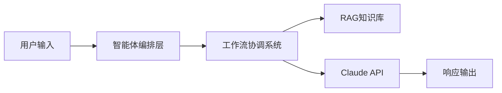
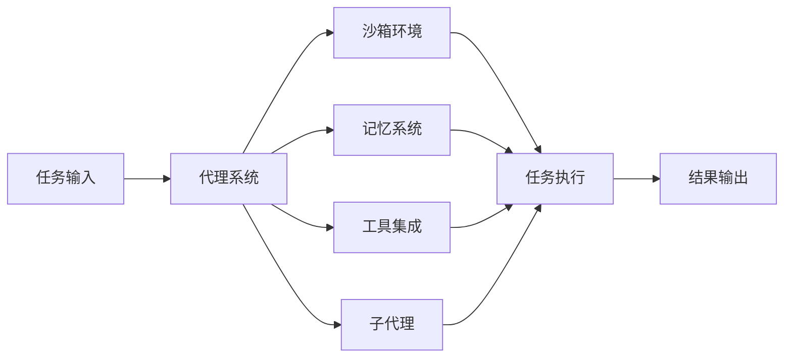
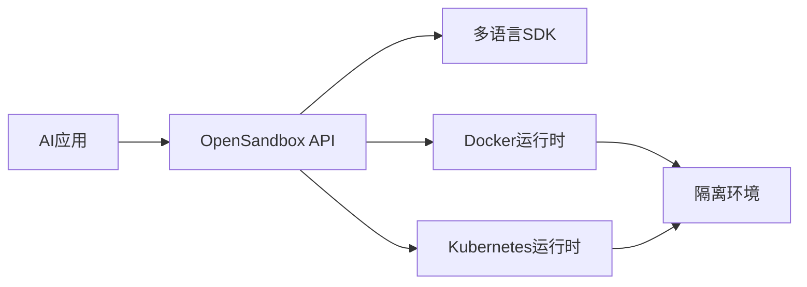

## 今日热点

AI代理和工具生态爆发式增长，Claude相关框架引领潮流，同时LLM应用生态持续繁荣，边缘计算与特殊领域AI应用获得关注。

---

## 热门项目一览

| 排名 | 项目 | 语言 | 今日 | 总计 | 简介 |
|:---:|------|:----:|------:|-----:|------|
| 1 | [ruvnet/wifi-densepose](https://github.com/ruvnet/wifi-densepose) | Rust | +2,152 | 11,200 | Production-ready implementa... |
| 2 | [obra/superpowers](https://github.com/obra/superpowers) | Shell | +1,323 | 65,982 | An agentic skills framework... |
| 3 | [moeru-ai/airi](https://github.com/moeru-ai/airi) | TypeScript | +1,065 | 19,359 | 💖🧸 Self hosted, you-owned G... |
| 4 | [ruvnet/ruflo](https://github.com/ruvnet/ruflo) | TypeScript | +928 | 16,568 | 🌊 The leading agent orchest... |
| 5 | [bytedance/deer-flow](https://github.com/bytedance/deer-flow) | Python | +899 | 22,609 | An open-source SuperAgent h... |
| 6 | [anthropics/claude-code](https://github.com/anthropics/claude-code) | Shell | +699 | 71,852 | Claude Code is an agentic c... |
| 7 | [Shubhamsaboo/awesome-llm-apps](https://github.com/Shubhamsaboo/awesome-llm-apps) | Python | +635 | 98,264 | Collection of awesome LLM a... |
| 8 | [moonshine-ai/moonshine](https://github.com/moonshine-ai/moonshine) | C | +496 | 6,265 | Fast and accurate automatic... |
| 9 | [alibaba/OpenSandbox](https://github.com/alibaba/OpenSandbox) | Python | +349 | 2,169 | OpenSandbox is a general-pu... |
| 10 | [NousResearch/hermes-agent](https://github.com/NousResearch/hermes-agent) | Python | +182 | 1,133 | No description |
| 11 | [superset-sh/superset](https://github.com/superset-sh/superset) | TypeScript | +181 | 2,452 | IDE for the AI Agents Era -... |
| 12 | [Wei-Shaw/claude-relay-service](https://github.com/Wei-Shaw/claude-relay-service) | JavaScript | +171 | 8,688 | CRS-自建Claude Code镜像，一站式开源中转... |

---

## 趋势洞察

```
┌─────────────────────────────────────────────────────────────────┐
│  AI/ML 工具         ████████████████████████  15 个项目        │
│  项目管理             █                         1 个项目        │
│  其他               █                         1 个项目        │
└─────────────────────────────────────────────────────────────────┘
```

---

## 项目深度解读

### 1. ruvnet/wifi-densepose — WiFi姿态追踪系统

> **一句话总结**：基于WiFi的革命性人体姿态估计系统，可通过墙壁实时追踪全身动作，仅需普通网格路由器。

#### 价值主张

| 维度 | 说明 |
|------|------|
| **解决痛点** | 传统视觉追踪系统受遮挡和光线限制，WiFi穿透墙壁实现无摄像头追踪 |
| **目标用户** | 需要隐私保护、非侵入式人体追踪的研究者和开发者 |
| **核心亮点** | 穿墙追踪 + 实时处理 + 商品硬件支持 + 精密姿态估计 + 隐私保护 |

#### 技术架构


**技术特色**：
- 利用WiFi信号反射特征进行人体姿态估计
- 基于Rust实现的高性能信号处理
- 支持穿墙环境的实时姿态追踪

#### 热度分析

- 项目Star数11,200，单日增长2,152，显示近期热度急剧上升
- 零开放Issues表明项目成熟度高，社区可能已迁移至其他渠道

#### 快速上手

```bash
# 克隆仓库
git clone https://github.com/ruvnet/wifi-densepose.git
cd wifi-densepose

# 构建项目
cargo build --release
```

#### 注意事项

- 需要特定的WiFi硬件支持以获得最佳效果
- 可能需要校准环境以适应不同场景
- 使用时需考虑数据隐私和合规性问题


### 2. obra/superpowers — 智能开发框架

> **一句话总结**：提供一套实用的智能体技能框架和软件开发方法论，提升开发效率与质量。

#### 价值主张

| 维度 | 说明 |
|------|------|
| **解决痛点** | 解决软件开发缺乏系统方法论和技能框架的问题 |
| **目标用户** | 软件开发者、技术团队、效率追求者 |
| **核心亮点** | 智能体技能框架 + 实用方法论 + 自动化工具 + 高度实践性 + 系统化流程 |

#### 技术架构


**技术特色**：
- 基于 Shell 脚本的轻量级实现方案
- 提供模块化、可定制的开发流程支持
- 高度兼容不同操作系统的设计理念

#### 热度分析

- 项目 Star 数超65k，单日激增1.3k，显示近期获得广泛关注与认可
- 零未解决问题反映项目维护质量高，社区互动积极

#### 快速上手

```bash
# 克隆项目
git clone https://github.com/obra/superpowers.git
cd superpowers
# 初始化框架
./superpowers init
```

#### 注意事项

- 项目许可证信息不明，使用前需确认授权条款
- Shell 脚本可能在某些系统环境中存在兼容性问题
- 建议先阅读项目文档了解完整方法论后再应用


### 3. moeru-ai/airi — [虚拟AI伴侣]

> **一句话总结**：自托管AI伴侣，支持实时语音聊天与游戏交互，打造个性化虚拟角色体验。

#### 价值主张

| 维度 | 说明 |
|------|------|
| **解决痛点** | 提供完全私有化的AI伴侣体验，用户拥有数据控制权和角色定制权 |
| **目标用户** | AI爱好者、虚拟角色爱好者、游戏玩家、技术探索者 |
| **核心亮点** | 自托管私有化 + 实时语音交互 + 多平台支持 + 游戏集成能力 |

#### 技术架构


**技术特色**：
- 基于TypeScript开发，跨平台兼容性强
- 支持实时语音交互，集成先进的语音处理技术
- 模块化设计，支持自定义角色和交互模式

#### 热度分析

- 项目Star数近2万，单日增长超千，显示项目正处于快速上升期
- 社区活跃度高，无开放Issues，表明项目维护状态良好，用户问题解决效率高

#### 快速上手

```bash
# 克隆项目
git clone https://github.com/moeru-ai/airi.git
cd airi

# 使用Docker运行
docker-compose up -d
```

#### 注意事项

- 项目需要一定的技术背景才能正确部署和配置
- 自托管模式需要用户自行维护服务器和数据安全
- 可能需要较强的计算资源来支持AI模型的实时推理


### 4. ruvnet/ruflo — Claude智能体编排平台

> **一句话总结**：Claude智能体编排平台，支持多智能体协同、自主工作流程和对话式AI系统构建。

#### 价值主张

| 维度 | 说明 |
|------|------|
| **解决痛点** | 企业级AI系统中智能体协同与工作流程编排的复杂性挑战 |
| **目标用户** | 企业开发者、AI系统架构师、对话式AI构建团队 |
| **核心亮点** | 多智能体群体部署 + 分布式群体智能 + RAG集成 + 企业级架构 + Claude原生集成 |

#### 技术架构



**技术特色**：
- 分布式群体智能架构设计
- 企业级可扩展性与容错机制
- 原生Claude Code/Codex深度集成

#### 热度分析

- 项目获16.5K星标，单日增长928，社区热度高且呈加速增长态势
- 零开放问题反映项目维护质量高，处于Claude生态编排工具前沿位置

#### 快速上手

```bash
# 克隆仓库
git clone https://github.com/ruvnet/ruflo.git
cd ruflo

# 安装依赖并启动
npm install
npm start
```

#### 注意事项

- 项目License未知，使用前需确认开源许可条款
- 与Claude深度集成，需确保API访问权限和配额充足
- 企业级部署可能需要额外配置和资源规划


### 5. bytedance/deer-flow — 智能代理框架

> **一句话总结**：开源SuperAgent框架，通过多模块协作处理复杂任务，实现从研究到创建的自动化工作流。

#### 价值主张

| 维度 | 说明 |
|------|------|
| **解决痛点** | 自动化处理多步骤、长时间运行的复杂任务，减少人工干预 |
| **目标用户** | 开发者、研究人员和需要自动化工作流的团队 |
| **核心亮点** | 沙箱隔离环境 + 记忆系统 + 工具集成 + 子代理架构 |

#### 技术架构



**技术特色**：
- 多层次代理架构，支持复杂任务分解与并行处理
- 沙箱环境确保安全执行，隔离潜在风险
- 记忆系统支持长期任务上下文保持

#### 热度分析

- 项目热度持续攀升，单日新增近千星，表明社区认可度高
- 作为字节跳动开源项目，在企业级AI应用领域具有重要影响力

#### 快速上手

```bash
# 克隆项目
git clone https://github.com/bytedance/deer-flow.git
cd deer-flow

# 安装依赖
pip install -r requirements.txt

# 运行示例
python examples/basic_task.py
```

#### 注意事项

- 项目依赖可能需要较新的Python版本和硬件资源
- 沙箱环境的安全配置需根据实际使用场景调整
- 长时间运行任务可能需要配置资源监控和限制


### 6. anthropics/claude-code — AI编程助手

> **一句话总结**：Claude Code是终端内的AI编程助手，能理解代码库并通过自然语言命令加速开发流程。

#### 价值主张

| 维度 | 说明 |
|------|------|
| **解决痛点** | 简化编程任务，减少重复代码工作，提高代码理解和维护效率 |
| **目标用户** | 开发者，特别是需要频繁处理代码库和git工作流程的开发者 |
| **核心亮点** | 自然语言交互 + 代码理解能力 + 终端集成 + 自动化常规任务 + Git工作流处理 |

#### 技术架构


**技术特色**：
- Shell脚本实现轻量级终端交互
- 集成Claude AI模型进行代码理解与生成
- 通过自然语言处理实现开发者友好的交互方式
- 无缝集成到现有开发工作流中

#### 热度分析

- 项目获得71,852个星标，且每日新增近700个，表明开发者社区对AI编程工具有极高需求
- 作为Anthropic官方项目，其在AI编程工具领域具有显著影响力，成为开发者的热门选择

#### 快速上手

```bash
# 安装Claude Code
curl -fsSL https://claude.ai/install.sh | bash

# 初始化并开始使用
claude-code init
claude-code "解释这个函数的功能"
```

#### 注意事项

- 需要Anthropic API密钥才能使用AI功能
- 可能需要稳定的网络连接以与Claude AI服务通信
- 对于大型代码库，首次分析可能需要较长时间
- 代码生成建议仍需人工审核，不能完全替代开发者的判断


### 7. Shubhamsaboo/awesome-llm-apps — LLM应用大全

> **一句话总结**：精选LLM应用集合，涵盖AI代理与RAG系统，支持多平台模型实现。

#### 价值主张

| 维度 | 说明 |
|------|------|
| **解决痛点** | 整合分散的LLM应用资源，解决开发者寻找优质AI应用案例的困难 |
| **目标用户** | AI开发者、研究人员和企业技术决策者 |
| **核心亮点** | 多平台模型支持 + 分类清晰 + 实用案例丰富 + 持续更新 |

#### 技术架构


**技术特色**：
- 跨平台兼容性，支持OpenAI、Anthropic、Gemini等主流模型
- 涵盖RAG技术实现，增强知识检索能力
- 包含多种AI代理架构实现案例

#### 热度分析

- 项目Star数近10万，日均增长600+，表明LLM应用领域高度关注
- 作为资源集合型项目，在AI开发社区具有重要参考价值

#### 快速上手

```bash
# 克隆项目到本地
git clone https://github.com/Shubhamsaboo/awesome-llm-apps.git

# 浏览README.md获取分类目录
cat awesome-llm-apps/README.md

# 根据需求查看具体应用分类目录
ls awesome-llm-apps/
```

#### 注意事项

- 项目作为资源集合，实际应用需要参考具体项目文档
- 部分应用可能需要API密钥或特定环境配置
- 注意各项目的许可证兼容性


### 8. moonshine-ai/moonshine — 边缘语音识别引擎

> **一句话总结**：专为边缘设备设计的高性能、低资源消耗的实时语音识别解决方案。

#### 价值主张

| 维度 | 说明 |
|------|------|
| **解决痛点** | 边缘设备上实现低延迟、高精度的语音识别需求 |
| **目标用户** | 嵌入式开发者、IoT设备制造商、语音应用开发者 |
| **核心亮点** | 轻量化设计 + 实时处理 + 高准确率 + 低资源占用 |

#### 技术架构


**技术特色**：
- 基于C语言实现，轻量级适合边缘设备
- 优化的神经网络模型，平衡准确率和资源消耗
- 实时处理能力，低延迟语音识别

#### 热度分析

- 项目获得6265星，单日增长496，显示快速增长趋势
- 零开放问题表明项目维护良好，社区参与度可能集中在讨论和PR中

#### 快速上手

```bash
# 克隆仓库
git clone https://github.com/moonshine-ai/moonshine.git
cd moonshine

# 编译并运行示例
make && ./moonshine_example
```

#### 注意事项

- 由于项目许可证未知，商业使用前需确认许可证类型
- 边缘设备部署可能需要根据具体硬件调整模型参数
- 项目文档可能不够完善，需要参考源码和示例


### 9. alibaba/OpenSandbox — AI应用沙盒平台

> **一句话总结**：OpenSandbox是支持多语言和多种运行时的通用AI应用沙盒平台，提供统一的安全执行环境。

#### 价值主张

| 维度 | 说明 |
|------|------|
| **解决痛点** | 为AI应用提供安全隔离的执行环境，解决代码安全和资源隔离问题 |
| **目标用户** | AI开发者、研究人员、需要安全执行代码的AI系统构建者 |
| **核心亮点** | 多语言SDK支持 + Docker/Kubernetes运行时 + 统一API接口 + 多场景适用性 |

#### 技术架构



**技术特色**：
- 支持多语言SDK，降低集成门槛
- 基于容器技术的隔离执行环境
- 提供统一的API接口，简化使用流程

#### 热度分析

- 项目近期增长迅速，单日新增Star数达349，表明社区关注度快速提升
- 作为阿里巴巴开源项目，在AI和容器技术领域具有较强影响力，生态位置优越

#### 快速上手

```bash
# 安装OpenSandbox Python SDK
pip install opensandbox

# 基本使用示例
from opensandbox import Sandbox
sandbox = Sandbox()
result = sandbox.execute(code="print('Hello, OpenSandbox!')")
print(result)
```

#### 注意事项

- 需要确保Docker或Kubernetes环境已正确配置
- 注意资源限制和安全策略配置，防止资源滥用
- 项目License信息不明确，使用前需确认开源协议


### 10. NousResearch/hermes-agent — 智能代理框架

> **一句话总结**：基于Python的AI智能代理框架，提供多模态交互与自主决策能力。

#### 价值主张

| 维度 | 说明 |
|------|------|
| **解决痛点** | 简化复杂AI代理系统的开发流程，降低技术实现门槛 |
| **目标用户** | AI研究人员、开发者、构建智能应用的企业团队 |
| **核心亮点** | 多模态交互能力 + 自主决策机制 + 模块化架构 + 可扩展设计 |

#### 技术架构


**技术特色**：
- 采用模块化设计，便于扩展和维护
- 支持多模态数据处理，增强交互灵活性
- 实现自主决策机制，减少人工干预

#### 热度分析

- 项目近期获得显著关注，单日增长182星，表明创新价值受到认可
- 社区活跃度高，但开源生态尚处于早期发展阶段

#### 快速上手

```bash
# 安装依赖
pip install -r requirements.txt

# 运行示例
python examples/basic_agent.py
```

#### 注意事项
- 项目文档尚不完善，部分API可能不够稳定
- 需要一定的AI和机器学习基础才能充分利用项目功能
- 许可证信息不明确，商业使用前需确认授权条款


### 11. superset-sh/superset — AI代理IDE

> **一句话总结**：面向AI时代的一体化开发环境，支持同时运行多个AI助手，大幅提升开发效率。

#### 价值主张

| 维度 | 说明 |
|------|------|
| **解决痛点** | 解决单一AI助手功能局限，实现多AI助手协同工作 |
| **目标用户** | 需要高效AI辅助的软件开发者与研究人员 |
| **核心亮点** | 多AI助手并行运行 + 本地部署保护隐私 + AI时代专用IDE界面 |

#### 技术架构


**技术特色**：
- 基于TypeScript构建，提供类型安全保证
- 支持Claude Code、Codex等多种AI助手
- 本地部署架构，确保数据隐私安全

#### 热度分析

- 近期star增长显著，单日新增181星，显示社区关注度快速提升
- 零issue反映项目早期阶段或问题处理高效，社区生态有待完善

#### 快速上手

```bash
# 克隆项目
git clone https://github.com/superset-sh/superset.git
# 安装依赖
npm install
# 启动应用
npm start
```

#### 注意事项

- 项目处于早期阶段，API和功能可能不稳定
- 需要确保本地环境支持运行AI助手
- 可能需要相应的API密钥或订阅才能使用某些AI服务


### 12. Wei-Shaw/claude-relay-service — AI服务中转平台

> **一句话总结**：开源多AI服务中转平台，支持拼车共享，统一接入Claude、OpenAI等AI服务。

#### 价值主张

| 维度 | 说明 |
|------|------|
| **解决痛点** | 解决多个AI服务独立订阅成本高，使用体验不统一的问题 |
| **目标用户** | 需要使用多个AI服务但希望降低成本的技术爱好者和小团队 |
| **核心亮点** | 多服务统一接入 + 拼车共享功能 + 原生工具支持 + 开源免费 |

#### 技术架构


**技术特色**：
- 基于Node.js构建，轻量高效
- 支持多AI服务API统一封装
- 实现请求转发和响应处理机制
- 提供拼车共享和负载均衡功能

#### 热度分析

- 项目Star数接近9k，日均增长约170，热度持续攀升
- 社区活跃度高，Fork数超过1.3k，表明有大量用户部署和二次开发

#### 快速上手

```bash
# 克隆项目
git clone https://github.com/Wei-Shaw/claude-relay-service.git

# 安装依赖并启动
npm install && npm start
```

#### 注意事项

- 需要自行配置API密钥和AI服务账号
- 拼车共享功能需要注意数据隐私和安全问题
- 项目许可证未知，商业使用前需确认授权方式


### 13. datagouv/datagouv-mcp — AI数据连接器

> **一句话总结**：通过MCP协议实现AI聊天机器人与法国国家开放数据平台的直接对话与数据交互。

#### 价值主张

| 维度 | 说明 |
|------|------|
| **解决痛点** | 解决AI系统难以直接访问和分析结构化开放数据的问题 |
| **目标用户** | AI开发者、研究人员和数据分析师 |
| **核心亮点** | MCP协议实现 + 对话式数据检索 + 数据集分析能力 + 法国官方数据源集成 |

#### 技术架构


**技术特色**：
- MCP协议实现标准化AI与数据源交互
- 高效处理大规模开放数据集查询
- 支持复杂条件的数据分析与可视化

#### 热度分析

- 项目Star数达到660且今日增长115，显示出强劲的增长势头，表明社区对AI与开放数据集集成的高度兴趣。
- 作为官方维护的MCP服务器，项目在AI与政府数据融合领域占据重要生态位置，有望成为该领域的标准解决方案。

#### 快速上手

```bash
# 安装项目
pip install datagouv-mcp

# 初始化MCP服务器
datagouv-mcp init

# 启动服务器
datagouv-mcp serve
```

#### 注意事项

- 项目依赖于法国国家开放数据平台的API，需要确保网络连接和API访问权限。
- 作为MCP服务器，需要与支持MCP协议的AI聊天客户端配合使用，才能实现完整的对话式数据交互功能。


### 14. tukaani-project/xz — 高效压缩工具集

> **一句话总结**：XZ Utils提供使用LZMA2算法的高效数据压缩工具，支持高压缩率和多种压缩级别。

#### 价值主张

| 维度 | 说明 |
|------|------|
| **解决痛点** | 提供比gzip和bzip2更高压缩率的压缩工具，特别适合需要节省存储空间的场景 |
| **目标用户** | 系统管理员、软件开发者、数据备份需求者、Linux/Unix用户 |
| **核心亮点** | 使用LZMA2算法 + 支持多线程压缩 + 高压缩比 + 跨平台兼容 + 命令行工具完整 |

#### 技术架构


**技术特色**：
- LZMA2算法提供超高压缩率，优于传统gzip和bzip2
- 支持多线程压缩，提高大文件处理速度
- 完整的错误检测和恢复机制，确保数据完整性

#### 热度分析

- 项目获得1232个星标，近期增长107个，表明开发者社区对其认可度高
- 作为基础工具软件，在Linux发行版中广泛应用，是开源生态系统的重要组件

#### 快速上手

```bash
# 压缩文件
xz filename

# 解压文件
unxz filename.xz

# 压缩并指定压缩级别(-0到-9)
xz -6 filename
```

#### 注意事项

- 压缩速度较慢，适合对存储空间敏感但对压缩时间要求不高的场景
- 对于小文件，压缩效果可能不明显，甚至可能增加文件大小
- 解压速度比压缩速度快，但相比gzip仍较慢


### 15. Wei-Shaw/sub2api — AI订阅中转

> **一句话总结**：一站式开源中转服务，统一接入多个AI平台订阅，支持拼车共享分摊成本。

#### 价值主张

| 维度 | 说明 |
|------|------|
| **解决痛点** | 解决多个AI服务订阅分散、成本高的问题，提供统一接入方案 |
| **目标用户** | 使用多个AI服务的开发者和企业用户 |
| **核心亮点** | 多平台统一接入 + 订阅拼车共享 + 成本高效分摊 |

#### 技术架构


**技术特色**：
- 基于Go语言开发，性能高效并发处理能力强
- 支持Claude、Openai、Gemini、Antigravity等多平台接入
- 实现智能路由和负载均衡机制

#### 热度分析

- 项目Star数2397且每日增长近百，表明社区认可度高且持续增长
- Fork数459显示开发者积极参与和二次开发，生态活跃

#### 快速上手

```bash
# 克隆项目
git clone https://github.com/Wei-Shaw/sub2api.git
# 安装依赖
go mod download
# 运行服务
go run main.go
```

#### 注意事项

- 注意遵守各AI服务的使用条款，避免违规使用导致账号封禁
- 共享订阅存在账号安全风险，需谨慎选择共享伙伴
- 项目未明确说明许可证，使用前需确认授权条款


### 16. X-PLUG/MobileAgent — 移动端智能代理

> **一句话总结**：强大的移动应用GUI智能代理家族，实现移动端任务自动化执行。

#### 价值主张

| 维度 | 说明 |
|------|------|
| **解决痛点** | 移动应用自动化测试与操作繁琐，需要智能代理简化流程 |
| **目标用户** | 移动应用开发者、测试人员、AI自动化研究人员 |
| **核心亮点** | 多平台支持 + 智能决策能力 + 自适应学习 + 可扩展架构 |

#### 技术架构


**技术特色**：
- 跨平台移动应用兼容性处理机制
- 强化学习驱动的决策优化算法
- 轻量级部署架构设计

#### 热度分析

- 项目获得7,516个星标，今日增长45个，显示出持续的高关注度
- 在移动AI代理领域处于领先地位，社区活跃度高

#### 快速上手

```bash
# 克隆项目
git clone https://github.com/X-PLUG/MobileAgent.git
cd MobileAgent
pip install -r requirements.txt
```

#### 注意事项

- 需要特定的移动设备或模拟器环境支持
- 某些高级功能可能需要额外的API密钥或配置文件
- 建议在使用前详细阅读项目文档了解部署限制


### 17. PaddlePaddle/Paddle — 国产深度学习框架

> **一句话总结**：工业级开源深度学习框架，支持高性能单机与分布式训练，提供全流程开发支持。

#### 价值主张

| 维度 | 说明 |
|------|------|
| **解决痛点** | 提供高性能、易用性强的国产深度学习框架，降低AI开发门槛 |
| **目标用户** | 企业AI团队、研究人员、开发者，特别是中文NLP和CV领域 |
| **核心亮点** | 高性能分布式训练 + 动态图编程 + 丰富的预训练模型库 + 多平台部署支持 |

#### 技术架构


**技术特色**：
- 支持动态图与静态图混合编程，兼顾灵活性和性能
- 自研的并行计算优化技术，提供高效的分布式训练能力
- 丰富的预训练模型库，覆盖CV、NLP等主流领域
- 多平台部署支持，从云端到边缘设备全覆盖
- 完善的中文文档和开发者社区，降低使用门槛

#### 热度分析

- 项目持续稳定增长，Star数已达23,700，近期日增10+，表明社区活跃度高
- 作为国内主流深度学习框架，在中文AI领域具有重要生态地位，与百度飞桨生态紧密相连

#### 快速上手

```bash
# 安装PaddlePaddle
pip install paddlepaddle

# 简单示例
import paddle
import paddle.nn as nn

# 定义一个简单的神经网络
class Net(nn.Layer):
    def __init__(self):
        super(Net, self).__init__()
        self.fc = nn.Linear(784, 10)
    
    def forward(self, x):
        return self.fc(x)

# 创建模型并训练
model = Net()
optimizer = paddle.optimizer.Adam(learning_rate=0.001, parameters=model.parameters())
```

#### 注意事项

- PaddlePaddle虽然支持Windows、Linux和macOS，但在不同平台上的完整体验可能有所差异，建议在Linux环境下获得最佳体验
- 对于生产环境部署，建议使用Paddle Serving或Paddle Lite等官方部署工具，确保模型性能和稳定性
- 项目文档和示例代码主要使用中文，对于不熟悉中文的开发者可能存在一定障碍


## 今日推荐

| 主题 | 推荐项目 | 亮点 |
|------|----------|------|
| 今日最热 | [ruvnet/wifi-densepose](https://github.com/ruvnet/wifi-densepose) | Production-ready ... |
| 值得关注 | [obra/superpowers](https://github.com/obra/superpowers) | An agentic skills... |
| 快速上手 | [moeru-ai/airi](https://github.com/moeru-ai/airi) | 💖🧸 Self hosted, y... |
| 长期潜力 | [ruvnet/ruflo](https://github.com/ruvnet/ruflo) | 🌊 The leading age... |

---

<div align="center">

*Generated on 2026-03-01 | Powered by GitHub Trending Reporter*

</div>