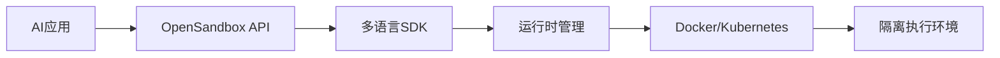
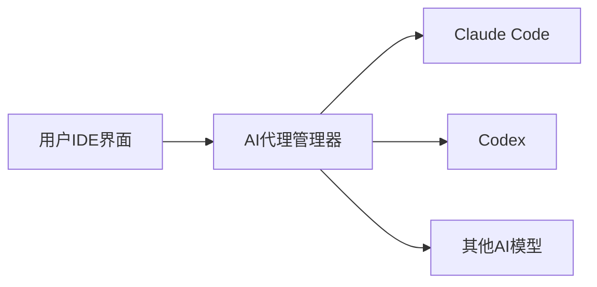
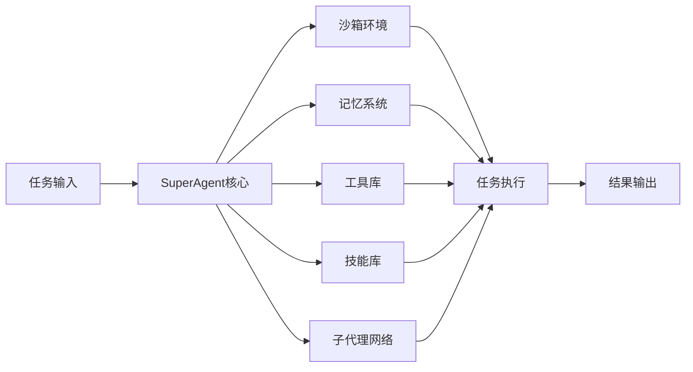
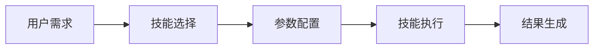

## 今日热点

AI代理生态系统持续火爆，各类代理平台、工具和技能库获得大量关注；同时AI基础设施创新活跃，特别是沙箱环境和文档处理工具备受青睐。

---

## 热门项目一览

| 排名 | 项目 | 语言 | 今日 | 总计 | 简介 |
|:---:|------|:----:|------:|-----:|------|
| 1 | [ruvnet/wifi-densepose](https://github.com/ruvnet/wifi-densepose) | Rust | +4,539 | 17,532 | WiFi DensePose turns commod... |
| 2 | [alibaba/OpenSandbox](https://github.com/alibaba/OpenSandbox) | Python | +1,179 | 3,363 | OpenSandbox is a general-pu... |
| 3 | [microsoft/markitdown](https://github.com/microsoft/markitdown) | Python | +805 | 88,992 | Python tool for converting ... |
| 4 | [ruvnet/ruflo](https://github.com/ruvnet/ruflo) | TypeScript | +766 | 17,318 | 🌊 The leading agent orchest... |
| 5 | [moeru-ai/airi](https://github.com/moeru-ai/airi) | TypeScript | +736 | 20,259 | 💖🧸 Self hosted, you-owned G... |
| 6 | [Shubhamsaboo/awesome-llm-apps](https://github.com/Shubhamsaboo/awesome-llm-apps) | Python | +471 | 98,702 | Collection of awesome LLM a... |
| 7 | [superset-sh/superset](https://github.com/superset-sh/superset) | TypeScript | +389 | 2,884 | IDE for the AI Agents Era -... |
| 8 | [bytedance/deer-flow](https://github.com/bytedance/deer-flow) | Python | +355 | 22,970 | An open-source SuperAgent h... |
| 9 | [NevaMind-AI/memU](https://github.com/NevaMind-AI/memU) | Python | +323 | 12,039 | Memory for 24/7 proactive a... |
| 10 | [X-PLUG/MobileAgent](https://github.com/X-PLUG/MobileAgent) | Python | +190 | 7,699 | Mobile-Agent: The Powerful ... |
| 11 | [K-Dense-AI/claude-scientific-skills](https://github.com/K-Dense-AI/claude-scientific-skills) | Python | +189 | 10,294 | A set of ready to use Agent... |
| 12 | [datawhalechina/hello-agents](https://github.com/datawhalechina/hello-agents) | Python | +147 | 23,842 | 📚 《从零开始构建智能体》——从零开始的智能体原理与实践教程 |

---

## 趋势洞察

```
┌─────────────────────────────────────────────────────────────────┐
│  AI/ML 工具         ████████████████████████  10 个项目        │
│  多媒体应用            ████                      2 个项目        │
│  开发工具             ██                        1 个项目        │
└─────────────────────────────────────────────────────────────────┘
```

---

## 项目深度解读

### 1. ruvnet/wifi-densepose — WiFi姿态感知系统

> **一句话总结**：利用普通WiFi信号进行实时人体姿态和生命体征监测，无需任何视频输入。

#### 价值主张

| 维度 | 说明 |
|------|------|
| **解决痛点** | 解决传统视觉监测的隐私问题和设备依赖，实现无摄像头人体感知 |
| **目标用户** | 智能家居开发者、健康监测应用开发者、隐私敏感场景研究者 |
| **核心亮点** | + 非视觉姿态估计 + 通用WiFi硬件支持 + 实时生命体征监测 + 多目标检测 |

#### 技术架构


**技术特色**：
- 基于WiFi信道状态信息的非侵入式感知
- 深度学习模型驱动的信号解析与人体重建
- 多模态信息融合实现高精度姿态估计

#### 热度分析

- 项目近期爆发式增长，单日新增4539星，表明该技术方向具有突破性创新价值
- 作为前沿交叉领域项目，在IoT与隐私计算生态中占据独特技术位置

#### 快速上手

```bash
# 克隆项目
git clone https://github.com/ruvnet/wifi-densepose.git
cd wifi-densepose

# 运行示例
cargo run --example demo
```

#### 注意事项

- 项目许可证未知，使用前需确认授权条款
- 实际效果受WiFi环境、障碍物和人体位置影响显著
- 需要特定硬件配置和专业知识才能部署应用


### 2. alibaba/OpenSandbox — AI沙盒平台

> **一句话总结**：为AI应用提供多语言SDK和统一API，支持Docker/Kubernetes运行时，确保安全隔离的执行环境。

#### 价值主张

| 维度 | 说明 |
|------|------|
| **解决痛点** | 解决AI应用执行环境安全隔离、多语言支持和资源管理问题 |
| **目标用户** | AI开发者、研究人员、企业技术团队 |
| **核心亮点** | 多语言SDK + 统一API + 多运行时支持 + 场景化适配 |

#### 技术架构



**技术特色**：
- 提供统一抽象层，支持多种编程语言接口
- 支持容器化和Kubernetes两种运行时模式
- 实现资源隔离和安全管理，保护宿主系统
- 适配编码代理、GUI代理等多种AI场景

#### 热度分析

- 项目单日新增Star超1000，增长迅猛，表明社区高度关注
- 作为阿里开源项目，在AI安全和云原生领域具有重要生态价值

#### 快速上手

```bash
# 安装OpenSandbox
pip install opensandbox

# 初始化沙盒环境
opensandbox init

# 运行AI应用
opensandbox run your_ai_app.py
```

#### 注意事项

- 需要预先安装Docker或Kubernetes环境
- 不同语言SDK可能需要额外配置和依赖
- 资源限制和安全性设置应根据实际需求调整
- 项目文档尚不完善，建议参考源码和示例代码进行配置


### 3. microsoft/markitdown — 文档转换器

> **一句话总结**：微软开发的Python工具，可将各类文档和Office文件转换为Markdown格式。

#### 价值主张

| 维度 | 说明 |
|------|------|
| **解决痛点** | 统一不同文档格式为Markdown，解决跨平台内容迁移难题 |
| **目标用户** | 开发者、文档编写者、内容创作者 |
| **核心亮点** | 多格式支持 + 命令行工具 + 保留原始结构 + 微软背书 |

#### 技术架构


**技术特色**：
- 基于Python构建，跨平台兼容性强
- 支持批量处理，提高工作效率
- 通过保留原文档结构确保转换质量

#### 热度分析

- Star数近9万且持续快速增长，表明文档转换工具需求旺盛
- 作为微软开源项目，在企业文档处理领域具有显著影响力

#### 快速上手

```bash
# 安装
pip install markitdown

# 转换单个文件
markitdown input.docx output.md
```

#### 注意事项

- 需要Python 3.7+环境
- 某些复杂格式元素转换可能需要额外处理
- 批量转换大文件时建议监控内存使用情况


### 4. ruvnet/ruflo — 智能代理编排平台

> **一句话总结**：Claude智能代理编排平台，支持多代理协作、自主工作流程和对话式AI系统构建。

#### 价值主张

| 维度 | 说明 |
|------|------|
| **解决痛点** | 简化多代理AI系统部署与编排，降低复杂AI协作系统开发门槛 |
| **目标用户** | 企业开发者、AI研究人员、对话式AI系统构建团队 |
| **核心亮点** | 企业级架构 + 分布式群体智能 + RAG集成 + Claude原生代码集成 |

#### 技术架构


**技术特色**：
- 分布式群体智能架构实现多代理协同工作
- RAG增强知识处理提升回答准确性
- 企业级可扩展设计支持大规模部署

#### 热度分析

- 项目获得17,318 stars且近期增长766，表明社区关注度快速攀升
- 作为Claude生态系统的关键编排工具，处于AI代理领域前沿位置

#### 快速上手

```bash
# 克隆项目
git clone https://github.com/ruvnet/ruflo.git

# 安装依赖
npm install

# 启动服务
npm start
```

#### 注意事项

- 此平台专门针对Claude模型构建，与OpenAI等其他模型不兼容
- 企业级功能可能需要额外配置或付费订阅
- 项目活跃度高，API和配置可能随版本更新而变化，需关注更新日志


### 5. moeru-ai/airi — 虚拟AI伴侣

> **一句话总结**：自托管动漫角色AI系统，支持实时语音互动与多平台游戏操作，打造个性化虚拟生命体验。

#### 价值主张

| 维度 | 说明 |
|------|------|
| **解决痛点** | 提供可自托管、私有的动漫角色AI交互体验，打破商业AI限制 |
| **目标用户** | 动漫爱好者、AI研究者、虚拟现实探索者、游戏玩家 |
| **核心亮点** | 自托管隐私保护 + 实时语音交互 + 多平台支持 + 游戏AI能力 + 角色个性化 |

#### 技术架构


**技术特色**：
- 基于TypeScript构建的全栈应用，确保跨平台兼容性
- 实时语音处理技术，实现低延迟对话体验
- 游戏API集成能力，支持Minecraft和Factorio等游戏操作

#### 热度分析

- 项目Star数突破2万，近期增长显著，日均新增约30个Star，表明项目热度持续攀升
- Fork数量与Star比例约为1:10，显示用户不仅关注项目，更积极参与二次开发与部署

#### 快速上手

```bash
# 克隆项目
git clone https://github.com/moeru-ai/airi.git
cd airi

# 安装依赖并启动
npm install
npm run dev
```

#### 注意事项

- 项目依赖较新的Node.js版本，请确保环境兼容性
- 自托管模式需要一定的技术基础，特别是模型配置和服务器资源管理
- 游戏功能可能需要额外的游戏API密钥或特定游戏版本支持


### 6. Shubhamsaboo/awesome-llm-apps — LLM应用精选库

> **一句话总结**：精选的LLM应用集合，展示如何构建AI代理和RAG系统，整合多种商业及开源模型。

#### 价值主张

| 维度 | 说明 |
|------|------|
| **解决痛点** | 解决开发者在构建LLM应用时寻找参考和灵感的困难，提供高质量实现示例 |
| **目标用户** | AI/ML开发者、研究人员、希望构建LLM应用的技术人员 |
| **核心亮点** | 覆盖多种主流LLM模型 + 提供RAG和AI代理实现 + 包含完整应用示例 |

#### 技术架构


**技术特色**：
- 跨平台兼容多种LLM API和开源模型
- 集成RAG技术提升应用准确性和上下文理解
- 提供完整的端到端解决方案示例

#### 热度分析

- 项目星标数近10万，日增近500，在AI开发资源库中处于领先地位
- 作为LLM应用开发的参考库，已成为该领域开发者的必看资源

#### 快速上手

```bash
# 克隆项目到本地
git clone https://github.com/Shubhamsaboo/awesome-llm-apps.git

# 浏览项目结构，查看不同类别的应用示例
cd awesome-llm-apps
```

#### 注意事项

- 项目本身是资源集合，直接使用需要参考具体应用示例的代码
- 部分应用可能需要相应的API密钥或环境配置
- 随着LLM技术快速发展，部分示例可能需要更新以适应最新模型


### 7. superset-sh/superset — AI代理开发环境

> **一句话总结**：集成多种AI编程助手的下一代IDE，可在本地运行AI代理军团

#### 价值主张

| 维度 | 说明 |
|------|------|
| **解决痛点** | 开发者需同时使用多个AI编程助手，缺乏统一管理平台 |
| **目标用户** | AI辅助编程开发者、多AI工具使用者 |
| **核心亮点** | 多AI代理并行运行 + 本地部署 + 统一管理界面 + AI模型切换 |

#### 技术架构



**技术特色**：
- 基于TypeScript构建，确保类型安全和开发体验
- 支持多种AI模型并行运行，提高开发效率
- 本地部署方案，保障数据隐私和安全

#### 热度分析

- 项目近期Star增长迅速(+389 today)，显示社区对该概念的强烈兴趣
- 虽然Fork数相对较少，但可能表明项目处于早期阶段，用户更倾向于直接使用而非二次开发

#### 快速上手

```bash
# 克隆项目
git clone https://github.com/superset-sh/superset.git
# 安装依赖
npm install
# 启动开发服务器
npm run dev
```

#### 注意事项

- 项目目前没有公开的Issues，可能处于早期阶段，文档和稳定性可能有限
- 本地运行AI模型可能需要较高的硬件配置，特别是处理大型代码库时
- 集成多种AI模型可能需要相应的API密钥或访问权限


### 8. bytedance/deer-flow — 智能代理框架

> **一句话总结**：字节跳动开源的超级代理框架，通过多种组件协作执行复杂的研究、编码和创建任务。

#### 价值主张

| 维度 | 说明 |
|------|------|
| **解决痛点** | 复杂任务自动化处理，解决多步骤、长时间工作的执行难题 |
| **目标用户** | 开发者、研究人员、需要自动化处理复杂任务的专业人士 |
| **核心亮点** | 沙箱环境 + 记忆系统 + 工具集成 + 技能库 + 子代理协作 |

#### 技术架构



**技术特色**：
- 多代理协同处理复杂任务
- 沙箱环境保障安全执行
- 记忆系统增强连续任务处理能力

#### 热度分析

- 项目获得22,970个Star，近期增长355个，表明社区活跃度高，受关注程度持续上升
- 作为字节跳动开源项目，在AI代理领域占据重要生态位置，是AI自动化任务处理的重要参考实现

#### 快速上手

```bash
# 克隆仓库
git clone https://github.com/bytedance/deer-flow.git
cd deer-flow
# 安装依赖
pip install -r requirements.txt
# 运行示例
python examples/basic_agent.py
```

#### 注意事项

- 注意项目依赖的Python版本要求
- 使用沙箱环境时注意资源限制和安全性
- 记忆系统可能需要额外配置以适应特定场景需求


### 9. NevaMind-AI/memU — AI记忆系统

> **一句话总结**：为24/7主动代理提供持久化记忆功能，实现长期对话与任务记忆。

#### 价值主张

| 维度 | 说明 |
|------|------|
| **解决痛点** | 解决AI代理无法长期记忆上下文的问题，保持24/7运行状态下的连续性 |
| **目标用户** | 需要长期记忆能力的AI代理开发者和研究人员 |
| **核心亮点** | 持久化存储 + 上下文管理 + 自动化记忆管理 |

#### 技术架构


**技术特色**：
- 支持AI代理24/7持续运行的记忆系统
- 实现长期对话上下文的保存和检索
- 提供自动化的记忆管理和更新机制

#### 热度分析

- 项目近期增长迅速，单日新增Star超过300，表明社区高度关注
- 作为AI代理记忆系统的代表项目，在AI代理生态中占据重要位置

#### 快速上手

```bash
# 安装依赖
pip install memU

# 基本使用
from memU import MemoryManager
memory = MemoryManager()
memory.add_event("用户交互内容")
context = memory.get_context()
```

#### 注意事项

- 项目许可证未知，商业使用前需确认授权情况
- 项目Open Issues为0，可能表示项目处于早期阶段或问题管理方式特殊


### 10. X-PLUG/MobileAgent — 移动GUI代理框架

> **一句话总结**：MobileAgent是一个强大的移动设备GUI代理家族，能通过自动化操作实现移动应用交互。

#### 价值主张

| 维度 | 说明 |
|------|------|
| **解决痛点** | 解决移动应用自动化测试、交互与控制的难题 |
| **目标用户** | 移动应用开发者、测试工程师、自动化研究人员 |
| **核心亮点** | 多设备支持 + 智能交互 + 视觉理解 + 自动化控制 |

#### 技术架构


**技术特色**：
- 跨平台移动设备适配与控制
- 基于计算机视觉的GUI元素识别
- 智能决策与操作执行系统

#### 热度分析

- 项目Star数7699且持续增长(+190/天)，表明在移动自动化领域受高度关注
- Fork数780显示社区积极参与，适合作为移动应用自动化研究的基础框架

#### 快速上手

```bash
# 克隆项目
git clone https://github.com/X-PLUG/MobileAgent.git
cd MobileAgent

# 安装依赖
pip install -r requirements.txt

# 运行示例
python examples/demo.py
```

#### 注意事项

- 需要确保有适当的设备连接权限
- 可能需要特定环境配置才能正常运行
- 项目许可证信息不明确，使用前需确认授权条款


### 11. K-Dense-AI/claude-scientific-skills — AI专业技能库

> **一句话总结**：为AI代理提供科研、工程、金融等多领域即用型专业技能集合

#### 价值主张

| 维度 | 说明 |
|------|------|
| **解决痛点** | 解决AI代理在专业领域任务执行能力不足的问题 |
| **目标用户** | 研究人员、科学家、工程师、分析师、金融专业人士 |
| **核心亮点** | 即插即用 + 跨领域覆盖 + 专业级任务处理 + 开源可定制 |

#### 技术架构



**技术特色**：
- 模块化设计，技能组件可独立扩展
- 统一接口规范，确保跨技能互操作性
- 专业化处理流程，针对各领域优化

#### 热度分析

- 项目获超10K星标，日均增长189星，社区关注度极高，呈快速增长趋势
- 作为专业AI技能库，填补通用AI与专业领域应用之间的鸿沟，生态位置关键

#### 快速上手

```bash
# 克隆项目
git clone https://github.com/K-Dense-AI/claude-scientific-skills.git

# 安装依赖
pip install -r requirements.txt

# 加载示例技能
python examples/load_skill.py
```

#### 注意事项

- 需确保使用最新版Claude API以获得最佳兼容性
- 部分专业领域技能可能需要额外领域知识或数据支持
- 生产环境使用前应充分测试和验证技能输出质量


### 12. datawhalechina/hello-agents — 智能体教程

> **一句话总结**：从零开始构建智能体的系统化教程，理论与实践相结合的学习资源。

#### 价值主张

| 维度 | 说明 |
|------|------|
| **解决痛点** | 智能体学习路径不清晰，缺乏系统性入门资源 |
| **目标用户** | AI初学者、智能体开发者、研究人员 |
| **核心亮点** | 理论与实践结合 + 系统化学习路径 + 实战项目驱动 |

#### 技术架构


**技术特色**：
- 涵盖智能体核心理论与最新实践
- 提供完整的代码实现与案例解析
- 结合前沿AI技术与实际应用场景

#### 热度分析

- 高关注度项目，Star数超过2.3万且持续稳定增长
- 作为DataWhale社区的核心项目，在智能体学习领域具有重要影响力

#### 快速上手

```bash
# 克隆项目
git clone https://github.com/datawhalechina/hello-agents.git

# 进入项目目录
cd hello-agents
```

#### 注意事项

- 需要具备Python编程基础
- 建议按照章节顺序学习，循序渐进
- 实践部分需要配置相应的AI模型环境


### 13. basecamp/omarchy — 现代Linux发行版

> **一句话总结**：一个注重美观与现代性的Linux定制方案，通过Shell脚本实现简洁高效的系统配置。

#### 价值主张

| 维度 | 说明 |
|------|------|
| **解决痛点** | 解决传统Linux发行版界面老旧、配置复杂的问题 |
| **目标用户** | 追求美观与效率的开发者和Linux爱好者 |
| **核心亮点** | 现代化界面设计+轻量级配置+高度可定制性+简洁优雅 |

#### 技术架构


**技术特色**：
- 基于Shell脚本实现系统配置，无需复杂依赖
- 模块化设计，支持选择性应用特定功能
- 高度可定制，允许用户根据需求调整配置

#### 热度分析

- 项目获得超过2万星，持续稳定增长，表明社区认可度高
- 零开放问题，说明项目维护良好，但可能活跃度有限

#### 快速上手

```bash
# 克隆仓库
git clone https://github.com/basecamp/omarchy.git
# 执行安装脚本
cd omarchy && ./install.sh
```

#### 注意事项

- 这是一个定制化的Linux方案，可能不适用于所有Linux发行版
- 执行前建议备份重要数据，以防配置过程中出现问题


## 今日推荐

| 主题 | 推荐项目 | 亮点 |
|------|----------|------|
| 今日最热 | [ruvnet/wifi-densepose](https://github.com/ruvnet/wifi-densepose) | WiFi DensePose tu... |
| 值得关注 | [alibaba/OpenSandbox](https://github.com/alibaba/OpenSandbox) | OpenSandbox is a ... |
| 快速上手 | [microsoft/markitdown](https://github.com/microsoft/markitdown) | Python tool for c... |
| 长期潜力 | [ruvnet/ruflo](https://github.com/ruvnet/ruflo) | 🌊 The leading age... |

---

<div align="center">

*Generated on 2026-03-02 | Powered by GitHub Trending Reporter*

</div>