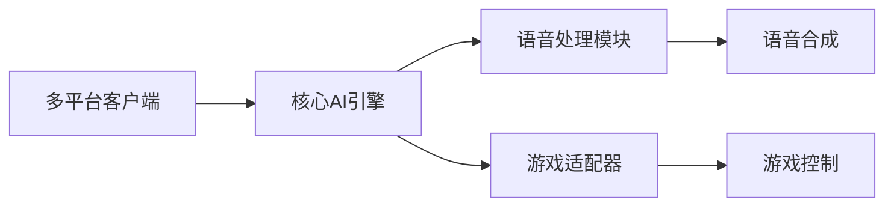
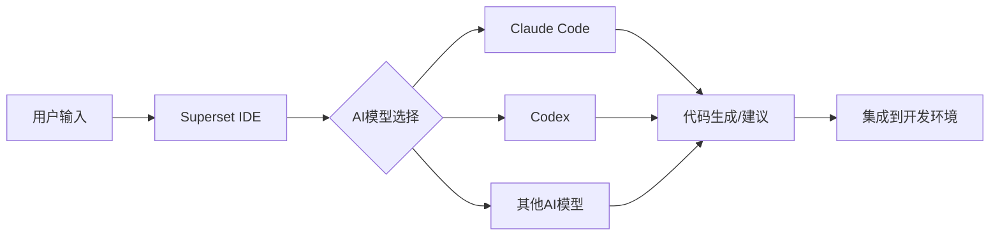
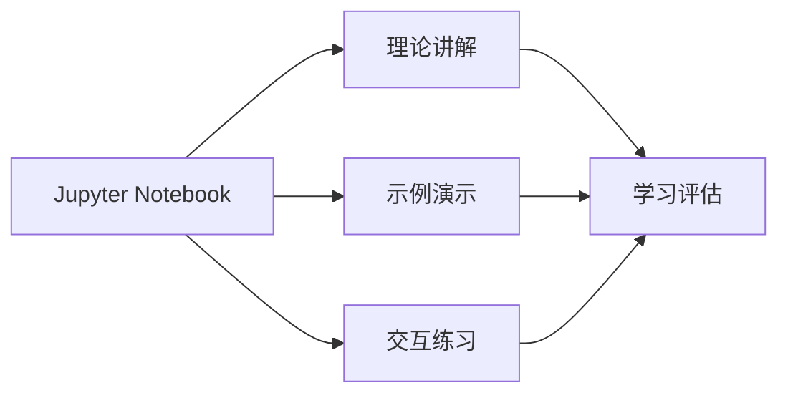

## 今日热点

AI智能体编排与WiFi感知技术引领今日热榜，多群体智能系统与无摄像头人体姿态监测成为焦点。

---

## 热门项目一览

| 排名 | 项目 | 语言 | 今日 | 总计 | 简介 |
|:---:|------|:----:|------:|-----:|------|
| 1 | [ruvnet/wifi-densepose](https://github.com/ruvnet/wifi-densepose) | Rust | +5,096 | 22,025 | WiFi DensePose turns commod... |
| 2 | [moeru-ai/airi](https://github.com/moeru-ai/airi) | TypeScript | +1,412 | 21,412 | 💖🧸 Self hosted, you-owned G... |
| 3 | [alibaba/OpenSandbox](https://github.com/alibaba/OpenSandbox) | Python | +1,026 | 4,330 | OpenSandbox is a general-pu... |
| 4 | [ruvnet/ruflo](https://github.com/ruvnet/ruflo) | TypeScript | +830 | 18,070 | 🌊 The leading agent orchest... |
| 5 | [K-Dense-AI/claude-scientific-skills](https://github.com/K-Dense-AI/claude-scientific-skills) | Python | +820 | 11,090 | A set of ready to use Agent... |
| 6 | [microsoft/markitdown](https://github.com/microsoft/markitdown) | Python | +648 | 89,621 | Python tool for converting ... |
| 7 | [superset-sh/superset](https://github.com/superset-sh/superset) | TypeScript | +585 | 3,522 | IDE for the AI Agents Era -... |
| 8 | [anthropics/prompt-eng-interactive-tutorial](https://github.com/anthropics/prompt-eng-interactive-tutorial) | Jupyter Notebook | +526 | 31,602 | Anthropic's Interactive Pro... |
| 9 | [servo/servo](https://github.com/servo/servo) | Rust | +45 | 35,756 | Servo aims to empower devel... |

---

## 趋势洞察

```
┌─────────────────────────────────────────────────────────────────┐
│  AI/ML 工具         ████████████████████████  6 个项目        │
│  多媒体应用            ████                      1 个项目        │
│  开发工具             ████                      1 个项目        │
│  其他               ████                      1 个项目        │
└─────────────────────────────────────────────────────────────────┘
```

---

## 项目深度解读

### 1. ruvnet/wifi-densepose — WiFi人体感知

> **一句话总结**：利用普通WiFi信号实现实时人体姿态估计、生命体征监测和存在检测的创新技术。

#### 价值主张

| 维度 | 说明 |
|------|------|
| **解决痛点** | 解决无需摄像头的人体活动监测问题，保护隐私同时实现精准感知 |
| **目标用户** | 隐私敏感场景研究机构、智能家居开发者、健康监测产品厂商 |
| **核心亮点** | + 无视觉感知 + 实时监测 + 隐私保护 + 商品级硬件 + 开源实现 |

#### 技术架构


**技术特色**：
- 利用WiFi信道状态信息(CSI)进行高精度人体活动感知
- 基于Rust的高性能信号处理 pipeline，确保低延迟实时分析
- 创新的无线信号特征提取算法，突破传统感知技术局限

#### 热度分析

- 项目Star数快速增长，单日新增5,096星，显示无线感知技术领域热度激增
- 作为隐私计算与物联网交叉创新项目，在学术和工业界均有重要参考价值

#### 快速上手

```bash
# 克隆项目仓库
git clone https://github.com/ruvnet/wifi


### 2. moeru-ai/airi — AI虚拟伴侣

> **一句话总结**：自托管二次元AI伴侣，支持实时语音交互与游戏控制，打造个性化虚拟陪伴体验。

#### 价值主张

| 维度 | 说明 |
|------|------|
| **解决痛点** | 提供不受第三方控制的私有化AI伴侣，保护用户隐私与个性化体验 |
| **目标用户** | 动漫爱好者、AI开发者、寻求虚拟交互体验的科技用户 |
| **核心亮点** | 自托管架构 + 实时语音交互 + 多平台支持 + 游戏能力 + 角色扮演 |

#### 技术架构



**技术特色**：
- TypeScript全栈开发确保跨平台兼容性
- 自托管架构保障数据主权与隐私安全
- 模块化设计支持功能扩展与定制

#### 热度分析

- 项目Star数超2万且单日激增1,412，显示高度社区关注与快速成长趋势
- 零Open Issues表明维护质量高，用户问题可能通过社区其他渠道解决

#### 快速上手

```bash
# 克隆仓库
git clone https://github.com/moeru-ai/airi.git
cd airi

# 安装依赖并运行
npm install && npm start
```

#### 注意事项

- 自托管需要一定的技术基础和服务器资源
- 项目许可信息不明确，使用前需确认授权条款
- 实时语音功能可能需要额外的硬件支持和配置


### 3. alibaba/OpenSandbox — AI应用沙盒平台

> **一句话总结**：为AI应用提供通用沙盒环境，支持多语言SDK和容器化运行时，保障安全执行。

#### 价值主张

| 维度 | 说明 |
|------|------|
| **解决痛点** | 解决AI应用安全执行环境问题，隔离潜在风险代码 |
| **目标用户** | AI开发者、研究人员、测试人员，特别是需要执行AI生成代码的场景 |
| **核心亮点** | 多语言SDK支持 + 统一API接口 + Docker/Kubernetes运行时 + 适用于多种AI场景 |

#### 技术架构


**技术特色**：
- 提供统一的API接口，简化AI应用与沙盒的交互
- 支持多种编程语言SDK，适应不同开发需求
- 基于Docker/Kubernetes实现，确保隔离性和可扩展性

#### 热度分析

- 项目Star数快速增长，单日增长超千，表明近期获得高度关注
- 作为阿里巴巴开源项目，在AI安全执行领域具有重要生态价值

#### 快速上手

```bash
# 安装OpenSandbox
pip install opensandbox

# 初始化沙盒环境
opensandbox init

# 启动沙盒服务
opensandbox start
```

#### 注意事项

- 许可证信息不明确，使用前需确认开源协议
- 项目无公开Issues，可能社区支持渠道有限
- 作为沙盒系统，需要确保资源隔离的安全性，避免潜在的安全漏洞


### 4. ruvnet/ruflo — Claude智能体编排

> **一句话总结**：企业级Claude智能体编排平台，支持多智能体集群部署与自主工作流协调。

#### 价值主张

| 维度 | 说明 |
|------|------|
| **解决痛点** | 企业级AI应用开发中多智能体协同与工作流编排难题 |
| **目标用户** | 企业AI开发团队、对话式AI系统构建者 |
| **核心亮点** | 多智能体集群部署 + 分布式群体智能 + RAG集成 + Claude原生支持 + 企业级架构 |

#### 技术架构


**技术特色**：
- 分布式智能体集群架构，支持大规模并行处理
- 企业级安全与可扩展性设计
- 原生Claude Code/Codex集成，提升开发效率

#### 热度分析

- Star数高达18,070，单日增长830，显示项目热度持续快速攀升
- Fork数2,004表明社区积极参与二次开发，生态活跃度高

#### 快速上手

```bash
# 克隆项目
git clone https://github.com/ruvnet/ruflo.git
cd ruflo

# 安装依赖
npm install

# 启动项目
npm run dev
```

#### 注意事项

- 项目许可证未知，商业使用前需确认授权条款
- 作为企业级平台，可能需要较高的计算资源支持
- 项目Open Issues为0，可能表示项目处于早期阶段或问题管理方式特殊


### 5. K-Dense-AI/claude-scientific-skills — 专业AI技能集

> **一句话总结**：为Claude提供科研、工程及金融领域专业技能的即用型工具集。

#### 价值主张

| 维度 | 说明 |
|------|------|
| **解决痛点** | 解决AI助手在专业领域缺乏深度技能的问题 |
| **目标用户** | 研究人员、科学家、工程师、分析师及金融专业人士 |
| **核心亮点** | + 即用型专业技能 + 多领域覆盖 + 无缝集成Claude |

#### 技术架构


**技术特色**：
- 模块化设计便于扩展
- 专业领域知识封装
- 与Claude API无缝集成

#### 热度分析

- 项目热度极高，一日新增820 stars，显示专业AI工具需求旺盛
- 社区活跃度高，Fork数与Star数比例合理，说明项目被广泛采用并二次开发

#### 快速上手

```bash
# 安装依赖
pip install -r requirements.txt

# 初始化技能集
python setup.py install

# 在Claude中加载技能
claude --load-skills scientific_skills
```

#### 注意事项

- 需要确保已安装Claude最新版本
- 部分高级功能可能需要API密钥
- 使用前请查看各技能的具体依赖要求


### 6. microsoft/markitdown — 文档格式转换器

> **一句话总结**：Python工具可将各类文件和Office文档高效转换为Markdown格式，简化文档处理流程。

#### 价值主张

| 维度 | 说明 |
|------|------|
| **解决痛点** | 解决不同格式文档统一转换为Markdown的需求，消除格式兼容性问题 |
| **目标用户** | 需要处理多种文档格式的开发者、文档编写者和内容创作者 |
| **核心亮点** | 支持多种文件格式 + 高质量转换 + 保留文档结构 + 易于集成 + 微软官方支持 |

#### 技术架构


**技术特色**：
- 支持多种文件格式解析，包括Office文档
- 智能识别文档结构并转换为对应Markdown语法
- 保留原始文档的格式和层级关系

#### 热度分析

- 项目获得近9万星，显示其在文档转换领域的高认可度和实用价值
- 作为微软开源项目，在开发者社区具有良好声誉，且近期增长稳定

#### 快速上手

```bash
# 安装markitdown
pip install markitdown

# 转换单个文件
markitdown input.docx output.md

# 转换整个目录
markitdown /path/to/documents /path/to/output
```

#### 注意事项

- 需要确保输入文件格式受支持
- 转换结果可能需要手动调整以达到完美效果
- 对于复杂格式或特殊内容的文档，转换可能存在一定限制


### 7. superset-sh/superset — AI智能IDE

> **一句话总结**：为AI代理时代打造的IDE，可在本地运行多个AI编码助手。

#### 价值主张

| 维度 | 说明 |
|------|------|
| **解决痛点** | 集成多个AI编码助手，提供统一的AI辅助编程环境 |
| **目标用户** | 开发者、AI工具使用者、编程爱好者 |
| **核心亮点** | 多AI模型集成 + 本地运行 + 统一界面 + 高效编程 |

#### 技术架构



**技术特色**：
- TypeScript开发，确保类型安全和现代开发体验
- 集成多种AI编码模型，提供多样化选择
- 本地运行，保护代码隐私，减少网络依赖

#### 热度分析

- 项目短期内获得大量关注（单日增加585星），表明AI辅助编程工具市场需求强烈
- 虽然Open Issues为0，但Fork数相对Star数较低，可能处于早期发展阶段，社区互动有待加强

#### 快速上手

```bash
# 克隆项目
git clone https://github.com/superset-sh/superset.git
cd superset

# 安装依赖并启动
npm install
npm start
```

#### 注意事项

- 项目处于早期阶段，API和功能可能不稳定
- 需要配置AI模型访问权限，可能需要API密钥
- TypeScript项目需要Node.js环境支持


### 8. anthropics/prompt-eng-interactive-tutorial — AI提示教程

> **一句话总结**：Anthropic官方交互式教程，通过Jupyter Notebook教授高效AI提示工程技巧。

#### 价值主张

| 维度 | 说明 |
|------|------|
| **解决痛点** | 系统化学习提示工程缺乏实践平台与权威指导 |
| **目标用户** | AI开发者、研究人员及对AI交互感兴趣的技术爱好者 |
| **核心亮点** | 交互式学习 + 实例演示 + 即时反馈 + 实践导向 + 专家指导 |

#### 技术架构



**技术特色**：
- 基于Jupyter Notebook的交互式学习环境
- 理论与实践相结合的教学方法
- 模块化的提示工程知识结构

#### 热度分析

- 项目Star数超3万，日均新增约500，表明提示工程学习需求旺盛
- 作为Anthropic官方教程，在AI生态中具有权威性，成为学习提示工程首选资源

#### 快速上手

```bash
# 克隆项目
git clone https://github.com/anthropics/prompt-eng-interactive-tutorial.git

# 进入项目目录
cd prompt-eng-interactive-tutorial

# 启动Jupyter Notebook
jupyter notebook
```

#### 注意事项

- 需要安装Python和Jupyter环境
- 某些示例可能需要Anthropic API密钥以获得最佳体验
- 建议按顺序完成教程，后续内容可能基于前面的知识点


### 9. servo/servo — Rust Web引擎

> **一句话总结**：基于 Rust 的高性能并行浏览器引擎，提供轻量级 Web 技术嵌入方案。

#### 价值主张

| 维度 | 说明 |
|------|------|
| **解决痛点** | 提供高性能、安全且轻量级的浏览器引擎替代方案 |
| **目标用户** | 需要嵌入 Web 技术的应用开发者、系统级开发者 |
| **核心亮点** | Rust 内存安全 + 并行架构 + 高性能渲染 + 轻量级 |

#### 技术架构


**技术特色**：
- 基于 Rust 语言，内存安全且性能卓越
- 采用并行架构，充分利用多核处理器
- 模块化设计，便于嵌入各种应用场景

#### 热度分析

- 项目 Star 数超过3.5万，持续稳定增长，显示其在开发者社区中有很高认可度
- 作为 Rust 生态系统的标杆项目，对 Web 技术和系统编程领域有重要影响

#### 快速上手

```bash
# 安装依赖
sudo apt-get install git cmake python3 libssl-dev libbz2-dev liblzma-dev

# 克隆仓库
git clone https://github.com/servo/servo
cd servo

# 构建项目
./mach build

# 运行 Servo
./mach run
```

#### 注意事项

- Servo 目前可能不支持所有 Web 标准，某些网站可能无法正常渲染
- 构建过程可能需要较长时间和较大内存，建议在性能较好的机器上编译
- 项目仍在积极开发中，API 可能会有变化


## 今日推荐

| 主题 | 推荐项目 | 亮点 |
|------|----------|------|
| 今日最热 | [ruvnet/wifi-densepose](https://github.com/ruvnet/wifi-densepose) | WiFi DensePose tu... |
| 值得关注 | [moeru-ai/airi](https://github.com/moeru-ai/airi) | 💖🧸 Self hosted, y... |
| 快速上手 | [alibaba/OpenSandbox](https://github.com/alibaba/OpenSandbox) | OpenSandbox is a ... |
| 长期潜力 | [ruvnet/ruflo](https://github.com/ruvnet/ruflo) | 🌊 The leading age... |

---

<div align="center">

*Generated on 2026-03-03 | Powered by GitHub Trending Reporter*

</div>