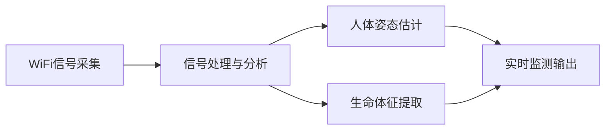
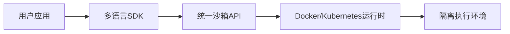
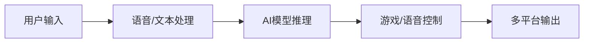
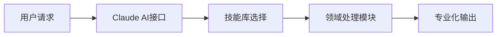
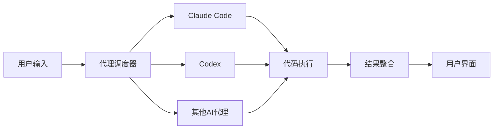
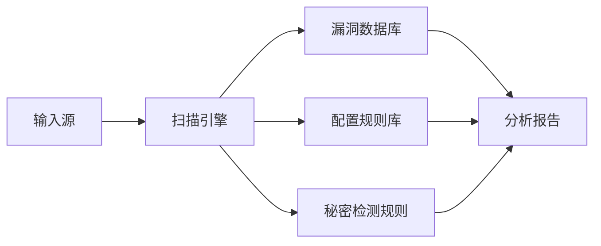
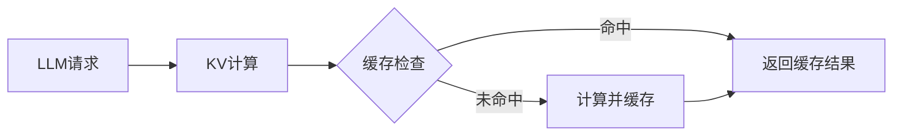
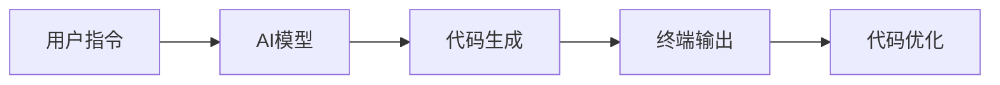
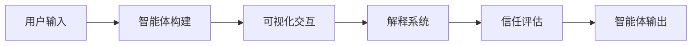
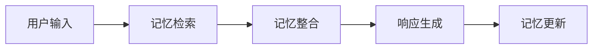

## 今日热点

AI智能体生态建设加速，从开发工具到记忆管理形成完整链条；同时基础设施创新涌现，性能优化与安全可靠性成为焦点。

---

## 热门项目一览

| 排名 | 项目 | 语言 | 今日 | 总计 | 简介 |
|:---:|------|:----:|------:|-----:|------|
| 1 | [ruvnet/RuView](https://github.com/ruvnet/RuView) | Rust | +4,419 | 25,330 | π RuView: WiFi DensePose tu... |
| 2 | [alibaba/OpenSandbox](https://github.com/alibaba/OpenSandbox) | Python | +1,150 | 5,396 | OpenSandbox is a general-pu... |
| 3 | [moeru-ai/airi](https://github.com/moeru-ai/airi) | TypeScript | +832 | 22,170 | 💖🧸 Self hosted, you-owned G... |
| 4 | [K-Dense-AI/claude-scientific-skills](https://github.com/K-Dense-AI/claude-scientific-skills) | Python | +798 | 11,931 | A set of ready to use Agent... |
| 5 | [superset-sh/superset](https://github.com/superset-sh/superset) | TypeScript | +632 | 4,174 | IDE for the AI Agents Era -... |
| 6 | [aquasecurity/trivy](https://github.com/aquasecurity/trivy) | Go | +164 | 544 | Find vulnerabilities, misco... |
| 7 | [LMCache/LMCache](https://github.com/LMCache/LMCache) | Python | +135 | 7,395 | Supercharge Your LLM with t... |
| 8 | [CodebuffAI/codebuff](https://github.com/CodebuffAI/codebuff) | TypeScript | +126 | 3,278 | Generate code from the term... |
| 9 | [agentscope-ai/agentscope](https://github.com/agentscope-ai/agentscope) | Python | +112 | 17,030 | Build and run agents you ca... |
| 10 | [agentscope-ai/ReMe](https://github.com/agentscope-ai/ReMe) | Python | +49 | 1,285 | ReMe: Memory Management Kit... |

---

## 趋势洞察

```
┌─────────────────────────────────────────────────────────────────┐
│  AI/ML 工具         ████████████████████████  9 个项目        │
│  多媒体应用            ██                        1 个项目        │
└─────────────────────────────────────────────────────────────────┘
```

---

## 项目深度解读

### 1. ruvnet/RuView — [WiFi感知技术]

> **一句话总结**：利用普通WiFi信号实现无摄像头人体姿态与生命体征实时监测的创新技术。

#### 价值主张

| 维度 | 说明 |
|------|------|
| **解决痛点** | 解决隐私保护需求下的非视觉人体监测问题 |
| **目标用户** | 注重隐私的家庭用户、智能家居开发者、健康监测应用开发者 |
| **核心亮点** | 无摄像头监测 + 实时姿态估计 + 生命体征提取 + 普通WiFi兼容 |

#### 技术架构



**技术特色**：
- 通过WiFi信号变化分析人体活动
- 无需专用硬件，仅使用商用WiFi设备
- 实时数据处理与反馈机制

#### 热度分析

- 项目星标数超2.5万，单日新增4000+，增长迅猛，表明技术方向受到高度关注
- Fork数高，社区活跃，表明有大量开发者尝试应用和改进该技术

#### 快速上手

```bash
# 克隆仓库
git clone https://github.com/ruvnet/RuView.git

# 构建项目
cd RuView && cargo build --release

# 运行示例
./examples/basic_monitoring
```

#### 注意事项

- 许可证信息不明确，使用前需要确认授权条款
- 可能需要特定的硬件配置才能获得最佳效果
- 技术可能受到环境因素影响，如WiFi信号强度、障碍物等


### 2. alibaba/OpenSandbox — AI应用沙箱平台

> **一句话总结**：OpenSandbox为AI应用提供安全隔离的运行环境，支持多语言SDK和多种运行时场景。

#### 价值主张

| 维度 | 说明 |
|------|------|
| **解决痛点** | AI应用执行环境安全隔离与资源管控问题 |
| **目标用户** | AI开发者、研究人员和企业应用构建者 |
| **核心亮点** | 多语言SDK支持 + 统一API接口 + Docker/Kubernetes运行时 |

#### 技术架构



**技术特色**：
- 支持多种编程语言的SDK集成
- 提供统一的API接口简化开发
- 基于Docker/Kubernetes实现容器化隔离

#### 热度分析

- 项目短期内获得大量关注，今日新增1,150个星标，表明AI沙箱需求旺盛
- 作为阿里巴巴开源项目，在企业级AI应用领域具有重要生态地位

#### 快速上手

```bash
# 克隆项目
git clone https://github.com/alibaba/OpenSandbox.git

# 安装依赖
pip install -r requirements.txt

# 启动服务
python main.py
```

#### 注意事项

- 项目许可证信息未知，使用前需确认开源协议
- 需要Docker/Kubernetes环境支持才能充分利用其功能
- 作为阿里巴巴项目，可能对国内开发者更友好，社区支持可能主要在中文环境


### 3. moeru-ai/airi — [AI虚拟伴侣]

> **一句话总结**：自托管AI虚拟伴侣，支持实时语音交互与游戏，打造动漫角色进入现实世界的桥梁。

#### 价值主张

| 维度 | 说明 |
|------|------|
| **解决痛点** | 提供个性化、可控的AI虚拟伴侣，突破现有AI助手缺乏情感连接的局限 |
| **目标用户** | 动漫爱好者、AI研究者、游戏玩家、虚拟角色粉丝 |
| **核心亮点** | 自托管隐私保护 + 实时语音交互 + 多平台支持 + 游戏AI能力 |

#### 技术架构



**技术特色**：
- 基于TypeScript的全栈开发，确保跨平台兼容性
- 自托管架构保障用户数据隐私与自主控制
- 集成实时语音处理与游戏AI控制能力

#### 热度分析

- 高Star增长率显示项目正在迅速获得开发者与用户关注，日增832 Stars表明社区活跃度极高
- 作为AI虚拟伴侣领域的前沿项目，填补了市场对情感化AI交互的需求空白

#### 快速上手

```bash
# 克隆项目
git clone https://github.com/moeru-ai/airi.git

# 安装依赖
cd airi && npm install

# 启动服务
npm run dev
```

#### 注意事项

- 项目自托管特性需要用户具备一定的技术能力来维护服务
- 由于涉及语音交互和游戏控制，可能需要较高的硬件配置以获得最佳体验
- 项目许可不明确，使用前应确认授权条款


### 4. K-Dense-AI/claude-scientific-skills — AI科学技能库

> **一句话总结**：为Claude AI提供多领域专业即用技能，扩展其在科研、工程等场景的应用能力。

#### 价值主张

| 维度 | 说明 |
|------|------|
| **解决痛点** | 为AI助手提供专业领域技能，解决跨领域应用能力不足问题 |
| **目标用户** | 研究人员、工程师、分析师、金融从业者和内容创作者 |
| **核心亮点** | 预置多领域专业技能 + 模块化设计 + 即插即用 + 高度可扩展 |

#### 技术架构



**技术特色**：
- 技能模块化设计，便于跨领域复用
- 针对科学和工程领域的专业化处理流程
- 统一接口设计，简化集成复杂度

#### 热度分析

- 项目近12K星且单日激增800，显示极高的社区关注度和实用价值
- 零开放问题表明维护良好，用户反馈处理及时，形成健康生态

#### 快速上手

```bash
# 克隆仓库
git clone https://github.com/K-Dense-AI/claude-scientific-skills.git

# 安装依赖
pip install -r requirements.txt
```

#### 注意事项

- 项目许可信息不明确，使用前需确认授权条款
- 需要与Claude AI平台结合使用，不能独立运行
- 技能效果可能受限于Claude AI的基础能力上限


### 5. superset-sh/superset — AI代理开发环境

> **一句话总结**：一个面向AI代理时代的IDE，允许在本地运行多个AI代码助手并协同工作。

#### 价值主张

| 维度 | 说明 |
|------|------|
| **解决痛点** | 单一代理功能有限，多AI代理难以协同工作 |
| **目标用户** | AI开发者、研究人员和多模型协作需求者 |
| **核心亮点** | 多代理并行执行 + 本地化运行 + 统一管理界面 + 安全代码处理 |

#### 技术架构



**技术特色**：
- 多AI代理并行调度框架，提升处理效率
- 本地化执行环境，保障数据安全与隐私
- 统一的API接口，支持多种AI模型无缝集成
- 智能负载均衡，优化资源分配与响应时间

#### 热度分析

- 项目近期增长迅猛，单日新增632个Star，显示社区高度关注
- Fork与Star比例较低(6.5%)，表明项目可能处于早期探索阶段

#### 快速上手

```bash
# 克隆项目
git clone https://github.com/superset-sh/superset.git

# 安装依赖
npm install

# 启动应用
npm run dev
```

#### 注意事项

- 项目尚处于早期阶段，API可能不稳定，建议关注更新
- 需要确保有足够的本地计算资源以支持多个AI代理并行运行
- 注意数据隐私，特别是处理敏感代码时
- 可能需要配置多个AI服务的API密钥


### 6. aquasecurity/trivy — 全方位安全扫描器

> **一句话总结**：Trivy是跨平台安全扫描工具，可检测容器、K8s、代码库中的漏洞、配置错误和敏感信息。

#### 价值主张

| 维度 | 说明 |
|------|------|
| **解决痛点** | 解决DevSecOps中自动化安全扫描痛点，提供统一工具检测多环境安全风险 |
| **目标用户** | DevOps工程师、安全团队、云原生应用开发者和容器化项目维护者 |
| **核心亮点** | 跨平台支持 + 轻量级快速扫描 + 开源免费且易于集成 + 支持漏洞和配置审计 |

#### 技术架构



**技术特色**：
- 基于Go语言开发，轻量级且跨平台兼容
- 集成多个漏洞数据库(NVD、GitHub Advisory等)
- 支持离线扫描和增量扫描，提高效率

#### 热度分析

- 项目Star数快速增长，今日新增164个Star，表明社区关注度持续上升
- 虽然Open Issues为0，但Fork数相对较少，可能处于早期发展阶段或由少数核心开发者维护

#### 快速上手

```bash
# 安装Trivy
wget https://github.com/aquasecurity/trivy/releases/latest/download/trivy_{{version}}_Linux-64bit.tar.gz
tar xzvf trivy_{{version}}_Linux-64bit.tar.gz

# 扫描容器镜像漏洞
./trivy image alpine:latest
```

#### 注意事项

- Trivy依赖外部的漏洞数据库，需要定期更新以确保检测准确性
- 对于大型代码库或容器镜像，扫描可能需要较长时间和较多资源
- 某些高级功能可能需要商业支持或订阅服务


### 7. LMCache/LMCache — LLM KV缓存加速器

> **一句话总结**：LMCache提供最快KV缓存层，显著提升LLM推理速度与资源利用效率。

#### 价值主张

| 维度 | 说明 |
|------|------|
| **解决痛点** | LLM推理过程中KV缓存效率低下，导致计算资源浪费和响应延迟 |
| **目标用户** | 大型语言模型开发者、AI研究员、需要高效LLM推理的工程师 |
| **核心亮点** | 分布式缓存架构 + 高效序列化/反序列化 + 智能缓存替换策略 |

#### 技术架构



**技术特色**：
- 高效的分布式KV缓存架构，支持多节点并行处理
- 优化的序列化/反序列化机制，最小化内存占用
- 智能缓存替换策略，最大化缓存命中率

#### 热度分析

- 项目Star数7395且每日稳定增长(+135 today)，表明社区高度认可其技术价值
- Fork数960且Issues为0，反映项目维护活跃且稳定性高，已形成活跃的开发者社区

#### 快速上手

```bash
# 安装LMCache
pip install lmcache

# 基本使用示例
from lmcache import LMCache
cache = LMCache()
result = cache.get_or_compute("model_input", compute_fn=llm_model.generate)
```

#### 注意事项

- 需要确保与目标LLM框架兼容，可能需要额外适配
- 缓存大小需根据可用内存合理配置，避免资源耗尽
- 分布式部署时需考虑网络延迟对整体性能的影响


### 8. CodebuffAI/codebuff — 终端代码生成器

> **一句话总结**：AI驱动的终端代码生成工具，通过命令行快速创建代码片段

#### 价值主张

| 维度 | 说明 |
|------|------|
| **解决痛点** | 解决手动编写重复代码的低效问题，提升开发效率 |
| **目标用户** | 开发者、程序员、编码初学者 |
| **核心亮点** | 终端操作 + AI代码生成 + 快速实现 + 类型安全 |

#### 技术架构



**技术特色**：
- 基于TypeScript构建，保证代码质量与类型安全
- 终端命令行界面，无缝集成开发工作流
- 集成AI代码生成能力，支持多种编程语言

#### 热度分析

- 项目Star数3,278且今日新增126，表明近期关注度快速增长
- Fork数422，社区参与度适中，项目处于活跃迭代阶段

#### 快速上手

```bash
# 安装Codebuff
npm install -g codebuff

# 使用Codebuff生成代码
codebuff generate "创建一个React组件"
```

#### 注意事项

- 需要确保系统已安装Node.js环境
- 生成的代码可能需要人工审核和调整
- 项目许可证信息不明确，使用前需确认授权条款


### 9. agentscope-ai/agentscope — AI智能体框架

> **一句话总结**：构建可见、可理解、可信任的AI智能体开发与运行平台。

#### 价值主张

| 维度 | 说明 |
|------|------|
| **解决痛点** | 解决AI智能体开发中的透明度、可解释性和信任度问题 |
| **目标用户** | AI开发者、研究人员和企业构建可靠AI智能体 |
| **核心亮点** | 可视化交互 + 可解释性 + 信任机制 + 多智能体协作 |

#### 技术架构



**技术特色**：
- 智能体可视化技术，使AI行为透明可观察
- 内置解释系统，增强AI决策可理解性
- 信任评估机制，确保AI行为可靠可信
- 支持多智能体协作与通信

#### 热度分析

- 项目Star数超17,000，近期增长稳定，表明社区认可度高
- Fork数适中，显示项目被广泛使用和二次开发
- 0个Open Issues，可能表明项目维护良好或问题处理高效

#### 快速上手

```bash
# 安装agentscope
pip install agentscope

# 创建第一个智能体
agentscope init my_agent

# 运行智能体
agentscope run my_agent
```

#### 注意事项

- 需要Python 3.7或更高版本
- 建议在使用前阅读官方文档以了解完整功能
- 项目可能需要额外的配置才能完全发挥其可视化功能


### 10. agentscope-ai/ReMe — 智能体记忆管理

> **一句话总结**：为AI智能体提供高效记忆管理与优化能力，增强长期对话连贯性与上下文理解。

#### 价值主张

| 维度 | 说明 |
|------|------|
| **解决痛点** | AI智能体缺乏长期记忆能力，难以维持复杂对话上下文连贯性 |
| **目标用户** | 开发AI代理、对话系统、个性化助手的研究人员和开发者 |
| **核心亮点** | 高效记忆检索 + 动态记忆优化 + 多模态记忆支持 |

#### 技术架构



**技术特色**：
- 多层次记忆结构，支持短期和长期记忆分离管理
- 动态记忆权重调整，优化关键信息检索效率
- 记忆压缩与摘要技术，控制记忆增长与性能平衡

#### 热度分析

- 项目获得1285星且近期增长迅速，表明AI智能体记忆管理领域需求旺盛
- 零开放问题反映项目维护良好，社区参与度有待提升

#### 快速上手

```bash
# 安装ReMe
pip install agentscope-reme

# 基本使用示例
from agentscope import Agent, Memory

agent = Agent("Assistant", memory=Memory())
agent.chat("你好，我是你的AI助手")
```

#### 注意事项

- 记忆系统可能需要针对不同应用场景进行参数调优
- 大规模部署时需考虑记忆存储的扩展性和性能优化


## 今日推荐

| 主题 | 推荐项目 | 亮点 |
|------|----------|------|
| 今日最热 | [ruvnet/RuView](https://github.com/ruvnet/RuView) | π RuView: WiFi De... |
| 值得关注 | [alibaba/OpenSandbox](https://github.com/alibaba/OpenSandbox) | OpenSandbox is a ... |
| 快速上手 | [moeru-ai/airi](https://github.com/moeru-ai/airi) | 💖🧸 Self hosted, y... |
| 长期潜力 | [K-Dense-AI/claude-scientific-skills](https://github.com/K-Dense-AI/claude-scientific-skills) | A set of ready to... |

---

<div align="center">

*Generated on 2026-03-04 | Powered by GitHub Trending Reporter*

</div>