## 今日热点

AI代理工具与安全检测技术引领今日GitHub热榜，开发者热衷于构建专业AI代理和自动化工具，同时关注应用安全与漏洞检测。

---

## 热门项目一览

| 排名 | 项目 | 语言 | 今日 | 总计 | 简介 |
|:---:|------|:----:|------:|-----:|------|
| 1 | [msitarzewski/agency-agents](https://github.com/msitarzewski/agency-agents) | Unknown | +2,209 | 5,476 | A complete AI agency at you... |
| 2 | [KeygraphHQ/shannon](https://github.com/KeygraphHQ/shannon) | TypeScript | +1,854 | 30,402 | Fully autonomous AI hacker ... |
| 3 | [moeru-ai/airi](https://github.com/moeru-ai/airi) | TypeScript | +1,454 | 24,780 | 💖🧸 Self hosted, you-owned G... |
| 4 | [ItzCrazyKns/Perplexica](https://github.com/ItzCrazyKns/Perplexica) | TypeScript | +1,090 | 30,866 | Perplexica is an AI-powered... |
| 5 | [K-Dense-AI/claude-scientific-skills](https://github.com/K-Dense-AI/claude-scientific-skills) | Python | +940 | 12,730 | A set of ready to use Agent... |
| 6 | [alibaba/OpenSandbox](https://github.com/alibaba/OpenSandbox) | Python | +788 | 5,984 | OpenSandbox is a general-pu... |
| 7 | [agentscope-ai/agentscope](https://github.com/agentscope-ai/agentscope) | Python | +427 | 17,384 | Build and run agents you ca... |
| 8 | [aquasecurity/trivy](https://github.com/aquasecurity/trivy) | Go | +380 | 859 | Find vulnerabilities, misco... |
| 9 | [agentscope-ai/ReMe](https://github.com/agentscope-ai/ReMe) | Python | +345 | 1,625 | ReMe: Memory Management Kit... |
| 10 | [CodebuffAI/codebuff](https://github.com/CodebuffAI/codebuff) | TypeScript | +337 | 3,573 | Generate code from the term... |
| 11 | [FlowiseAI/Flowise](https://github.com/FlowiseAI/Flowise) | TypeScript | +145 | 50,083 | Build AI Agents, Visually |
| 12 | [FujiwaraChoki/MoneyPrinterV2](https://github.com/FujiwaraChoki/MoneyPrinterV2) | Python | +143 | 14,202 | Automate the process of mak... |

---

## 趋势洞察

```
┌─────────────────────────────────────────────────────────────────┐
│  AI/ML 工具         ████████████████████████  11 个项目        │
│  其他               ████                      2 个项目        │
└─────────────────────────────────────────────────────────────────┘
```

---

## 项目深度解读

### 1. msitarzewski/agency-agents — AI代理工厂

> **一句话总结**：提供多种专业AI代理，每个具有独特个性和专业领域，一站式满足多样化AI需求。

#### 价值主张

| 维度 | 说明 |
|------|------|
| **解决痛点** | 简化专业AI代理获取，无需单独训练和部署多个专家模型 |
| **目标用户** | 需要多样化AI能力的开发团队、内容创作者和营销人员 |
| **核心亮点** | 专业领域覆盖广 + 个性交互体验 + 成熟工作流程 |

#### 技术架构

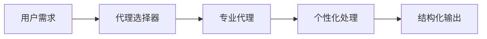

**技术特色**：
- 模块化代理架构，支持领域专家快速部署
- 交互式个性系统，增强用户体验和响应质量
- 标准化工作流程，确保输出一致性和专业性

#### 热度分析

- 项目近期Star激增(+2,209)，显示近期有重大更新或获得广泛关注
- Fork数相对较低，表明项目主要用于直接使用而非二次开发

#### 快速上手

```bash
# 假设的命令行使用示例
agency-agents --agent frontend-wizard --prompt "设计一个现代电商网站"
agency-agents --agent reddit-ninja --prompt "分析Reddit热门话题趋势"
```

#### 注意事项

- 项目编程语言和具体实现细节不明确，需进一步查看源码了解
- 各代理的具体能力和限制需要通过文档或实际测试确认
- 虽然Issues为0，但需确认项目是否持续维护和更新


### 2. KeygraphHQ/shannon — AI漏洞发现工具

> **一句话总结**：全自动AI黑客工具，能在Web应用中实际发现漏洞，成功率高达96.15%。

#### 价值主张

| 维度 | 说明 |
|------|------|
| **解决痛点** | 自动发现Web应用中实际存在的安全漏洞，无需人工干预 |
| **目标用户** | 安全研究员、开发团队、渗透测试人员 |
| **核心亮点** | 全自动AI驱动 + 高成功率96.15% + 实际漏洞发现 |

#### 技术架构

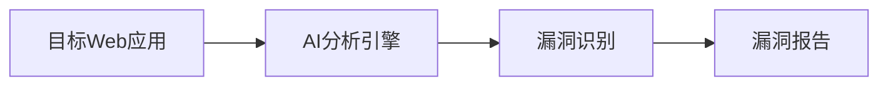

**技术特色**：
- 基于AI的自动化漏洞发现技术
- 高精度的漏洞识别能力，在XBOW基准测试中表现优异
- 无需人工提示或源码信息即可发现漏洞

#### 热度分析

- Star数达30,402且单日增长1,854，表明项目正快速获得安全社区的认可
- 零开放Issues反映了项目的高成熟度和稳定性，可能是企业级工具
- Fork数3,072显示社区活跃度高，有大量用户尝试参与或二次开发

#### 快速上手

```bash
# 安装
npm install -g shannon

# 扫描目标Web应用
shannon scan https://example.com

# 生成报告
shannon report -o findings.json
```

#### 注意事项

- 需要明确使用权限和合法性，确保只在授权范围内使用
- 可能需要依赖大量计算资源，特别是AI模型推理部分
- 由于是AI驱动，可能存在误报或漏报情况，需要人工验证


### 3. moeru-ai/airi — [虚拟AI伴侣]

> **一句话总结**：自托管AI伴侣系统，支持实时语音交互与游戏控制，打造个性化虚拟形象。

#### 价值主张

| 维度 | 说明 |
|------|------|
| **解决痛点** | 提供完全私有的AI交互体验，满足情感陪伴与游戏辅助需求 |
| **目标用户** | AI爱好者、虚拟形象追随者、游戏玩家 |
| **核心亮点** | 自托管控制权 + 实时语音对话 + 多游戏支持 + 跨平台兼容 |

#### 技术架构

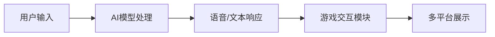

**技术特色**：
- 基于TypeScript构建，确保高质量代码与跨平台兼容性
- 实现低延迟语音处理技术，提供自然流畅的对话体验
- 游戏API深度集成，支持复杂游戏环境下的智能控制

#### 热度分析

- 项目Star数突破2.4万，单日激增1.4千，社区关注度呈爆发式增长
- 零开放Issues表明项目维护完善，用户反馈机制高效，社区参与度高

#### 快速上手

```bash
# 克隆项目
git clone https://github.com/moeru-ai/airi.git

# 安装依赖
npm install

# 启动服务
npm start
```

#### 注意事项

- 项目需要自托管部署，用户需具备基础服务器管理能力
- 语音交互功能推荐使用外接麦克风以获得最佳体验
- 游戏集成功能需配置特定游戏环境和API密钥


### 4. ItzCrazyKns/Perplexica — AI智能问答

> **一句话总结**：基于AI技术的智能问答系统，提供精准、快速的问题解答服务。

#### 价值主张

| 维度 | 说明 |
|------|------|
| **解决痛点** | 解决传统搜索引擎回答不精准、信息过载的问题 |
| **目标用户** | 研究人员、学生及需要快速获取信息的普通用户 |
| **核心亮点** | AI驱动+精准回答+多模态支持+隐私保护+开源免费 |

#### 技术架构

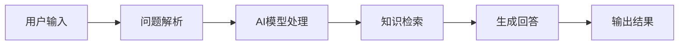

**技术特色**：
- 基于大语言模型的智能理解与回答能力
- 多源信息整合与验证机制
- 隐私保护的数据处理方式

#### 热度分析

- 项目在短时间内获得超过3万个stars，日均增长约1000个stars，表明社区对其AI问答能力高度认可
- 作为开源AI问答项目，在AI辅助工具领域占据重要位置，吸引了大量关注AI应用开发的用户参与

#### 快速上手

```bash
# 克隆项目
git clone https://github.com/ItzCrazyKns/Perplexica.git

# 安装依赖
npm install

# 启动服务
npm start
```

#### 注意事项

- 注意依赖的Node.js版本要求
- 使用前需要配置AI服务的API密钥
- 首次运行可能需要下载模型文件，确保有足够的存储空间


### 5. K-Dense-AI/claude-scientific-skills — AI专业技能库

> **一句话总结**：为Claude AI提供研究、科学、工程等专业领域的即用技能，扩展其应用能力。

#### 价值主张

| 维度 | 说明 |
|------|------|
| **解决痛点** | 解决Claude AI在专业领域应用能力不足的问题 |
| **目标用户** | 研究人员、科学家、工程师、分析师、金融专业人士 |
| **核心亮点** | 即插即用 + 专业领域覆盖 + 高度可定制 + 无缝集成Claude生态 |

#### 技术架构

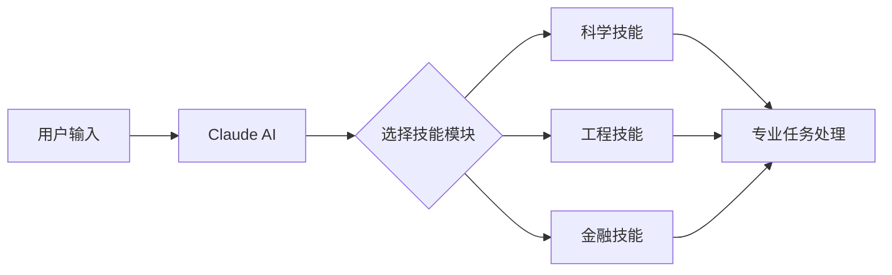

**技术特色**：
- 模块化技能设计，便于扩展和维护
- 与Claude API无缝集成，保持原生体验
- 高度专业化处理流程，确保领域准确性

#### 热度分析

- 项目单日新增940个Star，表明其解决了Claude生态中的明显需求缺口。
- 社区活跃度高，Fork数量适中，说明项目被广泛采用和二次开发。

#### 快速上手

```bash
# 安装科学技能模块
pip install claude-scientific-skills

# 在Claude中使用特定技能
claude --skill scientific-research
```

#### 注意事项

- 需要确保已安装Claude AI并配置好API访问权限
- 项目许可证信息不明确，使用前需确认授权条款
- 不同技能模块可能需要额外的依赖库


### 6. alibaba/OpenSandbox — AI沙盒平台

> **一句话总结**：为AI应用提供多语言支持和容器化隔离环境的通用沙盒执行平台。

#### 价值主张

| 维度 | 说明 |
|------|------|
| **解决痛点** | AI应用在安全隔离环境中执行代码和任务的挑战 |
| **目标用户** | AI开发者、研究人员、需要安全执行AI代理的场景 |
| **核心亮点** | 多语言SDK支持 + Docker/Kubernetes运行时 + 统一API接口 |

#### 技术架构

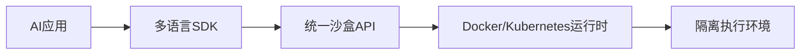

**技术特色**：
- 基于容器技术的安全隔离执行环境
- 统一的API接口简化多语言集成
- 灵活适配编码代理、GUI代理等多种AI场景

#### 热度分析

- 项目近期Star增长迅猛，单日增长788，显示社区高度关注和认可。
- 作为阿里巴巴开源项目，在AI安全执行领域填补了技术空白，具有独特生态价值。

#### 快速上手

```bash
# 克隆仓库
git clone https://github.com/alibaba/OpenSandbox.git

# 安装依赖
pip install -r requirements.txt

# 启动服务
python main.py
```

#### 注意事项

- 项目许可证信息不明确，在使用前需确认开源协议
- 作为沙盒平台，需要配置适当的Docker/Kubernetes环境支持
- 项目目前没有开放的Issue，可能使用其他渠道提供技术支持


### 7. agentscope-ai/agentscope — 可解释AI代理平台

> **一句话总结**：提供可解释、可理解、可信任的AI代理构建与运行框架。

#### 价值主张

| 维度 | 说明 |
|------|------|
| **解决痛点** | 解决AI代理黑盒问题，提供透明可信的智能体交互体验 |
| **目标用户** | AI开发者、研究人员和企业应用构建者 |
| **核心亮点** | 可解释性 + 可视化交互 + 可控性 + 信任机制 |

#### 技术架构

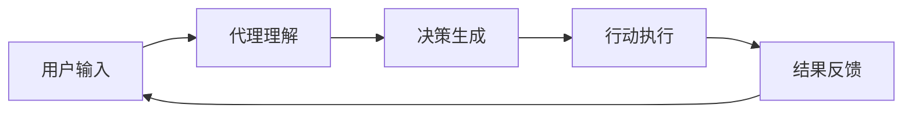

**技术特色**：
- 基于大语言模型的智能体架构
- 可解释的决策路径可视化
- 代理行为监控与审计机制
- 多代理协作框架

#### 热度分析

- 项目获得17,384个Star且持续增长(+427 today)，表明在AI代理领域热度高
- Fork数1,549显示社区积极参与和二次开发意愿强，Issue数为0反映项目稳定性高

#### 快速上手

```bash
# 安装依赖
pip install agentscope

# 初始化代理配置
agentscope init my-agent

# 启动代理
agentscope run my-agent
```

#### 注意事项

- 需要明确项目许可证信息以确保合规使用
- 可能需要大语言模型API密钥才能充分利用功能
- 项目处于活跃开发阶段，API可能会有变化


### 8. aquasecurity/trivy — 全方位安全扫描工具

> **一句话总结**：一款开源的安全扫描工具，可快速检测容器、Kubernetes、代码库和云环境中的漏洞、配置错误和敏感信息。

#### 价值主张

| 维度 | 说明 |
|------|------|
| **解决痛点** | 统一扫描多种环境和组件中的安全漏洞和配置问题，简化安全检测流程 |
| **目标用户** | DevOps团队、安全工程师、容器平台管理员、云架构师 |
| **核心亮点** | 支持多环境扫描 + 高性能扫描速度 + 丰富的漏洞数据库 + 非侵入式 + 开源免费 |

#### 技术架构

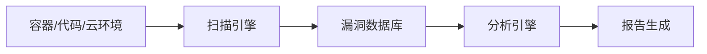

**技术特色**：
- 使用Go语言开发，提供高性能跨平台二进制文件
- 支持多种扫描模式（文件系统、容器镜像、Git仓库、Kubernetes等）
- 集成多个漏洞数据库（CVE、NVD、GitHub Advisory等）

#### 热度分析

- 项目在短时间内获得859个Star，单日增长380，表明项目近期获得高度关注，可能是因为新增重要功能或解决了关键安全问题
- 作为安全工具，在DevOps和容器化应用快速发展的背景下，具有广阔的应用前景和社区发展潜力

#### 快速上手

```bash
# 扫描容器镜像中的漏洞
docker run --rm -v /var/run/docker.sock:/var/run/docker.sock aquasec/trivy image alpine:latest

# 扫描文件系统中的漏洞
trivy fs /path/to/directory

# 扫描Git仓库中的漏洞
trivy repo https://github.com/example/repo
```

#### 注意事项

- 扫描大型容器镜像或代码库可能需要较长时间和较多内存资源
- 需要定期更新漏洞数据库以确保检测结果的准确性
- 对于生产环境使用，建议结合其他安全工具形成纵深防御体系


### 9. agentscope-ai/ReMe — 智能体记忆管理

> **一句话总结**：ReMe为智能体提供高效记忆管理工具，实现长期记忆优化与检索功能。

#### 价值主张

| 维度 | 说明 |
|------|------|
| **解决痛点** | 智能体缺乏有效记忆管理机制，难以长期保持和优化知识 |
| **目标用户** | 需要长期记忆能力的AI智能体开发者和研究人员 |
| **核心亮点** | 模块化记忆架构 + 智能检索机制 + 记忆优化算法 + 轻量级实现 |

#### 技术架构

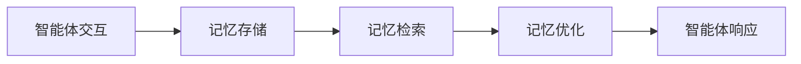

**技术特色**：
- 基于向量存储的记忆系统
- 自适应记忆优化算法
- 支持多种记忆类型管理
- 低内存占用设计

#### 热度分析

- 项目短期内增长迅速，单日新增Star数达345，表明社区高度关注
- 虽Fork数相对较少，但Issue数量为0，说明项目稳定且用户反馈积极

#### 快速上手

```bash
# 安装ReMe
pip install reme

# 基本使用示例
from reme import MemoryManager
memory = MemoryManager()
memory.add("用户偏好", "喜欢科幻电影")
retrieved = memory.query("用户喜欢什么类型的电影")
```

#### 注意事项

- 需要进一步了解项目文档确认具体使用方法
- 项目许可证未知，商业使用前需确认授权情况
- 由于项目Issue数量为0，可能社区支持有限


### 10. CodebuffAI/codebuff — 终端代码生成器

> **一句话总结**：通过AI辅助在终端快速生成各种编程语言的代码片段，提高开发效率。

#### 价值主张

| 维度 | 说明 |
|------|------|
| **解决痛点** | 开发者需要频繁编写重复代码，缺乏快速生成工具 |
| **目标用户** | 命令行爱好者、追求效率的开发者 |
| **核心亮点** | 终端集成 + AI代码生成 + 多语言支持 |

#### 技术架构

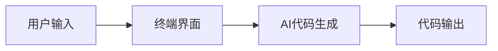

**技术特色**：
- 基于TypeScript构建，确保跨平台兼容性
- 终端集成，无需切换开发环境
- AI驱动，智能理解用户需求

#### 热度分析

- Star数达3573且近期增长337，表明项目获得开发者广泛关注
- Fork数438，显示社区积极参与和二次开发意愿
- 0个开放问题，可能表明项目维护良好或问题解决效率高

#### 快速上手

```bash
# 安装Codebuff
npm install -g codebuff

# 启动并生成代码
codebuff "创建一个React组件"
```

#### 注意事项

- 需要确保系统已安装Node.js环境
- 生成的代码可能需要人工审查和调整
- 免费使用可能有限制，高级功能可能需要订阅


### 11. FlowiseAI/Flowise — AI可视化构建

> **一句话总结**：通过可视化界面拖拽式构建AI代理，降低AI应用开发门槛。

#### 价值主张

| 维度 | 说明 |
|------|------|
| **解决痛点** | 简化AI代理构建流程，无需深入编程即可实现复杂AI功能 |
| **目标用户** | AI开发者、产品经理、研究人员及非技术AI应用构建者 |
| **核心亮点** | 可视化拖拽界面 + 模块化组件设计 + 多模型集成支持 + 低代码开发 |

#### 技术架构

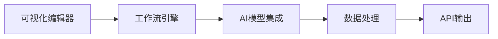

**技术特色**：
- 基于TypeScript开发，确保类型安全与代码质量
- 插件化架构，支持自定义组件和模型扩展
- 提供完整的RESTful API，便于集成到其他系统

#### 热度分析

- 项目Star数超5万且持续增长，在AI工具领域具有显著影响力和用户认可度
- 高Fork数表明社区活跃，用户不仅关注项目也在积极贡献和二次开发

#### 快速上手

```bash
# 克隆项目
git clone https://github.com/FlowiseAI/Flowise.git

# 安装依赖
npm install

# 启动服务
npm start
```

#### 注意事项

- 项目许可证信息不明确，商业使用前需确认授权条款
- 依赖外部AI模型API，使用时需注意成本和调用限制
- 构建复杂AI代理仍需对AI技术有一定理解，非完全无代码解决方案


### 12. FujiwaraChoki/MoneyPrinterV2 — 自动化赚钱工具

> **一句话总结**：基于Python的自动化在线赚钱工具，通过脚本实现多渠道被动收入。

#### 价值主张

| 维度 | 说明 |
|------|------|
| **解决痛点** | 传统赚钱方式效率低，自动化程度不足，难以实现被动收入 |
| **目标用户** | 寻求在线收入来源的普通用户和自由职业者 |
| **核心亮点** | 自动化流程 + 多渠道收入 + 低技术门槛 |

#### 技术架构

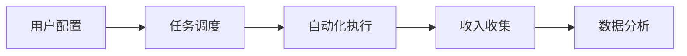

**技术特色**：
- 基于Python脚本实现多种在线赚钱自动化
- 模块化设计支持多种赚钱渠道扩展
- 内置数据统计和分析功能

#### 热度分析

- 项目Star数超14k，日增143，表明热度持续上升，用户需求旺盛
- Fork数达1.4k，社区活跃度高，用户二次开发和定制意愿强

#### 快速上手

```bash
# 克隆项目
git clone https://github.com/FujiwaraChoki/MoneyPrinterV2.git
cd MoneyPrinterV2
pip install -r requirements.txt
python main.py
```

#### 注意事项

- 该项目可能涉及自动化操作，需遵守相关平台的使用条款
- 使用前应了解涉及的法律法规，避免违法行为
- 自动化工具可能存在账号安全风险，建议使用专门账户


### 13. nautechsystems/nautilus_trader — 高性能量化系统

> **一句话总结**：基于Rust构建的事件驱动型量化交易平台，提供低延迟交易与全面回测功能。

#### 价值主张

| 维度 | 说明 |
|------|------|
| **解决痛点** | 传统交易系统性能瓶颈，无法满足高频量化交易需求 |
| **目标用户** | 专业量化交易者、对冲基金、高频交易团队 |
| **核心亮点** | 事件驱动架构 + Rust高性能实现 + 多资产支持 + 完整回测能力 |

#### 技术架构

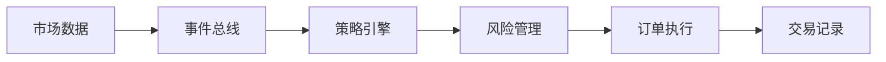

**技术特色**：
- 采用事件驱动架构，实现松耦合的系统设计
- 基于Rust语言构建，提供内存安全和高并发性能
- 支持多种资产类别和交易所，提供统一API接口

#### 热度分析

- 项目Star数超过2万，日均增长约89个，表明在量化交易领域备受关注
- Fork数接近2500，说明开发者社区活跃，有大量二次开发或研究用途
- 0个Open Issues反映项目维护质量高，问题解决及时

#### 快速上手

```bash
# 克隆项目
git clone https://github.com/nautechsystems/nautilus_trader.git

# 构建项目
cd nautilus_trader
cargo build --release
```

#### 注意事项

- 项目基于Rust开发，需要熟悉Rust语言和相关概念
- 系统配置较为复杂，需要一定时间学习才能完全掌握
- 高频交易环境使用前需进行充分测试，确保系统稳定性


## 今日推荐

| 主题 | 推荐项目 | 亮点 |
|------|----------|------|
| 今日最热 | [msitarzewski/agency-agents](https://github.com/msitarzewski/agency-agents) | A complete AI age... |
| 值得关注 | [KeygraphHQ/shannon](https://github.com/KeygraphHQ/shannon) | Fully autonomous ... |
| 快速上手 | [moeru-ai/airi](https://github.com/moeru-ai/airi) | 💖🧸 Self hosted, y... |
| 长期潜力 | [ItzCrazyKns/Perplexica](https://github.com/ItzCrazyKns/Perplexica) | Perplexica is an ... |

---

<div align="center">

*Generated on 2026-03-05 | Powered by GitHub Trending Reporter*

</div>