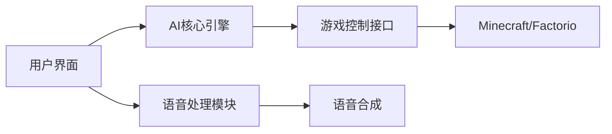
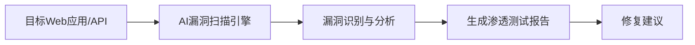
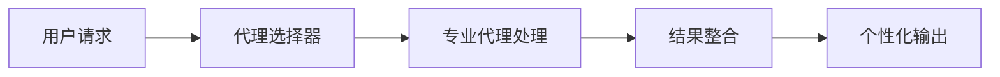
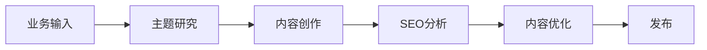
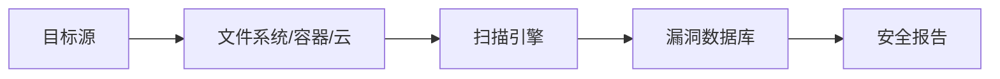
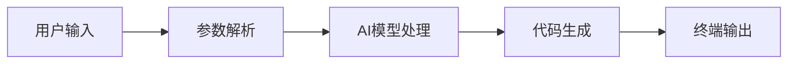
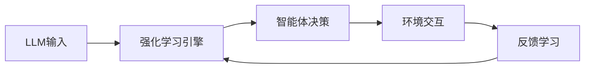
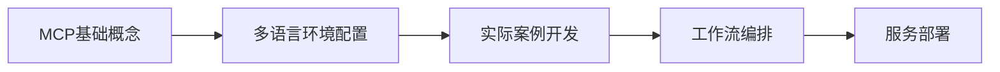
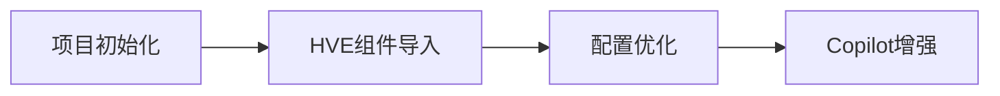

## 今日热点

AI代理专业化与自主工具成为主流，从渗透测试到内容创作，AI正深度垂直于各领域，同时多模态交互与安全测试工具获得高度关注。

---

## 热门项目一览

| 排名 | 项目 | 语言 | 今日 | 总计 | 简介 |
|:---:|------|:----:|------:|-----:|------|
| 1 | [moeru-ai/airi](https://github.com/moeru-ai/airi) | TypeScript | +3,006 | 27,409 | 💖🧸 Self hosted, you-owned G... |
| 2 | [KeygraphHQ/shannon](https://github.com/KeygraphHQ/shannon) | TypeScript | +2,930 | 31,818 | Shannon Lite is a fully aut... |
| 3 | [msitarzewski/agency-agents](https://github.com/msitarzewski/agency-agents) | Unknown | +1,468 | 7,540 | A complete AI agency at you... |
| 4 | [FujiwaraChoki/MoneyPrinterV2](https://github.com/FujiwaraChoki/MoneyPrinterV2) | Python | +511 | 14,699 | Automate the process of mak... |
| 5 | [TheCraigHewitt/seomachine](https://github.com/TheCraigHewitt/seomachine) | Python | +310 | 1,644 | A specialized Claude Code w... |
| 6 | [aquasecurity/trivy](https://github.com/aquasecurity/trivy) | Go | +298 | 32,887 | Find vulnerabilities, misco... |
| 7 | [CodebuffAI/codebuff](https://github.com/CodebuffAI/codebuff) | TypeScript | +275 | 3,871 | Generate code from the term... |
| 8 | [agentscope-ai/ReMe](https://github.com/agentscope-ai/ReMe) | Python | +194 | 1,822 | ReMe: Memory Management Kit... |
| 9 | [inclusionAI/AReaL](https://github.com/inclusionAI/AReaL) | Python | +173 | 4,091 | Lightning-Fast RL for LLM R... |
| 10 | [microsoft/mcp-for-beginners](https://github.com/microsoft/mcp-for-beginners) | Jupyter Notebook | +137 | 14,913 | This open-source curriculum... |
| 11 | [microsoft/hve-core](https://github.com/microsoft/hve-core) | PowerShell | +11 | 303 | A refined collection of Hyp... |

---

## 趋势洞察

```
┌─────────────────────────────────────────────────────────────────┐
│  AI/ML 工具         ████████████████████████  10 个项目        │
│  其他               ██                        1 个项目        │
└─────────────────────────────────────────────────────────────────┘
```

---

## 项目深度解读

### 1. moeru-ai/airi — AI虚拟伴侣

> **一句话总结**：自托管AI虚拟伴侣，支持实时语音交互和游戏操控，打造个性化数字生命体验。

#### 价值主张

| 维度 | 说明 |
|------|------|
| **解决痛点** | 提供可自主控制、隐私保护的AI虚拟伴侣，替代商业AI服务 |
| **目标用户** | AI爱好者、虚拟角色爱好者、游戏玩家、技术开发者 |
| **核心亮点** | 自托管私有化 + 实时语音交互 + 游戏AI控制 + 多平台支持 + 高度可定制 |

#### 技术架构



**技术特色**：
- 基于TypeScript的全栈开发，确保类型安全
- 自托管架构保障用户数据隐私与控制权
- 实时语音交互技术实现自然对话体验

#### 热度分析

- 项目Star数达2.7万，单日增长3000+，表明项目近期热度极高，可能有大V推荐或功能突破
- Fork数相对较低(2588)，说明项目可能偏向使用型而非二次开发型，用户更倾向于直接使用而非修改

#### 快速上手

```bash
# 克隆项目
git clone https://github.com/moeru-ai/airi.git
# 构建并运行
cd airi && docker-compose up -d
```

#### 注意事项

- 项目许可证未知，商业使用前需确认授权方式
- 自托管需要一定的技术基础，特别是容器化部署经验
- 实时语音交互可能需要较好的硬件支持，特别是麦克风和扬声器质量
- 游戏AI控制可能需要与游戏版本兼容，更新游戏可能导致功能失效


### 2. KeygraphHQ/shannon — [AI安全测试]

> **一句话总结**：全自动AI渗透测试工具，高效发现Web应用和API安全漏洞，无需人工干预。

#### 价值主张

| 维度 | 说明 |
|------|------|
| **解决痛点** | 传统渗透测试耗时长、成本高、依赖专业人员，难以持续监控 |
| **目标用户** | 安全团队、开发人员、DevOps工程师、企业安全负责人 |
| **核心亮点** | 全自动化 + 高准确率 + 无需提示 + 源代码感知 + 实时测试 |

#### 技术架构



**技术特色**：
- 基于AI的自主漏洞发现与利用
- 源代码感知能力，提高测试准确性
- 无需人工提示的全自动测试流程
- 高效的漏洞识别与报告生成
- 专为Web应用和API设计的安全测试模型

#### 热度分析

- 项目Star数超过3万，今日新增近3000，呈现爆发式增长态势
- 社区关注度极高，可能是安全领域最具潜力的AI工具之一
- Issues数量为0，表明项目维护状况良好或问题处理高效

#### 快速上手

```bash
# 克隆项目
git clone https://github.com/KeygraphHQ/shannon.git

# 安装依赖
npm install

# 运行测试
npm test
```

#### 注意事项

- 需要明确使用该工具的法律和合规边界，确保在授权范围内使用
- 可能需要较高的技术背景才能完全理解和利用测试结果
- 作为AI工具，可能存在误报或漏报情况，需要人工验证
- 项目许可证信息未知，商业使用前需确认授权条款


### 3. msitarzewski/agency-agents — AI代理集合

> **一句话总结**：提供多种专业化AI代理，满足从开发到社区管理的全方位需求。

#### 价值主张

| 维度 | 说明 |
|------|------|
| **解决痛点** | 提供一站式AI解决方案，无需集成多个分散工具 |
| **目标用户** | 开发者、内容创作者、社区运营人员 |
| **核心亮点** | 专业化代理 + 个性化体验 + 多场景覆盖 |

#### 技术架构



**技术特色**：
- 模块化代理设计，易于扩展新功能
- 个性化交互体验，每个代理有独特性格
- 多场景专业解决方案，覆盖开发全流程

#### 热度分析

- 项目近期热度飙升，单日增长近1500星，显示市场强烈需求
- 零未解决问题，表明项目维护良好，社区反馈积极

#### 快速上手

```bash
# 安装项目
npm install agency-agents

# 启动特定代理
agency-agents start frontend-wizard

# 列出所有可用代理
agency-agents list
```

#### 注意事项

- 需要确保有适当的API密钥配置
- 不同代理可能有不同的依赖要求
- 建议先在测试环境验证代理输出质量


### 4. FujiwaraChoki/MoneyPrinterV2 — 自动化赚钱工具

> **一句话总结**：通过自动化流程简化在线操作，降低技术门槛实现目标收益。

#### 价值主张

| 维度 | 说明 |
|------|------|
| **解决痛点** | 简化重复性在线操作，提高效率降低人工成本 |
| **目标用户** | 需要自动化处理网络任务的开发者和普通用户 |
| **核心亮点** | 多平台支持 + 自动化流程 + 低门槛操作 + 任务定制 |

#### 技术架构


**技术特色**：
- 基于


### 5. TheCraigHewitt/seomachine — SEO内容生成工具

> **一句话总结**：基于Claude Code的专业SEO博客内容创作系统，帮助用户研究、分析和优化排名内容。

#### 价值主张

| 维度 | 说明 |
|------|------|
| **解决痛点** | 解决SEO内容创作低效和排名不佳问题 |
| **目标用户** | 内容创作者、SEO专家、市场营销人员 |
| **核心亮点** | 基于Claude AI + SEO优化 + 内容分析 + 长文创作 + 多业务适配 |

#### 技术架构



**技术特色**：
- 基于Claude AI的内容生成引擎
- SEO关键词和排名优化算法
- 多业务场景的内容适配框架
- 自动化内容分析与优化系统

#### 热度分析

- 项目近期热度显著，单日增长310 stars，显示出市场对SEO内容工具的强烈需求
- Fork数量适中，表明社区参与度良好，项目处于活跃发展阶段

#### 快速上手

```bash
# 安装依赖
pip install -r requirements.txt

# 初始化SEO机器
python seomachine init

# 创建SEO优化内容
python seomachine create --topic "your topic"
```

#### 注意事项

- 项目使用Claude AI，需要获取API密钥
- 需要一定的SEO基础知识以获得最佳效果
- 可能需要定期更新关键词策略以保持内容竞争力


### 6. aquasecurity/trivy — 多维安全扫描

> **一句话总结**：Trivy是一款开源安全扫描工具，可检测容器、Kubernetes、代码仓库等多环境的安全风险。

#### 价值主张

| 维度 | 说明 |
|------|------|
| **解决痛点** | 统一扫描多种环境中的漏洞、配置错误和敏感信息，简化安全检测流程 |
| **目标用户** | DevOps团队、安全工程师、云原生应用开发者 |
| **核心亮点** | 多环境支持 + 高性能扫描引擎 + 丰富漏洞数据库 + 详细报告生成 + CI/CD集成友好 |

#### 技术架构



**技术特色**：
- 基于Go语言开发，轻量级且跨平台兼容
- 集成多个公共漏洞数据库，提供全面检测能力
- 支持多种扫描模式，包括文件系统、容器镜像、Git仓库等

#### 热度分析

- 项目获得近33k星，每日新增约300星，表明其受关注度和采用率持续攀升
- 作为安全领域工具，在DevSecOps生态中占据重要位置，被广泛集成到CI/CD流程中

#### 快速上手

```bash
# 扫描容器镜像
docker run --rm -v /var/run/docker.sock:/var/run/docker.sock aquasec/trivy image alpine:latest

# 扫描文件系统
trivy fs /path/to/directory

# 生成SBOM
trivy sbom /path/to/directory
```

#### 注意事项

- 首次使用时需要下载漏洞数据库，初始扫描可能较慢
- 扫描大型容器镜像或代码库可能需要较多内存和CPU资源
- 对于私有仓库或环境，可能需要配置适当的认证信息


### 7. CodebuffAI/codebuff — AI代码生成器

> **一句话总结**：命令行工具通过AI辅助快速生成各类代码片段，提升开发效率。

#### 价值主张

| 维度 | 说明 |
|------|------|
| **解决痛点** | 减少重复编码工作，提高代码生成效率 |
| **目标用户** | 开发者、程序员、自动化脚本编写者 |
| **核心亮点** | + 命令行操作 + AI辅助生成 + 多语言支持 |

#### 技术架构



**技术特色**：
- 基于TypeScript构建，跨平台兼容性好
- 集成AI模型，智能理解代码需求
- 命令行界面设计，简化操作流程

#### 热度分析

- 近期Star增长迅速，日增275，表明项目受到广泛关注
- 社区活跃度较高，但Fork数相对较低，说明项目更偏向使用而非二次开发

#### 快速上手

```bash
# 安装Codebuff
npm install -g codebuff

# 使用示例生成代码片段
codebuff generate function --name "calculateSum" --params "a, b"
```

#### 注意事项

- 许可证未知，使用前需确认开源协议
- 作为AI生成工具，生成的代码可能需要人工审核和调整
- 可能需要API密钥才能使用AI功能


### 8. agentscope-ai/ReMe — 智能体记忆管理

> **一句话总结**：为智能体提供高效记忆管理，实现持续学习与自我完善的能力。

#### 价值主张

| 维度 | 说明 |
|------|------|
| **解决痛点** | 智能体缺乏长期记忆和经验积累能力，导致无法持续学习 |
| **目标用户** | 开发智能体应用的研究人员和工程师 |
| **核心亮点** | 持久化记忆存储 + 智能记忆检索 + 自我完善机制 + 轻量级集成 |

#### 技术架构


**技术特色**：
- 分布式记忆架构，支持大规模记忆存储
- 基于语义的记忆检索算法
- 自动记忆压缩和优化机制
- 支持多种记忆类型的统一管理

#### 热度分析

- 项目近期增长迅速，今日新增194个Star，显示社区对该技术的强烈兴趣
- 虽然Issues数量为0，但Fork数相对较多，表明开发者可能在积极进行二次开发

#### 快速上手

```bash
# 安装ReMe
pip install reme

# 基本使用
from reme import MemoryManager
manager = MemoryManager()
manager.add_memory("这是一个重要信息")
retrieved = manager.relevant_memories("当前上下文")
```

#### 注意事项

- 需要明确数据隐私和安全问题，特别是处理敏感记忆信息时
- 记忆检索的效率和准确性可能需要根据具体应用场景进行调整
- 项目文档可能需要进一步完善，以降低新用户的入门门槛


### 9. inclusionAI/AReaL — LLM智能体加速框架

> **一句话总结**：为LLM推理与智能体提供快速、简单灵活的强化学习解决方案。

#### 价值主张

| 维度 | 说明 |
|------|------|
| **解决痛点** | 解决LLM推理和智能体强化学习的速度与效率瓶颈 |
| **目标用户** | AI研究人员、大语言模型开发者、智能体系统工程师 |
| **核心亮点** | Lightning-Fast RL + 简易API + 灵活架构 + 专用优化 |

#### 技术架构



**技术特色**：
- 高性能强化学习算法实现，针对LLM推理优化
- 模块化设计，支持快速定制与扩展
- 简洁的API接口，降低使用门槛

#### 热度分析

- 项目近期热度显著，今日增长173星，总星数超4000，表明社区高度关注
- Fork数341，显示开发者积极参与，可能成为LLM智能体领域的重要工具

#### 快速上手

```bash
# 安装AReaL
pip install areal

# 基本使用示例
from areal import RLAgent
agent = RLAgent(model="your-llm")
agent.train()
```

#### 注意事项

- 项目License未知，使用前需确认开源许可条款
- 需要一定的强化学习和LLM基础知识才能充分利用项目特性
- 建议查看项目README获取最新文档和示例


### 10. microsoft/mcp-for-beginners — MCP入门教程

> **一句话总结**：微软官方MCP协议入门教程，通过多语言实例教授构建模块化、可扩展AI工作流。

#### 价值主张

| 维度 | 说明 |
|------|------|
| **解决痛点** | 解决开发者难以系统掌握MCP协议并构建实际AI应用的问题 |
| **目标用户** | 希望学习MCP协议构建AI工作流的开发者 |
| **核心亮点** | 多语言支持 + 实用案例 + 微软官方 + 交互式学习 + 跨平台兼容 |

#### 技术架构



**技术特色**：
- 基于Jupyter Notebook的交互式学习体验
- 支持.NET、Java、TypeScript、JavaScript、Rust和Python多语言
- 注重实践，通过真实案例学习MPC应用开发

#### 热度分析

- Star数近1.5万且持续增长，表明MPC协议受到开发者高度关注
- 微软官方教程，在AI工作流编排领域具有权威性和前瞻性

#### 快速上手

```bash
# 克隆项目仓库
git clone https://github.com/microsoft/mcp-for-beginners.git

# 启动Jupyter Notebook
cd mcp-for-beginners
jupyter notebook
```

#### 注意事项

- 需要预先安装相关编程语言环境
- 建议按顺序学习各个notebook以确保知识连贯性
- 部分高级示例可能需要额外的配置和依赖


### 11. microsoft/hve-core — Copilot工程框架

> **一句话总结**：微软HVE框架提供工程化组件，帮助优化项目配置以最大化Copilot工具效能。

#### 价值主张

| 维度 | 说明 |
|------|------|
| **解决痛点** | 解决如何有效配置项目以最大化Copilot等AI编程助手效能的问题 |
| **目标用户** | 希望提升Copilot使用效果的软件开发团队和个人开发者 |
| **核心亮点** | + 结构化工程组件集 + 优化Copilot交互 + 提升开发效率 + 微软官方方法论 |

#### 技术架构



**技术特色**：
- PowerShell编写的可复用工程组件集合
- 专为Copilot优化的项目配置模板
- 结构化的工程化最佳实践指南

#### 热度分析

- 项目获得303个星标且持续增长，表明微软社区对此工程化框架认可度提升。
- 作为微软内部方法论开源，处于AI辅助开发工具生态前沿位置。

#### 快速上手

```powershell
# 克隆HVE核心组件库
git clone https://github.com/microsoft/hve-core.git

# 导入PowerShell模块
Import-Module ./hve-core.psm1

# 应用Copilot优化配置
Apply-HVEConfiguration -ProjectPath ./my-project
```

#### 注意事项

- 此项目需要配合Copilot使用，单独使用可能效果有限
- 配置可能需要根据具体项目类型进行调整
- 项目文档可能需要进一步完善，当前Open Issues为0可能表示项目仍在早期阶段


## 今日推荐

| 主题 | 推荐项目 | 亮点 |
|------|----------|------|
| 企业安全审计 | [

---

<div align="center">

*Generated on 2026-03-06 | Powered by GitHub Trending Reporter*

</div>