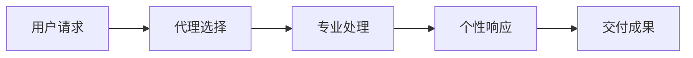
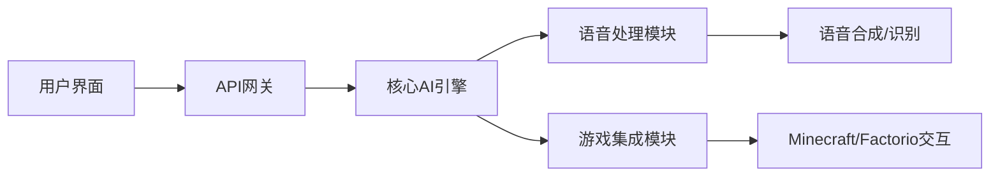
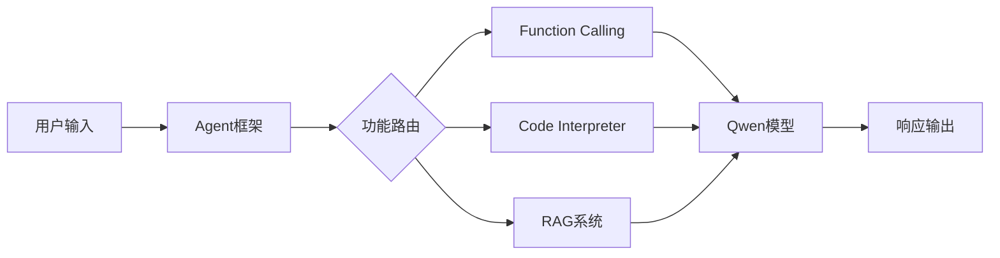
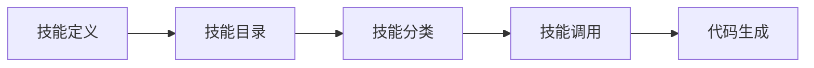
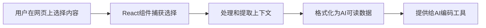
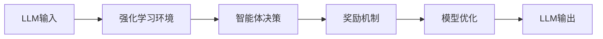
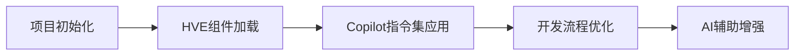
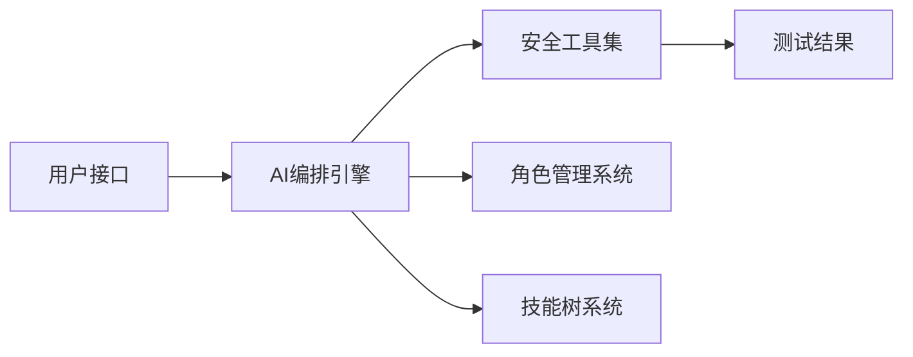
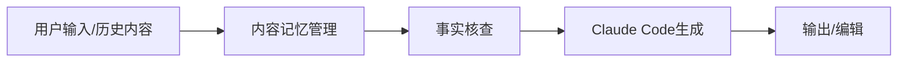

## 今日热点

今日GitHub热榜项目精彩纷呈。

---

## 热门项目一览

| 排名 | 项目 | 语言 | 今日 | 总计 | 简介 |
|:---:|------|:----:|------:|-----:|------|
| 1 | [msitarzewski/agency-agents](https://github.com/msitarzewski/agency-agents) | Unknown | +2,846 | 9,854 | A complete AI agency at you... |
| 2 | [moeru-ai/airi](https://github.com/moeru-ai/airi) | TypeScript | +2,562 | 29,534 | 💖🧸 Self hosted, you-owned G... |
| 3 | [QwenLM/Qwen-Agent](https://github.com/QwenLM/Qwen-Agent) | Python | +696 | 14,644 | Agent framework and applica... |
| 4 | [TheCraigHewitt/seomachine](https://github.com/TheCraigHewitt/seomachine) | Python | +690 | 2,154 | A specialized Claude Code w... |
| 5 | [openai/skills](https://github.com/openai/skills) | Python | +595 | 12,000 | Skills Catalog for Codex |
| 6 | [aidenybai/react-grab](https://github.com/aidenybai/react-grab) | TypeScript | +450 | 6,010 | Select context for coding a... |
| 7 | [inclusionAI/AReaL](https://github.com/inclusionAI/AReaL) | Python | +347 | 4,398 | Lightning-Fast RL for LLM R... |
| 8 | [microsoft/hve-core](https://github.com/microsoft/hve-core) | PowerShell | +273 | 556 | A refined collection of Hyp... |
| 9 | [Ed1s0nZ/CyberStrikeAI](https://github.com/Ed1s0nZ/CyberStrikeAI) | Go | +106 | 1,620 | CyberStrikeAI is an AI-nati... |
| 10 | [lingfengQAQ/webnovel-writer](https://github.com/lingfengQAQ/webnovel-writer) | Python | +90 | 780 | 基于 Claude Code 的长篇网文辅助创作系统，... |
| 11 | [virattt/ai-hedge-fund](https://github.com/virattt/ai-hedge-fund) | Python | +81 | 46,332 | An AI Hedge Fund Team |

---

## 趋势洞察

```
┌─────────────────────────────────────────────────────────────────┐
│  AI/ML 工具         ████████████████████████  11 个项目        │
└─────────────────────────────────────────────────────────────────┘
```

---

## 项目深度解读

### 1. msitarzewski/agency-agents — AI代理集合

> **一句话总结**：一站式提供多种专业AI代理，每个具备独特个性和成熟工作流程。

#### 价值主张

| 维度 | 说明 |
|------|------|
| **解决痛点** | 解决用户需要多种专业AI助手但分别部署和管理的繁琐问题 |
| **目标用户** | 需要多样化AI辅助的专业人士、开发团队和创意工作者 |
| **核心亮点** | 多种专业AI代理集合 + 独特个性设定 + 成熟工作流程 + 即插即用 |

#### 技术架构



**技术特色**：
- 模块化AI代理设计架构
- 个性化响应生成机制
- 专业领域知识集成系统

#### 热度分析

- 项目单日新增近3000星，表明AI代理领域需求激增，市场认可度高。
- 零开放问题反映项目维护良好，社区可能通过其他渠道反馈。

#### 快速上手

```bash
# 安装（假设）
pip install agency-agents

# 使用示例
agency-agents frontend "创建一个响应式登录页面"
```

#### 注意事项

- 需明确各代理的能力边界和适用场景，避免过度期望
- 可能需要相应的API密钥或服务订阅才能使用完整功能


### 2. moeru-ai/airi — 虚拟AI伴侣

> **一句话总结**：自托管动漫风格AI伴侣，支持实时语音交互与游戏能力。

#### 价值主张

| 维度 | 说明 |
|------|------|
| **解决痛点** | 提供可自托管、私有的动漫风格AI伴侣，替代商业封闭式AI |
| **目标用户** | 动漫爱好者、AI开发者、游戏玩家、技术极客 |
| **核心亮点** | 自托管私有部署 + 实时语音交互 + 多平台支持 + 游戏能力 |

#### 技术架构



**技术特色**：
- 基于TypeScript的全栈实现，确保类型安全与开发效率
- 支持实时语音处理的低延迟架构设计
- 模块化游戏集成接口，支持多种游戏环境

#### 热度分析

- Star数近3万且单日增长超2500，显示项目正处于爆发式增长期
- 零开放Issues表明社区维护高效，问题解决机制成熟

#### 快速上手

```bash
# 克隆仓库
git clone https://github.com/moeru-ai/airi.git

# 安装依赖
npm install

# 启动开发环境
npm run dev
```

#### 注意事项

- 项目依赖较多，需要确保Node.js环境配置正确
- 部署可能需要较强的硬件资源，特别是语音处理部分
- 自托管特性意味着用户需自行维护和更新


### 3. QwenLM/Qwen-Agent — 智能代理框架

> **一句话总结**：基于Qwen大模型的全方位智能代理框架，集成函数调用与代码解释能力。

#### 价值主张

| 维度 | 说明 |
|------|------|
| **解决痛点** | 提供统一框架整合多种AI能力，简化复杂智能应用开发流程 |
| **目标用户** | AI应用开发者、企业技术团队、AI研究人员 |
| **核心亮点** | Function Calling + Code Interpreter + RAG + MCP支持 |

#### 技术架构



**技术特色**：
- 基于Qwen>=3.0大模型构建，提供强大的理解与生成能力
- 模块化设计，支持多种AI能力灵活组合与扩展
- 通过Chrome扩展实现浏览器端智能代理功能

#### 热度分析

- 项目Star数达14,644且单日增长近700，社区关注度持续攀升
- Fork数1,391表明开发者积极参与，项目生态正在快速形成

#### 快速上手

```bash
# 克隆项目
git clone https://github.com/QwenLM/Qwen-Agent.git
cd Qwen-Agent

# 安装依赖
pip install -e .
```

#### 注意事项

- 需要Qwen模型API密钥才能使用核心功能
- Chrome扩展需要额外安装并配置相应权限
- 项目依赖较新版本的Python，建议使用Python 3.8以上版本


### 4. TheCraigHewitt/seomachine — SEO内容创作工具

> **一句话总结**：基于Claude Code的专业SEO内容创作系统，帮助生成能排名靠前的长篇博客内容。

#### 价值主张

| 维度 | 说明 |
|------|------|
| **解决痛点** | 企业难以创建高质量、SEO优化的长篇博客内容，影响搜索排名和流量获取 |
| **目标用户** | 企业内容创作者、营销人员和SEO专业人士 |
| **核心亮点** | Claude Code专业集成 + SEO优化分析 + 长篇内容结构化 + 排名评估系统 |

#### 技术架构


**技术特色**：
- 基于Claude Code的AI深度内容生成
- 专业的SEO优化算法集成
- 内容结构与排名分析系统

#### 热度分析

- 项目近期热度激增（单日+690 stars），显示SEO内容创作需求旺盛
- 作为垂直领域专业工具，在内容创作和SEO社区中具有独特生态位置

#### 快速上手

```bash
# 克隆仓库
git clone https://github.com/TheCraigHewitt/seomachine.git

# 安装依赖并运行
cd seomachine && pip install -r requirements.txt
```

#### 注意事项

- 项目许可证信息不明确，使用前需确认授权条款
- 作为专业工具，建议具备基础SEO知识以充分发挥其价值
- 可能需要Claude Code的访问权限才能正常使用


### 5. openai/skills — AI技能库

> **一句话总结**：为OpenAI Codex提供结构化技能目录，提升代码生成能力与可复用性。

#### 价值主张

| 维度 | 说明 |
|------|------|
| **解决痛点** | 解决AI代码生成中技能复用和模块化问题 |
| **目标用户** | AI开发者、研究人员和需要定制化代码生成的用户 |
| **核心亮点** | 结构化技能组织 + 标准化接口 + 多语言支持 + 可扩展设计 |

#### 技术架构



**技术特色**：
- 采用模块化技能组织方式
- 提供标准化的技能接口定义
- 支持多种编程语言的技能集成

#### 热度分析

- 项目Star数达12,000且每日新增近600，表明AI代码生成领域热度高涨
- 零未解决问题反映项目维护质量高，社区参与积极

#### 快速上手

```bash
# 克隆项目
git clone https://github.com/openai/skills.git

# 安装依赖
pip install -r requirements.txt
```

#### 注意事项

- 需要OpenAI API密钥才能使用相关功能
- 技能库仍在持续更新中，建议关注最新版本变化
- 部分高级功能可能需要额外配置或权限


### 6. aidenybai/react-grab — 代码上下文提取器

> **一句话总结**：React组件允许用户从网页选择并提取代码上下文，方便AI编码助手获取相关信息。

#### 价值主张

| 维度 | 说明 |
|------|------|
| **解决痛点** | 解决AI编码助手无法直接获取网页上下文的问题 |
| **目标用户** | 开发者、AI编码工具使用者、网页内容创作者 |
| **核心亮点** | +直观选择界面 +上下文智能提取 +与AI工具无缝集成 |

#### 技术架构



**技术特色**：
- 基于React的轻量级组件实现
- 智能文本选择和上下文提取算法
- 与主流AI编码工具的API集成

#### 热度分析

- 项目在短时间内获得大量关注，今日新增450星，表明功能新颖且实用
- 零开放问题显示项目维护良好，用户反馈积极，社区参与度高

#### 快速上手

```bash
# 安装依赖
npm install react-grab

# 在React组件中使用
import ReactGrab from 'react-grab';

function App() {
  return (
    <div>
      <ReactGrab onContextExtracted={(context) => console.log(context)} />
    </div>
  );
}
```

#### 注意事项

- 需要确保选择的网页内容没有版权限制
- 使用时可能需要配置API密钥以连接AI编码工具
- 组件可能需要根据目标网站的结构进行定制化调整


### 7. inclusionAI/AReaL — [LLM强化引擎]

> **一句话总结**：为大型语言模型推理与智能体提供高性能、简单灵活的强化学习框架。

#### 价值主张

| 维度 | 说明 |
|------|------|
| **解决痛点** | 大型语言模型推理与智能体开发中的强化学习效率低下问题 |
| **目标用户** | 大型语言模型研究者、AI智能体开发者、强化学习工程师 |
| **核心亮点** | 高性能实现 + 极简设计 + 灵活扩展 + 快速部署 |

#### 技术架构



**技术特色**：
- 高性能强化学习算法实现，优化LLM推理效率
- 简化LLM与智能体的集成流程，降低使用门槛
- 提供灵活的配置选项和扩展机制，支持定制化需求

#### 热度分析

- 项目近期增长迅猛，单日新增347个star，技术社区高度关注
- 较高的star/fork比例(12.1:1)，表明项目以用户使用为主，社区贡献活跃

#### 快速上手

```bash
# 安装AReaL
pip install areal

# 基础使用示例
from areal import RLAgent
agent = RLAgent(model="gpt-3.5-turbo")
agent.train(environment="reasoning_task")
```

#### 注意事项

- 由于许可证信息未知，商业使用前需确认授权条款
- 项目文档可能不够完善，新手可能需要额外研究源码
- 强化学习训练需要大量计算资源，建议使用高性能GPU环境


### 8. microsoft/hve-core — AI工程加速组件集

> **一句话总结**：微软推出的Copilot优化工程组件集，提供指令、提示和代理以加速AI辅助开发流程。

#### 价值主张

| 维度 | 说明 |
|------|------|
| **解决痛点** | 解决如何有效利用Copilot等AI工具进行高效软件开发的问题 |
| **目标用户** | 软件开发团队、希望最大化AI辅助开发效率的开发者 |
| **核心亮点** | 提供结构化的工程指令集 + 包含Copilot优化提示 + 提供智能代理组件 + 支持项目快速初始化 |

#### 技术架构



**技术特色**：
- 基于PowerShell的跨平台组件系统
- 结构化的Copilot交互模式设计
- 模块化的工程最佳实践集合

#### 热度分析

- 项目近期获得273个Star，显示快速增长趋势，表明AI辅助开发工具需求旺盛
- 作为微软官方项目，在Copilot生态系统中具有重要战略地位

#### 快速上手

```bash
# 克隆项目仓库
git clone https://github.com/microsoft/hve-core.git

# 导入PowerShell模块
Import-Module ./hve-core.psm1
```

#### 注意事项

- 项目许可证未知，使用前需确认授权条款
- 作为微软内部工程方法论的外部化，可能需要特定环境支持
- 需要配合Copilot使用才能发挥最大效用


### 9. Ed1s0nZ/CyberStrikeAI — AI安全测试平台

> **一句话总结**：集成百种安全工具的AI原生安全测试平台，提供智能编排和角色化测试能力。

#### 价值主张

| 维度 | 说明 |
|------|------|
| **解决痛点** | 传统安全测试工具分散，缺乏智能化编排和统一管理 |
| **目标用户** | 安全研究人员、渗透测试团队、DevOps工程师 |
| **核心亮点** | AI智能编排引擎 + 100+安全工具集成 + 角色化测试系统 + 专门测试技能树 |

#### 技术架构



**技术特色**：
- Go语言构建的高性能安全测试平台
- AI驱动的安全测试智能编排引擎
- 模块化设计支持100+安全工具集成
- 基于角色的权限管理和测试执行

#### 热度分析

- 项目获得1620个Star且每日增长稳定，表明安全测试领域对AI驱动的工具有强烈需求
- 相对较高的Fork/Star比例(19.1%)暗示用户积极进行二次开发和定制

#### 快速上手

```bash
# 克隆项目
git clone https://github.com/Ed1s0nZ/CyberStrikeAI.git

# 安装依赖
cd CyberStrikeAI && go mod download

# 运行平台
go run main.go
```

#### 注意事项

- 项目尚未明确许可证，使用前需确认授权条款
- 作为安全测试工具，使用时需确保遵守相关法律法规
- 项目描述显示集成100+安全工具，实际功能需验证
- AI编排引擎的具体能力和局限性需要进一步测试评估


### 10. lingfengQAQ/webnovel-writer — AI网文创作助手

> **一句话总结**：基于Claude Code的AI网文创作系统，解决长篇写作中的遗忘和幻觉问题，支持200万字级别连载。

#### 价值主张

| 维度 | 说明 |
|------|------|
| **解决痛点** | 解决AI长篇写作中的信息遗忘和内容幻觉问题 |
| **目标用户** | 网文作者及长篇内容创作者 |
| **核心亮点** | 基于Claude Code + 解决AI遗忘幻觉 + 支持200万字长篇创作 |

#### 技术架构



**技术特色**：
- 长篇内容记忆管理系统
- AI生成内容事实核查机制
- 支持200万字级别的创作架构

#### 热度分析

- 项目近期增长迅速，单日新增90 stars，显示社区高度关注。
- Open Issues为0，表明项目维护良好，用户反馈可能通过其他渠道处理。

#### 快速上手

```bash
# 克隆项目
git clone https://github.com/lingfengQAQ/webnovel-writer.git
# 安装依赖
cd webnovel-writer && pip install -r requirements.txt
# 运行项目
python main.py
```

#### 注意事项

- 项目需要Claude Code API访问权限
- 长篇创作可能需要大量计算资源
- 建议定期备份生成内容以防数据丢失


### 11. virattt/ai-hedge-fund — AI对冲基金

> **一句话总结**：基于AI技术的自动化金融投资决策系统，实现智能对冲交易策略

#### 价值主张

| 维度 | 说明 |
|------|------|
| **解决痛点** | 传统投资决策效率低，难以实时处理复杂多变的市场数据 |
| **目标用户** | 量化交易员、金融分析师、对冲基金团队、算法投资者 |
| **核心亮点** | AI智能决策 + 多市场数据分析 + 自动化交易执行 + 风险对冲机制 |

#### 技术架构


**技术特色**：
- 机器学习算法应用于金融数据分析与预测
- 实时市场数据处理与异常检测系统
- 多维度风险评估与动态对冲机制

#### 热度分析

- 项目获得46k+星标，日均增长80+，处于量化金融领域热门项目
- 作为AI+金融交叉领域项目，吸引了大量技术投资者关注

#### 快速上手

```bash
git clone https://github.com/virattt/ai-hedge-fund.git
cd ai-hedge-fund
pip install -r requirements.txt
python main.py --config config/default.yaml
```

#### 注意事项

- 本项目仅用于研究目的，实际金融投资存在风险
- 使用前需具备基本的Python编程和金融知识
- 交易策略需根据市场环境进行适当调整和优化


## 今日推荐

| 主题 | 推荐项目 | 亮点 |
|------|----------|------|
| 今日最热 | [msitarzewski/agency-agents](https://github.com/msitarzewski/agency-agents) | A complete AI age... |
| 值得关注 | [moeru-ai/airi](https://github.com/moeru-ai/airi) | 💖🧸 Self hosted, y... |
| 快速上手 | [QwenLM/Qwen-Agent](https://github.com/QwenLM/Qwen-Agent) | Agent framework a... |
| 长期潜力 | [TheCraigHewitt/seomachine](https://github.com/TheCraigHewitt/seomachine) | A specialized Cla... |

---

<div align="center">

*Generated on 2026-03-07 | Powered by GitHub Trending Reporter*

</div>