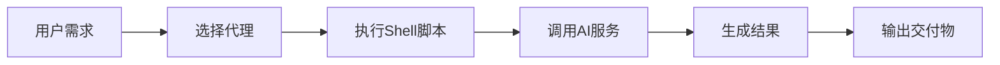
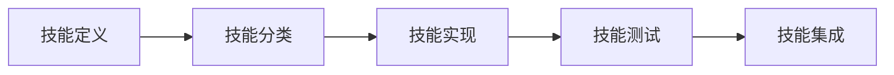
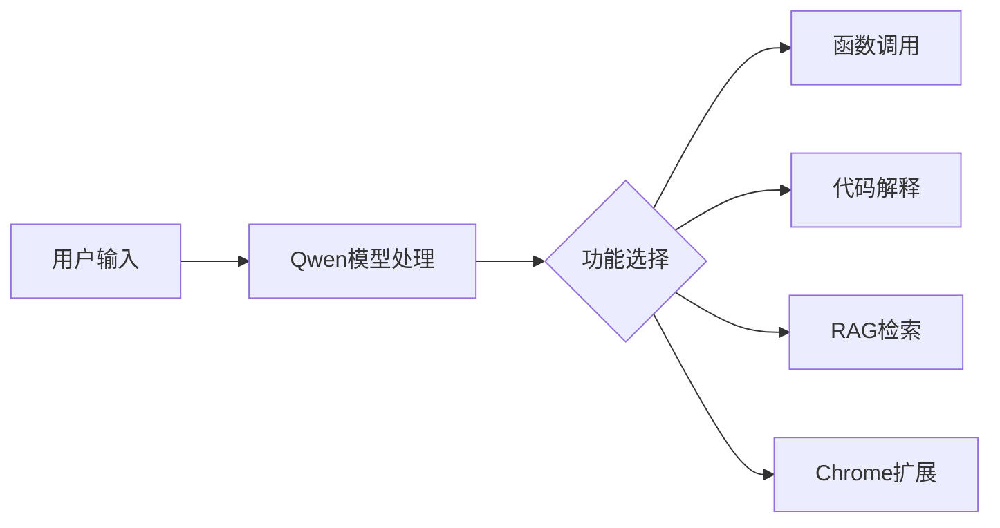
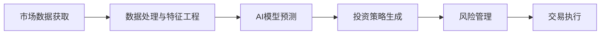
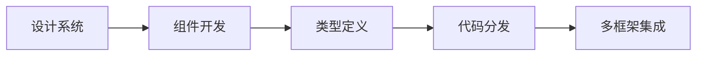
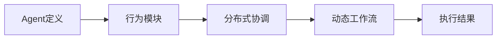

## 今日热点

AI代理与生成式技术引领今日热榜，从群体智能引擎到专业代理框架，AI正以多样化形态赋能各领域，展现技术应用的爆发式增长。

---

## 热门项目一览

| 排名 | 项目 | 语言 | 今日 | 总计 | 简介 |
|:---:|------|:----:|------:|-----:|------|
| 1 | [msitarzewski/agency-agents](https://github.com/msitarzewski/agency-agents) | Shell | +1,468 | 10,782 | A complete AI agency at you... |
| 2 | [openai/skills](https://github.com/openai/skills) | Python | +948 | 12,723 | Skills Catalog for Codex |
| 3 | [QwenLM/Qwen-Agent](https://github.com/QwenLM/Qwen-Agent) | Python | +586 | 15,025 | Agent framework and applica... |
| 4 | [666ghj/MiroFish](https://github.com/666ghj/MiroFish) | Python | +399 | 5,667 | A Simple and Universal Swar... |
| 5 | [GoogleCloudPlatform/generative-ai](https://github.com/GoogleCloudPlatform/generative-ai) | Jupyter Notebook | +384 | 13,540 | Sample code and notebooks f... |
| 6 | [toeverything/AFFiNE](https://github.com/toeverything/AFFiNE) | TypeScript | +281 | 64,701 | There can be more than Noti... |
| 7 | [virattt/ai-hedge-fund](https://github.com/virattt/ai-hedge-fund) | Python | +248 | 46,581 | An AI Hedge Fund Team |
| 8 | [microsoft/hve-core](https://github.com/microsoft/hve-core) | PowerShell | +217 | 751 | A refined collection of Hyp... |
| 9 | [alibaba/page-agent](https://github.com/alibaba/page-agent) | TypeScript | +137 | 1,379 | JavaScript in-page GUI agen... |
| 10 | [shadcn-ui/ui](https://github.com/shadcn-ui/ui) | TypeScript | +129 | 108,185 | A set of beautifully-design... |
| 11 | [agentjido/jido](https://github.com/agentjido/jido) | Elixir | +115 | 1,424 | 🤖 Autonomous agent framewor... |

---

## 趋势洞察

```
┌─────────────────────────────────────────────────────────────────┐
│  AI/ML 工具         ████████████████████████  9 个项目        │
│  开发框架             ██                        1 个项目        │
│  其他               ██                        1 个项目        │
└─────────────────────────────────────────────────────────────────┘
```

---

## 项目深度解读

### 1. msitarzewski/agency-agents — AI代理工具集

> **一句话总结**：提供多种专业化AI代理，实现从开发到社区管理的全流程自动化解决方案。

#### 价值主张

| 维度 | 说明 |
|------|------|
| **解决痛点** | 提供现成的专业化AI代理，无需单独训练和配置 |
| **目标用户** | 开发者、内容创作者、社区管理员等需要AI辅助的用户 |
| **核心亮点** | 多样化专业代理 + 即用型解决方案 + 个性化交互 |

#### 技术架构



**技术特色**：
- 基于Shell脚本实现，便于跨平台使用
- 模块化代理设计，每个代理专注特定任务
- 通过命令行接口提供简单易用的交互方式

#### 热度分析

- 项目近期增长迅猛，单日增加近1500星，显示市场高度认可
- 高Fork数量表明社区积极参与和二次开发意愿强

#### 快速上手

```bash
# 克隆仓库
git clone https://github.com/msitarzewski/agency-agents.git
# 进入目录
cd agency-agents
# 查看可用代理
ls agents/
```

#### 注意事项

- 项目使用Shell脚本，确保系统兼容性
- 部分代理可能需要API密钥或额外配置
- 根据项目描述，每个代理都有独特个性，使用时需了解其特点


### 2. openai/skills — AI代码技能库

> **一句话总结**：为OpenAI Codex提供结构化代码技能目录，提升AI编程能力。

#### 价值主张

| 维度 | 说明 |
|------|------|
| **解决痛点** | 解决AI模型缺乏结构化编程指导的问题 |
| **目标用户** | AI开发者、研究人员和自动化编程工具使用者 |
| **核心亮点** | 结构化技能目录 + 可扩展框架 + 多语言支持 + 示例丰富 + 易于集成 |

#### 技术架构



**技术特色**：
- 基于JSON/YAML的结构化技能定义格式
- 模块化设计便于扩展新技能
- 支持多编程语言技能集
- 标准化的技能验证流程
- 与Codex API无缝集成

#### 热度分析

- 项目星数持续增长，单日新增近千星，表明社区对AI编程辅助工具高度关注
- 作为OpenAI官方项目，处于AI编程辅助生态的核心位置，影响力和潜力巨大

#### 快速上手

```bash
# 克隆仓库
git clone https://github.com/openai/skills.git

# 安装依赖
cd skills && pip install -r requirements.txt

# 查看技能目录
python skills/list_skills.py
```

#### 注意事项

- 项目依赖OpenAI API，需要有效API密钥
- 技能库持续更新，需关注最新版本变化
- 部分高级功能可能需要付费API访问权限


### 3. QwenLM/Qwen-Agent — 大模型智能体框架

> **一句话总结**：基于Qwen大模型的智能体框架，提供函数调用、代码解释器、RAG等丰富功能。

#### 价值主张

| 维度 | 说明 |
|------|------|
| **解决痛点** | 为开发者提供基于Qwen模型的完整智能体解决方案，简化复杂应用开发 |
| **目标用户** | AI应用开发者、研究人员和企业技术团队 |
| **核心亮点** | 函数调用能力 + 代码解释器支持 + RAG功能 + Chrome扩展 + MCP集成 |

#### 技术架构



**技术特色**：
- 基于Qwen>=3.0大语言模型，提供强大的语言理解能力
- 集成多种智能体功能，包括函数调用、代码解释等
- 支持Chrome扩展，实现浏览器端智能交互
- 采用模块化设计，便于功能扩展和定制

#### 热度分析

- 项目Star数达15,025，且近期(+586 today)有显著增长，表明项目受到广泛关注
- 作为阿里Qwen大模型生态的重要组成部分，社区活跃度高，发展潜力大

#### 快速上手

```bash
# 安装Qwen-Agent
pip install qwen-agent

# 初始化项目
qwen-agent init

# 启动服务
qwen-agent start
```

#### 注意事项

- 项目需要Qwen>=3.0模型支持，确保有足够的计算资源
- 部分高级功能(如代码解释器)可能需要额外的配置和环境设置
- 项目许可证信息不明确，使用前需确认开源协议


### 5. GoogleCloudPlatform/generative-ai — Google云生成AI

> **一句话总结**：Google Cloud生成式AI官方示例库，提供Gemini模型在Vertex AI上的实用代码和教程。

#### 价值主张

| 维度 | 说明 |
|------|------|
| **解决痛点** | 提供一站式生成式AI开发环境，简化Google Cloud AI模型使用流程 |
| **目标用户** | AI开发者、数据科学家、云平台用户 |
| **核心亮点** | 官方示例 + Gemini模型集成 + Vertex AI平台支持 + 多场景应用 + Jupyter交互式开发 |

#### 技术架构


**技术特色**：
- 基于Google Cloud Vertex AI平台
- 集成最新Gemini生成式AI模型
- 提供端到端解决方案示例

#### 热度分析

- 项目Star数超过13k，近期日增近400，增长势头强劲，显示生成式AI领域热度高涨
- 作为Google官方项目，在生成式AI生态中占据核心位置，社区活跃度高

#### 快速上手

```bash
# 克隆项目
git clone https://github.com/GoogleCloudPlatform/generative-ai.git

# 进入目录并安装依赖
cd generative-ai && pip install -r requirements.txt
```

#### 注意事项

- 需要Google Cloud账户并启用Vertex AI API
- 使用前需配置适当的项目ID和认证
- 部分示例可能需要付费API额度


### 6. toeverything/AFFiNE — 全能知识管理工具

> **一句话总结**：开源隐私优先的知识管理平台，融合笔记、白板与项目管理功能。

#### 价值主张

| 维度 | 说明 |
|------|------|
| **解决痛点** | 传统知识工具功能单一、隐私不足、闭源不可定制 |
| **目标用户** | 知识工作者、创意团队、项目管理需求强烈者 |
| **核心亮点** | 隐私优先 + 开源可定制 + 多功能融合 + 跨平台支持 + 实时协作 |

#### 技术架构


**技术特色**：
- 基于 TypeScript 的全栈类型安全开发
- 模块化架构设计，支持插件扩展机制
- 本地优先的数据存储策略，保障用户隐私

#### 热度分析

- 项目 Star 数超 64k，日均增长约 280，呈现快速增长趋势
- 作为 Notion 和 Miro 的开源替代品，在知识管理领域占据重要生态位置

#### 快速上手

```bash
# 克隆仓库并开发
git clone https://github.com/toeverything/AFFiNE.git
cd AFFiNE
npm install
npm run dev
```

#### 注意事项

- 项目许可证信息未知，使用前需确认授权条款
- 作为较新项目，功能和稳定性可能仍在持续改进中
- 部分高级功能可能需要额外配置或插件支持


### 7. virattt/ai-hedge-fund — AI对冲基金

> **一句话总结**：AI驱动的量化交易系统，结合深度学习与金融数据分析实现自动化投资决策。

#### 价值主张

| 维度 | 说明 |
|------|------|
| **解决痛点** | 传统投资决策依赖人工判断，AI系统可提高决策效率和准确性 |
| **目标用户** | 金融科技开发者、量化交易员、对冲基金从业者 |
| **核心亮点** | 深度学习模型 + 实时市场数据分析 + 多策略组合优化 |

#### 技术架构



**技术特色**：
- 多源金融数据整合与实时处理
- 深度学习模型应用于市场趋势预测
- 风险管理与资产组合优化算法

#### 热度分析

- 项目获得近4.7万星，每日新增约250星，增长势头强劲
- 高fork比例(1:6)表明项目有较强实用价值和二次开发价值

#### 快速上手

```bash
# 克隆项目
git clone https://github.com/virattt/ai-hedge-fund.git

# 安装依赖
pip install -r requirements.txt
```

#### 注意事项

- 项目没有明确的开源许可证，使用时需注意版权问题
- 金融交易存在高风险，AI模型无法保证100%准确，实盘交易需谨慎


### 8. microsoft/hve-core — 超高速工程组件集

> **一句话总结**：提供超高速工程组件集合，帮助开发者优化项目并最大化Copilot使用效益。

#### 价值主张

| 维度 | 说明 |
|------|------|
| **解决痛点** | 简化Copilot集成流程，提升AI辅助开发效率 |
| **目标用户** | 希望最大化Copilot效益的开发团队和项目经理 |
| **核心亮点** | 组件化设计 + 即插即用 + 最佳实践集成 + PowerShell原生支持 |

#### 技术架构


**技术特色**：
- 基于PowerShell的模块化组件架构
- 与Copilot生态系统的深度集成优化
- 提供开箱即用的工程组件解决方案

#### 热度分析

- 项目获751星且单日增长217，显示近期受到高度关注
- 作为微软官方项目，在Copilot生态系统中占据战略位置

#### 快速上手

```bash
# 安装HVE-Core模块
Install-Module -Name HVE-Core -Scope CurrentUser

# 导入模块
Import-Module HVE-Core

# 初始化项目
Initialize-HVEProject -Type New
```

#### 注意事项

- 项目许可证信息不明确，使用前需确认授权条款
- 作为PowerShell项目，主要适用于Windows环境或PowerShell Core
- 需要Copilot订阅才能充分发挥组件功能优势


### 9. alibaba/page-agent — 智能页面控制

> **一句话总结**：通过自然语言控制网页界面的AI代理工具，简化网页交互自动化流程。

#### 价值主张

| 维度 | 说明 |
|------|------|
| **解决痛点** | 降低网页自动化操作门槛，无需编写复杂脚本即可控制页面元素 |
| **目标用户** | 前端开发者、测试工程师、网页自动化需求用户 |
| **核心亮点** | 自然语言交互 + 无侵入式集成 + 智能DOM理解 |

#### 技术架构


**技术特色**：
- 基于TypeScript开发，提供类型安全保障
- 采用轻量级页面注入架构，无需修改原网页
- 集成先进的语义理解技术，精准识别用户意图

#### 热度分析

- 项目近期增长迅猛，单日增长超百星，受开发者高度关注
- 作为阿里巴巴开源项目，在自动化测试领域具有生态影响力

#### 快速上手

```bash
# 安装page-agent
npm install page-agent

# 在页面中初始化并启动
import { PageAgent } from 'page-agent';
const agent = new PageAgent();
agent.start();
```

#### 注意事项

- 项目许可证信息不明确，商用前需确认授权条款
- 依赖自然语言处理技术，复杂指令可能存在理解偏差
- 当前版本可能处于快速迭代阶段，API稳定性待验证


### 10. shadcn-ui/ui — 开源组件库

> **一句话总结**：一个美观、无障碍且支持多框架的开源UI组件库与代码分发平台。

#### 价值主张

| 维度 | 说明 |
|------|------|
| **解决痛点** | 解决现代Web应用中UI组件设计不统一、可访问性差的问题 |
| **目标用户** | 前端开发者、UI设计师、全栈工程师 |
| **核心亮点** | 美观设计 + 无障碍支持 + 多框架兼容 + 代码分发平台 + 开源 |

#### 技术架构



**技术特色**：
- 基于TypeScript的类型安全组件开发
- 采用现代CSS变量方案实现主题定制
- 提供可访问性(Accessibility)支持与最佳实践

#### 热度分析

- 高Star增长率表明项目受社区热烈追捧，是目前前端UI组件库领域的热门选择
- 作为开源UI组件库，已在React生态中占据重要位置，并与Tailwind CSS形成良好互补

#### 快速上手

```bash
# 使用shadcn/ui初始化新项目
npx create-next-app@latest my-app
cd my-app
npx shadcn-ui@latest init
```

#### 注意事项

- 需要配合Tailwind CSS使用
- 组件样式可定制但需要遵循设计系统规范
- 部分组件可能需要额外配置才能完全发挥功能


### 11. agentjido/jido — 分布式代理框架

> **一句话总结**：基于Elixir构建的分布式自主代理框架，支持动态工作流和自主行为。

#### 价值主张

| 维度 | 说明 |
|------|------|
| **解决痛点** | 简化在Elixir中构建分布式自主代理和复杂工作流的开发难度 |
| **目标用户** | 需要构建分布式系统、自动化流程和智能代理的Elixir开发者 |
| **核心亮点** | 分布式架构支持 + 自主行为能力 + 动态工作流处理 + Elixir容错性 |

#### 技术架构



**技术特色**：
- 基于Elixir/OTP的容错分布式架构设计
- 支持运行时动态工作流定义和调整
- 提供模块化自主代理行为模型

#### 热度分析

- 项目获得1424个Star，单日增长115，显示近期热度快速上升，关注度持续攀升
- Fork数量相对较少(74)，表明项目可能处于早期阶段，社区生态尚未完全形成

#### 快速上手

```bash
# 添加依赖到mix.exs
{:jido, "~> 0.1.0"}

# 在应用中启动代理框架
Jido.start_link()
```

#### 注意事项

- 项目许可证未知，商业使用前需确认授权条款
- 项目Issues为0但Star增长快，可能表明项目处于早期阶段，稳定性有待验证
- 作为Elixir框架，需要使用者具备函数式编程和Elixir/OTP基础知识


## 今日推荐

| 主题 | 推荐项目 | 亮点 |
|------|----------|------|
| 今日最热 | [msitarzewski/agency-agents](https://github.com/msitarzewski/agency-agents) | A complete AI age... |
| 值得关注 | [openai/skills](https://github.com/openai/skills) | Skills Catalog fo... |
| 快速上手 | [QwenLM/Qwen-Agent](https://github.com/QwenLM/Qwen-Agent) | Agent framework a... |
| 长期潜力 | [666ghj/MiroFish](https://github.com/666ghj/MiroFish) | A Simple and Univ... |

---

<div align="center">

*Generated on 2026-03-08 | Powered by GitHub Trending Reporter*

</div>