## 今日热点

今日GitHub热榜项目精彩纷呈。

---

## 热门项目一览

| 排名 | 项目 | 语言 | 今日 | 总计 | 简介 |
|:---:|------|:----:|------:|-----:|------|
| 1 | [openclaw/openclaw](https://github.com/openclaw/openclaw) | TypeScript | +4,603 | 280,796 | Your own personal AI assist... |
| 2 | [666ghj/MiroFish](https://github.com/666ghj/MiroFish) | Python | +1,104 | 7,051 | A Simple and Universal Swar... |
| 3 | [openai/skills](https://github.com/openai/skills) | Python | +612 | 13,237 | Skills Catalog for Codex |
| 4 | [shareAI-lab/learn-claude-code](https://github.com/shareAI-lab/learn-claude-code) | TypeScript | +566 | 23,897 | Bash is all you need - A na... |
| 5 | [toeverything/AFFiNE](https://github.com/toeverything/AFFiNE) | TypeScript | +533 | 65,234 | There can be more than Noti... |
| 6 | [GoogleCloudPlatform/generative-ai](https://github.com/GoogleCloudPlatform/generative-ai) | Jupyter Notebook | +522 | 14,411 | Sample code and notebooks f... |
| 7 | [shadcn-ui/ui](https://github.com/shadcn-ui/ui) | TypeScript | +488 | 108,697 | A set of beautifully-design... |
| 8 | [pbakaus/impeccable](https://github.com/pbakaus/impeccable) | JavaScript | +443 | 1,785 | The design language that ma... |
| 9 | [virattt/ai-hedge-fund](https://github.com/virattt/ai-hedge-fund) | Python | +275 | 46,826 | An AI Hedge Fund Team |
| 10 | [Ed1s0nZ/CyberStrikeAI](https://github.com/Ed1s0nZ/CyberStrikeAI) | Go | +244 | 2,264 | CyberStrikeAI is an AI-nati... |
| 11 | [teng-lin/notebooklm-py](https://github.com/teng-lin/notebooklm-py) | Python | +196 | 3,741 | Unofficial Python API for G... |
| 12 | [is-a-dev/register](https://github.com/is-a-dev/register) | JavaScript | +10 | 9,796 | Grab your own sweet-looking... |

---

## 趋势洞察

```
┌─────────────────────────────────────────────────────────────────┐
│  AI/ML 工具         ████████████████████████  9 个项目        │
│  其他               █████                     2 个项目        │
│  开发框架             ██                        1 个项目        │
└─────────────────────────────────────────────────────────────────┘
```

---

## 项目深度解读

### 1. openclaw/openclaw — 跨平台AI助手

> **一句话总结**：跨平台AI助手，支持多操作系统，提供个性化智能服务。

#### 价值主张

| 维度 | 说明 |
|------|------|
| **解决痛点** | 统一跨平台的AI助手体验，打破操作系统限制 |
| **目标用户** | 需要一致AI体验的个人用户、开发者与技术爱好者 |
| **核心亮点** | 跨平台兼容性 + 开源可定制 + TypeScript开发保障 |

#### 技术架构

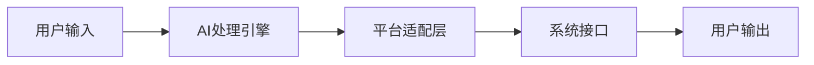

**技术特色**：
- TypeScript开发确保类型安全与代码质量
- 跨平台架构设计支持多操作系统无缝运行
- 开源许可促进社区参与与功能扩展

#### 热度分析

- 项目Star数超28万，近期增长迅猛(+4,603 today)，显示高度社区认可
- Fork数达5.3万，表明开发者积极参与二次开发与定制

#### 快速上手

```bash
# 克隆项目
git clone https://github.com/openclaw/openclaw.git

# 安装依赖
npm install

# 启动应用
npm start
```

#### 注意事项

- 项目许可证信息未知，使用前需确认开源协议条款
- 跨平台兼容性可能因系统环境差异而表现不同
- 作为AI助手应用，可能需要联网功能以获取最佳服务体验


### 2. 666ghj/MiroFish — 群体智能引擎

> **一句话总结**：基于群体智能算法的通用预测框架，通过模拟群体行为实现多领域预测。

#### 价值主张

| 维度 | 说明 |
|------|------|
| **解决痛点** | 提供通用、灵活的预测解决方案，降低专业预测门槛 |
| **目标用户** | 数据科学家、研究人员、需要预测功能的开发者 |
| **核心亮点** | 简单易用 + 通用性强 + 预测精度高 + 自适应学习 |

#### 技术架构

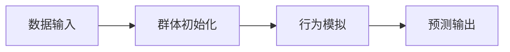

**技术特色**：
- 基于群体智能算法的预测框架
- 支持多领域自适应学习
- 简洁的API设计，易于集成

#### 热度分析

- 项目近期获得大量关注，单日增长超过1000星，显示社区对其高度认可
- 高星数与零开放问题的组合表明项目可能处于稳定维护期或已完成核心功能

#### 快速上手

```bash
# 安装MiroFish
pip install miroprediction

# 基本使用示例
from miroprediction import MiroFish
model = MiroFish()
model.fit(X_train, y_train)
predictions = model.predict(X_test)
```

#### 注意事项

- 项目许可证不明确，商业使用前需确认授权条款
- 群体智能算法在某些复杂场景下可能不如深度学习方法精确


### 3. openai/skills — AI技能目录

> **一句话总结**：为OpenAI Codex提供结构化编程技能库，助力AI辅助开发与代码生成。

#### 价值主张

| 维度 | 说明 |
|------|------|
| **解决痛点** | 为开发者提供可复用的AI代码生成技能，提升开发效率 |
| **目标用户** | 使用OpenAI Codex的开发者、AI研究人员和工具构建者 |
| **核心亮点** | 技能结构化组织 + 多语言代码示例 + 即用型API接口 |

#### 技术架构

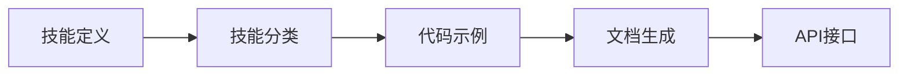

**技术特色**：
- 采用模块化技能设计，便于扩展和维护
- 支持多语言技能库，适应不同开发场景
- 提供标准化的技能调用接口，简化集成流程

#### 热度分析

- 项目Star数超13,000且近期增长迅猛，反映开发者对AI辅助工具的高需求
- 作为OpenAI官方项目，处于AI代码生成生态的核心位置，影响力持续扩大

#### 快速上手

```bash
git clone https://github.com/openai/skills.git
cd skills
pip install -r requirements.txt
python skills --list
```

#### 注意事项

- 项目许可证信息不明确，使用前需确认开源协议
- 可能需要OpenAI API密钥才能访问完整功能
- 项目处于活跃开发阶段，API和功能可能会有变更


### 4. shareAI-lab/learn-claude-code — [轻量级代码代理]

> **一句话总结**：用 TypeScript 构建的微型 Claude Code 代理，专注于通过 Bash 命令执行 AI 辅助编程任务。

#### 价值主张

| 维度 | 说明 |
|------|------|
| **解决痛点** | 提供轻量级、可自托管的 Claude Code 替代方案，无需复杂配置 |
| **目标用户** | 开发者、DevOps 工程师、系统管理员等命令行用户 |
| **核心亮点** | TypeScript 构建 + 纯 Bash 实现 + 零依赖部署 + 可扩展架构 |

#### 技术架构

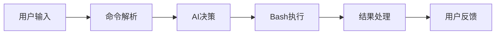

**技术特色**：
- 基于 TypeScript 开发，类型安全，易于维护和扩展
- 纯 Bash 实现，无需额外依赖，系统兼容性强
- 模块化设计，支持自定义插件和功能扩展

#### 热度分析

- 项目 Star 数达 2.3 万，单日增长 566，表明处于快速增长期，受开发者高度关注
- Fork 数 4409，社区活跃度高，参与者积极贡献代码和二次开发

#### 快速上手

```bash
# 克隆仓库
git clone https://github.com/shareAI-lab/learn-claude-code.git
cd learn-claude-code

# 安装依赖并运行
npm install && npm start
```

#### 注意事项

- 项目 License 未知，使用前需确认授权条款
- 作为实验性项目，可能存在稳定性问题，生产环境使用需谨慎测试
- 依赖 Bash 环境，非 Unix/Linux 系统可能需要额外配置


### 5. toeverything/AFFiNE — 全能知识库

> **一句话总结**：开源隐私优先的下一代知识库，整合规划、排序与创作功能，挑战Notion与Miro市场地位。

#### 价值主张

| 维度 | 说明 |
|------|------|
| **解决痛点** | 传统知识工具功能割裂，隐私保护不足，定制化程度低 |
| **目标用户** | 知识工作者、团队协作、项目管理、创意人员 |
| **核心亮点** | 全功能集成 + 隐私优先 + 开源可定制 + 跨平台支持 |

#### 技术架构

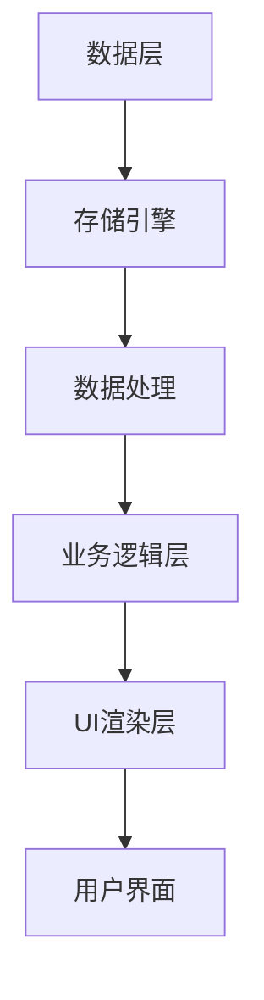

**技术特色**：
- 基于TypeScript构建，提供强类型安全和开发体验
- 采用模块化架构，支持功能扩展和定制
- 支持本地存储与云端同步，保障数据隐私

#### 热度分析

- Star数超6.5万且持续增长，表明项目受到广泛关注，知识管理工具市场需求强劲
- Fork数适中，社区活跃度较高，表明有较多开发者参与项目改进和定制

#### 快速上手

```bash
# 克隆项目
git clone https://github.com/toeverything/AFFiNE.git

# 安装依赖
cd AFFiNE && npm install

# 启动开发服务器
npm run dev
```

#### 注意事项

- 项目许可证信息不明确，使用前需确认开源许可条款
- 作为相对较新的项目，可能存在功能稳定性问题
- 数据迁移和与其他工具的集成可能需要额外开发工作


### 6. GoogleCloudPlatform/generative-ai — Google云生成式AI示例库

> **一句话总结**：提供Vertex AI平台上Gemini模型的完整示例代码和教程，助力开发者快速上手生成式AI应用开发。

#### 价值主张

| 维度 | 说明 |
|------|------|
| **解决痛点** | 解决开发者在Google Cloud上部署和使用生成式AI模型的技术门槛问题 |
| **目标用户** | Google Cloud平台上的AI开发者、数据科学家和机器学习工程师 |
| **核心亮点** | + 完整的示例代码 + 针对Gemini模型优化 + Jupyter Notebook格式 |

#### 技术架构

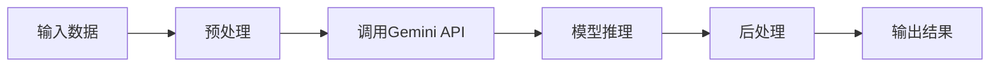

**技术特色**：
- 提供Vertex AI上Gemini模型的完整调用示例
- 包含多种生成式AI应用场景的端到端代码
- 集成Google Cloud生态系统中的其他服务

#### 热度分析

- 项目Star数超过14,000，近期增长迅速，日均增长超500，显示生成式AI领域的高关注度
- 作为Google官方维护的项目，在开发者社区中具有权威性，是学习Google生成式AI的重要资源

#### 快速上手

```bash
# 克隆项目仓库
git clone https://github.com/GoogleCloudPlatform/generative-ai.git

# 进入示例目录
cd generative-ai/getting-started
```

#### 注意事项

- 需要Google Cloud账号和Vertex AI API权限才能运行示例代码
- 示例代码需要配置适当的身份验证和API密钥
- 部分示例可能需要额外的Google Cloud服务订阅和计费


### 7. shadcn-ui/ui — 现代UI组件库

> **一句话总结**：美观易用的可访问性组件库，支持多框架，开源且代码可定制。

#### 价值主张

| 维度 | 说明 |
|------|------|
| **解决痛点** | 解决了开发者寻找美观且符合无障碍标准UI组件的难题 |
| **目标用户** | React、Next.js、Vue等现代前端框架开发者 |
| **核心亮点** | 可访问性强 + 设计美观 + 可定制性高 + 开源透明 + 跨框架支持 |

#### 技术架构

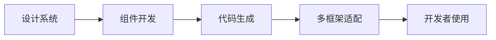

**技术特色**：
- 基于Radix UI构建，确保无障碍性
- 支持CSS变量实现主题定制
- 采用TypeScript编写，提供完整类型支持
- 代码生成器可快速集成到项目中

#### 热度分析

- 高星增长稳定，日均增长近500星，表明社区认可度高
- 在开源UI组件库中处于领先地位，影响力持续扩大

#### 快速上手

```bash
# 使用npx创建新项目
npx create-next-app@latest my-app --typescript
# 安装shadcn/ui
npx shadcn-ui@latest init
# 添加组件
npx shadcn-ui@latest add button
```

#### 注意事项

- 需要一定的TypeScript和现代前端框架基础
- 组件需要手动配置到项目中，不适合直接复制粘贴使用
- 主题定制需要理解CSS变量机制


### 8. pbakaus/impeccable — AI设计语言

> **一句话总结**：一种提升AI系统设计能力的设计语言框架，优化AI产品视觉表现。

#### 价值主张

| 维度 | 说明 |
|------|------|
| **解决痛点** | AI系统设计能力不足，缺乏专业设计指导体系 |
| **目标用户** | AI开发者、UI/UX设计师、AI产品构建团队 |
| **核心亮点** | 专业设计规范 + AI设计优化 + 组件化系统 + 设计一致性 |

#### 技术架构

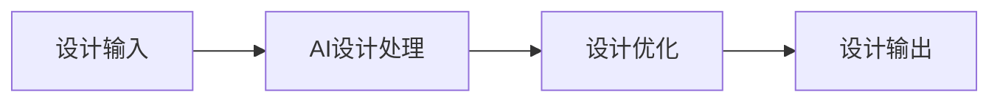

**技术特色**：
- 基于JavaScript的轻量级设计语言实现
- 提供AI系统专用的设计组件库
- 支持设计规范自动生成与优化

#### 热度分析

- 项目近期热度显著上升，单日增长443星，表明社区高度关注
- Fork数相对较少，说明项目可能处于早期阶段，尚未广泛采用

#### 快速上手

```bash
npm install impeccable
# 或
yarn add impeccable
import { init } from 'impeccable'
init()
```

#### 注意事项

- 项目许可证未知，使用前需确认开源协议
- 开放问题数为0，可能项目处于初期阶段，文档和示例可能不完善


### 9. virattt/ai-hedge-fund — AI量化投资平台

> **一句话总结**：基于人工智能的量化交易系统，自动执行对冲基金投资策略，实现金融市场自动化交易。

#### 价值主张

| 维度 | 说明 |
|------|------|
| **解决痛点** | 解决人工投资决策效率低、情绪化交易及大数据处理难题 |
| **目标用户** | 量化交易者、对冲基金团队及金融科技开发者 |
| **核心亮点** | 机器学习算法应用 + 自动交易执行 + 多市场数据整合 + 风险控制系统 |

#### 技术架构

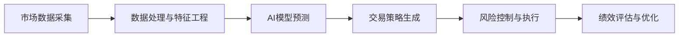

**技术特色**：
- 机器学习算法应用于市场趋势预测
- 多源异构金融数据实时处理框架
- 自动化交易执行与动态风险控制系统

#### 热度分析

- 项目获得近5万星，单日增长275星，表明量化投资领域AI应用受到高度关注
- 高Fork数显示社区活跃，参与者可能为金融科技开发者及量化交易爱好者

#### 快速上手

```bash
git clone https://github.com/virattt/ai-hedge-fund.git
cd ai-hedge-fund
pip install -r requirements.txt
python main.py --config config/default.yaml
```

#### 注意事项

- 注意市场风险，AI模型预测并非100%准确
- 需要金融市场知识和编程基础才能有效使用
- 可能需要配置API密钥连接交易数据源


### 10. Ed1s0nZ/CyberStrikeAI — AI安全测试平台

> **一句话总结**：基于Go语言开发的AI原生安全测试平台，集成百种安全工具，提供智能编排与全生命周期管理。

#### 价值主张

| 维度 | 说明 |
|------|------|
| **解决痛点** | 安全工具分散、测试流程复杂、缺乏智能编排的痛点 |
| **目标用户** | 网络安全专业人员、渗透测试团队、企业安全部门 |
| **核心亮点** | 集成百种安全工具 + 智能编排引擎 + 基于角色的测试系统 + 专业技能系统 |

#### 技术架构

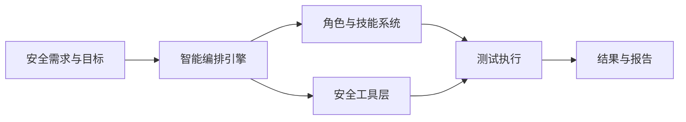

**技术特色**：
- 基于Go语言的高性能安全平台
- AI驱动的智能编排引擎
- 模块化的工具集成架构
- 基于角色的权限管理系统

#### 热度分析

- 项目近期获得244个Star，表明社区对其AI安全测试解决方案高度认可，增长势头强劲。
- 390个Fork数显示开发者积极参与项目定制，0个Open Issues可能表明项目维护良好或问题解决效率高。

#### 快速上手

```bash
git clone https://github.com/Ed1s0nZ/CyberStrikeAI.git
cd CyberStrikeAI
go run main.go
```

#### 注意事项

- 项目许可证未知，使用前需确认授权条款
- 项目描述较为抽象，实际功能需参考源代码或文档
- 集成的100+安全工具清单未明确列出，可能需要进一步探索


### 11. teng-lin/notebooklm-py — NotebookLM Python 接口

> **一句话总结**：非官方 Python API，让开发者能通过编程方式访问 Google NotebookLM 的 AI 笔记功能。

#### 价值主张

| 维度 | 说明 |
|------|------|
| **解决痛点** | Google NotebookLM 缺乏官方 API，限制开发者集成能力 |
| **目标用户** | 需要自动化笔记处理的研究人员、开发者和数据分析师 |
| **核心亮点** | + 完整封装 NotebookLM 功能 + 简化复杂交互流程 + 支持 Pythonic 操作 |

#### 技术架构

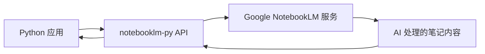

**技术特色**：
- 通过逆向工程实现非官方 API 接口
- 提供简洁的 Python 方法封装复杂 HTTP 请求
- 支持笔记上传、查询和 AI 交互等核心功能

#### 热度分析

- 项目获得 3741 stars 且近期增长迅速(+196 today)，表明 AI 笔记工具集成需求旺盛
- 作为 Google 服务的非官方实现，在 AI 辅助笔记工具生态中占据重要位置

#### 快速上手

```bash
# 安装
pip install notebooklm-py

# 基本使用
from notebooklm import NotebookLM
nlm = NotebookLM()
nlm.upload_notebook("path/to/notebook")
response = nlm.ask("总结这个笔记的主要内容")
```

#### 注意事项

- 作为非官方 API，存在稳定性风险，Google 可能随时更改其服务
- 需遵守 Google 的服务条款，避免过度调用导致账号限制
- 可能需要处理认证和授权问题，确保 API 访问安全


### 12. is-a-dev/register — 子域名服务

> **一句话总结**：提供.is-a.dev免费子域名注册服务，让开发者轻松获得个性化域名。

#### 价值主张

| 维度 | 说明 |
|------|------|
| **解决痛点** | 开发者缺乏免费且个性化的子域名解决方案 |
| **目标用户** | 需要个性化域名的开发者、个人项目创作者 |
| **核心亮点** | 免费获取 + 简单注册 + 即时生效 + 无需审核 |

#### 技术架构

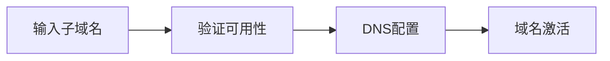

**技术特色**：
- 基于JavaScript的轻量级域名分配系统
- 自动化DNS配置流程
- 即时生效的域名服务

#### 热度分析

- 项目获得近万星和近两万次Fork，表明其在开发者社区中广受欢迎
- 作为免费域名服务，在开发者生态中占据重要位置，尤其是个人项目和小型开发者

#### 快速上手

```bash
# 访问项目网站
# 输入想要的子域名
# 完成简单注册流程
```

#### 注意事项

- 域名可能存在使用限制
- 需要遵守服务条款
- 可能有域名保留规则


## 今日推荐

| 主题 | 推荐项目 | 亮点 |
|------|----------|------|
| 今日最热 | [openclaw/openclaw](https://github.com/openclaw/openclaw) | Your own personal... |
| 值得关注 | [666ghj/MiroFish](https://github.com/666ghj/MiroFish) | A Simple and Univ... |
| 快速上手 | [openai/skills](https://github.com/openai/skills) | Skills Catalog fo... |
| 长期潜力 | [shareAI-lab/learn-claude-code](https://github.com/shareAI-lab/learn-claude-code) | Bash is all you n... |

---

<div align="center">

*Generated on 2026-03-09 | Powered by GitHub Trending Reporter*

</div>