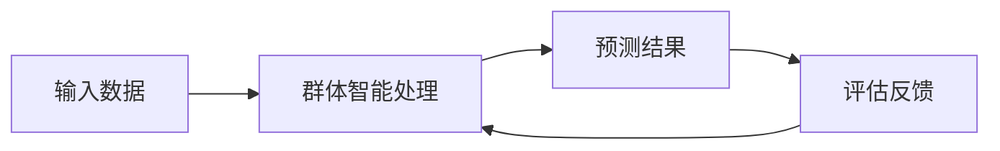
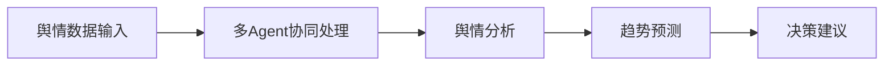
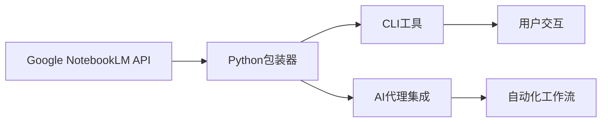
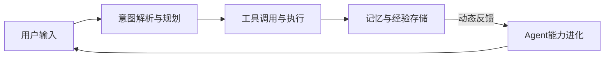
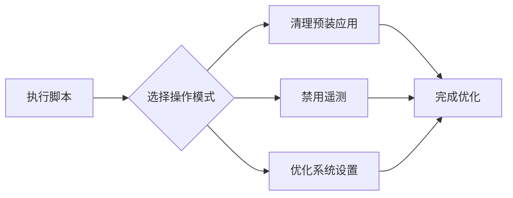

## 今日热点

生成式AI与智能体系统持续引领技术热潮，跨平台AI助手和群体智能引擎获得显著关注，反映出AI应用向实用化、专业化方向发展。

---

## 热门项目一览

| 排名 | 项目 | 语言 | 今日 | 总计 | 简介 |
|:---:|------|:----:|------:|-----:|------|
| 1 | [openclaw/openclaw](https://github.com/openclaw/openclaw) | TypeScript | +9,164 | 290,217 | Your own personal AI assist... |
| 2 | [msitarzewski/agency-agents](https://github.com/msitarzewski/agency-agents) | Shell | +4,415 | 19,324 | A complete AI agency at you... |
| 3 | [666ghj/MiroFish](https://github.com/666ghj/MiroFish) | Python | +2,294 | 10,919 | A Simple and Universal Swar... |
| 4 | [pbakaus/impeccable](https://github.com/pbakaus/impeccable) | JavaScript | +1,288 | 2,981 | The design language that ma... |
| 5 | [GoogleCloudPlatform/generative-ai](https://github.com/GoogleCloudPlatform/generative-ai) | Jupyter Notebook | +1,282 | 15,283 | Sample code and notebooks f... |
| 6 | [666ghj/BettaFish](https://github.com/666ghj/BettaFish) | Python | +514 | 37,346 | 微舆：人人可用的多Agent舆情分析助手，打破信息茧房... |
| 7 | [alibaba/page-agent](https://github.com/alibaba/page-agent) | TypeScript | +465 | 2,576 | JavaScript in-page GUI agen... |
| 8 | [teng-lin/notebooklm-py](https://github.com/teng-lin/notebooklm-py) | Python | +457 | 4,240 | Unofficial Python API and a... |
| 9 | [NousResearch/hermes-agent](https://github.com/NousResearch/hermes-agent) | Python | +377 | 2,978 | The agent that grows with you |
| 10 | [karpathy/nanochat](https://github.com/karpathy/nanochat) | Python | +355 | 45,516 | The best ChatGPT that $100 ... |
| 11 | [alirezarezvani/claude-skills](https://github.com/alirezarezvani/claude-skills) | Python | +259 | 3,347 | 169 production-ready skills... |
| 12 | [Raphire/Win11Debloat](https://github.com/Raphire/Win11Debloat) | PowerShell | +104 | 41,216 | A simple, lightweight Power... |

---

## 趋势洞察

```
┌─────────────────────────────────────────────────────────────────┐
│  AI/ML 工具         ████████████████████████  10 个项目        │
│  开发工具             ██                        1 个项目        │
│  其他               ██                        1 个项目        │
└─────────────────────────────────────────────────────────────────┘
```

---

## 项目深度解读


### 2. msitarzewski/agency-agents — [AI代理集合]

> **一句话总结**：提供多样化专业AI代理的Shell脚本集合，覆盖前端开发、社区管理等多个领域，即插即用。

#### 价值主张

| 维度 | 说明 |
|------|------|
| **解决痛点** | 提供一站式多领域AI代理，避免用户寻找和配置多种AI工具的繁琐 |
| **目标用户** | 开发者、内容创作者、社区管理者和需要AI辅助决策的专业人士 |
| **核心亮点** | 多样化专业代理 + 即插即用Shell脚本 + 每个代理独特个性 + 无需复杂配置 |

#### 技术架构


**技术特色**：
- 纯Shell脚本实现，跨平台兼容性强
- 模块化设计，每个代理独立运行且易于扩展
- 通过命令行参数配置，灵活调用不同功能

#### 热度分析

- 单日增长4,415星，显示项目近期爆发式流行，AI代理概念备受关注
- 高Fork比例表明社区积极参与二次开发，形成活跃的生态系统

#### 快速上手

```bash
# 克隆仓库
git clone https://github.com/msitarzewski/agency-agents.git

# 查看可用代理
ls agency-agents/agents

# 运行特定代理
./agency-agents/agents/[agent-name].sh [参数]
```

#### 注意事项

- 部分代理可能需要配置第三方API密钥或账号认证
- Shell脚本执行前需检查权限设置，确保安全性
- 网络连接是必要的，因为大多数代理需要调用外部AI服务


### 3. 666ghj/MiroFish — 群体智能预测引擎

> **一句话总结**：基于群体智能的通用预测引擎，可应用于多种复杂场景的预测任务

#### 价值主张

| 维度 | 说明 |
|------|------|
| **解决痛点** | 传统预测模型复杂且专用性强，缺乏通用解决方案 |
| **目标用户** | 数据科学家、研究人员、需要预测功能的开发者 |
| **核心亮点** | 简洁通用 + 群体智能算法 + Python实现 + 预测万物 + 高度可扩展 |

#### 技术架构



**技术特色**：
- 基于群体智能算法，模拟自然界的集体智慧
- Python实现，易于集成和扩展
- 支持多种预测场景，通用性强

#### 热度分析

- 项目Star数超10,000，单日增长2,294，表明近期获得广泛关注
- Fork/Star比例约1:10，显示项目有实际应用价值和二次开发需求

#### 快速上手

```bash
git clone https://github.com/666ghj/MiroFish.git
cd MiroFish
pip install -r requirements.txt
python main.py --input your_data.csv
```

#### 注意事项

- 项目许可证未知，商业使用前需确认授权条款
- 项目无公开Issues，可能意味着社区支持有限或处于早期阶段


### 4. pbakaus/impeccable — AI设计语言

> **一句话总结**：一种提升AI系统设计能力的语言框架，优化AI交互体验和界面设计。

#### 价值主张

| 维度 | 说明 |
|------|------|
| **解决痛点** | AI系统设计缺乏统一标准，交互体验参差不齐 |
| **目标用户** | AI应用开发者、UI/UX设计师、AI产品经理 |
| **核心亮点** | 统一设计规范 + AI特定组件库 + 响应式设计 + 可扩展架构 |

#### 技术架构


**技术特色**：
- 基于JavaScript的设计语言，易于与AI前端集成
- 提供专门针对AI交互的组件库，优化人机交互
- 模块化架构，支持快速定制和扩展
- 响应式设计确保跨设备一致体验

#### 热度分析

- 项目获得近3k星，单日增长超1.2k，显示AI设计领域需求激增
- Fork数相对较少(109)，表明项目处于早期阶段，用户更关注而非贡献

#### 快速上手

```bash
# 克隆项目
git clone https://github.com/pbakaus/impeccable.git

# 安装依赖
npm install

# 启动开发环境
npm start
```

#### 注意事项

- 项目许可证未知，商业使用前需确认授权条款
- 项目信息较少，可能处于早期开发阶段，API可能不稳定
- 需要一定的JavaScript和AI系统设计基础才能有效使用


### 5. GoogleCloudPlatform/generative-ai — 谷歌生成AI示例

> **一句话总结**：Google Cloud平台上基于Gemini和Vertex AI的生成式AI示例代码和教程集合。

#### 价值主张

| 维度 | 说明 |
|------|------|
| **解决痛点** | 提供在Google Cloud上部署和使用生成式AI的实用代码示例 |
| **目标用户** | AI开发者、数据科学家、Google Cloud平台用户 |
| **核心亮点** | + 完整的Jupyter Notebook示例 + Google Cloud集成 + Gemini模型支持 |

#### 技术架构


**技术特色**：
- 基于Vertex AI平台的生成式AI实现
- 支持最新的Gemini多模态模型
- 提供端到端的代码示例和教程

#### 热度分析

- 项目获得超过15k星，单日增长超1200，显示生成式AI领域的高关注度
- 作为Google官方示例项目，在生成式AI生态系统中具有重要参考价值

#### 快速上手

```bash
# 安装Vertex AI SDK
pip install google-cloud-aiplatform

# 设置认证环境
gcloud auth application-default login

# 运行示例Jupyter Notebook
jupyter notebook
```

#### 注意事项

- 需要Google Cloud账户和相关API权限才能使用示例代码
- 示例代码可能需要根据具体应用场景进行调整
- 建议查看最新文档以获取API更新和最佳实践


### 6. 666ghj/BettaFish — 舆情分析助手

> **一句话总结**：微舆是一款多Agent舆情分析工具，打破信息茧房，还原舆情原貌，预测未来走向，辅助决策。

#### 价值主张

| 维度 | 说明 |
|------|------|
| **解决痛点** | 解决信息茧房问题，提供全面客观的舆情分析，辅助决策 |
| **目标用户** | 政府部门、企业决策者、研究人员、媒体从业者 |
| **核心亮点** | 多Agent协同 + 原生实现 + 预测分析 + 决策支持 |

#### 技术架构



**技术特色**：
- 多Agent协同处理机制
- 原生Python实现，不依赖外部框架
- 舆情趋势预测算法
- 信息茧房突破技术

#### 热度分析

- 项目Star数超3.7万，近期增长迅速，表明舆情分析需求旺盛
- Fork数约7千，社区活跃度高，项目具有实用价值和扩展潜力

#### 快速上手

```bash
# 克隆项目
git clone https://github.com/666ghj/BettaFish.git

# 安装依赖
pip install -r requirements.txt
```

#### 注意事项

- 项目依赖未知，可能需要配置特定环境
- 作为舆情分析工具，使用时需注意数据隐私和合规性
- 不依赖框架可能意味着需要更多手动配置


### 7. alibaba/page-agent — [智能网页控制]

> **一句话总结**：通过自然语言理解技术，实现网页界面的智能控制与交互，简化用户操作流程。

#### 价值主张

| 维度 | 说明 |
|------|------|
| **解决痛点** | 网页操作复杂，缺乏直观的自然语言交互方式 |
| **目标用户** | Web开发者、测试人员、需要简化网页操作的非技术用户 |
| **核心亮点** | 自然语言理解 + 智能元素识别 + 无需代码集成 + 跨平台兼容 |

#### 技术架构


**技术特色**：
- 基于先进的自然语言处理技术，精准理解用户意图
- 智能DOM元素识别，准确定位网页交互对象
- 无需修改现有代码，通过注入方式轻松集成

#### 热度分析

- 项目获得2576个Star，近期增长迅速(+465 today)，显示社区高度关注
- 阿里巴巴出品，结合了业界领先的技术理念，在AI与Web交互领域具有独特地位

#### 快速上手

```bash
# 安装page-agent
npm install page-agent

# 在项目中引入
import { PageAgent } from 'page-agent';

# 创建实例并启动
const agent = new PageAgent();
agent.start();
```

#### 注意事项

- 此项目可能需要较新的浏览器版本支持，以确保所有功能正常工作
- 自然语言理解可能存在一定的局限性，对于复杂指令可能需要更精确的表达
- 在安全性敏感的环境中使用时，需要注意数据隐私问题


### 8. teng-lin/notebooklm-py — NotebookLM Python化

> **一句话总结**：为Google NotebookLM提供Python API和代理技能，实现全功能程序化访问。

#### 价值主张

| 维度 | 说明 |
|------|------|
| **解决痛点** | NotebookLM功能无法程序化调用，缺乏官方API支持 |
| **目标用户** | 需要集成NotebookLM功能的开发者、研究人员 |
| **核心亮点** | 完整API覆盖 + 网页UI未暴露功能 + 多平台支持 |

#### 技术架构



**技术特色**：
- 非官方API逆向工程实现
- 支持多种AI代理平台集成
- 提供CLI工具简化操作

#### 热度分析

- 项目近期增长迅猛，单日新增457 stars，显示社区高度关注
- 相对fork比例较高(523/4240)，表明用户积极参与项目贡献

#### 快速上手

```bash
# 安装项目
pip install notebooklm-py

# 基本使用
from notebooklm import NotebookLM
nlm = NotebookLM()
nlm.create_note("My Note", "Initial content")
```

#### 注意事项

- 作为非官方API，可能存在稳定性风险
- Google可能随时更新其服务，导致API失效
- 需要遵守Google服务条款，避免滥用API


### 9. NousResearch/hermes-agent — 自适应智能体框架

> **一句话总结**：NousResearch推出的开源智能体框架，具备持续学习与自我进化能力，打破传统静态限制，实现与用户协同成长。

#### 价值主张

| 维度 | 说明 |
|------|------|
| **解决痛点** | 传统AI智能体功能固化，无法根据用户习惯和环境变化进行自我更新与能力迭代。 |
| **目标用户** | AI开发者、工作流构建者，以及追求个性化智能助手的极客与研究人员。 |
| **核心亮点** | 动态记忆与学习机制 + 模块化工具调用 + 伴随式能力进化 + 多模态感知支持 |

#### 技术架构



**技术特色**：
- 引入动态记忆系统，支持长短期上下文结合，实现个性化交互


### 10. karpathy/nanochat — 轻量级LLM聊天

> **一句话总结**：基于本地运行的高效LLM实现，提供接近ChatGPT体验但成本极低的对话功能。

#### 价值主张

| 维度 | 说明 |
|------|------|
| **解决痛点** | 提供低成本、低延迟、隐私保护的本地聊天机器人解决方案 |
| **目标用户** | 开发者、AI爱好者、注重隐私的个人用户 |
| **核心亮点** | + 本地运行无需API费用 + 低延迟响应 + 保护用户隐私 + 轻量级部署 |

#### 技术架构


**技术特色**：
- 基于小型高效LLM模型实现本地化运行
- 采用量化技术降低资源需求
- 优化推理速度实现实时响应

#### 热度分析

- 项目获得4.5万+星标，日增长数百，表明社区对其低成本LLM方案高度认可
- 作为Karpathy的作品，在AI开源社区具有重要影响力，引领本地化LLM应用趋势

#### 快速上手

```bash
# 克隆仓库
git clone https://github.com/karpathy/nanochat.git
cd nanochat

# 安装依赖并运行
pip install -r requirements.txt
python nanochat.py
```

#### 注意事项

- 需要一定硬件配置，尤其是GPU资源
- 模型性能与云端ChatGPT仍有差距
- 需要自行下载或获取模型权重文件


### 11. alirezarezvani/claude-skills — AI技能插件库

> **一句话总结**：为Claude等AI助手提供169个生产就绪的专业技能与插件，覆盖工程、营销、合规等多个领域。

#### 价值主张

| 维度 | 说明 |
|------|------|
| **解决痛点** | AI助手缺乏专业领域技能和插件，限制其实用性 |
| **目标用户** | 开发者、营销人员、产品经理、合规专家和企业高管 |
| **核心亮点** | 169个生产就绪技能 + 多领域覆盖 + 插件市场安装方式 |

#### 技术架构

**技术特色**：
- 基于Python构建的模块化插件系统
- 支持多AI助手平台统一接口设计
- 采用标准化技能描述与调用机制

#### 热度分析

- 项目获3347个Star且单日增长259，显示近期热度迅速上升
- 作为AI辅助工具生态的重要补充，正吸引专业用户广泛关注

#### 快速上手

```bash
# 通过插件市场安装
/plugin install [skill-name]

# 或直接克隆仓库
git clone https://github.com/alirezarezvani/claude-skills.git
cd claude-skills
python install.py
```

#### 注意事项

- 许可证未知，使用前需确认授权条款
- 某些技能可能需要额外的API密钥或订阅服务
- 插件兼容性可能随AI助手平台更新而变化


### 12. Raphire/Win11Debloat — 系统精简工具

> **一句话总结**：轻量级PowerShell脚本，一键清理Windows预装应用并优化系统隐私设置。

#### 价值主张

| 维度 | 说明 |
|------|------|
| **解决痛点** | 解决Windows系统预装臃肿、隐私收集过度的问题 |
| **目标用户** | 追求系统纯净、注重隐私保护的Windows用户 |
| **核心亮点** | 模块化设计 + 安全卸载机制 + 兼容Win10/11 |

#### 技术架构



**技术特色**：
- 纯PowerShell实现，无需额外依赖
- 支持选择性执行，提供灵活定制选项
- 安全的卸载机制，避免系统损坏

#### 热度分析

- 项目获4.1万Star且持续增长，反映Windows优化需求稳定
- Fork数相对较少，表明用户更倾向直接使用而非二次开发

#### 快速上手

```bash
# 下载脚本
Invoke-WebRequest -Uri "https://github.com/Raphire/Win11Debloat/raw/main/Win11Debloat.ps1" -OutFile "Win11Debloat.ps1"

# 以管理员权限执行
Set-ExecutionPolicy RemoteSigned -Scope CurrentUser
.\Win11Debloat.ps1
```

#### 注意事项

- 必须以管理员权限运行PowerShell
- 建议执行前创建系统还原点
- 系统更新可能会重新安装被移除的应用，需定期维护


## 今日推荐

| 主题 | 推荐项目 | 亮点 |
|------|----------|------|
| 今日最热 | [openclaw/openclaw](https://github.com/openclaw/openclaw) | Your own personal... |
| 值得关注 | [msitarzewski/agency-agents](https://github.com/msitarzewski/agency-agents) | A complete AI age... |
| 快速上手 | [666ghj/MiroFish](https://github.com/666ghj/MiroFish) | A Simple and Univ... |
| 长期潜力 | [pbakaus/impeccable](https://github.com/pbakaus/impeccable) | The design langua... |

---

<div align="center">

*Generated on 2026-03-10 | Powered by GitHub Trending Reporter*

</div>