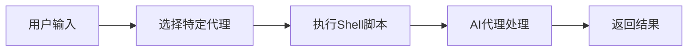
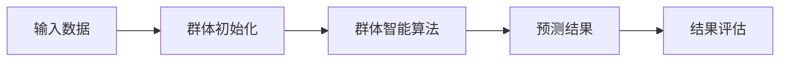
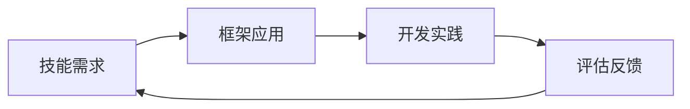
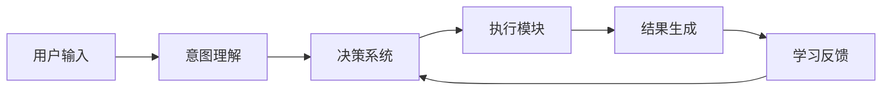
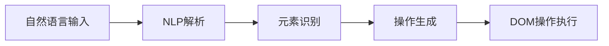
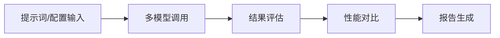
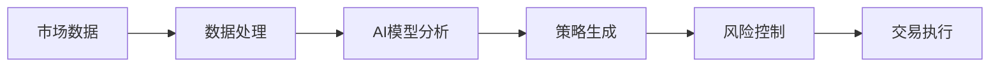
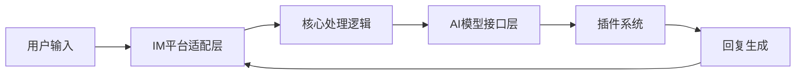
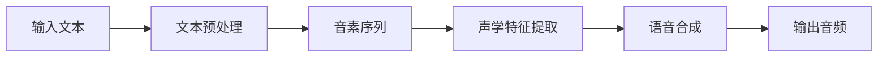

## 今日热点

今日GitHub热榜核心趋势为AI代理技术爆发与群体智能预测崛起，反映AI系统向专业化、多平台整合及测试评估完善方向发展。

---

## 热门项目一览

| 排名 | 项目 | 语言 | 今日 | 总计 | 简介 |
|:---:|------|:----:|------:|-----:|------|
| 1 | [msitarzewski/agency-agents](https://github.com/msitarzewski/agency-agents) | Shell | +6,167 | 30,134 | A complete AI agency at you... |
| 2 | [666ghj/MiroFish](https://github.com/666ghj/MiroFish) | Python | +2,907 | 16,813 | A Simple and Universal Swar... |
| 3 | [obra/superpowers](https://github.com/obra/superpowers) | Shell | +1,483 | 78,087 | An agentic skills framework... |
| 4 | [NousResearch/hermes-agent](https://github.com/NousResearch/hermes-agent) | Python | +1,234 | 5,264 | The agent that grows with you |
| 5 | [alibaba/page-agent](https://github.com/alibaba/page-agent) | TypeScript | +1,215 | 4,768 | JavaScript in-page GUI agen... |
| 6 | [promptfoo/promptfoo](https://github.com/promptfoo/promptfoo) | TypeScript | +718 | 12,565 | Test your prompts, agents, ... |
| 7 | [virattt/ai-hedge-fund](https://github.com/virattt/ai-hedge-fund) | Python | +636 | 48,162 | An AI Hedge Fund Team |
| 8 | [AstrBotDevs/AstrBot](https://github.com/AstrBotDevs/AstrBot) | Python | +342 | 21,073 | Agentic IM Chatbot infrastr... |
| 9 | [fishaudio/fish-speech](https://github.com/fishaudio/fish-speech) | Python | +313 | 25,804 | SOTA Open Source TTS |

---

## 趋势洞察

```
┌─────────────────────────────────────────────────────────────────┐
│  AI/ML 工具         ████████████████████████  7 个项目        │
│  多媒体应用            ███                       1 个项目        │
│  其他               ███                       1 个项目        │
└─────────────────────────────────────────────────────────────────┘
```

---

## 项目深度解读

### 1. msitarzewski/agency-agents — AI代理库

> **一句话总结**：提供一系列具有个性与专长的AI代理脚本，涵盖前端开发到社区管理等多领域专家。

#### 价值主张

| 维度 | 说明 |
|------|------|
| **解决痛点** | 提供即用型AI专家代理，无需自行构建复杂AI系统 |
| **目标用户** | 开发者、内容创作者、社区管理员及需要AI辅助的专业人士 |
| **核心亮点** | 多领域专家覆盖 + 即开即用 + 个性鲜明 + 专业流程 + 可验证成果 |

#### 技术架构



**技术特色**：
- 轻量级Shell实现，跨平台兼容性强
- 模块化代理设计，便于扩展和维护
- 命令行交互友好，易于集成到工作流

#### 热度分析

- 项目Star数高且近期激增(+6,167 today)，表明AI代理概念近期备受关注
- 零Open Issues反映项目成熟度高，社区维护良好

#### 快速上手

```bash
# 克隆仓库
git clone https://github.com/msitarzewski/agency-agents.git

# 列出可用代理
cd agency-agents && ls agents

# 运行特定代理，例如前端专家
./agents/frontend-wizard.sh
```

#### 注意事项

- 需要确保系统已安装必要的Shell环境依赖
- 某些代理可能需要额外的API密钥或配置
- Shell脚本执行权限需正确设置，可通过chmod +x命令授权


### 2. 666ghj/MiroFish — 群体智能引擎

> **一句话总结**：简洁通用的群体智能引擎，通过模拟群体行为实现多领域精准预测。

#### 价值主张

| 维度 | 说明 |
|------|------|
| **解决痛点** | 传统预测模型复杂度高、适用范围有限的问题 |
| **目标用户** | 需要通用预测解决方案的研究人员和开发者 |
| **核心亮点** | 简单易用 + 通用性强 + 群体智能算法 + 高精度预测 + 多领域适应 |

#### 技术架构



**技术特色**：
- 基于群体智能的预测算法，模拟自然界的群体行为
- 简洁的Python实现，易于理解和扩展
- 通用性强，可适应多种预测场景

#### 热度分析

- 项目近期获得大量关注，单日增长超过2900 stars，显示高度社区认可
- 零open issues表明项目维护良好，用户体验问题已被及时解决

#### 快速上手

```bash
# 安装项目
pip install MiroFish

# 基本使用示例
from MiroFish import SwarmIntelligence
model = SwarmIntelligence()
results = model.predict(input_data)
```

#### 注意事项

- 项目许可证未知，商业使用前需确认授权情况
- 群体智能算法可能需要调参以获得最佳预测效果
- 项目文档相对简单，可能需要一定的算法基础才能充分利用


### 3. obra/superpowers — 智能开发框架

> **一句话总结**：一个基于智能体技能的实用软件开发框架，帮助开发者高效构建可靠软件。

#### 价值主张

| 维度 | 说明 |
|------|------|
| **解决痛点** | 软件开发方法论复杂且难以落地，缺乏实用框架指导实践 |
| **目标用户** | 软件开发者、技术团队和项目管理者 |
| **核心亮点** | 智能体技能框架 + 实用开发方法论 + 可落地的实践指南 |

#### 技术架构



**技术特色**：
- Shell脚本实现，跨平台兼容性强
- 模块化设计，易于扩展和定制
- 基于智能体的方法论，适应性强

#### 热度分析

- 项目Star数高且近期增长迅速，表明开发者社区认可度高
- Fork数适中，说明项目有良好的社区参与度和二次开发价值

#### 快速上手

```bash
# 克隆项目
git clone https://github.com/obra/superpowers.git
# 进入目录
cd superpowers
# 运行脚本
./superpowers init
```

#### 注意事项

- 项目许可证未知，商业使用前需确认授权
- Shell脚本在不同操作系统上可能有兼容性问题
- 需要一定的Shell编程基础才能充分利用项目特性


### 4. NousResearch/hermes-agent — [成长型智能代理]

> **一句话总结**：一个能够持续学习和适应用户需求的智能代理系统，提供个性化服务。

#### 价值主张

| 维度 | 说明 |
|------|------|
| **解决痛点** | 传统代理系统缺乏适应性，无法根据用户需求变化提供持续优化服务 |
| **目标用户** | 需要长期使用智能代理的开发者、研究人员和企业用户 |
| **核心亮点** | 自学习能力 + 持续适应 + 个性化服务 + 可扩展架构 |

#### 技术架构



**技术特色**：
- 基于反馈的持续学习机制
- 模块化设计支持功能扩展
- 上下文感知能力提升交互质量

#### 热度分析

- 项目近期获得大量关注，单日增长超过1200星，表明社区高度认可其价值
- 作为智能代理系统，填补了市场对自适应AI助手的空白需求

#### 快速上手

```bash
# 克隆仓库
git clone https://github.com/NousResearch/hermes-agent.git
cd hermes-agent

# 安装依赖
pip install -r requirements.txt

# 初始化并运行代理
python -m hermes_agent init
python -m hermes_agent run
```

#### 注意事项

- 项目许可证未知，使用前需确认授权条款
- 作为成长型代理，初期可能需要较多训练数据才能发挥最佳性能
- 建议定期更新以获取最新的学习模型和功能改进


### 5. alibaba/page-agent — 网页智能助手

> **一句话总结**：通过自然语言控制网页界面的JavaScript智能代理工具

#### 价值主张

| 维度 | 说明 |
|------|------|
| **解决痛点** | 简化网页交互自动化，无需编写复杂代码即可控制网页元素 |
| **目标用户** | 前端开发者、测试工程师、自动化脚本编写者 |
| **核心亮点** | 自然语言控制界面 + 智能元素识别 + 跨浏览器兼容 + 轻量级集成 + 简单API设计 |

#### 技术架构



**技术特色**：
- 基于NLP的意图识别系统，将自然语言转换为可执行的网页操作
- 智能页面元素定位技术，减少对固定选择器的依赖
- 轻量级JavaScript代理，无需额外依赖即可嵌入现有网页

#### 热度分析

- 项目近期获得大量关注，单日增长超过1200个Star，显示市场需求强烈
- 作为阿里开源项目，在自动化测试和前端开发领域具有显著影响力

#### 快速上手

```bash
# 安装
npm install page-agent

# 初始化
page-agent.init()

# 使用自然语言控制页面
page-agent.control("点击登录按钮")
```

#### 注意事项
- 需要确保目标网页的DOM结构稳定，以避免元素识别失败
- 复杂网页可能需要额外配置元素识别策略
- 自然语言理解可能存在边界情况，建议结合固定选择器作为备选方案


### 6. promptfoo/promptfoo — AI测试工具

> **一句话总结**：多模型AI提示词测试与红队扫描工具，支持性能对比与CI/CD集成。

#### 价值主张

| 维度 | 说明 |
|------|------|
| **解决痛点** | 解决AI提示词效果评估困难、多模型对比复杂、安全测试繁琐问题 |
| **目标用户** | AI开发者、测试工程师、安全研究员、产品经理 |
| **核心亮点** | + 多模型并行测试 + 红队安全扫描 + 性能对比分析 + 声明式配置 + CI/CD集成 |

#### 技术架构



**技术特色**：
- 支持多种主流AI模型并行测试评估
- 提供声明式配置管理测试用例
- 内置红队测试和安全漏洞扫描功能
- 支持命令行和CI/CD集成，便于自动化
- 可视化对比分析不同模型性能表现

#### 热度分析

- 项目Star数达12.5k，单日增长718，增长迅猛，显示市场需求旺盛
- Fork数1.157，表明社区活跃度高，用户参与度强
- Open Issues为0，可能表明问题管理良好或项目处于稳定阶段

#### 快速上手

```bash
# 安装promptfoo
npm install -g promptfoo

# 创建测试配置
echo 'prompts: ["What is the capital of France?"]' > promptfooconfig.yaml

# 运行测试
promptfoo test
```

#### 注意事项

- 需要配置各AI模型的API密钥才能进行测试
- 测试过程中会产生API调用费用，需注意成本控制
- 项目License未知，商业使用前需确认授权条款
- 测试结果受模型版本和参数设置影响，需保持测试环境一致性


### 7. virattt/ai-hedge-fund — AI量化交易系统

> **一句话总结**：基于人工智能技术的自动化量化交易系统，实现智能投资决策与执行。

#### 价值主张

| 维度 | 说明 |
|------|------|
| **解决痛点** | 传统投资决策受情绪影响，AI系统实现理性高效的市场分析与交易执行 |
| **目标用户** | 量化交易员、投资机构、金融科技开发者 |
| **核心亮点** | 机器学习预测 + 多策略组合 + 自动化交易 + 风险控制 + 实时优化 |

#### 技术架构



**技术特色**：
- 采用深度学习算法分析市场趋势与模式
- 多种量化策略并行运行与动态权重调整
- 实时监控与风控机制保障系统稳定性

#### 热度分析

- 项目近5万星标且持续增长，反映AI量化交易领域的高关注度与发展潜力
- 作为开源金融科技标杆，引领社区推动AI技术在投资领域的创新应用

#### 快速上手

```bash
# 安装必要依赖
pip install pandas numpy scikit-learn tensorflow

# 基本策略示例
import pandas as pd
import numpy as np

# 加载市场数据
data = pd.read_csv('market_data.csv')

# 计算移动平均线
data['MA20'] = data['price'].rolling(window=20).mean()
data['MA50'] = data['price'].rolling(window=50).mean()

# 生成交易信号
data['signal'] = np.where(data['MA20'] > data['MA50'], 1, -1)
```

#### 注意事项

- 金融市场风险极高，AI模型无法完全预测市场波动，实盘交易需谨慎
- 实际应用需考虑交易成本、滑点、流动性等现实因素
- 不同国家和地区对算法交易有不同监管要求，需遵守当地法律法规


### 8. AstrBotDevs/AstrBot — 全平台聊天机器人框架

> **一句话总结**：多平台集成的AI聊天机器人基础设施，支持多种IM平台和LLM，可作为OpenClaw的替代方案。

#### 价值主张

| 维度 | 说明 |
|------|------|
| **解决痛点** | 整合分散的IM平台与AI能力，提供统一的多平台聊天机器人解决方案 |
| **目标用户** | 需要跨平台自动化聊天能力的开发者和企业用户 |
| **核心亮点** | 多IM平台集成 + 丰富的AI模型支持 + 插件化架构 + 开源可定制 |

#### 技术架构



**技术特色**：
- 模块化设计支持多种IM平台无缝接入
- 插件化架构实现功能灵活扩展
- 统一的AI模型接口层支持多种LLM

#### 热度分析

- 项目Star数超2万且持续增长，社区认可度高，近期增长势头强劲
- 作为OpenClaw替代品，在AI聊天机器人生态中占据重要位置

#### 快速上手

```bash
# 克隆项目
git clone https://github.com/AstrBotDevs/AstrBot.git
cd AstrBot
# 安装依赖并启动
pip install -r requirements.txt && python bot.py
```

#### 注意事项

- 项目许可证未知，使用前需确认开源协议
- 需要配置多个IM平台的API密钥
- 依赖大量第三方AI服务，可能产生相关费用


### 9. fishaudio/fish-speech — [先进开源语音合成]

> **一句话总结**：fish-speech是一款开源的高质量文本转语音系统，提供接近人声的自然语音合成能力。

#### 价值主张

| 维度 | 说明 |
|------|------|
| **解决痛点** | 突破传统TTS语音生硬问题，提供情感丰富、自然流畅的语音合成 |
| **目标用户** | 语音应用开发者、内容创作者、无障碍技术支持者、语音研究人员 |
| **核心亮点** | 高质量语音合成 + 多语言支持 + 开源免费 + 可定制化 + 低资源部署 |

#### 技术架构



**技术特色**：
- 采用先进神经网络架构实现高质量语音合成
- 支持多语言混合处理与风格迁移
- 提供轻量化模型适配不同硬件环境

#### 热度分析

- 项目获星标2.5万+且持续快速增长，表明在TTS领域获得广泛认可
- 开源社区活跃度高，二次开发与应用场景不断拓展

#### 快速上手

```bash
# 克隆项目
git clone https://github.com/fishaudio/fish-speech.git
cd fish-speech

# 安装依赖
pip install -r requirements.txt

# 运行示例
python examples/simple_tts.py --text "你好，欢迎使用fish-speech"
```

#### 注意事项

- 项目需要较高计算资源，建议使用GPU以获得最佳性能
- 不同语言和语音风格可能需要额外的训练数据和配置调整
- 使用时需关注项目许可证要求，确保合规使用


## 今日推荐

| 主题 | 推荐项目 | 亮点 |
|------|----------|------|
| 今日最热 | [msitarzewski/agency-agents](https://github.com/msitarzewski/agency-agents) | A complete AI age... |
| 值得关注 | [666ghj/MiroFish](https://github.com/666ghj/MiroFish) | A Simple and Univ... |
| 快速上手 | [obra/superpowers](https://github.com/obra/superpowers) | An agentic skills... |
| 长期潜力 | [NousResearch/hermes-agent](https://github.com/NousResearch/hermes-agent) | The agent that gr... |

---

<div align="center">

*Generated on 2026-03-12 | Powered by GitHub Trending Reporter*

</div>