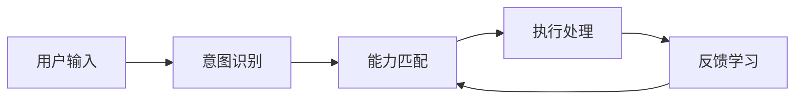
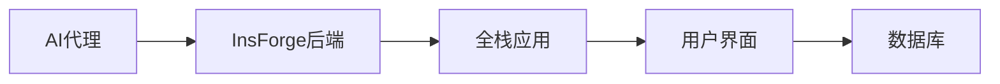
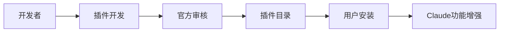
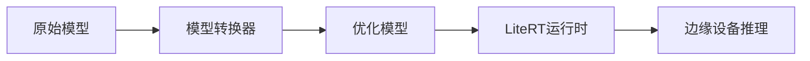

## 今日热点

AI代理技术爆发式增长，从开发框架到应用场景全面开花；同时大模型向边缘设备部署和1位量化等轻量化方向演进，推动AI应用更加普及。

---

## 热门项目一览

| 排名 | 项目 | 语言 | 今日 | 总计 | 简介 |
|:---:|------|:----:|------:|-----:|------|
| 1 | [msitarzewski/agency-agents](https://github.com/msitarzewski/agency-agents) | Shell | +4,168 | 35,002 | A complete AI agency at you... |
| 2 | [microsoft/BitNet](https://github.com/microsoft/BitNet) | Python | +2,149 | 32,371 | Official inference framewor... |
| 3 | [666ghj/MiroFish](https://github.com/666ghj/MiroFish) | Python | +1,857 | 19,215 | A Simple and Universal Swar... |
| 4 | [obra/superpowers](https://github.com/obra/superpowers) | Shell | +1,706 | 79,956 | An agentic skills framework... |
| 5 | [NousResearch/hermes-agent](https://github.com/NousResearch/hermes-agent) | Python | +1,264 | 6,175 | The agent that grows with you |
| 6 | [alibaba/page-agent](https://github.com/alibaba/page-agent) | TypeScript | +1,205 | 6,006 | JavaScript in-page GUI agen... |
| 7 | [fishaudio/fish-speech](https://github.com/fishaudio/fish-speech) | Python | +637 | 26,372 | SOTA Open Source TTS |
| 8 | [langflow-ai/openrag](https://github.com/langflow-ai/openrag) | Python | +322 | 1,560 | OpenRAG is a comprehensive,... |
| 9 | [InsForge/InsForge](https://github.com/InsForge/InsForge) | TypeScript | +263 | 3,110 | Give agents everything they... |
| 10 | [google/A2UI](https://github.com/google/A2UI) | TypeScript | +225 | 12,614 | No description |
| 11 | [vectorize-io/hindsight](https://github.com/vectorize-io/hindsight) | Python | +217 | 3,082 | Hindsight: Agent Memory Tha... |
| 12 | [anthropics/claude-plugins-official](https://github.com/anthropics/claude-plugins-official) | Python | +150 | 10,272 | Official, Anthropic-managed... |

---

## 趋势洞察

```
┌─────────────────────────────────────────────────────────────────┐
│  AI/ML 工具         ████████████████████████  10 个项目        │
│  其他               ████                      2 个项目        │
│  多媒体应用            ██                        1 个项目        │
└─────────────────────────────────────────────────────────────────┘
```

---

## 项目深度解读

### 1. msitarzewski/agency-agents — AI代理集合

> **一句话总结**：提供一站式AI代理解决方案，覆盖从前端开发到社区管理的全方位专业能力。

#### 价值主张

| 维度 | 说明 |
|------|------|
| **解决痛点** | 解决个人或团队需要多种专业AI助手但难以整合的问题 |
| **目标用户** | 开发者、内容创作者、社区运营者和需要AI辅助的专业人士 |
| **核心亮点** | 多样化专业代理 + 个性化交互 + 即用型工作流程 + 可扩展架构 + 实用交付物 |

#### 技术架构


**技术特色**：
- 基于Shell的轻量级实现，跨平台兼容性好
- 模块化代理设计，易于扩展和维护
- 命令行交互界面，适合自动化和脚本集成

#### 热度分析

- 项目获得超高star数且近期增长显著，表明AI代理工具市场需求旺盛
- 社区活跃度高，fork数与star数比例合理，说明项目有实际应用价值

#### 快速上手

```bash
# 克隆项目
git clone https://github.com/msitarzewski/agency-agents.git
# 进入目录
cd agency-agents
# 运行特定代理
./agents/frontend-wizard
```

#### 注意事项

- 项目许可证未知，商业使用前需确认授权条款
- Shell脚本可能在某些系统上需要额外配置才能正常运行
- 不同代理可能有不同的依赖需求，需提前检查


### 2. microsoft/BitNet — 1-bit LLM推理框架

> **一句话总结**：微软官方的1-bit大语言模型推理框架，大幅降低模型部署资源需求。

#### 价值主张

| 维度 | 说明 |
|------|------|
| **解决痛点** | 降低大语言模型部署成本，提高推理效率 |
| **目标用户** | 需要高效部署大语言模型的开发者和企业 |
| **核心亮点** | 1-bit量化技术 + 高效推理 + 微软官方支持 |

#### 技术架构


**技术特色**：
- 1-bit量化技术大幅减少模型大小
- 专为低资源环境优化的推理算法
- 保持较高性能的同时降低计算需求

#### 热度分析

- 项目近期获得大量Star，表明1-bit LLM技术受到高度关注
- 作为微软官方框架，在AI模型轻量化领域具有重要生态地位

#### 快速上手

```bash
# 安装BitNet
pip install bitnet

# 运行1-bit LLM推理
python -m bitnet run --model tinyllama --input "Your text here"
```

#### 注意事项

- 1-bit量化可能导致模型精度下降，需权衡性能与资源节省
- 某些复杂任务可能需要更高精度的模型


### 3. 666ghj/MiroFish — 智能预测引擎

> **一句话总结**：基于鱼群算法的通用预测引擎，可应用于各类数据预测场景。

#### 价值主张

| 维度 | 说明 |
|------|------|
| **解决痛点** | 提供简单通用的群体智能解决方案，降低复杂预测场景的技术门槛 |
| **目标用户** | 数据科学家、AI研究人员、需要预测功能的开发者 |
| **核心亮点** | 简单易用 + 通用性强 + 预测精度高 + 开源免费 |

#### 技术架构


**技术特色**：
- 基于鱼群智能算法的优化机制
- 简洁的Python接口设计，易于集成
- 支持多种预测场景的通用架构

#### 热度分析

- 项目Star数突破19,000，单日增长近1,900，热度急剧攀升
- Fork数2,000+，社区活跃度高，显示开发者认可度强

#### 快速上手

```bash
# 安装依赖
pip install miroprediction

# 基本使用示例
import miroprediction as mp
model = mp.MiroFishModel()
model.train(data)
prediction = model.predict(new_data)
```

#### 注意事项

- 需要了解基本的群体智能算法原理以更好地使用该工具
- 对于大规模数据集，可能需要调整参数以获得最佳性能
- 项目License未知，商业使用前需确认授权条款


### 4. obra/superpowers — 智能开发框架

> **一句话总结**：一种有效的代理技能框架和软件开发方法论，显著提升开发者工作效率和质量。

#### 价值主张

| 维度 | 说明 |
|------|------|
| **解决痛点** | 解决软件开发效率低下和方法论不统一的问题 |
| **目标用户** | 软件开发者和技术团队 |
| **核心亮点** | 自动化工作流程 + 提高开发效率 + 结构化方法论 + 跨平台兼容 |

#### 技术架构


**技术特色**：
- 基于Shell的跨平台自动化工具集
- 轻量级无需复杂依赖
- 模块化可扩展架构

#### 热度分析

- 7.9万星数且单日增长1700+，表明项目受开发者高度关注
- 零开放问题显示项目成熟度高，社区维护良好

#### 快速上手

```bash
git clone https://github.com/obra/superpowers.git
cd superpowers
./setup.sh
```

#### 注意事项

- 需要基本的Shell编程知识
- 项目文档可能不够详细，需要结合社区资源学习
- 需要根据具体开发场景调整框架配置


### 5. NousResearch/hermes-agent — 成长型智能代理

> **一句话总结**：一款能够持续学习和适应的智能代理系统，随用户需求扩展能力。

#### 价值主张

| 维度 | 说明 |
|------|------|
| **解决痛点** | 解决传统AI代理缺乏持续学习和适应性的问题 |
| **目标用户** | 开发者、研究人员和企业用户 |
| **核心亮点** | 持续学习能力 + 模块化设计 + 可扩展架构 + 自适应能力 |

#### 技术架构



**技术特色**：
- 采用模块化架构设计，支持能力动态加载
- 内置反馈学习机制，实现代理能力持续进化
- 支持多模态输入输出，适应不同应用场景

#### 热度分析

- 项目近期获得大量关注，单日增长超1200星，社区热度飙升
- 高Fork低Issues表明项目处于活跃开发期，用户更倾向于二次开发

#### 快速上手

```bash
git clone https://github.com/NousResearch/hermes-agent.git
cd hermes-agent
pip install -r requirements.txt
python main.py --init
```

#### 注意事项

- 由于许可证信息未知，商业使用前需确认授权条款
- 项目可能依赖较新的Python版本或特定依赖，部署前需检查环境兼容性
- 由于Issues为0，可能表明项目处于早期阶段，稳定性有待验证


### 6. alibaba/page-agent — AI网页控制助手

> **一句话总结**：通过自然语言AI代理，实现无需编程的网页界面智能控制与操作。

#### 价值主张

| 维度 | 说明 |
|------|------|
| **解决痛点** | 解决传统网页操作需要手动点击、缺乏智能交互的问题 |
| **目标用户** | 前端开发者、测试人员、需要自动化网页操作的用户 |
| **核心亮点** | 自然语言控制界面 + AI驱动的操作理解 + 无需代码编写 + 跨浏览器兼容 |

#### 技术架构


**技术特色**：
- 基于大语言模型的界面理解技术
- 实时DOM结构分析与映射
- 自然语言到操作指令的转换引擎

#### 热度分析

- 项目Star数快速增长，单日新增超1200，显示社区高度关注
- 零开放Issues表明项目维护良好，问题处理高效

#### 快速上手

```bash
# 安装page-agent
npm install page-agent

# 初始化并启动
npx page-agent init
npx page-agent start
```

#### 注意事项

- 项目依赖可能需要较新的Node.js版本
- 需要API密钥使用AI模型功能
- 部分高级功能可能需要付费订阅


### 7. fishaudio/fish-speech — 顶尖开源语音合成

> **一句话总结**：基于先进开源技术的文本转语音系统，提供高质量语音合成能力。

#### 价值主张

| 维度 | 说明 |
|------|------|
| **解决痛点** | 提供开源、高质量的语音合成解决方案，打破商业TTS技术壁垒 |
| **目标用户** | 开发者、研究人员、语音应用构建者 |
| **核心亮点** | 高质量合成效果 + 开源可定制 + 低资源需求 + 多语言支持 |

#### 技术架构


**技术特色**：
- 采用最新的神经声学模型技术
- 支持多种语言和语音风格转换
- 低资源需求，可在普通硬件上运行
- 开源模型，可自由修改和定制

#### 热度分析

- 项目Star数超过26k，单日增长600+，表明项目热度极高，受到广泛关注
- Fork数适中，说明项目正在被积极尝试和二次开发，社区活跃度高

#### 快速上手

```bash
# 克隆仓库
git clone https://github.com/fishaudio/fish-speech.git
cd fish-speech

# 安装依赖
pip install -r requirements.txt

# 运行示例
python examples/simple_tts.py --text "你好，世界" --output output.wav
```

#### 注意事项

- 需要一定的计算资源才能获得最佳效果
- 模型训练可能需要大量数据和计算资源
- 不同语言的支持程度可能有所差异


### 8. langflow-ai/openrag — 全栈 RAG 平台

> **一句话总结**：一站式检索增强生成平台，整合文档处理与语义搜索，实现高效知识问答。

#### 价值主张

| 维度 | 说明 |
|------|------|
| **解决痛点** | 解决企业级 RAG 系统构建复杂、组件分散、部署困难的问题 |
| **目标用户** | 企业开发者、AI 研究人员、需要构建知识问答系统的组织 |
| **核心亮点** | 基于 Langflow 的可视化工作流 + Docling 文档解析 + OpenSearch 向量检索 |

#### 技术架构


**技术特色**：
- 集成文档处理、向量检索和生成模型的一体化平台
- 基于 Langflow 的可视化工作流设计，降低使用门槛
- 利用 OpenSearch 实现高效语义搜索和检索

#### 热度分析

- 项目 Star 数 1,560 且单日增长 322，显示社区高度关注和快速增长趋势
- 基于 Langflow 生态构建，处于 AI 开发工具热门赛道，具有良好发展前景

#### 快速上手

```bash
# 克隆项目
git clone https://github.com/langflow-ai/openrag.git
cd openrag
# 安装依赖
pip install -r requirements.txt
```

#### 注意事项

- 项目许可证未知，商业使用前需确认授权条款
- 依赖多个开源组件，需确保各组件版本兼容性


### 9. InsForge/InsForge — 智能代理后端

> **一句话总结**：为AI代理提供全栈应用开发的后端解决方案，简化智能应用构建流程。

#### 价值主张

| 维度 | 说明 |
|------|------|
| **解决痛点** | 解决AI代理构建全栈应用时后端开发复杂性问题 |
| **目标用户** | AI代理开发者、全栈应用构建者、智能系统工程师 |
| **核心亮点** | 专为代理设计 + 全栈支持 + 类型安全 + 智能集成能力 + 开箱即用 |

#### 技术架构



**技术特色**：
- 基于TypeScript构建，提供类型安全
- 专为AI代理设计，优化代理与后端交互
- 提供全栈应用开发所需的所有组件

#### 热度分析

- 项目在短时间内获得3,110个星标，单日增长263个，显示社区高度关注
- 在AI应用开发生态中占据独特位置，填补传统后端框架在代理开发领域的空白

#### 快速上手

```bash
# 安装InsForge
npm install insforge

# 初始化项目
npx insforge init my-agent-app

# 启动开发服务器
cd my-agent-app && npm run dev
```

#### 注意事项

- 项目许可证信息不明确，在使用前需确认
- Open Issues为0，可能表示项目处于早期阶段或问题管理方式不同
- 作为新兴框架，生态系统和文档可能仍在完善中


### 11. vectorize-io/hindsight — 智能代理记忆系统

> **一句话总结**：Hindsight 是一个能让 AI 代理从经验中学习和记忆的开源系统，增强长期决策能力。

#### 价值主张

| 维度 | 说明 |
|------|------|
| **解决痛点** | AI 代理缺乏长期记忆和从经验中学习的能力 |
| **目标用户** | AI 开发者、研究人员、智能代理构建者 |
| **核心亮点** | 长期记忆存储 + 经验学习机制 + 与主流AI框架集成 |

#### 技术架构


**技术特色**：
- 使用向量存储实现高效记忆检索
- 从交互经验中自动学习和更新记忆
- 支持与多种AI代理框架集成

#### 热度分析

- 项目近期关注度显著增长，单日新增Star数达217个，显示社区高度关注
- 项目虽无开放问题，但活跃的Fork行为表明开发者正积极尝试和应用

#### 快速上手

```bash
# 克隆项目
git clone https://github.com/vectorize-io/hindsight.git
cd hindsight


### 12. anthropics/claude-plugins-official — 官方插件目录

> **一句话总结**：Anthropic官方维护的高质量Claude插件集合，扩展AI助手功能与能力边界。

#### 价值主张

| 维度 | 说明 |
|------|------|
| **解决痛点** | 为Claude用户提供官方认证的高质量插件，解决功能扩展与定制化需求 |
| **目标用户** | Claude AI用户、开发者、需要AI辅助的专业人士 |
| **核心亮点** | 官方维护 + 高质量保证 + 插件目录集中管理 + 社区驱动 + 易于集成 |

#### 技术架构



**技术特色**：
- 基于Python的插件生态系统，支持快速开发与部署
- 官方认证机制确保插件质量和安全性
- 标准化接口设计，实现与Claude的无缝集成

#### 热度分析

- 项目获得超10K星标且日增长约150，表明用户对Claude插件需求旺盛
- 作为Anthropic官方项目，在AI助手插件领域具有权威地位，引领行业标准

#### 快速上手

```bash
# 克隆官方插件仓库
git clone https://github.com/anthropics/claude-plugins-official.git

# 浏览可用插件
cat README.md
```

#### 注意事项

- 插件需与Claude平台兼容，使用前需确认版本兼容性
- 官方目录中的插件可能需要Anthropic账户认证
- 插件更新频繁，建议定期检查最新版本与安全补丁


### 13. google-ai-edge/LiteRT — 边缘AI运行框架

> **一句话总结**：Google LiteRT是面向边缘设备的高性能机器学习和生成式AI部署框架，通过高效转换、运行时和优化实现。

#### 价值主张

| 维度 | 说明 |
|------|------|
| **解决痛点** | 解决在资源受限边缘设备上高效部署大型ML和GenAI模型的挑战 |
| **目标用户** | 移动应用开发者、嵌入式系统工程师、物联网设备制造商 |
| **核心亮点** | 轻量级运行时 + 高效模型转换 + 边缘生成式AI支持 + 跨平台优化 |

#### 技术架构



**技术特色**：
- 支持TensorFlow和其他框架模型的轻量化转换
- 针对边缘设备的专用推理优化
- 低内存占用和低延迟推理能力

#### 热度分析

- 项目Star数1670且持续增长，表明开发者社区对边缘AI部署解决方案的强烈兴趣
- 作为TensorFlow Lite的继任者，Google的背书使其在边缘AI领域占据重要生态位置

#### 快速上手

```bash
# 克隆仓库
git clone https://github.com/google-ai-edge/litert.git
# 构建项目
bazel build //litert/...
```

#### 注意事项

- 项目文档可能仍在完善中，部分API可能不稳定
- 与TensorFlow Lite的兼容性和迁移路径需要额外关注
- 不同硬件平台的优化效果可能有所差异


## 今日推荐

| 主题 | 推荐项目 | 亮点 |
|------|----------|------|
| 今日最热 | [msitarzewski/agency-agents](https://github.com/msitarzewski/agency-agents) | A complete AI age... |
| 值得关注 | [microsoft/BitNet](https://github.com/microsoft/BitNet) | Official inferenc... |
| 快速上手 | [666ghj/MiroFish](https://github.com/666ghj/MiroFish) | A Simple and Univ... |
| 长期潜力 | [obra/superpowers](https://github.com/obra/superpowers) | An agentic skills... |

---

<div align="center">

*Generated on 2026-03-13 | Powered by GitHub Trending Reporter*

</div>