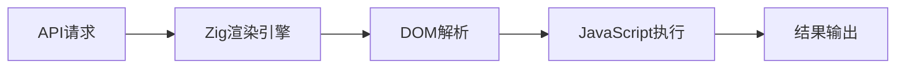
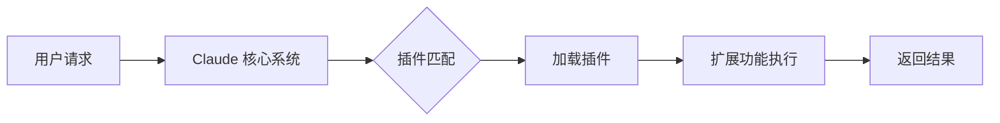

## 今日热点

今日GitHub热榜主要聚焦AI代理生态系统的快速构建与边缘AI技术的突破，同时自动化测试工具的兴起反映了AI应用向更专业、更实用方向发展的趋势。

---

## 热门项目一览

| 排名 | 项目 | 语言 | 今日 | 总计 | 简介 |
|:---:|------|:----:|------:|-----:|------|
| 1 | [msitarzewski/agency-agents](https://github.com/msitarzewski/agency-agents) | Shell | +5,745 | 40,133 | A complete AI agency at you... |
| 2 | [microsoft/BitNet](https://github.com/microsoft/BitNet) | Python | +2,227 | 33,972 | Official inference framewor... |
| 3 | [obra/superpowers](https://github.com/obra/superpowers) | Shell | +2,106 | 81,923 | An agentic skills framework... |
| 4 | [lightpanda-io/browser](https://github.com/lightpanda-io/browser) | Zig | +2,093 | 15,468 | Lightpanda: the headless br... |
| 5 | [promptfoo/promptfoo](https://github.com/promptfoo/promptfoo) | TypeScript | +1,668 | 15,280 | Test your prompts, agents, ... |
| 6 | [alibaba/page-agent](https://github.com/alibaba/page-agent) | TypeScript | +1,468 | 7,538 | JavaScript in-page GUI agen... |
| 7 | [AstrBotDevs/AstrBot](https://github.com/AstrBotDevs/AstrBot) | Python | +1,128 | 23,826 | Agentic IM Chatbot infrastr... |
| 8 | [langflow-ai/openrag](https://github.com/langflow-ai/openrag) | Python | +905 | 2,259 | OpenRAG is a comprehensive,... |
| 9 | [public-apis/public-apis](https://github.com/public-apis/public-apis) | Python | +892 | 409,481 | A collective list of free APIs |
| 10 | [InsForge/InsForge](https://github.com/InsForge/InsForge) | TypeScript | +766 | 3,639 | Give agents everything they... |
| 11 | [anthropics/claude-plugins-official](https://github.com/anthropics/claude-plugins-official) | Python | +654 | 10,793 | Official, Anthropic-managed... |
| 12 | [google/A2UI](https://github.com/google/A2UI) | TypeScript | +635 | 13,055 | No description |

---

## 趋势洞察

```
┌─────────────────────────────────────────────────────────────────┐
│  AI/ML 工具         ████████████████████████  12 个项目        │
│  其他               ████                      2 个项目        │
│  多媒体应用            ██                        1 个项目        │
│  数据分析             ██                        1 个项目        │
└─────────────────────────────────────────────────────────────────┘
```

---

## 项目深度解读

### 1. msitarzewski/agency-agents — AI代理工具集

> **一句话总结**：提供多领域专业AI代理脚本，每个都有独特个性和专长，一站式满足各类AI任务需求。

#### 价值主张

| 维度 | 说明 |
|------|------|
| **解决痛点** | 解决用户需要多种专业AI助手但难以配置和整合的问题 |
| **目标用户** | 需要多种AI工具辅助的软件开发者和内容创作者 |
| **核心亮点** | 多种专业AI代理预配置 + 每个代理有独特个性和专长 + 即装即用无需复杂配置 |

#### 技术架构


**技术特色**：
- 基于Shell脚本实现的AI代理集合
- 每个代理专注于特定领域和功能
- 简单易用的命令行接口

#### 热度分析

- 项目在短时间内获得大量关注，今日星标增长显著，显示社区对一站式AI代理解决方案的强烈需求。
- 虽然问题数为零，但高Fork数表明用户积极参与二次开发和定制。

#### 快速上手

```bash
# 克隆仓库
git clone https://github.com/msitarzewski/agency-agents.git

# 进入目录并运行某个代理
cd agency-agents
./frontend-wizard.sh
```

#### 注意事项

- 项目许可证未知，使用前需确认授权条款
- Shell脚本可能需要系统权限执行，注意安全风险
- 某些AI代理可能需要配置API密钥或外部服务依赖


### 2. microsoft/BitNet — 1位LLM框架

> **一句话总结**：微软官方推出的1位大语言模型高效推理框架，实现极致量化下的LLM部署与推理。

#### 价值主张

| 维度 | 说明 |
|------|------|
| **解决痛点** | 大语言模型部署资源消耗高，推理速度慢 |
| **目标用户** | 需要在资源受限设备部署LLM的开发者与研究人员 |
| **核心亮点** | 1位极致量化 + 高效推理 + 微软官方支持 |

#### 技术架构


**技术特色**：
- 1位权重量化技术，大幅减少模型大小
- 专为低资源环境优化的推理算法
- 微软官方支持的稳定框架

#### 热度分析

- 项目Star数高达33,972且单日增长2,227，表明1-bit LLM技术受到广泛关注
- 作为微软官方项目，在LLM量化领域具有生态引领地位

#### 快速上手

```bash
# 安装BitNet框架
pip install bitnet

# 使用1-bit模型进行推理
from bitnet import BitNetModel
model = BitNetModel.from_pretrained("microsoft/bitnet-1bit")
output = model.generate("Hello, how are you?")
print(output)
```

#### 注意事项

- 1-bit量化可能导致模型精度下降，需评估具体任务适用性
- 硬件兼容性可能受限，建议在支持的设备上使用
- 项目文档可能不够完善，建议参考微软官方AI相关资源


### 3. obra/superpowers — 智能开发框架

> **一句话总结**：一个基于代理的智能技能框架和实用软件开发方法论，提升开发效率和代码质量。

#### 价值主张

| 维度 | 说明 |
|------|------|
| **解决痛点** | 传统软件开发方法效率低下，缺乏智能辅助和系统化技能框架 |
| **目标用户** | 软件开发人员、技术团队和追求高效工作流程的专业人士 |
| **核心亮点** | 代理驱动 + 技能框架 + 实用方法论 + 自动化工作流 + 持续改进 |

#### 技术架构


**技术特色**：
- 基于Shell的轻量级实现，跨平台兼容性好
- 模块化设计，易于扩展和定制
- 代理驱动的工作流自动化

#### 热度分析

- 项目获得近8.2万星，单日新增2千+，表明项目正在快速增长并受到广泛关注
- 高关注度与低issue数量形成对比，说明项目成熟度高，用户满意度良好

#### 快速上手

```bash
# 克隆项目
git clone https://github.com/obra/superpowers.git
# 进入目录
cd superpowers
# 运行安装脚本
./install.sh
```

#### 注意事项

- 项目许可证未知，使用前需确认授权条款
- 主要基于Shell实现，可能需要一定的命令行操作经验
- 作为方法论框架，实际效果可能需要团队实践和调整


### 4. lightpanda-io/browser — AI专用无头浏览器

> **一句话总结**：基于Zig开发的高性能无头浏览器，专为AI与自动化场景优化，提供轻量级和高效能的网页交互能力。

#### 价值主张

| 维度 | 说明 |
|------|------|
| **解决痛点** | 传统无头浏览器资源消耗大，不适合资源受限的AI环境 |
| **目标用户** | AI开发者、自动化测试工程师、网页抓取专业人员 |
| **核心亮点** | 基于Zig语言构建 + 内存占用低 + 启动速度快 + 与AI系统集成友好 |

#### 技术架构



**技术特色**：
- 使用Zig语言重写核心渲染引擎，显著减少内存占用
- 针对AI场景优化的API设计，便于与机器学习模型集成
- 精简的架构设计，去除不必要的功能，专注核心任务

#### 热度分析

- 项目Star数超15,000且单日增长超2,000，表明社区对高性能无头浏览器需求强烈
- 作为Zig生态中的重要项目，正在推动这一新兴语言在浏览器工具领域的发展

#### 快速上手

```bash
# 安装Lightpanda
git clone https://github.com/lightpanda-io/browser.git
cd browser
zig build

# 基本使用
./zig-out/bin/lightpanda "https://example.com"
```

#### 注意事项

- 项目仍处于开发阶段，API可能不稳定
- 作为Zig项目，需要安装Zig开发环境才能编译和运行
- 功能相比成熟的无头浏览器可能有所限制，需评估是否符合特定场景需求
- 许可证信息不明确，使用前需确认开源协议


### 5. promptfoo/promptfoo — AI测试框架

> **一句话总结**：一站式AI提示词、代理和RAG测试平台，支持多模型性能对比与安全评估。

#### 价值主张

| 维度 | 说明 |
|------|------|
| **解决痛点** | AI应用缺乏标准化测试方法，难以评估提示词质量和模型性能 |
| **目标用户** | AI开发者、测试工程师、安全研究员、模型评估团队 |
| **核心亮点** | 多模型对比测试 + 红队安全评估 + CI/CD集成 + 声明式配置 + 详细报告 |

#### 技术架构


**技术特色**：
- 支持多种AI模型统一测试接口，抽象不同API差异
- 提供声明式配置，简化测试流程定义
- 内置安全测试框架，可检测提示词注入等漏洞
- 支持自定义评估指标，灵活测试场景

#### 热度分析

- 项目Star数增长迅速，单日新增超1600，显示AI测试工具市场需求强劲
- 零开放Issues表明项目维护活跃，问题响应及时，社区信任度高

#### 快速上手

```bash
# 安装promptfoo
npm install -g promptfoo

# 创建测试配置文件
echo 'prompts: ["What is the capital of France?"]' > promptfooconfig.yaml

# 运行测试
promptfoo eval

# 查看结果
promptfoo view
```

#### 注意事项

- 需要配置各AI模型的API密钥才能进行实际测试
- 测试大量提示词或使用多个模型可能会产生较高的API调用成本
- 对于企业级应用，可能需要考虑数据隐私和安全合规问题


### 6. alibaba/page-agent — AI网页控制

> **一句话总结**：通过自然语言控制网页界面的AI代理工具，实现智能化网页操作。

#### 价值主张

| 维度 | 说明 |
|------|------|
| **解决痛点** | 解决非技术用户难以自动化网页操作的问题 |
| **目标用户** | 开发者、测试人员、自动化操作需求者 |
| **核心亮点** | 自然语言交互 + 跨浏览器兼容 + 智能元素识别 |

#### 技术架构


**技术特色**：
- 基于大语言模型的自然语言理解能力
- 智能网页元素识别与定位技术
- 跨浏览器兼容的执行引擎
- TypeScript开发确保类型安全与代码质量

#### 热度分析

- 项目近期增长迅猛，单日增加1468星，表明技术方向受市场高度认可
- 作为阿里巴巴开源项目，在企业级自动化领域具有较强影响力

#### 快速上手

```bash
# 克隆项目
git clone https://github.com/alibaba/page-agent.git

# 安装依赖
npm install

# 启动开发环境
npm run dev
```

#### 注意事项

- 项目依赖Node.js环境，请确保Node版本兼容
- 使用时需注意目标网页的跨域限制
- 某些复杂网页可能需要额外配置才能正确识别元素


### 7. AstrBotDevs/AstrBot — 多平台AI聊天机器人

> **一句话总结**：集成多平台IM与LLM的聊天机器人基础设施，提供可扩展的AI助手解决方案。

#### 价值主张

| 维度 | 说明 |
|------|------|
| **解决痛点** | 统一管理多平台聊天机器人，简化AI功能集成与扩展 |
| **目标用户** | 需要跨平台AI助手的开发者和企业用户 |
| **核心亮点** | 多IM平台集成 + 多LLM支持 + 插件系统架构 |

#### 技术架构


**技术特色**：
- 基于Python开发的跨平台聊天机器人框架
- 模块化设计支持多种IM平台和AI模型集成
- 提供插件系统实现功能扩展

#### 热度分析

- 项目获得近2.4万星，单日增长超千星，表明其市场热度极高
- 零开放问题表明项目维护良好，可能是企业级解决方案

#### 快速上手

```bash
# 克隆项目
git clone https://github.com/AstrBotDevs/AstrBot.git
cd AstrBot

# 安装依赖
pip install -r requirements.txt

# 启动服务
python run.py
```

#### 注意事项

- 项目许可证未知，商业使用前需确认授权情况
- 项目依赖大量第三方服务和API，需关注相关费用和限制


### 8. langflow-ai/openrag — 一站式RAG平台

> **一句话总结**：OpenRAG是集成检索增强生成技术的一站式平台，简化企业知识问答系统构建流程。

#### 价值主张

| 维度 | 说明 |
|------|------|
| **解决痛点** | 企业级知识问答系统构建复杂、整合困难的问题 |
| **目标用户** | 需要构建知识问答系统的企业开发者和研究人员 |
| **核心亮点** | 基于Langflow可视化构建 + 集成Docling文档处理 + 基于Opensearch的高效检索 |

#### 技术架构


**技术特色**：
- 基于Langflow的可视化工作流设计
- 集成Docling实现多格式文档智能解析
- 利用Opensearch提供高性能检索能力

#### 热度分析

- 项目单日增长905星，表明RAG技术正受到高度关注
- 作为Langflow生态系统中的重要组件，处于AI应用开发前沿

#### 快速上手

```bash
# 安装依赖
pip install langflow docling opensearch

# 初始化项目
git clone https://github.com/langflow-ai/openrag.git
cd openrag

# 启动服务
python app.py
```

#### 注意事项

- 项目依赖多个复杂组件，可能需要较高的配置要求
- 由于依赖Opensearch，需要单独部署和维护搜索引擎服务


### 9. public-apis/public-apis — API资源聚合库

> **一句话总结**：收集整理全球免费API资源，为开发者提供一站式API查找与集成平台。

#### 价值主张

| 维度 | 说明 |
|------|------|
| **解决痛点** | 解决开发者寻找、筛选和验证可用API的困难，节省大量调研时间 |
| **目标用户** | 软件开发者、数据科学家、全栈工程师及项目集成团队 |
| **核心亮点** | 免费API资源汇总 + 分类清晰便于查找 + 社区验证质量保证 |

#### 技术架构

该项目采用轻量级数据组织方式，无复杂技术流程：

**技术特色**：
- 基于Markdown的轻量级数据存储方案
- 社区驱动的API质量验证机制
- 结构化的API信息组织与分类系统

#### 热度分析

- 项目获40万+星标且持续增长，反映开发者对免费API资源的强烈需求
- 作为基础设施类项目，在开发社区中具有战略地位，是众多项目的依赖资源

#### 快速上手

```bash
# 克隆项目到本地
git clone https://github.com/public-apis/public-apis.git

# 浏览API列表
cd public-apis && cat README.md
```

#### 注意事项

- API可能会变更或停止服务，使用前需验证可用性
- 部分API可能有使用限制或需要注册获取密钥
- 使用API前请仔细阅读相关条款和隐私政策


### 10. InsForge/InsForge — 智能体全栈框架

> **一句话总结**：专为智能体设计的全栈应用开发后端框架，提供完整的应用构建能力。

#### 价值主张

| 维度 | 说明 |
|------|------|
| **解决痛点** | 为智能体提供全栈应用开发所需的后端基础设施，解决技术集成难题 |
| **目标用户** | AI智能体开发者及基于AI的自动化开发工具 |
| **核心亮点** | 专为智能体设计 + 提供完整后端能力 + 支持全栈应用开发 |

#### 技术架构


**技术特色**：
- 基于 TypeScript 构建，提供类型安全
- 专为智能体交互设计，优化AI开发体验
- 提供全栈应用开发所需的后端能力

#### 热度分析

- 项目短期内获得大量star，显示AI开发工具领域强劲需求
- 在当前AI热潮中占据智能体开发工具生态位置优势

#### 快速上手

```bash
# 安装InsForge
npm install insforge

# 初始化项目
insforge init my-agent-app

# 启动开发服务器
insforge dev
```

#### 注意事项

- 许可证信息未知，使用前需确认授权条款
- 项目相对较新，生态系统可能还不够成熟


### 11. anthropics/claude-plugins-official — 官方插件目录

> **一句话总结**：Anthropic 官方维护的高质量 Claude 插件集合，扩展 AI 助手功能。

#### 价值主张

| 维度 | 说明 |
|------|------|
| **解决痛点** | 解决 Claude 功能扩展需求，提供官方认证的高质量插件 |
| **目标用户** | Claude 用户、开发者、AI 爱好者 |
| **核心亮点** | 官方认证 + 高质量保证 + 插件目录 + 持续更新 |

#### 技术架构



**技术特色**：
- 插件化架构设计，支持功能模块化扩展
- 官方质量审核机制，确保插件可靠性
- 标准化接口规范，便于开发者贡献

#### 热度分析

- 项目获得高关注度，单日新增 654 个 Star，增长迅速
- 作为官方插件库，在 Claude 生态系统中占据核心地位

#### 快速上手

```bash
# 克隆官方插件库
git clone https://github.com/anthropics/claude-plugins-official.git

# 浏览插件目录
cd claude-plugins-official && ls -l
```

#### 注意事项

- 插件需要遵循官方提交指南和质量标准
- 使用前需确认插件的兼容性和安全性


### 13. vectorize-io/hindsight — AI记忆系统

> **一句话总结**：构建具备学习和记忆能力的AI代理系统，让AI从过去的交互中学习和改进。

#### 价值主张

| 维度 | 说明 |
|------|------|
| **解决痛点** | AI代理缺乏长期记忆和从经验中学习的能力，无法持续改进 |
| **目标用户** | AI开发者、研究人员和构建需要长期记忆能力的智能系统团队 |
| **核心亮点** | 向量化记忆存储 + 持续学习机制 + 上下文回溯与关联 |

#### 技术架构


**技术特色**：
- 向量化存储记忆，实现高效检索和关联
- 持续学习机制，从交互中提取有价值信息
- 支持长期记忆和短期记忆的分层管理

#### 热度分析

- 项目近期热度飙升，单日增长595个Star，显示AI记忆系统领域关注度快速提升
- 相对较低的Fork数表明项目可能处于早期阶段或技术门槛较高

#### 快速上手

```bash
# 安装hindsight
pip install hindsight

# 初始化记忆系统
hindsight init --memory-dir ./agent_memory

# 运行代理示例
python -m hindsight.example
```

#### 注意事项

- 项目可能需要特定的AI模型或API支持
- 记忆存储可能需要考虑隐私和安全问题
- 项目可能处于开发早期，API和功能可能不稳定


### 14. fishaudio/fish-speech — 开源语音合成系统

> **一句话总结**：基于最新AI技术的开源文本转语音系统，提供高质量、自然流畅的语音合成能力。

#### 价值主张

| 维度 | 说明 |
|------|------|
| **解决痛点** | 传统TTS系统在自然度、情感表达和语言适应性方面的局限性 |
| **目标用户** | 语音开发者、内容创作者、无障碍技术支持团队 |
| **核心亮点** | 高质量语音合成 + 多语言支持 + 开源可定制 + 低资源需求 |

#### 技术架构


**技术特色**：
- 采用先进的神经网络架构提升语音自然度
- 支持多种语言和口音的语音合成
- 开源模型允许本地部署和隐私保护

#### 热度分析

- 项目Star数超过2.6万，近期每日增长500+，表明TTS领域热度高涨
- 作为开源SOTA方案，正在成为语音开发者社区的重要基础设施

#### 快速上手

```bash
# 克隆仓库
git clone https://github.com/fishaudio/fish-speech.git
cd fish-speech

# 安装依赖
pip install -r requirements.txt

# 运行示例
python examples/simple_tts.py "你好，世界"
```

#### 注意事项

- 模型可能需要较高的计算资源，特别是GPU加速
- 许可证信息不明确，使用前需确认授权条款
- 可能需要特定的Python环境和依赖版本


### 15. google-ai-edge/LiteRT — 边缘AI运行时

> **一句话总结**：Google新一代边缘设备AI运行时，专为高性能机器学习和生成式AI部署优化。

#### 价值主张

| 维度 | 说明 |
|------|------|
| **解决痛点** | 解决边缘设备AI模型部署效率低、性能不足的问题 |
| **目标用户** | 边缘AI开发者、移动应用开发者、嵌入式系统工程师 |
| **核心亮点** | 高性能运行时 + 模型高效转换 + 边缘专用优化 |

#### 技术架构


**技术特色**：
- 高性能C++实现，针对边缘设备资源限制优化
- 支持机器学习和生成式AI模型的高效转换与部署
- 提供轻量级运行时环境，最小化内存和计算开销

#### 热度分析

- 项目获1863颗星，单日增长211，显示高度关注度和快速上升趋势
- 作为TensorFlow Lite的继任者，有望成为Google边缘AI生态的核心组件

#### 快速上手

```bash
# 克隆仓库
git clone https://github.com/google-ai-edge/litert.git
cd litert
# 构建项目
bazel build //...
```

#### 注意事项

- 项目作为TensorFlow Lite的继任者，可能还在开发初期，API可能不稳定
- 需要了解Bazel构建系统，对C++开发环境有一定要求
- 许可证信息不明确，使用前需确认开源许可条款


### 16. dolthub/dolt — [数据版本控制]

> **一句话总结**：将Git的版本控制理念应用于数据库，实现数据的分支、合并和版本历史管理。

#### 价值主张

| 维度 | 说明 |
|------|------|
| **解决痛点** | 传统数据库缺乏版本控制，数据变更难以追踪和回滚 |
| **目标用户** | 数据分析师、数据库管理员、数据工程师 |
| **核心亮点** | SQL兼容 + 分支管理 + 版本历史 + 协作功能 + 数据迁移 |

#### 技术架构


**技术特色**：
- 采用Go语言开发，性能高效且部署简单
- 实现了类似Git的命令行界面，降低学习成本
- 支持标准SQL查询，与现有数据分析工具兼容
- 使用内部版本控制系统跟踪数据变更
- 支持数据分支、合并和冲突解决

#### 热度分析

- Star数超过21k且持续增长，表明数据版本化概念获得广泛认可
- 作为数据管理领域的创新项目，填补了传统数据库版本控制的空白

#### 快速上手

```bash
# 安装Dolt
$ brew install dolt

# 初始化数据仓库
$ dolt init

# 添加数据表
$ dolt sql -q "CREATE TABLE users (id INT, name VARCHAR(32));"

# 提交变更
$ dolt add
$ dolt commit -m "Add users table"

# 创建分支
$ dolt branch feature/new-column
```

#### 注意事项

- Dolt是一个相对较新的项目，生态系统和工具链仍在发展中
- 对于大型数据集，性能可能不如传统数据库优化
- 与某些数据库系统的完全兼容性可能有限
- 需要学习和适应版本控制概念在数据管理中的应用


## 今日推荐

| 主题 | 推荐项目 | 亮点 |
|------|----------|------|
| 今日最热 | [msitarzewski/agency-agents](https://github.com/msitarzewski/agency-agents) | A complete AI age... |
| 值得关注 | [microsoft/BitNet](https://github.com/microsoft/BitNet) | Official inferenc... |
| 快速上手 | [obra/superpowers](https://github.com/obra/superpowers) | An agentic skills... |
| 长期潜力 | [lightpanda-io/browser](https://github.com/lightpanda-io/browser) | Lightpanda: the h... |

---

<div align="center">

*Generated on 2026-03-14 | Powered by GitHub Trending Reporter*

</div>