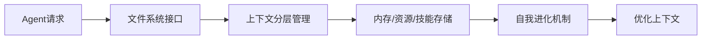
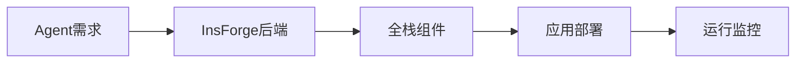
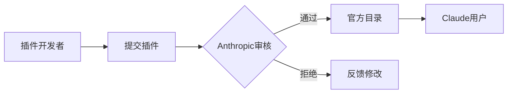

## 今日热点

AI代理生态系统迅速发展，从上下文管理到技能框架，RAG技术成为AI应用核心，同时AI与自动化工具结合趋势明显。

---

## 热门项目一览

| 排名 | 项目 | 语言 | 今日 | 总计 | 简介 |
|:---:|------|:----:|------:|-----:|------|
| 1 | [msitarzewski/agency-agents](https://github.com/msitarzewski/agency-agents) | Shell | +4,280 | 43,830 | A complete AI agency at you... |
| 2 | [lightpanda-io/browser](https://github.com/lightpanda-io/browser) | Zig | +2,069 | 17,114 | Lightpanda: the headless br... |
| 3 | [volcengine/OpenViking](https://github.com/volcengine/OpenViking) | Python | +1,610 | 10,623 | OpenViking is an open-sourc... |
| 4 | [obra/superpowers](https://github.com/obra/superpowers) | Shell | +1,439 | 83,508 | An agentic skills framework... |
| 5 | [p-e-w/heretic](https://github.com/p-e-w/heretic) | Python | +694 | 13,777 | Fully automatic censorship ... |
| 6 | [langflow-ai/openrag](https://github.com/langflow-ai/openrag) | Python | +564 | 2,726 | OpenRAG is a comprehensive,... |
| 7 | [InsForge/InsForge](https://github.com/InsForge/InsForge) | TypeScript | +482 | 4,185 | Give agents everything they... |
| 8 | [anthropics/claude-plugins-official](https://github.com/anthropics/claude-plugins-official) | Python | +411 | 11,325 | Official, Anthropic-managed... |
| 9 | [fishaudio/fish-speech](https://github.com/fishaudio/fish-speech) | Python | +381 | 27,225 | SOTA Open Source TTS |
| 10 | [dimensionalOS/dimos](https://github.com/dimensionalOS/dimos) | Python | +72 | 864 | The Dimensional Framework |

---

## 趋势洞察

```
┌─────────────────────────────────────────────────────────────────┐
│  AI/ML 工具         ████████████████████████  7 个项目        │
│  开发框架             ███                       1 个项目        │
│  多媒体应用            ███                       1 个项目        │
│  其他               ███                       1 个项目        │
└─────────────────────────────────────────────────────────────────┘
```

---

## 项目深度解读

### 1. msitarzewski/agency-agents — AI代理集合

> **一句话总结**：提供多种专业AI代理工具集，从开发到社区管理，一键执行各类AI任务。

#### 价值主张

| 维度 | 说明 |
|------|------|
| **解决痛点** | 提供一站式AI解决方案，无需单独配置多个AI工具 |
| **目标用户** | 开发者、内容创作者、社区管理者等需要AI辅助的从业者 |
| **核心亮点** | 多样化代理 + 即插即用 + 专业领域覆盖 + 个性风格 + 流程化输出 |

#### 技术架构


**技术特色**：
- Shell脚本实现，轻量级且跨平台兼容
- 模块化代理设计，易于扩展和定制
- 命令行界面友好，操作简单直观

#### 热度分析

- 项目Star数近4.4万且单日增长4000+，表明当前处于爆发式增长期
- 无公开问题且高Fork率，说明社区接受度高且用户积极参与二次开发

#### 快速上手

```bash
# 克隆项目
git clone https://github.com/msitarzewski/agency-agents.git
cd agency-agents

# 列出所有可用的AI代理
./agency

# 运行特定代理，例如前端专家
./agency frontend-wizard
```

#### 注意事项

- 项目许可证未知，商业使用前需确认版权问题
- 依赖外部AI服务，使用前需确保API密钥配置正确
- Shell脚本执行环境需确保兼容性，不同系统可能需要调整


### 2. lightpanda-io/browser — AI无头浏览器

> **一句话总结**：Lightpanda是专为AI和自动化设计的轻量级无头浏览器，提供高性能网页交互能力。

#### 价值主张

| 维度 | 说明 |
|------|------|
| **解决痛点** | 为AI系统提供轻量级、高性能的网页自动化交互能力 |
| **目标用户** | AI开发者、自动化测试工程师、网页爬虫开发者 |
| **核心亮点** | 高性能 + 资源占用低 + Zig语言编写 + AI优化 |

#### 技术架构


**技术特色**：
- 使用Zig语言编写，提供内存安全和高性能
- 专为AI场景优化的无头浏览器
- 轻量级设计，资源占用少
- 提供丰富的API接口供AI调用

#### 热度分析

- 项目获得17,114星且单日增长2,069星，表明项目近期获得了高度关注
- 作为一款新兴的无头浏览器项目，正在挑战传统解决方案如Puppeteer的地位

#### 快速上手

```bash
# 安装Lightpanda
git clone https://github.com/lightpanda-io/browser.git
cd browser
zig build

# 基本使用示例
zig run examples/basic.zig
```

#### 注意事项

- 项目目前处于早期阶段，API可能会发生变化
- 需要一定的Zig语言知识才能进行二次开发
- 完整文档可能还在完善中，社区支持相对有限


### 3. volcengine/OpenViking — AI上下文数据库

> **一句话总结**：专为AI Agent设计的开源上下文数据库，通过文件系统范式统一管理内存、资源和技能，实现分层上下文传递和自我进化。

#### 价值主张

| 维度 | 说明 |
|------|------|
| **解决痛点** | 统一AI Agent的上下文管理，解决多类型数据存储与传递难题 |
| **目标用户** | AI Agent开发者、大型语言模型应用研究者 |
| **核心亮点** | 文件系统范式 + 分层上下文传递 + 自我进化能力 + 轻量级设计 + 易于集成 |

#### 技术架构



**技术特色**：
- 基于文件系统的上下文管理范式，简化Agent与数据库交互
- 支持上下文分层传递，实现精细化信息管理
- 具备自我进化能力，持续优化上下文质量

#### 热度分析

- 项目Star数突破万级，单日增长超1600，显示AI上下文管理领域高度关注
- 无公开Issues表明项目成熟度高，社区可能通过其他渠道交流

#### 快速上手

```bash
# 克隆项目
git clone https://github.com/volcengine/OpenViking.git
cd OpenViking

# 安装依赖
pip install -r requirements.txt

# 基本使用示例
python -m openviking init
```

#### 注意事项

- 项目许可证未知，商业使用前需确认授权条款
- 作为AI Agent上下文数据库，性能可能随数据量增长而下降，需合理规划存储结构
- 与特定AI框架(如openclaw)的集成可能需要额外适配


### 4. obra/superpowers — 智能技能框架

> **一句话总结**：一个实用的智能体技能框架与软件开发方法论，提升开发者能力与效率。

#### 价值主张

| 维度 | 说明 |
|------|------|
| **解决痛点** | 解决软件开发中技能培养无系统和效率低下的问题 |
| **目标用户** | 软件开发者、技术团队、AI研究人员 |
| **核心亮点** | 结构化技能培养 + 高效开发实践 + AI辅助工具 + 可落地方法论 + 实用框架 |

#### 技术架构


**技术特色**：
- 基于Shell脚本构建的轻量级工具集
- 模块化设计便于扩展和定制
- 实践导向的方法论体系

#### 热度分析
- 项目Star数高达8.3万，日增1.4k，表明技术社区认可度极高
- Fork数与Star比例合理，显示用户不仅关注，更积极参与实践

#### 快速上手
```bash
# 克隆项目
git clone https://github.com/obra/superpowers.git
# 进入目录
cd superpowers
# 安装依赖
./install.sh
```

#### 注意事项
- 项目License信息不明确，使用前需确认授权条款
- 建议先阅读项目文档理解方法论后再实践
- Shell脚本在Windows系统上可能需要额外配置


### 5. p-e-w/heretic — [审查绕过工具]

> **一句话总结**：全自动语言模型审查移除工具，突破内容限制保持模型功能完整性

#### 价值主张

| 维度 | 说明 |
|------|------|
| **解决痛点** | 解决语言模型过度审查导致功能受限的问题 |
| **目标用户** | AI研究人员、开发者、需要突破内容限制的用户 |
| **核心亮点** | 自动绕过审查 + 保持模型完整功能 + 不修改模型参数 + 多种绕过策略 + 开源透明 |

#### 技术架构


**技术特色**：
- 利用模型自身特性绕过内置安全机制
- 提供多种绕过策略组合使用
- 保持模型原始参数不变

#### 热度分析

- 项目星标数超13k且近期增长显著，表明社区对AI内容限制问题的强烈关注
- 在AI伦理与安全领域具有重要生态位置，引发关于AI内容边界的热议

#### 快速上手

```bash
# 克隆仓库
git clone https://github.com/p-e-w/heretic.git
cd heretic

# 安装依赖并运行
pip install -r requirements.txt
python heretic.py "your prompt here"
```

#### 注意事项

- 此工具可能违反AI服务提供商的使用条款
- 使用时需考虑伦理和法律边界问题
- 可能导致模型生成不当或有害内容
- 建议仅用于研究和教育目的


### 6. langflow-ai/openrag — 一站式RAG平台

> **一句话总结**：集成Langflow、Docling和OpenSearch的检索增强生成平台，简化RAG应用构建流程。

#### 价值主张

| 维度 | 说明 |
|------|------|
| **解决痛点** | 简化检索增强生成应用的复杂部署流程，提供一体化解决方案 |
| **目标用户** | 需要构建RAG应用的开发者、研究人员和企业AI团队 |
| **核心亮点** | 基于Langflow的可视化构建 + 集成Docling文档处理 + 基于OpenSearch的高效检索 |

#### 技术架构


**技术特色**：
- 基于Langflow的可视化工作流设计，降低RAG应用构建门槛
- 集成Docling实现多格式文档的高效解析与处理
- 利用OpenSearch提供高性能向量检索能力

#### 热度分析

- 项目Star数达2726，单日增长564，表明近期受到社区高度关注，RAG领域热度持续上升
- 作为一站式RAG解决方案，处于AI应用开发工具链的关键位置，生态潜力巨大

#### 快速上手

```bash
# 克隆仓库
git clone https://github.com/langflow-ai/openrag.git
cd openrag

# 安装依赖
pip install -r requirements.txt

# 启动服务
python app.py
```

#### 注意事项

- 项目依赖多个复杂组件(Langflow、Docling、OpenSearch)，部署和配置可能较为复杂
- 由于项目较新(从Star增长速度看)，文档和示例可能不够完善
- 需要确保OpenSearch服务正确配置才能使向量检索功能正常工作


### 7. InsForge/InsForge — AI全栈开发框架

> **一句话总结**：专为AI代理设计的全栈应用开发后端框架，提供构建智能代理所需的完整工具链。

#### 价值主张

| 维度 | 说明 |
|------|------|
| **解决痛点** | 解决AI代理开发过程中缺乏完整后端支持的问题，简化全栈应用构建流程 |
| **目标用户** | AI代理开发者、全栈应用构建者、需要集成AI能力的开发者 |
| **核心亮点** | 专为代理优化的后端架构 + 全栈组件支持 + 开发工具集成 + 类型安全 |

#### 技术架构



**技术特色**：
- 基于TypeScript构建，提供强类型支持
- 专为AI代理优化的后端架构设计
- 提供端到端的全栈应用开发体验

#### 热度分析

- 项目获4,185 stars且近期增长显著(+482 today)，表明社区高度关注
- 作为AI代理开发的新兴框架，正在填补市场空白，生态潜力巨大

#### 快速上手

```bash
# 初始化InsForge项目
npx create-insforge-app my-agent-app
cd my-agent-app
npm run dev
```

#### 注意事项

- 许可证信息不明确，使用前需确认开源协议
- 项目较新，生态系统和文档可能仍在完善中


### 8. anthropics/claude-plugins-official — [官方插件目录]

> **一句话总结**：Anthropic官方维护的高质量Claude代码插件集合，扩展AI功能边界。

#### 价值主张

| 维度 | 说明 |
|------|------|
| **解决痛点** | 解决Claude用户缺乏官方认证的高质量代码插件的问题 |
| **目标用户** | Claude开发者、AI研究人员和企业AI应用用户 |
| **核心亮点** | 官方认证+高质量筛选+代码扩展+持续更新 |

#### 技术架构



**技术特色**：
- 标准化的插件接口规范
- 严格的质量控制流程
- 版本兼容性管理系统

#### 热度分析

- 高关注度项目，近期增长迅速，日均新增400+星标，社区活跃度高
- 作为Anthropic官方插件目录，处于Claude生态系统的核心位置，推动第三方开发者生态繁荣

#### 快速上手

```bash
# 访问官方插件目录
git clone https://github.com/anthropics/claude-plugins-official.git
cd claude-plugins-official
# 查看可用插件列表
cat README.md
```

#### 注意事项

- 使用前需确认Claude API版本兼容性
- 定期关注更新以确保插件功能正常
- 遵循Anthropic的使用条款和开发者指南


### 9. fishaudio/fish-speech — 开源TTS新标杆

> **一句话总结**：基于先进AI技术的开源文本转语音系统，提供高质量、可定制的语音合成能力。

#### 价值主张

| 维度 | 说明 |
|------|------|
| **解决痛点** | 提供高质量、可定制且免费的开源语音合成解决方案 |
| **目标用户** | AI开发者、语音研究人员及内容创作者 |
| **核心亮点** | + 高质量语音合成 + 开源免费 + 可定制化 + 多语言支持 |

#### 技术架构


**技术特色**：
- 基于最新深度学习的声学模型架构
- 高质量的神经声码器技术
- 支持自监督学习和少样本语音合成

#### 热度分析

- Star数27,225且日增381，表明项目在语音合成领域备受关注
- 社区活跃度高，0个Open Issues显示项目维护良好

#### 快速上手

```bash
# 克隆仓库
git clone https://github.com/fishaudio/fish-speech.git
cd fish-speech

# 安装依赖并运行
pip install -e . && python -m fish_speech.cli --text "你好，世界" --output output.wav
```

#### 注意事项

- 项目需要较高计算资源，建议使用GPU环境运行
- 模型文件较大，首次使用需下载预训练模型
- 需要配置Python 3.8+环境和相关依赖包


### 10. dimensionalOS/dimos — 多维系统框架

> **一句话总结**：基于Python的多维度系统开发框架，提供灵活的系统构建能力。

#### 价值主张

| 维度 | 说明 |
|------|------|
| **解决痛点** | 简化复杂系统架构设计，提供模块化开发能力 |
| **目标用户** | 系统架构师、后端开发者、框架设计者 |
| **核心亮点** | 多维度架构设计 + 模块化组件 + Python生态集成 |

#### 技术架构


**技术特色**：
- 基于Python的多维度架构设计模式
- 模块化系统组件库
- 轻量级运行时环境
- 灵活的系统扩展机制

#### 热度分析

- 项目Star数近900，日均增长约1，表明社区关注度稳步提升
- 作为系统框架类项目，在Python生态中占据独特定位

#### 快速上手

```bash
# 安装框架
pip install dimos

# 创建新项目
dimos init my_project

# 运行项目


## 今日推荐

| 主题 | 推荐项目 | 亮点 |
|------|----------|------|
| 今日最热 | [msitarzewski/agency-agents](https://github.com/msitarzewski/agency-agents) | A complete AI age... |
| 值得关注 | [lightpanda-io/browser](https://github.com/lightpanda-io/browser) | Lightpanda: the h... |
| 快速上手 | [volcengine/OpenViking](https://github.com/volcengine/OpenViking) | OpenViking is an ... |
| 长期潜力 | [obra/superpowers](https://github.com/obra/superpowers) | An agentic skills... |

---

<div align="center">

*Generated on 2026-03-15 | Powered by GitHub Trending Reporter*

</div>