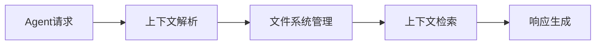
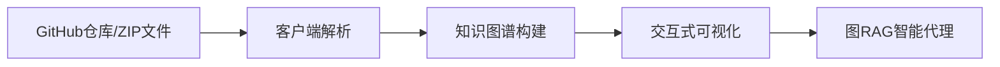
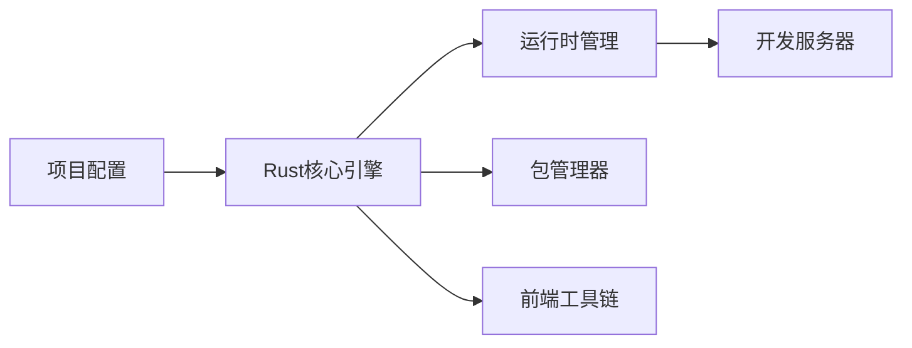
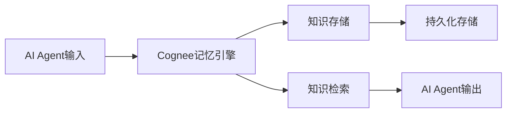
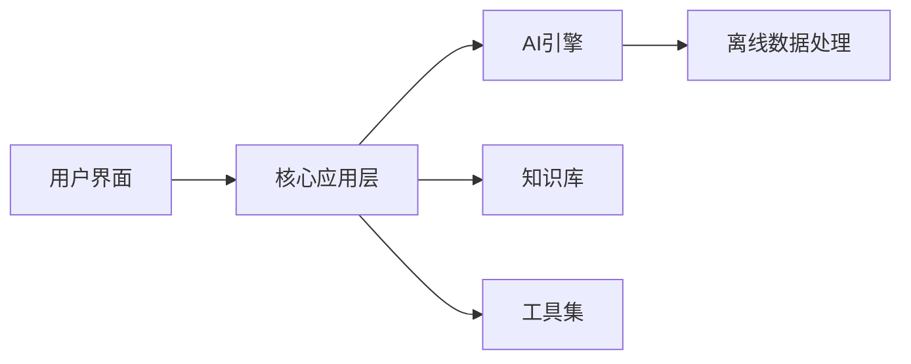

## 今日热点

AI代理工具链与Claude Code生态系统呈现爆发式增长，上下文管理、知识图谱与群体智能成为开发者追逐的新焦点，预示着AI原生开发工具进入成熟期。

---

## 热门项目一览

| 排名 | 项目 | 语言 | 今日 | 总计 | 简介 |
|:---:|------|:----:|------:|-----:|------|
| 1 | [666ghj/MiroFish](https://github.com/666ghj/MiroFish) | Python | +2,782 | 27,281 | A Simple and Universal Swar... |
| 2 | [volcengine/OpenViking](https://github.com/volcengine/OpenViking) | Python | +1,870 | 12,446 | OpenViking is an open-sourc... |
| 3 | [obra/superpowers](https://github.com/obra/superpowers) | Shell | +1,867 | 85,944 | An agentic skills framework... |
| 4 | [lightpanda-io/browser](https://github.com/lightpanda-io/browser) | Zig | +1,335 | 18,641 | Lightpanda: the headless br... |
| 5 | [p-e-w/heretic](https://github.com/p-e-w/heretic) | Python | +1,062 | 14,712 | Fully automatic censorship ... |
| 6 | [shareAI-lab/learn-claude-code](https://github.com/shareAI-lab/learn-claude-code) | TypeScript | +872 | 27,945 | Bash is all you need - A na... |
| 7 | [shanraisshan/claude-code-best-practice](https://github.com/shanraisshan/claude-code-best-practice) | HTML | +851 | 17,017 | practice made claude perfect |
| 8 | [anthropics/claude-plugins-official](https://github.com/anthropics/claude-plugins-official) | Python | +604 | 11,949 | Official, Anthropic-managed... |
| 9 | [InsForge/InsForge](https://github.com/InsForge/InsForge) | TypeScript | +515 | 4,592 | Give agents everything they... |
| 10 | [abhigyanpatwari/GitNexus](https://github.com/abhigyanpatwari/GitNexus) | TypeScript | +451 | 14,334 | GitNexus: The Zero-Server C... |
| 11 | [voidzero-dev/vite-plus](https://github.com/voidzero-dev/vite-plus) | Rust | +300 | 1,727 | Vite+ is the unified toolch... |
| 12 | [topoteretes/cognee](https://github.com/topoteretes/cognee) | Python | +270 | 13,919 | Knowledge Engine for AI Age... |

---

## 趋势洞察

```
┌─────────────────────────────────────────────────────────────────┐
│  AI/ML 工具         ████████████████████████  11 个项目        │
│  其他               ████                      2 个项目        │
└─────────────────────────────────────────────────────────────────┘
```

---

## 项目深度解读

### 1. 666ghj/MiroFish — 群体智能引擎

> **一句话总结**：基于群体智能的通用预测引擎，能够处理各类预测任务，简洁易用。

#### 价值主张

| 维度 | 说明 |
|------|------|
| **解决痛点** | 提供通用、简单、高效的群体智能预测解决方案 |
| **目标用户** | 需要预测功能的开发者和研究人员 |
| **核心亮点** | 简单易用 + 通用性强 + 高效预测 |

#### 技术架构


**技术特色**：
- 基于群体智能的预测算法
- 高效的并行计算能力
- 通用性强，适应多种预测场景

#### 热度分析

- Star数超27k且单日增长2782，表明项目热度极高，受到广泛关注
- 无Open Issues，说明项目维护良好，用户反馈问题少

#### 快速上手

```bash
# 安装MiroFish
pip install MiroFish

# 基本使用示例
from MiroFish import SwarmIntelligenceEngine
engine = SwarmIntelligenceEngine()
prediction = engine.predict(data)
```

#### 注意事项

- 由于License未知，使用前需确认开源协议
- 群体智能算法可能需要调整参数以获得最佳预测效果
- 对于大规模数据集，可能需要考虑计算资源需求


### 2. volcengine/OpenViking — AI上下文数据库

> **一句话总结**：专为AI Agent设计的开源上下文数据库，通过文件系统范式统一管理记忆、资源和技能。

#### 价值主张

| 维度 | 说明 |
|------|------|
| **解决痛点** | AI Agent缺乏统一高效的上下文管理机制，难以处理复杂交互场景 |
| **目标用户** | AI Agent开发者、大语言模型应用研究者 |
| **核心亮点** | 文件系统范式 + 分层上下文传递 + 自我演进能力 + 轻量级实现 |

#### 技术架构



**技术特色**：
- 基于文件系统的上下文存储结构，便于AI Agent访问和管理
- 支持分层的上下文传递机制，实现复杂场景下的上下文管理
- 自我演进功能，使系统能够从使用中学习和优化

#### 热度分析

- 项目Star数达12,446且近期增长迅速(+1,870 today)，表明AI上下文管理领域需求旺盛
- 虽然Issues数为0，但高Star数和Fork数显示社区活跃度高，关注度极高

#### 快速上手

```bash
# 安装OpenViking
pip install openviking

# 初始化AI Agent上下文数据库
openviking init --agent-type openclaw
```

#### 注意事项

- 需要关注项目的License情况，当前显示为Unknown
- 项目可能需要与特定的AI Agent框架（如openclaw）协同使用才能发挥最大价值
- 作为上下文数据库，需考虑数据存储和隐私安全问题


### 3. obra/superpowers — 智能开发框架

> **一句话总结**：提供一套智能化的软件开发方法论与技能框架，显著提升开发效率与质量

#### 价值主张

| 维度 | 说明 |
|------|------|
| **解决痛点** | 传统软件开发方法效率低下，缺乏系统化与智能化指导 |
| **目标用户** | 软件开发者、技术团队、项目管理专业人士 |
| **核心亮点** | 智能化流程 + 系统化方法论 + 高度可扩展 + 实践导向 |

#### 技术架构


**技术特色**：
- 基于Shell脚本实现，跨平台兼容性强
- 采用模块化设计，便于扩展与定制
- 强调自动化与智能化处理流程

#### 热度分析

- 项目获85k+ stars，近期增长迅猛，表明方法论受到广泛认可
- 高fork数反映社区积极参与实践与定制，形成活跃生态

#### 快速上手

```bash
# 克隆项目
git clone https://github.com/obra/superpowers.git
cd superpowers
# 查看核心文档
cat README.md
```

#### 注意事项

- 项目使用Shell脚本实现，需具备基本的Linux/Unix环境知识
- 方法论强调团队协作，个人实践可能效果有限
- 需根据具体项目情况进行调整，而非完全照搬框架


### 4. lightpanda-io/browser — AI无头浏览器

> **一句话总结**：专为AI和自动化设计的高性能无头浏览器，提供轻量级网页交互能力。

#### 价值主张

| 维度 | 说明 |
|------|------|
| **解决痛点** | 传统浏览器在AI自动化场景下资源消耗大、性能低 |
| **目标用户** | AI开发者、自动化测试工程师、网页抓取应用开发者 |
| **核心亮点** | 高性能 + 资源优化 + AI友好接口 + 轻量级 + 无头运行 |

#### 技术架构


**技术特色**：
- 基于Zig语言构建，提供高性能内存管理
- 专为AI和自动化场景优化的浏览器内核
- 无头运行模式，大幅降低资源消耗

#### 热度分析

- 项目获得18,641个Star，近期增长迅猛（单日+1,335），显示社区高度关注
- 作为Zig生态中重要项目，填补了AI自动化浏览器工具的空白

#### 快速上手

```bash
# 安装Lightpanda
git clone https://github.com/lightpanda-io/browser.git
cd browser
zig build

# 基本使用示例
./lightpanda --url https://example.com --screenshot output.png
```

#### 注意事项

- 项目可能仍处于开发阶段，API可能会有变化
- 作为较新的项目，生态系统和文档可能不如成熟项目完善
- Zig语言的使用可能需要开发者有一定的学习曲线


### 5. p-e-w/heretic — 审查绕过工具

> **一句话总结**：Heretic是一个自动化工具，帮助用户绕过语言模型的安全限制，解除内容审查。

#### 价值主张

| 维度 | 说明 |
|------|------|
| **解决痛点** | 语言模型过度安全限制导致功能受限 |
| **目标用户** | 需要突破AI模型限制的研究者和开发者 |
| **核心亮点** | 自动化 + 无需修改模型 + 保持功能完整性 |

#### 技术架构


**技术特色**：
- 利用模型自身特性绕过安全机制
- 保持模型核心功能不受影响
- 实现无需重新训练的即插即用解决方案

#### 热度分析

- 项目获得近1.5万星，单日增长超千星，显示AI安全领域高度关注
- 零开放问题表明社区对项目争议性认知清晰

#### 快速上手

```bash
# 安装依赖
pip install -r requirements.txt

# 运行工具
python heretic.py --model <model_name> --prompt <your_prompt>
```

#### 注意事项

- 本工具可能违反某些AI服务使用条款
- 使用时需考虑伦理和法律边界
- 可能不适用于所有类型的语言模型


### 6. shareAI-lab/learn-claude-code — [Bash 智能代理]

> **一句话总结**：轻量级命令行助手，通过 AI 技术智能辅助 Bash 操作，提升开发效率。

#### 价值主张

| 维度 | 说明 |
|------|------|
| **解决痛点** | 简化复杂 Bash 操作，减少命令行学习成本，提高开发效率 |
| **目标用户** | 开发者、系统管理员、DevOps 工程师等命令行用户 |
| **核心亮点** | 轻量级设计 + 智能命令建议 + 自动化任务执行 + 跨平台支持 |

#### 技术架构


**技术特色**：
- 基于 TypeScript 开发，类型安全
- 轻量级架构，资源占用低
- 智能命令解析与执行引擎

#### 热度分析

- 项目获得近 2.8 万 Star，单日新增 800+，表明社区认可度高
- 0 个 Open Issues 反映项目维护良好，问题解决效率高

#### 快速上手

```bash
# 克隆项目
git clone https://github.com/shareAI-lab/learn-claude-code.git
# 安装依赖
npm install
# 运行工具
npm start
```

#### 注意事项

- 确保系统已安装 Node.js 和 npm
- 可能需要配置 API 密钥或访问权限
- 注意 Bash 命令执行的安全性，避免执行危险操作


### 7. shanraisshan/claude-code-best-practice — Claude实践指南

> **一句话总结**：提供Claude AI助手的最佳实践指南，帮助用户最大化AI辅助编程效率

#### 价值主张

| 维度 | 说明 |
|------|------|
| **解决痛点** | 提供Claude AI使用最佳实践，解决AI辅助编程效率低下问题 |
| **目标用户** | 使用Claude AI进行编程的开发者和研究人员 |
| **核心亮点** | 实用技巧分享 + 案例分析 + 效率提升方法 + 错误规避指南 + 交互优化策略 |

#### 技术架构


**技术特色**：
- 响应式HTML设计，适配多种设备
- 清晰的内容组织结构，便于导航
- 实用的代码示例和交互式演示

#### 热度分析

- 项目获得17K+ stars，近期增长迅速，显示Claude AI用户对最佳实践需求旺盛
- 1500+ forks表明社区积极参与内容贡献和定制化应用

#### 快速上手

```bash
# 克隆项目到本地
git clone https://github.com/shanraisshan/claude-code-best-practice.git

# 使用本地服务器预览
cd claude-code-best-practice && python -m http.server 8000
```

#### 注意事项
- 项目未明确许可证，使用时需注意版权问题
- 内容可能需要根据Claude AI的最新更新进行调整
- 建议结合个人实际使用场景选择适合的最佳实践


### 8. anthropics/claude-plugins-official — Claude插件目录

> **一句话总结**：Anthropic官方维护的高质量Claude插件目录，扩展AI助手功能生态。

#### 价值主张

| 维度 | 说明 |
|------|------|
| **解决痛点** | 为Claude用户提供经过验证的高质量插件扩展功能 |
| **目标用户** | Claude AI用户、开发者、需要扩展AI功能的个人和企业 |
| **核心亮点** | 官方维护 + 高质量筛选 + 持续更新 + 社区驱动 |

#### 技术架构


**技术特色**：
- 官方维护的插件质量保证机制
- 结构化的插件分类和检索系统
- 社区驱动的插件更新和反馈循环

#### 热度分析

- 项目热度高，今日增长604星，总星数近1.2万，显示社区对Claude插件生态的强烈兴趣。
- 作为官方目录，项目处于Claude插件生态的核心位置，零未解决问题表明维护活跃度高。

#### 快速上手

```bash
# 克隆插件目录仓库
git clone https://github.com/anthropics/claude-plugins-official.git

# 浏览插件列表
cd claude-plugins-official && ls plugins
```

#### 注意事项

- 插件使用前应验证其安全性和兼容性
- 官方目录中的插件会定期更新，建议关注最新版本
- 插件开发需遵循Anthropic发布的相关规范和指南


### 9. InsForge/InsForge — 智能体全栈平台

> **一句话总结**：为智能体提供全栈应用开发所需的后端基础设施，简化Agent驱动的应用开发流程。

#### 价值主张

| 维度 | 说明 |
|------|------|
| **解决痛点** | 为智能体提供统一的后端开发环境，解决Agent开发全栈应用的复杂性 |
| **目标用户** | AI智能体开发者、全栈应用构建者、自动化系统工程师 |
| **核心亮点** | 智能体专用后端 + 全栈开发支持 + 简化部署流程 + 内置Agent能力 |

#### 技术架构


**技术特色**：
- 智能体专用API设计，优化Agent与后端交互
- 内置全栈应用开发模板和工具链
- 简化部署流程，支持快速迭代和发布

#### 热度分析

- Star数达4592且近期增长515，表明项目获得社区高度关注和认可
- 作为新兴的智能体开发框架，正在填补市场空白，具有良好发展前景

#### 快速上手

```bash
# 初始化InsForge项目
npx create-insforge-app my-agent-app

# 启动开发服务器
cd my-agent-app
npm run dev
```

#### 注意事项

- 项目许可证未知，使用时需注意授权问题
- 作为新兴项目，API和功能可能还在快速迭代中
- 需要一定的智能体开发基础才能充分利用项目特性


### 10. abhigyanpatwari/GitNexus — 浏览器代码分析引擎

> **一句话总结**：纯客户端运行的代码知识图谱工具，无需服务器即可实现交互式代码探索与智能分析。

#### 价值主张

| 维度 | 说明 |
|------|------|
| **解决痛点** | 消除代码分析的服务器依赖，保障隐私并提供即时响应 |
| **目标用户** | 开发者、研究人员、代码审查员和架构师 |
| **核心亮点** | 客户端运行 + 交互式知识图谱 + 图RAG代理 + 隐私保护 + 零依赖部署 |

#### 技术架构



**技术特色**：
- 纯TypeScript实现，利用浏览器API完成所有计算
- 知识图谱与RAG技术结合，提供上下文感知的代码分析
- 无需服务器架构，通过WebAssembly等技术优化客户端性能

#### 热度分析

- 项目星标超1.4万且单日增长451，处于快速上升期，反映开发者对客户端代码分析工具的高度认可
- 零开放Issues表明项目维护良好，用户问题可能通过社区或其他渠道解决，生态健康度高

#### 快速上手

```bash
# 访问GitNexus官方网站
# 拖入GitHub仓库URL或ZIP文件到浏览器界面
# 开始探索交互式知识图谱并与图RAG代理交互
```

#### 注意事项

- 大型代码库可能导致浏览器性能下降，建议使用现代高性能浏览器
- 由于完全在客户端运行，功能受限于浏览器能力和本地资源
- 需要网络连接访问GitHub仓库，但代码分析过程完全在本地进行


### 11. voidzero-dev/vite-plus — Web开发工具链

> **一句话总结**：Vite+是Rust构建的统一Web开发工具链，整合运行时、包管理器和前端工具，简化开发环境配置。

#### 价值主张

| 维度 | 说明 |
|------|------|
| **解决痛点** | Web开发工具链分散，配置复杂，环境不一致问题 |
| **目标用户** | Web开发者、全栈工程师、前端团队 |
| **核心亮点** | Rust编写的高性能 + 统一工具链管理 + 零配置启动 |

#### 技术架构



**技术特色**：
- 使用Rust编写，提供高性能和内存安全保证
- 统一管理多种开发工具，简化配置流程
- 提供零配置的开发环境，开箱即用

#### 热度分析

- 项目近期增长迅猛，单日增加300+ Star，表明社区关注度快速提升
- 作为新兴工具链，有望在Web开发工具生态中占据重要位置

#### 快速上手

```bash
# 安装Vite+
cargo install vite-plus

# 创建新项目
vite-plus create my-project

# 启动开发服务器
cd my-project
vite-plus dev
```

#### 注意事项

- 项目目前Issues为0，可能处于早期阶段，稳定性有待验证
- 作为新兴工具链，生态系统和插件支持可能不如成熟工具丰富


### 12. topoteretes/cognee — AI记忆引擎

> **一句话总结**：为AI代理提供轻量级知识记忆功能，仅需6行代码即可集成。

#### 价值主张

| 维度 | 说明 |
|------|------|
| **解决痛点** | AI代理缺乏持久化记忆和知识管理能力 |
| **目标用户** | 开发AI代理、智能对话系统的研究者和开发者 |
| **核心亮点** | 极简集成 + 持久化记忆 + 知识图谱构建 + 高度可定制 |

#### 技术架构



**技术特色**：
- 轻量级设计，仅需6行代码即可集成
- 支持知识图谱构建与智能检索
- 提供持久化记忆能力，增强AI连续对话能力

#### 热度分析

- 项目Star数近1.4万，单日增长270+，处于快速增长期，显示市场对AI记忆功能的高度需求
- Fork数约1400，表明开发者社区积极参与二次开发和定制，形成活跃生态

#### 快速上手

```bash
# 安装cognee
pip install cognee

# 基本使用示例
import cognee
cognee.add("你的知识")
cognee.ask("相关问题")
```

#### 注意事项

- 项目许可证未知，商业使用前需确认授权方式
- 需要进一步验证其性能和可扩展性，特别是在处理大规模知识时的表现


### 13. Crosstalk-Solutions/project-nomad — 离线生存AI工具包

> **一句话总结**：一个自包含的离线生存计算机，集成AI工具与知识库，助力用户在任何环境中保持信息与生存能力。

#### 价值主张

| 维度 | 说明 |
|------|------|
| **解决痛点** | 解决无网络环境下获取关键信息、工具和知识的生存难题 |
| **目标用户** | 户外探险者、灾难准备者、远程工作者和应急响应人员 |
| **核心亮点** | 离线AI功能 + 自包含设计 + 生存工具集成 + 知识库 + 资源优化 |

#### 技术架构



**技术特色**：
- 基于TypeScript构建的全栈应用，确保跨平台兼容性
- 自包含设计，减少外部依赖，提高离线可用性
- 优化的资源管理，确保在低配置设备上流畅运行

#### 热度分析

- 项目获得1122个Star，单日新增205个，呈现快速增长态势
- 作为专注于离线生存的AI工具，在开源社区中占据独特生态位

#### 快速上手

```bash
# 克隆仓库
git clone https://github.com/Crosstalk-Solutions/project-nomad.git

# 安装依赖
npm install

# 运行项目
npm start
```

#### 注意事项

- 项目可能需要较高的系统资源，特别是AI功能部分
- 离线环境下的数据同步和更新可能需要额外配置
- 由于项目涉及AI功能，使用时需考虑数据隐私和安全问题


## 今日推荐

| 主题 | 推荐项目 | 亮点 |
|------|----------|------|
| 今日最热 | [666ghj/MiroFish](https://github.com/666ghj/MiroFish) | A Simple and Univ... |
| 值得关注 | [volcengine/OpenViking](https://github.com/volcengine/OpenViking) | OpenViking is an ... |
| 快速上手 | [obra/superpowers](https://github.com/obra/superpowers) | An agentic skills... |
| 长期潜力 | [lightpanda-io/browser](https://github.com/lightpanda-io/browser) | Lightpanda: the h... |

---

<div align="center">

*Generated on 2026-03-16 | Powered by GitHub Trending Reporter*

</div>