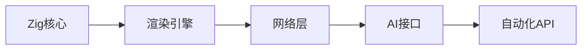
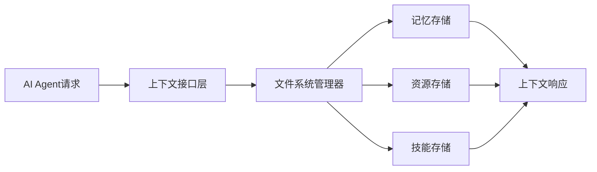
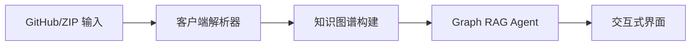
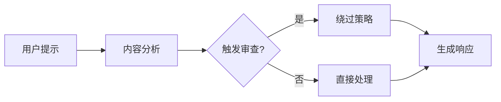
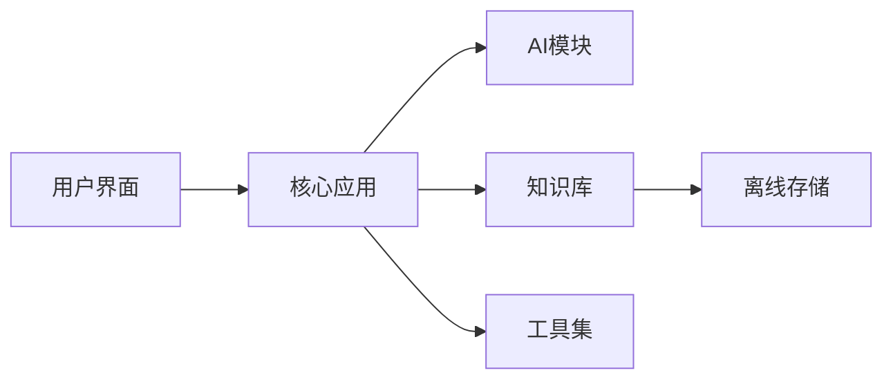
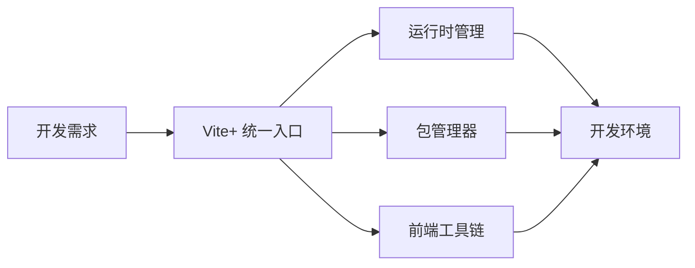
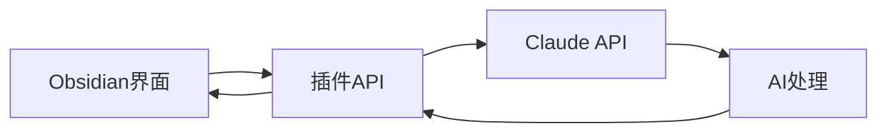

## 今日热点

AI代理与记忆系统成为焦点，Claude生态系统扩展迅速，Rust/Zig等系统语言在AI工具开发中

---

## 热门项目一览

| 排名 | 项目 | 语言 | 今日 | 总计 | 简介 |
|:---:|------|:----:|------:|-----:|------|
| 1 | [666ghj/MiroFish](https://github.com/666ghj/MiroFish) | Python | +3,260 | 30,024 | A Simple and Universal Swar... |
| 2 | [obra/superpowers](https://github.com/obra/superpowers) | Shell | +3,152 | 88,663 | An agentic skills framework... |
| 3 | [lightpanda-io/browser](https://github.com/lightpanda-io/browser) | Zig | +2,086 | 20,237 | Lightpanda: the headless br... |
| 4 | [volcengine/OpenViking](https://github.com/volcengine/OpenViking) | Python | +2,012 | 14,174 | OpenViking is an open-sourc... |
| 5 | [abhigyanpatwari/GitNexus](https://github.com/abhigyanpatwari/GitNexus) | TypeScript | +1,860 | 15,617 | GitNexus: The Zero-Server C... |
| 6 | [shareAI-lab/learn-claude-code](https://github.com/shareAI-lab/learn-claude-code) | TypeScript | +1,535 | 29,311 | Bash is all you need - A na... |
| 7 | [thedotmack/claude-mem](https://github.com/thedotmack/claude-mem) | TypeScript | +1,045 | 36,826 | A Claude Code plugin that a... |
| 8 | [langchain-ai/deepagents](https://github.com/langchain-ai/deepagents) | Python | +1,026 | 12,935 | Agent harness built with La... |
| 9 | [p-e-w/heretic](https://github.com/p-e-w/heretic) | Python | +788 | 15,297 | Fully automatic censorship ... |
| 10 | [Crosstalk-Solutions/project-nomad](https://github.com/Crosstalk-Solutions/project-nomad) | TypeScript | +775 | 1,840 | Project N.O.M.A.D, is a sel... |
| 11 | [voidzero-dev/vite-plus](https://github.com/voidzero-dev/vite-plus) | Rust | +621 | 2,249 | Vite+ is the unified toolch... |
| 12 | [YishenTu/claudian](https://github.com/YishenTu/claudian) | TypeScript | +111 | 4,173 | An Obsidian plugin that emb... |

---

## 趋势洞察

```
┌─────────────────────────────────────────────────────────────────┐
│  AI/ML 工具         ████████████████████████  10 个项目        │
│  其他               ████                      2 个项目        │
└─────────────────────────────────────────────────────────────────┘
```

---

## 项目深度解读

### 1. 666ghj/MiroFish — 群体智能引擎

> **一句话总结**：轻量级通用群体智能引擎，无需复杂配置即可实现各类预测任务。

#### 价值主张

| 维度 | 说明 |
|------|------|
| **解决痛点** | 提供开箱即用的群体智能预测方案，降低AI应用门槛 |
| **目标用户** | 数据科学家、AI开发者、预测模型研究者 |
| **核心亮点** | 简洁API + 通用性强 + 高性能 + 易扩展 + 低资源消耗 |

#### 技术架构


**技术特色**：
- 基于群体智能的自适应优化算法
- 模块化设计，支持多种预测场景
- 轻量级实现，资源占用低

#### 热度分析

- 单日新增Star超3000，表明项目近期获得广泛关注
- Fork数适中，说明项目处于活跃使用阶段
- 零Open Issues反映项目成熟度高或反馈机制不完善

#### 快速上手

```bash
# 安装项目
pip install mirolish

# 基本使用
import mirolish as mf

# 初始化引擎
engine = mf.SwarmIntelligence()

# 训练与预测
engine.fit(train_data)
predictions = engine.predict(test_data)
```

#### 注意事项

- 项目许可证信息缺失，商业使用前需确认授权条款
- 缺乏详细文档，可能需要参考源码理解API使用
- 无Issue追踪系统，问题反馈可能不够便捷


### 3. lightpanda-io/browser — 无头AI浏览器

> **一句话总结**：基于Zig开发的高性能无头浏览器，专为AI和自动化场景优化。

#### 价值主张

| 维度 | 说明 |
|------|------|
| **解决痛点** | 传统浏览器资源消耗大、速度慢，难以满足AI和自动化场景需求 |
| **目标用户** | AI开发者、自动化测试工程师、网页数据爬取人员 |
| **核心亮点** | Zig语言编写 + 高性能轻量级 + AI友好接口 + 无头设计 |

#### 技术架构



**技术特色**：
- 使用Zig语言提供内存安全和性能优势
- 专为AI场景优化的轻量级无头架构
- 模块化设计支持高度可定制化

#### 热度分析

- 项目单日增长超2000星，显示出AI自动化领域强烈需求
- 作为新兴解决方案，在无头浏览器市场具有独特技术优势

#### 快速上手

```bash
# 克隆项目
git clone https://github.com/lightpanda-io/browser.git
cd browser

# 构建项目
zig build
```

#### 注意事项

- 项目处于早期阶段，API可能不稳定
- 文档和社区支持正在完善中
- 需要Zig语言知识进行深度定制或贡献


### 4. volcengine/OpenViking — AI上下文数据库

> **一句话总结**：专为AI Agent设计的开源上下文数据库，通过文件系统范式统一管理记忆、资源和技能。

#### 价值主张

| 维度 | 说明 |
|------|------|
| **解决痛点** | AI Agent缺乏统一的上下文管理机制，记忆、资源和技能分散难以协同 |
| **目标用户** | AI Agent开发者、智能系统研究员、需要上下文管理的AI应用开发者 |
| **核心亮点** | 文件系统范式 + 分层上下文传递 + 自我演化能力 + 轻量级设计 + 易于集成 |

#### 技术架构



**技术特色**：
- 基于文件系统的上下文管理范式，提供直观的访问接口
- 支持分层上下文传递，实现复杂的上下文依赖关系
- 具备自我演化能力，能够根据Agent使用情况优化上下文结构

#### 热度分析

- 项目Star数超过14,000，单日增长超过2,000，表明该项目在AI Agent领域受到高度关注
- 作为上下文数据库的创新方案，在AI Agent生态系统具有独特的定位，填补了市场空白

#### 快速上手

```bash
# 克隆仓库
git clone https://github.com/volcengine/OpenViking.git

# 安装依赖
cd OpenViking
pip install -r requirements.txt

# 基本使用示例
python -c "from openviking import Viking; v = Viking(); v.add_memory('key', 'value'); print(v.get_memory('key'))"
```

#### 注意事项

- 项目目前没有公开的许可证信息，使用前需确认其授权条款
- 作为上下文数据库，需要考虑数据安全性和隐私保护问题
- 项目文档可能需要进一步完善，以便新用户更好地理解和使用


### 5. abhigyanpatwari/GitNexus — 零服务代码智能

> **一句话总结**：完全在浏览器中运行的客户端代码知识图谱创建工具，支持 GitHub 仓库导入和交互式代码探索。

#### 价值主张

| 维度 | 说明 |
|------|------|
| **解决痛点** | 无需服务器支持的零配置代码分析与理解工具 |
| **目标用户** | 开发者、代码审查员、研究人员、学习复杂代码库的学生 |
| **核心亮点** | 完全客户端运行 + 交互式知识图谱 + 内置 Graph RAG Agent + GitHub/ZIP 文件支持 |

#### 技术架构



**技术特色**：
- 基于 TypeScript 开发，确保类型安全和高质量代码
- 客户端知识图谱构建技术，无需服务器支持
- Graph RAG (Graph Retrieval Augmented Generation) 技术实现

#### 热度分析

- 项目 Star 数达 15,617 且单日增长 1,860，表明代码智能分析领域需求旺盛
- Open Issues 为 0 可能反映项目维护良好，社区通过其他渠道提供反馈

#### 快速上手

```bash
# 访问 GitNexus 网页
# 拖放 GitHub 仓库 URL 或上传 ZIP 文件
# 开始交互式代码探索与知识图谱分析
```

#### 注意事项

- 项目完全在浏览器中运行，可能对大型代码库的性能有一定限制
- 由于是零服务器架构，所有处理都在客户端完成，需要较强大的浏览器环境
- 许可证信息未知，商业使用前需要确认授权情况


### 6. shareAI-lab/learn-claude-code — [Bash代码助手]

> **一句话总结**：基于Bash构建的轻量级Claude Code代理，从零实现AI代码助手功能。

#### 价值主张

| 维度 | 说明 |
|------|------|
| **解决痛点** | 简化AI代码助手实现，提供轻量级本地化解决方案 |
| **目标用户** | 开发者、AI研究者、命令行爱好者 |
| **核心亮点** | 纯Bash实现 + 零依赖架构 + 学习导向 + 高可移植性 |

#### 技术架构


**技术特色**：
- 纯Bash实现，无需复杂依赖环境
- TypeScript增强类型安全与可维护性
- 模块化设计，便于扩展与学习

#### 热度分析

- 项目近期Star激增，单日增长超1500，表明社区高度关注
- 高Fork数反映开发者对该实现方式的浓厚兴趣与学习热情

#### 快速上手

```bash
# 克隆项目
git clone https://github.com/shareAI-lab/learn-claude-code.git
cd learn-claude-code
# 运行示例
./claude-code.sh "编写一个计算斐波那契数列的bash脚本"
```

#### 注意事项

- 项目处于学习阶段，生产环境使用需谨慎
- 需要基本的Bash和TypeScript知识才能理解实现原理
- 许可证未知，商业使用前需确认授权条款


### 7. thedotmack/claude-mem — AI编码记忆助手

> **一句话总结**：Claude Code插件，自动捕捉并压缩编码上下文，为未来会话提供智能记忆支持。

#### 价值主张

| 维度 | 说明 |
|------|------|
| **解决痛点** | 开发过程中上下文丢失，Claude无法获取历史编码决策和背景 |
| **目标用户** | 使用Claude Code进行开发的程序员和AI辅助编码者 |
| **核心亮点** | 自动捕捉 + AI压缩上下文 + 智能注入历史记忆 + 无缝集成Claude Code |

#### 技术架构


**技术特色**：
- 基于Claude agent-sdk的AI压缩技术
- 无缝集成Claude Code插件架构
- 智能上下文提取与记忆管理

#### 热度分析

- Star数近3.7万且单日增长超千，表明项目受开发者高度关注
- 作为Claude生态重要插件，填补了AI辅助编码记忆空白

#### 快速上手

```bash
# 安装Claude Code插件
npm install -g @anthropic-ai/claude-code

# 安装claude-mem插件
claude-code plugins install thedotmack/claude-mem

# 启动Claude Code
claude-code
```

#### 注意事项

- 依赖Claude Code环境，需先安装Claude Code
- 可能需要API密钥和适当的Claude模型访问权限
- 隐私考虑：所有编码活动都会被捕捉和存储


### 8. langchain-ai/deepagents — 智能代理框架

> **一句话总结**：基于LangChain和LangGraph构建的智能代理框架，提供规划、文件系统和子代理功能，处理复杂任务。

#### 价值主张

| 维度 | 说明 |
|------|------|
| **解决痛点** | 简化复杂任务的多智能体协作与执行流程 |
| **目标用户** | AI应用开发者和需要构建复杂代理系统的研究人员 |
| **核心亮点** | 基于LangChain + LangGraph + 子代理系统 + 规划工具 + 文件系统后端 |

#### 技术架构


**技术特色**：
- 基于LangChain和LangGraph构建的代理框架
- 具备任务规划和分解能力
- 支持子代理的创建和管理
- 集成文件系统后端
- 提供复杂任务处理能力

#### 热度分析

- 项目近期增长迅速，单日新增星标超千，显示社区高度关注
- 作为LangChain生态的重要补充，在多智能体系统领域占据领先地位

#### 快速上手

```bash
# 安装依赖
pip install langchain langgraph deepagents

# 初始化代理框架
from deepagents import DeepAgent
agent = DeepAgent()
```

#### 注意事项

- 注意：项目许可证未知，商业使用前需确认授权方式
- 注意：项目依赖LangChain和LangGraph，需确保兼容性


### 9. p-e-w/heretic — AI审查破解器

> **一句话总结**：全自动绕过语言模型内容限制，实现无审查的AI对话体验

#### 价值主张

| 维度 | 说明 |
|------|------|
| **解决痛点** | 突破大语言模型的内容安全限制，解除AI对话中的审查机制 |
| **目标用户** | AI研究人员、开发者及需要突破内容限制的技术爱好者 |
| **核心亮点** | 无需修改模型参数 + 保持原始性能 + 全自动处理 |

#### 技术架构



**技术特色**：
- 通过智能提示工程绕过安全机制
- 保持模型原始能力不受影响
- 自动化处理无需额外配置

#### 热度分析

- 项目Star数突破1.5万且近期激增，显示社区对该工具需求强烈
- 作为AI安全领域的灰色工具，在技术圈内引发广泛讨论与争议

#### 快速上手

```bash
git clone https://github.com/p-e-w/heretic.git
cd heretic
pip install -r requirements.txt
python heretic.py "your prompt here"
```

#### 注意事项

- 该工具可能违反AI服务提供商的使用条款
- 使用此类工具可能生成有害或不适当内容
- 项目法律和伦理边界存在争议，需谨慎使用


### 10. Crosstalk-Solutions/project-nomad — [离线生存计算机]

> **一句话总结**：自包含离线生存计算机，集成AI工具与知识库，赋能无网络环境下的信息获取与决策支持。

#### 价值主张

| 维度 | 说明 |
|------|------|
| **解决痛点** | 无网络环境下的信息孤岛问题，提供关键工具与AI支持 |
| **目标用户** | 应急响应人员、户外探险者、偏远地区工作者 |
| **核心亮点** | 离线可用 + AI集成 + 自包含 + 生存工具 + 知识库 |

#### 技术架构



**技术特色**：
- TypeScript全栈开发，保证类型安全与代码质量
- 模块化设计，便于功能扩展与维护
- 优化的离线数据处理技术，减少资源占用

#### 热度分析

- 项目近期爆发式增长，单日新增775 stars，创新性与实用性获高度认可
- Issues数为零，表明项目质量稳定，但社区参与度有待提高

#### 快速上手

```bash
# 克隆仓库
git clone https://github.com/Crosstalk-Solutions/project-nomad.git
# 安装依赖
npm install
# 运行项目
npm start
```

#### 注意事项

- 项目许可证未知，使用前需确认授权条款
- 作为离线工具，可能需要较大的存储空间
- AI功能可能需要额外的计算资源


### 11. voidzero-dev/vite-plus — Web开发统一工具链

> **一句话总结**：Vite+ 是基于Rust的Web开发统一工具链，整合运行时、包管理器和前端工具，简化开发流程。

#### 价值主张

| 维度 | 说明 |
|------|------|
| **解决痛点** | Web开发工具分散，需要分别管理运行时、包管理器和前端工具链 |
| **目标用户** | 希望简化开发流程、统一工具链的现代Web开发者 |
| **核心亮点** | 基于 Rust 高性能实现 + 统一管理多个开发工具 + 简化配置流程 |

#### 技术架构



**技术特色**：
- 基于 Rust 实现，提供高性能和内存安全保证
- 统一接口管理多种开发工具，减少配置复杂度
- 模块化设计，可扩展性强

#### 热度分析

- 项目获2249星且当日新增621星，表明近期热度激增，可能发布重要更新
- Fork数量相对较少，显示项目可能处于早期阶段或用户更倾向于直接使用

#### 快速上手

```bash
# 安装 Vite+
cargo install vite-plus

# 初始化项目
vite-plus init my-project

# 启动开发服务器
cd my-project
vite-plus dev
```

#### 注意事项

- 项目许可证未知，使用前需确认开源许可类型
- 目前无开放Issues，问题反馈渠道可能不明确
- 基于 Rust 构建，系统需安装 Rust 环境
- 项目处于早期阶段，API可能不稳定


### 12. YishenTu/claudian — AI助手插件

> **一句话总结**：为Obsidian用户提供AI写作辅助，智能嵌入Claude能力至知识工作流

#### 价值主张

| 维度 | 说明 |
|------|------|
| **解决痛点** | 解决知识工作者在Obsidian中缺乏AI写作助手的问题 |
| **目标用户** | Obsidian笔记用户、知识工作者、研究人员 |
| **核心亮点** | 无缝集成 + AI智能辅助 + 上下文感知 + 多模态支持 + 隐私保护 |

#### 技术架构



**技术特色**：
- 基于TypeScript开发，类型安全可靠
- 利用Obsidian插件架构实现无缝集成
- 智能上下文感知能力，理解知识关联

#### 热度分析

- 项目获得4173个Star，111个今日新增，显示快速增长趋势
- 作为Obsidian生态中的AI工具，处于知识管理AI辅助前沿位置

#### 快速上手

```bash
# 在Obsidian社区插件中搜索"claudian"并安装
# 或通过BRAT插件加载本地插件
```

#### 注意事项

- 需要Claude API密钥才能使用
- 可能涉及隐私问题，注意数据安全
- 插件可能需要特定版本的Obsidian支持


## 今日推荐

| 主题 | 推荐项目 | 亮点 |
|------|----------|------|
| 今日最热 | [666ghj/MiroFish](https://github.com/666ghj/MiroFish) | A Simple and Univ... |
| 值得关注 | [obra/superpowers](https://github.com/obra/superpowers) | An agentic skills... |
| 快速上手 | [lightpanda-io/browser](https://github.com/lightpanda-io/browser) | Lightpanda: the h... |
| 长期潜力 | [volcengine/OpenViking](https://github.com/volcengine/OpenViking) | OpenViking is an ... |

---

<div align="center">

*Generated on 2026-03-17 | Powered by GitHub Trending Reporter*

</div>