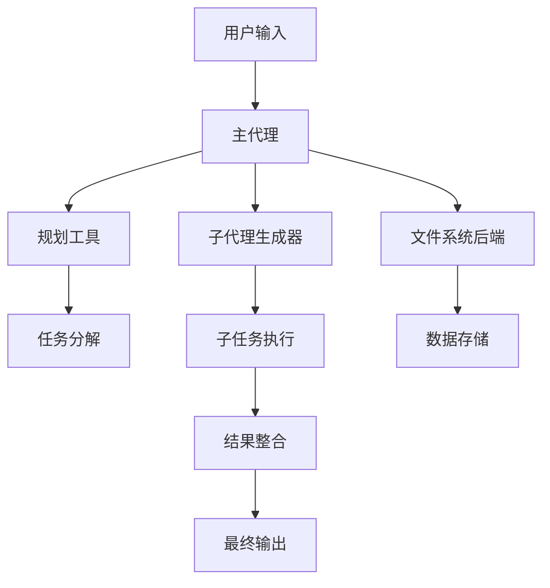
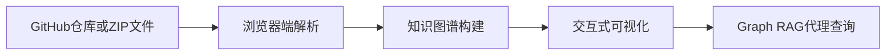
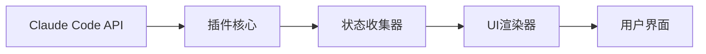

## 今日热点

AI Agent框架和工具持续爆发式增长，同时代码理解与知识图谱技术成为开发者关注焦点，两者共同推动软件开发智能化转型进程。

---

## 热门项目一览

| 排名 | 项目 | 语言 | 今日 | 总计 | 简介 |
|:---:|------|:----:|------:|-----:|------|
| 1 | [obra/superpowers](https://github.com/obra/superpowers) | Shell | +3,078 | 92,455 | An agentic skills framework... |
| 2 | [codecrafters-io/build-your-own-x](https://github.com/codecrafters-io/build-your-own-x) | Markdown | +1,998 | 479,851 | Master programming by recre... |
| 3 | [langchain-ai/deepagents](https://github.com/langchain-ai/deepagents) | Python | +1,415 | 14,163 | Agent harness built with La... |
| 4 | [abhigyanpatwari/GitNexus](https://github.com/abhigyanpatwari/GitNexus) | TypeScript | +1,116 | 16,743 | GitNexus: The Zero-Server C... |
| 5 | [jarrodwatts/claude-hud](https://github.com/jarrodwatts/claude-hud) | JavaScript | +466 | 5,645 | A Claude Code plugin that s... |
| 6 | [cloudflare/workerd](https://github.com/cloudflare/workerd) | C++ | +31 | 7,834 | The JavaScript / Wasm runti... |

---

## 趋势洞察

```
┌─────────────────────────────────────────────────────────────────┐
│  AI/ML 工具         ████████████████████████  4 个项目        │
│  其他               ████████████              2 个项目        │
└─────────────────────────────────────────────────────────────────┘
```

---

## 项目深度解读

### 1. obra/superpowers — 智能开发框架

> **一句话总结**：提供智能技能框架和有效软件开发方法论，提升开发效率和代码质量

#### 价值主张

| 维度 | 说明 |
|------|------|
| **解决痛点** | 软件开发中缺乏系统化的技能培养和有效的方法论指导 |
| **目标用户** | 软件开发者、技术团队、编程学习者 |
| **核心亮点** | 智能技能框架 + 实用方法论 + 代码质量提升 + 开发效率提高 + 学习路径优化 |

#### 技术架构


**技术特色**：
- 基于Shell脚本实现的轻量级框架
- 提供结构化的技能培养路径
- 集成实用的软件开发最佳实践

#### 热度分析

- Star数超9万且近期增长迅猛，表明项目获得广泛认可和积极采用
- Issues数量为零，反映项目维护良好，社区问题得到及时响应

#### 快速上手

```bash
# 克隆项目
git clone https://github.com/obra/superpowers.git
# 进入项目目录
cd superpowers
# 查看使用说明
cat README.md
```

#### 注意事项

- 项目许可证信息未明确标注，使用前需确认许可条款
- 建议先阅读项目文档，了解完整方法论和框架结构再开始应用


### 2. codecrafters-io/build-your-own-x — 编程重建指南

> **一句话总结**：通过从零开始重建热门技术，帮助开发者深入理解系统原理和编程本质。

#### 价值主张

| 维度 | 说明 |
|------|------|
| **解决痛点** | 学习停留在表面，缺乏对技术核心原理的深入理解 |
| **目标用户** | 有一定基础但想深入系统原理的中高级开发者 |
| **核心亮点** | 动手实践 + 真实项目复现 + 渐进式难度提升 |

#### 热度分析

- 项目获得近48万星，日增近2千星，表明开发者对通过重建技术学习编程有极高需求
- 在开源教育领域处于领先地位，社区活跃度高，形成了一套独特的学习方法论

#### 快速上手

```bash
# 克隆项目到本地
git clone https://github.com/codecrafters-io/build-your-own-x.git

# 浏览目录结构，选择感兴趣的技术栈开始学习
cd build-your-own-x && ls
```

#### 注意事项

- 本项目是教程集合，不是可直接运行的软件，需要按照指南逐步实现
- 每个技术栈的实现难度不同，建议从自己熟悉的技术开始尝试


### 3. langchain-ai/deepagents — 智能代理框架

> **一句话总结**：基于LangChain和LangGraph构建的智能代理框架，具备规划、文件系统和子代理生成能力，可处理复杂任务。

#### 价值主张

| 维度 | 说明 |
|------|------|
| **解决痛点** | 解决复杂任务处理中代理系统缺乏规划、文件管理和子任务分解能力的问题 |
| **目标用户** | 需要构建复杂AI代理系统的开发者、研究人员和企业用户 |
| **核心亮点** | 基于LangGraph构建 + 内置规划工具 + 文件系统后端 + 子代理生成能力 |

#### 技术架构



**技术特色**：
- 基于LangGraph构建的代理系统架构，提供灵活的代理工作流
- 内置智能规划工具，支持任务分解与多步骤执行
- 文件系统后端提供持久化存储能力，支持状态管理

#### 热度分析

- 项目Star数突破14k，单日激增1.4k，表明近期热度极高，可能是重大更新或新发布
- 社区活跃度极高，Issues数量为0可能表明项目维护良好或处于早期阶段

#### 快速上手

```bash
# 安装依赖
pip install langchain langgraph deepagents

# 基本使用示例
from deepagents import DeepAgent
agent = DeepAgent()
agent.run("处理复杂任务的指令")
```

#### 注意事项

- 项目依赖LangChain和LangGraph，需确保版本兼容性
- 文件系统后端可能需要特定配置才能正常工作
- 子代理生成机制可能需要额外的计算资源支持


### 4. abhigyanpatwari/GitNexus — [浏览器代码图谱引擎]

> **一句话总结**：完全在浏览器中运行的客户端知识图谱创建工具，可交互式探索代码结构和关系。

#### 价值主张

| 维度 | 说明 |
|------|------|
| **解决痛点** | 传统代码分析需服务器支持且处理慢，GitNexus实现客户端快速构建知识图谱 |
| **目标用户** | 软件开发者、代码审查人员、技术研究员和需要深入理解代码库结构的开发者 |
| **核心亮点** | 客户端运行 + 无服务器依赖 + 交互式知识图谱 + 内置Graph RAG代理 |

#### 技术架构



**技术特色**：
- 完全基于浏览器运行，无需服务器支持
- 使用TypeScript开发，提供类型安全保证
- 内置Graph RAG代理，支持智能代码查询

#### 热度分析

- 项目获得16,743个星标，单日增长1,116，表明近期热度快速上升
- 零开放问题，说明项目维护良好，社区反馈积极且问题解决及时

#### 快速上手

```bash
# 访问GitNexus网页应用
# 上传GitHub仓库URL或ZIP文件
# 在交互式知识图谱中探索代码结构
```

#### 注意事项

- 大型代码库可能会影响浏览器性能，建议适当控制加载规模
- 所有代码处理均在本地进行，但需注意上传到公共仓库的代码隐私问题
- 需要稳定的网络连接来初始加载和处理代码资源


### 5. jarrodwatts/claude-hud — AI开发辅助工具

> **一句话总结**：Claude Code实时状态监控插件，可视化展示AI助手工作流程与上下文信息。

#### 价值主张

| 维度 | 说明 |
|------|------|
| **解决痛点** | 解决开发者无法直观了解Claude AI助手工作状态与上下文的问题 |
| **目标用户** | 使用Claude Code进行开发的程序员和AI辅助开发者 |
| **核心亮点** | 实时状态监控 + 上下文可视化 + 代理活动追踪 + 任务进度管理 |

#### 技术架构



**技术特色**：
- 实时数据采集与展示机制
- 轻量级插件架构设计
- 无缝集成Claude Code工作流

#### 热度分析

- 项目近期热度显著增长，单日新增466个Star，表明用户认可度高
- 作为Claude生态工具，填补了AI辅助开发监控领域的空白

#### 快速上手

```bash
# 安装Claude Code
npm install -g @anthropic-ai/claude-code

# 安装claude-hud插件
claude-code install jarrodwatts/claude-hud
```

#### 注意事项

- 需要先安装Claude Code环境才能使用此插件
- 项目许可证信息不明确，使用前需确认授权条款
- 由于项目没有开放的Issues，可能需要通过其他渠道获取支持


### 6. cloudflare/workerd — 边缘计算运行时

> **一句话总结**：高性能边缘计算运行时，支持 JavaScript 和 WebAssembly，为 Cloudflare Workers 提供执行环境。

#### 价值主张

| 维度 | 说明 |
|------|------|
| **解决痛点** | 提供轻量级、高性能的边缘计算运行环境，解决全球分布式计算需求 |
| **目标用户** | 边缘计算开发者、Cloudflare Workers 用户、分布式应用架构师 |
| **核心亮点** | 高性能JavaScript/Wasm执行引擎 + 资源隔离 + 边缘计算优化 |

#### 技术架构


**技术特色**：
- 基于 V8 引擎的高性能 JavaScript 执行
- WebAssembly 原生支持
- 资源隔离和安全沙箱机制
- 边缘计算优化，低延迟执行
- 与 Cloudflare 网络深度集成

#### 热度分析

- Star 数 7,834 且持续增长(+31 today)，表明项目受到广泛关注和认可
- 作为 Cloudflare Workers 的核心组件，在边缘计算和 Serverless 领域具有重要生态地位

#### 快速上手

```bash
# 克隆仓库
git clone https://github.com/cloudflare/workerd.git
# 构建项目
cd workerd && make
```

#### 注意事项

- 这是一个底层运行时项目，不是直接面向用户的工具
- 需要一定的系统底层知识才能有效使用和贡献
- 项目主要服务于 Cloudflare Workers 生态，其他场景可能需要额外配置


## 今日推荐

| 主题 | 推荐项目 | 亮点 |
|------|----------|------|
| 今日最热 | [obra/superpowers](https://github.com/obra/superpowers) | An agentic skills... |
| 值得关注 | [codecrafters-io/build-your-own-x](https://github.com/codecrafters-io/build-your-own-x) | Master programmin... |
| 快速上手 | [langchain-ai/deepagents](https://github.com/langchain-ai/deepagents) | Agent harness bui... |
| 长期潜力 | [abhigyanpatwari/GitNexus](https://github.com/abhigyanpatwari/GitNexus) | GitNexus: The Zer... |

---

<div align="center">

*Generated on 2026-03-18 | Powered by GitHub Trending Reporter*

</div>