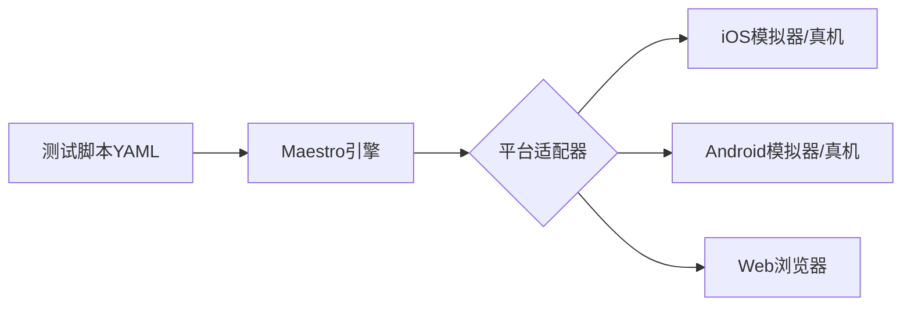

## 今日热点

AI代理开发工具持续火爆，本地化AI模型训练与运行方案受热捧，开发者加速拥抱AI辅助编程与自主可控的AI基础设施。

---

## 热门项目一览

| 排名 | 项目 | 语言 | 今日 | 总计 | 简介 |
|:---:|------|:----:|------:|-----:|------|
| 1 | [obra/superpowers](https://github.com/obra/superpowers) | Shell | +3,494 | 99,246 | An agentic skills framework... |
| 2 | [jarrodwatts/claude-hud](https://github.com/jarrodwatts/claude-hud) | JavaScript | +1,851 | 8,523 | A Claude Code plugin that s... |
| 3 | [gsd-build/get-shit-done](https://github.com/gsd-build/get-shit-done) | JavaScript | +1,491 | 36,130 | A light-weight and powerful... |
| 4 | [shareAI-lab/learn-claude-code](https://github.com/shareAI-lab/learn-claude-code) | TypeScript | +1,448 | 33,661 | Bash is all you need - A na... |
| 5 | [opendataloader-project/opendataloader-pdf](https://github.com/opendataloader-project/opendataloader-pdf) | Java | +1,416 | 5,672 | PDF Parser for AI-ready dat... |
| 6 | [unslothai/unsloth](https://github.com/unslothai/unsloth) | Python | +1,262 | 56,713 | Unified web UI for training... |
| 7 | [langchain-ai/open-swe](https://github.com/langchain-ai/open-swe) | Python | +965 | 7,044 | An Open-Source Asynchronous... |
| 8 | [louis-e/arnis](https://github.com/louis-e/arnis) | Rust | +946 | 10,777 | Generate any location from ... |
| 9 | [mobile-dev-inc/Maestro](https://github.com/mobile-dev-inc/Maestro) | Kotlin | +492 | 12,449 | Painless E2E Automation for... |
| 10 | [newton-physics/newton](https://github.com/newton-physics/newton) | Python | +346 | 3,231 | An open-source, GPU-acceler... |
| 11 | [FujiwaraChoki/MoneyPrinterV2](https://github.com/FujiwaraChoki/MoneyPrinterV2) | Python | +146 | 16,078 | Automate the process of mak... |

---

## 趋势洞察

```
┌─────────────────────────────────────────────────────────────────┐
│  AI/ML 工具         ████████████████████████  9 个项目        │
│  其他               █████                     2 个项目        │
└─────────────────────────────────────────────────────────────────┘
```

---

## 项目深度解读


### 2. jarrodwatts/claude-hud — Claude可视化工具

> **一句话总结**：Claude Code可视化插件，实时展示上下文、工具和代理状态，提升AI开发体验。

#### 价值主张

| 维度 | 说明 |
|------|------|
| **解决痛点** | 解决Claude Code使用过程中状态不透明问题，难以追踪AI决策过程 |
| **目标用户** | 使用Claude Code的开发者和AI研究人员 |
| **核心亮点** | 实时上下文监控 + 活动工具可视化 + 代理状态跟踪 + 待办事项进度管理 |

#### 技术架构


**技术特色**：
- 通过JavaScript实现与Claude Code的深度集成
- 实时数据流处理与状态追踪技术
- 高效的可视化渲染机制，不干扰主工作流程

#### 热度分析

- 项目获得8523星且单日增长1851，表明Claude Code生态需求旺盛，用户对AI开发辅助工具高度关注
- 零开放问题反映项目成熟度高，社区认可度强，处于Claude Code生态工具的关键位置

#### 快速上手

```bash
# 安装Claude Code HUD插件
npm install -g claude-hud

# 在Claude Code中启用
claude config hud enabled
```

#### 注意事项

- 插件可能需要Claude Code的最新版本才能正常工作
- 某些高级功能可能需要API密钥或订阅Claude Pro服务
- 可能在某些编辑器环境中存在兼容性问题，需要额外配置


### 3. gsd-build/get-shit-done — AI编程助手增强

> **一句话总结**：为Claude Code提供元提示和上下文工程，提升AI辅助开发效率的轻量级系统。

#### 价值主张

| 维度 | 说明 |
|------|------|
| **解决痛点** | 简化AI编程助手提示工程，优化上下文管理，提高代码生成质量 |
| **目标用户** | 使用Claude Code进行AI辅助开发的开发者 |
| **核心亮点** | 元提示系统 + 上下文工程 + 规范驱动开发 + 轻量级设计 |

#### 技术架构


**技术特色**：
- 采用模块化元提示框架，支持自定义提示模板
- 智能上下文管理，自动过滤和优化代码上下文
- 基于规范的代码生成，确保输出符合项目要求

#### 热度分析

- 项目近期激增1,491个star，表明开发者对AI辅助编程工具需求旺盛
- 高star低fork比例反映项目成熟度高，社区认可度高

#### 快速上手

```bash
# 安装gsd工具
npm install -g @gsd-build/cli

# 初始化项目配置
gsd init

# 运行AI辅助开发
gsd generate
```

#### 注意事项

- 需要配合Claude Code使用，无法独立运行
- 规范定义的质量直接影响AI生成代码的效果
- 适用于中大型项目的复杂场景，小型项目可能过于复杂


### 4. shareAI-lab/learn-claude-code — 命令行代理

> **一句话总结**：一个基于 TypeScript 构建的类 Claude Code 命令行代理工具，专注于通过 Bash 命令完成任务。

#### 价值主张

| 维度 | 说明 |
|------|------|
| **解决痛点** | 简化命令行操作，提供更智能的 Bash 命令执行环境 |
| **目标用户** | 命令行爱好者、开发者、DevOps 工程师 |
| **核心亮点** | 精简设计 + TypeScript 实现 + 从零构建 + 类 Claude Code 体验 |

#### 技术架构


**技术特色**：
- 基于 TypeScript 开发，提供类型安全
- 精简设计，专注于命令行代理功能
- 从零构建，易于理解和学习

#### 热度分析

- 项目 Star 数超过 3.3 万，单日增长上千，表明社区对该项目高度关注
- Fork 数量适中，表明项目有良好的可扩展性和二次开发价值

#### 快速上手

```bash
# 克隆项目
git clone https://github.com/shareAI-lab/learn-claude-code.git
cd learn-claude-code
npm install && npm start
```

#### 注意事项

- 项目许可证未知，使用前需确认授权条款
- 作为命令行工具，需确保系统环境兼容性


### 5. opendataloader-project/opendataloader-pdf — AI PDF智能解析器

> **一句话总结**：专为AI优化的PDF解析工具，自动化处理文档可访问性，提升PDF数据可用性。

#### 价值主张

| 维度 | 说明 |
|------|------|
| **解决痛点** | 解决PDF结构化数据提取难、可访问性处理复杂的问题。 |
| **目标用户** | AI开发者、数据科学家及文档处理自动化团队。 |
| **核心亮点** | AI数据优化 + 可访问性自动化 + 开源免费 + 高精度解析 |

#### 技术架构


**技术特色**：
- 基于Java的高性能PDF解析引擎
- 智能识别文档结构与语义信息
- 自动化PDF可访问性优化处理

#### 热度分析

- 近期爆发式增长，单日新增星标超1400，显示AI PDF处理需求旺盛。
- Fork/Star比偏低，表明用户以使用为主，社区生态尚在建设中。

#### 快速上手

```bash
# 克隆项目
git clone https://github.com/opendataloader-project/opendataloader-pdf.git

# 构建项目
cd opendataloader-pdf
mvn clean install

# 基本使用（示例）
java -jar opendataloader-pdf.jar input.pdf --output ai-ready.json
```

#### 注意事项

- 项目依赖Java环境，需确保JDK版本兼容
- 处理大型PDF文件时可能需要调整内存配置
- 可访问性处理效果可能受原始PDF质量影响


### 6. unslothai/unsloth — 本地模型训练UI

> **一句话总结**：统一Web界面简化开源大模型本地训练与部署，支持多种主流模型。

#### 价值主张

| 维度 | 说明 |
|------|------|
| **解决痛点** | 解决开源大模型本地部署复杂、配置繁琐的问题 |
| **目标用户** | AI研究员、开发者、企业技术团队 |
| **核心亮点** | 统一Web界面 + 支持多种开源模型 + 简化本地部署 + 高效训练优化 |

#### 技术架构


**技术特色**：
- 支持多种主流开源大模型（Qwen、DeepSeek等）
- 优化本地训练流程，提高效率
- 提供友好的Web界面，降低使用门槛

#### 热度分析

- 项目Star数快速增长，单日增长超1200，社区热度持续攀升
- 在本地模型训练工具领域处于领先地位，拥有活跃的开发者社区

#### 快速上手

```bash
# 克隆项目
git clone https://github.com/unslothai/unsloth.git
cd unsloth

# 安装依赖
pip install -e .

# 启动服务
python app.py
```

#### 注意事项

- 项目需要较好的硬件支持，特别是GPU资源
- 某些模型可能需要特定的依赖配置
- 许可证信息不明确，使用前需确认商业使用条款


### 7. langchain-ai/open-swe — 智能编程助手

> **一句话总结**：开源异步编程代理，结合软件工程知识与大型语言模型，提供智能编程解决方案。

#### 价值主张

| 维度 | 说明 |
|------|------|
| **解决痛点** | 传统编程辅助工具缺乏软件工程知识整合，难以提供上下文相关解决方案 |
| **目标用户** | 软件开发人员、程序员、编程学习者 |
| **核心亮点** | 异步处理能力 + 软件工程知识库 + 多语言支持 + 大型语言模型集成 + 开源可定制 |

#### 技术架构


**技术特色**：
- 基于LangChain框架构建，利用其强大的语言模型处理能力
- 异步编程架构，提高处理效率和响应速度
- 软件工程知识库集成，提供专业领域知识支持

#### 热度分析

- 项目获得7044颗星，单日增长965，表明近期受到广泛关注，可能是由于新功能发布或技术突破
- Fork数量875，显示社区参与度和二次开发意愿较高，在AI编程辅助工具领域具有较强影响力

#### 快速上手

```bash
# 克隆仓库
git clone https://github.com/langchain-ai/open-swe.git
cd open-swe

# 安装依赖
pip install -r requirements.txt

# 运行示例
python examples/basic_usage.py
```

#### 注意事项

- 项目依赖大型语言模型，需要确保有足够的计算资源
- 由于项目处于快速发展阶段，API和功能可能会有变化，需关注更新日志
- 使用时需要注意数据隐私和安全性问题，特别是处理敏感代码时


### 8. louis-e/arnis — 现实地形转换器

> **一句话总结**：将真实世界地形数据精确转换至 Minecraft，实现高细节还原现实场景。

#### 价值主张

| 维度 | 说明 |
|------|------|
| **解决痛点** | Minecraft 无法直接使用真实世界地形数据 |
| **目标用户** | Minecraft 创作者、教育工作者、城市规划模拟者 |
| **核心亮点** | 高精度地形转换 + 真实细节还原 + 多种地形数据源支持 |

#### 技术架构


**技术特色**：
- 使用 Rust 语言编写，保证高性能和内存安全
- 支持多种地形数据源，包括 OpenStreetMap 等公开数据
- 高效的算法实现复杂地形细节转换

#### 热度分析

- 项目获得超过 10,000 stars，单日增长近千，显示极高的社区关注度
- 作为 Minecraft 生态中的专业工具，填补了现实世界地形转换的空白

#### 快速上手

```bash
# 克隆项目
git clone https://github.com/louis-e/arnis.git
cd arnis

# 构建项目
cargo build --release

# 使用工具转换地形（假设命令格式）
./arnis -i input_data -o output_world
```

#### 注意事项

- 项目可能需要较大的计算资源处理高精度地形数据
- 可能需要依赖特定的地形数据源或 API
- 需要了解 Minecraft 世界格式才能正确使用输出结果


### 9. mobile-dev-inc/Maestro — 移动测试自动化

> **一句话总结**：通过声明式语言实现移动与Web应用的端到端自动化测试，无需编写复杂代码。

#### 价值主张

| 维度 | 说明 |
|------|------|
| **解决痛点** | 解决移动应用测试复杂、维护成本高、跨平台兼容性差的问题 |
| **目标用户** | 移动应用开发者、QA工程师、测试团队、CI/CD流程集成者 |
| **核心亮点** | 声明式测试语言+可视化编辑器+跨平台支持+无需编译+快速执行 |

#### 技术架构



**技术特色**：
- 基于YAML的声明式测试语言，降低学习曲线
- 无需编写复杂代码，通过自然语言描述操作步骤
- 支持iOS、Android和Web平台的统一测试框架

#### 热度分析

- 项目星标超1.2万，近期增长迅速，表明在移动测试领域获得广泛认可
- 零开放问题反映项目成熟度高，社区维护良好，已成为移动自动化测试主流工具

#### 快速上手

```bash
# 安装Maestro CLI
npm install -g @maestro/cli

# 运行测试
maestro test path/to/your/test.yaml

# 生成测试报告
maestro test path/to/your/test.yaml --reporter junit
```

#### 注意事项

- 测试设备需要开启"开发者模式"并允许USB调试
- 测试脚本路径使用绝对路径可避免执行问题
- 对于复杂交互场景，可能需要添加适当延迟确保稳定性


### 10. newton-physics/newton — GPU物理引擎

> **一句话总结**：基于NVIDIA Warp的GPU加速物理模拟引擎，专为机器人和仿真研究设计。

#### 价值主张

| 维度 | 说明 |
|------|------|
| **解决痛点** | 传统CPU物理模拟计算效率低，无法满足复杂机器人仿真需求 |
| **目标用户** | 机器人研究人员、仿真工程师、物理模拟开发者 |
| **核心亮点** | GPU加速 + NVIDIA Warp支持 + 机器人专用物理模型 + Python接口 |

#### 技术架构


**技术特色**：
- 基于NVIDIA Warp实现GPU加速物理计算
- 提供Python接口，降低使用门槛
- 针对机器人应用优化的物理模型

#### 热度分析

- 项目近期增长迅速，单日增长346 stars，表明社区对该技术高度关注
- 作为专业物理模拟引擎，在机器人研究领域具有明确的技术定位

#### 快速上手

```bash
# 安装依赖
pip install nvidia-warp newton-physics

# 基本使用示例
import warp as wp
from newton import PhysicsEngine

# 初始化物理引擎
engine = PhysicsEngine()

# 创建简单场景并模拟
engine.setup_scene()
engine.simulate(steps=1000)
```

#### 注意事项

- 需要NVIDIA GPU支持才能发挥最大性能
- 项目可能处于早期阶段，API和功能可能不够稳定
- 需要具备一定的物理模拟和GPU计算基础知识


### 11. FujiwaraChoki/MoneyPrinterV2 — 自动化赚钱工具

> **一句话总结**：自动化在线赚钱流程的工具，通过Python脚本实现多种被动收入来源。

#### 价值主张

| 维度 | 说明 |
|------|------|
| **解决痛点** | 自动化在线赚钱流程，减少人工操作和时间成本 |
| **目标用户** | 寻求被动收入来源的互联网用户，特别是技术背景人群 |
| **核心亮点** | 多种赚钱方式集成 + 自动化执行 + 数据追踪 |

#### 技术架构


**技术特色**：
- 基于Python的模块化设计框架
- 支持多种赚钱方式的灵活配置
- 内置监控和数据分析功能

#### 热度分析

- 项目星数持续增长，今日新增146星，表明项目活跃度高，受用户认可
- Fork数达1684，显示社区参与度高，用户积极尝试和二次开发

#### 快速上手

```bash
# 克隆项目
git clone https://github.com/FujiwaraChoki/MoneyPrinterV2.git

# 安装依赖
pip install -r requirements.txt

# 运行主程序
python main.py
```

#### 注意事项

- 项目涉及自动化赚钱，需注意遵守相关平台和法律法规
- 可能需要一定的技术背景才能正确配置和使用
- 收入效果可能因个人情况和使用方式而异


## 今日推荐

| 主题 | 推荐项目 | 亮点 |
|------|----------|------|
| 今日最热 | [obra/superpowers](https://github.com/obra/superpowers) | An agentic skills... |
| 值得关注 | [jarrodwatts/claude-hud](https://github.com/jarrodwatts/claude-hud) | A Claude Code plu... |
| 快速上手 | [gsd-build/get-shit-done](https://github.com/gsd-build/get-shit-done) | A light-weight an... |
| 长期潜力 | [shareAI-lab/learn-claude-code](https://github.com/shareAI-lab/learn-claude-code) | Bash is all you n... |

---

<div align="center">

*Generated on 2026-03-20 | Powered by GitHub Trending Reporter*

</div>