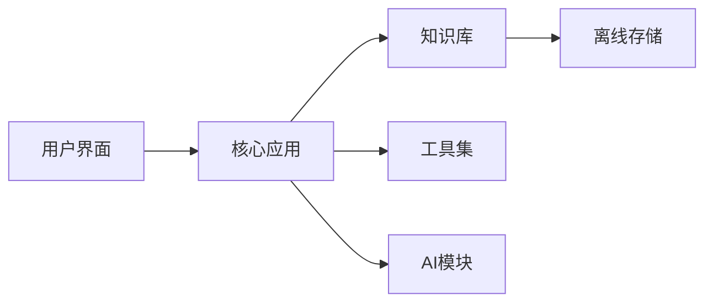
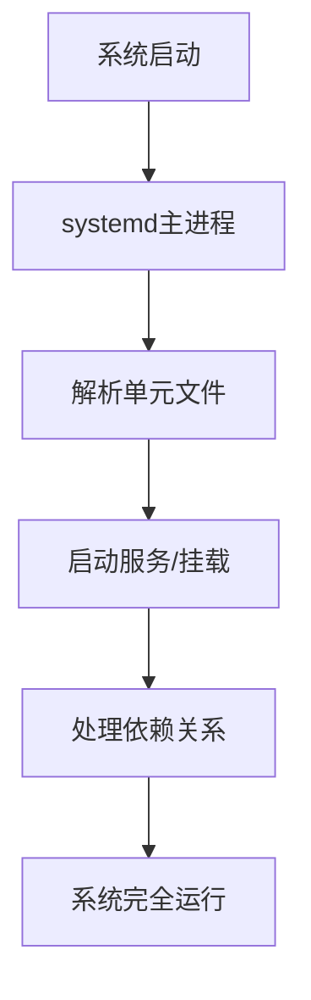

## 今日热点

AI工具链与离线解决方案成为今日焦点，Claude插件、AI数据解析工具及自包含生存计算机项目激增，反映开发者对增强AI应用与技术自主性的双重需求。

---

## 热门项目一览

| 排名 | 项目 | 语言 | 今日 | 总计 | 简介 |
|:---:|------|:----:|------:|-----:|------|
| 1 | [Crosstalk-Solutions/project-nomad](https://github.com/Crosstalk-Solutions/project-nomad) | TypeScript | +2,032 | 6,770 | Project N.O.M.A.D, is a sel... |
| 2 | [jarrodwatts/claude-hud](https://github.com/jarrodwatts/claude-hud) | JavaScript | +970 | 10,448 | A Claude Code plugin that s... |
| 3 | [opendataloader-project/opendataloader-pdf](https://github.com/opendataloader-project/opendataloader-pdf) | Java | +950 | 7,892 | PDF Parser for AI-ready dat... |
| 4 | [louis-e/arnis](https://github.com/louis-e/arnis) | Rust | +690 | 12,226 | Generate any location from ... |
| 5 | [FujiwaraChoki/MoneyPrinterV2](https://github.com/FujiwaraChoki/MoneyPrinterV2) | Python | +283 | 17,777 | Automate the process of mak... |
| 6 | [vllm-project/vllm-omni](https://github.com/vllm-project/vllm-omni) | Python | +71 | 3,513 | A framework for efficient m... |
| 7 | [systemd/systemd](https://github.com/systemd/systemd) | C | +58 | 15,727 | The systemd System and Serv... |
| 8 | [aquasecurity/trivy](https://github.com/aquasecurity/trivy) | Go | +39 | 33,380 | Find vulnerabilities, misco... |
| 9 | [protocolbuffers/protobuf](https://github.com/protocolbuffers/protobuf) | C++ | +7 | 70,947 | Protocol Buffers - Google's... |

---

## 趋势洞察

```
┌─────────────────────────────────────────────────────────────────┐
│  AI/ML 工具         ████████████████████████  6 个项目        │
│  其他               ████████                  2 个项目        │
│  数据分析             ████                      1 个项目        │
└─────────────────────────────────────────────────────────────────┘
```

---

## 项目深度解读

### 1. Crosstalk-Solutions/project-nomad — 离线生存电脑

> **一句话总结**：Project N.O.M.A.D是一个自包含的离线生存计算机，内置关键工具、知识和AI，随时随地为用户提供信息和赋能。

#### 价值主张

| 维度 | 说明 |
|------|------|
| **解决痛点** | 解决无网络环境下的生存工具和信息获取需求 |
| **目标用户** | 预先准备者、户外探险者、应急响应人员 |
| **核心亮点** | 离线可用 + 内置AI + 工具集完整 + 知识库丰富 |

#### 技术架构



**技术特色**：
- 基于TypeScript构建，确保代码质量和类型安全
- 完全离线运行，无需网络连接
- 模块化设计，包含AI、工具和知识库组件

#### 热度分析

- 项目近期获得大量关注，单日增长超过2000 stars，表明可能有重大更新或突破
- 虽然issues为0，但fork数相对较少，表明项目可能处于早期发展阶段或专业性较强

#### 快速上手

```bash
# 克隆项目
git clone https://github.com/Crosstalk-Solutions/project-nomad.git
# 安装依赖
npm install
# 运行应用
npm start
```

#### 注意事项

- 项目需要足够的存储空间，因为包含大量离线资源和工具
- AI功能可能需要本地计算资源，性能可能受设备限制
- 由于是离线应用，更新可能需要手动下载新版本


### 2. jarrodwatts/claude-hud — Claude状态面板

> **一句话总结**：为Claude Code提供实时状态可视化，展示上下文使用、活动工具与任务进度。

#### 价值主张

| 维度 | 说明 |
|------|------|
| **解决痛点** | 解决Claude Code内部状态不透明问题，提供AI工作过程可视化 |
| **目标用户** | 使用Claude Code进行开发的程序员与AI辅助编程者 |
| **核心亮点** | 实时上下文监控 + 活动工具展示 + 代理状态追踪 + 待办进度可视化 |

#### 技术架构


**技术特色**：
- 轻量级插件架构，最小化对Claude Code性能影响
- 高效实时数据流处理，确保状态信息低延迟更新
- 可扩展的组件化设计，支持多种状态展示模式

#### 热度分析

- 项目星标突破10k且单日增长近千，反映开发者对AI工具透明度的强烈需求
- 作为Claude生态系统的关键辅助工具，填补了AI助手工作过程可视化的市场空白

#### 快速上手

```bash
# 安装Claude Code HUD插件
npm install -g claude-hud
# 在Claude Code中启用插件
claude config plugins enable claude-hud
```

#### 注意事项

- 项目许可证未知，使用前需确认开源协议与商业使用限制
- 作为第三方插件，可能存在与Claude Code版本兼容性问题
- 需要Claude Code环境才能正常运行，独立使用无效果


### 3. opendataloader-project/opendataloader-pdf — AI PDF解析器

> **一句话总结**：专为AI优化的PDF解析器，自动化处理PDF可访问性，支持结构化数据提取。

#### 价值主张

| 维度 | 说明 |
|------|------|
| **解决痛点** | 传统PDF解析难以提供AI友好的结构化数据，可访问性处理繁琐 |
| **目标用户** | AI开发人员、数据科学家、文档自动化处理团队 |
| **核心亮点** | AI数据优化 + 自动化可访问性 + 结构化提取 + 开源免费 |

#### 技术架构


**技术特色**：
- 基于Java的高效PDF解析引擎，支持复杂文档结构
- 专为AI训练优化的数据提取和格式化
- 自动化PDF可访问性检查和修复功能

#### 热度分析

- 项目近期获得大量关注（单日增加950星），显示AI数据处理领域需求旺盛
- 作为开源项目在PDF处理和AI数据准备领域占据重要生态位置

#### 快速上手

```bash
# 克隆项目
git clone https://github.com/opendataloader-project/opendataloader-pdf.git

# 构建项目
cd opendataloader-pdf
mvn clean install
```

#### 注意事项

- 项目License未知，商业使用前需确认授权条款
- 项目Issues数量为0，可能意味着项目处于早期阶段或社区反馈渠道不完善
- 需要确认对特定PDF格式的兼容性范围


### 4. louis-e/arnis — 现实世界生成器

> **一句话总结**：将真实世界地理数据转换为高精度Minecraft世界，实现虚拟与现实的无缝衔接。

#### 价值主张

| 维度 | 说明 |
|------|------|
| **解决痛点** | 解决Minecraft世界缺乏真实地理环境的问题 |
| **目标用户** | Minecraft玩家、教育工作者、地图爱好者 |
| **核心亮点** | 高精度地形还原 + 真实地理数据集成 + 自定义生成参数 |

#### 技术架构


**技术特色**：
- 基于Rust的高性能地理数据处理系统
- 智能地形高度映射算法，保留地理特征
- 灵活的参数配置系统，支持自定义生成规则

#### 热度分析

- 项目近期热度显著上升，单日增加690 stars，表明项目正在获得广泛关注
- 0 open issues 反映了项目成熟度高，维护良好

#### 快速上手

```bash
# 安装依赖
cargo install arnis

# 生成世界
arnis generate --input "world_map.json" --output "minecraft_world"
```

#### 注意事项
- 需要足够的系统资源处理大型地理数据
- 生成过程可能需要较长时间，取决于地图大小
- 需要了解Minecraft地图格式和地理数据格式


### 5. FujiwaraChoki/MoneyPrinterV2 — 自动创收工具

> **一句话总结**：自动化在线赚钱工具，通过脚本实现多渠道被动收入生成。

#### 价值主张

| 维度 | 说明 |
|------|------|
| **解决痛点** | 简化在线创收流程，减少手动操作，提高收入效率 |
| **目标用户** | 希望通过自动化手段获取被动收入的网络用户 |
| **核心亮点** | 多平台整合 + 智能脚本 + 低门槛操作 + 持续更新 |

#### 技术架构


**技术特色**：
- 基于Python的轻量级自动化框架
- 模块化设计支持多平台扩展
- 内置防检测机制降低封号风险

#### 热度分析

- 项目获星数过万且持续增长，显示自动化创工工具市场需求旺盛
- Fork数量近两千，表明社区活跃度高，用户积极参与二次开发

#### 快速上手

```bash
# 克隆项目
git clone https://github.com/FujiwaraChoki/MoneyPrinterV2.git

# 安装依赖并运行
cd MoneyPrinterV2 && pip install -r requirements.txt && python main.py
```

#### 注意事项

- 项目涉及自动化操作，使用前需确认目标平台服务条款，避免违规
- 建议小范围测试后再扩大使用规模，防止账号风险
- 项目未明确许可证，使用时需注意版权和授权问题


### 6. vllm-project/vllm-omni — 多模态推理框架

> **一句话总结**：高效支持多模态模型推理的框架，优化大规模模型的推理性能与资源利用率。

#### 价值主张

| 维度 | 说明 |
|------|------|
| **解决痛点** | 多模态模型推理效率低、资源消耗大，难以在实际场景中部署 |
| **目标用户** | 需要部署多模态AI模型的研究人员和工程师 |
| **核心亮点** | 高效推理 + 多模态支持 + 内存优化 + 批处理能力 + 动态批处理 |

#### 技术架构


**技术特色**：
- 基于PagedAttention的高效内存管理机制
- 支持连续批处理(Continuous Batching)技术
- 高度优化的CUDA内核实现
- 与HuggingFace生态系统无缝集成
- 动态批处理优化推理吞吐量

#### 热度分析

- 项目Star数达3513且单日新增71，增长迅速，社区关注度持续攀升
- Fork数587表明项目具有较高二次开发价值，适合作为多模态推理基础框架

#### 快速上手

```bash
# 安装vllm-omni
pip install vllm-omni

# 基本使用示例
from vllm_omni import LLM
llm = LLM(model="llava-v1.5-7b")
output = llm.generate("Describe this image", image="path/to/image")
print(output)
```

#### 注意事项

- 项目需要NVIDIA GPU支持，CUDA版本需兼容
- 多模态模型通常较大，需要充足的显存资源
- 项目可能处于早期阶段，API可能不稳定
- 许可证信息不明确，使用前需确认开源许可条款


### 7. systemd/systemd — Linux系统初始化器

> **一句话总结**：现代Linux系统的核心初始化系统与服务管理器，提供并行启动和依赖管理功能。

#### 价值主张

| 维度 | 说明 |
|------|------|
| **解决痛点** | 解决传统SysVinit启动慢、依赖处理差的问题，提升系统引导效率 |
| **目标用户** | Linux发行版维护者、系统管理员和需要高效系统管理的开发者 |
| **核心亮点** | 并行启动加速 + 依赖自动处理 + 统一服务管理接口 + 资源限制控制 + 日志集中管理 |

#### 技术架构



**技术特色**：
- 基于单元文件的服务描述与激活机制
- 采用socket激活实现服务按需启动
- 通过cgroups进行资源隔离与限制管理
- 提供统一dbus接口实现系统状态查询
- 使用journal实现集中式日志管理

#### 热度分析

- Star数持续稳定增长，反映其在Linux生态系统中的核心地位和广泛采用
- 作为大多数现代Linux发行版的默认初始化系统，拥有庞大的用户基础和活跃社区

#### 快速上手

```bash
# 查看系统状态
systemctl status

# 启动/停止服务
systemctl start nginx
systemctl stop nginx

# 启用/禁用服务自启动
systemctl enable nginx
systemctl disable nginx
```

#### 注意事项

- systemd与某些传统init系统工具不完全兼容，可能需要适配
- 配置错误可能导致系统无法正常启动，建议在测试环境验证
- 学习曲线较陡峭，需要理解单元文件语法和依赖关系
- 某些轻量级发行版可能选择替代方案，兼容性需考虑


### 8. aquasecurity/trivy — 全方位安全扫描

> **一句话总结**：Trivy是轻量级漏洞扫描工具，支持容器、云环境、代码库等多种资源的安全检测。

#### 价值主张

| 维度 | 说明 |
|------|------|
| **解决痛点** | 企业需要统一工具检测多环境漏洞与配置问题，解决安全碎片化挑战 |
| **目标用户** | DevOps团队、安全工程师、云平台管理员和软件开发者 |
| **核心亮点** | 支持多种扫描对象 + 高性能扫描引擎 + 丰富的漏洞数据库 + 轻量级设计 |

#### 技术架构


**技术特色**：
- 基于Go语言开发，编译为单一二进制文件，部署简单
- 内置多种漏洞数据源，包括NVD、GitHub Advisory Database等
- 支持离线扫描，适合网络受限环境

#### 热度分析

- 项目拥有33K+ Star，持续稳定增长，表明其在安全领域获得广泛认可
- 作为开源安全工具，已被众多企业DevOps流程集成，形成活跃生态系统

#### 快速上手

```bash
# 扫描容器镜像中的漏洞
docker run --rm -v /var/run/docker.sock:/var/run/docker.sock aquasec/trivy image <image-name>

# 扫描文件系统中的漏洞
trivy fs /path/to/directory
```

#### 注意事项

- 扫描大量资源时可能消耗较多内存和网络带宽
- 漏洞数据库需要定期更新以确保检测结果的准确性
- 对于私有环境，可能需要配置代理或使用离线模式


### 9. protocolbuffers/protobuf — 高效数据序列化

> **一句话总结**：Google 开发的二进制数据序列化协议，提供高效、紧凑、跨语言的数据交换方案。

#### 价值主张

| 维度 | 说明 |
|------|------|
| **解决痛点** | 解决数据序列化效率低、体积大、跨语言兼容性差的问题 |
| **目标用户** | 分布式系统开发者、微服务架构师、高性能应用开发者 |
| **核心亮点** | 高效序列化 + 跨语言支持 + 向后兼容 + 强类型定义 + 自动代码生成 |

#### 技术架构


**技术特色**：
- 采用二进制编码而非文本格式，显著减少数据体积
- 使用变长整数编码和标签-值对结构，提高解析效率
- 支持多种数据类型和嵌套消息结构，满足复杂数据建模需求

#### 热度分析

- 项目获得超过7万星，Fork数达1.6万，表明在数据序列化领域具有广泛影响力
- 作为Google开源的核心基础组件，被众多大型项目和公司采用，生态成熟度高

#### 快速上手

```bash
# 安装Protocol Buffers编译器
sudo apt install protobuf-compiler  # Ubuntu/Debian
# 或
brew install protobuf              # macOS

# 编译.proto文件生成代码
protoc --cpp_out=. your_file.proto

# 在C++中使用生成的代码
g++ -std=c++11 your_generated_code.cc main.cpp -lprotobuf
```

#### 注意事项

- Protocol Buffers 向后兼容性依赖于字段编号而非字段名，修改字段编号会破坏兼容性
- 二进制格式虽然高效但不适合人类直接阅读，调试时可能需要转换为文本格式
- 对于极小数据量，JSON等文本格式可能更简单直观，无需额外编译步骤


## 今日推荐

| 主题 | 推荐项目 | 亮点 |
|------|----------|------|
| 今日最热 | [Crosstalk-Solutions/project-nomad](https://github.com/Crosstalk-Solutions/project-nomad) | Project N.O.M.A.D... |
| 值得关注 | [jarrodwatts/claude-hud](https://github.com/jarrodwatts/claude-hud) | A Claude Code plu... |
| 快速上手 | [opendataloader-project/opendataloader-pdf](https://github.com/opendataloader-project/opendataloader-pdf) | PDF Parser for AI... |
| 长期潜力 | [louis-e/arnis](https://github.com/louis-e/arnis) | Generate any loca... |

---

<div align="center">

*Generated on 2026-03-22 | Powered by GitHub Trending Reporter*

</div>