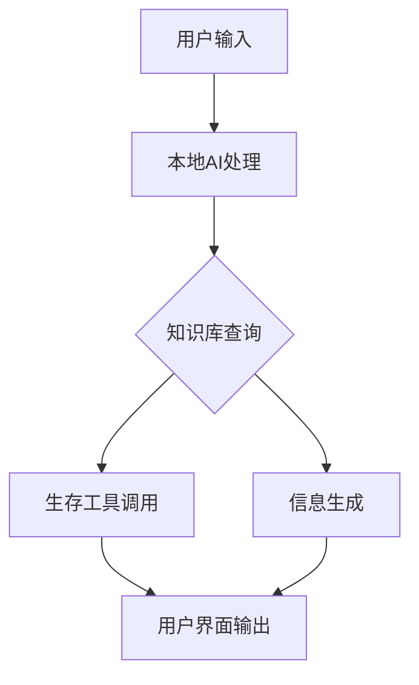
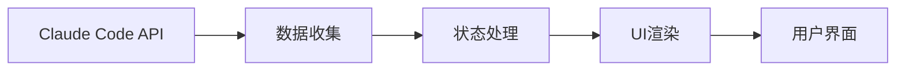
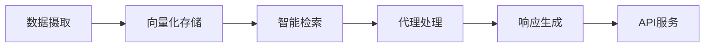

## 今日热点

AI代理自动化与内容生成工具今日大热，TradingAgents与MoneyPrinter系列项目引领多领域AI应用热潮，显示AI正从理论走向实践，赋能各行各业。

---

## 热门项目一览

| 排名 | 项目 | 语言 | 今日 | 总计 | 简介 |
|:---:|------|:----:|------:|-----:|------|
| 1 | [affaan-m/everything-claude-code](https://github.com/affaan-m/everything-claude-code) | JavaScript | +3,724 | 98,137 | The agent harness performan... |
| 2 | [Crosstalk-Solutions/project-nomad](https://github.com/Crosstalk-Solutions/project-nomad) | TypeScript | +2,300 | 10,153 | Project N.O.M.A.D, is a sel... |
| 3 | [FujiwaraChoki/MoneyPrinterV2](https://github.com/FujiwaraChoki/MoneyPrinterV2) | Python | +1,787 | 19,807 | Automate the process of mak... |
| 4 | [bytedance/deer-flow](https://github.com/bytedance/deer-flow) | Python | +1,690 | 35,401 | An open-source SuperAgent h... |
| 5 | [vxcontrol/pentagi](https://github.com/vxcontrol/pentagi) | Go | +1,069 | 12,043 | Fully autonomous AI Agents ... |
| 6 | [TauricResearch/TradingAgents](https://github.com/TauricResearch/TradingAgents) | Python | +1,051 | 37,257 | TradingAgents: Multi-Agents... |
| 7 | [jarrodwatts/claude-hud](https://github.com/jarrodwatts/claude-hud) | JavaScript | +834 | 11,205 | A Claude Code plugin that s... |
| 8 | [louis-e/arnis](https://github.com/louis-e/arnis) | Rust | +582 | 12,731 | Generate any location from ... |
| 9 | [browser-use/browser-use](https://github.com/browser-use/browser-use) | Python | +428 | 82,585 | 🌐 Make websites accessible ... |
| 10 | [systemd/systemd](https://github.com/systemd/systemd) | C | +313 | 15,996 | The systemd System and Serv... |
| 11 | [aquasecurity/trivy](https://github.com/aquasecurity/trivy) | Go | +251 | 33,662 | Find vulnerabilities, misco... |
| 12 | [jamwithai/production-agentic-rag-course](https://github.com/jamwithai/production-agentic-rag-course) | Python | +237 | 4,756 | No description |

---

## 趋势洞察

```
┌─────────────────────────────────────────────────────────────────┐
│  AI/ML 工具         ████████████████████████  12 个项目        │
│  其他               ██████                    3 个项目        │
└─────────────────────────────────────────────────────────────────┘
```

---

## 项目深度解读

### 1. affaan-m/everything-claude-code — AI编程性能优化

> **一句话总结**：为Claude Code等AI编程工具提供性能优化与全方位能力增强的系统。

#### 价值主张

| 维度 | 说明 |
|------|------|
| **解决痛点** | 解决AI编程工具在性能、记忆与技能方面的局限性 |
| **目标用户** | 使用Claude Code、Codex、Cursor等AI编程工具的开发者 |
| **核心亮点** | 性能优化 + 技能增强 + 记忆系统 + 安全保障 + 研究优先开发 |

#### 技术架构


**技术特色**：
- 基于JavaScript的AI编程工具性能优化框架
- 集成上下文记忆系统提升连贯性
- 研究优先的开发方法论实现

#### 热度分析

- 项目获近10万stars且持续快速增长，显示在AI编程领域具有显著影响力
- 高fork数与零open issues反映社区活跃度高且维护质量优秀

#### 快速上手

```bash
# 克隆项目
git clone https://github.com/affaan-m/everything-claude-code.git

# 安装依赖
npm install

# 启动项目
npm start
```

#### 注意事项

- 项目许可证未知，使用前需确认授权条款
- 依赖Claude Code等AI工具，需确保已安装相关环境
- 作为性能优化系统，可能需要较新的硬件配置以充分发挥效果


### 2. Crosstalk-Solutions/project-nomad — 离线生存AI助手

> **一句话总结**：自包含离线生存计算机，集成AI工具与知识库，支持无网络环境下的信息获取与决策辅助。

#### 价值主张

| 维度 | 说明 |
|------|------|
| **解决痛点** | 网络中断环境下的信息孤岛与生存挑战 |
| **目标用户** | 灾难准备者、户外探险者、偏远地区工作者 |
| **核心亮点** | 离线AI功能 + 全套生存工具集 + 自包含设计 |

#### 技术架构



**技术特色**：
- 全栈TypeScript实现，确保跨平台兼容性
- 本地部署AI模型，无需网络连接
- 模块化设计，支持工具与知识库扩展

#### 热度分析

- 近期Star激增2300，表明项目受到广泛关注，可能因近期更新或事件驱动
- 高Star与Fork比例，反映社区强烈参与与二次开发需求

#### 快速上手

```bash
# 克隆项目仓库
git clone https://github.com/Crosstalk-Solutions/project-nomad.git
# 安装依赖
npm install
# 构建项目
npm run build
# 运行应用
npm start
```

#### 注意事项

- 项目依赖大量本地资源，确保有足够的存储空间
- AI功能可能需要较高性能的硬件支持
- 离线环境下的数据更新需要手动处理
- 注意检查许可证信息，确保合规使用


### 3. FujiwaraChoki/MoneyPrinterV2 — 自动创收工具

> **一句话总结**：AI驱动的自动化内容生成系统，批量创建可变现的在线内容。

#### 价值主张

| 维度 | 说明 |
|------|------|
| **解决痛点** | 简化在线赚钱流程，无需专业技能即可创建盈利内容 |
| **目标用户** | 内容创作者、数字营销者、在线创业者 |
| **核心亮点** | AI自动化生成 + 多平台适配 + 收益流自动化 |

#### 技术架构


**技术特色**：
- 基于大语言模型的批量内容生成技术
- 多平台API集成与内容自动分发
- 收益数据追踪与分析系统

#### 热度分析

- 项目单日新增近1800星，增长迅猛，显示市场对自动化创工具有强烈需求
- 零开放问题可能反映项目维护方式或争议性，社区关注度极高

#### 快速上手

```bash
# 克隆项目
git clone https://github.com/FujiwaraChoki/MoneyPrinterV2.git

# 安装依赖
pip install -r requirements.txt

# 运行主程序
python main.py
```

#### 注意事项

- 自动生成的内容可能存在原创性问题，需注意版权合规
- 不同平台的内容政策可能影响自动化效果，需定期更新适配
- 项目可能涉及灰色地带的创收方法，使用前应了解相关法律法规


### 4. bytedance/deer-flow — 智能任务编排系统

> **一句话总结**：一个集成沙盒环境、记忆系统和多代理架构的SuperAgent框架，能自主完成从研究到编码的复杂任务。

#### 价值主张

| 维度 | 说明 |
|------|------|
| **解决痛点** | 解决复杂任务自动化执行问题，特别是需要研究、编码和创建的多步骤任务 |
| **目标用户** | 开发者、研究人员和需要自动化复杂工作流程的专业人士 |
| **核心亮点** | 多层次代理架构 + 沙盒环境 + 记忆系统 + 工具集成 + 任务分解能力 |

#### 技术架构


**技术特色**：
- 分层代理架构实现复杂任务智能分解
- 沙盒环境确保安全执行和资源隔离
- 记忆系统支持长期上下文保持与学习

#### 热度分析

- 项目获得超35k星，单日增长1.6k星，表明社区对其高度关注和认可
- 作为字节跳动开源的智能代理系统，在AI自动化领域具有重要生态价值

#### 快速上手

```bash
# 克隆项目
git clone https://github.com/bytedance/deer-flow.git
cd deer-flow

# 安装依赖
pip install -r requirements.txt
```

#### 注意事项

- 项目需要配置适当的API密钥和权限设置
- 沙盒环境可能需要额外的系统资源支持
- 由于项目较新，文档和示例可能还不够完善


### 5. vxcontrol/pentagi — AI渗透测试平台

> **一句话总结**：基于Go语言开发的完全自主AI代理系统，可执行复杂渗透测试任务，自动化安全评估。

#### 价值主张

| 维度 | 说明 |
|------|------|
| **解决痛点** | 自动化渗透测试需求高、专业安全人才稀缺、手动测试效率低下 |
| **目标用户** | 网络安全团队、渗透测试人员、安全研究员、企业IT部门 |
| **核心亮点** | 多智能体协作 + 完全自主执行 + 复杂任务分解 + 持续学习优化 |

#### 技术架构


**技术特色**：
- 基于Go语言开发，性能高效且并发处理能力强
- 多智能体协作架构，能够分工执行复杂渗透测试任务
- 自主决策能力，能够根据测试结果动态调整策略

#### 热度分析

- 项目Star数超过12,000且近期增长迅速(+1,069 today)，表明在安全领域受到高度关注
- Fork数1,517显示社区活跃度高，可能是安全自动化领域的新兴热门项目

#### 快速上手

```bash
# 克隆项目
git clone https://github.com/vxcontrol/pentagi.git

# 安装依赖
go mod download

# 运行系统
go run main.go
```

#### 注意事项

- 项目许可证未知，使用前需要确认开源许可类型
- 作为自动化渗透测试工具，使用时需确保获得合法授权
- 项目可能依赖第三方AI服务，需注意数据隐私和合规问题


### 6. TauricResearch/TradingAgents — 多智能体交易框架

> **一句话总结**：基于LLM的多智能体协同交易系统，实现金融市场的自动化策略执行与决策。

#### 价值主张

| 维度 | 说明 |
|------|------|
| **解决痛点** | 解决传统交易系统智能化不足、策略单一、缺乏自适应性的痛点 |
| **目标用户** | 量化交易者、金融分析师及自动化交易开发者 |
| **核心亮点** | 多智能体协作 + 大型语言模型集成 + 金融交易自动化 + 策略自适应优化 |

#### 技术架构


**技术特色**：
- 多智能体协同决策架构，提升交易系统的鲁棒性
- 大型语言模型与金融专业知识融合，增强决策质量
- 自适应学习机制，持续优化交易策略
- 模块化设计，便于扩展和定制交易策略

#### 热度分析

- 项目获37,257 stars且单日增长超1,000，显示极高关注度和快速增长趋势
- 作为金融AI交易领域前沿项目，在量化交易与AI结合领域处于领先地位

#### 快速上手

```bash
# 克隆项目
git clone https://github.com/TauricResearch/TradingAgents.git
cd TradingAgents

# 安装依赖
pip install -r requirements.txt

# 运行示例
python examples/basic_trading.py
```

#### 注意事项

- 由于项目涉及金融交易，实际应用时需考虑风险控制和资金管理
- 项目可能需要一定的金融知识和编程基础才能充分利用其功能


### 7. jarrodwatts/claude-hud — Claude 可视化助手

> **一句话总结**：为 Claude Code 提供实时可视化界面，展示 AI 助手工作状态、上下文使用和任务进度。

#### 价值主张

| 维度 | 说明 |
|------|------|
| **解决痛点** | 解决 Claude Code 状态不透明问题，提供清晰的工作流程可视化 |
| **目标用户** | Claude Code 开发者和 AI 辅助编程用户 |
| **核心亮点** | 实时状态监控 + 上下文可视化 + 进度跟踪 + 工具状态展示 |

#### 技术架构



**技术特色**：
- 基于 Claude Code API 的实时数据采集机制
- 响应式 UI 设计，确保状态信息实时更新
- 高效的状态管理和可视化渲染技术

#### 热度分析

- 项目单日增长 834 stars，表明功能新颖且实用，获得开发者高度认可
- 作为 Claude Code 生态的重要插件，有望成为开发者的必备工具

#### 快速上手

```bash
# 安装 Claude Code 插件
npm install -g @jarrodwatts/claude-hud

# 在 Claude Code 中激活
claude-hud enable
```

#### 注意事项

- 许可证信息不明确，使用前需确认开源协议
- 依赖 Claude Code 环境，需先安装 Claude Code
- 插件可能随 Claude Code API 更新而需要维护


### 8. louis-e/arnis — 现实世界Minecraft重建

> **一句话总结**：将现实世界地点以高细节重建到Minecraft中，实现虚拟与现实的完美融合。

#### 价值主张

| 维度 | 说明 |
|------|------|
| **解决痛点** | Minecraft玩家无法在游戏中精确重建现实世界地点，限制了创作和探索多样性 |
| **目标用户** | Minecraft玩家、建筑设计师、地理教育工作者、虚拟世界探索者 |
| **核心亮点** | 高精度地理数据还原 + 自动化建筑生成 + 地形细节复现 + 大规模场景支持 + 跨平台兼容性 |

#### 技术架构


**技术特色**：
- 高效的Rust实现确保大规模场景处理性能
- 智能算法自动识别并转换建筑结构
- 优化的数据结构减少内存占用

#### 热度分析

- 项目Star数超1.2万且持续增长，表明社区高度认可该工具价值
- 作为Minecraft生态中创新工具，填补了现实世界数字化重建空白

#### 快速上手

```bash
# 克隆项目
git clone https://github.com/louis-e/arnis.git
cd arnis

# 构建项目
cargo build --release

# 运行工具
./target/release/arnis <输入数据文件> <输出Minecraft世界>
```

#### 注意事项

- 项目需要大量计算资源处理大规模地理数据
- 输出文件可能非常大，需要足够的存储空间
- 需要确保输入数据的准确性和完整性以获得最佳效果


### 9. browser-use/browser-use — AI网页自动化

> **一句话总结**：让AI代理能够理解并操作网页，实现复杂在线任务的自动化执行。

#### 价值主张

| 维度 | 说明 |
|------|------|
| **解决痛点** | 传统网页自动化工具难以理解网页内容，AI无法直接与网页交互 |
| **目标用户** | AI开发者、自动化测试工程师、需要处理网页任务的自动化解决方案构建者 |
| **核心亮点** | 基于大语言模型理解网页 + 智能交互决策 + 支持复杂任务链 |

#### 技术架构


**技术特色**：
- 利用LLM理解网页结构和内容语义
- 智能元素定位，减少对精确选择器的依赖
- 支持多步任务规划和执行，实现复杂自动化流程

#### 热度分析

- 项目Star数超8万且日增400+，处于快速增长期，受到AI开发者高度关注
- 作为AI与网页交互的桥梁项目，处于AI应用落地的关键生态位置，社区活跃度高

#### 快速上手

```bash
# 安装browser-use
pip install browser-use

# 基本使用示例
browser-use "帮我登录我的GitHub账号并查看最新通知"
```

#### 注意事项

- 由于License未知，使用前需确认开源协议类型
- 项目依赖可能较重，需要确保Python环境和依赖库版本兼容
- 网页结构变化可能导致自动化脚本失效，需要定期维护
- Open Issues为0可能意味着问题管理方式特殊，遇到问题可能需要通过其他渠道反馈


### 10. systemd/systemd — Linux系统管理器

> **一句话总结**：systemd是Linux系统的核心初始化系统和服务管理器，提供高效启动、资源管理和日志功能。

#### 价值主张

| 维度 | 说明 |
|------|------|
| **解决痛点** | 替代传统init系统，解决系统启动慢、服务管理复杂的问题 |
| **目标用户** | Linux发行版开发者、系统管理员和需要高效系统管理的用户 |
| **核心亮点** | 并行启动能力 + 依赖管理 + 资源控制 + 日志集中管理 + 状态跟踪 |

#### 技术架构


**技术特色**：
- 基于事件驱动的服务管理模型
- 使用socket和D-Bus进行进程间通信
- 支持Cgroups实现资源隔离和控制

#### 热度分析

- 项目获得近16k星标且持续增长，表明在Linux生态系统中具有核心地位
- 作为大多数现代Linux发行版的默认初始化系统，社区活跃度高且生态完善

#### 快速上手

```bash
# 查看系统状态
systemctl status

# 启动并启用服务
systemctl start nginx
systemctl enable nginx

# 查看日志
journalctl -xe
```

#### 注意事项

- systemd的复杂性和全面性可能导致学习曲线陡峭
- 替换传统init系统可能带来兼容性问题
- 某些系统管理员可能偏好更简单的init系统如OpenRC或SysV init


### 11. aquasecurity/trivy — 多平台安全扫描器

> **一句话总结**：Trivy是一款全面的安全扫描工具，可检测容器、Kubernetes、云环境等多种平台中的漏洞、配置错误和敏感信息。

#### 价值主张

| 维度 | 说明 |
|------|------|
| **解决痛点** | 统一扫描多种环境和组件的安全漏洞，简化安全检测流程 |
| **目标用户** | DevOps工程师、安全团队、云原生应用开发者 |
| **核心亮点** | 多平台支持 + 漏洞检测 + 配置检查 + 秘密扫描 + SBOM生成 |

#### 技术架构


**技术特色**：
- 使用轻量级扫描引擎，无需预先构建目标镜像
- 整合多个漏洞数据库(NVD、GitHub Advisory等)提供全面检测
- 支持离线扫描模式，适合网络受限环境

#### 热度分析

- 项目Star数超过3.3万，单日增长250+，表明在安全工具领域备受关注
- 社区活跃度高，是云原生安全领域的重要工具，被广泛集成到CI/CD流程中

#### 快速上手

```bash
# 安装Trivy
wget https://github.com/aquasecurity/trivy/releases/latest/download/trivy_*.deb
sudo dpkg -i trivy_*.deb

# 扫描容器镜像
trivy image alpine:latest

# 扫描文件系统中的漏洞
trivy fs /path/to/your/code
```

#### 注意事项

- 扫描大型容器镜像或代码库时可能需要较长时间和较高内存
- 某些漏洞数据库更新可能存在延迟，建议定期更新Trivy版本
- 对于企业级使用，需要考虑漏洞数据库的本地化部署和数据同步策略


### 12. jamwithai/production-agentic-rag-course — 生产级智能RAG

> **一句话总结**：实战导向的生产环境智能检索增强生成系统完整实现教程。

#### 价值主张

| 维度 | 说明 |
|------|------|
| **解决痛点** | 理论与生产实践脱节，缺乏可落地的智能RAG系统实现方案 |
| **目标用户** | AI工程师、数据科学家、希望构建生产级RAG应用的开发者 |
| **核心亮点** | 完整项目实现 + 生产环境考量 + 智能代理集成 + 实战案例 + 最佳实践 |

#### 技术架构



**技术特色**：
- 结合最新RAG技术与智能代理范式
- 提供端到端生产环境部署方案
- 包含性能优化和监控机制

#### 热度分析

- 项目获4756星且单日增长237，表明在AI开发社区受到高度关注
- 高fork数量(1185)说明开发者积极参与并基于此项目进行二次开发

#### 快速上手

```bash
git clone https://github.com/jamwithai/production-agentic-rag-course.git
cd production-agentic-rag-course
pip install -r requirements.txt
python setup.py install
```

#### 注意事项

- 本项目需要一定的AI和机器学习基础知识
- 生产环境部署前需根据实际需求进行配置调整
- 可能需要API密钥来使用某些外部服务


### 13. hsliuping/TradingAgents-CN — 中文智能交易框架

> **一句话总结**：基于多智能体大语言模型的中文金融交易框架，实现自动化交易决策与分析。

#### 价值主张

| 维度 | 说明 |
|------|------|
| **解决痛点** | 解决中文金融市场智能交易决策与自动化执行难题 |
| **目标用户** | 中文金融市场交易者、量化投资研究人员 |
| **核心亮点** | 多智能体协作+LLM决策+中文金融市场适配+自动化交易执行 |

#### 技术架构


**技术特色**：
- 基于多智能体协作的复杂决策系统
- 针对中文金融语言优化的LLM应用
- 自动化交易策略生成与执行机制

#### 热度分析

- 高关注度项目，近期增长迅速，19k+ stars显示市场高度认可
- 中文金融AI交易领域领先项目，社区活跃度高，生态逐步完善

#### 快速上手

```bash
# 克隆项目
git clone https://github.com/hsliuping/TradingAgents-CN.git
# 安装依赖
pip install -r requirements.txt
# 运行示例
python examples/basic_trading.py
```

#### 注意事项

- 需要配置有效的金融市场数据源
- 建议在模拟环境中进行充分测试后再应用于实际交易
- 注意API调用限制和成本控制


### 14. HKUDS/LightRAG — 轻量级RAG系统

> **一句话总结**：LightRAG是一个简化架构、高效检索的轻量级检索增强生成系统，降低RAG部署门槛。

#### 价值主张

| 维度 | 说明 |
|------|------|
| **解决痛点** | 传统RAG系统架构复杂、资源消耗高、部署困难 |
| **目标用户** | 需要快速集成RAG能力的研究人员与企业开发者 |
| **核心亮点** | 简化架构 + 高效检索 + 低资源消耗 + 快速部署 |

#### 技术架构


**技术特色**：
- 精简RAG流程，减少不必要的计算开销
- 优化的检索算法，提高相关文档获取准确率
- 模块化设计，支持灵活扩展与定制

#### 热度分析

- 项目获3万+星标且持续增长，反映RAG领域对轻量化解决方案的迫切需求
- 零开放问题表明项目维护活跃，社区问题处理高效，生态健康度良好

#### 快速上手

```bash
# 安装LightRAG
pip install lightrag

# 基本使用示例
from lightrag import LightRAG
rag = LightRAG()
rag.insert("文档内容")
response = rag.query("用户问题")
print(response)
```

#### 注意事项

- 项目为EMNLP 2025会议投稿，API可能存在变动
- License信息不明确，使用前需确认开源协议
- 作为研究项目，生产环境部署前建议进行充分测试


### 15. harry0703/MoneyPrinterTurbo — AI视频生成器

> **一句话总结**：利用AI大模型一键生成高清短视频，大幅降低视频创作门槛

#### 价值主张

| 维度 | 说明 |
|------|------|
| **解决痛点** | 传统视频制作需专业技能和时间，AI生成让普通人快速创作 |
| **目标用户** | 内容创作者、自媒体运营、营销人员及视频爱好者 |
| **核心亮点** | AI驱动 + 一键生成 + 高清输出 + 多场景适配 + 低门槛使用 |

#### 技术架构


**技术特色**：
- 基于大语言模型的视频内容智能生成
- 高清视频渲染与优化技术
- 简化的用户交互流程设计

#### 热度分析

- 项目获5万+星标，日增近200星，显示极强的社区认可度和增长势头
- Fork数超7000，表明项目有较高的二次开发价值和社区活跃度

#### 快速上手

```bash
# 克隆项目
git clone https://github.com/harry0703/MoneyPrinterTurbo.git

# 安装依赖
pip install -r requirements.txt
```

#### 注意事项

- 项目许可证未知，使用时需注意授权问题
- AI生成内容可能涉及版权问题，需谨慎使用
- 高清视频生成可能需要较高的计算资源


## 今日推荐

| 主题 | 推荐项目 | 亮点 |
|------|----------|------|
| 今日最热 | [affaan-m/everything-claude-code](https://github.com/affaan-m/everything-claude-code) | The agent harness... |
| 值得关注 | [Crosstalk-Solutions/project-nomad](https://github.com/Crosstalk-Solutions/project-nomad) | Project N.O.M.A.D... |
| 快速上手 | [FujiwaraChoki/MoneyPrinterV2](https://github.com/FujiwaraChoki/MoneyPrinterV2) | Automate the proc... |
| 长期潜力 | [bytedance/deer-flow](https://github.com/bytedance/deer-flow) | An open-source Su... |

---

<div align="center">

*Generated on 2026-03-23 | Powered by GitHub Trending Reporter*

</div>