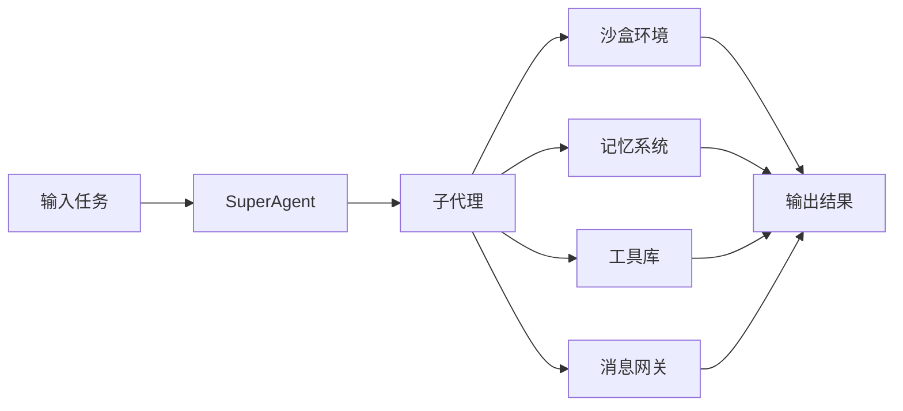
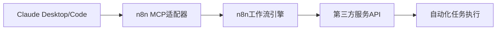
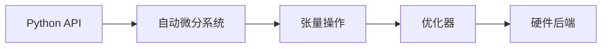

## 今日热点

AI代理系统和Claude生态成为今日GitHub热榜的核心，多领域应用如金融交易、自动化工具和模型优化展现AI技术落地加速趋势。

---

## 热门项目一览

| 排名 | 项目 | 语言 | 今日 | 总计 | 简介 |
|:---:|------|:----:|------:|-----:|------|
| 1 | [affaan-m/everything-claude-code](https://github.com/affaan-m/everything-claude-code) | JavaScript | +4,458 | 101,997 | The agent harness performan... |
| 2 | [Crosstalk-Solutions/project-nomad](https://github.com/Crosstalk-Solutions/project-nomad) | TypeScript | +4,138 | 13,421 | Project N.O.M.A.D, is a sel... |
| 3 | [bytedance/deer-flow](https://github.com/bytedance/deer-flow) | Python | +3,546 | 39,443 | An open-source SuperAgent h... |
| 4 | [FujiwaraChoki/MoneyPrinterV2](https://github.com/FujiwaraChoki/MoneyPrinterV2) | Python | +2,880 | 22,959 | Automate the process of mak... |
| 5 | [TauricResearch/TradingAgents](https://github.com/TauricResearch/TradingAgents) | Python | +2,530 | 39,340 | TradingAgents: Multi-Agents... |
| 6 | [vxcontrol/pentagi](https://github.com/vxcontrol/pentagi) | Go | +1,309 | 13,011 | Fully autonomous AI Agents ... |
| 7 | [browser-use/browser-use](https://github.com/browser-use/browser-use) | Python | +1,157 | 83,650 | 🌐 Make websites accessible ... |
| 8 | [NousResearch/hermes-agent](https://github.com/NousResearch/hermes-agent) | Python | +919 | 11,580 | The agent that grows with you |
| 9 | [hsliuping/TradingAgents-CN](https://github.com/hsliuping/TradingAgents-CN) | Python | +676 | 20,320 | 基于多智能体LLM的中文金融交易框架 - Tradin... |
| 10 | [jingyaogong/minimind](https://github.com/jingyaogong/minimind) | Python | +487 | 42,576 | 🚀🚀 「大模型」2小时完全从0训练26M的小参数GPT... |
| 11 | [hesreallyhim/awesome-claude-code](https://github.com/hesreallyhim/awesome-claude-code) | Python | +429 | 30,977 | A curated list of awesome s... |
| 12 | [kepano/obsidian-skills](https://github.com/kepano/obsidian-skills) | Unknown | +354 | 16,361 | Agent skills for Obsidian. ... |

---

## 趋势洞察

```
┌─────────────────────────────────────────────────────────────────┐
│  AI/ML 工具         ████████████████████████  13 个项目        │
│  其他               ███                       2 个项目        │
└─────────────────────────────────────────────────────────────────┘
```

---

## 项目深度解读

### 1. affaan-m/everything-claude-code — AI编程助手增强

> **一句话总结**：为Claude Code等编程工具提供性能优化的智能系统，强化技能、记忆和安全特性。

#### 价值主张

| 维度 | 说明 |
|------|------|
| **解决痛点** | 解决AI编程助手性能瓶颈和功能局限性问题 |
| **目标用户** | 使用Claude Code、Codex、Cursor等AI编程工具的开发者 |
| **核心亮点** | 性能优化 + 技能增强 + 记忆系统 + 安全保障 + 研究优先开发 |

#### 技术架构


**技术特色**：
- 集成多层次AI编程助手能力架构
- 实现记忆系统增强上下文理解
- 注重安全性和性能优化平衡

#### 热度分析

- 项目获得超10万Star，单日增长近4500，表明开发者社区对AI编程辅助工具有极高需求
- 作为AI编程增强工具，处于技术前沿，吸引了大量关注和贡献

#### 快速上手

```bash
# 克隆项目
git clone https://github.com/affaan-m/everything-claude-code.git

# 安装依赖
npm install
```

#### 注意事项

- 项目许可证未知，使用前需确认授权条款
- 作为实验性工具，可能存在稳定性问题
- 需要配合Claude Code等工具使用，单独使用可能效果有限


### 2. Crosstalk-Solutions/project-nomad — [离线生存AI]

> **一句话总结**：Project N.O.M.A.D是一个自包含的离线生存计算机，集成关键工具、知识和AI，赋能用户在任何环境生存。

#### 价值主张

| 维度 | 说明 |
|------|------|
| **解决痛点** | 解决无网络环境下的信息获取与生存支持问题 |
| **目标用户** | 野外工作者、探险家、应急人员、生存主义爱好者 |
| **核心亮点** | 离线可用 + AI赋能 + 自包含设计 + 生存工具集 + 关键知识库 |

#### 技术架构


**技术特色**：
- 基于TypeScript构建，保证类型安全
- 离线AI引擎，无需网络连接即可运行
- 自包含设计，所有组件打包在单一系统中
- 模块化架构，便于功能扩展
- 资源优化，适应离线环境使用

#### 热度分析

- 项目Star数达13,421，单日增长4,138，表明近期热度急剧上升，可能受到生存主义或AI领域关注
- Fork数1,264，社区活跃度高，表明开发者参与度高，项目具有良好的可扩展性
- Open Issues为0，可能表明项目已成熟或问题处理机制高效

#### 快速上手

```bash
# 克隆仓库
git clone https://github.com/Crosstalk-Solutions/project-nomad.git

# 安装依赖
npm install

# 构建项目
npm run build
```

#### 注意事项

- 项目可能需要较大的存储空间，因为包含离线AI模型和知识库
- 确保有足够的计算资源以支持AI功能的运行
- 注意定期更新知识库以获取最新信息
- 在极端环境下使用时，建议有备用电源方案


### 3. bytedance/deer-flow — 智能任务代理

> **一句话总结**：开源SuperAgent系统，利用多种组件处理从分钟到小时级别的复杂任务。

#### 价值主张

| 维度 | 说明 |
|------|------|
| **解决痛点** | 自动化处理复杂多步骤任务，减少人工干预和错误 |
| **目标用户** | 开发者、研究人员和需要自动化复杂工作流程的专业人士 |
| **核心亮点** | 沙盒隔离 + 记忆系统 + 工具集成 + 子代理协作 + 消息网关 |

#### 技术架构



**技术特色**：
- 多组件协同的代理架构设计
- 沙盒环境确保任务安全隔离执行
- 记忆系统支持长期任务状态保持与上下文理解

#### 热度分析

- 近期Star激增(+3,546/日)，表明项目获得广泛关注或重大更新
- Fork/Star比例约为1:8.5，社区贡献活跃，处于AI代理工具生态前沿

#### 快速上手

```bash
# 克隆项目
git clone https://github.com/bytedance/deer-flow.git
cd deer-flow
pip install -r requirements.txt
```

#### 注意事项

- 项目许可证未知，商业使用前需确认授权条款
- 可能需要较高的计算资源，特别是处理长时间任务时
- 作为AI代理系统，需要一定的领域知识进行有效配置


### 4. FujiwaraChoki/MoneyPrinterV2 — 自动化赚钱工具

> **一句话总结**：一键自动化多种在线赚钱方式，实现被动收入流生成。

#### 价值主张

| 维度 | 说明 |
|------|------|
| **解决痛点** | 简化在线赚钱流程，实现自动化被动收入生成 |
| **目标用户** | 寻求被动收入、希望自动化网络赚钱流程的互联网用户 |
| **核心亮点** | 多平台自动化支持 + 低技术门槛使用 + 多种赚钱模式整合 |

#### 技术架构


**技术特色**：
- 模块化设计支持多种赚钱平台
- 智能任务调度与执行系统
- 数据驱动的收益优化算法

#### 热度分析

- 项目呈爆发式增长，单日新增近3000星，显示市场需求强烈
- 社区活跃度高，但缺乏issue讨论，可能用户更倾向于直接使用而非反馈

#### 快速上手

```bash
# 克隆项目
git clone https://github.com/FujiwaraChoki/MoneyPrinterV2.git

# 安装依赖
pip install -r requirements.txt
```

#### 注意事项

- 请注意遵守各平台的使用条款，避免账号被封禁
- 自动化工具可能存在法律风险，使用前请了解相关法规
- 项目来源不明确，请谨慎评估安全风险


### 5. TauricResearch/TradingAgents — 多智能体交易框架

> **一句话总结**：基于多智能体与大语言模型的金融交易框架，实现自动化市场分析与交易决策。

#### 价值主张

| 维度 | 说明 |
|------|------|
| **解决痛点** | 传统交易系统缺乏适应性，无法应对复杂多变的市场环境 |
| **目标用户** | 量化交易者、金融分析师、算法交易开发者 |
| **核心亮点** | 多智能体协作 + 大语言模型驱动 + 自适应市场分析 |

#### 技术架构


**技术特色**：
- 采用分布式智能体架构，实现市场分析与决策的并行处理
- 集成先进的大语言模型，增强对市场新闻和情绪的理解能力
- 自适应学习机制，持续优化交易策略以适应市场变化

#### 热度分析

- 项目Star数近4万，今日增长2500+，显示近期关注度急剧上升
- 作为金融AI领域的前沿项目，正在吸引大量量化交易与AI开发者的关注

#### 快速上手

```bash
# 克隆项目
git clone https://github.com/TauricResearch/TradingAgents.git
cd TradingAgents

# 安装依赖
pip install -r requirements.txt

# 初始化配置
python setup.py config
```

#### 注意事项

- 项目依赖大量金融数据和API服务，使用前需确保相关数据源的访问权限
- 金融市场风险极高，此框架仅作为研究工具，实盘交易需谨慎评估
- 大语言模型的分析结果仅供参考，不应作为唯一的交易决策依据


### 6. vxcontrol/pentagi — AI渗透测试平台

> **一句话总结**：自主AI代理系统，自动化执行复杂渗透测试任务，提升安全评估效率

#### 价值主张

| 维度 | 说明 |
|------|------|
| **解决痛点** | 自动化专业知识要求高的渗透测试，降低技术门槛与时间成本 |
| **目标用户** | 网络安全专家、渗透测试人员、红队成员 |
| **核心亮点** | 完全自主AI代理 + 多智能体协作 + 任务自动分解 + 渗透测试流程自动化 |

#### 技术架构


**技术特色**：
- 基于Go语言构建的高性能并发代理系统
- 多智能体协同决策与任务分配机制
- 自主学习与渗透策略优化能力

#### 热度分析
- 项目增长迅猛，单日新增1300+星，反映安全领域对AI自动化工具的强烈需求
- 零开放问题表明项目成熟度高，社区通过其他渠道高效解决问题

#### 快速上手

```bash
# 克隆仓库
git clone https://github.com/vxcontrol/pentagi.git
# 构建项目
cd pentagi && go build -o pentagi
# 执行渗透测试
./pentagi --target <目标地址> --output results.json
```

#### 注意事项
- 此工具仅适用于授权测试环境，非法使用可能导致法律风险
- AI生成的渗透结果需专业人员验证，不应作为唯一决策依据
- 使用前需确保目标系统获得明确授权


### 7. browser-use/browser-use — AI网页自动化

> **一句话总结**：browser-use是一个基于AI的网页自动化框架，使AI代理能够理解并操作网页内容，实现复杂任务的自动化执行。

#### 价值主张

| 维度 | 说明 |
|------|------|
| **解决痛点** | AI代理无法直接与网页交互，难以自动化完成在线任务 |
| **目标用户** | 需要自动化网页任务的AI开发者、研究人员和自动化测试工程师 |
| **核心亮点** | AI驱动的网页理解 + 智能元素定位 + 跨浏览器兼容性 + 复杂任务编排 |

#### 技术架构


**技术特色**：
- 基于大语言模型的网页内容理解能力
- 智能元素定位，无需手动编写选择器
- 支持复杂决策流程和异常处理机制

#### 热度分析

- 项目Star数达83,650，近期日增1,157，表明市场需求旺盛且增长迅速
- 社区活跃度高，Fork数近万，显示开发者参与度和二次开发意愿强

#### 快速上手

```bash
pip install browser-use
python your_script.py --task "登录网站并完成购买流程"
```

#### 注意事项

- 需要配合OpenAI或其他大语言模型API使用，会产生额外费用
- 处理动态网页元素可能需要额外配置和等待时间
- 需要遵守目标网站的使用条款，避免违反robots.txt


### 8. NousResearch/hermes-agent — 自适应智能代理

> **一句话总结**：可自主学习成长的多功能AI代理框架，能适应不同任务需求并持续进化

#### 价值主张

| 维度 | 说明 |
|------|------|
| **解决痛点** | 解决静态AI代理无法适应多变环境和任务的问题 |
| **目标用户** | AI应用开发者和研究机构 |
| **核心亮点** | 自主学习能力 + 模块化架构 + 持续进化机制 |

#### 技术架构


**技术特色**：
- 强化学习机制实现持续进化
- 多模态输入处理能力
- 分布式任务处理架构

#### 热度分析

- 项目近期热度迅速上升，单日增长近千星，表明社区高度认可
- 作为开源AI代理框架，处于技术前沿，吸引了大量AI领域开发者

#### 快速上手

```bash
git clone https://github.com/NousResearch/hermes-agent.git
cd hermes-agent
pip install -r requirements.txt
python hermes --help
```

#### 注意事项

- 项目可能需要大量训练数据和计算资源
- 自主学习可能导致不可预测的行为，需要谨慎监控
- 部署前建议充分测试特定场景下的行为表现


### 9. hsliuping/TradingAgents-CN — 中文交易智能体

> **一句话总结**：基于多智能体大语言模型的中文金融交易智能系统，支持自动化策略生成与执行。

#### 价值主张

| 维度 | 说明 |
|------|------|
| **解决痛点** | 中文金融市场缺乏基于多智能体LLM的自动化交易框架，策略开发效率低下 |
| **目标用户** | 中文金融市场交易者、量化分析师、金融科技开发者 |
| **核心亮点** | 多智能体协作 + 中文金融知识增强 + 策略自动生成 + 实时市场分析 + 回测支持 |

#### 技术架构


**技术特色**：
- 基于大语言模型的多智能体协同架构
- 中文金融领域知识增强与优化
- 自动化交易策略生成与回测系统

#### 热度分析

- 项目Star数突破2万，单日增长600+，在量化交易领域热度快速上升
- 作为TradingAgents的中文版，填补了中文金融市场的空白，形成独特生态位

#### 快速上手

```bash
# 克隆项目
git clone https://github.com/hsliuping/TradingAgents-CN.git

# 安装依赖
pip install -r requirements.txt

# 运行示例
python examples/basic_trading.py
```

#### 注意事项

- 需要配置中文金融市场数据源与API密钥
- 使用前需了解LLM API调用成本与限制
- 实盘交易前需充分回测验证策略有效性
- 建议先在模拟环境测试，控制交易风险


### 10. jingyaogong/minimind — 轻量级GPT训练

> **一句话总结**：2小时从零训练2600万参数GPT的轻量级实践教程，降低大模型入门门槛。

#### 价值主张

| 维度 | 说明 |
|------|------|
| **解决痛点** | 大模型训练资源门槛高，普通用户难以实践 |
| **目标用户** | AI研究者、学生和爱好者，希望理解大模型训练原理 |
| **核心亮点** | 极简训练流程 + 低资源需求 + 完整教程 + 实用代码示例 |

#### 技术架构


**技术特色**：
- 高效的分布式训练策略优化训练时间
- 精简的数据预处理流水线降低资源需求
- 轻量级模型架构设计平衡性能与资源

#### 热度分析

- 项目获得4万+星标，日增长近500，表明大模型训练实践需求旺盛
- 零开放问题，社区高度活跃，项目维护良好

#### 快速上手

```bash
# 克隆项目
git clone https://github.com/jingyaogong/minimind.git

# 安装依赖并开始训练
cd minimind
pip install -r requirements.txt
python train.py --config config/small_gpt.json
```

#### 注意事项

- 项目需要一定的GPU资源，建议使用至少4GB显存的显卡
- 训练过程可能需要根据实际硬件环境调整超参数
- 需要基本的深度学习和Python编程知识


### 11. hesreallyhim/awesome-claude-code — Claude资源集合

> **一句话总结**：精选Claude Code相关技能、钩子、命令和应用，提升AI编程助手使用体验。

#### 价值主张

| 维度 | 说明 |
|------|------|
| **解决痛点** | 解决Claude Code用户缺乏统一资源获取渠道，难以发现增强功能的问题 |
| **目标用户** | Claude Code开发者、AI编程助手爱好者、效率提升追求者 |
| **核心亮点** | 精选资源分类清晰 + 持续更新维护 + 社区贡献驱动 + 覆盖面广 |

#### 技术架构

**技术特色**：
- 基于Markdown的简单结构，便于维护和贡献
- 清晰的分类系统，便于资源查找和使用
- 社区驱动的更新机制，保持内容新鲜和准确

#### 热度分析

- 项目Star数突破3万，日增约429个，表明Claude Code生态正在快速发展
- 作为Claude Code生态的核心资源库，已成为开发者的必看参考点

#### 快速上手

```bash
# 克隆项目查看完整内容
git clone https://github.com/hesreallyhim/awesome-claude-code.git
cd awesome-claude-code
cat README.md
```

#### 注意事项

- 项目本身只提供资源链接，实际使用需要访问对应资源项目
- 部分资源可能需要特定的API密钥或配置才能正常使用
- 由于Claude Code仍在快速发展，部分资源可能已过时，使用时需注意时效性


### 12. kepano/obsidian-skills — AI助手扩展

> **一句话总结**：为Obsidian开发的AI代理技能插件，使AI能够直接操作Markdown、数据库、画布和命令行。

#### 价值主张

| 维度 | 说明 |
|------|------|
| **解决痛点** | 让AI代理直接与本地知识库交互，扩展AI在个人知识管理中的应用场景 |
| **目标用户** | 使用Obsidian的知识工作者、研究人员和开发者 |
| **核心亮点** | AI代理直接操作Obsidian + 支持Markdown处理 + 数据库集成 + JSON画布交互 + CLI工具支持 |

#### 技术架构


**技术特色**：
- 基于Obsidian插件架构实现AI代理集成
- 提供多种数据格式支持和转换能力
- 通过CLI扩展功能边界和自动化能力

#### 热度分析

- 项目获得16k+星并持续增长，显示知识管理AI集成需求强劲
- 无开放问题表明项目成熟度高，社区反馈主要通过其他渠道

#### 快速上手

```bash
# 在Obsidian社区插件中搜索"Skills"并安装
# 或通过BRAT插件安装自定义插件
```

#### 注意事项

- 需要配合支持插件功能的Obsidian使用
- 可能需要配置API密钥和权限设置
- 使用前应了解Obsidian的数据存储结构


### 13. czlonkowski/n8n-mcp — [工作流智能桥接]

> **一句话总结**：为Claude系列工具提供MCP协议支持，实现n8n工作流的智能构建与执行。

#### 价值主张

| 维度 | 说明 |
|------|------|
| **解决痛点** | 打破AI助手与专业工作流工具之间的集成壁垒 |
| **目标用户** | 使用Claude工具链并需要自动化工作流的开发者 |
| **核心亮点** | MCP协议支持 + 无缝工作流构建 + 多环境兼容性 |

#### 技术架构



**技术特色**：
- 基于TypeScript开发，提供类型安全与高性能
- 实现MCP协议标准，确保与Claude生态的深度集成
- 支持多Claude环境，提供一致的自动化体验

#### 热度分析

- 项目获得16K+星标且持续增长，显示社区对AI与工作流集成的高度关注
- 零开放问题表明项目维护良好，技术方案成熟度高

#### 快速上手

```bash
# 安装n8n-mcp
npm install -g @czlonkowski/n8n-mcp

# 配置Claude Desktop
echo '{"mcpServers": {"n8n": {"command": "n8n-mcp"}}}' > claude_desktop_config.json
```

#### 注意事项
- 需要预先安装n8n工作流引擎
- MCP协议可能随Claude工具更新而需要适配
- 第三方服务API调用需遵循相应的使用条款和限制


### 14. iptv-org/iptv — 全球IPTV频道库

> **一句话总结**：全球最大公开IPTV频道集合，支持多格式播放与实时更新。

#### 价值主张

| 维度 | 说明 |
|------|------|
| **解决痛点** | 解决用户寻找稳定、合法IPTV频道资源的困难，提供集中化、标准化的频道列表 |
| **目标用户** | 全球IPTV爱好者、媒体流媒体服务提供商、电视应用开发者 |
| **核心亮点** | 全球频道覆盖范围广 + 多格式支持 + 社区驱动的维护 + 频道质量标记 + 开源免费 |

#### 技术架构


**技术特色**：
- 使用TypeScript确保数据结构类型安全
- 采用社区协作模式进行频道维护
- 支持多种播放列表格式兼容

#### 热度分析

- 项目Star数超11万且持续增长，表明IPTV资源需求旺盛
- 社区活跃度高，通过集体贡献维护频道质量与更新

#### 快速上手

```bash
# 克隆项目仓库
git clone https://github.com/iptv-org/iptv.git

# 使用M3U播放列表
vlc playlists/playlist.m3u
```

#### 注意事项

- 频道链接可能受地域限制，部分内容可能需要VPN访问
- 使用前请确认频道来源合法性，遵守当地法律法规
- 频道稳定性可能随时间变化，需要定期更新播放列表


### 15. tinygrad/tinygrad — 轻量深度学习框架

> **一句话总结**：极简深度学习框架，提供PyTorch兼容API但代码量极少，适合学习和研究。

#### 价值主张

| 维度 | 说明 |
|------|------|
| **解决痛点** | 提供零依赖深度学习框架，降低学习门槛，便于理解底层实现 |
| **目标用户** | 深度学习初学者、教育工作者、需要理解框架原理的研究者 |
| **核心亮点** | 纯Python实现 + 极简API设计 + 支持多硬件加速 |

#### 技术架构



**技术特色**：
- 纯Python实现，无外部依赖
- 支持多种硬件后端(CPU, CUDA, Metal等)
- 完整的自动微分功能
- 与PyTorch API高度兼容

#### 热度分析

- Star数超3万且持续增长，表明项目受广泛关注
- Fork数近4千，社区活跃，有较多二次开发活动

#### 快速上手

```bash
# 安装
pip install tinygrad

# 基本使用
from tinygrad import Tensor
x = Tensor.eye(3)
y = x * x
print(y.sum().numpy())
```

#### 注意事项

- 项目定位是教育和学习，不适合生产环境大规模部署
- 性能可能不如PyTorch等成熟框架
- 文档相对简略，需要一定的深度学习基础才能充分利用


## 今日推荐

| 主题 | 推荐项目 | 亮点 |
|------|----------|------|
| 今日最热 | [affaan-m/everything-claude-code](https://github.com/affaan-m/everything-claude-code) | The agent harness... |
| 值得关注 | [Crosstalk-Solutions/project-nomad](https://github.com/Crosstalk-Solutions/project-nomad) | Project N.O.M.A.D... |
| 快速上手 | [bytedance/deer-flow](https://github.com/bytedance/deer-flow) | An open-source Su... |
| 长期潜力 | [FujiwaraChoki/MoneyPrinterV2](https://github.com/FujiwaraChoki/MoneyPrinterV2) | Automate the proc... |

---

<div align="center">

*Generated on 2026-03-24 | Powered by GitHub Trending Reporter*

</div>