## 今日热点

AI代理系统与自动化内容生成工具今日占据热榜，多智能体框架和金融交易应用引领技术前沿，显示AI正从通用工具向专业化、自动化方向深度发展。

---

## 热门项目一览

| 排名 | 项目 | 语言 | 今日 | 总计 | 简介 |
|:---:|------|:----:|------:|-----:|------|
| 1 | [bytedance/deer-flow](https://github.com/bytedance/deer-flow) | Python | +4,346 | 43,333 | An open-source SuperAgent h... |
| 2 | [FujiwaraChoki/MoneyPrinterV2](https://github.com/FujiwaraChoki/MoneyPrinterV2) | Python | +3,006 | 24,825 | Automate the process of mak... |
| 3 | [Crosstalk-Solutions/project-nomad](https://github.com/Crosstalk-Solutions/project-nomad) | TypeScript | +2,513 | 15,354 | Project N.O.M.A.D, is a sel... |
| 4 | [TauricResearch/TradingAgents](https://github.com/TauricResearch/TradingAgents) | Python | +1,760 | 40,876 | TradingAgents: Multi-Agents... |
| 5 | [pascalorg/editor](https://github.com/pascalorg/editor) | TypeScript | +1,449 | 5,257 | No description |
| 6 | [ruvnet/ruflo](https://github.com/ruvnet/ruflo) | TypeScript | +1,397 | 25,114 | 🌊 The leading agent orchest... |
| 7 | [NousResearch/hermes-agent](https://github.com/NousResearch/hermes-agent) | Python | +1,278 | 12,553 | The agent that grows with you |
| 8 | [hesreallyhim/awesome-claude-code](https://github.com/hesreallyhim/awesome-claude-code) | Python | +995 | 31,863 | A curated list of awesome s... |
| 9 | [ruvnet/RuView](https://github.com/ruvnet/RuView) | Rust | +861 | 41,310 | π RuView: WiFi DensePose tu... |
| 10 | [harry0703/MoneyPrinterTurbo](https://github.com/harry0703/MoneyPrinterTurbo) | Python | +728 | 52,629 | 利用AI大模型，一键生成高清短视频 Generate ... |
| 11 | [hsliuping/TradingAgents-CN](https://github.com/hsliuping/TradingAgents-CN) | Python | +557 | 20,897 | 基于多智能体LLM的中文金融交易框架 - Tradin... |
| 12 | [supermemoryai/supermemory](https://github.com/supermemoryai/supermemory) | TypeScript | +344 | 18,564 | Memory engine and app that ... |

---

## 趋势洞察

```
┌─────────────────────────────────────────────────────────────────┐
│  AI/ML 工具         ████████████████████████  11 个项目        │
│  其他               ████                      2 个项目        │
│  多媒体应用            ██                        1 个项目        │
└─────────────────────────────────────────────────────────────────┘
```

---

## 项目深度解读

### 1. bytedance/deer-flow — 智能代理框架

> **一句话总结**：字节跳动开源的SuperAgent框架，通过多组件协同实现复杂任务的自动化处理与研究。

#### 价值主张

| 维度 | 说明 |
|------|------|
| **解决痛点** | 解决复杂任务需要人工干预的问题，实现端到端自动化任务处理 |
| **目标用户** | 开发者、研究人员和企业团队，需要自动化复杂工作流程的用户 |
| **核心亮点** | 多代理协同 + 任务记忆能力 + 沙箱环境隔离 + 工具集成能力 + 消息网关统一调度 |

#### 技术架构

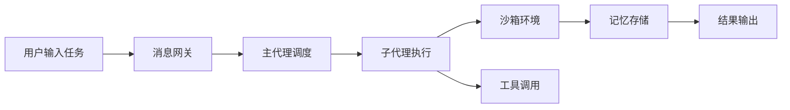

**技术特色**：
- 分布式代理架构，支持任务分解与并行处理
- 沙箱环境隔离确保执行安全性和可重复性
- 记忆系统支持长期上下文保持和经验积累

#### 热度分析

- 项目Star数增长迅速，单日增长超过4,300，表明社区对其功能高度认可
- 作为字节跳动开源的AI代理框架，在AI自动化领域具有领先地位和生态影响力

#### 快速上手

```bash
git clone https://github.com/bytedance/deer-flow.git
cd deer-flow
pip install -r requirements.txt
python deer-flow --help
```

#### 注意事项

- 项目可能需要较强大的计算资源支持，尤其是运行复杂任务时
- 由于是字节跳动开发的开源项目，可能需要关注其商业化使用限制
- 项目文档可能不够完善，需要查看源码了解具体实现细节


### 2. FujiwaraChoki/MoneyPrinterV2 — [自动化赚钱工具]

> **一句话总结**：声称自动化在线赚钱的Python工具，但需谨慎评估其合法性。

#### 价值主张

| 维度 | 说明 |
|------|------|
| **解决痛点** | 声称简化网络赚钱流程，降低技术门槛 |
| **目标用户** | 希望通过网络快速获利的个人用户 |
| **核心亮点** + 自动化操作 + 流程简化 + 声称低风险高回报 |

#### 技术架构

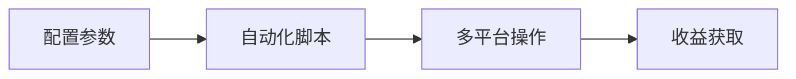

**技术特色**：
- 基于Python的模块化设计
- 可能集成多种在线平台API
- 支持自动化任务调度与执行

#### 热度分析

- 项目近期增长异常，单日Star增加超过3000，可能存在营销推动
- 高Fork数显示社区关注度高，但需警惕可能的传销或推广模式

#### 快速上手

```bash
# 克隆项目
git clone https://github.com/FujiwaraChoki/MoneyPrinterV2.git

# 安装依赖
pip install -r requirements.txt
```

#### 注意事项

- 此类项目可能涉及金融诈骗或违反平台政策，使用前请务必核实合法性
- "快速赚钱"承诺往往是诈骗的常见特征，请保持警惕
- 切勿投入资金或提供敏感个人信息，保护自身财产安全
- 建议咨询金融或法律专业人士评估项目合规性


### 3. Crosstalk-Solutions/project-nomad — 离线生存工具集

> **一句话总结**：集成AI助手、工具集和知识库的离线生存计算机，为无网络环境提供全方位支持。

#### 价值主张

| 维度 | 说明 |
|------|------|
| **解决痛点** | 解决无网络环境下的信息获取、工具使用和生存支持难题 |
| **目标用户** | 户外探险者、应急响应人员、灾难准备者、军事人员 |
| **核心亮点** | 完全离线运行 + AI助手支持 + 多种生存工具集成 + 知识库资源 + 可部署于多种硬件平台 |

#### 技术架构

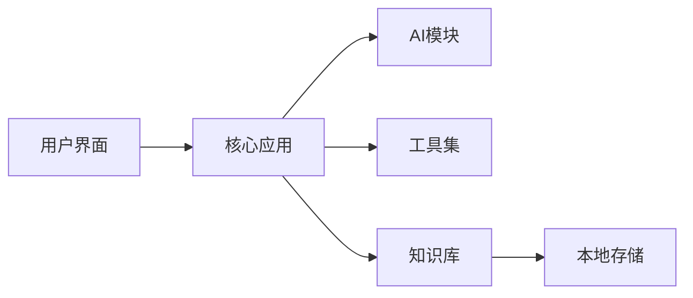

**技术特色**：
- 基于TypeScript构建的全栈应用，确保类型安全和跨平台兼容性
- 自包含设计，无需网络连接即可运行所有核心功能
- 模块化架构，支持工具和资源的动态扩展

#### 热度分析
- 项目Star数高达15,354且近期激增(+2,513 today)，表明生存/应急工具领域需求旺盛
- Fork数相对适中(1,460)，说明项目更多被用作参考而非二次开发，倾向于直接使用

#### 快速上手

```bash
# 克隆项目
git clone https://github.com/Crosstalk-Solutions/project-nomad.git
cd project-nomad

# 安装依赖并运行
npm install
npm start
```

#### 注意事项
- 项目可能需要特定硬件环境才能充分利用其离线生存功能
- 由于项目包含AI功能，可能需要较大的计算资源
- 许可证信息未知，使用前需确认开源协议


### 4. TauricResearch/TradingAgents — 多智能体交易框架

> **一句话总结**：基于多智能体和大语言模型的金融交易框架，实现自动化交易决策

#### 价值主张

| 维度 | 说明 |
|------|------|
| **解决痛点** | 传统交易系统缺乏自适应能力和复杂市场环境处理能力 |
| **目标用户** | 量化交易者、金融分析师、算法交易开发者 |
| **核心亮点** | 多智能体协作 + LLM决策支持 + 自适应交易策略 + 开源可扩展 |

#### 技术架构


**技术特色**：
- 多智能体协作机制实现复杂市场环境下的决策
- 大语言模型提供市场分析和交易建议
- 自适应学习系统持续优化交易策略
- 支持多种金融数据源和交易平台接口

#### 热度分析

- 项目获得40,876个星标，单日增长1,760，显示社区高度关注和活跃度
- 高Fork比例(约18.4%)表明项目具有高度实用价值和二次开发潜力

#### 快速上手

```bash
# 克隆项目
git clone https://github.com/TauricResearch/TradingAgents.git

# 安装依赖
pip install -r requirements.txt

# 运行示例
python examples/basic_trading.py
```

#### 注意事项

- 项目依赖大量第三方金融数据源和API，可能需要额外配置
- 实际交易前应在模拟环境中充分测试策略
- 金融市场风险高，本项目仅作为研究工具使用，不保证盈利


### 5. pascalorg/editor — Pascal代码编辑器

> **一句话总结**：基于TypeScript的现代Pascal语言编辑器，提供高效的开发体验和智能功能。

#### 价值主张

| 维度 | 说明 |
|------|------|
| **解决痛点** | 为Pascal开发者提供现代化编辑工具，弥补传统IDE不足 |
| **目标用户** | Pascal语言开发者、教学机构和复古编程爱好者 |
| **核心亮点** | 智能代码提示 + 语法高亮 + 实时错误检测 + 跨平台支持 |

#### 技术架构

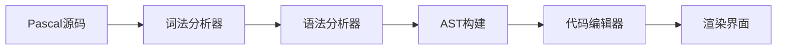

**技术特色**：
- 基于TypeScript构建，确保类型安全和跨平台兼容性
- 自研解析引擎，专门针对Pascal语言优化
- 插件化架构，支持扩展功能

#### 热度分析

- 近期Star激增，表明项目有重大更新或获得社区广泛关注
- Fork数适中，显示项目有稳定贡献者群体但非主流项目

#### 快速上手

```bash
# 克隆项目
git clone https://github.com/pascalorg/editor.git

# 安装依赖
npm install

# 启动开发服务器
npm run dev
```

#### 注意事项
- 项目可能仍在开发中，API可能会有变化
- 需要Node.js环境支持
- 建议查阅项目文档了解最新功能特性


### 6. ruvnet/ruflo — AI代理编排平台

> **一句话总结**：Claude的领先代理编排平台，实现智能多代理群体部署与自主工作流协调。

#### 价值主张

| 维度 | 说明 |
|------|------|
| **解决痛点** | 简化多代理AI系统部署，解决复杂AI工作流协调难题 |
| **目标用户** | 企业AI开发者、需要构建复杂对话式AI系统的团队 |
| **核心亮点** | 企业级架构 + 分布式群体智能 + RAG集成 + Claude原生集成 |

#### 技术架构

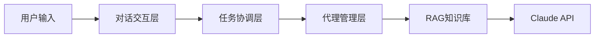

**技术特色**：
- 分布式群体智能算法实现多代理协同
- 企业级架构确保高可用性和可扩展性
- 原生Claude Code/Codex集成提供无缝开发体验

#### 热度分析

- 项目获得超过25k星，近期增长迅速，单日新增近1.4k星，表明社区高度关注
- 作为Claude生态的重要基础设施，处于AI代理系统开发的核心位置

#### 快速上手

```bash
# 克隆项目
git clone https://github.com/ruvnet/ruflo.git
cd ruflo

# 安装依赖并启动
npm install
npm start
```

#### 注意事项

- 项目许可证未知，商业使用前需确认授权条款
- 作为较新的项目，生态系统和社区支持可能还在发展中


### 7. NousResearch/hermes-agent — 自适应智能代理

> **一句话总结**：一个能够持续学习和成长的AI代理系统，随使用交互不断进化能力

#### 价值主张

| 维度 | 说明 |
|------|------|
| **解决痛点** | 传统AI代理缺乏长期记忆和持续适应能力，无法随使用场景进化 |
| **目标用户** | 需要长期交互和个性化体验的AI应用开发者和研究者 |
| **核心亮点** | 自主学习 + 情境记忆 + 能力扩展 + 多模态交互 |

#### 技术架构

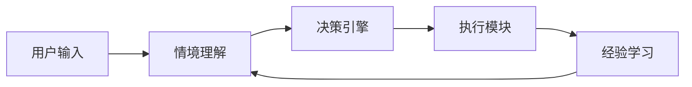

**技术特色**：
- 基于持续学习的自适应算法架构
- 多模态输入处理与上下文理解能力
- 分布式训练与推理支持

#### 热度分析

- 项目近期星标激增1278，显示社区高度关注与认可
- 在AI代理领域处于前沿位置，引领自适应代理技术发展

#### 快速上手

```bash
# 克隆仓库
git clone https://github.com/NousResearch/hermes-agent.git

# 安装依赖
pip install -r requirements.txt

# 启动代理
python hermes_agent.py --config default_config.yaml
```

#### 注意事项

- 项目依赖较新的深度学习框架，需确保Python环境兼容
- 持续学习功能需要大量训练数据和计算资源
- 生产环境部署建议考虑分布式架构以提高性能


### 8. hesreallyhim/awesome-claude-code — Claude资源库

> **一句话总结**：精选Claude Code生态中的技能、插件与应用资源库，助力开发者高效扩展AI助手功能。

#### 价值主张

| 维度 | 说明 |
|------|------|
| **解决痛点** | 解决Claude Code开发者资源分散、难以发现优质扩展工具的问题 |
| **目标用户** | Claude Code开发者、AI应用构建者、Anthropic平台用户 |
| **核心亮点** | 资源精选度高 + 分类清晰 + 持续更新 + 社区贡献 |

#### 技术架构

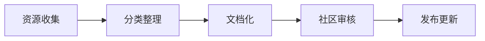

**技术特色**：
- 采用Markdown结构化组织资源，便于维护和导航
- 分类体系设计合理，涵盖技能、钩子、命令等多种扩展形式
- 社区驱动的更新机制，确保资源时效性

#### 热度分析

- 项目获得3万+星标，日增近千星，表明Claude生态正快速增长，开发者对扩展工具需求旺盛
- 作为awesome系列项目，已成为Claude开发者的必访资源站，在AI工具生态中占据重要位置

#### 快速上手

```bash
# 访问项目获取资源
# https://github.com/hesreallyhim/awesome-claude-code

# 克隆到本地
git clone https://github.com/hesreallyhim/awesome-claude-code.git
```

#### 注意事项

- 项目依赖社区贡献，部分资源可能未经验证或已过时
- 使用前应检查资源兼容性，特别是与Claude Code版本的匹配
- 遵循各资源的开源许可协议，注意知识产权问题


### 9. ruvnet/RuView — WiFi感知技术

> **一句话总结**：利用普通WiFi信号实现实时人体姿态估计、生命体征监测和存在检测，无需视频输入。

#### 价值主张

| 维度 | 说明 |
|------|------|
| **解决痛点** | 解决了隐私保护下的人体感知需求，无需摄像头即可监测人体状态 |
| **目标用户** | 需要非视觉人体感知的智能家居、医疗监护和安防系统开发者 |
| **核心亮点** | 普通WiFi信号利用 + 实时姿态估计 + 生命体征监测 + 隐私保护 |

#### 技术架构


**技术特色**：
- 基于WiFi信号的密集人体表示技术
- 非视觉感知算法，保护用户隐私
- 实时处理能力，适用于各种场景

#### 热度分析

- 项目Star数高且增长迅速，表明技术新颖且实用性强
- 零Open Issues反映项目成熟度高，社区维护良好

#### 快速上手

```bash
# 克隆项目
git clone https://github.com/ruvnet/RuView.git
# 编译项目
cargo build --release
# 运行示例
./target/release/ruview --input wlan0
```

#### 注意事项
- 需要特定的WiFi硬件支持
- 环境中的WiFi干扰可能影响精度
- 需要适当的权限才能访问网络接口


### 10. harry0703/MoneyPrinterTurbo — AI视频生成工具

> **一句话总结**：利用AI大模型一键生成高清短视频，实现内容创作的自动化与规模化。

#### 价值主张

| 维度 | 说明 |
|------|------|
| **解决痛点** | 传统视频制作流程复杂耗时，AI工具简化创作过程 |
| **目标用户** | 内容创作者、营销人员、自媒体运营者 |
| **核心亮点** | 一键生成 + AI驱动 + 高清输出 + 多模态支持 |

#### 技术架构

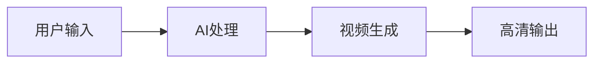

**技术特色**：
- 集成多种AI大模型进行视频生成
- 支持多种视频格式和分辨率
- 简化的一键式操作流程

#### 热度分析

- 项目近期增长迅猛，单日Star数增加728，市场需求强烈
- 高Fork数表明社区活跃，用户二次开发意愿强烈

#### 快速上手

```bash
# 克隆项目
git clone https://github.com/harry0703/MoneyPrinterTurbo.git
cd MoneyPrinterTurbo

# 安装依赖
pip install -r requirements.txt

# 运行项目
python main.py --input "你的文本提示"
```

#### 注意事项

- 注意AI生成内容的版权问题
- 项目依赖可能需要较高的计算资源
- 建议在合规范围内使用，避免生成不当内容


### 11. hsliuping/TradingAgents-CN — 中文智能交易框架

> **一句话总结**：基于多智能体LLM的中文金融交易框架，支持多策略智能体协作交易。

#### 价值主张

| 维度 | 说明 |
|------|------|
| **解决痛点** | 中文金融交易场景下缺乏智能化、多智能体协作的交易框架 |
| **目标用户** | 中文金融市场量化交易者、金融科技开发人员 |
| **核心亮点** | 多智能体协作 + LLM驱动 + 中文金融数据处理 + 策略共享社区 |

#### 技术架构

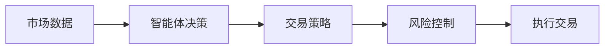

**技术特色**：
- 多智能体系统架构，支持不同角色智能体协同工作
- 集成大语言模型进行市场分析和决策
- 模块化设计，便于扩展和定制交易策略

#### 热度分析

- 项目Star数超过2万，近期增长迅速，表明中文AI交易领域需求旺盛
- Fork数量与Star比例合理，说明社区活跃度高，用户参与度良好

#### 快速上手

```bash
# 克隆项目
git clone https://github.com/hsliuping/TradingAgents-CN.git

# 安装依赖
cd TradingAgents-CN
pip install -r requirements.txt
```

#### 注意事项

- 需要配置中文金融数据源API才能正常运行
- 实盘交易前需充分测试，建议先使用模拟交易环境
- 注意合规性，不同地区对AI交易可能有不同监管要求


### 12. supermemoryai/supermemory — AI记忆引擎

> **一句话总结**：为AI时代提供高性能、可扩展的记忆引擎与应用，构建智能系统的记忆基础。

#### 价值主张

| 维度 | 说明 |
|------|------|
| **解决痛点** | 解决AI系统记忆存储效率低、扩展性差的核心挑战 |
| **目标用户** | AI开发者、研究人员及需要记忆功能的智能应用构建者 |
| **核心亮点** | 极致性能 + 高可扩展性 + 智能记忆关联 |

#### 技术架构

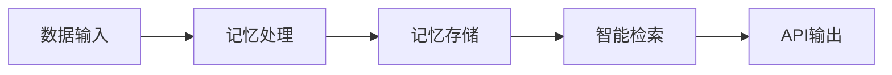

**技术特色**：
- 基于TypeScript构建的高性能内存处理引擎
- 采用分布式架构实现水平扩展能力
- 提供RESTful API简化AI记忆功能集成

#### 热度分析

- Star数超1.8万，日增300+，呈现快速增长态势
- 零未解决问题，社区活跃度高，处于AI记忆技术前沿

#### 快速上手

```bash
# 克隆项目
git clone https://github.com/supermemoryai/supermemory.git

# 安装依赖并启动
cd supermemory && npm install && npm start
```

#### 注意事项

- 项目License未知，使用前需确认开源协议
- 作为AI时代的记忆引擎，可能需要考虑数据隐私和安全问题


### 13. mvanhorn/last30days-skill — 多平台AI研究

> **一句话总结**：跨平台AI研究工具，聚合社交媒体、新闻和市场数据，生成基于事实的主题摘要。

#### 价值主张

| 维度 | 说明 |
|------|------|
| **解决痛点** | 信息过载时代，难以快速获取多平台关于特定主题的综合观点和数据 |
| **目标用户** | 研究人员、投资者、内容创作者和需要快速了解主题的决策者 |
| **核心亮点** | 多平台数据聚合 + AI智能摘要 + 基于事实的内容生成 + 最新数据覆盖 + 结构化输出 |

#### 技术架构

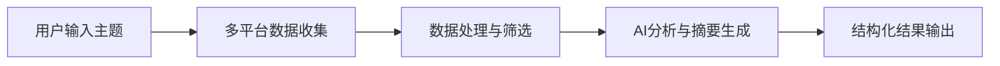

**技术特色**：
- 跨平台API集成与数据提取技术
- 大语言模型驱动的内容分析与摘要生成
- 信息验证与来源标注机制确保内容可靠性

#### 热度分析

- 项目获得5,586个星标，今日增长209，显示出强劲的用户兴趣和社区认可
- 零开放Issues表明项目维护良好，用户问题得到及时解决

#### 快速上手

```bash
# 克隆仓库
git clone https://github.com/mvanhorn/last30days-skill.git
cd last30days-skill

# 安装依赖
pip install -r requirements.txt

# 运行项目
python main.py --topic "your topic here"
```

#### 注意事项

- 项目可能需要多个平台的API密钥才能正常运行
- 使用AI生成的内容应进行人工验证，特别是用于决策或投资时
- 项目依赖可能较新的Python版本和相关AI服务


### 14. aquasecurity/trivy — 全栈安全扫描器

> **一句话总结**：一款开源的全栈安全扫描工具，可快速检测容器、Kubernetes、代码仓库等多种环境中的漏洞、配置错误和敏感信息。

#### 价值主张

| 维度 | 说明 |
|------|------|
| **解决痛点** | 企业面临的复杂环境安全检测困难，传统工具无法全面覆盖容器、云原生和代码安全 |
| **目标用户** | DevOps工程师、安全团队、云原生应用开发者、容器化平台运维人员 |
| **核心亮点** | 轻量级快速扫描 + 多环境支持 + 丰富的漏洞数据库 + 开源免费 + 持续更新 |

#### 技术架构

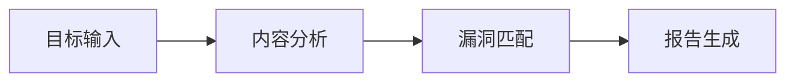

**技术特色**：
- 采用Go语言开发，编译为单一可执行文件，部署简单
- 通过OSI层漏洞检测(Linux/Windows)和应用层依赖分析(多语言)
- 支持多种扫描模式(文件系统、容器镜像、Git仓库等)

#### 热度分析

- Trivy项目Star数超过3.3万，且仍在稳定增长(+104 today)，表明其在安全扫描领域的高认可度和持续活跃
- 作为Aqua Security公司开源项目，已成为容器安全领域的事实标准工具之一，社区活跃度极高

#### 快速上手

```bash
# 扫描容器镜像中的漏洞
docker run --rm aquasec/trivy image your-image:tag

# 扫描文件系统中的漏洞
trivy fs /path/to/directory

# 生成SBOM(软件物料清单)
trivy sbom your-image:tag
```

#### 注意事项

- 扫描大量镜像时可能需要较长时间和较多内存资源
- 漏洞数据库需要定期更新以确保检测结果的准确性
- 对于私有仓库，需要配置适当的认证信息


## 今日推荐

| 主题 | 推荐项目 | 亮点 |
|------|----------|------|
| 今日最热 | [bytedance/deer-flow](https://github.com/bytedance/deer-flow) | An open-source Su... |
| 值得关注 | [FujiwaraChoki/MoneyPrinterV2](https://github.com/FujiwaraChoki/MoneyPrinterV2) | Automate the proc... |
| 快速上手 | [Crosstalk-Solutions/project-nomad](https://github.com/Crosstalk-Solutions/project-nomad) | Project N.O.M.A.D... |
| 长期潜力 | [TauricResearch/TradingAgents](https://github.com/TauricResearch/TradingAgents) | TradingAgents: Mu... |

---

<div align="center">

*Generated on 2026-03-25 | Powered by GitHub Trending Reporter*

</div>