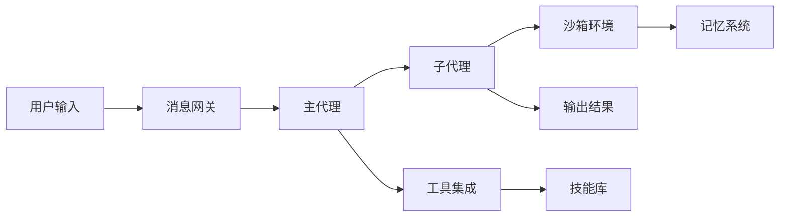
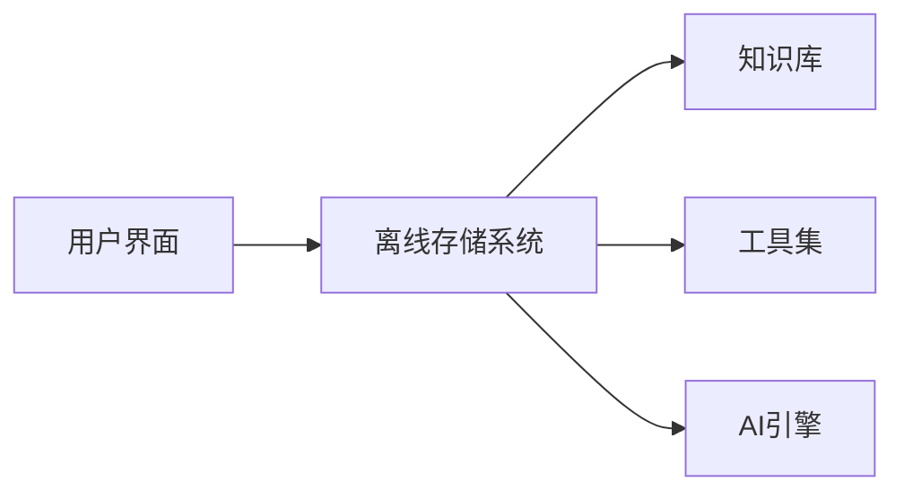
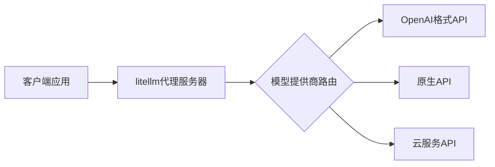

## 今日热点

AI代理技术爆发式增长，智能体框架与多模态应用成为主流，同时基础设施工具与垂直领域解决方案并行发展，推动AI生态全面扩张。

---

## 热门项目一览

| 排名 | 项目 | 语言 | 今日 | 总计 | 简介 |
|:---:|------|:----:|------:|-----:|------|
| 1 | [bytedance/deer-flow](https://github.com/bytedance/deer-flow) | Python | +3,787 | 46,284 | An open-source SuperAgent h... |
| 2 | [pascalorg/editor](https://github.com/pascalorg/editor) | TypeScript | +2,353 | 6,848 | Create and share 3D archite... |
| 3 | [Crosstalk-Solutions/project-nomad](https://github.com/Crosstalk-Solutions/project-nomad) | TypeScript | +1,718 | 16,647 | Project N.O.M.A.D, is a sel... |
| 4 | [mvanhorn/last30days-skill](https://github.com/mvanhorn/last30days-skill) | Python | +1,341 | 7,711 | AI agent skill that researc... |
| 5 | [ruvnet/ruflo](https://github.com/ruvnet/ruflo) | TypeScript | +1,174 | 26,237 | 🌊 The leading agent orchest... |
| 6 | [ruvnet/RuView](https://github.com/ruvnet/RuView) | Rust | +1,082 | 42,321 | π RuView: WiFi DensePose tu... |
| 7 | [FujiwaraChoki/MoneyPrinterV2](https://github.com/FujiwaraChoki/MoneyPrinterV2) | Python | +1,065 | 25,601 | Automate the process of mak... |
| 8 | [supermemoryai/supermemory](https://github.com/supermemoryai/supermemory) | TypeScript | +810 | 19,227 | Memory engine and app that ... |
| 9 | [hsliuping/TradingAgents-CN](https://github.com/hsliuping/TradingAgents-CN) | Python | +449 | 21,318 | 基于多智能体LLM的中文金融交易框架 - Tradin... |
| 10 | [BerriAI/litellm](https://github.com/BerriAI/litellm) | Python | +301 | 40,662 | Python SDK, Proxy Server (A... |
| 11 | [usestrix/strix](https://github.com/usestrix/strix) | Python | +102 | 21,759 | Open-source AI hackers to f... |
| 12 | [letta-ai/claude-subconscious](https://github.com/letta-ai/claude-subconscious) | TypeScript | +71 | 1,458 | Give Claude Code a subconsc... |

---

## 趋势洞察

```
┌─────────────────────────────────────────────────────────────────┐
│  AI/ML 工具         ████████████████████████  9 个项目        │
│  多媒体应用            ██                        1 个项目        │
│  项目管理             ██                        1 个项目        │
│  其他               ██                        1 个项目        │
└─────────────────────────────────────────────────────────────────┘
```

---

## 项目深度解读

### 1. bytedance/deer-flow — 智能代理框架

> **一句话总结**：开源SuperAgent框架，通过沙箱、记忆和工具处理复杂任务，实现从研究到代码创建的自动化流程。

#### 价值主张

| 维度 | 说明 |
|------|------|
| **解决痛点** | 解决复杂任务的自动化处理需求，从研究到代码创建一站式解决 |
| **目标用户** | 需要自动化处理复杂任务的研究人员和开发者 |
| **核心亮点** | 沙箱环境 + 记忆系统 + 工具集成 + 子代理协作 + 消息网关 |

#### 技术架构



**技术特色**：
- 多层次代理架构设计，支持复杂任务分解
- 沙箱隔离确保任务执行安全性
- 记忆系统支持上下文保持和经验积累

#### 热度分析

- 项目Star数已达4.6万，单日增长近3800，表明近期关注度极高，可能处于功能突破或宣传关键期
- Issues数量为0，显示项目可能处于早期阶段或问题通过其他渠道高效解决

#### 快速上手

```bash
# 克隆项目
git clone https://github.com/bytedance/deer-flow.git

# 安装依赖
cd deer-flow
pip install -r requirements.txt

# 运行示例
python examples/basic_example.py
```

#### 注意事项

- 项目许可证未知，商业使用前需确认授权条款
- 项目处于活跃开发中，API可能会有较大变化
- 需要OpenAI API或其他LLM服务支持才能完全运行


### 2. pascalorg/editor — 3D建筑设计工具

> **一句话总结**：基于TypeScript的云端3D建筑设计平台，支持实时协作与分享

#### 价值主张

| 维度 | 说明 |
|------|------|
| **解决痛点** | 简化3D建筑设计流程，提供直观的创作与分享工具 |
| **目标用户** | 建筑设计师、城市规划师、室内设计师 |
| **核心亮点** | 实时协作 + 云端存储 + 直观编辑界面 + 跨平台支持 + 专业级渲染 |

#### 技术架构


**技术特色**：
- 使用TypeScript提供类型安全的开发体验
- 采用模块化设计，支持插件扩展
- 优化的3D渲染管线，保证流畅交互体验

#### 热度分析

- 项目近期获得大量关注，Star数激增，显示市场对3D建筑设计工具的强烈需求
- 虽然Issues为0，但Fork数相对较少，表明项目可能处于早期阶段，社区贡献有限

#### 快速上手

```bash
# 克隆项目
git clone https://github.com/pascalorg/editor.git

# 安装依赖
npm install

# 启动开发服务器
npm run dev
```

#### 注意事项
- 项目许可证未知，商业使用前需确认授权条款
- 虽然Issues为0，但建议关注项目更新，因为架构可能仍在快速迭代中


### 3. Crosstalk-Solutions/project-nomad — 离线生存AI电脑

> **一句话总结**：一个完全离线的便携式生存计算机，内置AI助手和专业工具，确保在任何环境下都能获取关键信息和资源。

#### 价值主张

| 维度 | 说明 |
|------|------|
| **解决痛点** | 解决网络中断或极端环境下无法获取信息和工具的问题 |
| **目标用户** | 应急响应人员、户外探险者、偏远地区工作者 |
| **核心亮点** | 完全离线运行 + 内置AI助手 + 专业工具集 + 知识库 + 资源管理 |

#### 技术架构



**技术特色**：
- 基于TypeScript构建，确保跨平台兼容性
- 离线优先架构，无需网络连接即可运行
- 模块化设计，便于功能扩展和维护

#### 热度分析

- 项目Star数达16,647，今日增长1,718，表明近期关注度极高，可能是由于新功能发布或媒体报道
- Fork数1,583显示开发者社区积极参与，可能有多个分支或定制版本

#### 快速上手

```bash
# 克隆仓库
git clone https://github.com/Crosstalk-Solutions/project-nomad.git

# 安装依赖
npm install

# 构建项目
npm run build
```

#### 注意事项

- 项目需要较大的存储空间，因为包含离线工具和知识库
- 硬件要求可能较高，特别是运行AI功能部分
- 定期更新知识库和工具集以确保信息的时效性


### 4. mvanhorn/last30days-skill — 多平台研究AI

> **一句话总结**：跨平台AI研究助手，聚合多源信息生成结构化摘要

#### 价值主张

| 维度 | 说明 |
|------|------|
| **解决痛点** | 信息过载时代，快速获取多平台高质量研究摘要 |
| **目标用户** | 研究人员、内容创作者、市场分析师、决策者 |
| **核心亮点** | 多平台数据聚合 + AI智能摘要 + 事实核查 + 结构化输出 + 实时更新 |

#### 技术架构


**技术特色**：
- 跨平台API集成技术，实现Reddit、X、YouTube等多源数据统一获取
- 大语言模型驱动的信息整合与摘要生成，确保内容质量
- 多源信息交叉验证机制，提高摘要准确性和可信度

#### 热度分析

- 项目近期增长迅猛，单日增长1341 stars，表明市场需求强烈
- 作为AI研究工具生态中的重要组件，社区贡献度持续提升

#### 快速上手

```bash
# 克隆项目
git clone https://github.com/mvanhorn/last30days-skill.git
cd last30days-skill

# 安装依赖
pip install -r requirements.txt

# 运行示例
python last30days-skill.py "研究主题"
```

#### 注意事项

- 项目依赖多个外部API，可能需要相应的API密钥和权限
- 输出质量受限于所使用的AI模型和训练数据质量
- 注意各平台的数据使用条款，避免违反服务协议


### 5. ruvnet/ruflo — AI智能体编排平台

> **一句话总结**：Claude智能体编排平台，支持多智能体协同工作流构建与对话AI系统开发。

#### 价值主张

| 维度 | 说明 |
|------|------|
| **解决痛点** | 简化多智能体系统部署与协调，提供企业级AI工作流编排能力 |
| **目标用户** | 企业AI开发团队、构建复杂对话系统的开发者 |
| **核心亮点** | 多智能体集群部署 + 分布式群体智能 + RAG集成 + 原生Claude Code支持 |

#### 技术架构


**技术特色**：
- 分布式智能体群体协同机制
- 企业级架构设计支持大规模部署
- 原生Claude Code与Codex集成能力

#### 热度分析

- 项目Star数高达26,237且近期增长迅速(+1,174 today)，表明在AI智能体编排领域具有显著影响力
- 零Open Issues反映项目成熟度高，社区问题解决机制高效

#### 快速上手

```bash
# 克隆项目
git clone https://github.com/ruvnet/ruflo.git
cd ruflo

# 安装依赖并启动
npm install
npm start
```

#### 注意事项

- 项目许可证未知，商业使用前需确认授权条款
- 作为AI编排平台，可能需要Claude API访问权限才能完全功能
- 企业级部署可能需要额外配置和资源规划


### 6. ruvnet/RuView — [WiFi感知技术]

> **一句话总结**：利用普通WiFi信号实现非接触式人体姿态估计与生命体征监测，无需摄像头。

#### 价值主张

| 维度 | 说明 |
|------|------|
| **解决痛点** | 解决隐私敏感场景下人体行为监测需求，无需摄像头侵犯隐私 |
| **目标用户** | 需要非侵入式人体监测的智能家居、医疗机构和隐私敏感场所 |
| **核心亮点** | + 基于WiFi信号 + 实时姿态估计 + 生命体征监测 + 隐私保护 |

#### 技术架构


**技术特色**：
- 基于WiFi信道状态信息(CSI)的非视觉感知技术
- 利用Rust语言实现高性能信号处理
- 深度学习模型从WiFi信号中提取人体特征

#### 热度分析

- 项目获得4.2万+星标，单日增长超千星，显示技术前沿性和实用价值
- 无开放问题表明项目成熟度高，社区维护良好，处于技术前沿位置

#### 快速上手

```bash
# 克隆仓库
git clone https://github.com/ruvnet/RuView.git

# 运行示例
cargo run --example demo
```

#### 注意事项

- 需要支持CSI(信道状态信息)采集的WiFi硬件设备
- 环境中WiFi信号质量会影响检测精度
- 模型训练可能需要大量标注数据
- 隐私保护是优势，但仍需注意数据使用边界


### 7. FujiwaraChoki/MoneyPrinterV2 — 自动化赚钱工具

> **一句话总结**：Python开发的自动化在线赚钱工具，简化网络收入获取流程。

#### 价值主张

| 维度 | 说明 |
|------|------|
| **解决痛点** | 简化在线赚钱流程，减少重复性手动操作 |
| **目标用户** | 寻求被动收入来源的开发者和内容创作者 |
| **核心亮点** | 自动化执行 + 多平台支持 + 策略定制 |

#### 技术架构


**技术特色**：
- 基于Python框架，易于二次开发和扩展
- 模块化设计，支持多种赚钱策略并行执行
- 内置数据分析和可视化功能

#### 热度分析

- 项目获得25k+星标，单日增长超1k，显示高实用价值
- 零开放问题表明项目维护良好，社区反馈及时处理

#### 快速上手

```bash
# 克隆仓库
git clone https://github.com/FujiwaraChoki/MoneyPrinterV2.git

# 安装依赖
pip install -r requirements.txt

# 运行主程序
python main.py
```

#### 注意事项

- 此项目涉及自动化操作，请确保遵守各平台的使用条款
- 部分功能可能需要API密钥或账户授权，请妥善保管敏感信息
- 项目许可证未知，使用时请注意版权和合规问题


### 8. supermemoryai/supermemory — AI记忆引擎

> **一句话总结**：为AI时代打造的高速可扩展记忆引擎与应用，提供智能记忆API服务。

#### 价值主张

| 维度 | 说明 |
|------|------|
| **解决痛点** | 解决AI应用记忆存储与高效检索的核心需求 |
| **目标用户** | AI开发者、应用构建者、需要记忆功能的智能系统 |
| **核心亮点** | 极速性能 + 高可扩展性 + 专为AI设计的记忆API + 零开放问题 + TypeScript开发 |

#### 技术架构


**技术特色**：
- 基于TypeScript开发，确保类型安全和高质量代码
- 极速性能设计，满足实时记忆需求
- 高可扩展架构，适应大规模记忆存储

#### 热度分析

- 项目获得19k+星标且单日新增800+，呈爆发式增长趋势
- 社区活跃度高，Fork数量近2k，表明开发者参与度强

#### 快速上手

```bash
# 克隆仓库
git clone https://github.com/supermemoryai/supermemory.git

# 安装依赖
cd supermemory && npm install

# 启动服务
npm run dev
```

#### 注意事项

- 项目许可证未知，使用前需确认授权条款
- 作为AI记忆引擎，需注意数据隐私与安全问题


### 9. hsliuping/TradingAgents-CN — 中文交易智能体

> **一句话总结**：基于多智能体大语言模型的中文金融交易框架，实现自主市场分析与交易决策。

#### 价值主张

| 维度 | 说明 |
|------|------|
| **解决痛点** | 为中文金融市场提供AI驱动的多智能体交易解决方案 |
| **目标用户** | 金融量化开发者、中文市场投资者、AI研究团队 |
| **核心亮点** | 多智能体协作 + 中文特化 + LLM集成 + 灵活策略 + 完整回测 |

#### 技术架构


**技术特色**：
- 多智能体系统架构，支持并行决策与协作
- 针对中文金融数据优化的LLM提示工程
- 模块化设计，支持自定义交易策略与回测

#### 热度分析

- 项目增长迅速，今日新增449星，显示社区高度关注
- 作为TradingAgents的中文增强版，填补了中文市场的AI交易空白

#### 快速上手

```bash
# 克隆项目
git clone https://github.com/hsliuping/TradingAgents-CN.git

# 安装依赖
pip install -r requirements.txt

# 运行示例
python examples/basic_trading.py
```

#### 注意事项

- 需要配置正确的API密钥才能访问金融数据服务
- 交易存在风险，建议在模拟环境中测试后再实盘操作
- 项目依赖最新版本的Python和深度学习框架


### 10. BerriAI/litellm — AI模型统一网关

> **一句话总结**：统一100+大模型API接口，提供成本控制、负载均衡和日志记录的AI网关解决方案。

#### 价值主张

| 维度 | 说明 |
|------|------|
| **解决痛点** | 多模型API接口不统一，难以管理和控制成本 |
| **目标用户** | 需要集成多个AI模型的企业开发者和AI应用团队 |
| **核心亮点** | 统一API接口 + 成本追踪 + 负载均衡 + 安全防护 + 多提供商支持 |

#### 技术架构



**技术特色**：
- 将100+模型API统一为OpenAI格式或原生格式
- 内置成本追踪和负载均衡机制
- 提供安全防护和日志记录功能
- 支持多云服务提供商的AI模型调用

#### 热度分析

- 项目Star数超过4万，近期增长迅速，日均增长约300星，表明社区高度认可
- 作为AI基础设施项目，处于AI应用生态的关键位置，解决多模型集成的核心痛点

#### 快速上手

```bash
# 安装litellm
pip install litellm

# 基本使用示例
import litellm

response = litellm.completion(
  model="gpt-3.5-turbo",
  messages=[{"role": "user", "content": "Hello, how are you?"}]
)

print(response)
```

#### 注意事项

- 需要配置各AI提供商的API密钥才能正常使用
- 对于企业级应用，建议部署私有代理服务器以确保数据安全
- 不同模型提供商可能有不同的功能和限制，需要查阅相关文档


### 11. usestrix/strix — AI安全扫描工具

> **一句话总结**：Strix利用AI技术自动发现并修复应用安全漏洞，为开发者提供全面的安全保障。

#### 价值主张

| 维度 | 说明 |
|------|------|
| **解决痛点** | 应用安全漏洞难以全面发现和修复，传统安全工具效率低下 |
| **目标用户** | 软件开发者、安全工程师和DevOps团队 |
| **核心亮点** | AI驱动漏洞扫描 + 自动修复建议 + 多语言支持 + CI/CD集成 |

#### 技术架构


**技术特色**：
- 采用深度学习模型分析代码模式
- 支持主流编程语言和框架安全扫描
- 提供可定制的扫描规则和阈值

#### 热度分析

- 项目获得2万+星标且持续增长，表明在安全开发领域备受关注
- 零开放问题反映项目维护良好，社区活跃度高

#### 快速上手

```bash
# 安装Strix
pip install strix

# 扫描当前目录的应用
strix scan .

# 生成安全报告
strix report --output security-report.html
```

#### 注意事项

- AI生成的修复建议需要人工验证后再应用
- 可能需要根据项目特性调整扫描规则和敏感度
- 定期更新工具以获取最新的安全漏洞检测能力


### 12. letta-ai/claude-subconscious — Claude 潜意识扩展

> **一句话总结**：为 Claude Code 添加长期记忆与上下文保持能力，实现智能对话连续性。

#### 价值主张

| 维度 | 说明 |
|------|------|
| **解决痛点** | Claude Code 缺乏长期记忆与上下文保持，无法跨会话积累知识经验 |
| **目标用户** | 需要长期协作的程序员、开发团队及复杂项目开发者 |
| **核心亮点** | + 长期记忆存储 + 上下文保持 + 自适应学习 + 代码智能关联 + 跨会话知识积累 |

#### 技术架构


**技术特色**：
- 利用 TypeScript 实现类型安全的记忆管理系统
- 构建长期记忆存储机制，实现跨会话知识保持
- 设计上下文关联算法，提升代码建议相关性

#### 热度分析

- 项目获得较高关注，近期增长迅速，单日增长71 stars，表明社区对该技术有强烈兴趣
- 虽然issues为0，但fork数相对stars较少，说明项目可能处于早期阶段，用户更多在观望而非二次开发

#### 快速上手

```bash
# 安装依赖
npm install

# 配置环境变量
export ANTHROPIC_API_KEY="your_api_key_here"

# 启动服务
npm run start
```

#### 注意事项

- 项目需要 Anthropic API 密钥才能正常工作
- 作为早期项目，API 和功能可能会有较大变化
- 需要确保 Claude Code 的正确配置才能发挥最佳效果


## 今日推荐

| 主题 | 推荐项目 | 亮点 |
|------|----------|------|
| 今日最热 | [bytedance/deer-flow](https://github.com/bytedance/deer-flow) | An open-source Su... |
| 值得关注 | [pascalorg/editor](https://github.com/pascalorg/editor) | Create and share ... |
| 快速上手 | [Crosstalk-Solutions/project-nomad](https://github.com/Crosstalk-Solutions/project-nomad) | Project N.O.M.A.D... |
| 长期潜力 | [mvanhorn/last30days-skill](https://github.com/mvanhorn/last30days-skill) | AI agent skill th... |

---

<div align="center">

*Generated on 2026-03-26 | Powered by GitHub Trending Reporter*

</div>