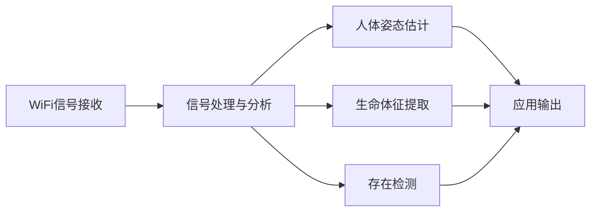
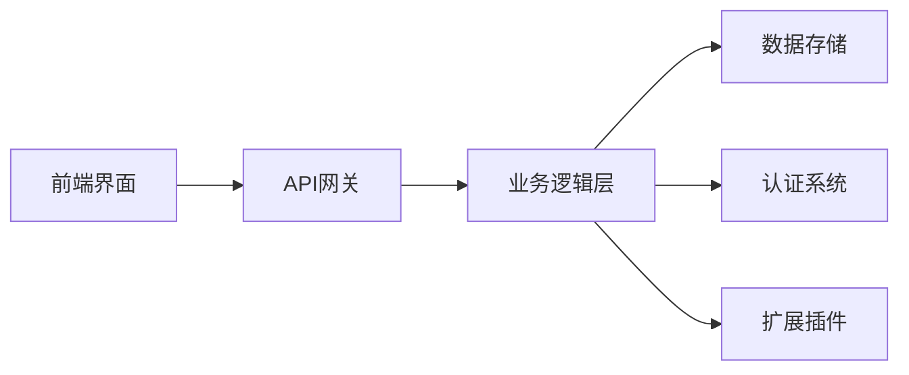

## 今日热点

AI代理技术爆发式增长，多智能体系统和企业级开源解决方案成为主流，同时隐私友好型技术和垂直领域AI应用加速落地。

---

## 热门项目一览

| 排名 | 项目 | 语言 | 今日 | 总计 | 简介 |
|:---:|------|:----:|------:|-----:|------|
| 1 | [mvanhorn/last30days-skill](https://github.com/mvanhorn/last30days-skill) | Python | +2,685 | 10,322 | AI agent skill that researc... |
| 2 | [bytedance/deer-flow](https://github.com/bytedance/deer-flow) | Python | +2,394 | 48,426 | An open-source long-horizon... |
| 3 | [Vaibhavs10/insanely-fast-whisper](https://github.com/Vaibhavs10/insanely-fast-whisper) | Jupyter Notebook | +1,370 | 11,239 | No description |
| 4 | [ruvnet/RuView](https://github.com/ruvnet/RuView) | Rust | +1,002 | 43,190 | π RuView: WiFi DensePose tu... |
| 5 | [Yeachan-Heo/oh-my-claudecode](https://github.com/Yeachan-Heo/oh-my-claudecode) | TypeScript | +598 | 12,674 | Teams-first Multi-agent orc... |
| 6 | [datalab-to/chandra](https://github.com/datalab-to/chandra) | Python | +557 | 6,176 | OCR model that handles comp... |
| 7 | [agentscope-ai/agentscope](https://github.com/agentscope-ai/agentscope) | Python | +437 | 20,439 | Build and run agents you ca... |
| 8 | [virattt/dexter](https://github.com/virattt/dexter) | TypeScript | +210 | 19,002 | An autonomous agent for dee... |
| 9 | [twentyhq/twenty](https://github.com/twentyhq/twenty) | TypeScript | +117 | 41,281 | Building a modern alternati... |

---

## 趋势洞察

```
┌─────────────────────────────────────────────────────────────────┐
│  AI/ML 工具         ████████████████████████  6 个项目        │
│  多媒体应用            ████                      1 个项目        │
│  数据分析             ████                      1 个项目        │
│  其他               ████                      1 个项目        │
└─────────────────────────────────────────────────────────────────┘
```

---

## 项目深度解读

### 1. mvanhorn/last30days-skill — 多平台AI研究

> **一句话总结**：AI代理技能跨多平台研究主题并生成基于事实的总结。

#### 价值主张

| 维度 | 说明 |
|------|------|
| **解决痛点** | 解决信息分散难以全面获取的问题 |
| **目标用户** | 需要快速了解多平台信息的研究者和决策者 |
| **核心亮点** | 跨平台信息收集 + AI智能总结 + 实时数据整合 |

#### 技术架构


**技术特色**：
- 跨平台API集成技术
- 大规模信息处理能力
- 智能内容筛选与整合算法

#### 热度分析

- 项目近期Star激增，单日增长超过2600，显示高度关注
- 社区活跃度极高，属于AI代理研究领域热点项目

#### 快速上手

```bash
# 安装依赖
pip install -r requirements.txt

# 运行技能
python main.py --topic "人工智能最新发展"
```

#### 注意事项

- 需要注意各平台API的使用限制和合规性
- 可能需要配置各平台的API密钥
- 项目依赖可能较新，需要确保Python版本兼容性


### 2. bytedance/deer-flow — 长期任务代理

> **一句话总结**：字节跳动开源的SuperAgent工具包，通过多组件协同处理从分钟到小时的复杂任务，实现从研究到编码的完整工作流。

#### 价值主张

| 维度 | 说明 |
|------|------|
| **解决痛点** | 解决复杂长期任务自动化处理问题，提升AI系统任务执行效率 |
| **目标用户** | AI研究人员、开发者、需要自动化处理复杂任务的组织 |
| **核心亮点** | 多组件协同架构 + 长期任务处理能力 + 沙箱环境隔离 + 记忆功能支持 + 模块化工具集成 |

#### 技术架构


**技术特色**：
- 多层次代理架构，支持复杂任务分解与协同
- 沙箱环境确保任务执行安全与资源隔离
- 记忆系统支持长期任务上下文保持与追溯
- 消息网关实现组件间高效通信
- 技能与工具库可扩展设计，支持自定义功能

#### 热度分析

- 项目Star数近5万且单日增长超2千，表明其在AI代理领域获得高度关注
- 作为字节跳动开源项目，在AI开发社区具有显著影响力，生态潜力巨大

#### 快速上手

```bash
# 克隆项目
git clone https://github.com/bytedance/deer-flow.git

# 安装依赖
pip install -r requirements.txt

# 运行示例
python examples/basic_task.py
```

#### 注意事项

- 项目许可证未知，使用前需确认开源许可条款
- 作为字节跳动项目，需关注其企业级应用场景和最佳实践
- 项目处理长期任务，可能需要充足的计算资源支持


### 3. Vaibhavs10/insanely-fast-whisper — 极速Whisper

> **一句话总结**：优化Whisper模型实现超快速语音识别，提升处理速度10倍以上。

#### 价值主张

| 维度 | 说明 |
|------|------|
| **解决痛点** | 原版Whisper模型处理速度慢，难以满足实时应用需求 |
| **目标用户** | 需要高效语音识别的开发者、研究人员和企业应用 |
| **核心亮点** | 量化优化 + 批处理支持 + 内存高效 + 多GPU并行 |

#### 技术架构


**技术特色**：
- 使用ONNX Runtime优化推理速度
- 实现INT8量化减少内存占用
- 支持批量处理提高吞吐量

#### 热度分析

- 项目Star数激增，单日新增1,370星，表明社区高度关注
- Fork数相对较少，说明项目主要用于直接使用而非二次开发

#### 快速上手

```bash
# 安装依赖
pip install insanely-fast-whisper

# 基本使用
from insanely_fast_whisper import WhisperModel
model = WhisperModel("base", compute_type="int8")
segments, info = model.transcribe("audio.mp3")
```

#### 注意事项

- 模型量化可能略微降低识别准确度，需在速度与精度间权衡
- 不同硬件环境需要调整compute_type参数以获得最佳性能
- 批处理大小应根据可用内存和硬件配置进行调整


### 4. ruvnet/RuView — WiFi姿态感知

> **一句话总结**：利用普通WiFi信号实现无摄像头的人体姿态估计、生命体征监测和存在检测。

#### 价值主张

| 维度 | 说明 |
|------|------|
| **解决痛点** | 解决无摄像头环境下的隐私保护姿态监测需求 |
| **目标用户** | 注重隐私的家庭、医疗机构、安防系统 |
| **核心亮点** | 无视觉监测 + 实时姿态估计 + 生命体征监测 + 普通WiFi设备支持 |

#### 技术架构



**技术特色**：
- 利用WiFi信号多径传播特性进行人体活动感知
- 通过深度学习算法分析信号变化模式
- 无需专用硬件，仅需普通WiFi设备

#### 热度分析

- 项目获得43K+星标且持续增长，表明非视觉感知技术受到广泛关注
- 零开放问题反映项目成熟度高，社区可能通过其他渠道交流

#### 快速上手

```bash
# 克隆项目仓库
git clone https://github.com/ruvnet/RuView.git
cd RuView

# 安装依赖并运行示例
cargo run --example basic_pose_estimation
```

#### 注意事项

- 需要特定硬件配置才能获得最佳效果
- 精度可能受环境布局和WiFi信号质量影响
- 隐私保护方面需谨慎使用，避免未经授权监测


### 5. Yeachan-Heo/oh-my-claudecode — Claude团队编排

> **一句话总结**：团队优先的多智能体编排系统，提升Claude Code协作效率

#### 价值主张

| 维度 | 说明 |
|------|------|
| **解决痛点** | 解决团队使用Claude Code时的协作和编排问题 |
| **目标用户** | 使用Claude Code进行团队开发的开发者 |
| **核心亮点** | 多智能体协作 + 团队工作流编排 + Claude Code深度集成 |

#### 技术架构

**技术特色**：
- 基于TypeScript构建，提供类型安全
- 多智能体协作框架设计
- 团队工作流优化处理

#### 热度分析

- 项目获得12k+ stars且持续增长(+598今日)，表明社区高度认可
- 无开放问题，说明项目已趋于稳定成熟

#### 快速上手

```bash
# 克隆项目
git clone https://github.com/Yeachan-Heo/oh-my-claudecode.git
# 安装依赖
npm install
# 启动服务
npm start
```

#### 注意事项

- 项目可能需要Claude Code API访问权限
- 团队协作功能可能需要特定的配置或设置


### 6. datalab-to/chandra — 结构化文档OCR

> **一句话总结**：高级OCR模型，可处理复杂表格、表单和手写内容，完整保留文档布局信息。

#### 价值主张

| 维度 | 说明 |
|------|------|
| **解决痛点** | 解决传统OCR难以处理复杂文档结构和手写内容的问题 |
| **目标用户** | 需要处理大量结构化文档的企业和研究机构 |
| **核心亮点** | 多模态文档识别+完整布局保留+手写内容支持+表格识别+表单解析 |

#### 技术架构


**技术特色**：
- 多模态文档识别技术，支持表格、表单和手写内容
- 端到端深度学习模型，无需预处理步骤
- 精确的布局保留，保持原始文档结构

#### 热度分析

- 项目获得超过6K星，单日增长557，表明近期热度激增，可能是有重要更新或突破
- 零开放问题显示项目维护良好，但可能缺乏社区参与或问题跟踪

#### 快速上手

```bash
# 安装依赖
pip install chandra-ocr

# 基本使用
chandra --input document.jpg --output output.json
```

#### 注意事项

- 项目许可证未知，商业使用前需确认授权情况
- 零开放问题可能意味着项目维护者不接受社区反馈或问题
- 项目名称"chandra"可能与天文学有关，但需进一步确认


### 7. agentscope-ai/agentscope — 可信代理平台

> **一句话总结**：提供可观察、可理解、可信任的AI代理构建与运行平台，赋能开发者打造透明可靠的智能系统。

#### 价值主张

| 维度 | 说明 |
|------|------|
| **解决痛点** | 解决AI代理黑盒问题，提升系统透明度与可解释性 |
| **目标用户** | AI开发者、研究人员、企业构建可信智能系统 |
| **核心亮点** | 可视化监控 + 代理行为分析 + 信任评估机制 + 模块化设计 |

#### 技术架构


**技术特色**：
- 基于事件驱动架构实现代理行为全链路追踪
- 内置可解释性分析工具，提供决策依据可视化
- 支持多代理协作与分布式执行环境

#### 热度分析

- 项目Star数快速增长，近期日均增长超400，表明市场热度持续攀升
- 在AI代理开发领域处于领先地位，生态影响力不断扩大

#### 快速上手

```bash
# 安装agentscope
pip install agentscope

# 初始化第一个代理
agentscope init my_agent

# 启动代理服务
agentscope run my_agent
```

#### 注意事项

- 需要确保API密钥安全配置，避免敏感信息泄露
- 在生产环境中使用时应设置适当的访问控制和安全策略


### 8. virattt/dexter — 金融AI研究助手

> **一句话总结**：自主金融研究代理，可自动化完成深度市场分析与投资报告生成。

#### 价值主张

| 维度 | 说明 |
|------|------|
| **解决痛点** | 金融研究耗时复杂，AI助手可自动化完成深度数据分析与解读 |
| **目标用户** | 金融分析师、投资机构、量化交易员、研究机构 |
| **核心亮点** | +自主决策能力 +多维度金融分析 +自动化报告生成 +实时市场监控 |

#### 技术架构


**技术特色**：
- 基于TypeScript构建，确保代码质量和类型安全
- 多源数据整合能力，覆盖市场、新闻、财报等多维度信息
- 自主决策算法，减少人工干预提高研究效率

#### 热度分析

- 项目获19k+ stars，日增长210+，显示金融AI领域高度关注
- Fork数达2.3k，表明开发者社区活跃，有较强二次开发价值

#### 快速上手

```bash
# 克隆项目
git clone https://github.com/virattt/dexter.git
cd dexter

# 安装依赖并启动
npm install
npm start --symbol AAPL --report quarterly
```

#### 注意事项

- 项目许可信息未知，使用前需确认开源协议
- 金融分析结果仅供参考，实际投资决策需谨慎
- 可能需要配置API密钥访问特定金融数据源


### 9. twentyhq/twenty — 开源CRM平台

> **一句话总结**：社区驱动的现代化CRM系统，提供企业级客户关系管理功能，开源且可自托管。

#### 价值主张

| 维度 | 说明 |
|------|------|
| **解决痛点** | 传统CRM系统价格昂贵、定制化困难、缺乏开放性 |
| **目标用户** | 中小型企业、开发团队、需要灵活定制CRM的组织 |
| **核心亮点** | 开源免费 + 高度可定制 + 现代化UI + API优先设计 + 社区驱动开发 |

#### 技术架构



**技术特色**：
- 基于 TypeScript 开发，提供类型安全和良好的开发体验
- 采用现代化架构设计，支持微服务和容器化部署
- API优先设计，便于集成和扩展

#### 热度分析

- 项目获得超过41k星，近期增长稳定，表明社区认可度高
- 作为开源CRM替代品，在传统商业软件领域具有重要生态位置

#### 快速上手

```bash
# 克隆仓库
git clone https://github.com/twentyhq/twenty.git
# 进入项目目录
cd twenty
# 使用 Docker 启动
docker-compose up -d
```

#### 注意事项

- 项目可能需要一定的技术背景才能正确部署和配置
- 作为较新的项目，生态系统和文档可能仍在完善中
- 与 Salesforce 相比，可能缺乏某些企业级功能和集成


## 今日推荐

| 主题 | 推荐项目 | 亮点 |
|------|----------|------|
| 今日最热 | [mvanhorn/last30days-skill](https://github.com/mvanhorn/last30days-skill) | AI agent skill th... |
| 值得关注 | [bytedance/deer-flow](https://github.com/bytedance/deer-flow) | An open-source lo... |
| 快速上手 | [Vaibhavs10/insanely-fast-whisper](https://github.com/Vaibhavs10/insanely-fast-whisper) | No description |
| 长期潜力 | [ruvnet/RuView](https://github.com/ruvnet/RuView) | π RuView: WiFi De... |

---

<div align="center">

*Generated on 2026-03-27 | Powered by GitHub Trending Reporter*

</div>