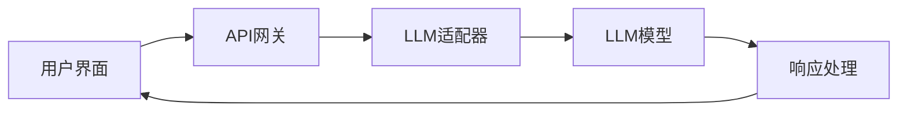

## 今日热点

今日GitHub热榜显示AI代理框架和垂直领域应用成为主流，Deep-Live-Cam的爆红也反映了深度伪造技术的快速发展，而企业级开源解决方案如Twenty正获得社区广泛关注。

---

## 热门项目一览

| 排名 | 项目 | 语言 | 今日 | 总计 | 简介 |
|:---:|------|:----:|------:|-----:|------|
| 1 | [obra/superpowers](https://github.com/obra/superpowers) | Shell | +2,292 | 120,822 | An agentic skills framework... |
| 2 | [hacksider/Deep-Live-Cam](https://github.com/hacksider/Deep-Live-Cam) | Python | +1,814 | 84,351 | real time face swap and one... |
| 3 | [onyx-dot-app/onyx](https://github.com/onyx-dot-app/onyx) | Python | +880 | 19,761 | Open Source AI Platform - A... |
| 4 | [datalab-to/chandra](https://github.com/datalab-to/chandra) | Python | +687 | 7,603 | OCR model that handles comp... |
| 5 | [virattt/dexter](https://github.com/virattt/dexter) | TypeScript | +581 | 20,215 | An autonomous agent for dee... |
| 6 | [twentyhq/twenty](https://github.com/twentyhq/twenty) | TypeScript | +563 | 42,444 | Building a modern alternati... |
| 7 | [SakanaAI/AI-Scientist-v2](https://github.com/SakanaAI/AI-Scientist-v2) | Python | +506 | 3,483 | The AI Scientist-v2: Worksh... |
| 8 | [agentscope-ai/agentscope](https://github.com/agentscope-ai/agentscope) | Python | +398 | 21,628 | Build and run agents you ca... |
| 9 | [apache/superset](https://github.com/apache/superset) | TypeScript | +31 | 71,477 | Apache Superset is a Data V... |

---

## 趋势洞察

```
┌─────────────────────────────────────────────────────────────────┐
│  AI/ML 工具         ████████████████████████  5 个项目        │
│  数据分析             █████████                 2 个项目        │
│  多媒体应用            ████                      1 个项目        │
│  其他               ████                      1 个项目        │
└─────────────────────────────────────────────────────────────────┘
```

---

## 项目深度解读

### 1. obra/superpowers — 开发效能框架

> **一句话总结**：基于代理技能的实用软件开发方法论，显著提升开发效率与代码质量。

#### 价值主张

| 维度 | 说明 |
|------|------|
| **解决痛点** | 传统开发流程低效，缺乏系统化方法论和自动化工具支持 |
| **目标用户** | 追求高效开发的专业软件开发者与技术团队 |
| **核心亮点** | 代理技能框架 + 自动化工作流 + 最佳实践集成 + 开发效率提升 + 质量保障 |

#### 技术架构


**技术特色**：
- 基于Shell的轻量级自动化工具集
- 模块化设计，支持灵活扩展与定制
- 无需复杂环境配置，开箱即用

#### 热度分析

- 项目呈爆发式增长，近期单日增长超2000星，受开发者高度关注
- 社区活跃度高，近万Fork表明用户积极参与实践与定制

#### 快速上手

```bash
# 克隆仓库
git clone https://github.com/obra/superpowers.git
# 进入目录
cd superpowers
# 运行主脚本
./superpowers.sh
```

#### 注意事项

- 项目未明确许可证，使用前需确认授权条款
- 主要针对类Unix系统，Windows用户需考虑WSL或其他兼容方案


### 2. hacksider/Deep-Live-Cam — 实时换脸工具

> **一句话总结**：仅需单张图片即可实现实时面部交换和一键视频深度伪造，简化AI换脸技术应用门槛

#### 价值主张

| 维度 | 说明 |
|------|------|
| **解决痛点** | 简化专业级换脸技术流程，实现单图实时视频换脸 |
| **目标用户** | 内容创作者、视频编辑者、AI技术应用开发者 |
| **核心亮点** | 单图实现 + 实时处理 + 高度逼真 + 易于使用 + 开源免费 |

#### 技术架构


**技术特色**：
- 基于深度学习的面部识别与交换算法
- 实时处理能力，支持视频流动态转换
- 高效的模型优化，降低硬件需求门槛

#### 热度分析

- 项目Star数超8.4万且持续快速增长，显示深度伪造技术领域的高关注度
- Fork数达1.2万，开发者社区活跃，项目具有高度可扩展性和应用潜力

#### 快速上手

```bash
# 克隆项目
git clone https://github.com/hacksider/Deep-Live-Cam.git

# 安装依赖
pip install -r requirements.txt

# 运行程序
python run.py --source_image path/to/source.jpg --target_video path/to/video.mp4
```

#### 注意事项

- 项目涉及深度伪造技术，使用时需严格遵守相关法律法规和伦理准则
- 建议使用高性能GPU设备以获得最佳实时处理效果
- 输出内容可能涉及肖像权问题，应确保获得相关授权或用于合法用途


### 3. onyx-dot-app/onyx — 开源AI聊天平台

> **一句话总结**：开源AI聊天平台，支持多种LLM，提供高级AI对话功能，让用户与任何AI模型无缝交互。

#### 价值主张

| 维度 | 说明 |
|------|------|
| **解决痛点** | 用户需要一个统一平台与不同AI模型交互，无需切换多个应用 |
| **目标用户** | AI研究人员、开发者和需要与多种AI模型交互的普通用户 |
| **核心亮点** | 支持多种LLM + 开源可定制 + 高级对话功能 + 跨平台兼容 |

#### 技术架构



**技术特色**：
- 模块化LLM适配器设计，支持多种AI模型无缝集成
- Python构建，易于扩展和社区定制开发
- 开源架构，允许用户根据需求修改和优化功能

#### 热度分析

- 项目获近2万星，单日增长880星，表明在AI聊天领域热度极高且持续攀升
- 零开放问题显示项目维护良好，社区贡献高效，用户体验稳定可靠

#### 快速上手

```bash
# 克隆仓库
git clone https://github.com/onyx-dot-app/onyx.git

# 安装依赖
cd onyx
pip install -r requirements.txt

# 启动应用
python app.py
```

#### 注意事项

- 需确保有足够计算资源来运行某些AI模型
- 不同LLM可能有不同的API限制和费用结构
- 建议定期查看项目文档，了解依赖项更新和新功能


### 4. datalab-to/chandra — 全布局OCR引擎

> **一句话总结**：一个能处理表格、表单和手写内容并保留完整布局的OCR模型。

#### 价值主张

| 维度 | 说明 |
|------|------|
| **解决痛点** | 解决复杂文档OCR中表格、表单和手写内容识别不准、布局丢失问题 |
| **目标用户** | 需要处理结构化文档的企业、研究机构和开发者 |
| **核心亮点** | 全布局保留 + 表格精准识别 + 表单解析 + 手写内容识别 |

#### 技术架构

**技术特色**：
- 端到端布局感知OCR技术
- 支持复杂表格结构识别
- 多模态文档处理能力
- 高精度手写内容识别

#### 热度分析

- 项目Star数达7603，单日增长687，显示极强的社区关注度和实用价值
- 零未解决问题表明项目维护良好，适合生产环境使用

#### 快速上手

```bash
# 安装依赖
pip install chandra-ocr

# 基本使用
from chandra import OCRProcessor
processor = OCRProcessor()
result = processor.process("document.jpg")
print(result)
```

#### 注意事项

- 项目许可证未知，商业使用前需确认授权方式
- 项目依赖和硬件需求未明确，建议查看项目文档了解详细要求


### 5. virattt/dexter — 智能金融研究助手

> **一句话总结**：自主金融研究代理，自动化深度财务分析，为投资决策提供数据支持

#### 价值主张

| 维度 | 说明 |
|------|------|
| **解决痛点** | 金融研究耗时繁琐，自动化处理海量数据并生成深度分析报告 |
| **目标用户** | 金融分析师、投资研究员、量化交易员 |
| **核心亮点** | 自主研究代理 + 多源数据整合 + 智能分析引擎 + 自动报告生成 |

#### 技术架构


**技术特色**：
- TypeScript全栈开发，保证类型安全与代码质量
- 模块化设计，支持多种金融数据源接入
- 自主决策算法，实现研究流程自动化

#### 热度分析

- 项目获得2万+星标，单日增长近600，表明金融科技领域高度关注
- 2400+ Fork数显示社区活跃，用户参与度高，二次开发潜力大

#### 快速上手

```bash
# 克隆项目
git clone https://github.com/virattt/dexter.git
# 安装依赖
npm install
# 启动服务
npm run start
```

#### 注意事项

- 项目许可证信息缺失，使用前需确认开源协议
- 金融分析结果仅供参考，实际投资决策需结合多方因素
- 建议在测试环境中验证功能后再用于实际研究工作


### 6. twentyhq/twenty — 开源CRM系统

> **一句话总结**：社区驱动的现代化Salesforce替代方案，提供灵活可定制的客户关系管理解决方案。

#### 价值主张

| 维度 | 说明 |
|------|------|
| **解决痛点** | 提供低成本、可定制的CRM解决方案，替代昂贵且封闭的Salesforce |
| **目标用户** | 中小型企业及开发团队，需要灵活CRM系统的组织 |
| **核心亮点** | 开源可定制 + 现代化架构 + 社区驱动 + TypeScript开发 + 高性能 |

#### 技术架构


**技术特色**：
- 基于TypeScript的全栈开发，确保类型安全
- 采用现代化前端框架，提供流畅用户体验
- 模块化设计，支持灵活扩展和定制

#### 热度分析

- 项目Star数超42k且持续快速增长，显示社区高度认可和活跃度
- 作为Salesforce的开源替代品，在CRM领域具有重要生态影响力

#### 快速上手

```bash
# 克隆项目仓库
git clone https://github.com/twentyhq/twenty.git
# 安装依赖
npm install
# 启动开发服务器
npm run dev
```

#### 注意事项

- 项目许可证信息不明确，使用前需确认开源协议
- 作为Salesforce替代方案，数据迁移和功能对齐需要额外考量
- 社区驱动模式意味着更新速度和功能方向可能受社区贡献影响


### 7. SakanaAI/AI-Scientist-v2 — AI科学发现系统

> **一句话总结**：基于智能体树搜索的自动化科学发现系统，实现工作坊级别的AI驱动的科研创新。

#### 价值主张

| 维度 | 说明 |
|------|------|
| **解决痛点** | 加速科研进程，降低科学发现的门槛和成本 |
| **目标用户** | 科研机构、AI研究者和数据科学家 |
| **核心亮点** | 自动化科学发现流程 + 智能体树搜索技术 + 工作坊级别科研成果 |

#### 技术架构


**技术特色**：
- 智能体树搜索驱动的研究优化
- 自动化实验设计与执行
- 工作坊级别的科学产出质量

#### 热度分析

- 项目近期热度飙升，单日增长506星，显示AI自动化科研领域高度关注
- 作为新兴研究方向，获得学术界和工业界共同关注，生态位置处于AI与科研交叉前沿

#### 快速上手

```bash
# 克隆项目
git clone https://github.com/SakanaAI/AI-Scientist-v2.git
# 进入目录
cd AI-Scientist-v2
# 安装依赖
pip install -r requirements.txt
```

#### 注意事项

- 项目可能需要较强的AI和科研背景知识
- 可能需要大量计算资源支持实验
- 作为新兴技术，可能存在稳定性和兼容性问题


### 8. agentscope-ai/agentscope — [可信智能体]

> **一句话总结**：构建可视化、可理解、可信赖的智能体系统，赋能开发者创建可靠AI应用。

#### 价值主张

| 维度 | 说明 |
|------|------|
| **解决痛点** | 解决AI智能体黑盒问题，提供可观察、可理解、可信赖的构建平台 |
| **目标用户** | AI应用开发者、研究人员和企业技术团队 |
| **核心亮点** | 可视化监控 + 可解释决策 + 可控性 + 高度可定制 |

#### 技术架构


**技术特色**：
- 模块化智能体设计，支持多种角色和功能扩展
- 实时可视化系统，透明展示智能体决策过程
- 内置信任度评估机制，保障AI行为可靠性
- 支持多智能体协同工作，构建复杂应用场景

#### 热度分析

- 项目Star数超过2万，近期日均增长约400，呈现高速发展态势
- 社区活跃度高，在AI智能体构建领域具有显著影响力，成为开发者首选框架之一

#### 快速上手

```bash
# 安装agentscope
pip install agentscope

# 初始化一个简单智能体
agentscope init my_agent

# 运行智能体
agentscope run my_agent
```

#### 注意事项

- 需要Python 3.8+环境支持
- 项目许可证信息不明确，建议使用前确认授权条款
- 某些高级功能可能需要额外的依赖包
- 建议在正式使用前阅读官方文档，了解最佳实践


### 9. apache/superset — 数据可视化平台

> **一句话总结**：企业级数据可视化和探索平台，提供丰富图表类型和交互式分析能力

#### 价值主张

| 维度 | 说明 |
|------|------|
| **解决痛点** | 企业需要灵活强大的数据可视化和探索工具，快速洞察数据价值 |
| **目标用户** | 数据分析师、数据科学家、业务分析师、企业决策者 |
| **核心亮点** | 丰富可视化组件库 + 高级SQL查询编辑器 + 交互式仪表板 + 多数据源支持 |

#### 技术架构


**技术特色**：
- 基于Python和TypeScript构建的全栈解决方案
- 支持多种数据源连接，包括SQL数据库、NoSQL等
- 采用模块化设计，便于扩展和定制

#### 热度分析

- Star数超71,000且持续增长，表明项目在数据可视化领域有广泛认可度
- 作为Apache顶级项目，拥有活跃社区贡献和完善的企业级数据工具生态

#### 快速上手

```bash
# 克隆仓库
git clone https://github.com/apache/superset.git

# 安装依赖
pip install -r requirements.txt

# 初始化数据库并启动
./scripts/superset run -p 8088 --with-threads --debugger
```

#### 注意事项

- Superset需要一定的Python和数据库知识才能完全发挥其功能
- 大规模部署时需要考虑性能优化和资源管理
- 定期更新以获取最新的功能和安全补丁


## 今日推荐

| 主题 | 推荐项目 | 亮点 |
|------|----------|------|
| 今日最热 | [obra/superpowers](https://github.com/obra/superpowers) | An agentic skills... |
| 值得关注 | [hacksider/Deep-Live-Cam](https://github.com/hacksider/Deep-Live-Cam) | real time face sw... |
| 快速上手 | [onyx-dot-app/onyx](https://github.com/onyx-dot-app/onyx) | Open Source AI Pl... |
| 长期潜力 | [datalab-to/chandra](https://github.com/datalab-to/chandra) | OCR model that ha... |

---

<div align="center">

*Generated on 2026-03-29 | Powered by GitHub Trending Reporter*

</div>