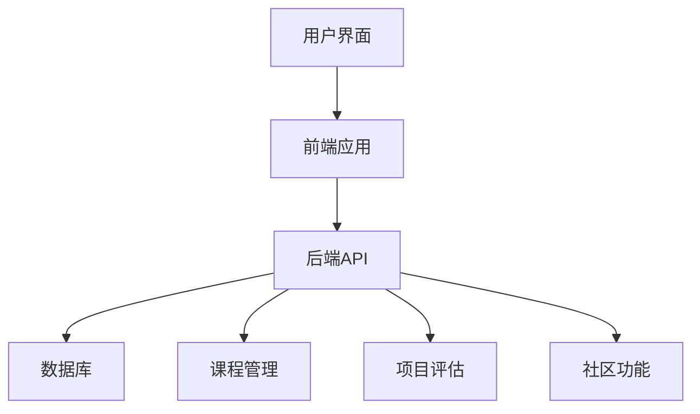

## 今日热点

AI语音技术与智能代理项目引领今日热榜，实用工具类项目持续受关注，反映出开发者对前沿AI应用和高效工具的双重需求。

---

## 热门项目一览

| 排名 | 项目 | 语言 | 今日 | 总计 | 简介 |
|:---:|------|:----:|------:|-----:|------|
| 1 | [luongnv89/claude-howto](https://github.com/luongnv89/claude-howto) | Python | +4,232 | 9,946 | A visual, example-driven gu... |
| 2 | [microsoft/VibeVoice](https://github.com/microsoft/VibeVoice) | Python | +2,492 | 30,479 | Open-Source Frontier Voice AI |
| 3 | [NousResearch/hermes-agent](https://github.com/NousResearch/hermes-agent) | Python | +1,851 | 18,645 | The agent that grows with you |
| 4 | [hacksider/Deep-Live-Cam](https://github.com/hacksider/Deep-Live-Cam) | Python | +1,136 | 86,378 | real time face swap and one... |
| 5 | [shanraisshan/claude-code-best-practice](https://github.com/shanraisshan/claude-code-best-practice) | HTML | +1,108 | 26,205 | practice made claude perfect |
| 6 | [OpenBB-finance/OpenBB](https://github.com/OpenBB-finance/OpenBB) | Python | +502 | 64,542 | Financial data platform for... |
| 7 | [freeCodeCamp/freeCodeCamp](https://github.com/freeCodeCamp/freeCodeCamp) | TypeScript | +368 | 439,732 | freeCodeCamp.org's open-sou... |
| 8 | [fastfetch-cli/fastfetch](https://github.com/fastfetch-cli/fastfetch) | C | +276 | 21,421 | A maintained, feature-rich ... |
| 9 | [sherlock-project/sherlock](https://github.com/sherlock-project/sherlock) | Python | +76 | 74,744 | Hunt down social media acco... |
| 10 | [apache/superset](https://github.com/apache/superset) | TypeScript | +49 | 71,938 | Apache Superset is a Data V... |

---

## 趋势洞察

```
┌─────────────────────────────────────────────────────────────────┐
│  AI/ML 工具         ████████████████████████  6 个项目        │
│  多媒体应用            ████████████              3 个项目        │
│  数据分析             ████                      1 个项目        │
└─────────────────────────────────────────────────────────────────┘
```

---

## 项目深度解读

### 1. luongnv89/claude-howto — Claude Code 实战指南

> **一句话总结**：可视化教程与实用模板库，助用户快速掌握 Claude Code 开发技巧。

#### 价值主张

| 维度 | 说明 |
|------|------|
| **解决痛点** | Claude Code 学习资源分散，缺乏系统性指导和可复用模板 |
| **目标用户** | AI 开发者、Claude API 使用者、LLM 应用构建者 |
| **核心亮点** | 可视化教程 + 实用模板库 + 进阶代理指南 + 即用代码示例 |

#### 技术架构


**技术特色**：
- 结构化学习路径设计
- 实用模板库与示例
- 可视化教程展示

#### 热度分析

- 项目近期获得大量关注，Star 数激增，表明 Claude Code 生态正在快速发展
- 高 Star 低 Issue 比例，说明项目质量高且用户需求旺盛

#### 快速上手

```bash
# 克隆项目
git clone https://github.com/luongnv89/claude-howto.git

# 查看文档
cd claude-howto && cat README.md
```

#### 注意事项

- 需要基本的 Claude API 访问权限
- 部分高级功能可能需要订阅 Claude Pro
- 建议按照项目中的学习路径循序渐进


### 2. microsoft/VibeVoice — 前沿语音AI

> **一句话总结**：微软开源的高性能语音AI系统，提供精准识别与自然语音合成能力。

#### 价值主张

| 维度 | 说明 |
|------|------|
| **解决痛点** | 突破传统语音AI的准确率瓶颈，实现低资源环境下的高质量语音交互 |
| **目标用户** | AI开发者、语音应用构建者、企业级语音解决方案提供商 |
| **核心亮点** | 端到端语音处理 + 超低延迟 + 多语言支持 + 轻量化部署 |

#### 技术架构


**技术特色**：
- 采用自研神经网络架构，大幅提升语音识别准确率
- 模型量化技术，显著降低推理资源需求
- 支持流式处理，实现实时语音交互

#### 热度分析

- 项目单日增长近2500星，表明是微软近期重磅发布，引发业界高度关注
- Fork数相对较少，显示项目处于早期阶段，社区定制化应用尚未大规模展开

#### 快速上手

```bash
# 克隆仓库
git clone https://github.com/microsoft/VibeVoice.git

# 安装依赖
cd VibeVoice && pip install -r requirements.txt

# 运行基础示例
python demo/basic_recognition.py --input sample.wav
```

#### 注意事项

- 项目依赖较新的深度学习框架，请确保环境兼容性
- 推荐使用GPU加速以获得最佳性能，CPU模式会有明显延迟
- 目前API可能不够稳定，建议关注项目更新日志


### 3. NousResearch/hermes-agent — 自成长智能体

> **一句话总结**：一个能够持续学习和适应的智能代理框架，随用户需求不断进化。

#### 价值主张

| 维度 | 说明 |
|------|------|
| **解决痛点** | 传统AI系统缺乏持续学习和适应能力，无法随使用场景进化 |
| **目标用户** | AI研究人员、开发者、企业AI解决方案提供商 |
| **核心亮点** | 自适应学习机制 + 模块化架构 + 多领域知识整合 + 高效推理能力 + 易于扩展 |

#### 技术架构


**技术特色**：
- 采用强化学习实现持续学习与自我优化
- 模块化设计支持功能灵活扩展与定制
- 高效的知识图谱构建与检索机制

#### 热度分析

- 项目18k+星标且单日激增1.8k+，处于快速上升期，显示社区高度认可
- 2.2k+ Fork表明项目生态活跃，二次开发潜力巨大

#### 快速上手

```bash
# 克隆仓库
git clone https://github.com/NousResearch/hermes-agent.git

# 安装依赖
cd hermes-agent
pip install -r requirements.txt

# 启动代理
python run_agent.py --config config/default.yaml
```

#### 注意事项

- 项目许可证信息不明确，使用前需确认授权条款
- 项目可能依赖较新的Python版本和GPU资源
- 由于没有开放Issue，技术支持可能主要通过社区讨论进行


### 4. hacksider/Deep-Live-Cam — 实时换脸工具

> **一句话总结**：基于深度学习的实时面部交换工具，仅需单张图片即可实现视频中的面部替换。

#### 价值主张

| 维度 | 说明 |
|------|------|
| **解决痛点** | 解决用户无需专业知识和多张训练图片即可实现实时面部替换的需求 |
| **目标用户** | 内容创作者、特效爱好者、隐私保护研究者和AI技术探索者 |
| **核心亮点** | 实时处理 + 单张图片生成 + 高质量输出 + 用户友好界面 + 跨平台支持 |

#### 技术架构


**技术特色**：
- 采用先进的人脸检测和特征提取算法，确保面部识别精确
- 实时渲染技术，支持高帧率视频处理
- 优化的神经网络模型，降低计算资源需求

#### 热度分析

- Star数高达86,378且近期增长迅速(+1,136 today)，表明项目在实时换脸领域极具吸引力
- Fork数12,543说明社区活跃度高，用户参与度强，在深度伪造工具生态中处于领先地位

#### 快速上手

```bash
# 克隆仓库
git clone https://github.com/hacksider/Deep-Live-Cam.git

# 安装依赖
pip install -r requirements.txt

# 运行应用
python run.py --source-image path/to/source.jpg --target-video path/to/target.mp4
```

#### 注意事项

- 本项目技术可能被用于创建误导性内容，请负责任地使用
- 处理高清视频需要较强的计算资源，建议使用GPU加速
- 需要注意隐私和法律问题，确保在合法合规范围内使用技术
- 项目许可证信息不明确，使用时需注意版权问题


### 5. shanraisshan/claude-code-best-practice — Claude实践指南

> **一句话总结**：Claude AI最佳实践合集，提供高效使用技巧与代码示例，提升AI辅助开发效率。

#### 价值主张

| 维度 | 说明 |
|------|------|
| **解决痛点** | 解决Claude AI提示词工程不足，输出质量不稳定问题 |
| **目标用户** | 开发者、AI工程师、Claude AI日常使用者 |
| **核心亮点** | 实用技巧 + 代码示例 + 效率提升 + 错误避免 + 场景化指导 |

#### 技术架构


**技术特色**：
- 基于HTML构建的响应式文档界面
- 结构化的Claude使用方法论与实践案例
- 场景化的问题解决方案与代码示例库

#### 热度分析

- 项目star数持续高速增长，反映Claude用户对高效使用方法迫切需求
- 在AI辅助开发工具生态中占据重要位置，成为Claude用户必备参考资源

#### 快速上手

```bash
# 克隆项目
git clone https://github.com/shanraisshan/claude-code-best-practice.git

# 使用浏览器打开查看文档
open claude-code-best-practice/index.html
```

#### 注意事项

- 项目需定期更新以适应Claude AI的最新版本和功能变化
- 不同使用场景可能需要调整最佳实践，应结合实际情况灵活应用


### 6. OpenBB-finance/OpenBB — 金融数据开源平台

> **一句话总结**：开源金融数据平台，提供全面市场数据获取和分析工具，赋能专业金融决策。

#### 价值主张

| 维度 | 说明 |
|------|------|
| **解决痛点** | 统一分散昂贵的金融数据源，提供一站式数据获取与分析解决方案 |
| **目标用户** | 金融分析师、量化交易员、投资研究员和数据科学家 |
| **核心亮点** | 开源替代商业平台 + 多数据源整合 + 全资产类别支持 + 丰富分析工具 |

#### 技术架构


**技术特色**：
- 模块化设计支持多种数据源无缝接入
- 高效缓存机制降低API调用成本
- 统一数据格式简化跨市场分析流程

#### 热度分析

- 单日增长502星，表明项目正经历快速采用期，金融开源社区认可度极高
- 作为彭博、路透等商业平台的开源替代品，正在填补重要市场空白

#### 快速上手

```bash
# 安装OpenBB
pip install openbb

# 获取股票数据
openbb stck AAPL
```

#### 注意事项

- 免费版本可能有数据限制，高级功能可能需要订阅
- 数据准确性需要验证，不应用于实际交易决策
- 需要API密钥才能访问某些数据源
- 项目更新频繁，需关注版本兼容性


### 7. freeCodeCamp/freeCodeCamp — 编程学习开源平台

> **一句话总结**：提供完全免费的编程和计算机科学教育，通过实践项目帮助全球学习者掌握实用技能。

#### 价值主张

| 维度 | 说明 |
|------|------|
| **解决痛点** | 打破高质量编程教育的经济壁垒，提供零成本学习路径 |
| **目标用户** | 编程初学者、转行人士、经济条件有限的求知者 |
| **核心亮点** | 项目驱动学习 + 全面课程体系 + 活跃全球社区 + 实用技能培养 |

#### 技术架构



**技术特色**：
- 采用 TypeScript 提高代码质量和开发效率
- 基于项目式学习模式强化实践能力培养
- 开源社区协作持续更新和优化课程内容

#### 热度分析

- 项目拥有近44万星标，日增数百，表明其在编程教育领域的广泛认可和持续影响力。
- 作为最大的开源教育项目之一，建立了独特的全球学习者社区，形成良性教育生态。

#### 快速上手

```bash
git clone https://github.com/freeCodeCamp/freeCodeCamp.git
cd freeCodeCamp
npm install
npm start
```

#### 注意事项

- 这是一个大型项目，初次贡献需要熟悉其代码结构和贡献指南
- 项目使用 TypeScript，需要相关知识才能有效参与开发
- 作为教育平台，代码质量和文档清晰度要求较高，贡献时需特别注意


### 8. fastfetch-cli/fastfetch — 系统信息展示工具

> **一句话总结**：一款高性能、功能丰富的系统信息展示工具，提供比neofetch更优的体验。

#### 价值主张

| 维度 | 说明 |
|------|------|
| **解决痛点** | 提供比neofetch更快速、更丰富的系统信息展示方案 |
| **目标用户** | 系统管理员、开发者、Linux爱好者 |
| **核心亮点** | 跨平台支持 + 高性能 + 丰富配置选项 + 持续维护 |

#### 技术架构


**技术特色**：
- 使用C语言编写，提供接近系统底层的性能
- 模块化设计，支持多种系统信息源
- 轻量级实现，资源占用低

#### 热度分析

- 项目获得21k+星标，单日增长276，表明开发者社区对该项目高度认可
- 相比同类工具如neofetch，展现出更强的社区活跃度和发展潜力

#### 快速上手

```bash
# 克隆项目
git clone https://github.com/fastfetch-cli/fastfetch.git
# 编译安装
cd fastfetch && mkdir build && cd build
cmake .. && make && sudo make install
# 运行fastfetch
fastfetch
```

#### 注意事项

- 项目依赖CMake构建系统，需要安装相关开发环境
- 某些高级功能可能需要额外安装系统库支持
- 配置文件位置可能因系统不同而有所差异


### 9. sherlock-project/sherlock — 社交账号猎手

> **一句话总结**：跨平台社交媒体账号搜索工具，通过用户名一键查找多个社交网络上的存在。

#### 价值主张

| 维度 | 说明 |
|------|------|
| **解决痛点** | 解决了在多个社交网络平台查找同一用户账号的繁琐问题 |
| **目标用户** | 安全研究人员、数字取证专家、普通用户 |
| **核心亮点** | 支持400+平台 + 简单易用 + 结果可视化 + 可扩展性强 |

#### 技术架构


**技术特色**：
- 采用异步并发查询提高效率
- 模块化设计便于扩展新平台
- 使用正则表达式和API检测用户存在性
- 结果输出格式多样，支持文本、CSV等

#### 热度分析

- 项目拥有超过7.4万星，近期增长稳定，显示出其在数字取证和安全领域的广泛应用价值
- 社区活跃度高，持续更新平台支持，表明该项目在数字足迹追踪领域具有权威地位

#### 快速上手

```bash
# 克隆项目
git clone https://github.com/sherlock-project/sherlock.git

# 运行搜索
python sherlock.py username
```

#### 注意事项

- 使用时需遵守各平台的使用条款，避免频繁查询导致账号被封
- 部分平台可能有反爬虫机制，建议合理使用
- 结果仅供参考，不保证100%准确率
- 某些平台可能需要API密钥才能获得完整结果


### 10. apache/superset — 数据可视化平台

> **一句话总结**：企业级数据可视化与探索平台，提供丰富的图表类型和交互式仪表板功能。

#### 价值主张

| 维度 | 说明 |
|------|------|
| **解决痛点** | 解决企业数据可视化需求，提供统一的数据分析平台 |
| **目标用户** | 数据分析师、数据工程师、业务分析师、决策者 |
| **核心亮点** | 丰富的可视化组件 + 交互式仪表板 + 高级分析功能 + 安全认证 + 扩展性架构 |

#### 技术架构


**技术特色**：
- 基于Python和TypeScript混合开发，兼顾后端处理能力和前端交互体验
- 支持多种数据源连接，包括关系型数据库、NoSQL、大数据平台等
- 采用模块化设计，支持插件扩展和自定义可视化组件

#### 热度分析

- 项目拥有超过7万stars，近1.7万forks，持续稳定增长，表明在企业级BI领域有广泛认可
- 作为Apache顶级项目，社区活跃度高，企业采用案例丰富，生态完善

#### 快速上手

```bash
# 克隆项目
git clone https://github.com/apache/superset.git
cd superset

# 安装依赖并启动
pip install -r requirements.txt
superset run -p 8088 --debug-mode
```

#### 注意事项

- 首次使用需要初始化数据库并创建管理员账户
- 大规模部署时建议配置Redis缓存和Celery异步任务队列
- 生产环境使用前需配置适当的安全认证和权限管理


## 今日推荐

| 主题 | 推荐项目 | 亮点 |
|------|----------|------|
| 今日最热 | [luongnv89/claude-howto](https://github.com/luongnv89/claude-howto) | A visual, example... |
| 值得关注 | [microsoft/VibeVoice](https://github.com/microsoft/VibeVoice) | Open-Source Front... |
| 快速上手 | [NousResearch/hermes-agent](https://github.com/NousResearch/hermes-agent) | The agent that gr... |
| 长期潜力 | [hacksider/Deep-Live-Cam](https://github.com/hacksider/Deep-Live-Cam) | real time face sw... |

---

<div align="center">

*Generated on 2026-03-31 | Powered by GitHub Trending Reporter*

</div>