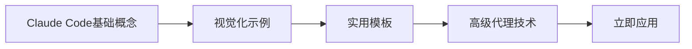
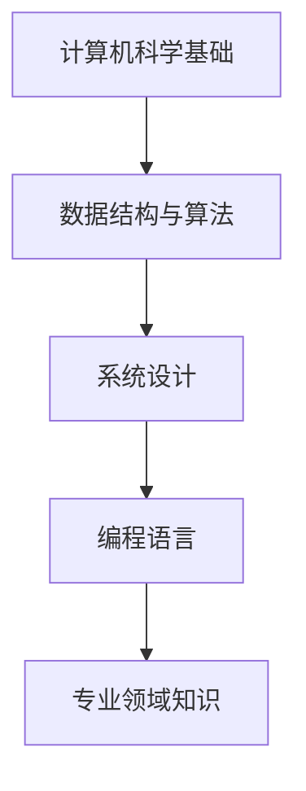
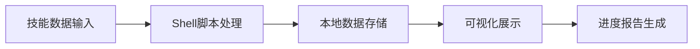
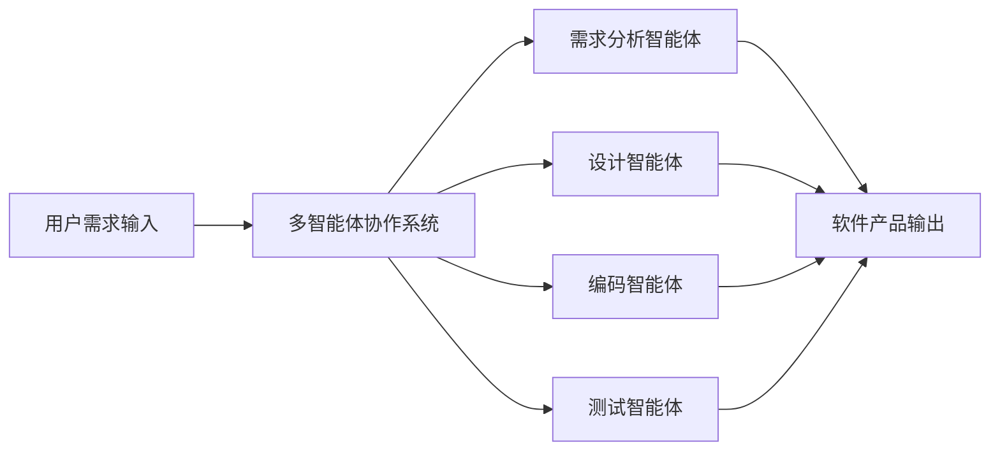

## 今日热点

Claude生态系统与AI代理技术今日引领GitHub热潮，多代理协作框架和最佳实践指南获得开发者高度关注，显示AI辅助开发工具正迅速成为主流。

---

## 热门项目一览

| 排名 | 项目 | 语言 | 今日 | 总计 | 简介 |
|:---:|------|:----:|------:|-----:|------|
| 1 | [microsoft/VibeVoice](https://github.com/microsoft/VibeVoice) | Python | +3,863 | 33,204 | Open-Source Frontier Voice AI |
| 2 | [obra/superpowers](https://github.com/obra/superpowers) | Shell | +2,620 | 128,251 | An agentic skills framework... |
| 3 | [shanraisshan/claude-code-best-practice](https://github.com/shanraisshan/claude-code-best-practice) | HTML | +2,407 | 28,774 | practice made claude perfect |
| 4 | [luongnv89/claude-howto](https://github.com/luongnv89/claude-howto) | Python | +2,390 | 13,202 | A visual, example-driven gu... |
| 5 | [NousResearch/hermes-agent](https://github.com/NousResearch/hermes-agent) | Python | +1,907 | 20,425 | The agent that grows with you |
| 6 | [Yeachan-Heo/oh-my-claudecode](https://github.com/Yeachan-Heo/oh-my-claudecode) | TypeScript | +1,126 | 19,155 | Teams-first Multi-agent orc... |
| 7 | [jwasham/coding-interview-university](https://github.com/jwasham/coding-interview-university) | Unknown | +873 | 339,664 | A complete computer science... |
| 8 | [sherlock-project/sherlock](https://github.com/sherlock-project/sherlock) | Python | +865 | 75,566 | Hunt down social media acco... |
| 9 | [PaddlePaddle/PaddleOCR](https://github.com/PaddlePaddle/PaddleOCR) | Python | +439 | 74,221 | Turn any PDF or image docum... |
| 10 | [vas3k/TaxHacker](https://github.com/vas3k/TaxHacker) | TypeScript | +318 | 3,756 | Self-hosted AI accounting a... |
| 11 | [microsoft/agent-lightning](https://github.com/microsoft/agent-lightning) | Python | +130 | 16,240 | The absolute trainer to lig... |
| 12 | [Dimillian/Skills](https://github.com/Dimillian/Skills) | Shell | +115 | 2,879 | My Codex Skills |

---

## 趋势洞察

```
┌─────────────────────────────────────────────────────────────────┐
│  AI/ML 工具         ████████████████████████  10 个项目        │
│  其他               ███████                   3 个项目        │
│  多媒体应用            ██                        1 个项目        │
└─────────────────────────────────────────────────────────────────┘
```

---

## 项目深度解读

### 1. microsoft/VibeVoice — 前沿语音AI

> **一句话总结**：微软开源的高性能语音AI系统，提供业界领先的语音识别与合成能力

#### 价值主张

| 维度 | 说明 |
|------|------|
| **解决痛点** | 传统语音AI在自然度、多语言支持及低资源部署上的局限性 |
| **目标用户** | AI开发者、语音应用构建者、智能语音产品研究人员 |
| **核心亮点** | 高自然度语音合成 + 多语言实时处理 + 轻量化部署方案 |

#### 技术架构


**技术特色**：
- 端到端深度学习语音处理架构
- 自适应多语言混合编码机制
- 量化优化技术实现低资源部署

#### 热度分析

- 项目单日增长超3800星，显示市场对前沿语音AI技术的强烈需求
- 作为微软开源项目，在AI开发社区具有重要影响力，有望成为语音AI领域新标准

#### 快速上手

```bash
# 克隆仓库
git clone https://github.com/microsoft/VibeVoice.git
cd VibeVoice

# 安装依赖并运行示例
pip install -r requirements.txt
python demo.py --input sample.wav
```

#### 注意事项

- 项目需要较高计算资源，建议使用GPU环境以获得最佳性能
- 模型文件较大，初次下载可能需要较长时间
- 需关注官方许可证信息，确保合规使用


### 2. obra/superpowers — 智能开发方法论

> **一句话总结**：这是一款结合AI代理与技能框架的实用软件开发方法论，强调高效协作与持续交付。

#### 价值主张

| 维度 | 说明 |
|------|------|
| **解决痛点** | 传统软件开发流程效率低下，缺乏AI时代的适应性方法论 |
| **目标用户** | 软件开发团队、AI工具开发者、追求高效工作流程的工程师 |
| **核心亮点** | AI集成 + 技能框架 + 开发方法论 + 实用工具 + 持续改进 |

#### 技术架构


**技术特色**：
- 基于Shell的轻量级工具集实现
- 模块化技能框架设计理念
- AI与开发流程深度融合架构

#### 热度分析

- 项目获得12万+星标，近期增长迅速，日均增长2600+，表明其在开发者社区引起强烈共鸣
- 零开放问题反映项目成熟度高，社区问题解决机制完善

#### 快速上手

```bash
# 克隆项目
git clone https://github.com/obra/superpowers.git
# 进入目录
cd superpowers
```

#### 注意事项

- 项目许可证未知，商业使用前需确认授权条款
- 作为方法论框架，实际应用需要团队理解和实践，而非简单安装
- 建议先阅读项目文档，理解其核心理念后再尝试应用


### 3. shanraisshan/claude-code-best-practice — AI代码实践指南

> **一句话总结**：提供Claude AI编程最佳实践，提升开发者与AI协作效率和质量。

#### 价值主张

| 维度 | 说明 |
|------|------|
| **解决痛点** | 解决开发者有效利用Claude编写高质量代码的问题 |
| **目标用户** | 使用Claude AI进行开发的程序员和技术团队 |
| **核心亮点** | 实用示例 + 最佳实践 + 提升AI协作效率 |

#### 技术架构


**技术特色**：
- 基于HTML构建的交互式学习界面
- 结构化的最佳实践展示方式
- 针对Claude AI优化的代码示例

#### 热度分析

- 项目获得近2.9万Star且单日增长显著，显示开发者对AI编程指南的高度需求
- 社区活跃度高，Fork数量表明项目被广泛采用和二次开发

#### 快速上手

```bash
# 克隆项目到本地
git clone https://github.com/shanraisshan/claude-code-best-practice.git

# 使用浏览器打开index.html查看内容
cd claude-code-best-practice && open index.html
```

#### 注意事项

- 项目主要关注Claude AI的使用，可能不适用于其他AI编程助手
- 需要结合实际开发场景调整建议，不能生搬硬套
- 随着AI技术发展，部分最佳实践可能需要更新


### 4. luongnv89/claude-howto — Claude代码指南

> **一句话总结**：Claude Code的视觉化示例指南，提供从基础到高级的实用模板，帮助用户快速上手。

#### 价值主张

| 维度 | 说明 |
|------|------|
| **解决痛点** | 解决Claude Code学习曲线陡峭、缺乏实践指导的问题 |
| **目标用户** | AI开发者、Claude用户、希望提升AI应用能力的技术人员 |
| **核心亮点** | 视觉化示例驱动 + 即用型模板 + 从基础到高级全覆盖 + 实践导向 + 易于理解 |

#### 技术架构



**技术特色**：
- 以视觉化方式呈现复杂概念，降低理解门槛
- 提供可直接复制粘贴的模板，提高开发效率
- 结构化内容组织，便于系统学习Claude Code

#### 热度分析

- 项目Star数高达13,202且近期增长迅速(+2,390 today)，表明Claude Code需求旺盛
- 高Fork数(1,442)和零Open Issues反映社区高度活跃且问题解决及时

#### 快速上手

```bash
# 克隆项目
git clone https://github.com/luongnv89/claude-howto.git

# 浏览目录结构
cd claude-howto && ls -la
```

#### 注意事项

- 项目依赖Claude API，确保已获取有效API密钥
- 模板可能需要根据具体使用场景进行适当调整
- 随着Claude API更新，部分示例可能需要同步更新


### 5. NousResearch/hermes-agent — 自成长智能代理

> **一句话总结**：一款能够随着用户需求增长而扩展的Python智能代理系统

#### 价值主张

| 维度 | 说明 |
|------|------|
| **解决痛点** | 提供可扩展、自适应的智能代理解决方案 |
| **目标用户** | 需要定制化AI代理的开发者和企业 |
| **核心亮点** | 模块化架构 + 自学习能力 + 可扩展设计 |

#### 技术架构


**技术特色**：
- 采用模块化设计，便于功能扩展
- 集成自学习机制，能适应用户需求变化
- 提供灵活的API接口，支持多种集成场景

#### 热度分析

- 项目在短时间内获得大量关注，近期增长迅速，日增星数近2000
- 社区活跃度高，表明该项目在智能代理领域具有较强吸引力

#### 快速上手

```bash
# 克隆仓库
git clone https://github.com/NousResearch/hermes-agent.git
cd hermes-agent

# 安装依赖并运行
pip install -r requirements.txt
python main.py
```

#### 注意事项

- 项目许可证未知，商业使用前需确认授权条款
- 开发者需具备Python和AI代理系统的基础知识


### 6. Yeachan-Heo/oh-my-claudecode — 团队AI编排

> **一句话总结**：为团队提供Claude Code多智能体协作框架，统一管理AI辅助编程工作流。

#### 价值主张

| 维度 | 说明 |
|------|------|
| **解决痛点** | 团队使用Claude Code时缺乏统一的任务分配与结果整合机制 |
| **目标用户** | 需要团队协作AI辅助编程的开发团队 |
| **核心亮点** | 多智能体协同 + 任务编排 + 团队知识库 + 结果整合 + 提示词管理 |

#### 技术架构


**技术特色**：
- 基于TypeScript构建的强类型架构，确保AI交互质量
- 多智能体并行处理框架，提升团队协作效率
- 团队级提示词管理，统一AI交互标准

#### 热度分析

- 项目获19k+ stars且单日增长超1k，显示AI协作工具市场热度高涨
- 0个open issues表明项目维护质量高，用户反馈处理及时

#### 快速上手

```bash
# 克隆仓库
git clone https://github.com/Yeachan-Heo/oh-my-claudecode.git

# 安装依赖
npm install
```

#### 注意事项

- 项目依赖Claude Code API，需确保网络连接稳定
- 团队使用前应建立统一的AI交互规范和知识库管理策略
- 由于License未知，商业使用前需确认授权条款


### 7. jwasham/coding-interview-university — 计算机科学学习指南

> **一句话总结**：完整的计算机科学学习路径，帮助求职者系统掌握软件工程师所需知识体系。

#### 价值主张

| 维度 | 说明 |
|------|------|
| **解决痛点** | 提供系统化的计算机科学学习路径，解决求职者知识零散问题 |
| **目标用户** | 准备软件工程师职位的求职者、转行者 |
| **核心亮点** | 学习路径清晰 + 资源全面 + 免费开放 + 社区支持 + 持续更新 |

#### 技术架构



**技术特色**：
- 覆盖计算机科学核心知识领域
- 结构化学习路径设计
- 实用资源与工具推荐

#### 热度分析

- 高星项目持续增长，日均增长约800+ stars，表明求职者对系统性学习资源需求旺盛
- Fork数高达8万+，反映社区活跃度高，用户积极参与学习路径实践与分享

#### 快速上手

```bash
# 克隆项目到本地
git clone https://github.com/jwasham/coding-interview-university.git

# 使用README.md作为学习指南
# 按照推荐顺序逐步学习各主题资源
```

#### 注意事项

- 本项目提供学习路径和资源链接，但需要学习者投入大量时间和精力实践
- 部分资源链接可能已过时，建议定期检查更新或寻找替代资源
- 学习过程中应注重动手实践，而非仅阅读理论内容


### 8. sherlock-project/sherlock — 社交媒体账户搜索工具

> **一句话总结**：跨平台社交媒体账户搜索工具，通过用户名快速定位目标在各平台的账号存在情况。

#### 价值主张

| 维度 | 说明 |
|------|------|
| **解决痛点** | 解决了在多个社交平台查找同一用户账号效率低下的问题 |
| **目标用户** | 安全研究人员、数字取证专家、隐私关注者 |
| **核心亮点** | 多平台覆盖 + 批量查询能力 + 精确匹配算法 + 开源可定制 |

#### 技术架构


**技术特色**：
- 采用模块化设计，每个社交平台独立实现查询接口
- 使用异步IO提高多平台查询效率
- 内置代理支持，规避平台反爬机制

#### 热度分析

- 项目star数超过7.5万，月增长约800+，表明在数字安全和隐私领域需求旺盛
- 作为开源工具，在安全社区和数字取证领域具有显著影响力，是相关从业者必备工具之一

#### 快速上手

```bash
# 克隆项目
git clone https://github.com/sherlock-project/sherlock.git

# 安装依赖
pip install -r requirements.txt

# 运行搜索
python sherlock.py username
```

#### 注意事项

- 请遵守各平台的使用条款，不要滥用此工具进行未授权的用户信息收集
- 部分平台可能有反爬机制，建议合理设置查询间隔
- 某些平台的查询结果可能不准确，建议结合其他方法验证


### 9. PaddlePaddle/PaddleOCR — 全能OCR工具

> **一句话总结**：强大轻量的OCR工具包，可转换图像/PDF为AI可用的结构化数据，支持100+语言。

#### 价值主张

| 维度 | 说明 |
|------|------|
| **解决痛点** | 解决图像/PDF文档难以被AI直接理解和处理的问题 |
| **目标用户** | 需要处理文档数据的AI开发者、研究人员和企业 |
| **核心亮点** | 多语言支持 + 与LLM无缝集成 + 轻量级设计 |

#### 技术架构


**技术特色**：
- 基于PaddlePaddle深度学习框架的高精度OCR技术
- 支持100+语言识别，覆盖多语言场景需求
- 与大型语言模型(LLM)无缝集成，构建文档到AI的桥梁

#### 热度分析

- Star数74,221且持续增长(+439 today)，表明项目受到广泛关注和认可
- Fork数10,119，显示社区活跃度高，开发者积极参与项目贡献和二次开发

#### 快速上手

```bash
# 安装PaddleOCR
pip install paddlepaddle paddleocr

# 基本使用示例
from paddleocr import PaddleOCR
ocr = PaddleOCR(use_angle_cls=True, lang='ch')
result = ocr.ocr('example.jpg', cls=True)
print(result)
```

#### 注意事项

- 由于项目基于PaddlePaddle框架，需要考虑PaddlePaddle的依赖和兼容性问题
- 多语言支持虽然强大，但不同语言的识别精度可能存在差异
- 处理复杂版面或低质量图像时可能需要额外的参数调整
- 对于大规模文档处理，可能需要考虑性能优化和资源消耗


### 10. vas3k/TaxHacker — AI会计助手

> **一句话总结**：自托管AI会计应用，利用大语言模型智能分析收据发票，自动化财务记录分类

#### 价值主张

| 维度 | 说明 |
|------|------|
| **解决痛点** | 简化个人和小企业会计流程，消除手动记录分类的繁琐工作 |
| **目标用户** | 小企业主、自由职业者、需要高效管理个人财务的用户 |
| **核心亮点** | 自托管隐私保护 + LLM智能分析 + 自定义分类系统 + 多格式文档处理 |

#### 技术架构


**技术特色**：
- 基于大语言模型的智能文档解析与理解能力
- 自托管架构确保用户数据隐私与安全
- 支持自定义提示和分类规则，灵活适应不同会计需求

#### 热度分析

- 项目增长迅猛，单日新增Star数超300，显示市场对AI会计解决方案的高度认可
- 作为自托管应用，在数据隐私敏感领域具有独特竞争优势，吸引注重安全的用户群体

#### 快速上手

```bash
# 克隆仓库
git clone https://github.com/vas3k/TaxHacker.git
# 安装依赖
npm install
# 启动应用
npm run dev
```

#### 注意事项

- 需自行配置大语言模型API，可能涉及额外成本
- 自托管部署需要一定技术基础，不适合非技术用户
- 项目未明确许可证，使用前需确认授权条款


### 11. microsoft/agent-lightning — AI代理训练器

> **一句话总结**：微软推出的AI代理高效训练框架，简化智能体开发流程与部署。

#### 价值主张

| 维度 | 说明 |
|------|------|
| **解决痛点** | 降低AI代理训练门槛，提供一站式开发解决方案 |
| **目标用户** | AI研究人员、智能体开发者、企业应用团队 |
| **核心亮点** | 微软技术支持 + 模块化设计 + 高性能训练 + 易于集成 |

#### 技术架构


**技术特色**：
- 基于PyTorch构建的高性能训练引擎
- 提供丰富的预置代理模型和算法库
- 支持分布式训练与多环境并行

#### 热度分析

- 项目获得16k+星标且持续增长，显示AI代理开发领域的高关注度
- 微软背书加上实用价值，使其成为企业级AI代理开发的重要工具

#### 快速上手

```bash
# 安装agent-lightning
pip install agent-lightning

# 初始化项目
agent-lightning init my_agent

# 开始训练
agent-lightning train --config default.yaml
```

#### 注意事项

- 需要Python 3.7+环境支持
- 建议在GPU环境下以获得最佳训练性能
- 部分高级功能可能需要额外配置API密钥


### 12. Dimillian/Skills — 技能管理工具集

> **一句话总结**：Shell编写的个人技能追踪与展示系统，帮助开发者系统化管理技术能力图谱。

#### 价值主张

| 维度 | 说明 |
|------|------|
| **解决痛点** | 技能分散记录，难以系统化追踪和展示个人技术成长轨迹 |
| **目标用户** | 注重技术成长与能力展示的开发者和技术管理者 |
| **核心亮点** | 命令行交互界面 + 技能可视化展示 + 进度自动追踪 + 多维度分类管理 + 数据本地存储 |

#### 技术架构



**技术特色**：
- 纯Shell实现，无需依赖，即装即用
- 本地数据存储，保护隐私，无需网络
- 模块化设计，易于扩展和定制

#### 热度分析

- 项目获星数接近3k，日增115星，呈快速增长趋势，表明技能管理需求旺盛
- Fork数相对较少，更多用户将其作为个人技能管理参考而非二次开发

#### 快速上手

```bash
git clone https://github.com/Dimillian/Skills.git
cd Skills
chmod +x skills.sh && ./skills.sh
```

#### 注意事项

- 需要基本的Shell环境支持，建议在Linux/macOS系统上运行
- 数据存储在本地，建议定期备份技能数据文件
- 可能需要根据个人需求调整技能分类和评估标准


### 13. neovim/neovim — 现代化 Vim 编辑器

> **一句话总结**：Neovim 在保留 Vim 核心功能的同时，通过架构重构和现代化改进，提供更强大的可扩展性和更好的用户体验。

#### 价值主张

| 维度 | 说明 |
|------|------|
| **解决痛点** | 解决 Vim 架构限制，实现插件系统现代化，支持异步处理和 API 扩展 |
| **目标用户** | 需要高度可定制化编辑器的开发者和系统管理员 |
| **核心亮点** | 架构重构 + 异步处理支持 + 插件系统现代化 + API 扩展 + 更好的默认配置 |

#### 技术架构


**技术特色**：
- 采用异步架构处理耗时操作，避免界面卡顿
- 提供了丰富的 API 接口，支持多种编程语言开发插件
- 基于 msgpack 的远程消息传递机制，实现进程间通信

#### 热度分析

- 项目 Star 数接近 10 万，持续稳定增长，表明其在开发者社区中拥有极高认可度
- 作为 Vim 的现代化分支，已成为 Vim 生态系统的核心项目，引领编辑器发展方向

#### 快速上手

```bash
# macOS 安装
brew install neovim

# Ubuntu/Debian 安装
sudo apt-get install neovim

# 验证安装
nvim --version
```

#### 注意事项

- Neovim 与 Vim 大部分配置兼容，但仍存在少量差异
- 插件生态系统正在快速发展，部分 Vim 插件可能需要适配
- 配置文件位置已更改，主要在 ~/.config/nvim/ 目录下


### 14. OpenBMB/ChatDev — AI协作开发框架

> **一句话总结**：通过LLM驱动的多智能体协作实现全流程软件开发，革新传统开发模式。

#### 价值主张

| 维度 | 说明 |
|------|------|
| **解决痛点** | 传统软件开发流程复杂、周期长、人力成本高，通过AI协作简化开发流程 |
| **目标用户** | 软件开发团队、AI研究者、企业技术部门、独立开发者 |
| **核心亮点** | + 多智能体协作架构 + 大语言模型驱动 + 全流程软件开发支持 + 可扩展的智能体生态 |

#### 技术架构



**技术特色**：
- 基于大语言模型的多智能体协作架构
- 模块化智能体设计，支持自定义扩展
- 全流程软件开发支持，从需求到测试

#### 热度分析

- 项目Star数超3.2万且持续增长，显示开发社区对AI协作开发工具的高度关注
- 在AI辅助开发领域处于领先地位，吸引大量研究者和开发者参与

#### 快速上手

```bash
# 克隆项目
git clone https://github.com/OpenBMB/ChatDev.git
cd ChatDev

# 安装依赖
pip install -r requirements.txt

# 运行示例
python main.py --task develop --product_type web_app --description "一个简单的博客网站"
```

#### 注意事项

- 需要配置大语言模型API密钥（如OpenAI API）
- 项目依赖大量第三方库，建议使用虚拟环境
- 可能需要较强的计算资源，特别是对于大型项目开发


## 今日推荐

| 主题 | 推荐项目 | 亮点 |
|------|----------|------|
| 今日最热 | [microsoft/VibeVoice](https://github.com/microsoft/VibeVoice) | Open-Source Front... |
| 值得关注 | [obra/superpowers](https://github.com/obra/superpowers) | An agentic skills... |
| 快速上手 | [shanraisshan/claude-code-best-practice](https://github.com/shanraisshan/claude-code-best-practice) | practice made cla... |
| 长期潜力 | [luongnv89/claude-howto](https://github.com/luongnv89/claude-howto) | A visual, example... |

---

<div align="center">

*Generated on 2026-04-01 | Powered by GitHub Trending Reporter*

</div>