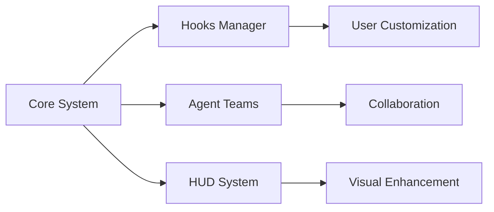

## 今日热点

AI系统提示提取与开发者效率工具今日引领GitHub热榜，表明社区对AI透明度和编码体验提升的强烈关注。

---

## 热门项目一览

| 排名 | 项目 | 语言 | 今日 | 总计 | 简介 |
|:---:|------|:----:|------:|-----:|------|
| 1 | [Yeachan-Heo/oh-my-codex](https://github.com/Yeachan-Heo/oh-my-codex) | TypeScript | +2,867 | 11,772 | OmX - Oh My codeX: Your cod... |
| 2 | [siddharthvaddem/openscreen](https://github.com/siddharthvaddem/openscreen) | TypeScript | +2,573 | 15,933 | Create stunning demos for f... |
| 3 | [sherlock-project/sherlock](https://github.com/sherlock-project/sherlock) | Python | +827 | 77,296 | Hunt down social media acco... |
| 4 | [asgeirtj/system_prompts_leaks](https://github.com/asgeirtj/system_prompts_leaks) | Unknown | +306 | 36,385 | Extracted system prompts fr... |

---

## 趋势洞察

```
┌─────────────────────────────────────────────────────────────────┐
│  AI/ML 工具         ████████████████████████  2 个项目        │
│  多媒体应用            ████████████              1 个项目        │
│  其他               ████████████              1 个项目        │
└─────────────────────────────────────────────────────────────────┘
```

---

## 项目深度解读

### 1. Yeachan-Heo/oh-my-codex — 开发者增强平台

> **一句话总结**：扩展开发者能力，通过hooks、代理团队和HUDs增强编码体验与协作效率。

#### 价值主张

| 维度 | 说明 |
|------|------|
| **解决痛点** | 开发环境功能有限，缺乏可扩展的协作与界面增强工具 |
| **目标用户** | 追求高效协作与定制化开发环境的进阶开发者 |
| **核心亮点** | 自定义hooks支持 + 代理团队协作 + HUDs界面增强 + 可扩展架构 |

#### 技术架构



**技术特色**：
- TypeScript构建，确保类型安全与开发体验
- 模块化插件架构，支持灵活扩展与定制
- 提供丰富API接口，便于第三方集成

#### 热度分析

- 项目短期内获得大量关注，单日星标增长超2800，显示开发者高度认可
- 社区活跃度高，零开放问题表明项目维护状态良好，生态正在形成

#### 快速上手

```bash
# 克隆项目
git clone https://github.com/Yeachan-Heo/oh-my-codex.git

# 安装依赖
npm install
```

#### 注意事项

- 项目许可证信息不明确，使用前需确认授权条款
- 作为新兴项目，API可能仍在迭代中，生产环境使用需关注兼容性更新


### 2. siddharthvaddem/openscreen — 开源演示工具

> **一句话总结**：免费无水印的屏幕录制与演示制作工具，替代付费Screen Studio的开源选择。

#### 价值主张

| 维度 | 说明 |
|------|------|
| **解决痛点** | 提供专业级屏幕录制功能，消除水印和订阅费用限制 |
| **目标用户** | 开发者、教育工作者、营销人员及内容创作者 |
| **核心亮点** | 开源免费 + 无水印 + 商业友好 + 专业效果 + 易于上手 |

#### 技术架构


**技术特色**：
- 基于TypeScript构建，确保代码质量和类型安全
- 高效屏幕捕获技术，支持高分辨率录制
- 内置专业级视频效果处理引擎

#### 热度分析

- 项目单日增长超2.5k星，表明用户对免费专业演示工具有强烈需求
- 零开放问题反映项目维护状况良好，社区信任度高

#### 快速上手

```bash
# 克隆仓库
git clone https://github.com/siddharthvaddem/openscreen.git

# 安装依赖
npm install

# 启动应用
npm start
```

#### 注意事项

- 项目许可证未知，商业使用前需确认具体授权条款
- 项目近期热度高，可能处于快速迭代中，功能可能会有变动


### 3. sherlock-project/sherlock — [社交账号猎手]

> **一句话总结**：跨平台社交媒体账号搜索引擎，通过用户名一键查找全网社交账户。

#### 价值主张

| 维度 | 说明 |
|------|------|
| **解决痛点** | 解决在多个社交平台分散查找用户账号的繁琐问题 |
| **目标用户** | 安全研究人员、数字取证专家、普通用户 |
| **核心亮点** | 跨平台支持 + 批量查询 + 精准匹配 + 开源免费 |

#### 技术架构


**技术特色**：
- 支持数百个社交媒体平台和网站
- 采用模块化设计便于扩展新平台
- 异步请求提高查询效率

#### 热度分析

- 项目Star数高达77K，近一个月新增827星，显示持续活跃且受欢迎
- Fork数量9K+，表明社区参与度高，被广泛用于二次开发

#### 快速上手

```bash
# 克隆项目
git clone https://github.com/sherlock-project/sherlock.git

# 安装依赖
pip install -r requirements.txt

# 运行查询
python sherlock.py username
```

#### 注意事项

- 部分平台可能有反爬虫机制，频繁查询可能导致IP被封
- 使用时应遵守各平台的服务条款，避免滥用
- 项目没有明确的许可证声明，使用时需注意法律风险


### 4. asgeirtj/system_prompts_leaks — AI提示词库

> **一句话总结**：收集并定期更新多个主流AI模型的系统提示词，为AI研究人员提供直接参考资源。

#### 价值主张

| 维度 | 说明 |
|------|------|
| **解决痛点** | 解决AI研究者难以获取各模型内部系统提示词的难题 |
| **目标用户** | AI研究人员、大模型开发者、提示词工程师 |
| **核心亮点** | 多平台覆盖 + 定期更新 + 直接获取官方提示词 + 无需逆向工程 |

#### 热度分析

- 项目获得超3.6万星，单日增长300+，显示AI提示词研究领域的高关注度
- 无开放问题表明项目维护稳定，社区贡献可能通过PR或其他渠道进行

#### 快速上手

```bash
# 克隆项目
git clone https://github.com/asgeirtj/system_prompts_leaks.git

# 查看最新收集的提示词
cat README.md
```

#### 注意事项

- 提示词可能随模型更新而变化，需关注项目更新
- 部分提示词可能包含敏感信息，使用时需注意合规性
- 不同模型的提示词格式和内容差异较大，需针对性分析


## 今日推荐

| 主题 | 推荐项目 | 亮点 |
|------|----------|------|
| 今日最热 | [Yeachan-Heo/oh-my-codex](https://github.com/Yeachan-Heo/oh-my-codex) | OmX - Oh My codeX... |
| 值得关注 | [siddharthvaddem/openscreen](https://github.com/siddharthvaddem/openscreen) | Create stunning d... |
| 快速上手 | [sherlock-project/sherlock](https://github.com/sherlock-project/sherlock) | Hunt down social ... |
| 长期潜力 | [asgeirtj/system_prompts_leaks](https://github.com/asgeirtj/system_prompts_leaks) | Extracted system ... |

---

<div align="center">

*Generated on 2026-04-03 | Powered by GitHub Trending Reporter*

</div>