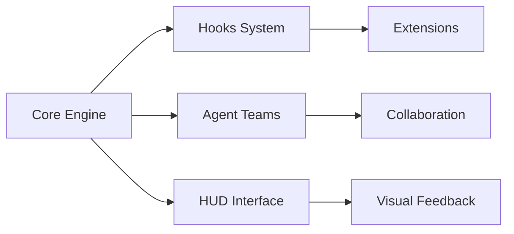

## 今日热点

今日GitHub热榜以AI工具与开发效率平台为主导，开源AI平台和代码增强工具获得显著增长，同时社区化提示词资源持续受到关注，反映开发者对AI赋能与效率提升的双重需求。

---

## 热门项目一览

| 排名 | 项目 | 语言 | 今日 | 总计 | 简介 |
|:---:|------|:----:|------:|-----:|------|
| 1 | [Yeachan-Heo/oh-my-codex](https://github.com/Yeachan-Heo/oh-my-codex) | TypeScript | +3,047 | 14,146 | OmX - Oh My codeX: Your cod... |
| 2 | [siddharthvaddem/openscreen](https://github.com/siddharthvaddem/openscreen) | TypeScript | +2,771 | 18,216 | Create stunning demos for f... |
| 3 | [onyx-dot-app/onyx](https://github.com/onyx-dot-app/onyx) | Python | +1,852 | 23,287 | Open Source AI Platform - A... |
| 4 | [sherlock-project/sherlock](https://github.com/sherlock-project/sherlock) | Python | +1,192 | 78,523 | Hunt down social media acco... |
| 5 | [google-research/timesfm](https://github.com/google-research/timesfm) | Python | +916 | 14,127 | TimesFM (Time Series Founda... |
| 6 | [dmtrKovalenko/fff.nvim](https://github.com/dmtrKovalenko/fff.nvim) | Rust | +750 | 3,268 | The fastest and the most ac... |
| 7 | [f/prompts.chat](https://github.com/f/prompts.chat) | HTML | +375 | 157,190 | f.k.a. Awesome ChatGPT Prom... |

---

## 趋势洞察

```
┌─────────────────────────────────────────────────────────────────┐
│  AI/ML 工具         ████████████████████████  5 个项目        │
│  多媒体应用            ████                      1 个项目        │
│  其他               ████                      1 个项目        │
└─────────────────────────────────────────────────────────────────┘
```

---

## 项目深度解读

### 1. Yeachan-Heo/oh-my-codex — 代码智能扩展

> **一句话总结**：通过hooks、agent teams和HUDs增强编码体验的智能扩展工具。

#### 价值主张

| 维度 | 说明 |
|------|------|
| **解决痛点** | 传统编码环境缺乏扩展性和智能化辅助功能 |
| **目标用户** | 寻求提升编码效率和体验的开发者 |
| **核心亮点** | 提供hooks系统 + agent teams协作 + HUD可视化界面 |

#### 技术架构



**技术特色**：
- 基于TypeScript构建的类型安全扩展系统
- 模块化设计支持多种插件
- 提供丰富的API接口供开发者扩展

#### 热度分析

- 项目Star数达14,146且单日增长3,047，表明近期获得极大关注
- 无Open Issues显示项目维护良好，社区反馈机制可能通过其他渠道

#### 快速上手

```bash
npm install -g oh-my-codex
oh-my-codex init
```

#### 注意事项

- 项目许可证未知，使用前需确认开源许可条款
- 近期热度高但稳定性可能需要进一步验证
- 需要一定的TypeScript和扩展开发经验才能充分利用


### 2. siddharthvaddem/openscreen — 免费演示录制

> **一句话总结**：开源无水印的屏幕录制工具，提供专业演示制作能力，可免费用于商业用途。

#### 价值主张

| 维度 | 说明 |
|------|------|
| **解决痛点** | 提供专业级屏幕录制功能，无需付费订阅且无水印 |
| **目标用户** | 需要创建演示视频的开发者、内容创作者和营销人员 |
| **核心亮点** | 开源免费 + 无水印 + 商业使用 + 专业质量 + 跨平台支持 |

#### 技术架构


**技术特色**：
- 基于TypeScript构建，提供类型安全
- 高效的屏幕捕获技术，确保流畅录制
- 模块化设计，便于扩展和定制

#### 热度分析

- 项目star数快速增长，近期增长超过2700，表明用户需求强烈
- 作为Screen Studio的开源替代品，填补了免费专业录屏工具的市场空白

#### 快速上手

```bash
# 克隆项目
git clone https://github.com/siddharthvaddem/openscreen.git

# 安装依赖并运行
cd openscreen && npm install && npm start
```

#### 注意事项

- 项目许可证未知，商业使用前需确认授权条款
- 作为较新的项目，可能存在一些功能限制或bug


### 3. onyx-dot-app/onyx — 全栈AI聊天平台

> **一句话总结**：开源AI聊天平台，支持多种大语言模型，提供高级对话功能。

#### 价值主张

| 维度 | 说明 |
|------|------|
| **解决痛点** | 统一接口对接多LLM，解决模型切换与兼容性问题 |
| **目标用户** | 开发者、AI研究者、需要多模型支持的普通用户 |
| **核心亮点** | 支持所有主流LLM + 端到端加密 + 本地部署 + 高级聊天功能 |

#### 技术架构


**技术特色**：
- 多LLM统一适配层架构
- 端到端加密保障隐私安全
- 支持本地部署无需云端依赖

#### 热度分析

- 单日增长1852星，表明项目近期热度极高，功能获得广泛认可
- 零开放Issues反映项目成熟度高，社区问题解决机制高效

#### 快速上手

```bash
# 克隆项目
git clone https://github.com/onyx-dot-app/onyx.git

# 安装依赖
pip install -r requirements.txt

# 启动服务
python app.py
```

#### 注意事项

- 项目可能需要较高的计算资源，特别是使用本地LLM时
- 配置不同LLM可能需要额外的API密钥或本地模型文件
- 确保系统已安装Python 3.8+版本以兼容项目依赖


### 4. sherlock-project/sherlock — 社交媒体账号搜索

> **一句话总结**：跨平台社交媒体账号搜索工具，通过用户名快速定位各大平台的账户存在情况。

#### 价值主张

| 维度 | 说明 |
|------|------|
| **解决痛点** | 社交媒体账号分散难寻，一键查找用户名在各平台的存在情况 |
| **目标用户** | 网络安全研究员、数字取证专家、普通用户身份验证 |
| **核心亮点** | 支持数百个社交网络平台 + 多种输出格式 + 持续更新的平台列表 |

#### 技术架构


**技术特色**：
- 采用异步并发搜索提高效率
- 使用模块化设计便于添加新平台
- 实现了错误处理和重试机制

#### 热度分析

- 项目Star数超过78k，近期增长迅速，日均增长约1.2k，表明社区高度认可
- 作为网络安全领域的实用工具，在数字取证和安全评估领域具有重要生态价值

#### 快速上手

```bash
# 克隆项目
git clone https://github.com/sherlock-project/sherlock.git

# 安装依赖
pip install -r requirements.txt

# 运行搜索
python sherlock.py username
```

#### 注意事项

- 使用时需遵守各平台的使用条款，避免滥用导致法律风险
- 部分平台可能有反爬虫机制，建议适当控制请求频率
- 搜索结果仅供参考，不能保证100%准确性


### 5. google-research/timesfm — 时序基础模型

> **一句话总结**：Google Research开发的预训练时间序列基础模型，实现高效准确的时间序列预测。

#### 价值主张

| 维度 | 说明 |
|------|------|
| **解决痛点** | 传统时序预测需大量标注数据，模型泛化能力有限 |
| **目标用户** | 数据科学家、时序分析师、预测业务指标的专业人士 |
| **核心亮点** | 预训练基础模型 + 高精度预测 + 跨领域泛化能力 + 易于集成 |

#### 技术架构


**技术特色**：
- 采用Transformer架构处理时序数据
- 预训练-微调范式提升模型泛化能力
- 支持不同长度和粒度的时间序列输入

#### 热度分析

- 单日Star增长916，项目获得高度关注，表明时序预测领域需求旺盛
- 由Google Research开发，背靠强大研究团队，在时序预测领域具有权威性

#### 快速上手

```bash
# 安装TimesFM
pip install timesfm

# 基本使用示例
import timesfm
model = timesfm.TimesFM()
model.pretrain(data)
predictions = model.forecast(historical_data, horizon=30)
```

#### 注意事项

- 模型需要大量计算资源进行训练，建议在GPU环境中运行
- 作为基础模型，可能需要针对特定领域进行微调以获得最佳性能
- 项目文档尚需进一步完善，可能增加使用门槛


### 6. dmtrKovalenko/fff.nvim — 超快文件搜索

> **一句话总结**：基于 Rust 构建的高性能跨语言文件搜索工具，专为 Neovim 和 AI 代理优化。

#### 价值主张

| 维度 | 说明 |
|------|------|
| **解决痛点** | 传统文件搜索在大型项目中速度慢、准确性差，影响开发效率 |
| **目标用户** | Neovim 用户、AI 代理开发者、多语言项目开发者 |
| **核心亮点** | 极快的搜索速度 + 高准确性 + 跨语言支持 + 低资源占用 + AI 代理友好 |

#### 技术架构


**技术特色**：
- 使用 Rust 语言实现，保证高性能
- 采用特殊数据结构加速搜索算法
- 针对大型项目和多语言环境优化

#### 热度分析

- 项目 Star 数达 3,268，单日增长 750，表明近期受到广泛关注，可能因重大更新解决实际痛点
- 0 个 Open Issues 显示项目维护良好，在追求效率的开发者社区中活跃度高

#### 快速上手

```bash
# 使用 vim-plug 安装
Plug 'dmtrKovalenko/fff.nvim'
# 在配置中启用
lua require('fff').setup()
```

#### 注意事项

- 项目需要 Rust 环境来编译或运行
- 作为 Neovim 插件主要面向 Neovim 用户，其他语言环境支持可能有限
- 实际性能可能取决于项目规模和硬件配置


### 7. f/prompts.chat — AI提示词库

> **一句话总结**：全球最大的ChatGPT提示词共享库，提供海量实用提示词，支持自托管保护隐私。

#### 价值主张

| 维度 | 说明 |
|------|------|
| **解决痛点** | 解决AI提示词零散、质量参差不齐的问题，提供经过验证的高质量提示词集合 |
| **目标用户** | AI开发者、研究人员、内容创作者及所有希望提高AI使用效率的用户 |
| **核心亮点** | 海量高质量提示词 + 社区驱动更新 + 完全开源可自托管 + 隐私保护 |

#### 技术架构

**技术特色**：
- 纯静态HTML实现，部署简单
- 轻量级设计，加载速度快
- 开源可自托管，数据完全控制权在用户手中

#### 热度分析

- Star数超15万且持续增长，显示其在AI提示词领域的领先地位和社区认可度
- 作为AI工具生态中的重要资源项目，社区活跃度高，贡献者众多

#### 快速上手

```bash
# 克隆仓库
git clone https://github.com/f/prompts.chat.git

# 使用本地服务器运行
cd prompts.chat
python -m http.server 8000
```

#### 注意事项

- 项目未明确许可证信息，在使用前需确认授权条款
- 提示词质量参差不齐，使用前需验证效果
- 自托管需要一定的技术基础，非技术人员可能需要寻求帮助


## 今日推荐

| 主题 | 推荐项目 | 亮点 |
|------|----------|------|
| 今日最热 | [Yeachan-Heo/oh-my-codex](https://github.com/Yeachan-Heo/oh-my-codex) | OmX - Oh My codeX... |
| 值得关注 | [siddharthvaddem/openscreen](https://github.com/siddharthvaddem/openscreen) | Create stunning d... |
| 快速上手 | [onyx-dot-app/onyx](https://github.com/onyx-dot-app/onyx) | Open Source AI Pl... |
| 长期潜力 | [sherlock-project/sherlock](https://github.com/sherlock-project/sherlock) | Hunt down social ... |

---

<div align="center">

*Generated on 2026-04-04 | Powered by GitHub Trending Reporter*

</div>