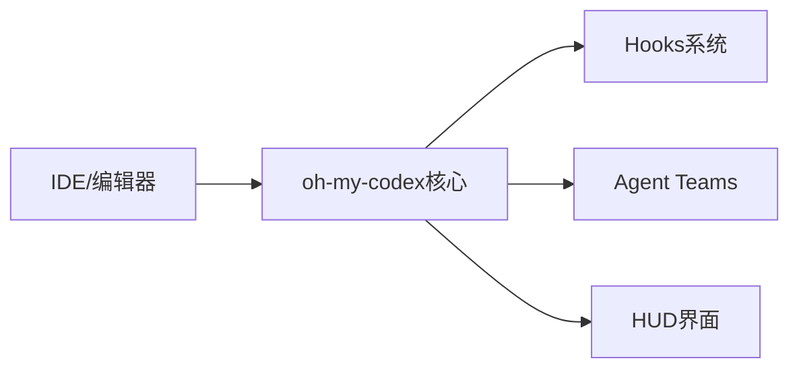
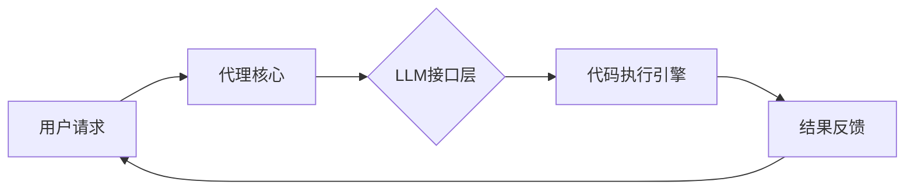
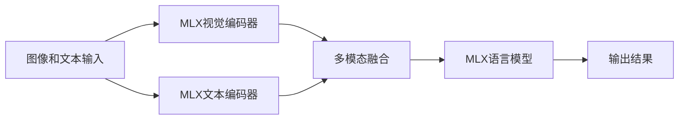
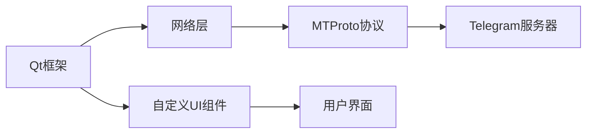
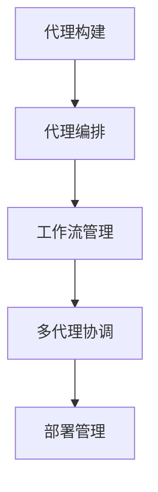

## 今日热点

今日GitHub热榜聚焦AI代理框架与多模态模型，开发者积极构建可扩展的AI系统，同时涌现出增强开发体验的工具和商业软件的开源替代方案。

---

## 热门项目一览

| 排名 | 项目 | 语言 | 今日 | 总计 | 简介 |
|:---:|------|:----:|------:|-----:|------|
| 1 | [Yeachan-Heo/oh-my-codex](https://github.com/Yeachan-Heo/oh-my-codex) | TypeScript | +1,789 | 15,681 | OmX - Oh My codeX: Your cod... |
| 2 | [siddharthvaddem/openscreen](https://github.com/siddharthvaddem/openscreen) | TypeScript | +1,591 | 19,998 | Create stunning demos for f... |
| 3 | [onyx-dot-app/onyx](https://github.com/onyx-dot-app/onyx) | Python | +1,197 | 24,275 | Open Source AI Platform - A... |
| 4 | [sherlock-project/sherlock](https://github.com/sherlock-project/sherlock) | Python | +994 | 79,386 | Hunt down social media acco... |
| 5 | [block/goose](https://github.com/block/goose) | Rust | +935 | 35,713 | an open source, extensible ... |
| 6 | [Blaizzy/mlx-vlm](https://github.com/Blaizzy/mlx-vlm) | Python | +343 | 3,611 | MLX-VLM is a package for in... |
| 7 | [telegramdesktop/tdesktop](https://github.com/telegramdesktop/tdesktop) | C++ | +249 | 30,840 | Telegram Desktop messaging app |
| 8 | [microsoft/agent-framework](https://github.com/microsoft/agent-framework) | Python | +72 | 8,713 | A framework for building, o... |

---

## 趋势洞察

```
┌─────────────────────────────────────────────────────────────────┐
│  AI/ML 工具         ████████████████████████  5 个项目        │
│  其他               █████████                 2 个项目        │
│  多媒体应用            ████                      1 个项目        │
└─────────────────────────────────────────────────────────────────┘
```

---

## 项目深度解读

### 1. Yeachan-Heo/oh-my-codex — 代码增强工具

> **一句话总结**：为开发者提供hooks、代理团队和HUD界面的代码体验增强工具。

#### 价值主张

| 维度 | 说明 |
|------|------|
| **解决痛点** | 开发工具功能单一，缺乏智能辅助和可视化界面 |
| **目标用户** | 寻求提升开发效率的开发者和编程爱好者 |
| **核心亮点** | 智能hooks系统 + 代码代理团队 + 可视化HUD界面 |

#### 技术架构



**技术特色**：
- 基于TypeScript构建，提供类型安全的扩展能力
- 模块化设计，支持多种IDE和编辑器集成
- 插件化架构，便于功能扩展和定制化配置

#### 热度分析

- 项目获得15,681个星标，单日增长1,789，表明近期热度急剧上升
- Fork数1,471显示社区积极参与，可能成为开发者工具领域的新兴热门项目

#### 快速上手

```bash
# 安装oh-my-codex
npm install -g oh-my-codex

# 初始化配置
omx init

# 启用增强功能
omx enable
```

#### 注意事项

- 需要确保与目标IDE/编辑器的兼容性
- 部分高级功能可能需要额外的配置或插件支持


### 2. siddharthvaddem/openscreen — 免费演示工具

> **一句话总结**：开源免费无水印的屏幕录制演示工具，提供专业级效果，支持商业使用。

#### 价值主张

| 维度 | 说明 |
|------|------|
| **解决痛点** | 提供免费、专业、无水印的屏幕演示解决方案，替代付费工具 |
| **目标用户** | 内容创作者、教育工作者、产品经理、营销人员 |
| **核心亮点** | 开源免费 + 无水印 + 商业友好 + 专业效果 + 易于使用 |

#### 技术架构


**技术特色**：
- 使用TypeScript构建，确保类型安全和跨平台兼容性
- 高效的屏幕捕获技术，支持高帧率和清晰度
- 内置多种演示效果和模板，简化专业演示创建过程
- 轻量级架构设计，资源占用低

#### 热度分析

- 项目Star数近2万，单日增长超1500，表明社区高度认可和需求旺盛
- 零开放Issues反映项目维护状态良好，用户体验问题得到及时处理
- 作为Screen Studio的替代品，成功填补了开源免费市场的空白

#### 快速上手

```bash
# 克隆项目
git clone https://github.com/siddharthvaddem/openscreen.git

# 安装依赖
cd openscreen
npm install

# 启动应用
npm start
```

#### 注意事项

- 项目License未知，商业使用前需确认授权条款
- 需要确保系统满足最低硬件要求，以获得最佳录制体验
- 部分高级功能可能需要额外的系统权限配置


### 3. onyx-dot-app/onyx — 全能AI平台

> **一句话总结**：开源全能AI聊天平台，支持多种大语言模型，提供高级对话功能。

#### 价值主张

| 维度 | 说明 |
|------|------|
| **解决痛点** | 统一接口使用多种LLM，解决模型切换与功能整合难题 |
| **目标用户** | AI开发者、研究人员及高级AI用户 |
| **核心亮点** | 支持多LLM模型 + 开源可定制 + 高级对话功能 + 本地部署能力 + 统一API接口 |

#### 技术架构


**技术特色**：
- 基于Python构建的全栈AI聊天平台
- 统一的LLM适配层，无缝对接多种模型
- 开源架构，支持本地部署和功能定制

#### 热度分析

- Star数24,275且今日增长1,197，表明项目近期热度极高，增长迅猛
- Fork数3,255，显示社区参与度高，开发者积极贡献和二次开发

#### 快速上手

```bash
# 克隆项目
git clone https://github.com/onyx-dot-app/onyx.git
cd onyx
# 安装依赖
pip install -r requirements.txt
# 运行项目
python app.py
```

#### 注意事项

- 需要配置各种LLM的API密钥
- 可能需要较高的计算资源，特别是本地运行大模型时
- 项目许可证不明确，使用前需确认授权条款


### 4. sherlock-project/sherlock — 用户名搜索工具

> **一句话总结**：通过用户名跨平台查找社交媒体账户，支持数百种网络服务的一站式用户信息检索工具。

#### 价值主张

| 维度 | 说明 |
|------|------|
| **解决痛点** | 解决用户在多个社交平台查找同一用户账号的繁琐问题 |
| **目标用户** | 数字取证人员、安全研究员、普通网络用户 |
| **核心亮点** | 支持数百种平台 + 并发查询 + 结果导出 + 跨平台兼容 + 可扩展性强 |

#### 技术架构


**技术特色**：
- 使用异步IO实现多平台并发查询，提高检索效率
- 模块化设计便于添加新的社交媒体平台支持
- 结果缓存机制减少重复查询开销

#### 热度分析

- 项目Star数近8万，近期呈现稳定增长趋势，表明工具实用性强且获得广泛认可
- 社区活跃度高，Fork与Star比例合理，表明项目有良好的参与度和生态位置

#### 快速上手

```bash
# 克隆项目
git clone https://github.com/sherlock-project/sherlock.git
cd sherlock

# 安装依赖并运行
pip install -r requirements.txt
python sherlock.py example_username
```

#### 注意事项

- 某些社交媒体平台可能限制查询频率，使用时需遵守相关平台规则
- 部分国家/地区可能对用户信息查询有法律限制，使用前应确保合法合规
- 工具仅用于合法目的，不应用于侵犯他人隐私或进行非法活动


### 5. block/goose — LLM交互代理

> **一句话总结**：开源可扩展AI代理，超越代码建议，支持与任何LLM的安装、执行、编辑和测试

#### 价值主张

| 维度 | 说明 |
|------|------|
| **解决痛点** | 传统AI助手仅限于代码建议，缺乏直接执行和测试能力 |
| **目标用户** | 开发者、AI研究人员、需要自动化代码操作的专业用户 |
| **核心亮点** | 可扩展AI代理架构 + 支持任何LLM集成 + 超越代码建议的全面操作能力 + 安全代码执行环境 |

#### 技术架构



**技术特色**：
- Rust编写的高性能AI代理框架，确保内存安全和并发性能
- 模块化设计支持多种LLM无缝集成，包括OpenAI、Anthropic等
- 安全的代码执行隔离环境，防止恶意代码执行

#### 热度分析

- 项目获得35,713个星标，单日增长935个，表明项目正快速增长，受到社区高度关注
- 零开放问题显示项目维护良好，可能已进入稳定发展阶段，在AI代理工具领域具有竞争力

#### 快速上手

```bash
# 安装goose
cargo install goose

# 配置并运行
goose init --provider openai --model gpt-4
goose run "分析并改进这段代码"
```

#### 注意事项

- 需要配置有效的LLM API密钥才能使用
- 代码执行功能需要适当的环境配置以确保安全性
- 项目需要Rust和相关开发工具链进行编译和安装


### 6. Blaizzy/mlx-vlm — Mac视觉语言模型

> **一句话总结**：MLX-VLM让Mac用户能高效运行和微调视觉语言模型，无需依赖其他计算平台。

#### 价值主张

| 维度 | 说明 |
|------|------|
| **解决痛点** | 为Mac用户提供本地视觉语言模型运行和微调方案，打破平台限制 |
| **目标用户** | Mac开发者、研究人员和AI爱好者 |
| **核心亮点** | 基于MLX框架优化 + 支持多种视觉语言模型 + 提供推理和微调功能 + 专为Mac优化 |

#### 技术架构



**技术特色**：
- 利用Apple MLX框架实现高效计算
- 支持多种主流视觉语言模型
- 提供简洁的API接口

#### 热度分析

- 项目近期热度显著增长，单日新增343星，表明社区对Mac端视觉语言模型工具的强烈需求。
- 作为Apple生态系统中视觉语言模型的重要工具，项目填补了Mac用户本地运行VLMs的空白，具有独特生态价值。

#### 快速上手

```bash
# 安装
pip install mlx-vlm

# 运行模型
python -m mlx_vlm --model microsoft/Phi-3-vision-128k-instruct --image "example.jpg" --prompt "描述这张图片"
```

#### 注意事项

- 项目依赖Apple Silicon Mac以获得最佳性能
- 某些大型模型可能需要较多内存资源
- 许可证信息尚未明确，商业使用前需确认


### 7. telegramdesktop/tdesktop — 安全桌面通讯

> **一句话总结**：官方桌面客户端，提供端到端加密的跨平台即时通讯体验。

#### 价值主张

| 维度 | 说明 |
|------|------|
| **解决痛点** | 提供安全私密的跨平台通讯，解决隐私保护与数据安全需求 |
| **目标用户** | 注重隐私的个人用户和需要安全团队协作的专业人士 |
| **核心亮点** | 端到端加密 + 云消息同步 + 跨平台支持 + 自定义UI + 开源客户端 |

#### 技术架构



**技术特色**：
- 基于Qt5构建，实现跨平台Windows/macOS/Linux支持
- 自定义渲染引擎，确保UI一致性和性能优化
- MTProto协议实现端到端加密和安全通信

#### 热度分析

- Star数超3万且持续稳定增长，用户认可度高，社区活跃
- 作为官方桌面客户端，在隐私通讯领域占据重要生态位置

#### 快速上手

```bash
# 克隆仓库
git clone --recursive https://github.com/telegramdesktop/tdesktop.git

# 构建项目
cd tdesktop && mkdir build && cd build
cmake .. && cmake --build .
```

#### 注意事项

- 构建需要安装Qt5、CMake等依赖，Windows需使用Visual Studio 2017+
- 项目代码量庞大，初次构建可能需要较长时间和较大存储空间
- 官方提供预编译版本，一般用户建议直接使用而非自行构建


### 8. microsoft/agent-framework — AI代理开发框架

> **一句话总结**：微软推出的企业级AI代理开发框架，支持Python和.NET，简化多代理工作流的构建与部署。

#### 价值主张

| 维度 | 说明 |
|------|------|
| **解决痛点** | 简化AI代理系统开发，解决多代理协同与复杂工作流编排难题 |
| **目标用户** | 企业AI开发团队、多智能体系统研究者、.NET与Python开发者 |
| **核心亮点** | 跨语言支持(Python和.NET) + 多代理编排能力 + 企业级部署方案 + 微软技术背书 |

#### 技术架构



**技术特色**：
- 跨语言统一AI代理开发模型
- 企业级多代理协同工作流引擎
- 微软生态深度集成能力

#### 热度分析

- Star数8,713且持续增长(+72 today)，Fork数1,434，表明项目受到开发者高度关注且处于活跃发展阶段。
- 作为微软推出的AI代理框架，在Microsoft技术生态中占据重要位置，有望成为企业AI应用开发标准工具。

#### 快速上手

```bash
# 安装框架
pip install microsoft-agent-framework

# 创建基础代理
agent init my_agent

# 编排工作流
agent workflow create my_workflow --agents agent1,agent2

# 部署运行
agent deploy my_workflow
```

#### 注意事项

- 需要了解微软AI生态系统和最佳实践
- 企业部署可能需要额外的微软云服务支持
- 由于项目较新，API可能会有变化


## 今日推荐

| 主题 | 推荐项目 | 亮点 |
|------|----------|------|
| 今日最热 | [Yeachan-Heo/oh-my-codex](https://github.com/Yeachan-Heo/oh-my-codex) | OmX - Oh My codeX... |
| 值得关注 | [siddharthvaddem/openscreen](https://github.com/siddharthvaddem/openscreen) | Create stunning d... |
| 快速上手 | [onyx-dot-app/onyx](https://github.com/onyx-dot-app/onyx) | Open Source AI Pl... |
| 长期潜力 | [sherlock-project/sherlock](https://github.com/sherlock-project/sherlock) | Hunt down social ... |

---

<div align="center">

*Generated on 2026-04-05 | Powered by GitHub Trending Reporter*

</div>