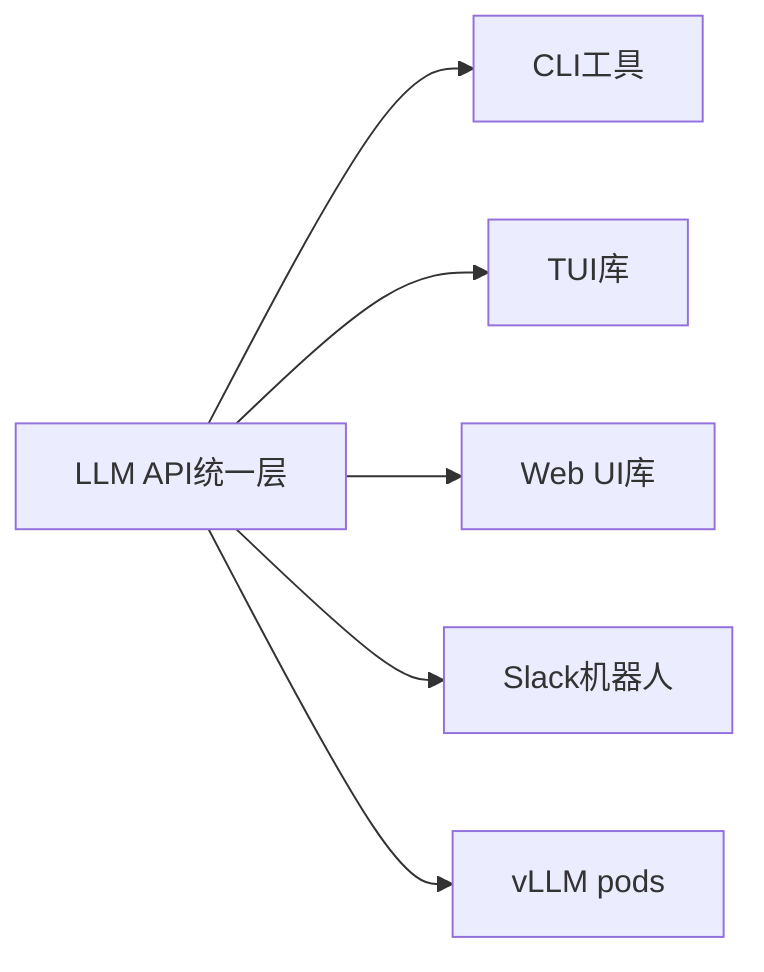
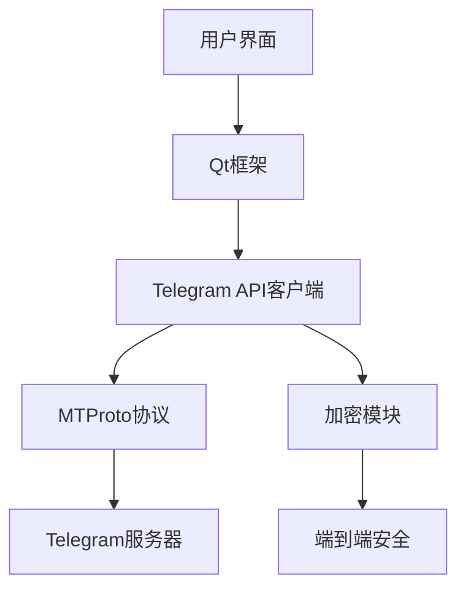

## 今日热点

今日GitHub热榜以AI代理和本地化模型部署工具为主导，边缘计算与开源开发工具持续吸引开发者关注。

---

## 热门项目一览

| 排名 | 项目 | 语言 | 今日 | 总计 | 简介 |
|:---:|------|:----:|------:|-----:|------|
| 1 | [siddharthvaddem/openscreen](https://github.com/siddharthvaddem/openscreen) | TypeScript | +2,749 | 22,593 | Create stunning demos for f... |
| 2 | [onyx-dot-app/onyx](https://github.com/onyx-dot-app/onyx) | Python | +998 | 25,053 | Open Source AI Platform - A... |
| 3 | [block/goose](https://github.com/block/goose) | Rust | +882 | 37,078 | an open source, extensible ... |
| 4 | [Blaizzy/mlx-vlm](https://github.com/Blaizzy/mlx-vlm) | Python | +416 | 3,943 | MLX-VLM is a package for in... |
| 5 | [google-ai-edge/gallery](https://github.com/google-ai-edge/gallery) | Kotlin | +389 | 16,989 | A gallery that showcases on... |
| 6 | [badlogic/pi-mono](https://github.com/badlogic/pi-mono) | TypeScript | +355 | 31,931 | AI agent toolkit: coding ag... |
| 7 | [freeCodeCamp/freeCodeCamp](https://github.com/freeCodeCamp/freeCodeCamp) | TypeScript | +335 | 441,522 | freeCodeCamp.org's open-sou... |
| 8 | [telegramdesktop/tdesktop](https://github.com/telegramdesktop/tdesktop) | C++ | +287 | 31,078 | Telegram Desktop messaging app |
| 9 | [google-ai-edge/LiteRT-LM](https://github.com/google-ai-edge/LiteRT-LM) | C++ | +124 | 1,580 | No description |
| 10 | [dmtrKovalenko/fff.nvim](https://github.com/dmtrKovalenko/fff.nvim) | Rust | +76 | 3,706 | The fastest and the most ac... |

---

## 趋势洞察

```
┌─────────────────────────────────────────────────────────────────┐
│  AI/ML 工具         ████████████████████████  7 个项目        │
│  其他               ██████                    2 个项目        │
│  多媒体应用            ███                       1 个项目        │
└─────────────────────────────────────────────────────────────────┘
```

---

## 项目深度解读

### 1. siddharthvaddem/openscreen — 开源录屏工具

> **一句话总结**：免费无水印的录屏工具，替代Screen Studio，支持商业使用。

#### 价值主张

| 维度 | 说明 |
|------|------|
| **解决痛点** | 提供免费、无水印、开源的录屏解决方案，替代付费工具 |
| **目标用户** | 需要高质量录屏的开发者、内容创作者和营销人员 |
| **核心亮点** | 开源免费 + 无水印 + 商业友好 + 跨平台 + 高质量输出 |

#### 技术架构


**技术特色**：
- 基于Web技术栈构建，确保跨平台兼容性
- 实时视频处理技术，流畅录制高性能内容
- 模块化设计，便于扩展和定制化功能

#### 热度分析

- 项目热度快速增长，单日增长超2700星，表明市场需求强烈
- 社区活跃度高，零开放问题，表明项目维护质量优秀

#### 快速上手

```bash
# 克隆项目
git clone https://github.com/siddharthvaddem/openscreen.git

# 安装依赖并运行
cd openscreen
npm install && npm run dev
```

#### 注意事项

- 项目使用TypeScript开发，需要Node.js环境
- 建议在使用前阅读项目文档以了解完整功能和使用限制
- 由于是开源项目，商业使用前应确认许可证条款（目前显示为Unknown）


### 2. onyx-dot-app/onyx — 全栈AI平台

> **一句话总结**：开源全能AI聊天平台，支持多种大模型，提供高级对话功能。

#### 价值主张

| 维度 | 说明 |
|------|------|
| **解决痛点** | 打破AI模型壁垒，统一接入多种大语言模型 |
| **目标用户** | AI开发者、研究人员和企业用户 |
| **核心亮点** | 多模型支持 + 高级对话功能 + 开源可定制 |

#### 技术架构


**技术特色**：
- 模型适配层，统一接入多种大语言模型
- 对话管理引擎，支持上下文保持
- 开源架构，可扩展性强

#### 热度分析

- Star数突破2.5万，单日增长近千，热度攀升迅速
- 零开放Issues表明项目维护质量高，社区反馈及时

#### 快速上手

```bash
git clone https://github.com/onyx-dot-app/onyx.git
cd onx
pip install -r requirements.txt
python main.py
```

#### 注意事项

- 需要配置API密钥才能使用各种LLM服务
- 可能需要较高的计算资源，特别是处理大型模型时


### 3. block/goose — 全能AI代理

> **一句话总结**：开源可扩展的AI代理，超越代码建议，支持任意LLM的安装、执行、编辑和测试。

#### 价值主张

| 维度 | 说明 |
|------|------|
| **解决痛点** | 打破AI辅助工具限制，提供与任何LLM集成的全能代理 |
| **目标用户** | 开发者、研究人员、需要AI辅助工作流的用户 |
| **核心亮点** | 跨LLM兼容性 + 可扩展架构 + 超越代码建议的全能功能 |

#### 技术架构


**技术特色**：
- 基于Rust构建的高性能AI代理框架
- 支持多种LLM的统一接口设计
- 可扩展的插件架构，支持自定义功能

#### 热度分析

- Star数3.7万且单日增长近千，显示项目处于高速增长期，社区认可度高
- Fork数与Star数比例约为9.6%，表明项目有较高的二次开发活跃度
- Issues为0可能表明项目维护良好或问题解决效率高

#### 快速上手

```bash
# 安装goose
cargo install goose

# 配置并运行
goose init
goose run --model <your_llm>
```

#### 注意事项

- 项目许可证未知，使用前需确认商业使用限制
- 作为AI代理，需注意数据安全和隐私问题
- 不同LLM的配置和性能可能存在差异


### 4. Blaizzy/mlx-vlm — Mac视觉语言模型

> **一句话总结**：基于MLX框架，让Mac用户高效运行和微调视觉语言模型的工具包

#### 价值主张

| 维度 | 说明 |
|------|------|
| **解决痛点** | 解决了在Mac上高效运行和微调视觉语言模型的难题 |
| **目标用户** | Mac用户、AI研究人员、开发者、视觉语言模型爱好者 |
| **核心亮点** | 基于MLX框架 + 支持多种VLM模型 + 专为Apple Silicon优化 |

#### 技术架构


**技术特色**：
- 基于苹果MLX框架，充分利用Apple Silicon性能
- 支持多种视觉语言模型的加载和微调
- 优化了在Mac上的运行效率和内存使用

#### 热度分析

- 项目近4000星且单日增长400+，显示项目热度迅速攀升，备受关注
- 作为Apple生态AI工具，填补了Mac平台视觉语言模型工具的空白，社区活跃度高

#### 快速上手

```bash
# 安装
pip install mlx-vlm

# 使用示例
from mlx_vlm import load_model, generate_response
model = load_model("llava-v1.5-7b")
response = generate_response(model, "image.jpg", "描述这张图片")
```

#### 注意事项

- 项目仅支持Apple Silicon Mac，不支持Intel Mac
- 需要较高版本的macOS系统
- 使用前需确认项目许可证信息，目前标注为Unknown
- 某些大型视觉语言模型可能需要大量内存和存储空间


### 5. google-ai-edge/gallery — 本地AI模型展示库

> **一句话总结**：展示设备端机器学习/生成式AI用例的模型库，支持本地模型试用与部署。

#### 价值主张

| 维度 | 说明 |
|------|------|
| **解决痛点** | 解决模型部署与实际应用场景脱节问题，提供可体验的本地AI模型 |
| **目标用户** | AI开发者、研究人员、移动应用开发者、边缘计算爱好者 |
| **核心亮点** | 本地模型部署 + 实际用例展示 + 交互式体验 + 多样化模型支持 + 开源社区 |

#### 技术架构


**技术特色**：
- 基于Kotlin开发，充分利用Android生态系统优势
- 提供端到端的设备端AI解决方案，无需云端依赖
- 模型轻量化设计，适合在移动设备上高效运行

#### 热度分析

- 项目Star数近1.7万，单日增长389，表明AI边缘计算领域热度持续攀升
- 作为Google官方项目，在边缘AI和设备端机器学习领域具有标杆地位

#### 快速上手

```bash
# 克隆仓库
git clone https://github.com/google-ai-edge/gallery.git

# 导入Android Studio项目
# 或使用Gradle构建
./gradlew build
```

#### 注意事项

- 需要具备Kotlin和Android开发基础
- 不同模型可能需要不同的硬件支持，部分高级功能可能需要特定设备
- 模型文件可能较大，初次下载需要较长时间
- 项目持续更新，关注最新版本以获取最佳体验


### 6. badlogic/pi-mono — AI工具集

> **一句话总结**：全栈AI代理工具包，提供统一LLM接口与多种UI组件，加速AI应用开发。

#### 价值主张

| 维度 | 说明 |
|------|------|
| **解决痛点** | 简化AI应用开发，统一多种LLM接口，提供完整开发工具链 |
| **目标用户** | AI应用开发者、企业AI团队、需要快速集成LLM功能的项目 |
| **核心亮点** | 统一LLM API + 多样化UI组件 + vLLM集成 + CLI工具 + Slack支持 |

#### 技术架构



**技术特色**：
- 统一API抽象层，支持多种LLM模型无缝切换
- 模块化设计，各组件可独立使用或组合
- TypeScript实现，提供类型安全和开发体验
- 支持vLLM本地部署，兼顾隐私与性能
- 提供丰富的UI组件，减少重复开发

#### 热度分析

- 高Star数和稳定增长表明项目获得社区广泛认可，可能是AI开发工具领域的重要参考
- 零开放Issues反映项目维护良好，社区问题解决及时，生态成熟度高

#### 快速上手

```bash
# 安装pi-mono
npm install pi-mono

# 初始化项目
npx pi-mono init

# 启动开发服务器
npx pi-mono dev
```

#### 注意事项

- 项目License未知，商业使用前需确认授权条款
- 集成多个LLM服务可能产生较高的API调用成本
- vLLM部署需要足够的计算资源，建议评估硬件需求


### 7. freeCodeCamp/freeCodeCamp — 开源教育平台

> **一句话总结**：完全免费的编程学习平台，提供互动式课程和项目实践，助力全球开发者成长。

#### 价值主张

| 维度 | 说明 |
|------|------|
| **解决痛点** | 打破教育资源壁垒，提供零门槛的编程和计算机科学教育 |
| **目标用户** | 编程初学者、自学者、希望提升技能的开发者 |
| **核心亮点** | 完全免费课程体系 + 互动式学习体验 + 实战项目 + 认证系统 + 全球社区 |

#### 技术架构


**技术特色**：
- 基于 TypeScript 开发，确保代码质量和可维护性
- 响应式设计，适配多设备学习场景
- 开源课程内容，支持社区持续更新和贡献

#### 热度分析

- 项目拥有44万+星标，持续稳定增长，位居开源教育平台前列
- 活跃的全球社区贡献者网络，形成了完善的知识共享生态

#### 快速上手

```bash
# 克隆仓库
git clone https://github.com/freeCodeCamp/freeCodeCamp.git

# 安装依赖
npm install

# 启动开发服务器
npm run dev
```

#### 注意事项

- 项目规模庞大，建议先阅读贡献指南和项目结构说明
- 代码质量和文档完整性要求较高，提交前请确保符合项目规范
- 教育内容准确性至关重要，修改课程内容需谨慎测试和验证


### 8. telegramdesktop/tdesktop — 跨平台即时通讯

> **一句话总结**：Telegram桌面版客户端，提供安全私密的端到端加密通讯体验。

#### 价值主张

| 维度 | 说明 |
|------|------|
| **解决痛点** | 解决桌面设备安全通讯需求，提供隐私保护与跨平台同步 |
| **目标用户** | 注重隐私安全的桌面用户，尤其是开发者和技术爱好者 |
| **核心亮点** | 端到端加密保护隐私 + 跨平台兼容性好 + 支持大文件传输 |

#### 技术架构



**技术特色**：
- 基于Qt框架构建，跨平台兼容性极佳
- 实现MTProto协议，确保通讯安全
- 采用C++开发，性能优化出色

#### 热度分析

- 项目Star数超3万，近期日增约300，持续受到开发者关注
- 在隐私通讯领域具有重要生态位置，吸引大量注重隐私安全的用户

#### 快速上手

```bash
# 克隆仓库
git clone --recursive https://github.com/telegramdesktop/tdesktop.git

# 构建项目
mkdir build && cd build
cmake -DCMAKE_BUILD_TYPE=Release ..
cmake --build .
```

#### 注意事项

- 需要安装CMake和Qt开发环境才能构建项目
- 项目构建依赖较多，在不同平台上可能需要额外配置
- 由于使用Telegram的API，需要确保网络环境可以访问Telegram服务


### 9. google-ai-edge/LiteRT-LM — 边缘语言模型运行时

> **一句话总结**：轻量级边缘设备上的语言模型运行时，优化推理性能与资源消耗。

#### 价值主张

| 维度 | 说明 |
|------|------|
| **解决痛点** | 在资源受限的边缘设备上高效运行大型语言模型 |
| **目标用户** | 边缘AI开发者、嵌入式系统工程师、移动应用开发者 |
| **核心亮点** | 低资源消耗 + 高性能推理 + 跨平台部署 + 轻量化设计 |

#### 技术架构


**技术特色**：
- 模型量化与压缩技术，减少模型体积
- 优化推理引擎，提升边缘设备执行效率
- 跨平台支持，适配多种边缘计算环境

#### 热度分析

- 近期Star增长迅速(+124/天)，显示边缘AI领域热度上升
- 社区活跃度中等，Fork数相对较低表明项目更注重直接使用

#### 快速上手

```bash
# 克隆仓库
git clone https://github.com/google-ai-edge/LiteRT-LM.git

# 构建项目
cd LiteRT-LM
mkdir build && cd build
cmake ..
make
```

#### 注意事项

- 项目许可证不明确，使用前需确认授权条款
- 作为边缘计算项目，需注意硬件兼容性和资源限制
- 可能需要特定的模型格式转换才能与运行时兼容


### 10. dmtrKovalenko/fff.nvim — 极速文件搜索

> **一句话总结**：fff.nvim是一款基于Rust的高性能文件搜索工具，专为Neovim和AI代理设计，提供毫秒级响应的精准文件查找体验。

#### 价值主张

| 维度 | 说明 |
|------|------|
| **解决痛点** | 解决传统文件搜索速度慢、准确性低的问题，提供毫秒级响应 |
| **目标用户** | Neovim用户、AI开发者、Rust/C/NodeJS开发者 |
| **核心亮点** | Rust高性能实现 + 跨语言支持 + 极速搜索算法 |

#### 技术架构


**技术特色**：
- Rust语言实现，保证高性能和内存安全
- 专为Neovim设计的集成方案，无缝衔接编辑工作流
- 采用高效索引算法，支持模糊搜索和精确匹配

#### 热度分析

- 项目获得3700+ stars且持续增长，显示开发者社区对其性能和功能的认可
- 作为Neovim生态系统中的搜索工具，填补了高效文件搜索的空白，生态位置独特

#### 快速上手

```bash
# 使用vim插件管理器安装
Plug 'dmtrKovalenko/fff.nvim'
# 在vimrc中配置
nnoremap <leader>f :FZF<CR>
```

#### 注意事项

- 需要Neovim环境才能使用
- 可能需要额外的Rust运行时环境
- 对于大型代码库，索引构建可能需要一定时间


## 今日推荐

| 主题 | 推荐项目 | 亮点 |
|------|----------|------|
| 今日最热 | [siddharthvaddem/openscreen](https://github.com/siddharthvaddem/openscreen) | Create stunning d... |
| 值得关注 | [onyx-dot-app/onyx](https://github.com/onyx-dot-app/onyx) | Open Source AI Pl... |
| 快速上手 | [block/goose](https://github.com/block/goose) | an open source, e... |
| 长期潜力 | [Blaizzy/mlx-vlm](https://github.com/Blaizzy/mlx-vlm) | MLX-VLM is a pack... |

---

<div align="center">

*Generated on 2026-04-06 | Powered by GitHub Trending Reporter*

</div>