## 今日热点

本地AI与知识管理工具崛起，边缘计算与大模型本地化部署成为主流趋势，同时隐私保护与自主安全解决方案受关注。

---

## 热门项目一览

| 排名 | 项目 | 语言 | 今日 | 总计 | 简介 |
|:---:|------|:----:|------:|-----:|------|
| 1 | [siddharthvaddem/openscreen](https://github.com/siddharthvaddem/openscreen) | TypeScript | +1,838 | 24,022 | Create stunning demos for f... |
| 2 | [NousResearch/hermes-agent](https://github.com/NousResearch/hermes-agent) | Python | +1,574 | 28,161 | The agent that grows with you |
| 3 | [google-ai-edge/gallery](https://github.com/google-ai-edge/gallery) | Kotlin | +1,107 | 17,886 | A gallery that showcases on... |
| 4 | [abhigyanpatwari/GitNexus](https://github.com/abhigyanpatwari/GitNexus) | TypeScript | +857 | 23,478 | GitNexus: The Zero-Server C... |
| 5 | [KeygraphHQ/shannon](https://github.com/KeygraphHQ/shannon) | TypeScript | +733 | 36,550 | Shannon Lite is an autonomo... |
| 6 | [google-ai-edge/LiteRT-LM](https://github.com/google-ai-edge/LiteRT-LM) | C++ | +483 | 2,024 | No description |
| 7 | [kepano/obsidian-skills](https://github.com/kepano/obsidian-skills) | Unknown | +429 | 20,573 | Agent skills for Obsidian. ... |
| 8 | [tobi/qmd](https://github.com/tobi/qmd) | TypeScript | +394 | 18,762 | mini cli search engine for ... |
| 9 | [NVIDIA/personaplex](https://github.com/NVIDIA/personaplex) | Python | +295 | 7,365 | PersonaPlex code. |
| 10 | [ggml-org/llama.cpp](https://github.com/ggml-org/llama.cpp) | C++ | +267 | 102,049 | LLM inference in C/C++ |
| 11 | [ollama/ollama](https://github.com/ollama/ollama) | Go | +196 | 167,706 | Get up and running with Kim... |
| 12 | [immich-app/immich](https://github.com/immich-app/immich) | TypeScript | +152 | 96,873 | High performance self-hoste... |

---

## 趋势洞察

```
┌─────────────────────────────────────────────────────────────────┐
│  AI/ML 工具         ████████████████████████  8 个项目        │
│  其他               █████████                 3 个项目        │
│  多媒体应用            ███                       1 个项目        │
│  开发工具             ███                       1 个项目        │
└─────────────────────────────────────────────────────────────────┘
```

---

## 项目深度解读

### 1. siddharthvaddem/openscreen — 开源演示录制工具

> **一句话总结**：开源免费的屏幕录制工具，无水印、无订阅，可创建专业级演示视频，支持商业使用。

#### 价值主张

| 维度 | 说明 |
|------|------|
| **解决痛点** | 提供免费无水印的专业屏幕录制工具，替代付费软件 |
| **目标用户** | 需要创建演示视频的开发者、营销人员和内容创作者 |
| **核心亮点** | 开源免费 + 无水印 + 商业使用 + 专业级效果 |

#### 技术架构

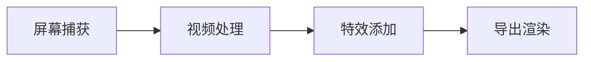

**技术特色**：
- 基于TypeScript构建，跨平台兼容性好
- 高性能屏幕捕获技术，支持多种分辨率和帧率
- 内置丰富的特效和转场效果，无需额外编辑

#### 热度分析

- 项目获得24,022颗星，单日增长1,838，表明近期关注度激增，可能因功能更新或宣传
- Fork数1,607，社区活跃度较高，表明开发者对其技术实现和功能扩展感兴趣

#### 快速上手

```bash
# 克隆项目
git clone https://github.com/siddharthvaddem/openscreen.git

# 安装依赖
npm install

# 运行应用
npm start
```

#### 注意事项

- 由于项目License未知，商业使用前需确认授权条款
- 项目Issues为0，可能意味着项目处于早期阶段或问题通过其他渠道处理
- 使用前需确保系统满足运行要求，特别是屏幕录制功能需要相应权限


### 2. NousResearch/hermes-agent — 自成长智能代理

> **一句话总结**：一个能够持续学习和适应任务需求的多功能AI代理框架，支持高度定制与扩展。

#### 价值主张

| 维度 | 说明 |
|------|------|
| **解决痛点** | 解决AI代理缺乏持续学习与任务自适应能力的局限性 |
| **目标用户** | AI研究人员、开发者及需要定制化智能代理的企业团队 |
| **核心亮点** | 模块化架构 + 持续学习能力 + 多模型支持 + 插件生态 + 高度可定制 |

#### 技术架构

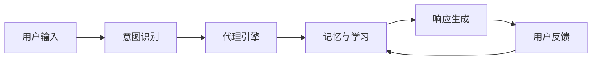

**技术特色**：
- 采用强化学习机制实现代理能力的持续进化
- 插件化架构支持功能模块的热插拔与扩展
- 分布式记忆系统实现长期上下文保持与知识积累

#### 热度分析

- 项目星标数近3万且单日激增1500+，表明技术社区高度关注与应用需求强烈
- 零未解决问题显示项目维护活跃，问题响应与解决机制高效

#### 快速上手

```bash
# 克隆仓库
git clone https://github.com/NousResearch/hermes-agent.git
cd hermes-agent

# 安装依赖并运行示例
pip install -e .
python examples/basic_agent.py
```

#### 注意事项

- 项目依赖较新的Python版本，建议使用3.9+环境
- 需要配置相应的AI模型API密钥才能使用完整功能
- 部分高级功能可能需要GPU加速以获得最佳性能


### 3. google-ai-edge/gallery — 边缘AI模型库

> **一句话总结**：展示可在设备上运行的机器学习和生成式AI模型示例，支持本地测试与应用。

#### 价值主张

| 维度 | 说明 |
|------|------|
| **解决痛点** | 解决云端AI处理的隐私、延迟和网络依赖问题，实现本地化AI推理 |
| **目标用户** | 移动应用开发者、AI研究人员、隐私敏感型AI用户 |
| **核心亮点** | 设备端运行 + 隐私保护 + 低延迟 + 离线可用 + 示例丰富 |

#### 技术架构

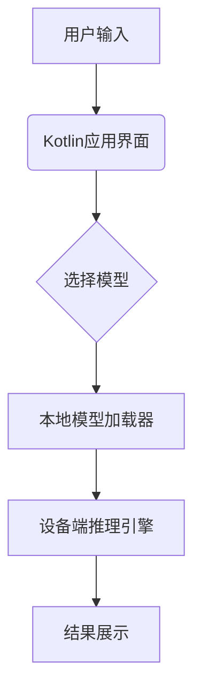

**技术特色**：
- Kotlin原生实现，跨平台兼容性好
- 优化模型大小和性能，适应边缘设备计算限制
- 提供直观的UI界面，便于开发者快速测试和集成

#### 热度分析

- 项目获17,886星且单日增长超千，反映边缘AI和本地化AI应用需求激增
- 作为Google官方项目，在AI边缘计算领域具有重要生态地位，是移动端AI开发的重要参考

#### 快速上手

```bash
# 克隆仓库
git clone https://github.com/google-ai-edge/gallery.git

# 构建项目
./gradlew build

# 运行示例
./gradlew runExample
```

#### 注意事项

- 需确保设备有足够计算资源运行AI模型，不同模型对硬件要求各异
- 部分模型可能需要额外的依赖库，建议查看项目文档获取完整依赖列表
- 项目处于活跃开发中，API可能会有变化，建议关注更新日志


### 4. abhigyanpatwari/GitNexus — 浏览器端代码智能

> **一句话总结**：完全在浏览器运行的零服务器代码智能引擎，通过知识图谱和RAG代理提供代码探索能力。

#### 价值主张

| 维度 | 说明 |
|------|------|
| **解决痛点** | 解决代码仓库探索困难、理解复杂代码结构需要大量时间的问题 |
| **目标用户** | 软件开发者、代码审查者、架构师、研究人员 |
| **核心亮点** | 零服务器运行 + 浏览端知识图谱生成 + 交互式代码探索 + 内置RAG代理 + 支持GitHub/ZIP导入 |

#### 技术架构

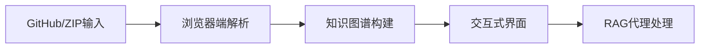

**技术特色**：
- 纯客户端运行，无需服务器资源
- 浏览端实时构建代码知识图谱
- 集成RAG代理提供智能代码分析

#### 热度分析

- 项目获得23,478个星标，单日增长857，显示其技术价值受到广泛认可
- 零开放问题表明项目已趋于成熟，社区维护良好

#### 快速上手

```bash
# 访问GitNexus网页
# 直接拖拽GitHub仓库或ZIP文件到界面
# 开始探索生成的知识图谱
```

#### 注意事项

- 由于完全在浏览器中运行，大型代码库可能影响性能
- 需要现代浏览器支持，可能无法在所有环境中运行
- 隐私考虑：代码完全在本地处理，不会上传到服务器


### 5. KeygraphHQ/shannon — AI安全测试工具

> **一句话总结**：Shannon是一款AI驱动的自动化渗透测试工具，能主动识别并验证Web应用和API中的安全漏洞。

#### 价值主张

| 维度 | 说明 |
|------|------|
| **解决痛点** | 传统安全测试效率低，无法在开发早期发现漏洞，导致修复成本高 |
| **目标用户** | 开发团队、安全工程师、DevOps工程师、应用安全团队 |
| **核心亮点** | AI智能分析 + 自动化漏洞验证 + 白盒测试 + 防御性验证 + 提前预防 |

#### 技术架构


**技术特色**：
- 基于TypeScript构建的AI分析引擎，可深度理解代码逻辑
- 白盒测试方法，无需部署环境即可发现潜在漏洞
- 自动化漏洞验证，模拟真实攻击确认漏洞存在性

#### 热度分析

- 项目获得36k+高星，单日增长733，表明项目正处于快速上升期，安全自动化需求旺盛
- 零开放问题显示项目维护良好，社区反馈渠道可能通过其他方式处理

#### 快速上手

```bash
# 安装shannon
npm install -g @keygraphhq/shannon

# 扫描项目
shannon scan ./path/to/project

# 生成报告
shannon report --format json
```

#### 注意事项

- 该工具执行真实漏洞验证，应在非生产环境中使用，避免意外影响
- 白盒测试可能需要访问源代码，注意知识产权和代码安全
- AI分析可能存在误报，需要人工验证关键漏洞


### 6. google-ai-edge/LiteRT-LM — 边缘语言模型

> **一句话总结**：轻量级边缘设备上的语言模型高效推理运行时，优化资源使用并保持性能。

#### 价值主张

| 维度 | 说明 |
|------|------|
| **解决痛点** | 解决边缘设备部署大型语言模型的资源限制和性能瓶颈问题 |
| **目标用户** | 嵌入式开发者、边缘AI应用开发者、移动端AI工程师 |
| **核心亮点** | 轻量级设计 + 高效推理 + 跨平台支持 + 硬件加速 |

#### 技术架构

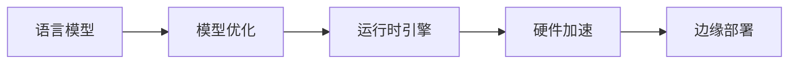

**技术特色**：
- 模型量化和压缩技术，减小模型体积
- 针对边缘设备的内存和计算优化
- 支持多种硬件加速器后端

#### 热度分析

- 项目近期增长迅速，单日新增483星，表明社区高度关注边缘AI部署趋势
- Google AI Edge 团队背书，处于边缘AI生态重要位置

#### 快速上手

```bash
# 克隆仓库
git clone https://github.com/google-ai-edge/LiteRT-LM.git
cd LiteRT-LM

# 构建项目
cmake .
make

# 运行示例模型
./lmlm --model_path=models/small_lm.tflite --input_text="Hello, how are you?"
```

#### 注意事项

- 项目当前无公开问题，可能处于早期阶段，API可能不稳定
- 需要确认具体支持的硬件平台和模型格式
- 注意查看项目文档了解完整的部署要求和限制


### 7. kepano/obsidian-skills — AI代理增强

> **一句话总结**：为 Obsidian 提供 AI 代理技能，支持 Markdown、数据库、画布和 CLI 操作。

#### 价值主张

| 维度 | 说明 |
|------|------|
| **解决痛点** | 扩展 Obsidian 功能，让 AI 代理能直接操作笔记内容 |
| **目标用户** | 高级 Obsidian 用户、AI 开发者、知识工作者 |
| **核心亮点** | + 支持 Markdown + 数据库操作 + JSON Canvas 集成 + CLI 功能 |

#### 技术架构

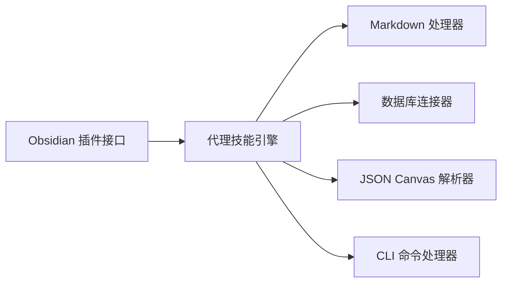

**技术特色**：
- 基于 Obsidian 插件 API 开发
- 提供多格式内容处理能力
- 支持 AI 代理与知识库交互

#### 热度分析

- 高关注度项目，单日增长 429 stars，显示社区对该功能强烈需求
- Fork 数量相对较低，表明项目可能处于早期阶段，社区贡献尚未大规模展开

#### 快速上手

```bash
# 安装 obsidian-skills 插件
# 1. 在 Obsidian 中打开社区插件市场
# 2. 搜索 "obsidian-skills" 并安装
# 3. 重启 Obsidian 并启用插件
```

#### 注意事项

- 项目可能需要 Obsidian 的付费版本才能使用某些功能
- 插件可能需要额外的配置才能正确集成 AI 代理服务
- 项目仍在开发中，API 可能会发生变化


### 8. tobi/qmd — 本地文档搜索引擎

> **一句话总结**：一个完全在本地运行的命令行文档搜索引擎，支持多种知识库和笔记的快速检索。

#### 价值主张

| 维度 | 说明 |
|------|------|
| **解决痛点** | 解决本地文档、笔记和知识库中快速查找信息的问题 |
| **目标用户** | 需要管理大量本地文档的开发者、研究人员和知识工作者 |
| **核心亮点** | 完全本地运行 + 保护隐私 + 快速响应 + 无需网络连接 + 支持多种文档格式 |

#### 技术架构

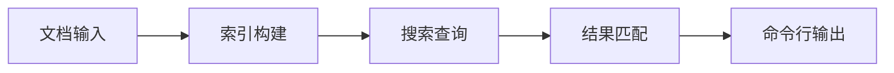

**技术特色**：
- 使用TypeScript开发，保证类型安全和代码质量
- 完全本地运行，无需网络连接，保护用户隐私
- 支持多种文档格式，包括Markdown、笔记等

#### 热度分析

- 项目获得近19k星，且每日新增约400星，增长势头强劲
- 无开放问题，表明项目维护良好，用户反馈问题少或已解决

#### 快速上手

```bash
# 安装
npm install -g qmd

# 搜索文档
qmd search "关键词"
```

#### 注意事项

- 由于完全在本地运行，首次使用可能需要构建索引，可能耗时
- 支持的文档格式可能有限，使用前需确认兼容性
- 许可证信息未知，商业使用前需确认授权情况


### 9. NVIDIA/personaplex — 人格生成系统

> **一句话总结**：基于NVIDIA技术的高效多维度人格建模与生成平台，支持个性化AI角色创建。

#### 价值主张

| 维度 | 说明 |
|------|------|
| **解决痛点** | 解决AI角色人格单一化、交互缺乏真实感和多样性问题 |
| **目标用户** | AI开发者、游戏设计师、虚拟助手构建者、研究人员 |
| **核心亮点** | 多维度人格建模 + 高效GPU加速生成 + 跨场景一致性保持 |

#### 技术架构

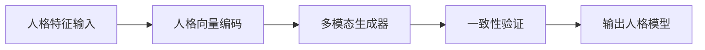

**技术特色**：
- 基于深度学习的多维度人格特征提取与建模
- 利用NVIDIA GPU技术实现高效并行生成
- 支持人格特征在不同场景间的一致性保持

#### 热度分析

- 项目近期关注度快速攀升，单日新增近300星，显示业界对AI人格生成技术的高度兴趣
- 作为NVIDIA官方项目，在AI角色生成领域具有技术引领性和生态影响力

#### 快速上手

```bash
# 克隆项目
git clone https://github.com/NVIDIA/personaplex.git

# 安装依赖
cd personaplex
pip install -r requirements.txt

# 运行示例
python examples/basic_personaplex_demo.py
```

#### 注意事项

- 项目依赖NVIDIA GPU进行最佳性能运行
- 需确保输入数据符合人格特征规范格式
- 商业使用前需确认最新的开源许可证条款


### 10. ggml-org/llama.cpp — 高效LLM推理

> **一句话总结**：纯C/C++实现的高性能大型语言模型推理引擎，支持CPU和边缘设备部署。

#### 价值主张

| 维度 | 说明 |
|------|------|
| **解决痛点** | 解决LLM在资源受限设备上难以高效运行的问题，降低推理硬件门槛 |
| **目标用户** | 需要在边缘设备部署LLM的开发者，追求高效推理的研究人员 |
| **核心亮点** | 纯C/C++实现 + GGML优化矩阵运算 + 多级量化技术 + 跨平台支持 |

#### 技术架构

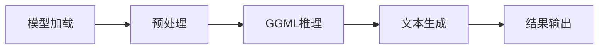

**技术特色**：
- 使用GGML库优化矩阵运算，针对CPU架构深度优化
- 支持INT4/INT8等多级量化，大幅降低内存需求
- 实现多种硬件加速路径，包括AVX、AVX2、NEON等指令集

#### 热度分析

- 项目Star数超10万，日均增长200+，显示强劲社区认可和采用趋势
- 已成为边缘计算和CPU推理LLM领域的标杆项目，生态系统持续扩展

#### 快速上手

```bash
git clone https://github.com/ggml-org/llama.cpp
cd llama.cpp && make
./main -m models/7B/ggml-model.gguf -p "Once upon a time"
```

#### 注意事项

- 项目主要面向C/C++开发者，对不熟悉系统编程的用户有一定门槛
- 量化模型会降低内存占用但可能影响生成质量，需根据应用场景权衡
- Windows用户需要额外配置编译环境，推荐使用CMake构建


### 11. ollama/ollama — 大模型运行平台

> **一句话总结**：一站式运行多种开源大语言模型的轻量级平台，简化本地化AI部署体验。

#### 价值主张

| 维度 | 说明 |
|------|------|
| **解决痛点** | 解决大模型本地化部署复杂、资源消耗高的问题 |
| **目标用户** | AI开发者、研究人员和企业技术团队 |
| **核心亮点** | 轻量级 + 多模型支持 + 简单易用 + 本地部署 |

#### 技术架构

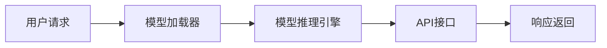

**技术特色**：
- 基于Go语言实现，高性能并发处理
- 模型轻量化封装，降低硬件门槛
- 统一API接口，简化多模型调用

#### 热度分析

- 项目Star数超16万，持续增长，表明市场认可度高
- Fork数与Star数比例合理，社区参与度活跃，生态建设良好

#### 快速上手

```bash
# 安装ollama
curl -fsSL https://ollama.ai/install.sh | sh

# 启动模型
ollama run llama2

# 与模型交互
ollama list
```

#### 注意事项

- 需要足够的计算资源才能流畅运行大模型
- 不同模型可能有不同的硬件要求和性能表现
- 模型下载和首次启动可能需要较长时间


### 12. immich-app/immich — 自托管媒体管理

> **一句话总结**：高性能自托管照片视频管理解决方案，提供私有云媒体存储与智能分类体验。

#### 价值主张

| 维度 | 说明 |
|------|------|
| **解决痛点** | 解决个人媒体数据隐私保护和高效管理需求 |
| **目标用户** | 注重隐私的摄影爱好者、小型团队、家庭用户 |
| **核心亮点** | 高性能媒体处理 + 智能人脸识别 + 私有云部署 |

#### 技术架构

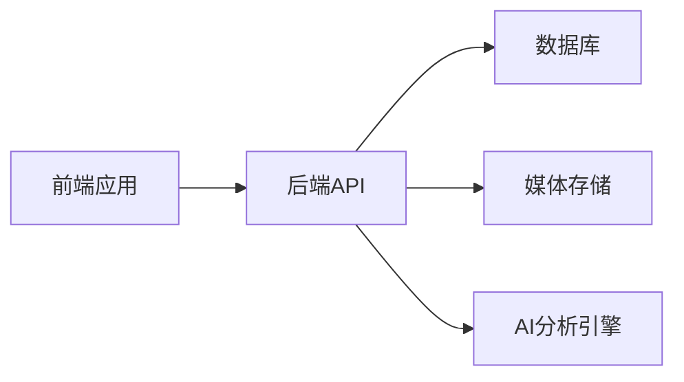

**技术特色**：
- 使用TypeScript全栈开发，保证类型安全
- 支持分布式架构，可水平扩展处理大量媒体文件
- 高效的媒体处理流水线，支持大文件和智能分类

#### 热度分析

- Star数近10万，日增152，增长势头强劲，表明社区认可度高
- 项目活跃度高，作为开源替代方案在自托管媒体管理领域占据重要位置

#### 快速上手

```bash
# 克隆项目
git clone https://github.com/immich-app/immich.git
cd immich
# 使用Docker快速部署
docker-compose up -d
```

#### 注意事项

- 需要较大的存储空间来存储照片和视频
- 首次设置可能需要较长时间进行媒体索引和元数据提取
- 性能取决于硬件配置，特别是CPU和存储I/O


### 13. TelegramMessenger/Telegram-iOS — 安全通讯客户端

> **一句话总结**：基于 Swift 开发的 Telegram iOS 客户端，提供安全、快速的即时通讯体验。

#### 价值主张

| 维度 | 说明 |
|------|------|
| **解决痛点** | 提供安全、快速、跨平台的即时通讯解决方案 |
| **目标用户** | 注重隐私和安全性的 iOS 用户 |
| **核心亮点** | 端到端加密 + 云同步 + 大文件传输 + 自毁消息 |

#### 技术架构

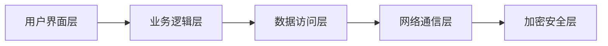

**技术特色**：
- 基于 Swift 语言的现代化 iOS 开发
- 采用 MVVM 架构模式分离关注点
- 自定义 UI 组件确保一致的用户体验
- 使用原生性能优化实现流畅交互
- 实现端到端加密保障通信安全

#### 热度分析

- 项目 Star 数量持续增长，表明 Telegram 在 iOS 平台上的受欢迎程度稳步提升
- 活跃的社区贡献和持续的更新维护，展示了项目的健康度和可持续发展能力

#### 快速上手

```bash
# 克隆仓库
git clone https://github.com/TelegramMessenger/Telegram-iOS.git

# 使用 Xcode 打开项目
open Telegram-iOS.xcworkspace

# 构建并运行在模拟器或设备上
```

#### 注意事项
- 项目使用 Swift 开发，需要熟悉 iOS 开发环境
- 依赖最新的 iOS SDK，确保使用支持的 Xcode 版本
- 项目结构复杂，初次可能需要时间理解代码组织方式
- 许可证信息不明确，使用前需确认授权条款


## 今日推荐

| 主题 | 推荐项目 | 亮点 |
|------|----------|------|
| 今日最热 | [siddharthvaddem/openscreen](https://github.com/siddharthvaddem/openscreen) | Create stunning d... |
| 值得关注 | [NousResearch/hermes-agent](https://github.com/NousResearch/hermes-agent) | The agent that gr... |
| 快速上手 | [google-ai-edge/gallery](https://github.com/google-ai-edge/gallery) | A gallery that sh... |
| 长期潜力 | [abhigyanpatwari/GitNexus](https://github.com/abhigyanpatwari/GitNexus) | GitNexus: The Zer... |

---

<div align="center">

*Generated on 2026-04-07 | Powered by GitHub Trending Reporter*

</div>