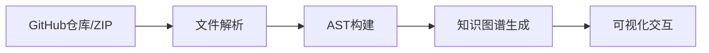

## 今日热点

今日GitHub热榜项目精彩纷呈。

---

## 热门项目一览

| 排名 | 项目 | 语言 | 今日 | 总计 | 简介 |
|:---:|------|:----:|------:|-----:|------|
| 1 | [abhigyanpatwari/GitNexus](https://github.com/abhigyanpatwari/GitNexus) | TypeScript | +1,195 | 24,541 | GitNexus: The Zero-Server C... |
| 2 | [google-ai-edge/gallery](https://github.com/google-ai-edge/gallery) | Kotlin | +897 | 18,806 | A gallery that showcases on... |
| 3 | [tobi/qmd](https://github.com/tobi/qmd) | TypeScript | +859 | 19,566 | mini cli search engine for ... |
| 4 | [NVIDIA/personaplex](https://github.com/NVIDIA/personaplex) | Python | +662 | 7,959 | PersonaPlex code. |
| 5 | [elebumm/RedditVideoMakerBot](https://github.com/elebumm/RedditVideoMakerBot) | Python | +636 | 10,050 | Create Reddit Videos with j... |
| 6 | [google-ai-edge/LiteRT-LM](https://github.com/google-ai-edge/LiteRT-LM) | C++ | +528 | 2,557 | No description |
| 7 | [TheCraigHewitt/seomachine](https://github.com/TheCraigHewitt/seomachine) | Python | +215 | 3,911 | A specialized Claude Code w... |
| 8 | [HKUDS/DeepTutor](https://github.com/HKUDS/DeepTutor) | Python | +168 | 12,229 | "DeepTutor: Agent-Native Pe... |
| 9 | [forrestchang/andrej-karpathy-skills](https://github.com/forrestchang/andrej-karpathy-skills) | Unknown | +51 | 8,079 | No description |

---

## 趋势洞察

```
┌─────────────────────────────────────────────────────────────────┐
│  AI/ML 工具         ████████████████████████  5 个项目        │
│  其他               █████████                 2 个项目        │
│  多媒体应用            ████                      1 个项目        │
│  开发工具             ████                      1 个项目        │
└─────────────────────────────────────────────────────────────────┘
```

---

## 项目深度解读

### 1. abhigyanpatwari/GitNexus — 代码智能分析工具

> **一句话总结**：纯浏览器端代码知识图谱构建工具，无需服务器即可实现代码智能探索。

#### 价值主张

| 维度 | 说明 |
|------|------|
| **解决痛点** | 消除传统代码分析需要服务器部署的复杂性 |
| **目标用户** | 开发者、代码审查员、研究人员 |
| **核心亮点** | 零服务器部署 + 交互式知识图谱 + Graph RAG Agent |

#### 技术架构



**技术特色**：
- 纯TypeScript实现，确保类型安全
- 客户端运行，保护代码隐私
- 集成Graph RAG技术增强代码理解

#### 热度分析

- 项目Star数超过24k，单日增长近1.2k，呈现爆发式增长态势
- 零Open Issues反映项目维护质量高，社区协作效率出色

#### 快速上手

```bash
# 克隆项目
git clone https://github.com/abhigyanpatwari/GitNexus.git

# 安装依赖
npm install

# 启动开发环境
npm run dev
```

#### 注意事项

- 大型代码库可能导致浏览器性能下降
- 需要现代浏览器支持ES6+特性
- 仅支持静态代码分析，不包含运行时行为分析


### 2. google-ai-edge/gallery — 边缘AI模型库

> **一句话总结**：展示设备端机器学习与生成式AI用例的示例集合，支持本地模型部署与体验。

#### 价值主张

| 维度 | 说明 |
|------|------|
| **解决痛点** | 降低边缘设备AI模型部署门槛，提供可直接运行的端到端解决方案 |
| **目标用户** | 移动开发者、嵌入式工程师、AI模型部署人员 |
| **核心亮点** | 跨平台兼容性 + 多种设备端模型支持 + 直观UI展示 |

#### 技术架构


**技术特色**：
- 利用Kotlin实现Android/iOS跨平台兼容
- 模型量化与优化适应边缘设备资源限制
- 提供标准化的模型接口与生命周期管理

#### 热度分析

- 单日增长近900星，显示出边缘AI领域的高关注度与社区活跃度
- 作为Google官方项目，在边缘AI生态中占据技术引领地位

#### 快速上手

```bash
git clone https://github.com/google-ai-edge/gallery.git
cd gallery
./gradlew run --args='model_name'
```

#### 注意事项

- 项目依赖特定版本的Android Studio或Xcode环境
- 部分模型可能需要额外的硬件加速支持
- 模型文件可能占用较大存储空间，需考虑设备容量限制


### 3. tobi/qmd — 本地文档搜索

> **一句话总结**：轻量级本地文档搜索引擎，支持命令行操作，无需联网即可快速搜索个人知识库。

#### 价值主张

| 维度 | 说明 |
|------|------|
| **解决痛点** | 解决个人文档分散、难以快速检索的问题 |
| **目标用户** | 需要管理大量个人文档的知识工作者 |
| **核心亮点** | 本地运行 + 隐私保护 + 高效搜索 + 命令行界面 |

#### 技术架构


**技术特色**：
- 使用TypeScript开发，保证类型安全
- 本地化索引，无需联网保护隐私
- 采用现代搜索算法实现高效检索

#### 热度分析

- 项目获得近2万星，单日增长800+，表明用户需求强烈
- 零开放问题，说明项目维护良好，用户体验稳定

#### 快速上手

```bash
npm install -g qmd
qmd init
qmd search "关键词"
```

#### 注意事项

- 项目许可不明确，可能存在使用限制
- 作为本地工具，需要用户自行管理文档索引
- 可能需要定期更新索引以保证搜索准确性


### 4. NVIDIA/personaplex — AI角色模拟系统

> **一句话总结**：基于NVIDIA技术的多角色AI人格模拟框架，支持复杂角色扮演和对话交互。

#### 价值主张

| 维度 | 说明 |
|------|------|
| **解决痛点** | 缺乏高效、可扩展的多角色AI人格构建和交互平台 |
| **目标用户** | AI研究人员、游戏开发者、对话系统构建者 |
| **核心亮点** | 多角色并行模拟 + GPU加速 + 角色个性定制 + 对话上下文理解 + 角色间互动建模 |

#### 技术架构


**技术特色**：
- 基于NVIDIA GPU架构的高效多角色并行处理
- 深度学习驱动的动态人格建模与演化
- 支持复杂对话上下文与角色间关系网络

#### 热度分析

- 项目近期获得显著关注，单日增长662 stars，表明社区对多角色AI系统的强烈兴趣
- 作为NVIDIA官方项目，在AI研究社区具有高影响力，但开源生态系统仍在形成阶段

#### 快速上手

```bash
# 克隆仓库
git clone https://github.com/NVIDIA/personaplex.git

# 安装依赖
cd personaplex
pip install -r requirements.txt

# 运行示例
python examples/basic_interaction.py
```

#### 注意事项

- 项目需要NVIDIA GPU以获得最佳性能，CPU模式可能显著降低效率
- 角色定义和人格模型构建需要一定的AI领域知识
- 项目文档可能不够完善，需要参考示例代码理解API用法


### 5. elebumm/RedditVideoMakerBot — Reddit视频生成工具

> **一句话总结**：将Reddit帖子内容一键转换为视频，实现内容自动化创作与分享。

#### 价值主张

| 维度 | 说明 |
|------|------|
| **解决痛点** | 将Reddit文本内容自动转换为视频，省去手动制作视频的繁琐过程 |
| **目标用户** | Reddit内容创作者、社交媒体运营者、自动化爱好者 |
| **核心亮点** | 一键操作 + 自动内容提取 + 多格式输出 + 无需视频编辑经验 |

#### 技术架构


**技术特色**：
- 利用Reddit API自动获取并解析帖子内容
- 将文本、评论等元素自动转换为视频片段
- 支持自定义视频模板和元素添加

#### 热度分析

- 项目星标突破万级，近期增长迅速，显示社区对自动化内容创作工具的高度需求
- 作为Reddit生态中的独特工具，填补了内容自动化生产的空白，具有较高生态价值

#### 快速上手

```bash
# 安装依赖
pip install -r requirements.txt

# 运行示例
python bot.py -r AskReddit -t top
```

#### 注意事项

- 使用前需要配置Reddit API密钥并遵守Reddit API使用政策
- 生成的视频内容需注意版权问题，建议仅用于个人或非商业用途
- 视频生成质量取决于原始内容的长度和结构，可能需要后期调整


### 6. google-ai-edge/LiteRT-LM — 边缘轻量LM运行时

> **一句话总结**：Google推出的边缘设备轻量级语言模型运行时，优化模型在资源受限环境中的高效部署。

#### 价值主张

| 维度 | 说明 |
|------|------|
| **解决痛点** | 解决大型语言模型在边缘设备上部署的资源限制和性能挑战 |
| **目标用户** | 边缘AI开发者、移动应用开发者、嵌入式系统工程师 |
| **核心亮点** | 轻量级设计 + 低延迟推理 + 跨平台支持 |

#### 技术架构


**技术特色**：
- 模型量化和压缩技术减少内存占用
- 专用内核优化提高计算效率
- 支持多种硬件后端实现灵活部署

#### 热度分析

- 近期Star数激增，显示边缘AI部署需求快速增长
- 来自Google官方项目，技术社区关注度高，生态潜力大

#### 快速上手

```bash
# 克隆仓库
git clone https://github.com/google-ai-edge/litert-lm.git
# 构建项目
cd litert-lm && cmake -B build && cmake --build build
```

#### 注意事项

- 项目可能需要特定版本的依赖库才能正常构建
- 模型转换工具可能需要额外配置以支持特定模型类型
- 边缘设备部署时需考虑内存和计算资源限制


### 7. TheCraigHewitt/seomachine — SEO内容生成

> **一句话总结**：基于Claude Code的SEO优化长篇博客内容创作工具，帮助企业生成高质量且排名靠前的文章。

#### 价值主张

| 维度 | 说明 |
|------|------|
| **解决痛点** | 自动化SEO研究、写作和优化，解决内容创作效率低和排名差问题 |
| **目标用户** | 企业内容营销团队、SEO专家、博客作者 |
| **核心亮点** | Claude Code集成 + SEO优化 + 长篇内容生成 + 分析优化 |

#### 技术架构


**技术特色**：
- 基于Claude AI的内容生成技术
- SEO分析和优化算法集成
- 长篇结构化内容创作流程
- 数据驱动的关键词研究

#### 热度分析

- 项目热度增长迅速，单日新增215 stars，显示市场需求强烈
- 在SEO内容生成领域处于领先地位，社区活跃度高

#### 快速上手

```bash
# 安装依赖
pip install seomachine

# 初始化项目
seomachine init

# 生成SEO优化内容
seomachine generate "你的关键词"
```

#### 注意事项

- 需要Claude API访问权限
- 可能需要额外的SEO工具配合使用以获得最佳效果
- 长篇内容生成可能需要较长时间和较多API调用


### 8. HKUDS/DeepTutor — 智能学习助手

> **一句话总结**：基于Agent架构的个性化学习助手，提供自适应学习路径和智能互动教学体验。

#### 价值主张

| 维度 | 说明 |
|------|------|
| **解决痛点** | 传统学习平台缺乏个性化和互动性，无法满足不同学习者的需求 |
| **目标用户** | 需要个性化学习体验的学生、教育工作者和终身学习者 |
| **核心亮点** | Agent-Native架构 + 个性化学习路径 + 智能互动教学 + 自适应内容推荐 |

#### 技术架构


**技术特色**：
- 基于Agent的智能交互架构实现自然对话式学习
- 个性化学习路径自适应算法根据用户表现动态调整
- 多模态学习内容生成技术支持多样化学习材料

#### 热度分析

- 项目获得12k+星标且持续增长，表明其受到广泛关注和认可
- 在教育AI领域具有重要影响力，为个性化学习提供了创新解决方案

#### 快速上手

```bash
# 克隆项目
git clone https://github.com/HKUDS/DeepTutor.git
cd DeepTutor

# 安装依赖
pip install -r requirements.txt

# 运行项目
python main.py
```

#### 注意事项

- 项目许可证信息不明确，使用前需确认具体授权条款
- 可能需要额外的数据集或API密钥才能完全运行项目功能
- 建议查阅项目文档了解详细的配置和使用方法


### 9. forrestchang/andrej-karpathy-skills — AI技能学习库

> **一句话总结**：系统化AI与机器学习技能学习路径，整合优质资源与实战项目。

#### 价值主张

| 维度 | 说明 |
|------|------|
| **解决痛点** | 解决AI学习路径混乱，资源分散难以系统掌握的问题 |
| **目标用户** | AI初学者、转行者及希望提升技能的从业者 |
| **核心亮点** | 结构化学习路径 + 实战项目导向 + 资源整合优化 |

#### 技术架构


**技术特色**：
- 分层递进式知识体系设计
- 理论与实践相结合的学习模式
- 持续更新的学习资源库

#### 热度分析

- 高关注度项目，近期持续稳定增长，表明AI学习需求旺盛
- 作为社区驱动的学习资源，在AI教育领域具有重要参考价值

#### 快速上手

```bash
# 克隆项目到本地
git clone https://github.com/forrestchang/andrej-karpathy-skills.git

# 按照README指引开始学习路径
cd andrej-karpathy-skills && cat README.md
```

#### 注意事项

- 项目假设学习者具备基础编程知识，建议先掌握Python
- 部分资源链接可能需要翻墙访问，建议提前准备网络环境
- 学习过程中应结合实际项目练习，避免仅停留在理论层面


## 今日推荐

| 主题 | 推荐项目 | 亮点 |
|------|----------|------|
| 今日最热 | [abhigyanpatwari/GitNexus](https://github.com/abhigyanpatwari/GitNexus) | GitNexus: The Zer... |
| 值得关注 | [google-ai-edge/gallery](https://github.com/google-ai-edge/gallery) | A gallery that sh... |
| 快速上手 | [tobi/qmd](https://github.com/tobi/qmd) | mini cli search e... |
| 长期潜力 | [NVIDIA/personaplex](https://github.com/NVIDIA/personaplex) | PersonaPlex code. |

---

<div align="center">

*Generated on 2026-04-08 | Powered by GitHub Trending Reporter*

</div>