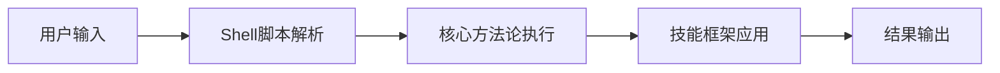
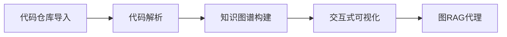
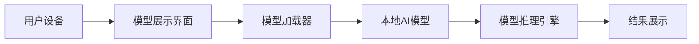
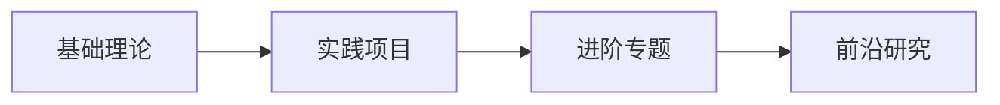
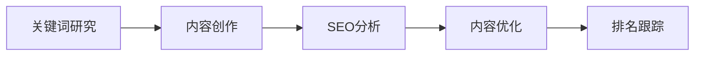
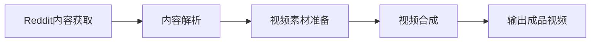
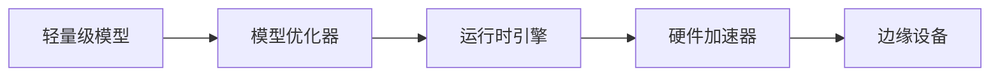
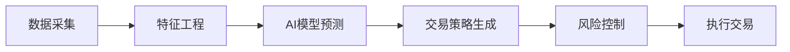
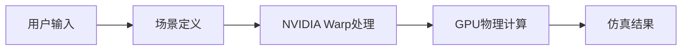
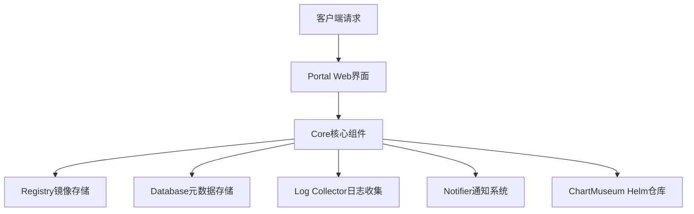

## 今日热点

今日GitHub热榜主要呈现AI技术本地化与边缘计算趋势，同时AI在内容创作、金融科技及开发者工具领域的应用持续升温。

---

## 热门项目一览

| 排名 | 项目 | 语言 | 今日 | 总计 | 简介 |
|:---:|------|:----:|------:|-----:|------|
| 1 | [obra/superpowers](https://github.com/obra/superpowers) | Shell | +2,028 | 141,563 | An agentic skills framework... |
| 2 | [abhigyanpatwari/GitNexus](https://github.com/abhigyanpatwari/GitNexus) | TypeScript | +980 | 25,310 | GitNexus: The Zero-Server C... |
| 3 | [google-ai-edge/gallery](https://github.com/google-ai-edge/gallery) | Kotlin | +853 | 19,516 | A gallery that showcases on... |
| 4 | [forrestchang/andrej-karpathy-skills](https://github.com/forrestchang/andrej-karpathy-skills) | Unknown | +702 | 9,016 | No description |
| 5 | [TheCraigHewitt/seomachine](https://github.com/TheCraigHewitt/seomachine) | Python | +649 | 4,597 | A specialized Claude Code w... |
| 6 | [NVIDIA/personaplex](https://github.com/NVIDIA/personaplex) | Python | +586 | 8,423 | PersonaPlex code. |
| 7 | [elebumm/RedditVideoMakerBot](https://github.com/elebumm/RedditVideoMakerBot) | Python | +555 | 10,496 | Create Reddit Videos with j... |
| 8 | [google-ai-edge/LiteRT-LM](https://github.com/google-ai-edge/LiteRT-LM) | C++ | +501 | 2,994 | No description |
| 9 | [virattt/ai-hedge-fund](https://github.com/virattt/ai-hedge-fund) | Python | +151 | 50,690 | An AI Hedge Fund Team |
| 10 | [newton-physics/newton](https://github.com/newton-physics/newton) | Python | +91 | 4,101 | An open-source, GPU-acceler... |
| 11 | [goharbor/harbor](https://github.com/goharbor/harbor) | Go | +42 | 28,126 | An open source trusted clou... |

---

## 趋势洞察

```
┌─────────────────────────────────────────────────────────────────┐
│  AI/ML 工具         ████████████████████████  6 个项目        │
│  其他               ████████████              3 个项目        │
│  多媒体应用            ████                      1 个项目        │
│  项目管理             ████                      1 个项目        │
└─────────────────────────────────────────────────────────────────┘
```

---

## 项目深度解读

### 1. obra/superpowers — 开发方法论框架

> **一句话总结**：一个实用的代理技能框架和软件开发方法论，通过Shell脚本提供高效开发工具。

#### 价值主张

| 维度 | 说明 |
|------|------|
| **解决痛点** | 解决传统软件开发效率低下、方法零散的问题 |
| **目标用户** | 开发者、技术团队、软件工程师 |
| **核心亮点** | 实用方法论 + 命令行工具 + 框架化 + 可扩展 |

#### 技术架构



**技术特色**：
- 轻量级Shell实现，跨平台兼容性强
- 模块化脚本设计，易于扩展和维护
- 实用命令行工具，简化开发流程

#### 热度分析

- 项目获得超14万Star，近期每日新增2千以上，表明方法论受到广泛认可
- Fork数量适中，说明用户不仅关注而且积极实践和定制该方法论

#### 快速上手

```bash
# 克隆项目
git clone https://github.com/obra/superpowers.git
cd superpowers
# 执行安装脚本
./install.sh
```

#### 注意事项
- 由于是Shell脚本项目，在Windows系统上可能需要额外配置
- 项目方法论需要一定学习成本，建议先阅读文档再实践


### 2. abhigyanpatwari/GitNexus — 零服务器代码智能

> **一句话总结**：完全在浏览器中运行的代码知识图谱创建工具，无需服务器即可实现交互式代码探索。

#### 价值主张

| 维度 | 说明 |
|------|------|
| **解决痛点** | 传统代码分析工具需要服务器部署，难以快速理解复杂代码库结构 |
| **目标用户** | 开发人员、代码审查者、技术研究人员和架构师 |
| **核心亮点** | 完全客户端运行 + 交互式知识图谱 + 内置图RAG代理 + 零配置使用 |

#### 技术架构



**技术特色**：
- 基于WebAssembly实现高性能客户端代码处理
- 采用TypeScript开发，确保代码质量和类型安全
- 利用现代浏览器API实现零安装使用体验

#### 热度分析

- 项目Star数突破2.5万，单日增长近千，显示出极强的社区关注度和增长势头
- 作为完全客户端的代码智能工具，在开发者工具生态中占据独特位置

#### 快速上手

```bash
# 访问GitNexus网页应用
open https://gitnexus.abhigyan.xyz/

# 或克隆本地开发版本
git clone https://github.com/abhigyanpatwari/GitNexus.git
cd GitNexus
npm install
npm run dev
```

#### 注意事项

- 由于完全在浏览器中运行，处理超大型代码仓库时可能受到浏览器内存限制
- 项目未明确说明许可证，使用前需确认授权条款
- 所有数据处理均在本地完成，无法利用云端计算资源加速处理


### 3. google-ai-edge/gallery — 边缘AI模型库

> **一句话总结**：谷歌官方提供的边缘设备AI模型展示库，允许用户本地运行和体验各种AI模型。

#### 价值主张

| 维度 | 说明 |
|------|------|
| **解决痛点** | 解决AI模型难以在本地设备运行和体验的问题 |
| **目标用户** | AI开发者、移动应用开发者、机器学习爱好者 |
| **核心亮点** | + 谷歌官方支持 + 本地模型运行 + 多样化AI用例展示 + 即开即用示例 |

#### 技术架构



**技术特色**：
- 基于Kotlin开发，充分利用Android生态优势
- 支持多种边缘AI模型，无需云端计算资源
- 提供直观的用户界面，方便体验和测试
- 模型轻量化，适合在移动设备上运行

#### 热度分析

- 项目获得近2万星，单日增长853，显示边缘AI领域热度快速上升
- 作为谷歌官方项目，在AI边缘计算领域具有权威性和引领作用

#### 快速上手

```bash
# 克隆仓库
git clone https://github.com/google-ai-edge/gallery.git

# 初始化项目并运行示例
cd gallery
./gradlew installDebug
```

#### 注意事项

- 项目可能需要较新的Android设备才能流畅运行某些AI模型
- 部分AI模型可能需要特定的硬件加速支持（如NPU）
- 模型性能可能因设备硬件配置不同而有所差异


### 4. forrestchang/andrej-karpathy-skills — AI学习路径

> **一句话总结**：Andrej Karpathy技能学习资源整合，系统化AI知识体系构建。

#### 价值主张

| 维度 | 说明 |
|------|------|
| **解决痛点** | AI学习资源分散，缺乏系统化学习路径 |
| **目标用户** | AI初学者、转行者、技术提升者 |
| **核心亮点** | + 系统化知识结构 + 实践导向 + 前沿技术整合 |

#### 技术架构



**技术特色**：
- 结构化学习路径设计
- 理论与实践结合
- 多领域知识整合

#### 热度分析

- 项目获得9k+高星，近期增长迅速，显示AI学习资源需求旺盛
- 社区活跃度高，表明AI学习领域资源整合价值得到认可

#### 快速上手

```bash
# 克隆项目
git clone https://github.com/forrestchang/andrej-karpathy-skills.git

# 进入项目目录
cd andrej-karpathy-skills
```

#### 注意事项
- 项目可能需要一定的AI基础知识
- 建议按照项目结构逐步学习，不要跳过基础内容
- 注意项目更新状态，部分内容可能随技术发展需要更新


### 5. TheCraigHewitt/seomachine — SEO内容创作助手

> **一句话总结**：基于Claude Code的SEO优化博客创作系统，帮助企业产出高排名长篇内容。

#### 价值主张

| 维度 | 说明 |
|------|------|
| **解决痛点** | 解决企业博客内容SEO优化困难、排名低、转化率不高的问题 |
| **目标用户** | 企业内容营销团队、SEO从业者、博客内容创作者 |
| **核心亮点** | Claude Code深度集成 + 系统化SEO优化流程 + 数据驱动排名提升 |

#### 技术架构



**技术特色**：
- 基于Claude大语言模型的高质量内容生成
- 集成SEO分析和优化算法
- 系统化内容创作工作流管理
- 数据驱动的排名提升策略

#### 热度分析

- 项目近期热度显著上升，单日增长649 stars，表明SEO内容创作需求旺盛
- 作为垂直领域工具，拥有稳定的专业用户群体，生态位置独特

#### 快速上手

```bash
# 克隆项目
git clone https://github.com/TheCraigHewitt/seomachine.git
cd seomachine

# 安装依赖
pip install -r requirements.txt
```

#### 注意事项

- 需要Claude API访问权限，可能产生额外成本
- SEO效果受多种因素影响，工具提供的是优化建议而非保证
- 建议配合内容营销策略使用，而非仅依赖工具自动生成


### 6. NVIDIA/personaplex — AI人格管理系统

> **一句话总结**：NVIDIA开发的AI角色生成与管理框架，支持多模态人格表现与交互。

#### 价值主张

| 维度 | 说明 |
|------|------|
| **解决痛点** | 统一管理AI多角色表现与交互能力，解决角色一致性难题 |
| **目标用户** | AI对话系统开发者、虚拟助手设计师、游戏角色创造者 |
| **核心亮点** | 多模态人格表现 + 角色一致性控制 + 交互风格定制 |

#### 技术架构


**技术特色**：
- 基于Transformer的多角色建模技术
- 跨模态人格特征提取与融合
- 高效的GPU加速推理引擎

#### 热度分析

- 项目Star数8,423且单日增长586，显示近期热度急剧上升，可能因重大更新或应用突破。
- 作为NVIDIA旗下项目，在AI生成领域具有生态位优势，吸引大量开发者关注。

#### 快速上手

```bash
# 克隆项目
git clone https://github.com/NVIDIA/personaplex.git

# 安装依赖
cd personaplex
pip install -r requirements.txt
```

#### 注意事项

- 项目未明确许可证，使用前需确认授权条款
- 可能需要NVIDIA GPU以获得最佳性能
- 需要大量计算资源进行模型训练


### 7. elebumm/RedditVideoMakerBot — Reddit视频生成器

> **一句话总结**：通过单命令自动化将Reddit内容转换为视频，简化内容创作流程。

#### 价值主张

| 维度 | 说明 |
|------|------|
| **解决痛点** | 解决手动制作Reddit视频内容繁琐、耗时的问题，实现一键自动化生成。 |
| **目标用户** | 内容创作者、社交媒体运营者、Reddit社区活跃用户。 |
| **核心亮点** | 一键命令操作 + 自动化视频生成 + 支持多种Reddit内容格式 |

#### 技术架构



**技术特色**：
- 利用Reddit API获取内容和元数据
- 自动化视频生成流水线处理
- 多媒体处理与合成技术栈
- 命令行接口设计简化操作
- 批量处理能力提高效率

#### 热度分析

- 项目超1万星且持续增长，显示自动化内容生成工具市场需求旺盛
- 作为Reddit生态垂直工具，具有明确的场景应用价值和技术壁垒

#### 快速上手

```bash
# 安装依赖
pip install -r requirements.txt

# 运行命令生成视频
python bot.py "https://www.reddit.com/r/subreddit/comments/post_id/"
```

#### 注意事项

- 需要遵守Reddit API使用规则和速率限制
- 可能需要配置API密钥和认证信息才能正常访问Reddit内容
- 视频生成时间取决于内容复杂度和长度，可能需要等待
- 输出视频质量和格式可能需要额外配置以满足不同平台需求


### 8. google-ai-edge/LiteRT-LM — 边缘语言模型运行时

> **一句话总结**：谷歌开发的高效边缘设备语言模型运行时，优化轻量级模型部署。

#### 价值主张

| 维度 | 说明 |
|------|------|
| **解决痛点** | 解决边缘设备资源有限下部署语言模型的性能与效率问题 |
| **目标用户** | 边缘AI开发者、移动应用开发者、IoT设备制造商 |
| **核心亮点** | 轻量级实现 + 低延迟推理 + 资源优化 + 模型量化支持 |

#### 技术架构



**技术特色**：
- 专为边缘环境设计的模型加载与推理优化
- 支持模型量化和压缩技术减少内存占用
- 提供高效的硬件加速接口适配

#### 热度分析

- 项目近期增长迅速，单日新增500+星标，显示边缘AI领域关注度提升
- 作为谷歌AI边缘项目，处于边缘计算和模型轻量化技术的前沿位置

#### 快速上手

```bash
git clone https://github.com/google-ai-edge/LiteRT-LM.git
cd LiteRT-LM
bazel build //lite:lm_runtime
```

#### 注意事项

- 需要了解项目支持的硬件平台和模型格式
- 注意模型大小与边缘设备资源的匹配问题
- 可能需要特定的工具链和依赖库


### 9. virattt/ai-hedge-fund — AI对冲基金

> **一句话总结**：基于人工智能的自动化交易系统，通过机器学习算法实现金融市场预测与投资决策。

#### 价值主张

| 维度 | 说明 |
|------|------|
| **解决痛点** | 传统投资决策依赖人工经验，AI提供更精准的市场预测和自动化交易 |
| **目标用户** | 量化交易者、投资机构、金融科技开发者 |
| **核心亮点** | 机器学习模型集成 + 多市场数据融合 + 实时回测系统 + 风险控制模块 |

#### 技术架构



**技术特色**：
- 多源市场数据整合与清洗技术
- 深度学习与强化学习结合的交易模型
- 分布式回测系统架构
- 实时风险监控与止损机制

#### 热度分析

- 高Star数与持续增长表明项目在量化交易领域具有广泛影响力
- Fork数与Star数比例合理，社区贡献活跃，项目生态健康发展

#### 快速上手

```bash
# 克隆项目
git clone https://github.com/virattt/ai-hedge-fund.git
cd ai-hedge-fund

# 安装依赖
pip install -r requirements.txt

# 运行示例
python run_backtest.py --config examples/sample_config.json
```

#### 注意事项

- 项目涉及实际金融交易，使用前需充分理解风险并进行充分测试
- 需要配置数据源API密钥和交易账户信息
- 建议在模拟环境中验证策略效果后再应用于实盘
- 项目许可证信息不明确，商业使用前需确认授权条款


### 10. newton-physics/newton — 高性能物理引擎

> **一句话总结**：基于NVIDIA Warp构建的GPU加速物理仿真引擎，专为机器人学研究人员设计。

#### 价值主张

| 维度 | 说明 |
|------|------|
| **解决痛点** | 传统CPU物理仿真计算效率低下，难以满足复杂机器人系统实时仿真需求 |
| **目标用户** | 机器人学研究人员、仿真工程师、AI训练开发者 |
| **核心亮点** | GPU加速 + NVIDIA Warp支持 + 开源免费 + 专为机器人优化 + 高性能计算 |

#### 技术架构



**技术特色**：
- 基于NVIDIA Warp实现GPU加速物理计算
- 专为机器人应用优化的物理引擎
- 提供Python API易于集成与扩展

#### 热度分析

- 项目获得4,101个Star，今日新增91个，显示快速增长态势
- 作为专业物理仿真引擎，在机器人研究和AI训练领域有特定应用场景

#### 快速上手

```bash
# 安装依赖
pip install nvidia-warp

# 导入Newton引擎
from newton import PhysicsEngine

# 创建物理引擎实例
engine = PhysicsEngine()
```

#### 注意事项

- 需要NVIDIA GPU支持，仅限CUDA架构
- 依赖NVIDIA Warp库，需确保兼容性
- 项目许可证不明确，使用前需确认授权条款
- 作为新兴项目，文档和示例可能不够完善


### 11. goharbor/harbor — 企业级镜像仓库

> **一句话总结**：开源云原生容器镜像仓库，提供安全存储、签名和扫描功能。

#### 价值主张

| 维度 | 说明 |
|------|------|
| **解决痛点** | 解决企业级容器镜像安全存储、访问控制和漏洞扫描需求 |
| **目标用户** | DevOps团队、企业级容器平台用户、云原生应用开发者 |
| **核心亮点** | 企业级安全控制 + 镜像漏洞扫描 + 多租户支持 + 高可用部署 |

#### 技术架构



**技术特色**：
- 基于 Docker Distribution 的企业级镜像仓库
- 支持镜像漏洞扫描和安全签名机制
- 提供 RBAC 多租户访问控制和审计日志
- 支持镜像复制和远程同步功能
- 与 Kubernetes 和云原生生态系统深度集成

#### 热度分析

- Star 数持续稳定增长，累计超过 28k，表明项目在容器镜像管理领域具有广泛认可
- 作为 CNCF 孵化项目，Harbor 已成为企业级容器镜像管理的事实标准之一

#### 快速上手

```bash
# 使用 Helm 安装
helm repo add harbor https://helm.goharbor.io
helm install harbor harbor/harbor --namespace harbor --create-namespace

# 或使用 Docker Compose 安装
docker-compose up -d
```

#### 注意事项

- Harbor 需要 HTTPS 配置才能正常工作，建议配置有效的 SSL 证书
- 企业部署时需要配置适当的存储后端，如 NFS、Ceph 或云存储
- 安全扫描功能需要集成第三方漏洞数据库，如 Clair、Trivy 等
- 大规模部署需要考虑数据库性能优化和高可用配置


## 今日推荐

| 主题 | 推荐项目 | 亮点 |
|------|----------|------|
| 今日最热 | [obra/superpowers](https://github.com/obra/superpowers) | An agentic skills... |
| 值得关注 | [abhigyanpatwari/GitNexus](https://github.com/abhigyanpatwari/GitNexus) | GitNexus: The Zer... |
| 快速上手 | [google-ai-edge/gallery](https://github.com/google-ai-edge/gallery) | A gallery that sh... |
| 长期潜力 | [forrestchang/andrej-karpathy-skills](https://github.com/forrestchang/andrej-karpathy-skills) | No description |

---

<div align="center">

*Generated on 2026-04-09 | Powered by GitHub Trending Reporter*

</div>