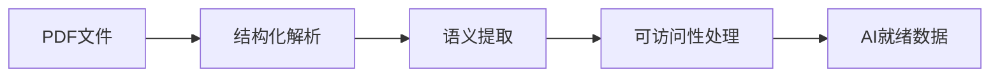

## 今日热点

今日GitHub热榜项目精彩纷呈。

---

## 热门项目一览

| 排名 | 项目 | 语言 | 今日 | 总计 | 简介 |
|:---:|------|:----:|------:|-----:|------|
| 1 | [NousResearch/hermes-agent](https://github.com/NousResearch/hermes-agent) | Python | +6,485 | 44,809 | The agent that grows with you |
| 2 | [obra/superpowers](https://github.com/obra/superpowers) | Shell | +2,299 | 143,807 | An agentic skills framework... |
| 3 | [forrestchang/andrej-karpathy-skills](https://github.com/forrestchang/andrej-karpathy-skills) | Unknown | +1,364 | 10,519 | A single CLAUDE.md file to ... |
| 4 | [HKUDS/DeepTutor](https://github.com/HKUDS/DeepTutor) | Python | +1,310 | 14,925 | "DeepTutor: Agent-Native Pe... |
| 5 | [opendataloader-project/opendataloader-pdf](https://github.com/opendataloader-project/opendataloader-pdf) | Java | +1,124 | 13,844 | PDF Parser for AI-ready dat... |
| 6 | [TheCraigHewitt/seomachine](https://github.com/TheCraigHewitt/seomachine) | Python | +725 | 5,219 | A specialized Claude Code w... |
| 7 | [OpenBMB/VoxCPM](https://github.com/OpenBMB/VoxCPM) | Python | +496 | 7,693 | VoxCPM2: Tokenizer-Free TTS... |
| 8 | [shiyu-coder/Kronos](https://github.com/shiyu-coder/Kronos) | Python | +245 | 12,207 | Kronos: A Foundation Model ... |
| 9 | [YishenTu/claudian](https://github.com/YishenTu/claudian) | TypeScript | +200 | 6,854 | An Obsidian plugin that emb... |
| 10 | [coleam00/Archon](https://github.com/coleam00/Archon) | TypeScript | +185 | 14,444 | The first open-source harne... |

---

## 趋势洞察

```
┌─────────────────────────────────────────────────────────────────┐
│  AI/ML 工具         ████████████████████████  8 个项目        │
│  其他               ██████                    2 个项目        │
└─────────────────────────────────────────────────────────────────┘
```

---

## 项目深度解读

### 1. NousResearch/hermes-agent — 成长型代理框架

> **一句话总结**：自适应学习的智能代理系统，能随使用持续成长与优化。

#### 价值主张

| 维度 | 说明 |
|------|------|
| **解决痛点** | 解决传统代理系统缺乏自适应能力和长期学习机制的问题 |
| **目标用户** | AI研究人员、企业开发者、需要高级智能代理的团队 |
| **核心亮点** | 持续学习能力 + 模块化架构 + 多任务处理 + 知识积累 + 自我优化 |

#### 技术架构


**技术特色**：
- 自适应学习算法，使代理能从交互中持续获取知识
- 模块化设计，支持灵活扩展和功能定制
- 反馈循环机制，实现代理的自我优化和成长

#### 热度分析

- 项目Star数单日激增6485，显示近期获得广泛关注和认可
- 高Fork/Star比例表明社区积极参与二次开发和功能扩展

#### 快速上手

```bash
# 克隆仓库
git clone https://github.com/NousResearch/hermes-agent.git

# 安装依赖
pip install -r requirements.txt

# 运行基础示例
python examples/basic_agent.py
```

#### 注意事项

- 项目许可证信息不明确，使用前需确认具体授权条款
- 建议查阅官方文档了解配置细节，避免因配置不当导致功能异常
- 由于Open Issues为0，社区支持可能主要通过其他渠道提供


### 2. obra/superpowers — 智能开发框架

> **一句话总结**：一种实用的智能代理技能框架，提供高效软件开发的系统方法论。

#### 价值主张

| 维度 | 说明 |
|------|------|
| **解决痛点** | 解决软件开发中智能代理技能应用效率问题 |
| **目标用户** | 软件开发团队与技术管理者 |
| **核心亮点** | 实用框架 + 系统方法论 + 高效开发实践 |

#### 技术架构


**技术特色**：
- 基于Shell的轻量级实现
- 模块化技能组件设计
- 跨平台兼容性支持

#### 热度分析

- 项目Star数超过14万，单日新增两千余，表明受开发者高度认可
- 高社区参与度，零未解决问题，反映项目成熟度与维护质量

#### 快速上手

```bash
git clone https://github.com/obra/superpowers.git
cd superpowers
chmod +x install.sh && ./install.sh
```

#### 注意事项

- 项目主要基于Shell脚本，需具备基本Shell知识
- 使用前需确认系统兼容性，某些功能可能需要特定依赖


### 3. forrestchang/andrej-karpathy-skills — AI编程指南

> **一句话总结**：基于Karpathy经验的Claude Code优化指南，提升AI编程效率和质量。

#### 价值主张

| 维度 | 说明 |
|------|------|
| **解决痛点** | 解决AI编程中常见的陷阱和低效问题 |
| **目标用户** | 使用Claude Code的开发者和AI编程爱好者 |
| **核心亮点** | 实践经验总结 + 优化建议 + 编程技巧 |

#### 技术架构

**技术特色**：
- 基于顶尖AI专家经验
- 针对Claude Code优化
- 简洁实用的编程指南

#### 热度分析

- 项目获得超过1万颗星，单日增长超1300，显示AI编程领域的高关注度
- 作为单一文件项目，热度主要来源于内容的实用性和参考价值

#### 快速上手

```bash
# 克隆项目查看CLAUDE.md文件
git clone https://github.com/forrestchang/andrej-karpathy-skills.git
cat andrej-karpathy-skills/CLAUDE.md
```

#### 注意事项

- 内容主要针对Claude Code，其他AI编程工具可能需要调整
- 项目为单一文件，没有版本控制历史或分支功能
- 使用时建议结合自身编程实践进行调整


### 4. HKUDS/DeepTutor — 智能学习助手

> **一句话总结**：基于智能代理的个性化学习助手，为每位学习者提供定制化教育体验。

#### 价值主张

| 维度 | 说明 |
|------|------|
| **解决痛点** | 传统教育难以满足个性化需求，通过AI代理实现定制化学习路径 |
| **目标用户** | 需要个性化学习体验的学生、教育工作者及在线教育平台 |
| **核心亮点** | 基于大模型智能代理 + 自适应学习路径 + 多模态内容整合 + 实时学习反馈 + 知识图谱构建 |

#### 技术架构


**技术特色**：
- 基于大语言模型的智能代理交互技术
- 多维度学习者画像构建与动态更新
- 自适应学习路径生成算法
- 多模态学习内容智能整合
- 实时学习分析与反馈机制

#### 热度分析

- 近期增长迅猛，单日新增Star超1300，显示在AI教育领域备受关注
- Star/Fork比达7.5，表明社区活跃度高，开发者参与意愿强烈

#### 快速上手

```bash
# 克隆项目
git clone https://github.com/HKUDS/DeepTutor.git
cd DeepTutor

# 安装依赖
pip install -r requirements.txt

# 运行示例
python example/demo.py
```

#### 注意事项

- 项目许可证信息未知，使用前需确认授权条款
- 运行可能需要较高计算资源，特别是大语言模型组件
- 建议查阅项目文档了解具体使用场景和限制条件


### 5. opendataloader-project/opendataloader-pdf — [AI PDF解析器]

> **一句话总结**：专为AI数据准备的PDF解析工具，自动化处理PDF可访问性问题。

#### 价值主张

| 维度 | 说明 |
|------|------|
| **解决痛点** | 解决PDF文档难以被AI系统解析和理解的问题 |
| **目标用户** | AI开发者、数据科学家、文档处理工程师 |
| **核心亮点** | 高精度解析+保留文档结构+自动化可访问性处理 |

#### 技术架构



**技术特色**：
- 基于Java的高性能PDF解析引擎
- 智能保留文档结构和语义信息
- 自动化处理PDF可访问性问题

#### 热度分析

- 项目Star数高且增长迅速，表明PDF解析在AI领域需求旺盛
- 高Fork数和零Issues反映项目社区活跃度高且维护良好

#### 快速上手

```bash
# 添加依赖到Maven项目
<dependency>
    <groupId>io.github.opendataloader</groupId>
    <artifactId>opendataloader-pdf</artifactId>
    <version>最新版本</version>
</dependency>

# 基本使用示例
OpenDataLoader loader = new OpenDataLoader();
PDFDocument doc = loader.load("example.pdf");
```

#### 注意事项

- 项目可能需要商业许可证用于商业用途（因为许可证未知）
- 处理大型PDF文件时可能需要额外内存配置
- 建议在使用前测试特定PDF格式的兼容性


### 6. TheCraigHewitt/seomachine — SEO内容生成器

> **一句话总结**：基于Claude Code的SEO优化博客创作系统，帮助企业生成高质量且搜索引擎友好的长篇内容。

#### 价值主张

| 维度 | 说明 |
|------|------|
| **解决痛点** | 解决内容创作与SEO优化分离问题，提升内容排名和受众覆盖 |
| **目标用户** | 企业内容营销团队、SEO专家、博客写作者 |
| **核心亮点** | 专业SEO优化 + Claude AI辅助 + 全流程内容创作 + 数据分析驱动 |

#### 技术架构


**技术特色**：
- 集成Claude AI进行智能内容生成
- 内置SEO分析引擎优化内容结构
- 全流程数据驱动的内容决策系统

#### 热度分析

- 项目近期增长迅速，单日新增725个Star，表明市场对AI辅助SEO工具需求旺盛
- 高Star/Fork比例(约7:1)显示项目实用性强，社区参与度高

#### 快速上手

```bash
# 安装依赖
pip install seomachine

# 初始化项目
seomachine init "your-business-topic"

# 生成SEO优化内容
seomachine generate --keywords "keyword1, keyword2"
```

#### 注意事项

- 需要Claude API访问权限，可能涉及额外费用
- 生成内容仍需人工审核以确保质量和原创性
- SEO效果受多因素影响，需长期优化和测试


### 7. OpenBMB/VoxCPM — 无标记化TTS

> **一句话总结**：无标记化多语言语音合成技术，支持创意声音设计与逼真克隆，实现高质量语音生成。

#### 价值主张

| 维度 | 说明 |
|------|------|
| **解决痛点** | 传统TTS依赖标记化过程，限制语音质量和多语言适应性 |
| **目标用户** | 语音合成开发者、内容创作者、语音助手开发者、语音克隆需求方 |
| **核心亮点** | 无标记化处理 + 多语言支持 + 创意声音设计 + 逼真语音克隆 + 高质量语音生成 |

#### 技术架构


**技术特色**：
- 无标记化语音合成技术，避免传统标记化过程的信息损失
- 多语言统一框架，支持跨语言语音生成
- 创意声音设计系统，允许自定义语音特征

#### 热度分析

- 项目近期增长迅速，单日新增近500星，表明技术方向受社区高度关注
- OpenBMB组织背景增强项目可信度，但Issues数为0可能反映项目尚处早期阶段

#### 快速上手

```bash
# 克隆项目
git clone https://github.com/OpenBMB/VoxCPM.git
cd VoxCPM

# 安装依赖
pip install -r requirements.txt

# 运行示例
python demo.py
```

#### 注意事项

- 项目依赖可能较大，需要充足的计算资源
- 语音合成质量可能受硬件配置影响显著
- 使用时需注意语音克隆的伦理和法律边界
- 项目文档可能尚不完善，需要自行探索代码实现


### 8. shiyu-coder/Kronos — 金融语言模型

> **一句话总结**：Kronos是专为金融市场语言设计的基础模型，融合金融专业知识与自然语言处理能力。

#### 价值主张

| 维度 | 说明 |
|------|------|
| **解决痛点** | 金融领域专业术语和复杂表达的理解与处理 |
| **目标用户** | 金融分析师、量化交易员、投资研究人员 |
| **核心亮点** | 金融领域知识融合 + 多语言金融文本理解 + 市场趋势预测能力 |

#### 技术架构


**技术特色**：
- 专门针对金融领域优化的预训练模型架构
- 融合金融专业知识与通用语言理解能力
- 支持多语言金融文本分析处理和预测

#### 热度分析

- 项目Star数超过12k，近期增长迅速(+245 today)，表明社区关注度持续上升
- Fork数与Star数比例约1:5，说明项目实用性强，开发者社区参与度高

#### 快速上手

```bash
# 安装依赖
pip install kronos-model

# 基本使用
from kronos import KronosModel
model = KronosModel.from_pretrained("shiyu-coder/kronos")
result = model.predict("市场分析文本")
```

#### 注意事项

- 模型使用需要金融领域专业知识背景，非专业人士使用可能存在理解偏差
- 需遵守相关金融数据使用法规和隐私政策，不可用于非法金融活动
- 模型预测结果仅供参考，不应作为投资决策的唯一依据


### 9. YishenTu/claudian — AI笔记助手

> **一句话总结**：将Claude AI集成到Obsidian笔记中，提供智能写作和内容生成能力。

#### 价值主张

| 维度 | 说明 |
|------|------|
| **解决痛点** | 解决笔记创作效率低、缺乏AI辅助的问题 |
| **目标用户** | 需要高效创作的知识工作者、研究人员、写作者 |
| **核心亮点** | 直接在笔记中调用Claude AI + 无需切换应用 + 保持上下文连续性 + 支持多种创作任务 |

#### 技术架构


**技术特色**：
- 利用Obsidian插件API实现无缝集成
- 通过Claude API提供强大AI能力
- 保持笔记上下文连续性，增强AI理解能力

#### 热度分析

- 项目获得近7K星，单日增长200+，表明AI辅助写作工具需求旺盛
- 作为Obsidian生态中的重要插件，与AI写作工具形成互补

#### 快速上手

```bash
# 安装步骤
1. 在Obsidian中打开社区插件
2. 搜索"claudian"并安装
3. 配置Claude API密钥
4. 在笔记中使用命令或快捷键调用Claude
```

#### 注意事项

- 需要Claude API密钥，可能产生费用
- 注意隐私问题，避免输入敏感信息
- 依赖Claude服务的可用性和稳定性


### 10. coleam00/Archon — AI编码确定性工具

> **一句话总结**：首个开源AI编码工具构建器，使AI编程结果确定且可重复。

#### 价值主张

| 维度 | 说明 |
|------|------|
| **解决痛点** | AI编程结果不可预测、难以复现的问题 |
| **目标用户** | AI开发者、研究人员、测试工程师 |
| **核心亮点** | 确定性输出 + 可重复性 + 开源架构 + AI编码优化 |

#### 技术架构


**技术特色**：
- 基于TypeScript构建的类型安全架构
- 开源Harness构建器实现AI编码确定性
- 可重复的代码生成与验证机制

#### 热度分析

- Star数达14,444且持续增长(+185 today)，表明项目受关注度高
- Fork数2,465显示开发者社区积极参与二次开发与定制

#### 快速上手

```bash
# 克隆仓库
git clone https://github.com/coleam00/Archon.git
# 安装依赖
npm install
# 运行示例
npm run example
```

#### 注意事项

- 项目许可证未知，商业使用前需确认授权条款
- 由于Open Issues为0，可能表明项目处于早期阶段或问题管理方式特殊


## 今日推荐

| 主题 | 推荐项目 | 亮点 |
|------|----------|------|
| 今日最热 | [NousResearch/hermes-agent](https://github.com/NousResearch/hermes-agent) | The agent that gr... |
| 值得关注 | [obra/superpowers](https://github.com/obra/superpowers) | An agentic skills... |
| 快速上手 | [forrestchang/andrej-karpathy-skills](https://github.com/forrestchang/andrej-karpathy-skills) | A single CLAUDE.m... |
| 长期潜力 | [HKUDS/DeepTutor](https://github.com/HKUDS/DeepTutor) | "DeepTutor: Agent... |

---

<div align="center">

*Generated on 2026-04-10 | Powered by GitHub Trending Reporter*

</div>