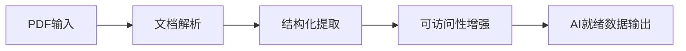

## 今日热点

AI代理与助手工具引领今日热榜，开源AI协作平台与确定性编码工具激增，显示开发者对AI辅助编程和自主代理系统的强烈需求。

---

## 热门项目一览

| 排名 | 项目 | 语言 | 今日 | 总计 | 简介 |
|:---:|------|:----:|------:|-----:|------|
| 1 | [NousResearch/hermes-agent](https://github.com/NousResearch/hermes-agent) | Python | +7,671 | 52,110 | The agent that grows with you |
| 2 | [microsoft/markitdown](https://github.com/microsoft/markitdown) | Python | +2,352 | 99,746 | Python tool for converting ... |
| 3 | [obra/superpowers](https://github.com/obra/superpowers) | Shell | +2,150 | 145,775 | An agentic skills framework... |
| 4 | [multica-ai/multica](https://github.com/multica-ai/multica) | TypeScript | +1,506 | 6,119 | The open-source managed age... |
| 5 | [forrestchang/andrej-karpathy-skills](https://github.com/forrestchang/andrej-karpathy-skills) | Unknown | +1,450 | 11,759 | A single CLAUDE.md file to ... |
| 6 | [HKUDS/DeepTutor](https://github.com/HKUDS/DeepTutor) | Python | +1,424 | 15,991 | "DeepTutor: Agent-Native Pe... |
| 7 | [opendataloader-project/opendataloader-pdf](https://github.com/opendataloader-project/opendataloader-pdf) | Java | +1,306 | 14,803 | PDF Parser for AI-ready dat... |
| 8 | [shanraisshan/claude-code-best-practice](https://github.com/shanraisshan/claude-code-best-practice) | HTML | +1,251 | 35,795 | practice made claude perfect |
| 9 | [coleam00/Archon](https://github.com/coleam00/Archon) | TypeScript | +756 | 15,646 | The first open-source harne... |
| 10 | [shiyu-coder/Kronos](https://github.com/shiyu-coder/Kronos) | Python | +601 | 12,720 | Kronos: A Foundation Model ... |
| 11 | [rowboatlabs/rowboat](https://github.com/rowboatlabs/rowboat) | TypeScript | +507 | 11,741 | Open-source AI coworker, wi... |
| 12 | [jqlang/jq](https://github.com/jqlang/jq) | C | +75 | 34,303 | Command-line JSON processor |

---

## 趋势洞察

```
┌─────────────────────────────────────────────────────────────────┐
│  AI/ML 工具         ████████████████████████  9 个项目        │
│  其他               █████                     2 个项目        │
│  开发工具             ██                        1 个项目        │
└─────────────────────────────────────────────────────────────────┘
```

---

## 项目深度解读

### 1. NousResearch/hermes-agent — 成长型智能代理

> **一句话总结**：一个能够持续学习和自我优化的AI代理系统，随使用不断进化能力。

#### 价值主张

| 维度 | 说明 |
|------|------|
| **解决痛点** | 传统AI代理缺乏持续学习和适应能力，无法随时间进化 |
| **目标用户** | AI研究人员、开发者及需要高级智能代理的组织 |
| **核心亮点** | 自我学习机制 + 模块化架构 + 多场景适应性 + 知识积累能力 |

#### 技术架构


**技术特色**：
- 基于Transformer的上下文理解能力
- 模块化设计支持灵活扩展
- 经验驱动的持续优化机制
- 多智能体协作框架支持

#### 热度分析

- 项目短期内获得超5万星标，单日增长7千+，呈现爆发式增长态势
- 高Fork/Star比例(13%)反映社区活跃度高，参与贡献意愿强烈

#### 快速上手

```bash
# 克隆仓库
git clone https://github.com/NousResearch/hermes-agent.git

# 安装依赖
cd hermes-agent && pip install -r requirements.txt

# 运行示例
python examples/basic_agent.py
```

#### 注意事项

- 项目许可证信息不明确，商业使用前需确认授权条款
- 项目处于快速发展阶段，API可能存在不稳定性
- 需要较强的AI领域知识才能充分利用系统功能


### 2. microsoft/markitdown — 文档转换工具

> **一句话总结**：一款强大的Python工具，能将各类文档和Office文件高效转换为Markdown格式。

#### 价值主张

| 维度 | 说明 |
|------|------|
| **解决痛点** | 解决多格式文档统一转换为Markdown的需求，便于跨平台使用和版本控制 |
| **目标用户** | 开发者、研究人员、内容创作者和需要处理多格式文档的专业人士 |
| **核心亮点** | 支持多种文件格式转换 + 保持原始文档结构完整性 + 转换质量高 + 微软官方维护 |

#### 技术架构


**技术特色**：
- 支持多种文档格式解析，包括Office文档
- 保留原始文档结构和格式细节
- 高效的转换算法，确保内容完整性

#### 热度分析

- 项目获得近10万Stars且近期增长迅速，表明文档转换工具需求旺盛
- 作为微软官方项目，在开发者社区具有较高影响力和认可度

#### 快速上手

```bash
# 安装
pip install markitdown

# 使用
markitdown input.docx output.md
```

#### 注意事项

- 需要Python环境运行
- 某些复杂格式的文档可能转换不完全
- 微软文档格式转换效果可能优于其他格式


### 3. obra/superpowers — [智能开发框架]

> **一句话总结**：提供智能体技能框架与实用开发方法论的Shell工具集。

#### 价值主张

| 维度 | 说明 |
|------|------|
| **解决痛点** | 解决开发者技能提升与高效开发流程问题 |
| **目标用户** | 软件开发者与技术团队 |
| **核心亮点** | 实用方法论 + 智能体技能框架 + Shell工具集成 + 开发流程优化 |

#### 技术架构


**技术特色**：
- 基于Shell的轻量级工具集实现
- 模块化的智能体技能框架设计
- 实用开发方法论与实践结合

#### 热度分析

- 项目获得14.5万+星标，日增2.1k+，表明其方法论和工具集受到广泛认可
- 高star数与零open issue的对比显示社区高度稳定和成熟

#### 快速上手

```bash
# 克隆仓库
git clone https://github.com/obra/superpowers.git
# 进入目录
cd superpowers
# 运行初始化脚本
./init.sh
```

#### 注意事项

- 项目许可证未知，使用前需确认
- 作为Shell工具集，主要适用于类Unix系统
- 可能需要一定的Shell脚本基础才能充分利用项目价值


### 4. multica-ai/multica — AI协作开发平台

> **一句话总结**：将AI编码助手转化为可协作的虚拟队友，实现任务分配、进度跟踪与技能组合。

#### 价值主张

| 维度 | 说明 |
|------|------|
| **解决痛点** | 解决AI助手协作分散、任务管理混乱的问题 |
| **目标用户** | 开发团队与需要AI辅助的程序员 |
| **核心亮点** | 任务分配 + 进度跟踪 + 技能组合 + 开源托管 |

#### 技术架构


**技术特色**：
- TypeScript实现，提供类型安全与开发体验
- 模块化AI代理系统，支持技能组合与复用
- 分布式任务调度，确保高效执行与反馈

#### 热度分析

- 项目近期热度极高，单日增长1,506 stars，显示强烈市场需求
- 开源生态中定位前沿，填补AI协作开发平台空白

#### 快速上手

```bash
# 克隆项目
git clone https://github.com/multica-ai/multica.git
# 安装依赖
npm install
# 启动服务
npm start
```

#### 注意事项

- 项目可能需要配置AI模型API密钥才能正常运行
- 作为新兴开源项目，文档和API可能仍在快速迭代中
- 建议关注项目更新，以获取最新功能和最佳实践


### 5. forrestchang/andrej-karpathy-skills — AI编程指导

> **一句话总结**：基于Andrej Karpathy对LLM编程缺陷的观察，提供改进Claude Code行为的指导文档。

#### 价值主张

| 维度 | 说明 |
|------|------|
| **解决痛点** | 解决AI编程中的常见陷阱和低效代码生成问题 |
| **目标用户** | 使用Claude Code进行开发的AI辅助编程用户 |
| **核心亮点** | 基于专家见解 + 实用指导 + 提升编程效率 |

#### 技术架构

**技术特色**：
- 基于资深AI专家的实践经验
- 简洁明了的指导文档
- 专注于提升AI编程质量

#### 热度分析

- 项目获得超过11,000星，单日增长1,450+，显示AI编程指导需求旺盛
- 零未解决问题表明项目文档完善，用户反馈良好

#### 快速上手

```bash
# 克隆仓库
git clone https://github.com/forrestchang/andrej-karpathy-skills.git

# 查看指导文档
cat andrej-karpathy-skills/CLAUDE.md
```

#### 注意事项

- 该项目主要针对Claude Code用户，其他AI编程工具可能不完全适用
- 文档内容基于当前版本的Claude Code，未来更新可能需要调整指导


### 6. HKUDS/DeepTutor — [个性化AI学习助手]

> **一句话总结**：DeepTutor是一个基于智能体的个性化学习系统，能够为用户提供定制化的学习路径和交互式学习体验。

#### 价值主张

| 维度 | 说明 |
|------|------|
| **解决痛点** | 传统学习系统缺乏个性化，无法适应不同学习者的需求 |
| **目标用户** | 学生、在线教育平台、自学者 |
| **核心亮点** | 智能体技术 + 个性化学习路径 + 自适应教学内容 + 学习行为分析 |

#### 技术架构


**技术特色**：
- 基于强化学习的智能体决策系统
- 多维度学习者画像构建技术
- 实时学习行为分析与内容调整

#### 热度分析

- 项目近期热度飙升，一日内新增1400+星，显示重大更新或突破性功能
- 高关注度但问题数为零，表明项目成熟度较高或采用其他反馈渠道

#### 快速上手

```bash
# 克隆项目
git clone https://github.com/HKUDS/DeepTutor.git

# 安装依赖
pip install -r requirements.txt

# 运行示例
python examples/demo.py
```

#### 注意事项

- 项目许可证未知，使用前需确认开源许可类型
- 可能需要GPU资源以获得最佳性能
- 建议参考项目文档和示例代码了解具体配置方法


### 7. opendataloader-project/opendataloader-pdf — AI PDF解析器

> **一句话总结**：专为AI优化的PDF解析工具，自动化处理文档可访问性，实现结构化数据提取。

#### 价值主张

| 维度 | 说明 |
|------|------|
| **解决痛点** | 传统PDF解析难以直接用于AI训练，可访问性差，结构化数据提取困难 |
| **目标用户** | AI开发者、数据科学家、文档处理自动化需求者 |
| **核心亮点** | AI数据准备 + 自动化可访问性 + 高精度结构化提取 |

#### 技术架构



**技术特色**：
- 基于深度学习的PDF内容语义理解
- 自动生成文档结构和可访问性标签
- 支持多种AI模型数据格式输出

#### 热度分析

- 项目Star数增长迅速，单日新增超过1300，表明市场需求强烈
- 作为AI数据准备工具，处于当前技术热点领域，社区关注度极高

#### 快速上手

```bash
# 添加Maven依赖
<dependency>
    <groupId>io.github.opendataloader</groupId>
    <artifactId>opendataloader-pdf</artifactId>
    <version>最新版本</version>
</dependency>

# 基本使用
OpenDataLoader pdfLoader = new OpenDataLoader();
AIReadyData data = pdfLoader.loadAndParse("example.pdf");
data.makeAccessible();
```

#### 注意事项

- 项目License未知，商业使用前需确认授权条款
- 当前Open Issues为0，可能表明项目处于早期阶段或问题管理严格
- Java实现限制了其在轻量级环境中的应用


### 8. shanraisshan/claude-code-best-practice — AI编程实践指南

> **一句话总结**：提供Claude AI编程助手的最佳实践指南，帮助开发者高效利用AI工具提升编程效率。

#### 价值主张

| 维度 | 说明 |
|------|------|
| **解决痛点** | 解决开发者如何有效利用Claude AI编程助手提高代码质量的问题 |
| **目标用户** | 使用Claude AI进行开发的程序员和软件开发团队 |
| **核心亮点** | 实用最佳实践 + 代码示例 + 效率提升技巧 |

#### 技术架构


**技术特色**：
- 基于HTML的静态文档结构，简单高效
- 可能使用Markdown编写内容，便于维护和更新
- 响应式设计，确保在各种设备上良好展示

#### 热度分析

- 项目Star数高达35,795且近期增长迅速，表明Claude AI编程助手需求旺盛
- 零Open Issues反映项目维护良好，用户问题已得到充分解决

#### 快速上手

```bash
# 克隆项目
git clone https://github.com/shanraisshan/claude-code-best-practice.git

# 使用本地服务器预览
cd claude-code-best-practice
python -m http.server 8000
```

#### 注意事项

- 项目许可证未知，使用前需确认商业适用性
- 内容可能需要根据Claude AI的更新进行同步维护


### 9. coleam00/Archon — AI编码测试框架

> **一句话总结**：首个开源AI编码测试框架构建器，使AI代码生成结果具有确定性和可重复性。

#### 价值主张

| 维度 | 说明 |
|------|------|
| **解决痛点** | AI代码生成结果不一致、不可预测、难以验证的问题 |
| **目标用户** | AI模型开发者、测试工程师、AI应用集成团队 |
| **核心亮点** + 确定性测试 + 可重复性验证 + 框架化构建 + 开源生态 |

#### 技术架构


**技术特色**：
- 基于TypeScript构建，类型安全且跨平台兼容
- 提供结构化测试框架，标准化AI编码验证流程
- 开源设计，促进社区贡献和功能扩展

#### 热度分析

- 项目获得15k+高星，表明AI测试框架需求旺盛，增长迅速
- 0个Open Issues反映项目维护良好，社区问题解决高效

#### 快速上手

```bash
# 克隆项目
git clone https://github.com/coleam00/Archon.git
# 安装依赖
npm install
# 运行示例
npm run example
```

#### 注意事项

- 项目许可证未知，商业使用前需确认授权条款
- 需要TypeScript和Node.js环境，依赖Node.js生态
- 可能需要AI模型API密钥才能完全测试功能


### 10. shiyu-coder/Kronos — [金融语言大模型]

> **一句话总结**：Kronos是专为金融市场语言设计的开源基础模型，提供专业金融文本理解和分析能力。

#### 价值主张

| 维度 | 说明 |
|------|------|
| **解决痛点** | 金融领域专业术语多、语境复杂，通用模型难以准确理解和分析 |
| **目标用户** | 金融机构、量化交易员、金融分析师、研究人员 |
| **核心亮点** | 金融领域专业训练 + 多模态金融数据处理 + 高性能推理能力 |

#### 技术架构


**技术特色**：
- 基于Transformer架构的金融领域专业模型
- 针对金融术语和语境的特殊训练方法
- 支持多种金融文本分析任务

#### 热度分析

- 项目近期热度显著增长，单日新增600+ stars，显示金融AI领域关注度提升
- 在金融科技和量化交易社区中影响力迅速扩大，成为基础模型的重要应用方向

#### 快速上手

```bash
# 安装依赖
pip install kronos-model

# 基本使用
from kronos import KronosModel
model = KronosModel.from_pretrained("shiyu-coder/kronos")
result = model.analyze("金融文本内容")
```

#### 注意事项

- 模型仅用于研究目的，实际金融决策需谨慎验证
- 金融领域数据敏感，使用时需注意数据安全和隐私保护
- 模型性能可能随金融市场变化而需要定期更新


### 11. rowboatlabs/rowboat — AI记忆助手

> **一句话总结**：具有记忆能力的开源AI助手，能记住用户交互历史，提供持续对话体验。

#### 价值主张

| 维度 | 说明 |
|------|------|
| **解决痛点** | AI助手无法记住历史交互，导致对话不连贯、缺乏上下文理解 |
| **目标用户** | 需要长期协作AI的开发者、研究人员和普通用户 |
| **核心亮点** | 记忆存储系统 + 持续对话能力 + 个性化体验 + TypeScript开发 + 开源可定制 |

#### 技术架构


**技术特色**：
- 基于TypeScript构建，类型安全性强
- 实现记忆系统，保存长期对话历史
- 持续对话能力，维持上下文连贯性

#### 热度分析

- Star数超过1.1万，近期激增(+507 today)，显示项目热度高且增长迅速
- Fork数达1千以上，表明社区活跃度高，有较多贡献者参与项目开发

#### 快速上手

```bash
# 克隆项目
git clone https://github.com/rowboatlabs/rowboat.git

# 安装依赖
npm install

# 启动服务
npm run start
```

#### 注意事项

- 项目需要配置AI API密钥才能正常工作
- 记忆功能可能需要额外的配置和存储设置
- 作为开源项目，用户可能需要自行部署和维护


### 12. jqlang/jq — JSON 命令行处理器

> **一句话总结**：高效处理 JSON 数据的轻量级命令行查询工具，支持复杂过滤与转换操作。

#### 价值主张

| 维度 | 说明 |
|------|------|
| **解决痛点** | 命令行环境下难以直接查询和转换 JSON 数据的问题 |
| **目标用户** | 开发者、数据分析师、系统管理员和自动化脚本编写者 |
| **核心亮点** | 流畅查询语法 + 流式处理能力 + 跨平台支持 + 丰富过滤器 |

#### 技术架构


**技术特色**：
- 基于流的 JSON 解析算法，支持大文件处理
- 实现类 Lisp 表达式求值器，支持函数式编程
- C 语言编写确保高性能和低内存占用

#### 热度分析

- Star 数超 3.4 万且持续稳定增长，在开发者社区具有广泛认可度
- 作为命令行 JSON 处理的事实标准，在 DevOps 和数据处理领域占据重要生态位置

#### 快速上手

```bash
# 提取 JSON 中的特定字段
cat data.json | jq '.name'

# 过滤数组中满足条件的元素
cat data.json | jq '.users[] | select(.age > 30)'

# 转换 JSON 结构
cat data.json | jq '{newName: .name, newAge: .age}'
```

#### 注意事项

- jq 语法虽类似 JavaScript，但有细微差别，需特别注意
- 处理超大 JSON 文件时，尽管支持流式处理，仍需关注内存使用情况


## 今日推荐

| 主题 | 推荐项目 | 亮点 |
|------|----------|------|
| 今日最热 | [NousResearch/hermes-agent](https://github.com/NousResearch/hermes-agent) | The agent that gr... |
| 值得关注 | [microsoft/markitdown](https://github.com/microsoft/markitdown) | Python tool for c... |
| 快速上手 | [obra/superpowers](https://github.com/obra/superpowers) | An agentic skills... |
| 长期潜力 | [multica-ai/multica](https://github.com/multica-ai/multica) | The open-source m... |

---

<div align="center">

*Generated on 2026-04-11 | Powered by GitHub Trending Reporter*

</div>