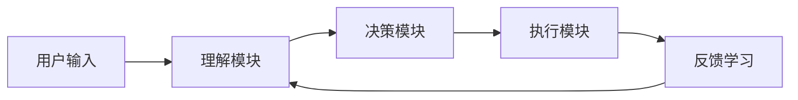
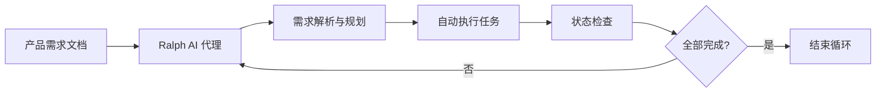
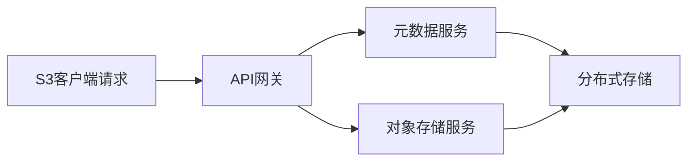

## 今日热点

今日GitHub热榜凸显AI代理与编程助手技术的爆发式增长，Claude Code生态工具链快速形成，同时专业领域AI应用与高性能存储系统也备受关注。

---

## 热门项目一览

| 排名 | 项目 | 语言 | 今日 | 总计 | 简介 |
|:---:|------|:----:|------:|-----:|------|
| 1 | [NousResearch/hermes-agent](https://github.com/NousResearch/hermes-agent) | Python | +7,454 | 67,332 | The agent that grows with you |
| 2 | [microsoft/markitdown](https://github.com/microsoft/markitdown) | Python | +2,513 | 104,878 | Python tool for converting ... |
| 3 | [forrestchang/andrej-karpathy-skills](https://github.com/forrestchang/andrej-karpathy-skills) | Unknown | +2,369 | 17,051 | A single CLAUDE.md file to ... |
| 4 | [shiyu-coder/Kronos](https://github.com/shiyu-coder/Kronos) | Python | +1,985 | 15,840 | Kronos: A Foundation Model ... |
| 5 | [multica-ai/multica](https://github.com/multica-ai/multica) | TypeScript | +1,609 | 9,486 | The open-source managed age... |
| 6 | [shanraisshan/claude-code-best-practice](https://github.com/shanraisshan/claude-code-best-practice) | HTML | +1,548 | 39,147 | practice made claude perfect |
| 7 | [OpenBMB/VoxCPM](https://github.com/OpenBMB/VoxCPM) | Python | +1,278 | 11,368 | VoxCPM2: Tokenizer-Free TTS... |
| 8 | [thedotmack/claude-mem](https://github.com/thedotmack/claude-mem) | TypeScript | +753 | 50,184 | A Claude Code plugin that a... |
| 9 | [virattt/ai-hedge-fund](https://github.com/virattt/ai-hedge-fund) | Python | +663 | 52,208 | An AI Hedge Fund Team |
| 10 | [coleam00/Archon](https://github.com/coleam00/Archon) | TypeScript | +612 | 17,093 | The first open-source harne... |
| 11 | [snarktank/ralph](https://github.com/snarktank/ralph) | TypeScript | +463 | 15,975 | Ralph is an autonomous AI a... |
| 12 | [TapXWorld/ChinaTextbook](https://github.com/TapXWorld/ChinaTextbook) | Roff | +454 | 68,305 | 所有小初高、大学PDF教材。 |

---

## 趋势洞察

```
┌─────────────────────────────────────────────────────────────────┐
│  AI/ML 工具         ████████████████████████  8 个项目        │
│  其他               ███████████████           5 个项目        │
│  开发工具             ███                       1 个项目        │
└─────────────────────────────────────────────────────────────────┘
```

---

## 项目深度解读

### 1. NousResearch/hermes-agent — 成长型智能代理

> **一句话总结**：Hermes Agent是一个能够随着用户交互不断学习和进化的智能代理框架，提供高度个性化的AI服务。

#### 价值主张

| 维度 | 说明 |
|------|------|
| **解决痛点** | 解决传统AI代理无法根据用户需求持续进化、适应性差的问题 |
| **目标用户** | 需要定制化AI解决方案的开发者和企业用户 |
| **核心亮点** | 自学习能力 + 个性化适应 + 模块化设计 + 持续优化 + 易于扩展 |

#### 技术架构



**技术特色**：
- 基于Transformer的语义理解能力
- 强化学习驱动的决策优化
- 模块化架构便于功能扩展

#### 热度分析

- 项目Star数超过6.7万，单日增长超7000，显示极强的社区关注度和增长势头
- 作为开源智能代理项目，在AI代理领域具有显著影响力，可能是该领域的领先项目之一

#### 快速上手

```bash
# 克隆仓库
git clone https://github.com/NousResearch/hermes-agent.git
cd hermes-agent

# 安装依赖
pip install -r requirements.txt

# 初始化代理
python init_agent.py --config basic_config.yaml
```

#### 注意事项

- 项目许可证未知，使用前需确认开源许可条款
- 由于项目描述简短，可能需要进一步阅读文档了解完整功能
- 项目可能需要较高的计算资源，特别是涉及模型训练时


### 2. microsoft/markitdown — 文档格式转换器

> **一句话总结**：微软开发的Python工具，能将各种文档和文件格式转换为Markdown格式，简化文档处理流程。

#### 价值主张

| 维度 | 说明 |
|------|------|
| **解决痛点** | 用户需将多种格式文档统一转换为Markdown，但缺乏高效支持多格式的工具 |
| **目标用户** | 需处理多种文档格式的开发者、研究人员和技术写作者 |
| **核心亮点** | + 支持多种文件格式转换 + 保持原始文档结构 + 命令行工具易于集成 |

#### 技术架构


**技术特色**：
- 智能格式识别与适配
- 多层次内容结构保留
- 轻量级跨平台实现

#### 热度分析

- 超过10万Star且持续增长，表明其在文档处理领域具有极高价值和认可度
- 微软官方维护加上零未解决问题，显示项目质量高且社区信任度高

#### 快速上手

```bash
# 安装工具
pip install markitdown

# 转换单个文件
markitdown input.docx -o output.md

# 转换整个目录
markitdown /path/to/documents -o /path/to/output
```

#### 注意事项

- 需要Python 3.6+环境支持
- 某些复杂格式可能转换后会有格式损失
- 对于大型文档，转换过程可能需要较长时间
- 许可证信息不明确，商业使用前需确认许可条款


### 3. forrestchang/andrej-karpathy-skills — AI 编程指南

> **一句话总结**：基于 Andrej Karpathy 观察的 LLM 编程最佳实践指南，优化 Claude Code 行为。

#### 价值主张

| 维度 | 说明 |
|------|------|
| **解决痛点** | 解决 LLM 编程中的常见陷阱和低效代码问题 |
| **目标用户** | 使用 Claude Code 进行 AI 辅助编程的开发者 |
| **核心亮点** | 实践指导 + 编程规范 + 最佳实践总结 |

#### 技术架构

**技术特色**：
- 基于 Andrej Karpathy 的深度观察和经验总结
- 提供简洁实用的编程指南
- 针对 Claude Code 行为优化的专门建议

#### 热度分析

- 项目短期内获得大量关注（单日增加2369星），表明AI编程指南需求旺盛
- 在AI辅助编程领域具有重要参考价值，成为开发者社区的热门资源

#### 快速上手

```bash
# 克隆项目
git clone https://github.com/forrestchang/andrej-karpathy-skills.git

# 查看 CLAUDE.md 文件内容
cat andrej-karpathy-skills/CLAUDE.md
```

#### 注意事项

- 本项目主要针对 Claude Code 优化，其他 AI 编程助手可能不完全适用
- 建议结合个人实际编程经验，灵活应用建议内容


### 4. shiyu-coder/Kronos — [金融语言模型]

> **一句话总结**：Kronos是专为金融市场语言理解设计的基础模型，提供金融文本深度分析能力。

#### 价值主张

| 维度 | 说明 |
|------|------|
| **解决痛点** | 金融领域专业术语复杂，传统模型难以准确理解和分析金融文本 |
| **目标用户** | 金融分析师、量化交易员、投资机构、金融科技开发者 |
| **核心亮点** | 金融领域专业语料训练 + 金融实体识别 + 市场情绪分析 |

#### 技术架构


**技术特色**：
- 基于大规模金融语料预训练，提升金融专业术语理解能力
- 集成金融实体识别，准确识别公司、指数、金融产品等实体
- 支持市场情绪分析，辅助投资决策

#### 热度分析

- 项目单日增长近2000个Star，表明金融AI领域对专业模型需求旺盛
- 作为金融领域专用模型，填补了通用大模型在金融专业理解上的空白

#### 快速上手

```bash
# 安装依赖
pip install kronos-model

# 基本使用示例
from kronos import KronosModel
model = KronosModel.from_pretrained("shiyu-coder/kronos")
result = model.analyze("美联储宣布降息25个基点")
print(result)
```

#### 注意事项

- 模型主要针对英语金融文本优化，对中文金融支持可能有限
- 金融分析结果仅供参考，实际投资决策需结合多方专业意见
- 模型可能存在时效性问题，对于最新金融事件的理解可能需要持续更新


### 5. multica-ai/multica — AI协作代理平台

> **一句话总结**：将AI编码代理转化为可管理、可协作的虚拟团队成员，实现任务分配与进度追踪。

#### 价值主张

| 维度 | 说明 |
|------|------|
| **解决痛点** | 多AI代理协作无序、任务分配混乱、进度难以追踪的问题 |
| **目标用户** | 开发团队、AI研究人员、需要管理多个AI代理的个人或组织 |
| **核心亮点** | 任务分配系统 + 进度追踪机制 + 技能整合框架 + 多代理协作 + 开源平台 |

#### 技术架构


**技术特色**：
- 基于TypeScript构建的类型安全智能体管理系统
- 分布式多代理协调与通信框架
- 技能图谱与能力整合算法
- 实时任务状态追踪与可视化
- 可扩展的插件化架构设计

#### 热度分析

- 项目Star数接近万级，单日激增1,600+，显示AI代理管理领域的高关注度与快速增长趋势
- Fork/Star比例约为1:8，表明项目不仅受关注，也有较高的实际采用与贡献意愿

#### 快速上手

```bash
# 克隆仓库
git clone https://github.com/multica-ai/multica.git

# 安装依赖
npm install

# 启动平台
npm run dev
```

#### 注意事项

- 项目许可证信息不明确，商业使用前需确认授权条款
- 项目Issues已关闭，技术支持可能通过其他渠道（如Discord、社区论坛）提供
- 需要一定AI和机器学习基础知识才能充分发挥平台功能


### 6. shanraisshan/claude-code-best-practice — AI编程实践指南

> **一句话总结**：提供 Claude AI 编程助手的最佳实践指南，帮助开发者提升与 AI 协作编程的效率和质量。

#### 价值主张

| 维度 | 说明 |
|------|------|
| **解决痛点** | 解决开发者如何有效利用 Claude AI 提升编程效率的问题 |
| **目标用户** | 使用 Claude AI 进行编程的开发者和技术团队 |
| **核心亮点** | 实战案例 + 提示词技巧 + 最佳实践总结 |

#### 技术架构


**技术特色**：
- 基于 HTML 的静态文档结构，便于快速部署和访问
- 可能包含交互式示例和代码片段，增强学习体验
- 响应式设计，适配多种设备浏览

#### 热度分析

- 项目获得近4万星，近期增长迅速，表明 Claude AI 编程实践需求旺盛
- 无开放问题，说明文档内容已相对完善，社区反馈渠道可能通过其他方式处理

#### 快速上手

```bash
# 克隆项目
git clone https://github.com/shanraisshan/claude-code-best-practice.git

# 使用本地服务器打开（可选）
cd claude-code-best-practice
python -m http.server 8000
# 然后访问 http://localhost:8000
```

#### 注意事项

- 项目可能需要定期更新，以适应 Claude AI 的最新功能和变化
- 使用时需注意最佳实践的适用场景，避免生搬硬套


### 7. OpenBMB/VoxCPM — [多语言语音克隆]

> **一句话总结**：无需tokenizer的多语言文本转语音系统，支持创意声音设计和逼真语音克隆。

#### 价值主张

| 维度 | 说明 |
|------|------|
| **解决痛点** | 传统TTS系统依赖tokenizer，处理多语言和语音克隆能力有限 |
| **目标用户** | AI语音开发者、内容创作者、语音助手设计者 |
| **核心亮点** | 无tokenizer架构 + 多语言支持 + 创意声音设计 + 逼真语音克隆 |

#### 技术架构


**技术特色**：
- 去除tokenizer架构，简化处理流程
- 支持多语言语音生成，无需语言特定预处理
- 创意声音设计，可定制化语音特征
- 高保真语音克隆，接近原始声音质量

#### 热度分析

- 项目近期热度激增，单日增长1128星，显示社区高度关注
- 作为OpenBMB社区项目，拥有良好的技术生态和社区支持

#### 快速上手

```bash
# 安装依赖
pip install -e .

# 运行示例
python examples/demo.py --input "你好，世界" --output output.wav
```

#### 注意事项

- 需要大量计算资源进行模型训练
- 语音克隆涉及隐私和伦理问题，需谨慎使用
- 模型可能对特定语言或口音支持不均衡


### 8. thedotmack/claude-mem — AI 编程记忆

> **一句话总结**：Claude Code插件自动捕获编码会话，AI压缩后为未来会话提供智能上下文注入。

#### 价值主张

| 维度 | 说明 |
|------|------|
| **解决痛点** | 开发过程中上下文丢失，重复解释代码背景和需求 |
| **目标用户** | 使用Claude AI进行编程的开发者，尤其是长期项目开发者 |
| **核心亮点** + 自动会话捕获 + AI智能压缩 + 上下文注入 + 无缝集成Claude Code |

#### 技术架构


**技术特色**：
- 利用Claude agent-sdk进行智能内容压缩
- 无缝集成Claude Code环境
- 实现自动化的上下文捕捉和注入机制
- 高效的会话内容存储和检索系统

#### 热度分析

- 项目获得5万+星标且持续快速增长，表明AI编程辅助工具市场热度高
- 零开放问题反映项目维护状态良好，社区满意度高

#### 快速上手

```bash
# 安装Claude Code
npm install -g @anthropic-ai/claude-code

# 克隆项目
git clone https://github.com/thedotmack/claude-mem.git
cd claude-mem

# 安装依赖并构建
npm install
npm run build
```

#### 注意事项

- 项目依赖于Claude Code环境，需确保正确配置
- 隐私考虑：所有编码会话内容都会被捕获和存储
- 可能需要定期清理记忆库以避免存储空间问题
- 项目License未知，商业使用前需确认授权条款


### 9. virattt/ai-hedge-fund — AI量化投资

> **一句话总结**：基于人工智能的对冲基金开源项目，融合机器学习与金融策略自动化交易。

#### 价值主张

| 维度 | 说明 |
|------|------|
| **解决痛点** | 将复杂金融分析与AI模型结合，降低量化投资门槛 |
| **目标用户** | 量化交易开发者、金融分析师、AI研究人员 |
| **核心亮点** | 机器学习策略 + 自动化交易 + 多市场支持 |

#### 技术架构


**技术特色**：
- 融合多源市场数据与深度学习模型
- 实现自适应交易策略优化机制
- 支持多市场并行交易与风险对冲

#### 热度分析

- 项目获得5万+星标，近663日增，反映AI量化投资领域热度高涨
- 社区活跃度高，Fork数接近1万，表明有大量二次开发与定制需求

#### 快速上手

```bash
# 克隆项目
git clone https://github.com/virattt/ai-hedge-fund.git

# 安装依赖
pip install -r requirements.txt

# 运行示例
python run_strategy.py --market stocks --model lstm
```

#### 注意事项

- 项目未明确说明许可证，商业使用前需确认授权条款
- AI交易策略存在市场风险，实盘前应充分回测与验证
- 项目依赖可能随时间更新，注意环境兼容性问题


### 10. coleam00/Archon — AI编程工具构建器

> **一句话总结**：首个开源的AI编程工具构建器，使AI编程过程可确定、可重复且可控。

#### 价值主张

| 维度 | 说明 |
|------|------|
| **解决痛点** | 解决AI编程过程不可控、结果不可预测的问题 |
| **目标用户** | AI开发者、研究人员、需要确定性编程结果的团队 |
| **核心亮点** | 可确定性 + 可重复性 + 开源架构 + 工具化设计 + 灵活配置 |

#### 技术架构


**技术特色**：
- 基于TypeScript构建，提供类型安全保障
- 实现AI编程过程的确定性控制机制
- 开源架构设计，支持社区扩展和定制

#### 热度分析

- 项目Star数超17k，近期增长迅速，表明社区对AI编程工具需求强烈
- 高Fork数显示开发者社区积极参与并可能进行定制化开发
- 零Open Issues反映项目成熟度高或问题处理高效

#### 快速上手

```bash
npm install -g archon
archon init my-ai-project
cd my-ai-project
archon run
```

#### 注意事项

- 项目许可证未知，商业使用前需确认许可条款
- 作为AI编程工具，需依赖外部AI模型，注意API调用成本
- 项目需要一定的AI和TypeScript知识才能充分利用


### 11. snarktank/ralph — AI 产品实现助手

> **一句话总结**：自主循环 AI 代理，持续执行产品需求直至全部完成。

#### 价值主张

| 维度 | 说明 |
|------|------|
| **解决痛点** | 自动化产品开发全流程，解决人工执行效率低下问题 |
| **目标用户** | 产品开发团队、项目经理和 AI 驱动开发人员 |
| **核心亮点** | 自主执行 + 持续循环 + 需求理解 + 自动化任务 + 产品导向 |

#### 技术架构



**技术特色**：
- 自主循环执行机制，无需人工干预
- 基于 TypeScript 开发，确保代码质量和可维护性
- 能够理解并执行产品需求文档中的各项任务

#### 热度分析

- 项目获近1.6万星，日增463星，增长势头强劲，市场需求旺盛
- 无开放问题表明项目成熟度高，社区维护良好，已进入稳定使用阶段

#### 快速上手

```bash
# 安装 Ralph
npm install -g snarktank/ralph

# 初始化产品需求文档
ralph init --prd path/to/prd.md

# 启动 Ralph 代理
ralph start
```

#### 注意事项

- 项目许可证未知，商业使用前需确认授权条款
- 作为自动化 AI 系统，需要明确的责任边界和伦理考量
- 需要提供清晰的产品需求文档格式，以确保 AI 代理能正确理解任务


### 12. TapXWorld/ChinaTextbook — 教材资源库

> **一句话总结**：收集整理中国各教育阶段PDF教材，为学习者提供集中的教育资源获取渠道。

#### 价值主张

| 维度 | 说明 |
|------|------|
| **解决痛点** | 中国学生和教育工作者寻找教材资源困难，缺乏集中获取平台 |
| **目标用户** | 中国学生、教师、自学者以及需要中文教材的研究者 |
| **核心亮点** | 覆盖全教育阶段教材 + PDF格式便于查阅 + 资源集中化管理 + 持续更新版本 |

#### 技术架构


**技术特色**：
- 使用Roff进行文档格式化，保证跨平台兼容性
- 采用结构化方式组织教材资源，便于检索
- 轻量级实现，无需复杂依赖即可运行

#### 热度分析

- 项目获得6.8万+星标，日增长400+，表明教育资源需求旺盛
- 零未解决问题显示项目维护状态良好，社区参与度高

#### 快速上手

```bash
# 克隆项目仓库
git clone https://github.com/TapXWorld/ChinaTextbook.git

# 浏览教材目录
cd ChinaTextbook && ls
```

#### 注意事项

- 项目收集的教材可能涉及版权问题，使用时需注意合法合规
- 教材质量取决于原始来源，建议结合官方渠道核实
- 部分教材可能需要特定阅读软件才能正确显示格式


### 13. ahujasid/blender-mcp — Blender扩展工具

> **一句话总结**：为Blender提供高级Python扩展，增强3D创作流程与功能。

#### 价值主张

| 维度 | 说明 |
|------|------|
| **解决痛点** | 简化Blender复杂操作，提升3D创作效率 |
| **目标用户** | 3D艺术家、动画师、Blender高级用户 |
| **核心亮点** | Python脚本集成 + 工作流自动化 + 功能扩展 |

#### 技术架构


**技术特色**：
- 基于Blender Python API深度定制
- 模块化设计，便于功能扩展与维护
- 与Blender原生功能无缝集成

#### 热度分析

- 高Star数(19k+)且持续增长(+215 today)，表明项目在Blender社区中广受欢迎
- Fork数(1.8k)显示社区积极参与二次开发与功能扩展

#### 快速上手

```bash
# 克隆项目到本地
git clone https://github.com/ahujasid/blender-mcp.git

# 将插件文件放入Blender的addons目录
# 在Blender中启用：编辑 > 首选项 > 插件 > 搜索并启用
```

#### 注意事项
- 由于项目描述为空，具体功能和使用方法需参考项目文档
- 确保与所用Blender版本兼容
- 建议在使用前阅读项目的README和更新日志


### 14. rustfs/rustfs — 高性能对象存储

> **一句话总结**：RustFS是一款比MinIO快2.3倍的高性能S3兼容对象存储系统，支持与其他S3平台的迁移与共存。

#### 价值主张

| 维度 | 说明 |
|------|------|
| **解决痛点** | 提供比现有S3兼容存储更快的小对象(4KB)处理性能 |
| **目标用户** | 需要高性能对象存储的企业和开发者 |
| **核心亮点** | 高性能+S3兼容性+迁移共存+Rust实现+开源 |

#### 技术架构



**技术特色**：
- 基于Rust语言实现，提供内存安全和并发性能优势
- S3兼容API，确保与现有工具和生态系统的兼容性
- 针对小对象优化的存储引擎，提供比传统方案更快的性能

#### 热度分析

- 项目获得超过25k星，单日增长182星，表明社区对其性能优势高度认可
- 零开放问题可能反映项目成熟度高，但也可能表明社区参与度有待提高

#### 快速上手

```bash
# 安装RustFS
cargo install rustfs

# 启动服务
rustfs server --address 0.0.0.0:9000 --console-address 0.0.0.0:9001
```

#### 注意事项

- 项目许可证未知，使用前需确认具体开源许可条款
- 虽然宣称比MinIO快2.3倍，但实际性能可能因部署环境和负载模式而异
- 作为较新的项目，生产环境使用前建议充分测试和评估


## 今日推荐

| 主题 | 推荐项目 | 亮点 |
|------|----------|------|
| 今日最热 | [NousResearch/hermes-agent](https://github.com/NousResearch/hermes-agent) | The agent that gr... |
| 值得关注 | [microsoft/markitdown](https://github.com/microsoft/markitdown) | Python tool for c... |
| 快速上手 | [forrestchang/andrej-karpathy-skills](https://github.com/forrestchang/andrej-karpathy-skills) | A single CLAUDE.m... |
| 长期潜力 | [shiyu-coder/Kronos](https://github.com/shiyu-coder/Kronos) | Kronos: A Foundat... |

---

<div align="center">

*Generated on 2026-04-13 | Powered by GitHub Trending Reporter*

</div>