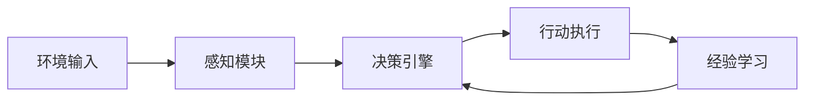
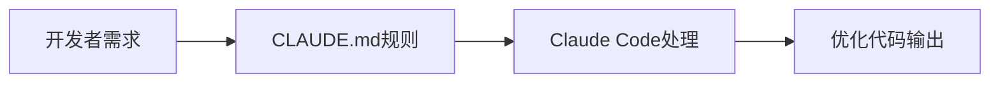
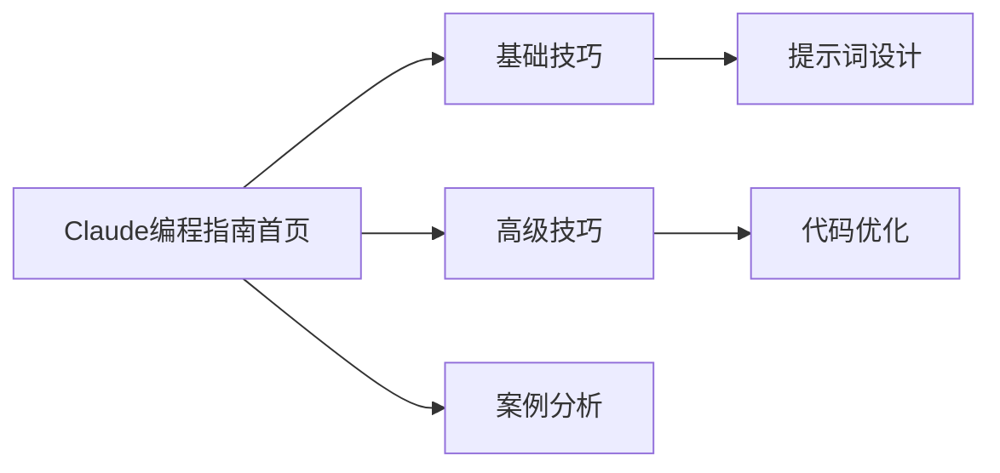
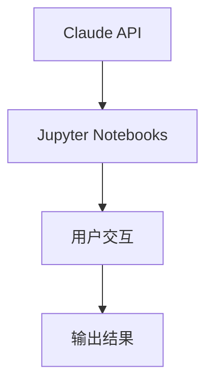
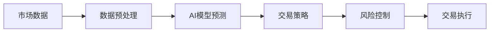
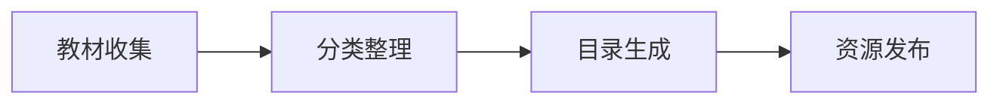
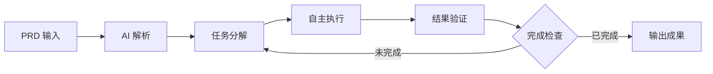
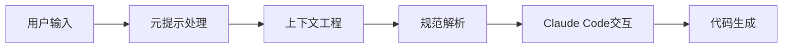
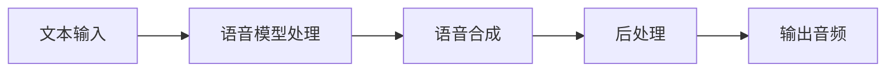
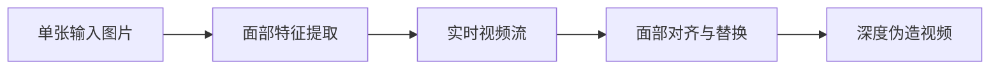

## 今日热点

Claude生态工具与AI代理系统今日引领GitHub热榜，开发者正积极构建AI辅助编程与自主代理框架，推动AI向专业化领域渗透。

---

## 热门项目一览

| 排名 | 项目 | 语言 | 今日 | 总计 | 简介 |
|:---:|------|:----:|------:|-----:|------|
| 1 | [NousResearch/hermes-agent](https://github.com/NousResearch/hermes-agent) | Python | +11,289 | 77,575 | The agent that grows with you |
| 2 | [forrestchang/andrej-karpathy-skills](https://github.com/forrestchang/andrej-karpathy-skills) | Unknown | +5,733 | 25,516 | A single CLAUDE.md file to ... |
| 3 | [thedotmack/claude-mem](https://github.com/thedotmack/claude-mem) | TypeScript | +3,175 | 53,404 | A Claude Code plugin that a... |
| 4 | [microsoft/markitdown](https://github.com/microsoft/markitdown) | Python | +2,808 | 107,036 | Python tool for converting ... |
| 5 | [shanraisshan/claude-code-best-practice](https://github.com/shanraisshan/claude-code-best-practice) | HTML | +2,461 | 41,886 | practice made claude perfect |
| 6 | [multica-ai/multica](https://github.com/multica-ai/multica) | TypeScript | +1,715 | 11,190 | The open-source managed age... |
| 7 | [shiyu-coder/Kronos](https://github.com/shiyu-coder/Kronos) | Python | +1,554 | 17,047 | Kronos: A Foundation Model ... |
| 8 | [anthropics/claude-cookbooks](https://github.com/anthropics/claude-cookbooks) | Jupyter Notebook | +1,012 | 39,558 | A collection of notebooks/r... |
| 9 | [virattt/ai-hedge-fund](https://github.com/virattt/ai-hedge-fund) | Python | +783 | 52,988 | An AI Hedge Fund Team |
| 10 | [TapXWorld/ChinaTextbook](https://github.com/TapXWorld/ChinaTextbook) | Roff | +703 | 68,927 | 所有小初高、大学PDF教材。 |
| 11 | [snarktank/ralph](https://github.com/snarktank/ralph) | TypeScript | +691 | 16,540 | Ralph is an autonomous AI a... |
| 12 | [coleam00/Archon](https://github.com/coleam00/Archon) | TypeScript | +677 | 17,636 | The first open-source harne... |

---

## 趋势洞察

```
┌─────────────────────────────────────────────────────────────────┐
│  AI/ML 工具         ████████████████████████  10 个项目        │
│  其他               █████████                 4 个项目        │
│  多媒体应用            ██                        1 个项目        │
│  开发工具             ██                        1 个项目        │
└─────────────────────────────────────────────────────────────────┘
```

---

## 项目深度解读

### 1. NousResearch/hermes-agent — 自适应智能代理

> **一句话总结**：一个能够持续学习、自我迭代并适应不同任务环境的AI智能代理系统。

#### 价值主张

| 维度 | 说明 |
|------|------|
| **解决痛点** | 解决传统AI代理缺乏持续学习与自适应能力的问题 |
| **目标用户** | AI研究人员、企业开发者及复杂任务自动化需求方 |
| **核心亮点** | 自主学习能力 + 多任务迁移能力 + 动态适应机制 + 模块化架构 |

#### 技术架构



**技术特色**：
- 采用强化学习与深度学习结合的混合架构
- 实现了知识迁移与持续学习能力
- 提供灵活的插件系统支持功能扩展

#### 热度分析

- 项目Star数近8万，单日增长超1万，显示近期重大突破或更新
- Fork数与Star数比例适中，表明项目既受关注又被积极使用

#### 快速上手

```bash
# 安装依赖
pip install -r requirements.txt

# 初始化代理
python hermes_agent init --config config/default.yaml

# 运行示例
python examples/basic_task.py
```

#### 注意事项

- 项目许可证信息不明确，使用前需确认授权条款
- 项目当前没有开放Issue，可能通过其他渠道提供反馈
- 建议在使用前充分阅读文档，了解系统配置与最佳实践


### 2. forrestchang/andrej-karpathy-skills — AI编程指南

> **一句话总结**：基于Karpathy对LLM编程陷阱的洞察，提供Claude Code行为优化指南。

#### 价值主张

| 维度 | 说明 |
|------|------|
| **解决痛点** | 解决LLM编程中的常见陷阱，提升Claude Code生成代码质量 |
| **目标用户** | 使用Claude Code的AI辅助开发者 |
| **核心亮点** | + 基于Karpathy权威观点 + 单文件精简配置 + 实用编程指导 |

#### 技术架构



**技术特色**：
- 基于Karpathy对LLM编程的深度洞察
- 精简的单文件配置，易于实施
- 聚焦于解决实际编程痛点

#### 热度分析

- 项目获得25,516个Star，单日增长5,733，表明AI编程辅助工具需求激增
- 社区高度关注LLM编程优化，反映AI辅助编程已成为开发热点

#### 快速上手

```bash
# 克隆仓库查看CLAUDE.md文件
git clone https://github.com/forrestchang/andrej-karpathy-skills.git
cat andrej-karpathy-skills/CLAUDE.md
```

#### 注意事项

- 本项目配置专为Claude Code设计，可能不适用于其他AI编程助手
- 随着LLM技术发展，配置可能需要定期更新以保持最佳效果
- 建议结合实际编程经验使用，而非完全依赖AI生成代码


### 3. thedotmack/claude-mem — AI记忆增强

> **一句话总结**：为Claude Code提供智能记忆功能，自动捕获并压缩编程上下文，提升跨会话连贯性。

#### 价值主张

| 维度 | 说明 |
|------|------|
| **解决痛点** | 解决Claude在不同编程会话间缺乏长期记忆和上下文连贯性的问题 |
| **目标用户** | 使用Claude Code进行编程的开发者和AI辅助编程用户 |
| **核心亮点** | 自动捕获编程会话内容 + AI压缩与上下文提取 + 跨会话记忆注入 |

#### 技术架构


**技术特色**：
- 基于Claude agent-sdk的智能压缩技术
- 无缝集成Claude Code插件架构
- 自动化内容捕获与上下文提取算法

#### 热度分析

- 项目Star数超5万，单日增长3000+，显示极快的社区增长速度
- 作为Claude生态的重要插件，填补了AI编程助手长期记忆的空白

#### 快速上手

```bash
# 安装Claude Code插件
npm install -g @the-dotmack/claude-mem

# 在Claude Code中启用插件
claude config enable-mem-plugin
```

#### 注意事项

- 可能需要Claude Code的最新版本才能正常工作
- 记忆存储可能涉及隐私问题，需注意数据安全
- 作为第三方插件，可能与Claude API的更新存在兼容性问题


### 4. microsoft/markitdown — 文档转Markdown

> **一句话总结**：微软出品的全能文档转换工具，支持将Office文档等格式一键转换为Markdown。

#### 价值主张

| 维度 | 说明 |
|------|------|
| **解决痛点** | 统一文档格式，解决跨平台文档兼容性问题 |
| **目标用户** | 开发者、研究人员和需要处理多种文档格式的工作者 |
| **核心亮点** | 支持多种格式转换 + 保持原有格式 + 简单易用 + 微软出品 |

#### 技术架构


**技术特色**：
- 基于Python构建，跨平台兼容性强
- 支持多种文档格式解析和转换
- 保留原文档结构和格式细节
- 微软官方维护，质量有保障

#### 热度分析

- Star数突破10万，近期日均增长约2800，项目热度极高
- 微软出品，社区活跃，已成为文档转换领域的标杆工具

#### 快速上手

```bash
# 安装
pip install markitdown

# 使用
markitdown input.docx output.md
```

#### 注意事项

- 许可证信息不明确，商业使用前需确认授权
- 可能对某些特殊格式或复杂布局支持有限
- 需要Python环境运行


### 5. shanraisshan/claude-code-best-practice — Claude编程实践指南

> **一句话总结**：提供使用Claude进行编程的最佳实践和技巧，帮助开发者最大化AI辅助编程的效率。

#### 价值主张

| 维度 | 说明 |
|------|------|
| **解决痛点** | 解决如何有效利用Claude进行编程和代码优化的实践问题 |
| **目标用户** | 使用Claude进行编程的开发者和AI辅助编程爱好者 |
| **核心亮点** | 实用编程技巧 + 代码优化方法 + AI辅助最佳实践 |

#### 技术架构



**技术特色**：
- 响应式HTML设计，确保跨设备兼容性
- 结构化内容组织，便于查阅和实践
- 实用代码示例，可直接应用于实际项目

#### 热度分析

- 项目Star数快速增长，近期新增2,461个Star，表明社区对Claude编程实践需求旺盛
- 虽无Open Issues，但高Fork数显示用户积极参与项目内容的本地化与个性化定制

#### 快速上手

```bash
# 克隆项目到本地
git clone https://github.com/shanraisshan/claude-code-best-practice.git

# 使用浏览器打开index.html
open claude-code-best-practice/index.html
```

#### 注意事项

- 项目依赖网络访问某些资源，确保在线连接
- 内容基于Claude特定版本，不同版本可能需要调整实践方法


### 6. multica-ai/multica — AI代理协作平台

> **一句话总结**：开源AI代理管理平台，将编程助手转化为可分配任务、跟踪进度和组合技能的虚拟团队成员。

#### 价值主张

| 维度 | 说明 |
|------|------|
| **解决痛点** | 传统AI编程助手缺乏任务管理、进度跟踪和技能组合能力，难以作为真正团队成员参与复杂项目 |
| **目标用户** | 软件开发团队、项目管理者和需要AI辅助编程的个人开发者 |
| **核心亮点** | 任务分配与进度跟踪 + 代理技能组合 + 多代理协作管理 + 开源可定制 + TypeScript实现 |

#### 技术架构


**技术特色**：
- 基于TypeScript构建的全栈解决方案
- 智能任务分解与代理分配算法
- 多代理协作与技能组合机制

#### 热度分析

- 项目Star数超11,000，单日增长1,700+，正处于快速上升期，受到开发者高度关注
- Zero open issues显示项目维护状态良好，可能处于积极开发阶段，社区反馈机制高效

#### 快速上手

```bash
# 克隆仓库
git clone https://github.com/multica-ai/multica.git

# 安装依赖
npm install

# 启动服务
npm start
```

#### 注意事项

- 项目许可证未知，使用前需确认商业使用限制
- 作为新兴项目，API和功能可能仍在快速迭代中
- 需要TypeScript和Node.js环境才能运行


### 7. shiyu-coder/Kronos — [金融语言模型]

> **一句话总结**：Kronos是专为金融市场语言处理设计的基础模型，提供专业金融知识理解和生成能力。

#### 价值主张

| 维度 | 说明 |
|------|------|
| **解决痛点** | 金融领域专业语言理解与生成，解决传统通用模型金融知识不足问题 |
| **目标用户** | 金融分析师、量化交易员、投资机构、金融科技开发者 |
| **核心亮点** | 金融专业领域知识 + 多模态金融数据处理 + 高精度金融文本理解与生成 |

#### 技术架构


**技术特色**：
- 基于Transformer架构的专业金融语言模型
- 针对金融领域数据预训练与微调的双重优化
- 支持多种金融文本任务的综合能力

#### 热度分析

- 项目近期增长迅猛，单日Star增长超过1500，显示市场对金融AI模型的高度关注
- 作为金融垂直领域的基础模型，有望在金融科技生态中占据重要位置

#### 快速上手

```bash
# 安装Kronos
pip install kronos-ai

# 基本使用
from kronos import KronosModel
model = KronosModel.from_pretrained("kronos-base")
response = model("分析最近的美联储政策对市场的影响")
print(response)
```

#### 注意事项

- 模型使用可能需要金融领域知识背景，建议结合专业使用
- 金融数据敏感性高，使用时需注意数据安全和合规问题
- 模型输出应作为参考，实际金融决策需结合多方信息


### 8. anthropics/claude-cookbooks — AI应用指南

> **一句话总结**：实用的 Claude AI 应用指南，包含多种场景下的使用技巧和示例。

#### 价值主张

| 维度 | 说明 |
|------|------|
| **解决痛点** | 解决用户有效利用 Claude AI 能力的实践难题 |
| **目标用户** | AI 开发者、研究人员、技术爱好者 |
| **核心亮点** | 实用示例丰富 + 覆盖多种使用场景 + 代码可直接运行 |

#### 技术架构



**技术特色**：
- 基于 Jupyter Notebook 的交互式展示
- 提供可直接运行的代码示例
- 涵盖多种应用场景和用例

#### 热度分析

- 项目获得近 4 万 Star，近期增长迅速，显示用户对 Claude 应用高度关注
- 作为 Anthropic 官方项目，在 Claude AI 生态中占据核心位置

#### 快速上手

```bash
# 克隆仓库
git clone https://github.com/anthropics/claude-cookbooks.git

# 运行示例
cd claude-cookbooks && jupyter notebook
```

#### 注意事项

- 需要安装 Jupyter 环境和相应依赖才能运行笔记本
- 部分示例可能需要 API 密钥或额外配置
- 随着 Claude API 更新，部分示例可能需要调整以保持兼容性


### 9. virattt/ai-hedge-fund — AI对冲基金

> **一句话总结**：利用人工智能技术构建自动化交易系统，实现智能化的金融投资决策。

#### 价值主张

| 维度 | 说明 |
|------|------|
| **解决痛点** | 传统对冲基金依赖人工分析，效率有限且易受情绪影响 |
| **目标用户** | 金融科技从业者、量化交易员、AI研究人员、对冲基金团队 |
| **核心亮点** | 机器学习市场预测 + 自动化交易执行 + 多维度风险管理 + 投资组合动态优化 |

#### 技术架构



**技术特色**：
- 深度学习算法应用于市场趋势预测
- 实时数据处理与信号分析系统
- 多因子风险量化与动态调整机制

#### 热度分析

- 项目获得超5万星，近期每日增长近800星，显示AI金融领域高度关注
- 作为AI与金融交叉项目，在量化投资社区具有重要影响力

#### 快速上手

```bash
# 克隆项目
git clone https://github.com/virattt/ai-hedge-fund.git

# 安装依赖
pip install -r requirements.txt

# 启动交易系统
python main.py
```

#### 注意事项

- 使用AI交易系统存在财务风险，需谨慎评估
- 金融市场具有高度不确定性，AI模型无法保证盈利
- 需要相应的金融知识和编程技能才能有效使用


### 10. TapXWorld/ChinaTextbook — 教材资源库

> **一句话总结**：收集整理中国全学段PDF教材，提供一站式免费教育资源获取平台。

#### 价值主张

| 维度 | 说明 |
|------|------|
| **解决痛点** | 解决学生获取教材困难问题，消除教材获取壁垒 |
| **目标用户** | 中国各阶段学生、教师及自学者 |
| **核心亮点** | + 全学段覆盖 + PDF格式 + 免费获取 + 持续更新 + 分类清晰 |

#### 技术架构



**技术特色**：
- 使用Roff格式构建教材目录系统
- 采用层级结构组织全学段教育资源
- 实现简洁高效的信息检索机制

#### 热度分析

- 近7万星数显示教育需求旺盛，近期703星增长反映持续关注度
- Fork数约为星数的22%，表明用户不仅关注还积极参与资源贡献

#### 快速上手

```bash
# 克隆项目
git clone https://github.com/TapXWorld/ChinaTextbook.git
# 进入项目目录
cd ChinaTextbook
# 查看教材目录
ls -la
```

#### 注意事项

- 项目收集的教材可能涉及版权问题，请遵守相关法律法规
- 建议通过官方渠道获取最新教材，本项目可能存在更新延迟
- 下载的教材仅供个人学习使用，不应用于商业用途


### 11. snarktank/ralph — AI 任务执行器

> **一句话总结**：Ralph 是一个持续运行的自主 AI 代理循环，自动化执行产品需求直至全部完成。

#### 价值主张

| 维度 | 说明 |
|------|------|
| **解决痛点** | 自动化执行产品需求，减少人工干预和重复性工作 |
| **目标用户** | 产品开发团队、项目经理、AI 工作流自动化需求者 |
| **核心亮点** | 自主循环执行 + 持续运行 + 自动化完成 PRD 项目 + 减少人工干预 + 提高开发效率 |

#### 技术架构



**技术特色**：
- 基于 TypeScript 开发，确保类型安全和代码质量
- 自主循环机制，无需人工干预持续执行
- 智能任务分解和执行策略，优化完成效率

#### 热度分析

- 项目获得 16,540 个 Star，单日增长 691，表明近期热度快速上升
- Fork 数 1,636 显示社区活跃度高，可能处于 AI 工具应用前沿

#### 快速上手

```bash
# 安装依赖
npm install

# 配置 PRD 项目
echo "项目需求描述" > prd.txt

# 启动 Ralph
npx ralph --config prd.txt
```

#### 注意事项

- 项目 License 信息未知，使用前需确认授权条款
- 作为 AI 代理系统，可能需要适当的 API 密钥或服务配置
- PRD 项目描述的详细程度可能直接影响执行效果


### 12. coleam00/Archon — AI 编程验证框架

> **一句话总结**：首个开源的 AI 编程测试构建器，使 AI 编程结果确定且可重复。

#### 价值主张

| 维度 | 说明 |
|------|


### 13. gsd-build/get-shit-done — AI开发助手

> **一句话总结**：为Claude Code设计的轻量级元提示与规范驱动开发系统，提升AI辅助编程效率。

#### 价值主张

| 维度 | 说明 |
|------|------|
| **解决痛点** | 解决AI辅助编程中上下文管理和提示工程难题 |
| **目标用户** | 使用Claude Code的开发者与AI辅助编程爱好者 |
| **核心亮点** | 元提示系统 + 上下文工程 + 规范驱动开发 + 轻量级设计 |

#### 技术架构



**技术特色**：
- 元提示系统优化AI交互质量
- 上下文工程提升代码相关性
- 规范驱动确保代码一致性

#### 热度分析

- 超过5万Star且持续增长，表明AI辅助开发工具需求旺盛
- 高Star低Issues比例，反映项目稳定性和用户满意度高

#### 快速上手

```bash
# 克隆项目
git clone https://github.com/gsd-build/get-shit-done.git

# 安装依赖
npm install

# 启动开发环境
npm start
```

#### 注意事项

- 项目可能需要Claude Code环境支持
- 建议在使用前熟悉元提示和上下文工程概念
- 可能需要配置相关API密钥


### 14. jamiepine/voicebox — 开源语音合成工具

> **一句话总结**：开源语音合成工作室，提供高质量、多功能的AI语音生成与编辑能力。

#### 价值主张

| 维度 | 说明 |
|------|------|
| **解决痛点** | 解决传统语音合成工具灵活性不足、高质量模型难以获取的问题 |
| **目标用户** | 内容创作者、语音开发者、AI研究人员和需要高质量语音生成的用户 |
| **核心亮点** | 开源免费 + 高质量语音生成 + 多种语音处理功能 + 易于集成 + 实时处理能力 |

#### 技术架构



**技术特色**：
- 基于深度学习的先进语音合成技术
- 支持多种语音风格和音色自定义
- 开源可定制的模型架构设计
- 高效的实时语音处理引擎
- 易于集成到现有应用系统

#### 热度分析

- 项目Star数突破16,000且单日增长超500，显示语音合成领域的高关注度与增长潜力
- 作为开源语音合成工具，填补了市场上高质量语音解决方案的空白，吸引大量开发者关注

#### 快速上手

```bash
# 克隆仓库
git clone https://github.com/jamiepine/voicebox.git

# 安装依赖
npm install

# 运行项目
npm start
```

#### 注意事项

- 项目需要较高的计算资源，特别是处理高质量语音生成时
- 需要一定的机器学习基础知识才能充分利用项目功能
- 作为开源项目，用户可能需要自行处理模型训练和优化
- 使用时需注意语音生成的版权和伦理问题


### 16. hacksider/Deep-Live-Cam — 实时换脸工具

> **一句话总结**：仅需单张图片即可实现实时面部交换和一键视频深度伪造的AI工具。

#### 价值主张

| 维度 | 说明 |
|------|------|
| **解决痛点** | 解决需要高质量换脸视频但缺乏专业技能的难题 |
| **目标用户** | 内容创作者、视频编辑爱好者、AI技术应用者 |
| **核心亮点** | 单图换脸 + 实时处理 + 一键操作 + 高质量输出 |

#### 技术架构



**技术特色**：
- 基于深度学习的实时面部交换技术
- 无需大量训练数据，单图即可实现换脸
- 支持实时视频处理，延迟低
- 高质量的输出效果，面部表情自然

#### 热度分析

- 项目获得9万+ stars，单日增长200+，表明在换脸领域有极高热度
- Fork数达1.3万+，说明社区参与度高，有大量用户进行二次开发

#### 快速上手

```bash
# 克隆项目
git clone https://github.com/hacksider/Deep-Live-Cam.git

# 安装依赖
cd Deep-Live-Cam
pip install -r requirements.txt

# 运行项目
python run.py
```

#### 注意事项

- 此技术可能被用于制作虚假内容，请遵守当地法律法规
- 使用时需尊重他人肖像权，避免侵犯隐私
- 深度伪造技术可能被滥用，建议仅用于合法合规的用途


## 今日推荐

| 主题 | 推荐项目 | 亮点 |
|------|----------|------|
| 今日最热 | [NousResearch/hermes-agent](https://github.com/NousResearch/hermes-agent) | The agent that gr... |
| 值得关注 | [forrestchang/andrej-karpathy-skills](https://github.com/forrestchang/andrej-karpathy-skills) | A single CLAUDE.m... |
| 快速上手 | [thedotmack/claude-mem](https://github.com/thedotmack/claude-mem) | A Claude Code plu... |
| 长期潜力 | [microsoft/markitdown](https://github.com/microsoft/markitdown) | Python tool for c... |

---

<div align="center">

*Generated on 2026-04-14 | Powered by GitHub Trending Reporter*

</div>