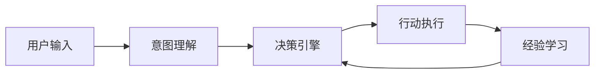
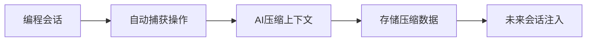
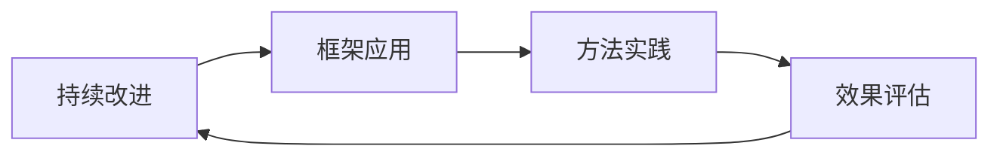
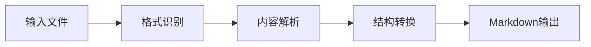
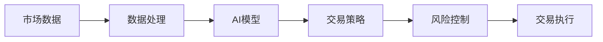
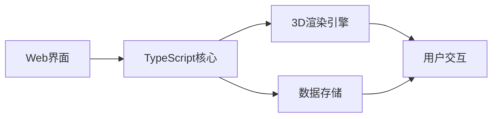
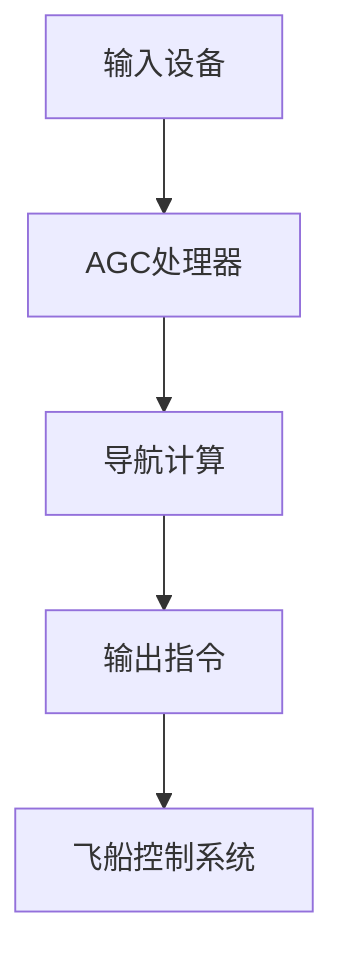

## 今日热点

Claude AI生态爆发式增长，开发者积极构建记忆系统与最佳实践指南；AI代理技术持续升温，专业领域应用不断深化。

---

## 热门项目一览

| 排名 | 项目 | 语言 | 今日 | 总计 | 简介 |
|:---:|------|:----:|------:|-----:|------|
| 1 | [forrestchang/andrej-karpathy-skills](https://github.com/forrestchang/andrej-karpathy-skills) | Unknown | +9,263 | 34,184 | A single CLAUDE.md file to ... |
| 2 | [NousResearch/hermes-agent](https://github.com/NousResearch/hermes-agent) | Python | +8,301 | 84,629 | The agent that grows with you |
| 3 | [thedotmack/claude-mem](https://github.com/thedotmack/claude-mem) | TypeScript | +2,997 | 55,882 | A Claude Code plugin that a... |
| 4 | [shanraisshan/claude-code-best-practice](https://github.com/shanraisshan/claude-code-best-practice) | HTML | +2,583 | 43,868 | from vibe coding to agentic... |
| 5 | [obra/superpowers](https://github.com/obra/superpowers) | Shell | +1,919 | 152,365 | An agentic skills framework... |
| 6 | [microsoft/markitdown](https://github.com/microsoft/markitdown) | Python | +1,675 | 108,513 | Python tool for converting ... |
| 7 | [jamiepine/voicebox](https://github.com/jamiepine/voicebox) | TypeScript | +1,162 | 17,386 | The open-source voice synth... |
| 8 | [virattt/ai-hedge-fund](https://github.com/virattt/ai-hedge-fund) | Python | +1,007 | 54,182 | An AI Hedge Fund Team |
| 9 | [shiyu-coder/Kronos](https://github.com/shiyu-coder/Kronos) | Python | +963 | 17,823 | Kronos: A Foundation Model ... |
| 10 | [anthropics/claude-cookbooks](https://github.com/anthropics/claude-cookbooks) | Jupyter Notebook | +931 | 40,284 | A collection of notebooks/r... |
| 11 | [pascalorg/editor](https://github.com/pascalorg/editor) | TypeScript | +820 | 11,679 | Create and share 3D archite... |
| 12 | [chrislgarry/Apollo-11](https://github.com/chrislgarry/Apollo-11) | Assembly | +472 | 66,378 | Original Apollo 11 Guidance... |

---

## 趋势洞察

```
┌─────────────────────────────────────────────────────────────────┐
│  AI/ML 工具         ████████████████████████  7 个项目        │
│  其他               ██████████                3 个项目        │
│  项目管理             ███                       1 个项目        │
│  开发工具             ███                       1 个项目        │
└─────────────────────────────────────────────────────────────────┘
```

---

## 项目深度解读

### 1. forrestchang/andrej-karpathy-skills — LLM编程优化指南

> **一句话总结**：基于Andrej Karpathy经验，优化Claude Code编程行为的实用指南。

#### 价值主张

| 维度 | 说明 |
|------|------|
| **解决痛点** | 解决Claude Code在编程任务中的常见陷阱和效率问题 |
| **目标用户** | 使用Claude Code进行编程的开发者和AI研究人员 |
| **核心亮点** | 专家经验整合 + 极简设计 + 实用性强 + 高针对性 |

#### 技术架构

**技术特色**：
- 单文件结构，轻量级实现
- 整合顶级AI专家的编程经验
- 专注于提升LLM编程助手的行为质量

#### 热度分析

- 项目单日增长超9000 stars，显示AI编程辅助工具领域的强烈需求
- 作为小众实用工具，在开发者社区中具有高传播度和实用价值

#### 快速上手

```bash
# 克隆项目
git clone https://github.com/forrestchang/andrej-karpathy-skills.git

# 查看内容
cat andrej-karpathy-skills/CLAUDE.md
```

#### 注意事项
- 项目内容相对简单，仅包含一个Markdown文件
- 主要针对Claude Code优化，其他AI编程助手可能不完全适用
- 建议结合实际编程场景灵活应用指南中的建议


### 2. NousResearch/hermes-agent — 智能成长代理

> **一句话总结**：Hermes Agent是一个能够持续学习和成长的智能代理系统，具有自适应能力和扩展性。

#### 价值主张

| 维度 | 说明 |
|------|------|
| **解决痛点** | 传统AI代理缺乏长期学习能力和环境适应性问题 |
| **目标用户** | AI研究人员、企业开发者和需要高级AI代理功能的团队 |
| **核心亮点** | 自主学习能力 + 模块化架构 + 跨任务适应性 + 知识积累机制 |

#### 技术架构



**技术特色**：
- 基于强化学习的自适应决策机制
- 模块化设计支持灵活扩展
- 经验回放系统促进持续学习

#### 热度分析

- 项目Star数激增(+8,301 today)，表明近期获得高度关注，可能发布了重大更新
- 高Star/Fork比例(7.4:1)显示项目不仅受欢迎，而且用户深度参与贡献

#### 快速上手

```bash
# 克隆仓库
git clone https://github.com/NousResearch/hermes-agent.git
cd hermes-agent

# 安装依赖
pip install -r requirements.txt

# 运行示例
python examples/basic_agent.py
```

#### 注意事项

- 项目许可证信息未知，使用前需确认授权条款
- 缺少详细的文档和API说明，可能需要深入研究源码
- 项目近期活跃度高，API可能处于快速迭代中，注意兼容性


### 3. thedotmack/claude-mem — AI代码记忆助手

> **一句话总结**：Claude代码插件自动捕获编程过程并压缩为上下文，实现跨会话记忆。

#### 价值主张

| 维度 | 说明 |
|------|------|
| **解决痛点** | 解决编程过程中上下文丢失和重复沟通问题 |
| **目标用户** | 使用Claude进行编程的开发者 |
| **核心亮点** | 自动捕获 + AI压缩 + 跨会话记忆 + 上下文注入 |

#### 技术架构



**技术特色**：
- 使用Claude agent-sdk进行智能压缩
- 实现跨会话的上下文记忆机制
- 自动化捕获与注入流程

#### 热度分析

- 项目获得5.5万+星标，单日增长近3千，表明开发社区高度关注
- Fork数接近4500，说明项目有较高的实用价值和可扩展性

#### 快速上手

```bash
# 安装Claude Code
npm install -g @anthropic-ai/claude-code

# 安装claude-mem插件
claude-code plugins install thedotmack/claude-mem
```

#### 注意事项

- 项目依赖Claude Code环境
- 需要Anthropic API访问权限
- 可能存在数据隐私考量


### 4. shanraisshan/claude-code-best-practice — AI编程实践指南

> **一句话总结**：提供Claude AI编程助手的最佳实践方法，帮助开发者提升AI辅助编程效率。

#### 价值主张

| 维度 | 说明 |
|------|------|
| **解决痛点** | 解决开发者有效使用AI编程助手进行高质量代码生成的问题 |
| **目标用户** | 使用Claude AI进行编程的开发者和技术团队 |
| **核心亮点** | 实用技巧 + 最佳实践案例 + 工程化方法 |

#### 技术架构

**技术特色**：
- 基于HTML构建的交互式学习界面
- 结构化的最佳实践展示方式
- 实用的代码示例和场景应用

#### 热度分析

- 项目Star数高且增长迅速，表明AI编程辅助领域需求旺盛
- 作为Claude相关最佳实践指南，在AI辅助编程领域具有显著影响力

#### 快速上手

```bash
# 克隆项目到本地
git clone https://github.com/shanraisshan/claude-code-best-practice.git

# 使用浏览器打开index.html
# 或访问在线版本查看最佳实践
```

#### 注意事项

- 项目内容主要聚焦于Claude AI的使用，对其他AI编程助手可能不完全适用
- 随着AI模型更新，部分最佳实践可能需要调整
- 建议结合实际项目场景进行实践，而非照搬示例


### 5. obra/superpowers — 开发方法论框架

> **一句话总结**：提供一套实用的代理技能框架和开发方法论，提升软件工程效率和质量。

#### 价值主张

| 维度 | 说明 |
|------|------|
| **解决痛点** | 软件开发效率低下、方法论不系统的问题 |
| **目标用户** | 软件开发者、技术团队和工程管理人员 |
| **核心亮点** | 实用性强 + 方法论系统 + 代理技能框架 + 高效执行 + 可持续改进 |

#### 技术架构



**技术特色**：
- 基于Shell脚本实现，跨平台兼容性强
- 提供系统化的软件开发方法论
- 强调代理技能的培养和应用
- 注重实践和效果反馈机制
- 持续迭代改进的框架设计

#### 热度分析

- 高Star数和显著增长趋势表明项目获得开发者广泛认可
- Open Issues为0，可能表明问题解决机制高效或社区自我管理良好

#### 快速上手

```bash
git clone https://github.com/obra/superpowers.git
cd superpowers && ./install.sh
```

#### 注意事项

- 需要基本的Shell环境知识
- 可能需要根据具体项目需求进行定制化调整
- 建议先阅读项目文档以了解完整方法论


### 6. microsoft/markitdown — 文档格式转换器

> **一句话总结**：微软官方开发的Python工具，可将各类文件和Office文档高效转换为标准Markdown格式。

#### 价值主张

| 维度 | 说明 |
|------|------|
| **解决痛点** | 统一多格式文档转换为Markdown，解决跨平台内容管理难题 |
| **目标用户** | 内容创作者、技术文档编写者和企业知识工作者 |
| **核心亮点** | + 支持多格式文件 + 智能结构保留 + 微软官方维护 + 命令行友好 |

#### 技术架构



**技术特色**：
- 采用多引擎解析架构，兼容Office、PDF等多种格式
- 智能文档结构提取，保留层级和格式信息
- Python跨平台实现，支持Windows、macOS和Linux

#### 热度分析

- 项目星数超10万，日均增长1600+，表明社区认可度和采用速度极高
- 作为微软官方项目，在企业级文档处理领域具有标杆地位，生态影响力强

#### 快速上手

```bash
# 安装
pip install markitdown

# 基本转换
markitdown input.docx -o output.md
markitdown "My Document.pdf" -o result.md
```

#### 注意事项

- 项目许可证信息不明确，商业使用前需确认授权条款
- 复杂格式的大型文档转换可能需要较多内存资源
- 某些特殊格式元素可能无法完美转换，需要后续手动调整


### 7. jamiepine/voicebox — AI语音工作室

> **一句话总结**：开源的AI语音合成工具，提供高质量、可定制的语音生成能力。

#### 价值主张

| 维度 | 说明 |
|------|------|
| **解决痛点** | 提供开源、高质量、可定制的语音合成解决方案，打破商业语音工具的垄断 |
| **目标用户** | 内容创作者、开发者、语音设计师、AI研究人员 |
| **核心亮点** | 开源免费 + 高质量合成 + 可定制模型 + 跨平台支持 + 易用界面 |

#### 技术架构


**技术特色**：
- 基于深度学习的语音合成技术
- TypeScript全栈开发，确保代码质量和类型安全
- 开源模型，支持社区贡献和定制

#### 热度分析

- 项目获得17,386个Star，近期增长迅速（单日增长1,162），表明社区对该项目高度关注
- 作为开源语音合成工具，填补了市场上开源高质量语音合成解决方案的空白

#### 快速上手

```bash
# 克隆项目
git clone https://github.com/jamiepine/voicebox.git

# 安装依赖
npm install

# 启动开发服务器
npm run dev
```

#### 注意事项

- 项目可能需要较高的计算资源进行语音合成
- 开源许可证不明确，使用前需确认具体授权条款
- 语音合成质量可能受训练数据限制，特定语言或口音可能支持有限


### 8. virattt/ai-hedge-fund — AI对冲基金

> **一句话总结**：利用人工智能技术构建自动化交易系统，实现金融市场的智能投资决策。

#### 价值主张

| 维度 | 说明 |
|------|------|
| **解决痛点** | 传统金融决策依赖人工经验，效率低且受情绪影响 |
| **目标用户** | 金融科技开发者、量化交易者、AI研究人员 |
| **核心亮点** | 机器学习交易策略 + 自动化执行系统 + 风险控制模型 |

#### 技术架构



**技术特色**：
- 采用深度学习算法分析市场趋势和模式
- 实时数据处理和低延迟交易执行系统
- 多层次风险控制机制保障投资安全

#### 热度分析

- 项目获得超过5.4万Stars，近一个月增长迅速，显示AI金融领域热度高涨
- 高Fork比例表明社区积极参与项目改进和二次开发，形成活跃的金融AI生态

#### 快速上手

```bash
# 克隆项目
git clone https://github.com/virattt/ai-hedge-fund.git

# 安装依赖
pip install -r requirements.txt

# 运行示例策略
python run_strategy.py --mode backtest --config config/example.json
```

#### 注意事项

- 项目仅用于教育和研究目的，实际金融交易需谨慎
- AI交易策略存在市场适应性风险，需持续优化和监控
- 确保遵守相关金融法规和合规要求


### 9. shiyu-coder/Kronos — [金融基础模型]

> **一句话总结**：Kronos是专为金融市场语言处理设计的基础模型，提供金融领域的深度理解能力。

#### 价值主张

| 维度 | 说明 |
|------|------|
| **解决痛点** | 金融领域专业术语复杂，通用语言模型理解有限 |
| **目标用户** | 金融分析师、量化交易员、投资机构、研究机构 |
| **核心亮点** | 金融领域专业知识 + 市场语言理解能力 + 金融数据分析 |

#### 技术架构


**技术特色**：
- 金融领域专业知识注入与微调
- 多模态金融数据处理能力
- 实时市场数据集成与分析
- 金融风险预测与评估

#### 热度分析

- 项目Star数快速增长，今日增加963星，表明金融AI领域高度关注
- 在金融科技领域具有较高影响力，可能是专业垂直领域的基础模型代表

#### 快速上手

```bash
# 克隆项目
git clone https://github.com/shiyu-coder/Kronos.git

# 安装依赖
pip install -r requirements.txt

# 运行示例
python examples/financial_analysis.py
```

#### 注意事项

- 模型可能需要大量计算资源进行训练和推理
- 金融数据涉及敏感信息，使用时需注意数据安全和隐私保护
- 模型预测结果仅供参考，不应作为投资决策的唯一依据


### 10. anthropics/claude-cookbooks — AI食谱集

> **一句话总结**：Anthropic官方提供的Claude模型使用技巧集合，通过Jupyter笔记本展示最佳实践。

#### 价值主张

| 维度 | 说明 |
|------|------|
| **解决痛点** | 解决开发者如何高效利用Claude API和功能的实践指导问题 |
| **目标用户** | AI开发者、研究人员以及希望将Claude集成到工作流中的用户 |
| **核心亮点** | 官方权威性 + 实用代码示例 + 多场景应用展示 |

#### 技术架构

**技术特色**：
- 提供可直接运行的Jupyter Notebook示例
- 涵盖从简单到复杂的多种Claude使用场景
- 结合实际应用场景的代码实现

#### 热度分析

- 项目获得超过4万星，单日增长900+，显示社区对Claude使用技巧的高度关注
- 作为Anthropic官方项目，代表了AI模型使用实践的重要参考标准

#### 快速上手

```bash
# 克隆仓库
git clone https://github.com/anthropics/claude-cookbooks.git

# 运行示例notebook
cd claude-cookbooks && jupyter notebook
```

#### 注意事项

- 需要Anthropic API密钥才能运行部分示例
- 部分notebook可能需要特定的Python环境和依赖包
- 注意API调用频率限制，避免产生额外费用


### 11. pascalorg/editor — 3D建筑编辑器

> **一句话总结**：基于Web的3D建筑项目创建与协作平台，支持实时编辑与云端分享。

#### 价值主张

| 维度 | 说明 |
|------|------|
| **解决痛点** | 传统建筑软件复杂昂贵，提供轻量级云端3D设计工具 |
| **目标用户** | 建筑师、室内设计师、城市规划师及教育工作者 |
| **核心亮点** | 实时协作编辑 + 云端存储 + 3D可视化 + 跨平台访问 + 易学易用 |

#### 技术架构



**技术特色**：
- 基于TypeScript构建，提供类型安全和高性能的Web应用
- 集成WebGL技术实现流畅的3D渲染体验
- 采用云端架构实现实时协作和数据同步

#### 热度分析

- 项目近期热度显著上升，单日增长820 stars，表明获得业界广泛关注
- 高star/fork比例(7.9:1)反映项目质量与社区认可度极高

#### 快速上手

```bash
# 克隆项目
git clone https://github.com/pascalorg/editor.git
# 安装依赖
npm install
# 启动开发服务器
npm run dev
```

#### 注意事项

- 项目可能需要现代浏览器支持WebGL
- 免费版可能有功能或存储限制
- 建议定期保存项目以防数据丢失


### 12. chrislgarry/Apollo-11 — [历史代码遗产]

> **一句话总结**：阿波罗11号导航计算机原始汇编代码，人类登月任务的核心控制系统源码重现。

#### 价值主张

| 维度 | 说明 |
|------|------|
| **解决痛点** | 保存人类太空探索历史代码遗产，防止珍贵技术资料失传 |
| **目标用户** | 航空航天历史研究者、复古计算机爱好者、NASA技术分析专家 |
| **核心亮点** + 历史真实性 + 技术完整性 + 汇编语言实现 + 登月舱与指令舱代码 + 无开源限制 |

#### 技术架构



**技术特色**：
- 15位字长，2KB RAM的嵌入式系统架构
- 交谊循环设计实现多任务处理
- 汇编语言编写，精确控制每个机器周期

#### 热度分析

- 高Star数及稳定增长表明项目具有极高的历史价值与科普意义
- 作为罕见的历史代码项目，在航空航天与计算机历史领域具有不可替代的学术价值

#### 快速上手

```bash
# 克隆仓库
git clone https://github.com/chrislgarry/Apollo-11.git

# 查看目录结构
cd Apollo-11 && ls -la
```

#### 注意事项
- 这是历史代码，现代计算机无法直接运行，需要模拟器环境
- 代码注释较少，理解需要深入掌握阿波罗导航系统知识
- 许可证信息不明确，使用前需确认授权情况


## 今日推荐

| 主题 | 推荐项目 | 亮点 |
|------|----------|------|
| 今日最热 | [forrestchang/andrej-karpathy-skills](https://github.com/forrestchang/andrej-karpathy-skills) | A single CLAUDE.m... |
| 值得关注 | [NousResearch/hermes-agent](https://github.com/NousResearch/hermes-agent) | The agent that gr... |
| 快速上手 | [thedotmack/claude-mem](https://github.com/thedotmack/claude-mem) | A Claude Code plu... |
| 长期潜力 | [shanraisshan/claude-code-best-practice](https://github.com/shanraisshan/claude-code-best-practice) | from vibe coding ... |

---

<div align="center">

*Generated on 2026-04-15 | Powered by GitHub Trending Reporter*

</div>