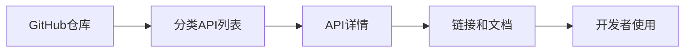

## 今日热点

Claude AI助手生态系统爆发式增长，同时AI代理框架和自进化系统成为新热点，开发者正在积极探索AI在各垂直领域的应用边界。

---

## 热门项目一览

| 排名 | 项目 | 语言 | 今日 | 总计 | 简介 |
|:---:|------|:----:|------:|-----:|------|
| 1 | [forrestchang/andrej-karpathy-skills](https://github.com/forrestchang/andrej-karpathy-skills) | Unknown | +9,646 | 43,342 | A single CLAUDE.md file to ... |
| 2 | [thedotmack/claude-mem](https://github.com/thedotmack/claude-mem) | TypeScript | +2,305 | 57,905 | A Claude Code plugin that a... |
| 3 | [obra/superpowers](https://github.com/obra/superpowers) | Shell | +2,055 | 154,377 | An agentic skills framework... |
| 4 | [pascalorg/editor](https://github.com/pascalorg/editor) | TypeScript | +1,391 | 12,690 | Create and share 3D archite... |
| 5 | [jamiepine/voicebox](https://github.com/jamiepine/voicebox) | TypeScript | +1,062 | 18,323 | The open-source voice synth... |
| 6 | [virattt/ai-hedge-fund](https://github.com/virattt/ai-hedge-fund) | Python | +1,058 | 55,103 | An AI Hedge Fund Team |
| 7 | [public-apis/public-apis](https://github.com/public-apis/public-apis) | Python | +950 | 423,398 | A collective list of free APIs |
| 8 | [Lordog/dive-into-llms](https://github.com/Lordog/dive-into-llms) | Jupyter Notebook | +941 | 29,541 | 《动手学大模型Dive into LLMs》系列编程实践教程 |
| 9 | [vercel-labs/open-agents](https://github.com/vercel-labs/open-agents) | TypeScript | +915 | 2,665 | An open source template for... |
| 10 | [google/magika](https://github.com/google/magika) | Python | +768 | 13,816 | Fast and accurate AI powere... |
| 11 | [Donchitos/Claude-Code-Game-Studios](https://github.com/Donchitos/Claude-Code-Game-Studios) | Shell | +612 | 10,522 | Turn Claude Code into a ful... |
| 12 | [chrislgarry/Apollo-11](https://github.com/chrislgarry/Apollo-11) | Assembly | +606 | 66,817 | Original Apollo 11 Guidance... |

---

## 趋势洞察

```
┌─────────────────────────────────────────────────────────────────┐
│  AI/ML 工具         ████████████████████████  9 个项目        │
│  其他               ████████                  3 个项目        │
│  项目管理             ██                        1 个项目        │
└─────────────────────────────────────────────────────────────────┘
```

---

## 项目深度解读

### 1. forrestchang/andrej-karpathy-skills — AI编码指南

> **一句话总结**：基于Karpathy经验总结的Claude Code优化指南，提升AI辅助编程效率

#### 价值主张

| 维度 | 说明 |
|------|------|
| **解决痛点** | 解决AI编程助手常见陷阱，提升代码质量与效率 |
| **目标用户** | 使用AI编程助手的开发人员与研究人员 |
| **核心亮点** | 实用经验总结 + 最佳实践指导 + 编程陷阱规避 |

#### 技术架构

**技术特色**：
- 基于权威专家经验总结
- 针对特定AI编程助手优化
- 实用性强的编程建议

#### 热度分析

- 项目近期热度飙升，单日新增Stars近万，引发广泛关注
- 作为AI编程指导工具，在当前AI辅助编程热潮中具有重要参考价值

#### 快速上手

```bash
# 访问项目GitHub页面查看CLAUDE.md
https://github.com/forrestchang/andrej-karpathy-skills
```

#### 注意事项

- 本指南主要针对Claude Code，其他AI编程助手可能需要调整
- 内容基于Karpathy的个人经验，实际应用时需结合具体场景调整


### 2. thedotmack/claude-mem — Claude 记忆增强插件

> **一句话总结**：自动捕获并压缩编程上下文，为未来 Claude 会话提供智能记忆支持。

#### 价值主张

| 维度 | 说明 |
|------|------|
| **解决痛点** | 解决 Claude 编程会话缺乏上下文记忆问题，提高代码连贯性 |
| **目标用户** | 使用 Claude Code 进行长期项目开发的程序员 |
| **核心亮点** | 自动捕获上下文 + AI 智能压缩 + 无缝集成 Claude + 跨会话记忆 + 提升开发效率 |

#### 技术架构


**技术特色**：
- 基于 Claude agent-sdk 的上下文压缩算法
- 高效的增量式内容处理机制
- 无缝集成 Claude Code 插件系统

#### 热度分析

- 项目获近 5.8 万星，单日增长超 2300，表明正处于快速上升期，开发者对其需求强烈
- 作为 Claude 生态重要工具，在 AI 辅助编程领域占据关键位置，解决长期记忆痛点

#### 快速上手

```bash
# 安装插件
npm install -g @the-dot-mack/claude-mem

# 启用插件
claude config plugins enable claude-mem

# 重启 Claude Code
claude restart
```

#### 注意事项

- 项目依赖 Claude Code 环境，需先安装 Claude Code
- 需配置 API 密钥和存储选项
- 所有编程活动会被捕获和存储，用户需了解数据使用方式


### 3. obra/superpowers — 智能开发框架

> **一句话总结**：提供实用的代理技能框架和软件开发方法论，提升开发效率与团队协作能力。

#### 价值主张

| 维度 | 说明 |
|------|------|
| **解决痛点** | 传统软件开发流程的效率低下和方法论不系统问题 |
| **目标用户** | 软件开发人员、技术团队和项目管理者 |
| **核心亮点** | 实用性强 + 方法论系统化 + 代理技能集成 + 实践验证 + 高效协作 |

#### 技术架构


**技术特色**：
- 基于Shell脚本实现，轻量级且跨平台兼容
- 强调实践验证的方法论，而非纯理论
- 代理技能与实际开发流程紧密结合

#### 热度分析

- 项目获得15万+ stars，近期增长迅速，表明其在开发者社区中高度认可
- 零open issues可能意味着社区通过其他渠道交流，或问题解决效率极高

#### 快速上手

```bash
# 克隆仓库
git clone https://github.com/obra/superpowers.git
# 进入目录
cd superpowers
# 查看文档
cat README.md
```

#### 注意事项

- 项目可能需要一定的Shell脚本知识才能完全理解
- 作为方法论框架，实际应用需要根据具体项目情况进行调整
- License信息不明确，使用前需确认开源协议


### 4. pascalorg/editor — 3D建筑设计平台

> **一句话总结**：基于Web的3D建筑设计协作平台，支持实时编辑与云端分享。

#### 价值主张

| 维度 | 说明 |
|------|------|
| **解决痛点** | 为建筑师提供无需安装的跨平台3D设计工具 |
| **目标用户** | 建筑师、设计师、城市规划人员 |
| **核心亮点** | 实时协作 + 云端存储 + 跨平台访问 + 直观界面 + 开源免费 |

#### 技术架构


**技术特色**：
- 基于TypeScript构建的健壮代码库
- 支持实时协作的Web架构
- 3D渲染与交互优化技术

#### 热度分析

- 项目Star数超过12,000，近期增长迅速，显示3D建筑设计工具需求旺盛。
- Fork数相对较少，表明项目可能更偏向应用而非可复用组件。

#### 快速上手

```bash
# 克隆项目
git clone https://github.com/pascalorg/editor.git

# 安装依赖
npm install

# 启动开发服务器
npm run dev
```

#### 注意事项

- 项目许可证信息未知，使用前需确认开源协议
- 项目文档可能不完整，需要通过源码了解详细功能


### 5. jamiepine/voicebox — 开源语音工作室

> **一句话总结**：开源语音合成工作室，提供高质量文本转语音功能，支持多种声音风格与语言。

#### 价值主张

| 维度 | 说明 |
|------|------|
| **解决痛点** | 提供免费、易用且高质量的语音合成解决方案，降低语音技术应用门槛 |
| **目标用户** | 内容创作者、开发者、语音助手开发者、播客制作者 |
| **核心亮点** | 开源免费 + 高质量语音合成 + 多语言支持 + 易于集成 + 可定制化 |

#### 技术架构


**技术特色**：
- 基于TypeScript构建，确保代码质量和可维护性
- 采用先进的语音合成算法，生成自然流畅的语音
- 模块化设计，便于扩展和定制

#### 热度分析

- 项目近期热度显著增长，单日新增Star超千，表明社区关注度快速提升
- 高Fork/Star比例显示开发者社区活跃，项目具有良好的二次开发价值

#### 快速上手

```bash
# 克隆项目
git clone https://github.com/jamiepine/voicebox.git

# 安装依赖
npm install
```

#### 注意事项

- 项目许可证信息不明确，使用前需确认开源协议
- 可能需要额外的语音模型或依赖才能完整运行功能
- 建议查看项目文档了解具体的功能限制和使用场景


### 6. virattt/ai-hedge-fund — [AI对冲基金]

> **一句话总结**：利用人工智能技术构建的自动化对冲基金系统，实现量化交易策略。

#### 价值主张

| 维度 | 说明 |
|------|------|
| **解决痛点** | 传统对冲基金依赖人工决策，效率低且难以处理大量市场数据 |
| **目标用户** | 量化交易者、金融科技开发者、投资机构 |
| **核心亮点** | 机器学习模型 + 自动化交易 + 风险控制 + 策略优化 |

#### 技术架构


**技术特色**：
- 基于深度学习的市场趋势预测模型
- 多策略组合的风险分散机制
- 实时市场数据处理和分析系统

#### 热度分析

- 项目获得55k+星标，近期增长迅速，显示AI金融领域的高关注度
- Fork数接近10k，表明社区活跃，有大量二次开发和改进

#### 快速上手

```bash
# 克隆项目
git clone https://github.com/virattt/ai-hedge-fund.git

# 安装依赖
pip install -r requirements.txt

# 运行主程序
python main.py
```

#### 注意事项

- 项目可能需要金融知识和Python编程基础
- 实盘交易前需充分测试，避免资金损失
- 注意项目许可证和使用限制


### 7. public-apis/public-apis — API资源库

> **一句话总结**：全球最大免费API集合，为开发者提供丰富接口资源，加速应用开发。

#### 价值主张

| 维度 | 说明 |
|------|------|
| **解决痛点** | 开发者难以发现和评估可用的免费API资源，耗费大量搜索时间 |
| **目标用户** | 需要集成第三方服务的开发者、测试工程师、学习API的学生 |
| **核心亮点** | + 规模最大 + 分类全面 + 更新频繁 + 质量评级 + 简洁易用 |

#### 技术架构



**技术特色**：
- 采用简单的Markdown格式组织API信息，便于维护和阅读
- 提供API质量评级，帮助开发者快速识别优质资源
- 按照类别和协议进行系统化分类，便于查找

#### 热度分析

- 项目拥有42万+星标，位列GitHub最受欢迎项目前50，表明开发者对API资源的强烈需求
- 零开放问题反映社区高度自律，维护者高效响应，形成良性生态系统

#### 快速上手

```bash
# 克隆仓库获取完整API列表
git clone https://github.com/public-apis/public-apis.git

# 浏览特定类别API，如动物API
cat public-apis/animals.md
```

#### 注意事项

- 使用前请仔细阅读各API的使用条款和限制条件
- 部分API可能需要注册获取密钥，注意保护个人信息安全
- 定期检查API状态，避免因服务变更导致应用故障
- 关注项目更新，以获取最新添加的API资源


### 8. Lordog/dive-into-llms — 大模型实践教程

> **一句话总结**：通过Jupyter Notebook提供大模型从理论到实践的完整学习路径，助力AI技能提升。

#### 价值主张

| 维度 | 说明 |
|------|------|
| **解决痛点** | 大模型学习资料多但实践少，缺乏系统性的动手学习路径 |
| **目标用户** | 对大模型技术感兴趣的学习者、研究人员和开发者 |
| **核心亮点** | 交互式学习体验 + 理论与实践结合 + 循序渐进内容组织 |

#### 技术架构


**技术特色**：
- 基于Jupyter Notebook提供交互式学习体验
- 结合理论与实践，代码可运行可验证
- 内容全面覆盖大模型核心技术点

#### 热度分析

- 项目Star数近3万，单日新增近千，社区热度持续高涨
- 作为大模型学习资源，在当前AI热潮中具有重要生态位置

#### 快速上手

```bash
git clone https://github.com/Lordog/dive-into-llms.git
cd dive-into-llms
jupyter notebook
```

#### 注意事项

- 项目依赖Python环境和相关机器学习库
- 需要一定的编程基础和数学基础
- 部分示例可能需要GPU支持以获得最佳性能


### 9. vercel-labs/open-agents — 云代理开发框架

> **一句话总结**：提供开源模板，简化云代理应用开发，助力开发者快速构建智能化云端服务

#### 价值主张

| 维度 | 说明 |
|------|------|
| **解决痛点** | 解决云代理开发复杂、缺乏标准化模板的问题 |
| **目标用户** | 云应用开发者、AI系统构建者 |
| **核心亮点** | 开源模板化开发 + 云原生架构支持 + 模块化设计 |

#### 技术架构


**技术特色**：
- 基于TypeScript开发，提供类型安全
- 模块化设计，易于扩展定制
- 云原生架构支持，可无缝部署

#### 热度分析

- Star数增长迅猛，单日增长915，显示社区高度关注
- Fork数相对较少，表明项目处于早期阶段，尚未被广泛二次开发

#### 快速上手

```bash
# 克隆项目
git clone https://github.com/vercel-labs/open-agents.git

# 安装依赖
npm install
```

#### 注意事项

- 项目License未知，使用前需确认授权条款
- 项目处于早期阶段，API和功能可能不稳定，不建议用于生产环境


### 10. google/magika — AI文件类型检测

> **一句话总结**：基于AI的快速文件类型检测工具，准确率高且性能卓越，超越传统文件类型识别方法。

#### 价值主张

| 维度 | 说明 |
|------|------|
| **解决痛点** | 传统文件类型检测方法速度慢、准确率低，难以应对复杂文件格式 |
| **目标用户** | 安全研究人员、开发者、系统管理员等需要准确识别文件类型的用户 |
| **核心亮点** | 基于深度学习模型 + 高性能检测 + 低误报率 + 支持多种文件类型 |

#### 技术架构


**技术特色**：
- 使用深度学习模型分析文件内容特征
- 优化检测算法实现高性能处理
- 支持大规模文件类型库和持续更新

#### 热度分析

- 项目Star数持续快速增长，单日新增768个Star，表明社区关注度极高
- 作为Google开源项目，在安全开发和文件处理领域具有重要生态地位

#### 快速上手

```bash
# 安装magika
pip install magika

# 基本使用
magika sample.pdf
magika --type sample.exe
```

#### 注意事项

- 模型文件可能较大，初次使用时需要下载
- 对于非常罕见的文件类型，识别准确率可能下降
- 需要足够的计算资源以获得最佳性能


### 11. Donchitos/Claude-Code-Game-Studios — AI游戏工作室

> **一句话总结**：将Claude转变为拥有49个AI代理和72种工作流程技能的完整游戏开发工作室系统。

#### 价值主张

| 维度 | 说明 |
|------|------|
| **解决痛点** | 游戏开发中人力资源不足和流程协调复杂的问题 |
| **目标用户** | 独立游戏开发者、小型游戏工作室、AI自动化爱好者 |
| **核心亮点** | 多AI代理协作 + 完整工作室层级模拟 + 72种工作流技能 |

#### 技术架构


**技术特色**：
- 基于Shell脚本实现的轻量级AI工作室架构
- 49个专业化AI代理的协调管理系统
- 模拟真实游戏工作室层级的组织结构

#### 热度分析

- 项目Star数超过1万，单日增长600+，表明近期受到极大关注
- Fork数与Star数比例约为1:6.6，显示项目被广泛采用和二次开发
- 零开放Issues暗示项目维护良好或问题已高效解决

#### 快速上手

```bash
# 克隆项目
git clone https://github.com/Donchitos/Claude-Code-Game-Studios.git

# 进入项目目录并运行
cd Claude-Code-Game-Studios && ./setup.sh
```

#### 注意事项

- 项目依赖Claude API，需要有效的API密钥
- Shell脚本实现可能在不同操作系统上有兼容性问题
- 许可证未知，商业使用前需确认授权方式


### 12. chrislgarry/Apollo-11 — 历史航天代码

> **一句话总结**：阿波罗11号导航计算机原始汇编源码，见证人类首次登月的技术奇迹。

#### 价值主张

| 维度 | 说明 |
|------|------|
| **解决痛点** | 保存并公开了人类首次登月任务的核心控制代码，防止历史技术遗产遗失 |
| **目标用户** | 航天历史爱好者、计算机考古学家、嵌入式系统开发者、教育工作者 |
| **核心亮点** | 历史价值+技术遗产+汇编语言教学+航天工程案例+开源共享 |

#### 技术架构


**技术特色**：
- 使用独特的"机器汇编语言"编写，针对阿波罗导航计算机特定架构
- 采用"指令集+微指令"两级设计，确保实时性和可靠性
- 代码结构高度优化，资源受限环境下实现复杂导航功能

#### 热度分析

- 项目获得6.6万星且持续增长，表明航天历史代码具有持久吸引力
- 社区活跃度高，Fork数过万，显示代码研究、教学和二次开发需求旺盛

#### 快速上手

```bash
# 克隆仓库
git clone https://github.com/chrislgarry/Apollo-11.git

# 查看目录结构
ls -l Apollo-11/
```

#### 注意事项

- 这是50多年前的历史代码，与现代编程语言和系统架构差异巨大
- 需要专门的模拟器(如NASA的AGC模拟器)才能运行和测试代码
- 代码中包含大量航天特定术语和缩写，需要相关背景知识才能完全理解
- 代码可能缺少现代文档和注释，理解难度较高


### 13. lsdefine/GenericAgent — 自进化智能体

> **一句话总结**：基于种子代码的自进化智能体，通过技能树扩展实现系统控制，显著降低token消耗。

#### 价值主张

| 维度 | 说明 |
|------|------|
| **解决痛点** | 降低AI系统训练资源需求，实现自主能力扩展 |
| **目标用户** | AI研究人员与智能系统开发者 |
| **核心亮点** | 自进化能力 + 技能树扩展机制 + 高效资源利用 + 系统控制能力 |

#### 技术架构


**技术特色**：
- 种子代码驱动的自进化机制
- 技能树动态扩展与优化
- 资源高效利用的算法设计

#### 热度分析

- 项目呈现爆发式增长，单日Star增长超过440，显示社区高度关注
- 项目社区活跃，可能通过其他渠道交流，Issue数量为0

#### 快速上手

```bash
# 克隆项目
git clone https://github.com/lsdefine/GenericAgent.git
# 安装依赖
pip install -r requirements.txt
# 运行示例
python examples/basic_example.py
```

#### 注意事项

- 项目可能需要大量计算资源进行训练
- 技能树扩展可能需要根据具体任务进行调整


## 今日推荐

| 主题 | 推荐项目 | 亮点 |
|------|----------|------|
| 今日最热 | [forrestchang/andrej-karpathy-skills](https://github.com/forrestchang/andrej-karpathy-skills) | A single CLAUDE.m... |
| 值得关注 | [thedotmack/claude-mem](https://github.com/thedotmack/claude-mem) | A Claude Code plu... |
| 快速上手 | [obra/superpowers](https://github.com/obra/superpowers) | An agentic skills... |
| 长期潜力 | [pascalorg/editor](https://github.com/pascalorg/editor) | Create and share ... |

---

<div align="center">

*Generated on 2026-04-16 | Powered by GitHub Trending Reporter*

</div>