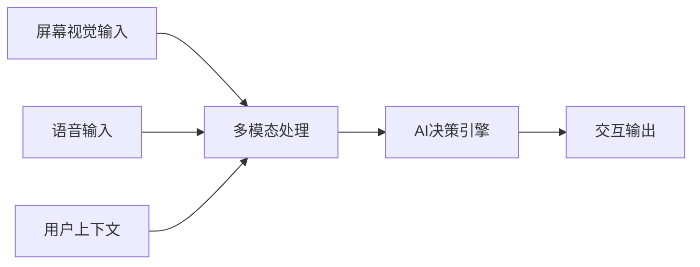
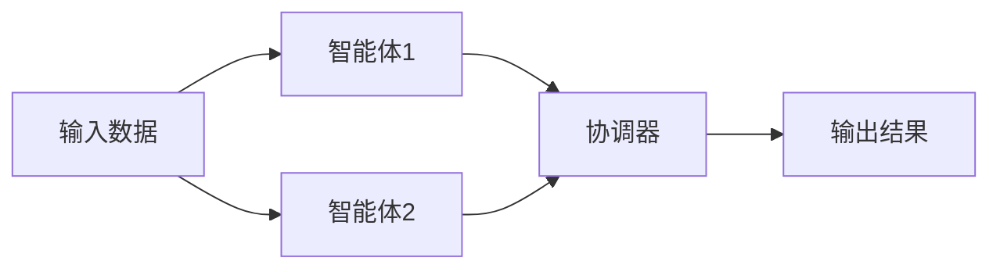

## 今日热点

今日GitHub热榜显示AI代理与记忆系统成为焦点，Claude相关工具爆火，同时多模态AI与大模型学习资源持续升温，反映出开发者对AI智能体能力边界拓展的强烈需求。

---

## 热门项目一览

| 排名 | 项目 | 语言 | 今日 | 总计 | 简介 |
|:---:|------|:----:|------:|-----:|------|
| 1 | [forrestchang/andrej-karpathy-skills](https://github.com/forrestchang/andrej-karpathy-skills) | Unknown | +7,959 | 50,133 | A single CLAUDE.md file to ... |
| 2 | [thedotmack/claude-mem](https://github.com/thedotmack/claude-mem) | TypeScript | +1,897 | 59,871 | A Claude Code plugin that a... |
| 3 | [Lordog/dive-into-llms](https://github.com/Lordog/dive-into-llms) | Jupyter Notebook | +1,385 | 30,745 | 《动手学大模型Dive into LLMs》系列编程实践教程 |
| 4 | [jamiepine/voicebox](https://github.com/jamiepine/voicebox) | TypeScript | +880 | 19,092 | The open-source voice synth... |
| 5 | [lsdefine/GenericAgent](https://github.com/lsdefine/GenericAgent) | Python | +872 | 2,816 | Self-evolving agent: grows ... |
| 6 | [google/magika](https://github.com/google/magika) | Python | +854 | 14,809 | Fast and accurate AI powere... |
| 7 | [EvoMap/evolver](https://github.com/EvoMap/evolver) | JavaScript | +812 | 3,190 | The GEP-Powered Self-Evolut... |
| 8 | [vercel-labs/open-agents](https://github.com/vercel-labs/open-agents) | TypeScript | +738 | 3,228 | An open source template for... |
| 9 | [BasedHardware/omi](https://github.com/BasedHardware/omi) | Dart | +378 | 9,137 | AI that sees your screen, l... |
| 10 | [SimoneAvogadro/android-reverse-engineering-skill](https://github.com/SimoneAvogadro/android-reverse-engineering-skill) | Shell | +375 | 2,260 | Claude Code skill to suppor... |
| 11 | [steipete/wacli](https://github.com/steipete/wacli) | Go | +321 | 1,694 | WhatsApp CLI |
| 12 | [z-lab/dflash](https://github.com/z-lab/dflash) | Python | +195 | 1,618 | DFlash: Block Diffusion for... |

---

## 趋势洞察

```
┌─────────────────────────────────────────────────────────────────┐
│  AI/ML 工具         ████████████████████████  11 个项目        │
│  其他               ████                      2 个项目        │
│  开发工具             ██                        1 个项目        │
└─────────────────────────────────────────────────────────────────┘
```

---

## 项目深度解读

### 1. forrestchang/andrej-karpathy-skills — AI 编程优化指南

> **一句话总结**：基于 Andrej Karpathy 对 LLM 编程陷阱的深度观察，提供 Claude Code 的优化指南。

#### 价值主张

| 维度 | 说明 |
|------|------|
| **解决痛点** | 解决 Claude Code 在编程任务中的常见陷阱和低效问题 |
| **目标用户** | 使用 Claude Code 进行编程的开发者和 AI 编程助手用户 |
| **核心亮点** | 基于 Andrej Karpathy 的专业知识 + 针对性优化建议 + 单文件简洁易用 |

#### 技术架构


**技术特色**：
- 基于 AI 专家的深度观察
- 针对特定 AI 编程助手的优化
- 简洁的单文件实现

#### 热度分析

- 项目获得超过 5 万星，单日增长近 8 千，表明 AI 编程助手优化需求旺盛
- 无 open issues，社区反馈可能通过其他渠道进行，用户满意度较高

#### 快速上手

```bash
# 克隆项目
git clone https://github.com/forrestchang/andrej-karpathy-skills.git

# 查看 CLAUDE.md 文件
cat andrej-karpathy-skills/CLAUDE.md
```

#### 注意事项

- 注意这些建议可能主要针对 Claude Code，对其他 AI 编程助手可能不完全适用
- Andrej Karpathy 的观察基于特定经验和环境，实际应用时可能需要根据具体情况调整


### 2. thedotmack/claude-mem — AI编码记忆助手

> **一句话总结**：自动捕获编码过程，AI压缩上下文，实现跨会话智能记忆的Claude插件。

#### 价值主张

| 维度 | 说明 |
|------|------|
| **解决痛点** | 解决Claude无法跨会话记忆编程上下文的问题 |
| **目标用户** | 使用Claude进行编程的开发者 |
| **核心亮点** | 自动捕获 + AI压缩 + 跨会话记忆 + 上下文注入 + 无缝集成 |

#### 技术架构


**技术特色**：
- 基于Claude agent-sdk的智能压缩算法
- 无缝集成Claude Code编辑器环境
- 跨会话上下文保持与智能检索机制

#### 热度分析

- 项目获得近6万星，近期增长迅速，显示AI辅助编程工具的高需求
- 作为Claude生态的重要插件，处于AI辅助编程工具的前沿位置

#### 快速上手

```bash
# 安装Claude Code插件
npm install -g claude-code

# 安装claude-mem插件
claude-code plugins install claude-mem
```

#### 注意事项

- 需要Claude账户和Claude Code环境支持
- 可能涉及数据隐私问题，因为会捕获和存储编码活动
- 性能影响：可能会对Claude Code的响应速度产生轻微影响


### 3. Lordog/dive-into-llms — 大模型实践教程

> **一句话总结**：系统化大模型编程实践教程，从基础到前沿应用，手把手带你掌握LLM核心技术。

#### 价值主张

| 维度 | 说明 |
|------|------|
| **解决痛点** | 理论与实践脱节，提供大模型完整学习路径和实操代码 |
| **目标用户** | AI从业者、计算机专业学生、LLM技术爱好者 |
| **核心亮点** | 系统性 + 实用性 + 代码完整 + 深度讲解 + 持续更新 |

#### 技术架构


**技术特色**：
- 系统化的大模型学习路径，覆盖从基础到前沿
- 提供完整可运行的Jupyter Notebook代码
- 结合理论与实践，深入讲解LLM核心技术
- 涵盖最新大模型技术趋势和应用场景

#### 热度分析

- 项目Star数超过3万，近期单日增长超过1.3k，显示极高关注度与热度
- Fork数与Star数比例约为1:8，表明用户学习意愿强烈，社区活跃度高

#### 快速上手

```bash
# 克隆项目仓库
git clone https://github.com/Lordog/dive-into-llms.git

# 安装依赖并运行示例
cd dive-into-llms
pip install -r requirements.txt
jupyter notebook
```

#### 注意事项

- 项目依赖较多，建议使用虚拟环境安装依赖
- 部分教程可能需要GPU资源支持
- 某些章节可能需要预先掌握Python和深度学习基础知识
- 由于LLM技术发展迅速，部分内容可能需要更新


### 4. jamiepine/voicebox — 开源语音合成

> **一句话总结**：开源语音合成工具，提供专业级语音生成功能，支持多种语音模型和自定义训练。

#### 价值主张

| 维度 | 说明 |
|------|------|
| **解决痛点** | 提供高质量、可定制的开源语音合成解决方案，降低技术门槛 |
| **目标用户** | 开发者、内容创作者、语音技术研究者和AI应用开发者 |
| **核心亮点** | 高质量语音生成+多模型支持+自定义训练+开源免费+易于集成 |

#### 技术架构


**技术特色**：
- 基于深度学习的神经网络语音合成技术
- 支持多种语音模型和架构切换
- 提供灵活的API和集成接口

#### 热度分析

- 项目获得19k+ stars且持续快速增长，表明社区对开源语音合成工具高度关注
- 高star与fork比例显示项目有活跃的用户社区和贡献生态

#### 快速上手

```bash
# 克隆仓库
git clone https://github.com/jamiepine/voicebox.git
# 安装依赖
npm install
# 运行示例
npm run example
```

#### 注意事项

- 项目可能需要较高的计算资源，特别是训练自定义模型时
- 使用时需注意语音数据的版权和隐私问题
- 可能需要一定的机器学习基础知识才能充分利用项目功能


### 5. lsdefine/GenericAgent — 自进化智能体

> **一句话总结**：从3.3K行种子代码开始的自进化智能体，通过技能树扩展实现系统控制，大幅减少token消耗。

#### 价值主张

| 维度 | 说明 |
|------|------|
| **解决痛点** | 解决智能体能力有限、扩展性差和token消耗大的问题 |
| **目标用户** | 需要高度自适应AI系统的开发者与研究机构 |
| **核心亮点** | 自进化能力 + 技能树扩展 + 系统完全控制 + 6倍token效率提升 |

#### 技术架构


**技术特色**：
- 自进化机制，从种子代码不断扩展能力
- 技能树架构，实现模块化能力增长
- 优化的token使用，效率提升6倍
- 系统控制能力，实现对全面环境的掌控

#### 热度分析

- 项目在一天内增加872个星标，表明获得了广泛关注和认可
- 虽然Open Issues为0，但Fork数量相对较低，可能项目处于早期阶段

#### 快速上手

```bash
# 克隆项目
git clone https://github.com/lsdefine/GenericAgent.git
cd GenericAgent
# 安装依赖
pip install -r requirements.txt
```

#### 注意事项

- 项目许可证未知，商业使用前需确认授权
- 项目描述显示这是一个研究性质的项目，可能需要一定的AI/ML背景知识
- 虽然没有开放的Issues，但建议关注项目更新，因为技术可能仍在快速迭代中


### 6. google/magika — AI文件类型检测器

> **一句话总结**：基于AI技术的快速准确文件类型检测工具，提升文件识别效率和准确性。

#### 价值主张

| 维度 | 说明 |
|------|------|
| **解决痛点** | 传统文件类型识别方法速度慢、准确性低，无法应对复杂文件格式 |
| **目标用户** | 安全研究人员、数据分析师、系统管理员、开发者 |
| **核心亮点** | 深度学习模型 + 高性能检测 + 低资源占用 + 高准确率 + 跨平台支持 |

#### 技术架构


**技术特色**：
- 基于深度学习的文件类型识别算法
- 支持多种文件格式的高效分类
- 低资源消耗的轻量级模型设计
- 实时快速检测能力
- 高准确率的文件类型判断

#### 热度分析

- 项目Star数达14,809，单日新增854，表明项目正处于快速增长期，获得社区高度认可
- 作为Google开源项目，在安全研究和文件处理领域具有重要生态地位，吸引了大量专业用户关注

#### 快速上手

```bash
# 安装magika
pip install magika

# 检测文件类型
magika file_path
```

#### 注意事项

- 项目可能需要一定的机器学习知识才能充分利用其高级功能
- 对于非常罕见的文件格式，识别准确率可能会有所下降
- 注意项目的许可证信息尚未明确，商业使用前需确认授权条款


### 7. EvoMap/evolver — AI进化引擎

> **一句话总结**：基于基因组进化协议的AI代理自我进化引擎，实现自主优化的智能系统。

#### 价值主张

| 维度 | 说明 |
|------|------|
| **解决痛点** | 解决AI系统自主进化能力不足，实现持续自我优化与适应 |
| **目标用户** | AI研究人员、智能系统开发者、进化算法研究者 |
| **核心亮点** | 基因组进化协议 + 自我进化能力 + AI代理系统 + 持续优化 + 开源生态 |

#### 技术架构


**技术特色**：
- 基于基因组进化协议的AI代理自我进化机制
- 无需人工干预的持续优化能力
- 开源生态系统支持灵活扩展与定制

#### 热度分析

- 项目近期热度显著，单日增长812个Star，显示社区高度关注
- 零Open Issues表明项目维护良好，问题解决效率高

#### 快速上手

```bash
# 克隆项目
git clone https://github.com/EvoMap/evolver.git
# 安装依赖
npm install
# 运行示例
npm start
```

#### 注意事项

- 项目使用Unknown许可证，商业应用前需确认授权条款
- 作为AI进化引擎，可能需要较高的计算资源支持


### 8. vercel-labs/open-agents — 云代理构建框架

> **一句话总结**：开源模板赋能开发者快速构建云原生智能代理系统，简化云服务集成流程。

#### 价值主张

| 维度 | 说明 |
|------|------|
| **解决痛点** | 云代理开发缺乏标准化模板和最佳实践，开发者需从零开始构建 |
| **目标用户** | 需要构建云原生智能代理的开发者和技术团队 |
| **核心亮点** | 模块化架构 + TypeScript类型安全 + 云服务集成 + 可扩展配置 |

#### 技术架构


**技术特色**：
- 基于TypeScript的全栈类型安全开发
- 插件化云服务架构，支持多平台API集成
- 事件驱动设计，实现高并发代理处理

#### 热度分析

- 近期单日增长738星，表明云代理技术正成为开发热点
- Vercel Labs背书，吸引前沿技术社区关注，生态潜力巨大

#### 快速上手

```bash
# 克隆项目
git clone https://github.com/vercel-labs/open-agents.git
cd open-agents

# 安装依赖并启动
npm install && npm run dev
```

#### 注意事项

- 项目License信息不明确，使用前需确认开源协议
- 作为模板项目，需要根据具体需求进行定制化配置
- 可能需要配置云服务API密钥和适当权限设置


### 9. BasedHardware/omi — AI个人助手

> **一句话总结**：通过视觉和听觉感知，提供实时智能决策建议的个人AI助手。

#### 价值主张

| 维度 | 说明 |
|------|------|
| **解决痛点** | 解决用户在复杂任务中需要实时指导和决策支持的问题 |
| **目标用户** | 需要智能辅助的专业人士、开发者和普通用户 |
| **核心亮点** | 屏幕视觉识别 + 语音交互 + 实时决策指导 + 多模态感知 + 隐私保护 |

#### 技术架构



**技术特色**：
- 多模态感知技术融合视觉与听觉信息
- 实时处理能力确保低延迟响应
- 隐私保护设计确保用户数据安全

#### 热度分析

- 项目近期Star增长迅速(+378)，表明社区关注度持续上升
- 高Fork/Star比例反映开发者对技术实现路径的浓厚兴趣

#### 快速上手

```bash
# 克隆仓库
git clone https://github.com/BasedHardware/omi.git
# 安装依赖
flutter pub get
# 运行应用
flutter run
```

#### 注意事项

- 注意权限设置，特别是屏幕录制和麦克风访问权限
- 确保系统资源充足，因为AI处理可能需要较高计算资源
- 关注隐私政策，了解数据收集和使用方式


### 10. SimoneAvogadro/android-reverse-engineering-skill — Android逆向辅助

> **一句话总结**：Claude Code环境下的Android应用逆向工程自动化工具集，提升分析效率。

#### 价值主张

| 维度 | 说明 |
|------|------|
| **解决痛点** | 简化Android应用逆向工程复杂流程，提高分析效率 |
| **目标用户** | Android安全研究员、逆向工程师、移动应用开发者 |
| **核心亮点** | 集成Claude Code智能分析 + 自动化逆向脚本 + 简化复杂流程 |

#### 技术架构


**技术特色**：
- 基于Shell脚本实现跨平台兼容性
- 集成Claude Code智能分析能力
- 提供标准化的逆向工程流程

#### 热度分析

- 项目Star数增长迅速，今日新增375星，表明社区关注度持续上升
- 作为Android逆向工程领域的辅助工具，填补了Claude Code生态的空白

#### 快速上手

```bash
# 安装依赖
./setup.sh

# 分析Android应用
./analyze.sh app.apk

# 生成报告
./generate-report.sh
```

#### 注意事项

- 需要基本的Android逆向工程知识
- 确保在合法合规的环境中使用
- 可能需要安装额外的逆向工程工具如apktool, jadx等


### 11. steipete/wacli — WhatsApp命令行工具

> **一句话总结**：Go开发的WhatsApp命令行工具，提供高效、轻量级的消息交互体验。

#### 价值主张

| 维度 | 说明 |
|------|------|
| **解决痛点** | 提供命令行方式操作WhatsApp，适合自动化和服务器环境 |
| **目标用户** | 开发者、系统管理员和自动化脚本用户 |
| **核心亮点** | 命令行操作 + 高效消息处理 + Go语言高性能实现 |

#### 技术架构


**技术特色**：
- 基于Go语言开发，提供跨平台兼容性
- 轻量级设计，资源占用少
- 模块化架构，易于扩展和维护

#### 热度分析

- 项目拥有1694个星标，单日增长321星，表明近期获得高度关注
- 作为WhatsApp CLI工具，填补了命令行操作空白，在自动化场景有独特价值

#### 快速上手

```bash
# 安装
go install github.com/steipete/wacli

# 基本使用
wacli send +123456789 "Hello from CLI"
```

#### 注意事项

- 使用前需要WhatsApp账户验证
- 需遵守WhatsApp服务条款，避免被封号


### 12. z-lab/dflash — 推测解码加速器

> **一句话总结**：DFlash通过块扩散技术优化推测解码，显著提升大模型文本生成速度。

#### 价值主张

| 维度 | 说明 |
|------|------|
| **解决痛点** | 大模型文本生成速度慢，计算资源消耗高 |
| **目标用户** | 大型语言模型研究者与部署工程师 |
| **核心亮点** | 块扩散技术 + 推测解码优化 + 高效计算 + 低延迟生成 |

#### 技术架构


**技术特色**：
- 块扩散技术加速推测解码过程
- 减少计算资源消耗同时保持生成质量
- 优化大模型推理的并行计算效率

#### 热度分析

- 项目近期增长迅速，单日增加195星，表明技术价值获得广泛认可
- 作为AI加速技术，处于大模型优化前沿领域，社区关注度持续上升

#### 快速上手

```bash
# 安装依赖
pip install -r requirements.txt

# 运行示例
python dflash_example.py --model_name gpt3 --input_text "Hello, world"
```

#### 注意事项

- 项目可能需要高性能GPU支持以获得最佳性能
- 不同模型架构可能需要特定配置才能适配DFlash技术
- 需要确保输入数据格式符合项目要求


### 13. openai/openai-agents-python — 多智能体框架

> **一句话总结**：轻量级多智能体协作框架，简化复杂AI工作流的构建与管理。

#### 价值主张

| 维度 | 说明 |
|------|------|
| **解决痛点** | 简化多智能体系统开发，降低AI工作流实现的复杂度。 |
| **目标用户** | AI开发者、研究人员和企业架构师。 |
| **核心亮点** | 轻量级设计+模块化架构+易于扩展+内置通信机制 |

#### 技术架构



**技术特色**：
- 基于OpenAI API的智能体实现
- 模块化设计支持自定义智能体
- 内置智能体间通信机制
- 轻量级架构，易于集成

#### 热度分析

- 高关注度项目，近期增长迅速，表明多智能体系统需求旺盛。
- 作为OpenAI官方框架，处于AI多智能体生态核心位置。

#### 快速上手

```bash
# 安装
pip install openai-agents

# 基本使用
from openai_agents import Agent
agent = Agent("my-agent", model="gpt-4")
response = agent.run("What's the weather today?")
```

#### 注意事项

- 项目信息有限，需要查看官方文档获取完整API参考
- 依赖OpenAI API，需配置有效API密钥
- 作为较新项目，API可能不稳定，建议关注更新


### 14. topoteretes/cognee — AI记忆引擎

> **一句话总结**：轻量级AI智能体记忆引擎，6行代码即可实现知识存储与检索功能。

#### 价值主张

| 维度 | 说明 |
|------|------|
| **解决痛点** | AI智能体缺乏持久化记忆与知识整合能力的问题 |
| **目标用户** | AI应用开发者、智能体系统构建者、研究人员 |
| **核心亮点** | 极简API设计 + 高效记忆管理 + 智能知识检索 + 跨模态存储 |

#### 技术架构


**技术特色**：
- 极简API设计，仅需6行代码即可集成
- 高效的记忆存储与索引机制
- 支持多模态知识的关联与推理

#### 热度分析

- 项目获得15k+ Star，日增170+，表明社区认可度高且增长迅速
- Fork数相对较低(1.6k)，可能表明项目处于早期发展阶段，用户更倾向于直接使用而非二次开发

#### 快速上手

```bash
# 安装cognee
pip install cognee

# 基本使用示例
from cognee import Cognee
cognee = Cognee()
cognee.add("你的知识内容")
result = cognee.query("相关问题")
```

#### 注意事项

- 项目License未知，商业使用前需确认授权条款
- 作为较新项目，API和功能可能还在快速迭代中
- 文档和社区支持可能尚不完善


## 今日推荐

| 主题 | 推荐项目 | 亮点 |
|------|----------|------|
| 今日最热 | [forrestchang/andrej-karpathy-skills](https://github.com/forrestchang/andrej-karpathy-skills) | A single CLAUDE.m... |
| 值得关注 | [thedotmack/claude-mem](https://github.com/thedotmack/claude-mem) | A Claude Code plu... |
| 快速上手 | [Lordog/dive-into-llms](https://github.com/Lordog/dive-into-llms) | 《动手学大模型Dive into ... |
| 长期潜力 | [jamiepine/voicebox](https://github.com/jamiepine/voicebox) | The open-source v... |

---

<div align="center">

*Generated on 2026-04-17 | Powered by GitHub Trending Reporter*

</div>