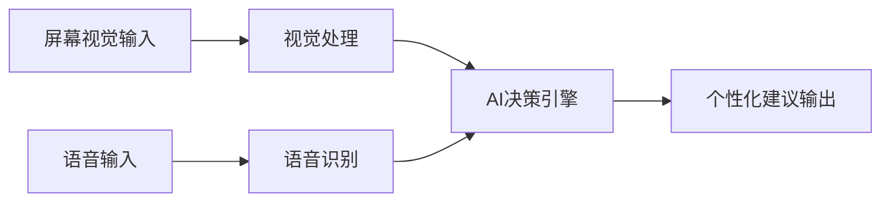
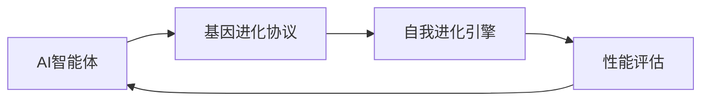
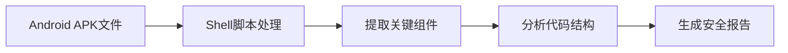

## 今日热点

今日GitHub热榜聚焦AI代理技术爆发与开发工具智能化，自进化代理与多智能体框架引领潮流，AI正在重塑软件开发范式。

---

## 热门项目一览

| 排名 | 项目 | 语言 | 今日 | 总计 | 简介 |
|:---:|------|:----:|------:|-----:|------|
| 1 | [obra/superpowers](https://github.com/obra/superpowers) | Shell | +1,713 | 157,784 | An agentic skills framework... |
| 2 | [google/magika](https://github.com/google/magika) | Python | +956 | 15,478 | Fast and accurate AI powere... |
| 3 | [Lordog/dive-into-llms](https://github.com/Lordog/dive-into-llms) | Jupyter Notebook | +944 | 31,535 | 《动手学大模型Dive into LLMs》系列编程实践教程 |
| 4 | [lsdefine/GenericAgent](https://github.com/lsdefine/GenericAgent) | Python | +845 | 3,646 | Self-evolving agent: grows ... |
| 5 | [BasedHardware/omi](https://github.com/BasedHardware/omi) | Dart | +824 | 9,854 | AI that sees your screen, l... |
| 6 | [jamiepine/voicebox](https://github.com/jamiepine/voicebox) | TypeScript | +797 | 19,870 | The open-source voice synth... |
| 7 | [EvoMap/evolver](https://github.com/EvoMap/evolver) | JavaScript | +737 | 4,270 | The GEP-Powered Self-Evolut... |
| 8 | [openai/openai-agents-python](https://github.com/openai/openai-agents-python) | Python | +625 | 21,826 | A lightweight, powerful fra... |
| 9 | [SimoneAvogadro/android-reverse-engineering-skill](https://github.com/SimoneAvogadro/android-reverse-engineering-skill) | Shell | +538 | 2,756 | Claude Code skill to suppor... |
| 10 | [Donchitos/Claude-Code-Game-Studios](https://github.com/Donchitos/Claude-Code-Game-Studios) | Shell | +311 | 11,803 | Turn Claude Code into a ful... |
| 11 | [z-lab/dflash](https://github.com/z-lab/dflash) | Python | +287 | 1,807 | DFlash: Block Diffusion for... |
| 12 | [pingdotgg/t3code](https://github.com/pingdotgg/t3code) | TypeScript | +227 | 9,450 | No description |

---

## 趋势洞察

```
┌─────────────────────────────────────────────────────────────────┐
│  AI/ML 工具         ████████████████████████  12 个项目        │
│  其他               ██████                    3 个项目        │
└─────────────────────────────────────────────────────────────────┘
```

---

## 项目深度解读

### 1. obra/superpowers — 智能技能框架

> **一句话总结**：一套智能化的技能框架与开发方法论，提升个人和团队效能。

#### 价值主张

| 维度 | 说明 |
|------|------|
| **解决痛点** | 解决个人技能提升和团队高效协作的方法论缺失问题 |
| **目标用户** | 开发者、技术团队和追求高效工作方法的专业人士 |
| **核心亮点** | 智能化技能框架 + 实用方法论 + 高效协作工具 + 持续改进机制 |

#### 技术架构


**技术特色**：
- 基于Shell脚本构建的轻量级执行环境
- 模块化的技能框架设计
- 跨平台兼容性强

#### 热度分析

- 项目获得15万+ stars，近期增长迅速，显示社区高度认可
- Fork数量适中，表明项目已被广泛采用和二次开发

#### 快速上手

```bash
# 克隆项目
git clone https://github.com/obra/superpowers.git
# 进入目录
cd superpowers
# 运行初始化脚本
./init.sh
```

#### 注意事项

- 项目依赖Shell环境，确保系统兼容性
- 可能需要根据个人需求调整配置
- 建议先阅读文档再实施方法


### 2. google/magika — AI文件类型检测

> **一句话总结**：基于深度学习的极速文件类型检测工具，准确率远超传统方法。

#### 价值主张

| 维度 | 说明 |
|------|------|
| **解决痛点** | 传统文件类型检测速度慢、准确率低，无法应对复杂和新型文件格式 |
| **目标用户** | 安全研究人员、开发者、数据分析师和需要处理大量文件的专业人士 |
| **核心亮点** | AI驱动 + 极速检测 + 高准确率 + 支持批量处理 |

#### 技术架构


**技术特色**：
- 基于深度学习的文件内容识别模型
- 比传统magic number方法更精确高效
- 支持多种文件类型和批量检测

#### 热度分析

- 项目近期增长迅猛，今日新增近千星，表明社区关注度极高
- 作为Google开源项目，处于AI文件检测领域前沿，具有技术引领作用

#### 快速上手

```bash
# 安装magika
pip install magika

# 基本使用
magika sample_file.pdf
```

#### 注意事项

- 项目依赖Python环境，确保系统兼容性
- 对于大型文件集合，可能需要调整性能参数
- 虽然准确性高，但可能存在极少数边缘情况识别错误


### 3. Lordog/dive-into-llms — LLM实践教程

> **一句话总结**：从零开始实践LLM开发，提供可运行的代码示例和深入理论解析。

#### 价值主张

| 维度 | 说明 |
|------|------|
| **解决痛点** | 将复杂的LLM理论转化为可实践的编程教程，降低学习门槛 |
| **目标用户** | AI初学者、研究者及希望深入LLM开发的工程师 |
| **核心亮点** | 理论与实践结合+代码可运行+循序渐进+内容全面+中文友好 |

#### 技术架构


**技术特色**：
- 基于Jupyter Notebook的交互式学习环境
- 提供从基础到高级的完整LLM开发流程
- 结合理论与实践，每个概念都有配套代码示例

#### 热度分析

- 31k+星标和显著增长，表明项目在LLM学习领域具有极高认可度
- 作为中文LLM学习资源，填补了国内高质量教程空白，社区贡献活跃

#### 快速上手

```bash
# 克隆项目仓库
git clone https://github.com/Lordog/dive-into-llms.git

# 运行示例Notebook
cd dive-into-llms
jupyter notebook
```

#### 注意事项

- 需要一定的Python基础和机器学习基础知识
- 项目可能依赖较多第三方库，建议使用虚拟环境
- 部分示例可能需要较高计算资源，如GPU支持


### 4. lsdefine/GenericAgent — 自我进化智能体

> **一句话总结**：从3300行种子代码自我成长的智能体，实现系统完全控制且大幅降低token消耗。

#### 价值主张

| 维度 | 说明 |
|------|------|
| **解决痛点** | 传统AI智能体需要大量预训练数据和计算资源，系统控制效率低 |
| **目标用户** | AI研究人员、系统开发者、需要高效AI代理的团队 |
| **核心亮点** | 自我进化能力 + 技能树扩展 + 6倍token效率提升 + 系统完全控制 |

#### 技术架构


**技术特色**：
- 种子代码驱动的自我进化机制
- 技能树动态扩展架构
- 高效token利用算法
- 系统控制能力集成
- 自适应学习机制

#### 热度分析

- 项目近期爆发式增长，单日增加845 stars，表明技术突破性强
- 虽然issues为0，但fork数相对较低，可能处于早期采用阶段

#### 快速上手

```bash
# 安装依赖
pip install -r requirements.txt

# 运行示例
python generic_agent.py --config config.yaml
```

#### 注意事项

- 项目许可证未知，商业使用前需确认授权
- 作为新兴技术，长期稳定性和兼容性有待验证
- 可能需要较强的AI和系统控制背景才能充分利用


### 5. BasedHardware/omi — 个人AI助手

> **一句话总结**：通过视觉和听觉感知，提供实时个人指导和决策支持的AI助手

#### 价值主张

| 维度 | 说明 |
|------|------|
| **解决痛点** | 解决个人决策和信息处理效率问题 |
| **目标用户** | 需要实时指导和提高效率的知识工作者 |
| **核心亮点** | 屏幕视觉识别 + 语音交互 + 实时指导 |

#### 技术架构



**技术特色**：
- 跨平台Dart实现，保证一致性和性能
- 实时屏幕内容理解与分析能力
- 语音交互与自然语言处理集成

#### 热度分析

- 项目近一日增长824星，表明正处于快速上升期，可能近期有重大更新或突破
- Fork数相对Star数比例约为17%，显示社区参与度较高

#### 快速上手

```bash
git clone https://github.com/BasedHardware/omi.git
cd omi
dart pub get
dart run omi
```

#### 注意事项

- 项目许可证未知，商业使用前需确认授权
- 需要关注隐私问题，特别是涉及屏幕内容和语音采集
- 项目目前没有开放的Issues，可能社区支持渠道有限


### 6. jamiepine/voicebox — 语音合成工作室

> **一句话总结**：开源语音合成工作室，提供高质量语音生成与编辑功能。

#### 价值主张

| 维度 | 说明 |
|------|------|
| **解决痛点** | 提供开源、易用的语音合成解决方案，降低语音技术应用门槛 |
| **目标用户** | 开发者、内容创作者、语音应用开发者 |
| **核心亮点** | 开源免费 + 高质量语音合成 + 易于集成 + 可定制性强 |

#### 技术架构


**技术特色**：
- 基于深度学习的语音合成技术
- TypeScript实现，提供良好的类型安全性和跨平台兼容性
- 开源架构，支持社区贡献和定制化开发

#### 热度分析

- 项目Star数近2万，单日增长近800，表明项目正处于快速增长期，受到社区高度关注
- 0个Open Issues可能表明问题通过其他渠道解决，或者项目维护良好，社区反馈积极

#### 快速上手

```bash
# 克隆项目
git clone https://github.com/jamiepine/voicebox.git
# 安装依赖
npm install
# 启动应用
npm start
```

#### 注意事项

- 由于项目License未知，商业使用前需确认授权条款
- 项目可能需要较高的计算资源进行语音合成
- 可能需要特定的音频处理环境才能获得最佳效果


### 7. EvoMap/evolver — AI进化引擎

> **一句话总结**：基于基因进化协议的自进化引擎，使AI智能体能够持续优化和自我进化。

#### 价值主张

| 维度 | 说明 |
|------|------|
| **解决痛点** | AI智能体缺乏自适应和持续进化的能力 |
| **目标用户** | AI研究人员、智能体开发者、进化算法研究者 |
| **核心亮点** | 基因进化协议(GEP)驱动 + 自我进化能力 + AI智能体优化 |

#### 技术架构



**技术特色**：
- 基于基因进化协议的自适应机制
- JavaScript实现的进化算法
- 持续优化的智能体架构

#### 热度分析

- 项目近期增长迅猛，单日新增737星，表明社区高度关注。
- 零未解决问题显示项目维护良好，可能是AI进化算法领域的重要工具。

#### 快速上手

```bash
# 克隆项目
git clone https://github.com/EvoMap/evolver.git
# 安装依赖
npm install
# 运行示例
npm run example
```

#### 注意事项

- 需要理解进化算法基础才能有效使用
- 项目许可证不明确，使用前需确认
- 可能需要较高的计算资源进行进化实验


### 8. openai/openai-agents-python — 多智能体框架

> **一句话总结**：OpenAI推出的轻量级多智能体框架，支持复杂AI协作工作流构建

#### 价值主张

| 维度 | 说明 |
|------|------|
| **解决痛点** | 简化多AI智能体协作流程，降低复杂AI系统开发难度 |
| **目标用户** | AI开发者、研究人员和企业构建复杂AI应用 |
| **核心亮点** | 轻量级设计 + 模块化架构 + 易于扩展 + OpenAI集成 |

#### 技术架构


**技术特色**：
- 基于OpenAI API的智能体通信机制
- 智能体任务自动分配与调度
- 轻量级实现，易于集成到现有项目

#### 热度分析

- 项目Star数快速增长，日增625，表明社区高度关注和采用
- 作为OpenAI官方项目，在AI多智能体领域具有标杆地位

#### 快速上手

```bash
# 安装openai-agents-python
pip install openai-agents

# 初始化基本智能体
agents init my-agent-project

# 运行示例工作流
agents run examples/basic_workflow.py
```

#### 注意事项

- 需要OpenAI API密钥才能使用
- 项目可能处于早期阶段，API可能会有较大变动
- 多智能体系统设计需要考虑复杂性和资源消耗


### 9. SimoneAvogadro/android-reverse-engineering-skill — Android逆向工程助手

> **一句话总结**：为Claude AI定制的Android应用逆向工程辅助工具，提供自动化脚本支持安全分析。

#### 价值主张

| 维度 | 说明 |
|------|------|
| **解决痛点** | Android逆向工程过程复杂繁琐，缺乏自动化工具支持安全研究人员快速分析应用 |
| **目标用户** | Android安全研究人员、逆向工程师、移动应用开发者 |
| **核心亮点** | 集成Claude AI辅助分析 + 自动化逆向流程 + 提供专业工具链支持 |

#### 技术架构



**技术特色**：
- 基于Shell脚本实现跨平台兼容性
- 集成Claude AI进行智能代码分析
- 提供标准化的逆向工程工作流程

#### 热度分析

- 项目近期获得大量关注（单日新增538星），表明Android安全领域对AI辅助工具需求旺盛
- 在Android逆向工程社区中具有较高影响力，成为研究人员的重要参考资源

#### 快速上手

```bash
# 克隆项目
git clone https://github.com/SimoneAvogadro/android-reverse-engineering-skill.git

# 进入目录
cd android-reverse-engineering-skill

# 赋予执行权限
chmod +x *.sh
```

#### 注意事项

- 需要确保已安装Claude Code环境
- 使用前应了解基本的Android逆向工程知识
- 仅用于合法的安全研究和测试目的
- 某些脚本可能需要额外的工具支持


### 10. Donchitos/Claude-Code-Game-Studios — AI游戏开发

> **一句话总结**：通过49个AI代理和72个工作流技能，将Claude转变为完整游戏开发工作室。

#### 价值主张

| 维度 | 说明 |
|------|------|
| **解决痛点** | 简化游戏开发流程，实现AI驱动的自动化游戏创作 |
| **目标用户** | 独立游戏开发者、小型游戏工作室、AI技术爱好者 |
| **核心亮点** | AI代理协作系统 + 完整游戏开发工作流 + 模拟真实工作室层级 |

#### 技术架构


**技术特色**：
- 基于Shell脚本实现的AI代理协调系统
- 模拟真实游戏开发工作室的组织架构
- 通过工作流技能实现游戏开发全流程自动化

#### 热度分析

- 项目Star数达11,803且持续增长，表明AI辅助游戏开发领域热度高涨
- Fork数1,720说明社区积极参与，项目具有较强可扩展性和实用性

#### 快速上手

```bash
# 克隆项目
git clone https://github.com/Donchitos/Claude-Code-Game-Studios.git
# 进入项目目录
cd Claude-Code-Game-Studios
# 运行项目（具体命令可能需要查看README）
./start_game_studio.sh
```

#### 注意事项

- 需要确保Claude API可用且具有足够权限
- 项目可能需要根据具体游戏类型进行配置调整
- Shell脚本执行环境需兼容，建议在Linux或macOS上运行


### 11. z-lab/dflash — 解码加速技术

> **一句话总结**：通过块扩散方法优化推测解码，实现大语言模型的高效并行推理。

#### 价值主张

| 维度 | 说明 |
|------|------|
| **解决痛点** | 传统解码方法计算效率低，难以平衡速度与质量 |
| **目标用户** | 大语言模型研究人员和推理系统工程师 |
| **核心亮点** | 块扩散机制 + 推测解码优化 + 质量可控加速 |

#### 技术架构


**技术特色**：
- 创新性地将扩散模型引入解码过程
- 通过块级并行计算显著提升推理速度
- 在保持生成质量的同时实现高效解码

#### 热度分析

- 项目Star数1807，Fork数119，显示社区对该解码加速技术的高度关注
- 作为学术研究项目，在模型优化领域具有显著影响力

#### 快速上手

```bash
git clone https://github.com/z-lab/dflash.git
cd dflash
pip install -e .
```

#### 注意事项

- 项目可能需要较强的计算资源来验证效果
- 代码可能需要针对不同模型进行适配调整


### 12. pingdotgg/t3code — T3代码生成

> **一句话总结**：T3 Stack代码生成工具，简化现代全栈应用开发流程。

#### 价值主张

| 维度 | 说明 |
|------|------|
| **解决痛点** | 简化T3 Stack项目初始化和代码生成流程 |
| **目标用户** | 使用T3 Stack的全栈开发者和团队 |
| **核心亮点** | 代码模板自动化 + 类型安全 + 开箱即用配置 |

#### 技术架构


**技术特色**：
- 基于TypeScript的强类型代码生成
- 集成T3 Stack核心组件
- 支持多种项目模板和配置选项

#### 热度分析

- 项目近期增长迅速，日均增长约200+ stars，显示社区高度关注
- 作为T3生态系统工具，具有明确的定位和目标用户群体

#### 快速上手

```bash
# 安装t3code
npm install -g t3code

# 创建新项目
t3code init my-project

# 启动开发服务器
cd my-project && npm run dev
```

#### 注意事项
- 需要Node.js环境支持
- 项目可能需要T3 Stack基础知识以充分利用工具功能
- 建议查阅官方文档获取最新使用指南


### 13. ChromeDevTools/chrome-devtools-mcp — AI编程辅助工具

> **一句话总结**：将 Chrome DevTools 功能集成到 AI 编码代理中，提供浏览器调试能力的智能编程辅助。

#### 价值主张

| 维度 | 说明 |
|------|------|
| **解决痛点** | 为 AI 编码代理提供浏览器调试能力，弥合 AI 与浏览器交互的鸿沟 |
| **目标用户** | AI 编码工具开发者、自动化测试工程师、智能编程助手构建者 |
| **核心亮点** | Chrome DevTools 集成 + 编码代理支持 + 浏览器自动化 + 调试能力增强 |

#### 技术架构


**技术特色**：
- 通过 MCP 协议连接 AI 代理与浏览器调试能力
- 使用 TypeScript 实现类型安全的 API 接口
- 提供完整的 DevTools 功能代理访问

#### 热度分析

- 项目 Star 数高且持续增长，表明其在 AI 编码辅助领域具有重要价值
- 较少的 Issues 可能表明项目成熟度高或社区通过其他渠道反馈问题

#### 快速上手

```bash
# 安装依赖
npm install chrome-devtools-mcp

# 初始化配置
npx chrome-devtools-mcp init

# 启动服务
npx chrome-devtools-mcp start
```

#### 注意事项

- 需要熟悉 Chrome DevTools API 和 MCP 协议
- 可能需要额外的配置才能与特定的 AI 编码代理集成
- 项目文档可能不够完善，需要参考源码理解使用方法


### 14. Tracer-Cloud/opensre — AI运维工具包

> **一句话总结**：基于AI的SRE代理构建工具，赋能运维智能化转型。

#### 价值主张

| 维度 | 说明 |
|------|------|
| **解决痛点** | 传统运维流程缺乏智能决策能力，难以应对复杂系统问题 |
| **目标用户** | SRE工程师、DevOps团队、云架构师 |
| **核心亮点** | AI驱动的运维决策 + 自定义代理构建 + 开源可扩展 |

#### 技术架构


**技术特色**：
- 基于Python的AI代理框架，易于扩展和定制
- 支持多种云环境的集成和监控
- 提供可配置的SRE工作流模板

#### 热度分析

- 项目近期Star增长迅速(单日增长184)，表明AI运维领域热度上升
- 相对Fork数较低，说明项目处于早期阶段，社区生态尚未完全形成

#### 快速上手

```bash
# 克隆项目
git clone https://github.com/Tracer-Cloud/opensre.git
cd opensre
# 安装依赖
pip install -r requirements.txt
```

#### 注意事项

- 项目许可证信息不明确，商业使用前需确认许可条款
- 作为早期项目，API和功能可能会发生变化
- 需要一定的AI和SRE基础知识才能充分利用项目价值


### 15. lukilabs/craft-agents-oss — 智能体构建框架

> **一句话总结**：一个用于构建和定制AI智能体的开源工具框架，提供模块化开发环境。

#### 价值主张

| 维度 | 说明 |
|------|------|
| **解决痛点** | 简化AI智能体构建流程，降低开发门槛 |
| **目标用户** | AI开发者、研究人员和自动化系统构建者 |
| **核心亮点** | TypeScript支持 + 模块化设计 + 可扩展架构 + 开源生态 |

#### 技术架构


**技术特色**：
- 基于TypeScript的类型安全开发环境
- 提供丰富的钩子和扩展点机制
- 支持智能体组件的灵活组合和复用

#### 热度分析

- 项目获得4300+ stars，近期增长迅速，表明社区认可度高
- 在开源智能体框架领域具有较强竞争力，Fork数显示活跃的开发参与度

#### 快速上手

```bash
# 克隆项目
git clone https://github.com/lukilabs/craft-agents-oss.git

# 安装依赖
npm install

# 运行示例
npm run example
```

#### 注意事项

- 项目文档可能不够完善，需要参考示例代码
- 作为开源项目，可能需要自行解决一些兼容性问题
- 建议关注项目更新日志，以获取最新功能变化


## 今日推荐

| 主题 | 推荐项目 | 亮点 |
|------|----------|------|
| 今日最热 | [obra/superpowers](https://github.com/obra/superpowers) | An agentic skills... |
| 值得关注 | [google/magika](https://github.com/google/magika) | Fast and accurate... |
| 快速上手 | [Lordog/dive-into-llms](https://github.com/Lordog/dive-into-llms) | 《动手学大模型Dive into ... |
| 长期潜力 | [lsdefine/GenericAgent](https://github.com/lsdefine/GenericAgent) | Self-evolving age... |

---

<div align="center">

*Generated on 2026-04-18 | Powered by GitHub Trending Reporter*

</div>