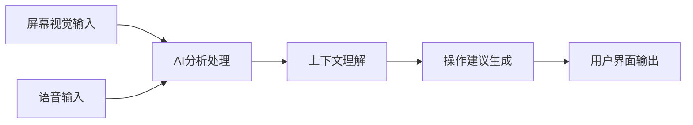
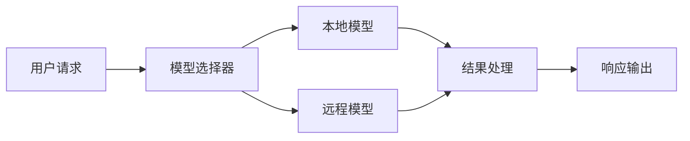

## 今日热点

今日GitHub热榜项目精彩纷呈。

---

## 热门项目一览

| 排名 | 项目 | 语言 | 今日 | 总计 | 简介 |
|:---:|------|:----:|------:|-----:|------|
| 1 | [EvoMap/evolver](https://github.com/EvoMap/evolver) | JavaScript | +1,131 | 5,030 | The GEP-Powered Self-Evolut... |
| 2 | [BasedHardware/omi](https://github.com/BasedHardware/omi) | Dart | +609 | 10,485 | AI that sees your screen, l... |
| 3 | [Lordog/dive-into-llms](https://github.com/Lordog/dive-into-llms) | Jupyter Notebook | +547 | 32,038 | 《动手学大模型Dive into LLMs》系列编程实践教程 |
| 4 | [openai/openai-agents-python](https://github.com/openai/openai-agents-python) | Python | +470 | 22,366 | A lightweight, powerful fra... |
| 5 | [thunderbird/thunderbolt](https://github.com/thunderbird/thunderbolt) | TypeScript | +447 | 1,590 | AI You Control: Choose your... |
| 6 | [SimoneAvogadro/android-reverse-engineering-skill](https://github.com/SimoneAvogadro/android-reverse-engineering-skill) | Shell | +403 | 3,150 | Claude Code skill to suppor... |
| 7 | [rustdesk/rustdesk](https://github.com/rustdesk/rustdesk) | Rust | +393 | 112,109 | An open-source remote deskt... |
| 8 | [tractorjuice/arc-kit](https://github.com/tractorjuice/arc-kit) | HTML | +135 | 747 | Enterprise Architecture Gov... |
| 9 | [aaddrick/claude-desktop-debian](https://github.com/aaddrick/claude-desktop-debian) | Shell | +44 | 3,479 | Claude Desktop for Debian-b... |
| 10 | [deepseek-ai/DeepGEMM](https://github.com/deepseek-ai/DeepGEMM) | Cuda | +31 | 6,544 | DeepGEMM: clean and efficie... |

---

## 趋势洞察

```
┌─────────────────────────────────────────────────────────────────┐
│  AI/ML 工具         ████████████████████████  8 个项目        │
│  开发工具             ███                       1 个项目        │
│  其他               ███                       1 个项目        │
└─────────────────────────────────────────────────────────────────┘
```

---

## 项目深度解读

### 1. EvoMap/evolver — AI智能体进化引擎

> **一句话总结**：基于基因组进化协议的自进化引擎，使AI智能体能够自我进化和优化。

#### 价值主张

| 维度 | 说明 |
|------|------|
| **解决痛点** | AI智能体缺乏自适应进化和自我优化的能力 |
| **目标用户** | AI研究人员、智能体开发者、进化算法爱好者 |
| **核心亮点** | 基因组进化协议(GEP) + 自我进化机制 + AI智能体优化 + 开源可扩展 |

#### 技术架构


**技术特色**：
- 基因组进化协议(GEP)实现智能体编码
- 自我进化机制无需人工干预
- JavaScript实现便于Web环境部署

#### 热度分析

- 项目获得5030个Star，单日增长1131，表明近期关注度激增
- 0个Open Issues显示项目维护良好，问题处理及时

#### 快速上手

```bash
# 克隆项目
git clone https://github.com/EvoMap/evolver.git
# 安装依赖
npm install
# 运行示例
npm run example
```

#### 注意事项

- 项目许可证未知，商业使用需谨慎
- 作为AI进化引擎，可能需要计算资源支持
- 文档可能不够完善，需要深入研究源码


### 2. BasedHardware/omi — 桌面AI助手

> **一句话总结**：基于Dart开发的桌面AI助手，通过视觉和听觉输入为用户提供实时操作指导。

#### 价值主张

| 维度 | 说明 |
|------|------|
| **解决痛点** | 传统AI助手无法全面感知用户环境和对话上下文 |
| **目标用户** | 需要实时AI辅助的办公和学习人群 |
| **核心亮点** | 屏幕视觉识别 + 语音交互 + 实时操作指导 |

#### 技术架构



**技术特色**：
- 多模态输入处理技术
- Dart跨平台实现
- 实时上下文理解能力

#### 热度分析

- 项目Star数突破1万，近期增长迅猛，日增Star数达600+，显示社区高度关注
- Fork数相对合理，表明项目处于早期阶段，尚未形成大规模分支

#### 快速上手

```bash
# 克隆项目
git clone https://github.com/BasedHardware/omi.git
# 进入项目目录
cd omi
# 安装依赖
dart pub get
# 运行项目
dart run
```

#### 注意事项

- 项目许可证未知，使用前需确认授权条款
- 作为AI助手应用，可能涉及隐私数据收集，需关注数据安全政策


### 3. Lordog/dive-into-llms — 大模型实践教程

> **一句话总结**：提供大模型系列编程实践教程，帮助开发者从零开始深入理解大模型原理与应用。

#### 价值主张

| 维度 | 说明 |
|------|------|
| **解决痛点** | 解决大模型理论学习与实际应用脱节问题 |
| **目标用户** | AI研究者、工程师和机器学习爱好者 |
| **核心亮点** | 实践导向 + 代码完整 + 原理深入 + 覆盖广泛 |

#### 技术架构


**技术特色**：
- 基于Jupyter Notebook的交互式学习体验
- 理论与实践紧密结合的教程设计
- 涵盖大模型全链路技术栈

#### 热度分析

- 项目获得3万+星标，日增500+，表明热度持续攀升，社区认可度高
- 作为中文大模型学习资源，填补了国内高质量教程空白，生态位置独特

#### 快速上手

```bash
# 克隆项目
git clone https://github.com/Lordog/dive-into-llms.git

# 启动Jupyter Notebook
cd dive-into-llms
jupyter notebook
```

#### 注意事项

- 需要一定的机器学习和Python基础
- 建议按照章节顺序学习，循序渐进
- 注意检查依赖环境是否满足要求


### 4. openai/openai-agents-python — 多智能体框架

> **一句话总结**：OpenAI官方推出的轻量级多智能体协作框架，简化复杂AI系统开发流程。

#### 价值主张

| 维度 | 说明 |
|------|------|
| **解决痛点** | 解决多AI智能体协作复杂、开发门槛高的问题 |
| **目标用户** | AI应用开发者、研究人员和企业技术团队 |
| **核心亮点** | 轻量级设计 + 模块化架构 + 易于集成 + 官方支持 |

#### 技术架构


**技术特色**：
- 基于OpenAI API构建，无缝对接GPT等大语言模型能力
- 提供标准化智能体接口，支持自定义和灵活扩展
- 内置任务分配和结果整合机制，简化多智能体协作逻辑

#### 热度分析

- 项目Star数超22K，近期日增470+，增长迅猛，显示社区高度关注
- 作为OpenAI官方项目，在AI智能体生态中占据核心位置，引领行业标准

#### 快速上手

```bash
# 安装框架
pip install openai-agents

# 基本使用示例
from openai_agents import Agent, Workflow

# 创建智能体
analyst = Agent("市场分析师", system_prompt="你是市场分析专家")
writer = Agent("内容创作者", system_prompt="你是专业内容创作者")

# 创建工作流
workflow = Workflow([analyst, writer])
response = workflow.run("分析科技行业趋势并撰写报告")
```

#### 注意事项

- 需要OpenAI API密钥才能正常运行，涉及API调用成本
- 作为新项目，API和功能可能会发生变更，生产环境使用需谨慎评估
- 项目文档尚在完善中，部分高级功能可能需要参考源码实现


### 5. thunderbird/thunderbolt — 自主AI平台

> **一句话总结**：开源AI框架，让用户自主选择模型、拥有数据所有权并消除供应商锁定。

#### 价值主张

| 维度 | 说明 |
|------|------|
| **解决痛点** | 打破AI服务垄断，解决数据隐私泄露和供应商锁定问题 |
| **目标用户** | 注重数据隐私的开发者、研究人员和企业用户 |
| **核心亮点** | 多模型支持 + 数据本地化处理 + 开源可定制 + 无供应商绑定 |

#### 技术架构



**技术特色**：
- TypeScript开发，提供类型安全保证
- 模块化架构支持多种AI模型集成
- 数据本地处理确保隐私保护
- 插件化设计便于功能扩展

#### 热度分析

- 项目近期关注度激增，单日Star增长447，反映市场对自主AI解决方案的强烈需求
- 作为Thunderbird生态项目，继承了成熟的社区基础和品牌信任度

#### 快速上手

```bash
# 克隆仓库
git clone https://github.com/thunderbird/thunderbolt.git

# 安装依赖并构建
npm install && npm run build

# 启动服务
npm start
```

#### 注意事项

- 项目许可证信息不明确，商业使用前需确认授权条款
- 项目处于早期阶段，API和功能可能存在较大变动
- 需要一定的AI和机器学习背景知识才能充分利用项目功能


### 6. SimoneAvogadro/android-reverse-engineering-skill — Android逆向工程技能

> **一句话总结**：一个专为Claude Code设计的Android应用逆向工程辅助工具，简化反流程操作。

#### 价值主张

| 维度 | 说明 |
|------|------|
| **解决痛点** | 简化Android应用逆向工程流程，降低技术门槛 |
| **目标用户** | Android安全研究员、逆向工程师、移动应用开发者 |
| **核心亮点** | 集成Claude Code + 自动化逆向流程 + 智能分析 + 交互式文档 |

#### 技术架构


**技术特色**：
- 基于Claude Code的智能逆向分析
- Shell脚本实现自动化逆向流程
- 与现有逆向工具链无缝集成

#### 热度分析

- 项目获得3,150星，单日增长403，表明Android安全领域对AI辅助工具的强烈需求
- 相对较少的Fork数(320)显示项目更倾向于直接使用而非二次开发

#### 快速上手

```bash
# 安装Claude Code
npm install -g @anthropic-ai/claude-code

# 激活Android逆向技能
claude-code enable android-reverse-engineering

# 使用技能分析APK
claude-code analyze app.apk
```

#### 注意事项

- 需要预先安装Android逆向工程相关工具(如apktool, jadx等)
- 仅适用于Claude Code环境，无法独立运行
- 逆向行为需遵守相关法律法规，仅限授权测试使用


### 7. rustdesk/rustdesk — 开源远程桌面

> **一句话总结**：基于 Rust 的开源远程桌面软件，提供自托管方案，替代 TeamViewer。

#### 价值主张

| 维度 | 说明 |
|------|------|
| **解决痛点** | 提供安全可控的远程访问，避免闭源软件的隐私与限制问题 |
| **目标用户** | 个人用户、小型企业、开发者及重视数据隐私的组织 |
| **核心亮点** | 跨平台支持 + 端到端加密 + 自托管能力 + 无需专用服务器 |

#### 技术架构


**技术特色**：
- 使用 Rust 确保内存安全与高性能
- P2P 直连与中继服务器双重连接模式
- 完全自托管，数据不经过第三方服务器

#### 热度分析

- Star 数超 11万，近期增长稳定，表明项目受广泛认可
- Fork 数与 Star 比例合理，社区贡献活跃，生态持续扩展

#### 快速上手

```bash
# 从官网下载对应平台二进制文件
# 启动后获取ID和密码，即可开始远程会话
```

#### 注意事项

- 自托管服务器需一定技术知识配置
- 网络环境可能影响 P2P 连接质量，需配置中继服务器
- 某些网络环境需配置防火墙规则以允许连接


### 8. tractorjuice/arc-kit — 企业架构治理工具

> **一句话总结**：企业架构治理与供应商采购的全流程管理工具，助力组织实现标准化决策与合规管理。

#### 价值主张

| 维度 | 说明 |
|------|------|
| **解决痛点** | 企业架构治理与供应商采购流程分散、标准不统一的问题 |
| **目标用户** | 企业架构师、IT采购经理、合规审计人员 |
| **核心亮点** | 全流程覆盖 + 规则引擎驱动 + 可视化决策支持 + 合规性检查 |

#### 技术架构

**技术特色**：
- 基于HTML的前端架构，确保跨平台兼容性
- 模块化设计支持企业级定制需求
- 轻量级实现，无需复杂后端基础设施

#### 热度分析

- 项目近期关注度显著上升，单日增长135 stars，显示企业架构工具需求增加
- 相比同类项目，fork比例较低(13.7%)，表明用户更倾向于直接使用而非二次开发

#### 快速上手

```bash
# 克隆项目
git clone https://github.com/tractorjuice/arc-kit.git

# 使用浏览器打开
cd arc-kit && index.html
```

#### 注意事项

- 项目许可证未知，商业使用前需确认授权条款
- 缺乏详细文档，可能需要自行探索功能
- 未提及依赖项，可能需要确认浏览器兼容性要求


### 9. aaddrick/claude-desktop-debian — Debian Claude部署

> **一句话总结**：提供简洁的Shell脚本，使Debian系用户轻松安装Claude Desktop AI助手。

#### 价值主张

| 维度 | 说明 |
|------|------|
| **解决痛点** | 解决Debian系用户无法直接安装Claude Desktop的问题 |
| **目标用户** | 使用Debian、Ubuntu等Linux发行版需要Claude的用户 |
| **核心亮点** | 一键安装脚本 + 自动依赖处理 + 持续更新支持 |

#### 技术架构


**技术特色**：
- 使用Shell脚本简化复杂的安装流程
- 自动处理系统依赖和权限配置
- 提供跨版本Debian兼容性

#### 热度分析

- 高Star数(3479)表明项目解决了真实需求，+44的日增显示持续热度
- Fork数(380)适中，说明项目有稳定的社区贡献和二次开发

#### 快速上手

```bash
# 下载并安装Claude Desktop
wget https://raw.githubusercontent.com/aaddrick/claude-desktop-debian/main/install-claude.sh
chmod +x install-claude.sh
./install-claude.sh
```

#### 注意事项

- 需要确保系统已安装基本依赖包
- 可能需要配置网络代理以访问Anthropic资源
- 定期检查脚本更新以确保兼容最新版Claude


### 10. deepseek-ai/DeepGEMM — FP8矩阵乘法优化

> **一句话总结**：DeepGEMM提供清洁高效的FP8 GEMM内核，支持细粒度缩放，提升深度学习计算性能。

#### 价值主张

| 维度 | 说明 |
|------|------|
| **解决痛点** | 解决FP8精度下矩阵乘法效率与精度平衡问题 |
| **目标用户** | 深度学习研究者、高性能计算开发者 |
| **核心亮点** | 高效FP8内核 + 细粒度缩放 + 清洁代码架构 |

#### 技术架构


**技术特色**：
- 针对FP8精度优化的GEMM内核实现
- 支持动态细粒度缩放以平衡精度与性能
- 针对现代GPU架构的内存访问优化

#### 热度分析

- 项目Star数达6,544且持续增长，表明社区关注度较高
- Fork数877显示开发者积极参与，可能被用于实际生产环境

#### 快速上手

```bash
git clone https://github.com/deepseek-ai/DeepGEMM.git
cd DeepGEMM
make
./deepgemm_example
```

#### 注意事项

- 项目许可证未知，商业使用前需确认授权
- 需要CUDA环境支持，建议使用CUDA 11.0+
- FP8精度可能不适合所有深度学习应用场景
- 项目无开放问题，可能处于稳定维护阶段


## 今日推荐

| 主题 | 推荐项目 | 亮点 |
|------|----------|------|
| 今日最热 | [EvoMap/evolver](https://github.com/EvoMap/evolver) | The GEP-Powered S... |
| 值得关注 | [BasedHardware/omi](https://github.com/BasedHardware/omi) | AI that sees your... |
| 快速上手 | [Lordog/dive-into-llms](https://github.com/Lordog/dive-into-llms) | 《动手学大模型Dive into ... |
| 长期潜力 | [openai/openai-agents-python](https://github.com/openai/openai-agents-python) | A lightweight, po... |

---

<div align="center">

*Generated on 2026-04-19 | Powered by GitHub Trending Reporter*

</div>