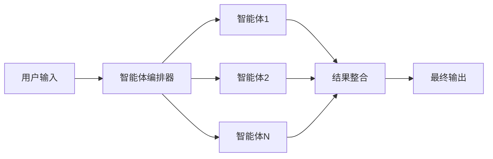
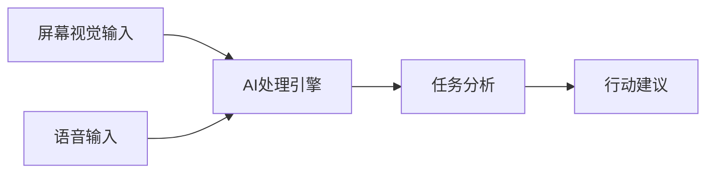
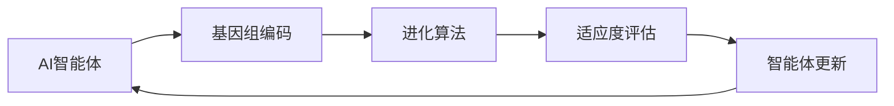
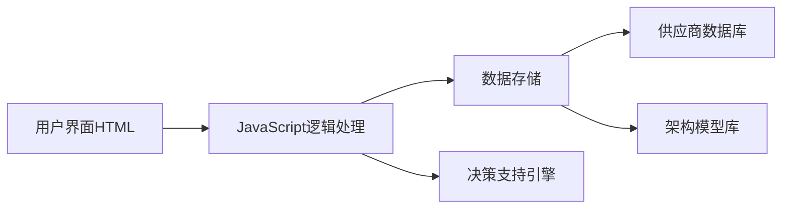
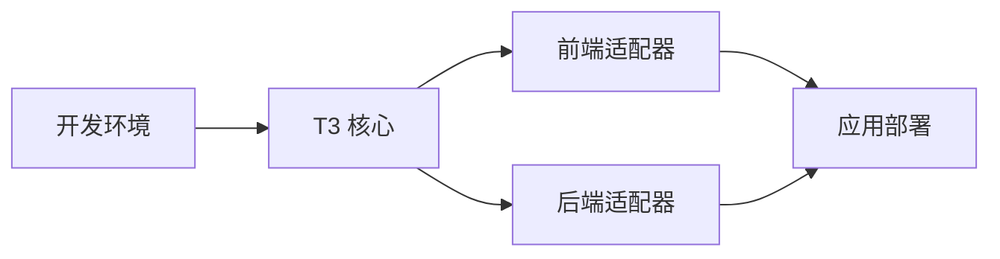

## 今日热点

今日GitHub热榜聚焦AI代理框架与数据隐私两大趋势，OpenAI多代理框架与Thunderbird自主AI项目引领潮流，同时企业级AI应用和隐私保护技术获得高度关注。

---

## 热门项目一览

| 排名 | 项目 | 语言 | 今日 | 总计 | 简介 |
|:---:|------|:----:|------:|-----:|------|
| 1 | [Fincept-Corporation/FinceptTerminal](https://github.com/Fincept-Corporation/FinceptTerminal) | Python | +1,254 | 6,721 | FinceptTerminal is a modern... |
| 2 | [openai/openai-agents-python](https://github.com/openai/openai-agents-python) | Python | +752 | 23,230 | A lightweight, powerful fra... |
| 3 | [Donchitos/Claude-Code-Game-Studios](https://github.com/Donchitos/Claude-Code-Game-Studios) | Shell | +704 | 13,536 | Turn Claude Code into a ful... |
| 4 | [thunderbird/thunderbolt](https://github.com/thunderbird/thunderbolt) | TypeScript | +695 | 2,258 | AI You Control: Choose your... |
| 5 | [BasedHardware/omi](https://github.com/BasedHardware/omi) | Dart | +685 | 11,207 | AI that sees your screen, l... |
| 6 | [EvoMap/evolver](https://github.com/EvoMap/evolver) | JavaScript | +527 | 5,566 | The GEP-Powered Self-Evolut... |
| 7 | [paperless-ngx/paperless-ngx](https://github.com/paperless-ngx/paperless-ngx) | Python | +393 | 38,904 | A community-supported super... |
| 8 | [tractorjuice/arc-kit](https://github.com/tractorjuice/arc-kit) | HTML | +263 | 1,024 | Enterprise Architecture Gov... |
| 9 | [ruvnet/RuView](https://github.com/ruvnet/RuView) | Rust | +149 | 47,535 | π RuView: WiFi DensePose tu... |
| 10 | [pingdotgg/t3code](https://github.com/pingdotgg/t3code) | TypeScript | +109 | 9,907 | No description |

---

## 趋势洞察

```
┌─────────────────────────────────────────────────────────────────┐
│  AI/ML 工具         ████████████████████████  5 个项目        │
│  开发工具             █████████                 2 个项目        │
│  多媒体应用            ████                      1 个项目        │
│  项目管理             ████                      1 个项目        │
│  其他               ████                      1 个项目        │
└─────────────────────────────────────────────────────────────────┘
```

---

## 项目深度解读

### 1. Fincept-Corporation/FinceptTerminal — 金融分析终端

> **一句话总结**：一站式金融数据分析终端，提供高级市场分析、投资研究和经济数据工具。

#### 价值主张

| 维度 | 说明 |
|------|------|
| **解决痛点** | 金融数据分散、分析工具复杂、缺乏统一决策平台 |
| **目标用户** | 金融分析师、投资经理、研究人员和经济学者 |
| **核心亮点** | 交互式界面 + 多维度市场数据 + 实时分析能力 + 可视化展示 |

#### 技术架构

基于Python金融应用的常见架构推测：

**技术特色**：
- 基于Python生态系统，利用pandas、numpy等科学计算库
- 采用模块化设计，支持多种金融数据源接入
- 提供交互式探索界面，可能基于Jupyter或类似技术
- 内置安全机制，保障金融数据隐私和处理安全

#### 热度分析

- 项目获得6,721个Star，近期增长迅速，今日增加1,254个Star，显示市场高度关注
- 1,032个Fork表明开发者社区积极参与，项目具有较高实用价值

#### 快速上手

```bash
# 克隆项目
git clone https://github.com/Fincept-Corporation/FinceptTerminal.git

# 安装依赖
pip install -r requirements.txt

# 运行应用
python main.py
```

#### 注意事项

- 项目许可证信息未知，使用前需确认开源协议
- 由于Open Issues为0，可能存在反馈渠道不明确的问题
- 金融数据涉及敏感信息，使用时需注意数据安全和隐私保护


### 2. openai/openai-agents-python — [多智能体框架]

> **一句话总结**：轻量级多智能体协作框架，简化复杂AI工作流程构建。

#### 价值主张

| 维度 | 说明 |
|------|------|
| **解决痛点** | 多智能体系统开发复杂度高，缺乏统一框架整合不同AI能力 |
| **目标用户** | AI应用开发者、研究人员和企业构建复杂AI系统的团队 |
| **核心亮点** | 模块化设计 + 易于扩展 + 异步处理 + 插件机制 + 与OpenAI API深度集成 |

#### 技术架构



**技术特色**：
- 基于事件驱动的智能体通信机制
- 支持智能体间的异步协作与并行处理
- 提供智能体生命周期管理工具

#### 热度分析

- 项目在短时间内获得大量关注，表明多智能体系统是当前AI领域的热点方向
- 作为OpenAI官方项目，在AI生态中具有战略地位，吸引大量开发者关注

#### 快速上手

```bash
# 安装框架
pip install openai-agents

# 创建第一个多智能体系统
python -m openai_agents create my_agent_system

# 启动智能体
python -m openai_agents run my_agent_system
```

#### 注意事项

- 需要OpenAI API密钥才能使用
- 智能体间通信需要明确定义接口协议
- 资源消耗可能随智能体数量增加而线性增长


### 3. Donchitos/Claude-Code-Game-Studios — [AI游戏工作室]

> **一句话总结**：基于Claude的AI协作游戏开发系统，模拟真实工作室层级与工作流程。

#### 价值主张

| 维度 | 说明 |
|------|------|
| **解决痛点** | 降低游戏开发门槛，通过AI协作实现高效游戏开发全流程 |
| **目标用户** | 独立游戏开发者、小型游戏团队、AI应用探索者 |
| **核心亮点** | 49个AI角色分工 + 72项工作流程技能 + 完整工作室层级结构 |

#### 技术架构


**技术特色**：
- 基于Claude API的智能角色分工系统
- 模拟真实游戏工作室的层级协作机制
- Shell脚本实现跨平台兼容性

#### 热度分析

- 项目近期热度激增，单日增长704 stars，表明AI游戏开发领域关注度快速提升
- 高star与fork比例，说明项目实用性强，开发者社区认可度高

#### 快速上手

```bash
# 克隆项目
git clone https://github.com/Donchitos/Claude-Code-Game-Studios.git

# 进入项目目录
cd Claude-Code-Game-Studios

# 运行初始化脚本
./setup.sh
```

#### 注意事项

- 需要Claude API访问权限才能完整使用所有功能
- 项目依赖Shell环境，确保系统兼容性
- 49个AI角色分工可能需要一定学习成本


### 4. thunderbird/thunderbolt — AI自主平台

> **一句话总结**：用户完全掌控的AI系统，支持自定义模型与数据，消除供应商锁定风险。

#### 价值主张

| 维度 | 说明 |
|------|------|
| **解决痛点** | 解决AI模型依赖与数据隐私问题，实现用户对AI的完全控制 |
| **目标用户** | 注重数据隐私的企业开发者和AI研究人员 |
| **核心亮点** | 自定义模型支持 + 本地数据存储 + 开放API接口 + 无供应商锁定 |

#### 技术架构


**技术特色**：
- 基于TypeScript构建，确保类型安全与代码质量
- 支持多种AI模型的无缝集成与切换机制
- 提供本地化部署选项，保障数据安全与隐私

#### 热度分析

- 项目近期热度激增，单日增长近700星，表明社区对其AI自主理念高度认可
- 虽然项目较新但已获得稳定关注，有望成为AI自主化领域的重要参考

#### 快速上手

```bash
# 克隆项目
git clone https://github.com/thunderbird/thunderbolt.git

# 安装依赖
cd thunderbolt && npm install

# 启动服务
npm start
```

#### 注意事项

- 项目尚处于早期阶段，API可能不稳定，建议关注更新
- 需要一定的AI和机器学习基础知识才能充分利用项目功能
- 许可证信息不明确，使用前需确认开源协议和商业使用条款


### 5. BasedHardware/omi — 智能助手

> **一句话总结**：结合视觉与听觉感知的AI助手，提供实时任务指导与决策建议

#### 价值主张

| 维度 | 说明 |
|------|------|
| **解决痛点** | 解决信息过载和决策困难问题，提供实时智能指导 |
| **目标用户** | 需要实时决策支持和任务指导的专业人士 |
| **核心亮点** | 屏幕视觉识别 + 语音交互 + 实时任务建议 + 上下文理解 |

#### 技术架构



**技术特色**：
- 多模态感知融合视觉与听觉信息处理
- 实时上下文理解与任务分析能力
- 轻量级Dart实现跨平台兼容性

#### 热度分析

- 项目近期增长显著，Stars数量快速上升，显示社区高度关注
- 作为个人AI助手领域的新兴项目，具有差异化竞争优势

#### 快速上手

```bash
# 安装omi
pub global activate omi

# 启动AI助手
omi --listen

# 配置权限
omi config --enable-screen --enable-mic
```

#### 注意事项

- 需要谨慎处理用户隐私数据，特别是屏幕内容和语音信息
- 项目可能需要较高的计算资源支持AI模型运行
- 许可证信息不明确，建议在使用前确认开源协议


### 6. EvoMap/evolver — AI进化引擎

> **一句话总结**：基于基因组进化协议的自进化引擎，使AI智能体能够持续优化自身能力。

#### 价值主张

| 维度 | 说明 |
|------|------|
| **解决痛点** | AI智能体缺乏自适应进化能力，难以应对复杂环境变化 |
| **目标用户** | AI研究人员、智能体开发者、进化算法工程师 |
| **核心亮点** | GEP驱动 + 自进化机制 + 能力持续优化 + 生态集成 |

#### 技术架构



**技术特色**：
- 基因组进化协议(GEP)实现智能体进化
- JavaScript实现跨平台兼容性
- 自适应进化算法优化AI能力

#### 热度分析

- 项目近期Star增长迅速(+527 today)，显示社区高度关注
- Fork/Star比例约为10%，表明项目有较好的可复制性和实用性

#### 快速上手

```bash
# 克隆仓库
git clone https://github.com/EvoMap/evolver.git

# 安装依赖
npm install

# 运行示例
npm run example
```

#### 注意事项

- 项目许可证未知，使用前需确认
- 项目文档可能不够完善
- 作为AI进化引擎，可能需要较高的计算资源


### 7. paperless-ngx/paperless-ngx — 智能文档管理系统

> **一句话总结**：一款开源文档管理系统，可扫描、索引和归档各类文档，实现文档数字化管理。

#### 价值主张

| 维度 | 说明 |
|------|------|
| **解决痛点** | 解决纸质文档管理混乱、查找困难、存储空间占用大等问题 |
| **目标用户** | 需要管理大量文档的个人、家庭、小型企业和专业人士 |
| **核心亮点** | + 自动OCR识别文档内容 + 智能标签分类和全文搜索 + 支持多种文档格式导入 |

#### 技术架构


**技术特色**：
- 基于Python和Django框架构建，提供RESTful API
- 集成OCR技术自动识别文档内容，支持多种语言
- 支持全文搜索引擎，内置Elasticsearch集成选项

#### 热度分析

- 项目Star数高达38,904，近期增长迅速(+393 today)，表明项目活跃度高
- 作为文档管理系统，在数字化转型浪潮中具有重要生态位置，解决实际痛点需求

#### 快速上手

```bash
# 克隆项目
git clone https://github.com/paperless-ngx/paperless-ngx.git

# 安装依赖
cd paperless-ngx
pip install -r requirements.txt
```

#### 注意事项

- 需要配置OCR引擎(如Tesseract)以实现文档内容识别
- 大量文档处理可能需要较强的计算资源
- 生产环境部署需要考虑数据库配置和性能优化


### 8. tractorjuice/arc-kit — 企业架构工具

> **一句话总结**：企业架构治理与供应商采购的一站式HTML工具包，简化架构决策流程。

#### 价值主张

| 维度 | 说明 |
|------|------|
| **解决痛点** | 企业架构治理流程复杂、供应商评估困难 |
| **目标用户** | 企业架构师、IT采购决策者、技术管理者 |
| **核心亮点** | 可视化架构管理 + 供应商评估框架 + 决策支持工具 + 合规性检查 + 最佳实践库 |

#### 技术架构



**技术特色**：
- 纯前端HTML实现，部署简单
- 响应式设计，支持多设备访问
- 模块化组件架构，易于扩展
- 本地存储架构数据，无需后端支持

#### 热度分析

- 项目近期增长迅速，单日增加263个Star，表明市场需求强烈
- 虽然Fork数量相对较少，但零Open Issues显示项目维护良好

#### 快速上手

```bash
# 克隆项目到本地
git clone https://github.com/tractorjuice/arc-kit.git

# 使用本地服务器打开
cd arc-kit
python -m http.server 8000
# 然后访问 http://localhost:8000
```

#### 注意事项

- 项目许可证未知，商业使用前需确认授权条款
- 纯前端实现，敏感数据不建议存储在本地
- 项目依赖可能需要现代浏览器支持


### 9. ruvnet/RuView — WiFi感知技术

> **一句话总结**：利用普通WiFi信号实现无摄像头的人体姿态估计、生命体征监测和存在检测

#### 价值主张

| 维度 | 说明 |
|------|------|
| **解决痛点** | 解决隐私保护需求下的无视觉人体感知问题 |
| **目标用户** | 隐私敏感场景应用开发者、智能家居系统构建者 |
| **核心亮点** | 无摄像头依赖 + 实时姿态估计 + 生命体征监测 + 存在检测 + 隐私保护 |

#### 技术架构


**技术特色**：
- 利用商用WiFi硬件实现非视觉人体感知
- 通过信号变化分析人体动作和生理特征
- 基于Rust语言实现高性能信号处理

#### 热度分析

- 项目Star数超47.5K，日均增长约150个，热度持续攀升
- Fork数超6.3K，社区活跃度高，开发者参与度强

#### 快速上手

```bash
# 克隆项目
git clone https://github.com/ruvnet/RuView.git

# 构建项目
cd RuView && cargo build --release
```

#### 注意事项

- 需要支持信号强度监测的WiFi硬件
- 环境中的WiFi干扰可能影响精度
- 系统校准对准确性至关重要
- 仅适用于非金属障碍物环境


### 10. pingdotgg/t3code — 开发框架

> **一句话总结**：基于 TypeScript 的全栈开发框架，提供类型安全与高效开发体验。

#### 价值主张

| 维度 | 说明 |
|------|------|
| **解决痛点** | 简化全栈应用开发，解决类型不一致问题 |
| **目标用户** | TypeScript 开发者，全栈应用构建者 |
| **核心亮点** | 零配置 + 类型安全 + 内置工具链 |

#### 技术架构



**技术特色**：
- 采用 TypeScript 作为第一语言，提供端到端类型安全
- 模块化架构设计，支持多种前端和后端技术栈
- 内置开发工具链，减少配置复杂性

#### 热度分析

- 近一个月新增 109 个 Star，增长速度稳定，社区认可度高
- 高 Star 与 Fork 比例表明项目具有实用价值，开发者愿意参与贡献

#### 快速上手

```bash
# 创建新项目
npx create-t3-app@latest my-app

# 进入项目目录
cd my-app

# 启动开发服务器
npm run dev
```

#### 注意事项
- 项目文档仍在完善中，部分高级功能可能需要参考源码
- 生产环境部署前建议充分测试，确保框架稳定性


## 今日推荐

| 主题 | 推荐项目 | 亮点 |
|------|----------|------|
| 今日最热 | [Fincept-Corporation/FinceptTerminal](https://github.com/Fincept-Corporation/FinceptTerminal) | FinceptTerminal i... |
| 值得关注 | [openai/openai-agents-python](https://github.com/openai/openai-agents-python) | A lightweight, po... |
| 快速上手 | [Donchitos/Claude-Code-Game-Studios](https://github.com/Donchitos/Claude-Code-Game-Studios) | Turn Claude Code ... |
| 长期潜力 | [thunderbird/thunderbolt](https://github.com/thunderbird/thunderbolt) | AI You Control: C... |

---

<div align="center">

*Generated on 2026-04-20 | Powered by GitHub Trending Reporter*

</div>