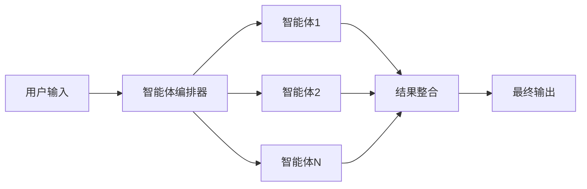
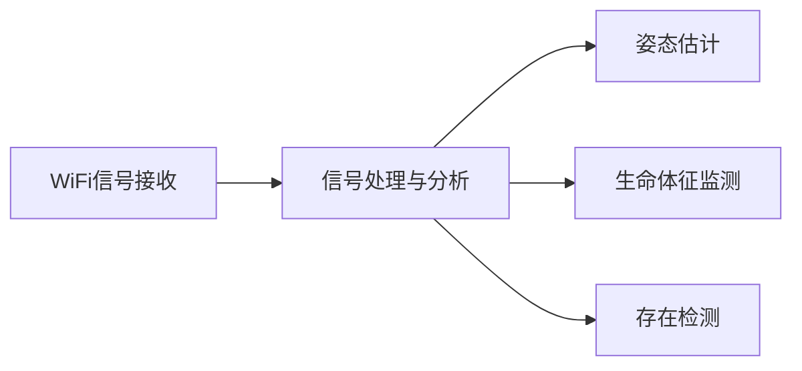
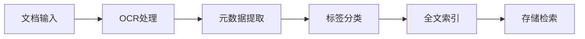
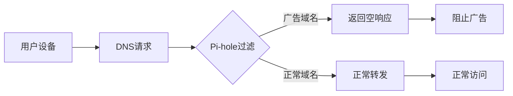

## 今日热点

今日GitHub热榜显示AI与多代理系统、非视觉感知技术成为焦点，OpenAI多代理框架和WiFi人体姿态估计项目获得快速增长，反映AI应用向边缘计算和隐私保护方向发展。

---

## 热门项目一览

| 排名 | 项目 | 语言 | 今日 | 总计 | 简介 |
|:---:|------|:----:|------:|-----:|------|
| 1 | [Fincept-Corporation/FinceptTerminal](https://github.com/Fincept-Corporation/FinceptTerminal) | Python | +3,109 | 9,645 | FinceptTerminal is a modern... |
| 2 | [openai/openai-agents-python](https://github.com/openai/openai-agents-python) | Python | +905 | 23,963 | A lightweight, powerful fra... |
| 3 | [ruvnet/RuView](https://github.com/ruvnet/RuView) | Rust | +713 | 48,238 | π RuView: WiFi DensePose tu... |
| 4 | [thunderbird/thunderbolt](https://github.com/thunderbird/thunderbolt) | TypeScript | +675 | 2,842 | AI You Control: Choose your... |
| 5 | [paperless-ngx/paperless-ngx](https://github.com/paperless-ngx/paperless-ngx) | Python | +606 | 39,444 | A community-supported super... |
| 6 | [tractorjuice/arc-kit](https://github.com/tractorjuice/arc-kit) | HTML | +329 | 1,356 | Enterprise Architecture Gov... |
| 7 | [koala73/worldmonitor](https://github.com/koala73/worldmonitor) | TypeScript | +316 | 50,168 | Real-time global intelligen... |
| 8 | [pi-hole/pi-hole](https://github.com/pi-hole/pi-hole) | Shell | +196 | 57,202 | A black hole for Internet a... |
| 9 | [deepseek-ai/DeepGEMM](https://github.com/deepseek-ai/DeepGEMM) | Cuda | +109 | 6,838 | DeepGEMM: clean and efficie... |
| 10 | [XTLS/Xray-core](https://github.com/XTLS/Xray-core) | Go | +78 | 37,470 | Xray, Penetrates Everything... |

---

## 趋势洞察

```
┌─────────────────────────────────────────────────────────────────┐
│  AI/ML 工具         ████████████████████████  4 个项目        │
│  开发工具             ████████████              2 个项目        │
│  其他               ████████████              2 个项目        │
│  多媒体应用            ██████                    1 个项目        │
│  项目管理             ██████                    1 个项目        │
└─────────────────────────────────────────────────────────────────┘
```

---

## 项目深度解读

### 1. Fincept-Corporation/FinceptTerminal — 金融数据分析终端

> **一句话总结**：一站式金融数据分析与决策支持平台，提供市场分析与经济数据工具

#### 价值主张

| 维度 | 说明 |
|------|------|
| **解决痛点** | 金融数据分散、分析工具复杂、决策依据不直观的问题 |
| **目标用户** | 金融分析师、投资经理、经济研究员等金融专业人士 |
| **核心亮点** | 高级市场分析功能 + 交互式数据探索 + 用户友好界面 + 数据驱动决策支持 |

#### 技术架构


**技术特色**：
- 基于Python的数据科学栈实现
- 多源金融数据整合与分析能力
- 交互式可视化与用户界面设计

#### 热度分析

- 项目Star数达9,645，单日增长3,109，表明近期受到金融科技领域高度关注
- 在量化金融与开源金融工具生态中占据重要位置，影响力持续扩大

#### 快速上手

```bash
# 克隆项目
git clone https://github.com/Fincept-Corporation/FinceptTerminal.git

# 安装依赖
pip install -r requirements.txt

# 启动应用
python app.py
```

#### 注意事项

- 项目许可证信息未知，使用前需确认授权条款
- 作为金融工具，数据准确性和安全性需要特别关注
- 可能需要金融数据API密钥才能使用完整功能


### 2. openai/openai-agents-python — 多智能体框架

> **一句话总结**：轻量级强大框架，实现多AI智能体协同工作流，简化复杂任务协作。

#### 价值主张

| 维度 | 说明 |
|------|------|
| **解决痛点** | 多智能体系统开发复杂，缺乏统一框架协调AI智能体间协作 |
| **目标用户** | AI开发者、研究人员和企业构建复杂AI应用工作流 |
| **核心亮点** | 轻量级设计 + 高性能扩展 + 模块化架构 + OpenAI深度集成 |

#### 技术架构



**技术特色**：
- 基于OpenAI API构建的智能体框架
- 支持多智能体协同工作流
- 轻量级设计，易于集成和使用

#### 热度分析

- 项目Star数近24k，单日增长900+，显示项目处于高速增长期
- Fork数近3.7k，社区活跃度高，开发者参与度强

#### 快速上手

```bash
# 安装
pip install openai-agents

# 基本使用
from openai_agents import Agent, Workflow

# 创建智能体
researcher = Agent("researcher", model="gpt-4")
writer = Agent("writer", model="gpt-3.5-turbo")

# 创建工作流
workflow = Workflow([researcher, writer])
result = workflow.run("分析人工智能最新趋势")
```

#### 注意事项

- 需要OpenAI API密钥才能使用
- 可能需要根据具体任务调整智能体的提示词和参数
- 多智能体交互可能导致成本增加，需注意API调用费用


### 3. ruvnet/RuView — [WiFi感知技术]

> **一句话总结**：RuView将普通WiFi信号转化为实时人体姿态和生命体征监测，无需摄像头即可实现非接触式感知。

#### 价值主张

| 维度 | 说明 |
|------|------|
| **解决痛点** | 解决传统监测设备侵犯隐私和使用不便问题 |
| **目标用户** | 智能家居开发者、健康监测应用开发者、隐私敏感型用户 |
| **核心亮点** | 无摄像头姿态估计 + 实时生命体征监测 + 现有WiFi设备利用 + 高隐私保护 + 非接触式感知 |

#### 技术架构



**技术特色**：
- 利用商用WiFi设备进行人体感知
- 通过无线信号变化分析人体动作和生命体征
- 基于Rust语言实现高性能信号处理
- 无需专用硬件，降低部署成本
- 实时处理能力，支持低延迟应用

#### 热度分析

- 项目Star数超4.8万，近期每日增长700+，显示出极高的关注度和技术创新性
- 作为非接触式感知技术，在隐私保护需求日益增长的背景下，具有广阔应用前景

#### 快速上手

```bash
git clone https://github.com/ruvnet/RuView.git
cd RuView
cargo run --example pose_estimation
```

#### 注意事项

- 需要特定的WiFi硬件支持信号监听功能
- 精度可能受环境因素和WiFi布局影响
- 可能涉及隐私法规问题，需确保合规使用
- 需要一定的信号处理和机器学习知识才能有效使用


### 4. thunderbird/thunderbolt — AI自主平台

> **一句话总结**：用户完全掌控的AI框架，支持多模型选择，数据本地化，消除供应商锁定。

#### 价值主张

| 维度 | 说明 |
|------|------|
| **解决痛点** | 解决AI服务数据隐私和供应商锁定问题 |
| **目标用户** | 注重数据隐私的AI开发者和企业用户 |
| **核心亮点** | 自主模型选择 + 数据完全控制 + 开源开放 + 跨平台兼容 |

#### 技术架构


**技术特色**：
- 支持多种AI模型接入和切换机制
- 本地数据处理保障隐私安全
- 模块化设计便于扩展和定制

#### 热度分析

- 项目近期热度大幅增长，单日Star增长超过600，显示社区高度关注
- 作为Thunderbird生态新项目，有望成为开源AI领域的重要力量

#### 快速上手

```bash
# 克隆项目
git clone https://github.com/thunderbird/thunderbolt.git
# 安装依赖
npm install
# 启动服务
npm start
```

#### 注意事项

- 项目尚处于早期阶段，API可能不稳定
- 需要自行配置AI模型，可能有一定的技术门槛
- 数据完全本地化，可能需要较多存储空间


### 5. paperless-ngx/paperless-ngx — 智能文档管理系统

> **一句话总结**：功能强大的文档管理系统，支持扫描、索引和智能归档各类文档。

#### 价值主张

| 维度 | 说明 |
|------|------|
| **解决痛点** | 解决纸质文档管理混乱、查找困难、存储空间占用大等问题 |
| **目标用户** | 需要大量文档管理的个人、家庭、小型企业及组织机构 |
| **核心亮点** | OCR文字识别 + 智能标签分类 + 全文检索 + 云端存储 + 多设备同步 |

#### 技术架构



**技术特色**：
- 基于Python Django框架构建，提供RESTful API
- 集成OCR技术自动提取文档文字内容
- 支持多种文档格式并自动转换为统一格式
- 提供Web界面和API接口，支持多种客户端访问

#### 热度分析

- 项目Star数近4万，日增600+，处于文档管理类项目热度前列
- 活跃的社区贡献和持续的功能迭代，表明项目生态健康稳定

#### 快速上手

```bash
# 克隆项目
git clone https://github.com/paperless-ngx/paperless-ngx.git

# 安装依赖
cd paperless-ngx
pip install -r requirements.txt

# 运行开发服务器
python manage.py runserver
```

#### 注意事项

- 需要配置OCR引擎(Tesseract)以实现文档文字识别功能
- 大量文档处理可能需要较强的计算资源，建议在生产环境中使用Docker部署
- 文档存储需要考虑备份策略，防止数据丢失


### 6. tractorjuice/arc-kit — 企业架构工具包

> **一句话总结**：提供企业架构治理和供应商采购全流程管理工具，帮助企业实现标准化采购决策。

#### 价值主张

| 维度 | 说明 |
|------|------|
| **解决痛点** | 企业缺乏标准化架构治理和供应商评估体系，采购决策风险高 |
| **目标用户** | 企业架构师、IT采购决策者、供应商管理团队 |
| **核心亮点** | 架构评估框架 + 供应商筛选工具 + 风险评估模型 + 合规性检查 |

#### 技术架构


**技术特色**：
- 响应式Web界面，支持多设备访问
- 模块化设计，便于定制和扩展
- 基于标准化评估框架，确保决策一致性

#### 热度分析

- 项目近期获得大量Star（329新增），表明社区认可度高，需求旺盛
- Fork数量相对较少，可能表明项目主要用于直接使用而非二次开发

#### 快速上手

```bash
# 克隆项目
git clone https://github.com/tractorjuice/arc-kit.git

# 进入项目目录
cd arc-kit

# 启动本地服务器
python -m http.server 8000
```

#### 注意事项

- 项目没有明确的开源许可证，使用前需确认授权条款
- 可能需要额外的后端服务来支持完整功能
- 文档可能不够完善，需要自行探索项目结构


### 7. koala73/worldmonitor — 全球智能监控

> **一句话总结**：AI驱动的全球实时情报仪表板，整合新闻、地缘政治与基础设施监控，提供统一态势感知界面

#### 价值主张

| 维度 | 说明 |
|------|------|
| **解决痛点** | 信息过载与情报分散，难以获取全局视野 |
| **目标用户** | 情报分析师、政策制定者、企业战略决策者 |
| **核心亮点** | AI实时分析 + 多源数据整合 + 可视化仪表板 + 全球监测能力 |

#### 技术架构


**技术特色**：
- 基于TypeScript构建，确保类型安全与代码质量
- 多源数据整合能力，支持API、RSS、爬虫等多种数据源
- 实时数据处理架构，可能采用流处理技术

#### 热度分析

- 项目获5万+ Star，日增300+，增长势头强劲，表明市场需求旺盛
- 虽无公开Issues，但高Fork数反映社区活跃度高，用户积极参与定制开发

#### 快速上手

```bash
# 克隆仓库
git clone https://github.com/koala73/worldmonitor.git
# 安装依赖
npm install
# 启动开发环境
npm run dev
```

#### 注意事项

- 项目依赖多种外部API服务，需配置相应密钥和数据源权限
- 实时数据处理可能需要较高系统资源，建议在性能充足的环境中运行
- 许可证信息不明确，商业使用前需确认授权条款


### 8. pi-hole/pi-hole — 网络广告拦截系统

> **一句话总结**：Pi-hole 是在网络层拦截广告的开源工具，通过 DNS 过滤实现全设备广告屏蔽。

#### 价值主张

| 维度 | 说明 |
|------|------|
| **解决痛点** | 解决全网络设备广告拦截问题，无需每台设备单独安装广告拦截插件 |
| **目标用户** | 注重隐私保护的家庭用户、网络管理员和小型企业 |
| **核心亮点** | 网络级拦截 + DNS 层过滤 + 无客户端部署 + 自定义黑名单 + 详细统计 |

#### 技术架构



**技术特色**：
- 基于 dnsmasq 的 DNS 过滤技术实现高效拦截
- 维护持续更新的广告域名黑名单并支持自定义规则
- 提供详细的访问统计和分析功能，便于监控网络流量

#### 热度分析
- 项目拥有超57k星标且持续稳定增长，表明其在网络广告拦截领域具有广泛认可
- 零开放问题反映项目维护良好，社区贡献者及时响应并解决潜在问题

#### 快速上手

```bash
# 安装 Pi-hole
curl -sSL https://install.pi-hole.net | bash

# 选择网络接口和 DNS 服务器，完成后将路由器 DNS 设置为 Pi-hole IP
```

#### 注意事项
- 需要一台始终运行的设备作为服务器(如树莓派或专用服务器)
- 可能会误拦截某些正常网站，需要定期更新白名单
- 对于 HTTPS 流量，效果有限，因为无法直接检查内容


### 9. deepseek-ai/DeepGEMM — FP8矩阵优化

> **一句话总结**：专注FP8精度的GEMM高性能CUDA实现，提供细粒度缩放能力。

#### 价值主张

| 维度 | 说明 |
|------|------|
| **解决痛点** | 解决FP8矩阵运算效率低、精度控制不灵活的问题 |
| **目标用户** | 高性能计算开发者、深度学习研究人员、GPU优化工程师 |
| **核心亮点** | FP8精度支持 + 细粒度缩放 + 高效CUDA实现 + 模块化设计 |

#### 技术架构


**技术特色**：
- 针对FP8数据类型优化的矩阵乘法内核
- 支持动态缩放因子调整平衡精度与性能
- 基于CUDA的高效并行实现
- 模块化设计便于扩展和优化

#### 热度分析

- 项目Star数近7000且持续增长，显示FP8优化在AI计算领域受高度关注
- Fork数较高，表明社区参与度和二次开发意愿强烈

#### 快速上手

```bash
git clone https://github.com/deepseek-ai/DeepGEMM.git
cd DeepGEMM
make && ./example
```

#### 注意事项

- 项目需要CUDA环境支持，建议CUDA 11.0以上版本
- FP8精度可能不适合所有应用场景，需根据精度需求谨慎选择
- 项目许可证信息不明确，使用前需确认授权条款


### 10. XTLS/Xray-core — 全能网络代理

> **一句话总结**：高性能网络代理平台，支持多种协议和穿透技术，提供安全稳定的网络连接服务。

#### 价值主张

| 维度 | 说明 |
|------|------|
| **解决痛点** | 突破网络限制，解决复杂环境下的连接穿透难题 |
| **目标用户** | 需要网络隐私保护和突破访问限制的个人与企业用户 |
| **核心亮点** | XTLS协议支持 + 多协议兼容 + 高性能传输 + 灵活配置 |

#### 技术架构


**技术特色**：
- 基于Go语言实现，跨平台性能优异
- 支持XTLS等先进加密协议，提升安全性
- 提供丰富的协议支持和插件系统，扩展性强

#### 热度分析

- 项目Star数超过3.7万且持续增长，表明其受欢迎程度和社区活跃度高
- Fork数超过5千，说明有大量开发者和用户在参与和贡献项目

#### 快速上手

```bash
# 下载对应平台的二进制文件
wget https://github.com/XTLS/Xray-core/releases/latest/download/Xray-linux-64.zip
# 解压并运行
unzip Xray-linux-64.zip && ./xray run -config config.json
```

#### 注意事项

- 使用网络代理工具需遵守当地法律法规
- 配置不当可能导致网络连接问题
- 定期更新以获取最新功能和安全性修复


## 今日推荐

| 主题 | 推荐项目 | 亮点 |
|------|----------|------|
| 今日最热 | [Fincept-Corporation/FinceptTerminal](https://github.com/Fincept-Corporation/FinceptTerminal) | FinceptTerminal i... |
| 值得关注 | [openai/openai-agents-python](https://github.com/openai/openai-agents-python) | A lightweight, po... |
| 快速上手 | [ruvnet/RuView](https://github.com/ruvnet/RuView) | π RuView: WiFi De... |
| 长期潜力 | [thunderbird/thunderbolt](https://github.com/thunderbird/thunderbolt) | AI You Control: C... |

---

<div align="center">

*Generated on 2026-04-21 | Powered by GitHub Trending Reporter*

</div>