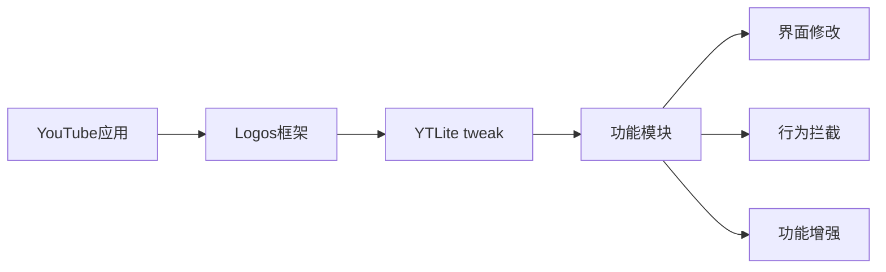

## 今日热点

AI代理与

---

## 热门项目一览

| 排名 | 项目 | 语言 | 今日 | 总计 | 简介 |
|:---:|------|:----:|------:|-----:|------|
| 1 | [Fincept-Corporation/FinceptTerminal](https://github.com/Fincept-Corporation/FinceptTerminal) | Python | +2,548 | 11,681 | FinceptTerminal is a modern... |
| 2 | [ruvnet/RuView](https://github.com/ruvnet/RuView) | Rust | +824 | 48,914 | π RuView: WiFi DensePose tu... |
| 3 | [thunderbird/thunderbolt](https://github.com/thunderbird/thunderbolt) | TypeScript | +596 | 3,491 | AI You Control: Choose your... |
| 4 | [sansan0/TrendRadar](https://github.com/sansan0/TrendRadar) | Python | +534 | 53,687 | ⭐AI-driven public opinion &... |
| 5 | [microsoft/ai-agents-for-beginners](https://github.com/microsoft/ai-agents-for-beginners) | Jupyter Notebook | +200 | 57,749 | 12 Lessons to Get Started B... |
| 6 | [zilliztech/claude-context](https://github.com/zilliztech/claude-context) | TypeScript | +169 | 6,640 | Code search MCP for Claude ... |
| 7 | [HKUDS/RAG-Anything](https://github.com/HKUDS/RAG-Anything) | Python | +162 | 16,922 | "RAG-Anything: All-in-One R... |
| 8 | [VoltAgent/awesome-agent-skills](https://github.com/VoltAgent/awesome-agent-skills) | Unknown | +139 | 16,759 | A curated collection of 100... |
| 9 | [dayanch96/YTLite](https://github.com/dayanch96/YTLite) | Logos | +55 | 4,844 | A flexible enhancer for You... |

---

## 趋势洞察

```
┌─────────────────────────────────────────────────────────────────┐
│  AI/ML 工具         ████████████████████████  5 个项目        │
│  开发框架             ████                      1 个项目        │
│  多媒体应用            ████                      1 个项目        │
│  开发工具             ████                      1 个项目        │
│  其他               ████                      1 个项目        │
└─────────────────────────────────────────────────────────────────┘
```

---

## 项目深度解读

### 1. Fincept-Corporation/FinceptTerminal — [现代金融终端]

> **一句话总结**：集成市场分析、投资研究与经济数据的现代金融应用，提供交互式探索与数据驱动决策支持。

#### 价值主张

| 维度 | 说明 |
|------|------|
| **解决痛点** | 金融数据分散、分析工具复杂、决策依据不足 |
| **目标用户** | 金融分析师、投资者、研究人员、经济学者 |
| **核心亮点** | 交互式数据探索 + 先进市场分析工具 + 经济数据整合 + 用户友好界面 + 数据驱动决策支持 |

#### 技术架构


**技术特色**：
- 基于Python构建，利用其强大的数据分析生态系统
- 采用模块化设计，支持多种金融数据源的集成
- 提供直观的API接口，便于扩展和定制

#### 热度分析

- 项目获得11,681颗星星且单日增长2,548，表明金融科技领域需求旺盛
- Fork数量适中，反映项目有一定社区参与度和二次开发需求

#### 快速上手

```bash
# 克隆项目
git clone https://github.com/Fincept-Corporation/FinceptTerminal.git
cd FinceptTerminal

# 安装依赖
pip install -r requirements.txt

# 启动应用
python fincept_terminal.py
```

#### 注意事项

- 项目许可证未知，商业使用前需确认授权条款
- 作为金融分析工具，数据安全性和隐私保护需特别关注
- 项目无开放问题，可能表明维护活跃或问题反馈渠道不明确


### 2. ruvnet/RuView — WiFi姿态感知

> **一句话总结**：利用普通WiFi信号实现无摄像头的人体姿态、生命体征和存在检测。

#### 价值主张

| 维度 | 说明 |
|------|------|
| **解决痛点** | 解决隐私敏感场景下无摄像头人体活动监测需求 |
| **目标用户** | 隐私敏感场所、智能家居、健康监护系统开发商 |
| **核心亮点** | 无视觉依赖 + 实时监测 + 低成本硬件 + 隐私保护 |

#### 技术架构


**技术特色**：
- 利用WiFi信号的相位和幅度变化感知人体活动
- 采用深度学习从无线信号中提取人体特征
- 实现非视觉环境下高精度姿态估计与生命体征监测

#### 热度分析

- 项目获近5万星，单日增长800+，表明技术方向备受关注
- 无开放问题，项目成熟度高，已形成完整的技术解决方案

#### 快速上手

```bash
# 安装依赖
cargo install --git https://github.com/ruvnet/RuView

# 运行示例
RuView --input wlan0 --output pose_data.csv

# 实时监测模式
RuView --live --device wlan0
```

#### 注意事项

- 需要特定的WiFi硬件支持才能获得最佳效果
- 环境中的WiFi干扰可能影响检测精度
- 需要大量数据训练模型以提高检测准确性
- 隐私政策需明确，避免数据滥用


### 3. thunderbird/thunderbolt — 自控AI平台

> **一句话总结**：用户完全掌控的AI框架，支持多模型选择，保障数据所有权，消除供应商锁定。

#### 价值主张

| 维度 | 说明 |
|------|------|
| **解决痛点** | 解决AI服务供应商锁定和数据隐私泄露风险 |
| **目标用户** | 注重数据隐私和自主控制权的AI开发者 |
| **核心亮点** | 多模型兼容 + 数据本地化 + 开源架构 + 完全控制权 |

#### 技术架构


**技术特色**：
- TypeScript全栈开发，提供类型安全
- 模块化设计，支持多种AI模型集成
- 本地优先架构，最大程度保障数据隐私

#### 热度分析

- 单日增长近600星，显示社区高度关注和认可
- 作为Thunderbird团队项目，拥有强大社区支持和品牌背书

#### 快速上手

```bash
# 克隆仓库
git clone https://github.com/thunderbird/thunderbolt.git
# 安装依赖
npm install
# 启动服务
npm start
```

#### 注意事项

- 许可证信息未知，使用前需确认授权条款
- 作为较新项目，API和功能可能不稳定，需关注更新
- 可能需要一定的AI和TypeScript知识才能充分利用项目特性


### 4. sansan0/TrendRadar — AI舆情监控助手

> **一句话总结**：AI驱动的多平台舆情监控与趋势分析工具，智能筛选热点并推送简报。

#### 价值主张

| 维度 | 说明 |
|------|------|
| **解决痛点** | 解决信息过载问题，智能筛选多平台热点与趋势 |
| **目标用户** | 企业、媒体、研究人员、内容创作者等需要舆情监控的人群 |
| **核心亮点** | AI智能筛选 + 多平台聚合 + 多渠道推送 + MCP架构支持 |

#### 技术架构


**技术特色**：
- 基于AI的多平台信息聚合与筛选技术
- 支持MCP架构的自然语言对话分析
- 灵活的多渠道推送机制，支持本地/云端部署

#### 热度分析

- 项目Star数超5万，单日新增500+，呈现快速增长态势
- Fork数高，社区活跃度高，表明项目实用性强且易于二次开发

#### 快速上手

```bash
# 克隆项目
git clone https://github.com/sansan0/TrendRadar.git
# 使用Docker启动
docker-compose up -d
```

#### 注意事项

- 项目License未知，商业使用前需确认授权情况
- 需要配置各平台API密钥才能正常获取数据
- 本地部署需要一定的技术基础，特别是配置多平台数据源


### 5. microsoft/ai-agents-for-beginners — AI Agent入门教程

> **一句话总结**：微软官方出品的12堂系统化AI Agent入门教程，理论与实践相结合。

#### 价值主张

| 维度 | 说明 |
|------|------|
| **解决痛点** | 解决AI初学者缺乏系统化学习路径和实战指导的问题 |
| **目标用户** | AI开发初学者、对智能代理技术感兴趣的学生和开发者 |
| **核心亮点** | 微软官方出品 + 12堂系统化课程 + Jupyter Notebook交互学习 |

#### 技术架构


**技术特色**：
- 基于Jupyter Notebook的交互式学习体验
- 微软官方提供的最佳实践和架构设计
- 从基础到应用的循序渐进学习路径

#### 热度分析

- 项目获得57k+星标，日增200+，表明AI Agent学习需求旺盛
- 高Fork/Star比例(约34%)显示社区积极参与和二次开发活跃

#### 快速上手

```bash
# 克隆仓库
git clone https://github.com/microsoft/ai-agents-for-beginners.git

# 进入项目目录并启动Jupyter Notebook
cd ai-agents-for-beginners && jupyter notebook
```

#### 注意事项

- 需要Python环境支持，建议使用项目推荐的Python版本
- 某些课程可能需要额外配置AI服务API密钥
- 建议按顺序学习12堂课程，确保基础知识连贯性


### 6. zilliztech/claude-context — 代码库上下文工具

> **一句话总结**：通过MCP协议为Claude Code提供代码搜索能力，使整个代码库成为AI编码代理的上下文。

#### 价值主张

| 维度 | 说明 |
|------|------|
| **解决痛点** | 解决大模型无法理解完整代码库上下文的问题，提升AI代码理解准确性 |
| **目标用户** | 使用Claude Code进行开发的开发者，特别是处理大型代码库的团队 |
| **核心亮点** | + 全代码库上下文支持 + MCP协议集成 + 高效代码索引搜索 |

#### 技术架构


**技术特色**：
- 基于MCP协议实现代码上下文共享
- TypeScript开发保证类型安全与代码质量
- 高效的代码索引与搜索机制支持大型项目

#### 热度分析

- 项目获得6640个Star，单日增长169个，处于快速增长阶段
- 作为AI编码辅助工具，符合当前AI辅助编程的热门趋势

#### 快速上手

```bash
# 安装依赖
npm install

# 配置MCP服务器
npx claude-context --init

# 启动服务
npx claude-context --serve
```

#### 注意事项

- 需要Claude Code支持MCP协议才能正常工作
- 对于大型代码库，索引过程可能需要较多计算资源
- 需要根据具体项目需求进行适当配置以获得最佳效果


### 7. HKUDS/RAG-Anything — 全能RAG框架

> **一句话总结**：集成检索与生成功能的统一框架，一站式解决知识增强应用需求。

#### 价值主张

| 维度 | 说明 |
|------|------|
| **解决痛点** | 碎片化RAG工具链整合，降低应用开发复杂度 |
| **目标用户** | AI应用开发者、企业技术团队、研究人员 |
| **核心亮点** | 多模态支持 + 模块化设计 + 开箱即用 + 高性能优化 |

#### 技术架构


**技术特色**：
- 统一的数据处理管道，支持多种文档格式
- 高效的向量检索与语义匹配机制
- 智能提示工程优化生成质量
- 可扩展的插件架构支持定制需求

#### 热度分析

- 项目Star增长迅猛，日增162星，社区认可度高
- Fork数适中，表明项目被广泛采用和二次开发
- 零Open Issues反映项目维护质量高

#### 快速上手

```bash
# 安装框架
pip install rag-anything

# 初始化项目
rag-anything init

# 启动服务
rag-anything serve --port 8000
```

#### 注意事项

- 注意检查项目许可证类型，确保合规使用
- 部署时需考虑计算资源需求，特别是向量数据库部分
- 建议先阅读文档了解各模块配置参数


### 8. VoltAgent/awesome-agent-skills — AI技能集

> **一句话总结**：精选千余种AI代理技能，支持多平台集成，提升AI开发效率

#### 价值主张

| 维度 | 说明 |
|------|------|
| **解决痛点** | 解决AI开发者缺乏高质量、可复用技能的问题 |
| **目标用户** | AI开发者、研究人员和使用AI工具的工程师 |
| **核心亮点** | 跨平台兼容性 + 社区驱动 + 官方团队贡献 + 数量庞大 + 持续更新 |

#### 技术架构

**技术特色**：
- 技能模块化设计，便于复用和组合
- 多平台API兼容，支持主流AI工具
- 社区贡献机制，保证内容多样性和更新

#### 热度分析
- 项目Star数达16,759，近期每日增加约139个，呈现稳定增长态势
- 作为AI工具生态的重要资源库，社区活跃度高，影响力大

#### 快速上手

```bash
# 克隆项目仓库
git clone https://github.com/VoltAgent/awesome-agent-skills.git

# 浏览技能目录
cd awesome-agent-skills && ls
```

#### 注意事项
- 使用前需确认技能的兼容性和版本要求
- 注意技能的许可证类型，遵守开源协议
- 定期更新以获取最新技能和改进


### 9. dayanch96/YTLite — YouTube增强

> **一句话总结**：iOS越狱环境下YouTube的灵活增强插件，提供多种自定义功能与体验优化。

#### 价值主张

| 维度 | 说明 |
|------|------|
| **解决痛点** | 解决iOS原生YouTube应用功能限制，提供更丰富的自定义选项 |
| **目标用户** | iOS越狱用户，YouTube重度使用者，追求个性化体验 |
| **核心亮点** | 界面自定义 + 广告拦截 + 播放增强 + 隐私保护 |

#### 技术架构



**技术特色**：
- 基于Logos框架的底层Hook技术
- 模块化设计，支持功能按需启用
- 非侵入式修改，保持原应用稳定性

#### 热度分析

- 高Fork/Star比例表明项目具有高度实用性和社区认可度
- 在iOS越狱生态中属于热门工具，反映用户对YouTube功能优化的强烈需求

#### 快速上手

```bash
# 添加源并安装YTLite
echo "deb https://cydia.saurik.com/ stable" | sudo tee -a /etc/apt/sources.list.d/cydia.list
apt update && apt install ytlite
```

#### 注意事项

- 需要iOS设备越狱环境才能使用
- 可能与YouTube官方更新不兼容，需要及时更新插件
- 某些高级功能可能需要额外配置或依赖
- 使用时需注意隐私保护，避免数据泄露风险


## 今日推荐

| 主题 | 推荐项目 | 亮点 |
|------|----------|------|
| 今日最热 | [Fincept-Corporation/FinceptTerminal](https://github.com/Fincept-Corporation/FinceptTerminal) | FinceptTerminal i... |
| 值得关注 | [ruvnet/RuView](https://github.com/ruvnet/RuView) | π RuView: WiFi De... |
| 快速上手 | [thunderbird/thunderbolt](https://github.com/thunderbird/thunderbolt) | AI You Control: C... |
| 长期潜力 | [sansan0/TrendRadar](https://github.com/sansan0/TrendRadar) | ⭐AI-driven public... |

---

<div align="center">

*Generated on 2026-04-22 | Powered by GitHub Trending Reporter*

</div>