## 今日热点

AI应用持续爆发式增长，从舆情监控到代码安全，同时数据治理与金融科技领域创新活跃，多平台集成成为标配。

---

## 热门项目一览

| 排名 | 项目 | 语言 | 今日 | 总计 | 简介 |
|:---:|------|:----:|------:|-----:|------|
| 1 | [Fincept-Corporation/FinceptTerminal](https://github.com/Fincept-Corporation/FinceptTerminal) | Python | +1,772 | 13,156 | FinceptTerminal is a modern... |
| 2 | [sansan0/TrendRadar](https://github.com/sansan0/TrendRadar) | Python | +969 | 54,481 | ⭐AI-driven public opinion &... |
| 3 | [zilliztech/claude-context](https://github.com/zilliztech/claude-context) | TypeScript | +871 | 7,578 | Code search MCP for Claude ... |
| 4 | [HKUDS/RAG-Anything](https://github.com/HKUDS/RAG-Anything) | Python | +786 | 17,575 | "RAG-Anything: All-in-One R... |
| 5 | [ruvnet/RuView](https://github.com/ruvnet/RuView) | Rust | +565 | 49,389 | π RuView: WiFi DensePose tu... |
| 6 | [open-metadata/OpenMetadata](https://github.com/open-metadata/OpenMetadata) | TypeScript | +521 | 12,209 | OpenMetadata is a unified m... |
| 7 | [Z4nzu/hackingtool](https://github.com/Z4nzu/hackingtool) | Python | +518 | 59,731 | ALL IN ONE Hacking Tool For... |
| 8 | [koala73/worldmonitor](https://github.com/koala73/worldmonitor) | TypeScript | +424 | 51,625 | Real-time global intelligen... |
| 9 | [KeygraphHQ/shannon](https://github.com/KeygraphHQ/shannon) | TypeScript | +372 | 39,617 | Shannon Lite is an autonomo... |
| 10 | [vercel-labs/skills](https://github.com/vercel-labs/skills) | TypeScript | +333 | 15,515 | The open agent skills tool ... |
| 11 | [AIDC-AI/Pixelle-Video](https://github.com/AIDC-AI/Pixelle-Video) | Python | +308 | 5,633 | 🚀 AI 全自动短视频引擎 | AI Fully Au... |
| 12 | [langfuse/langfuse](https://github.com/langfuse/langfuse) | TypeScript | +149 | 25,640 | 🪢 Open source LLM engineeri... |

---

## 趋势洞察

```
┌─────────────────────────────────────────────────────────────────┐
│  AI/ML 工具         ████████████████████████  8 个项目        │
│  开发工具             ██████                    2 个项目        │
│  开发框架             ███                       1 个项目        │
│  多媒体应用            ███                       1 个项目        │
└─────────────────────────────────────────────────────────────────┘
```

---

## 项目深度解读

### 1. Fincept-Corporation/FinceptTerminal — 金融分析终端

> **一句话总结**：集成市场分析、投资研究及经济数据的现代化金融决策支持工具。

#### 价值主张

| 维度 | 说明 |
|------|------|
| **解决痛点** | 整合分散金融数据，提供一站式市场分析与投资决策支持 |
| **目标用户** | 金融分析师、投资经理、交易员及经济研究员 |
| **核心亮点** | 交互式数据可视化 + 多资产类别覆盖 + 实时市场数据 + 高级分析工具 |

#### 技术架构


**技术特色**：
- 基于Python构建，利用丰富金融分析库生态系统
- 提供交互式数据探索与可视化工具
- 支持多源市场数据整合与实时更新

#### 热度分析

- 项目获得13,156个Star，单日增长1,772，显示极高的市场关注度
- Fork数1,723表明社区积极参与和贡献意愿高，0个Open Issues反映问题解决效率

#### 快速上手

```bash
# 克隆项目
git clone https://github.com/Fincept-Corporation/FinceptTerminal.git

# 安装依赖
pip install -r requirements.txt

# 启动应用
python main.py
```

#### 注意事项

- 项目许可证未知，使用前需确认授权条款
- 依赖第三方金融数据源，可能需要配置API密钥
- 高级功能可能需要额外的订阅或许可


### 2. sansan0/TrendRadar — AI舆情监控

> **一句话总结**：多平台热点聚合与AI智能筛选，打造高效舆情监控与趋势分析助手

#### 价值主张

| 维度 | 说明 |
|------|------|
| **解决痛点** | 解决信息过载问题，精准筛选有价值的热点和舆情信息 |
| **目标用户** | 企业、媒体、个人用户等需要实时监控热点和舆情的人群 |
| **核心亮点** | 多平台聚合 + AI智能筛选 + 多渠道推送 |

#### 技术架构

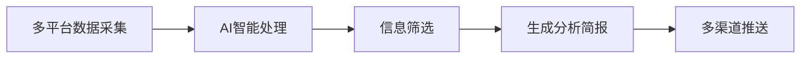

**技术特色**：
- 多源数据聚合与去重技术
- AI驱动的信息筛选与情感分析
- MCP架构支持自然语言对话分析
- 灵活的数据存储架构(本地/云端)

#### 热度分析

- 项目Star数超5万且持续快速增长，表明市场需求旺盛
- 作为舆情监控工具，在信息爆炸时代具有广泛应用场景和生态价值

#### 快速上手

```bash
# 克隆项目
git clone https://github.com/sansan0/TrendRadar.git

# 使用Docker运行
docker-compose up -d
```

#### 注意事项

- 需要配置各平台的API密钥以获取数据
- 根据需求选择本地或云端数据存储方式
- 确保网络连接稳定以实时获取各平台数据
- 项目License未明确，使用前需确认授权条款


### 3. zilliztech/claude-context — 代码上下文增强

> **一句话总结**：为 Claude Code 提供代码搜索能力，使整个代码库可被用作任何编码代理的上下文。

#### 价值主张

| 维度 | 说明 |
|------|------|
| **解决痛点** | 解决大型代码库中难以快速找到相关代码片段的问题，为 AI 编码助手提供完整上下文 |
| **目标用户** | 使用 Claude Code 进行开发的程序员，特别是处理大型代码库的开发者 |
| **核心亮点** | 提供 MCP 协议支持 + 整个代码库作为上下文 + 与 Claude Code 深度集成 + 提升代码理解效率 |

#### 技术架构

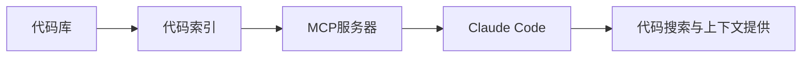

**技术特色**：
- 基于 TypeScript 开发，提供类型安全
- 实现了 MCP 协议，确保与 Claude Code 的兼容性
- 提供完整的代码库上下文，增强代码理解能力

#### 热度分析

- 项目 Star 数高达 7,578，单日增长 871，表明近期获得极大关注，可能是由于 Claude Code 的流行
- Fork 数相对较少(624)，表明项目可能更注重使用而非二次开发，或项目仍在快速发展阶段

#### 快速上手

```bash
# 安装依赖
npm install

# 配置 MCP 服务器
npx claude-context --config path/to/config.json

# 启动服务
npx claude-context serve
```

#### 注意事项

- 项目许可证未知，可能影响商业使用
- 没有公开的问题报告，可能意味着问题沟通渠道不透明
- 项目描述相对简洁，可能需要进一步了解文档才能完全理解其功能和使用场景


### 4. HKUDS/RAG-Anything — 全能RAG框架

> **一句话总结**：一站式RAG解决方案，简化检索增强生成应用开发流程

#### 价值主张

| 维度 | 说明 |
|------|------|
| **解决痛点** | 简化RAG应用开发流程，降低技术门槛 |
| **目标用户** | AI应用开发者、研究人员和企业技术团队 |
| **核心亮点** | 模块化设计 + 多数据源支持 + 易于集成部署 |

#### 技术架构

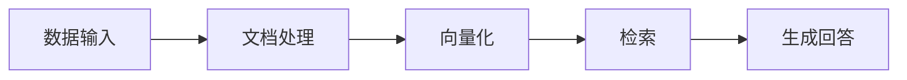

**技术特色**：
- 支持多种文档格式和结构化数据处理
- 提供预训练模型和自定义训练选项
- 模块化架构，便于扩展和定制化

#### 热度分析

- 项目增长迅猛，单日新增近800星标，显示社区高度关注
- Fork数量适中，表明项目有一定但不过度的分支使用情况

#### 快速上手

```bash
# 安装RAG-Anything
pip install rag-anything

# 初始化项目
rag-anything init my-rag-project

# 启动服务
rag-anything serve
```

#### 注意事项
- 需要确保有足够的计算资源处理大型文档集
- 自定义模型需要一定的机器学习背景知识
- 项目文档可能需要进一步完善以降低上手难度


### 5. ruvnet/RuView — WiFi姿态感知

> **一句话总结**：通过普通WiFi信号实现无摄像头的人体姿态估计、生命体征监测和存在检测。

#### 价值主张

| 维度 | 说明 |
|------|------|
| **解决痛点** | 无需摄像头即可进行人体行为监测，解决隐私保护问题 |
| **目标用户** | 注重隐私的家庭、医疗机构和智能空间开发者 |
| **核心亮点** | 无摄像头监测 + 实时姿态估计 + 生命体征检测 + 普通WiFi设备支持 + 高隐私保护 |

#### 技术架构

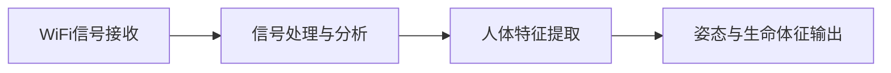

**技术特色**：
- 利用WiFi信号相位变化分析人体动作
- 无需专用硬件，仅需普通WiFi设备
- 实现高精度非视觉人体感知

#### 热度分析

- 项目Star数近5万，单日增长565，显示极高关注度和快速发展势头
- 零开放问题表明项目成熟度高，社区维护良好

#### 快速上手

```bash
git clone https://github.com/ruvnet/RuView.git
cd RuView
cargo run --example demo
```

#### 注意事项

- 需要支持特定WiFi硬件才能实现最佳性能
- 精度可能受环境因素和WiFi设备质量影响
- 项目目前可能仍处于研究阶段，实际应用场景有限


### 6. open-metadata/OpenMetadata — 元数据统一平台

> **一句话总结**：OpenMetadata 是集数据发现、可观测性和治理于一体的统一元数据平台，提供集中式元数据存储和深度列级血缘关系。

#### 价值主张

| 维度 | 说明 |
|------|------|
| **解决痛点** | 解决企业数据分散、难以发现、缺乏治理的问题 |
| **目标用户** | 数据工程师、数据分析师、数据治理团队 |
| **核心亮点** | 统一元数据存储 + 深度列级血缘 + 团队协作能力 + 数据可观测性 + 数据治理框架 |

#### 技术架构

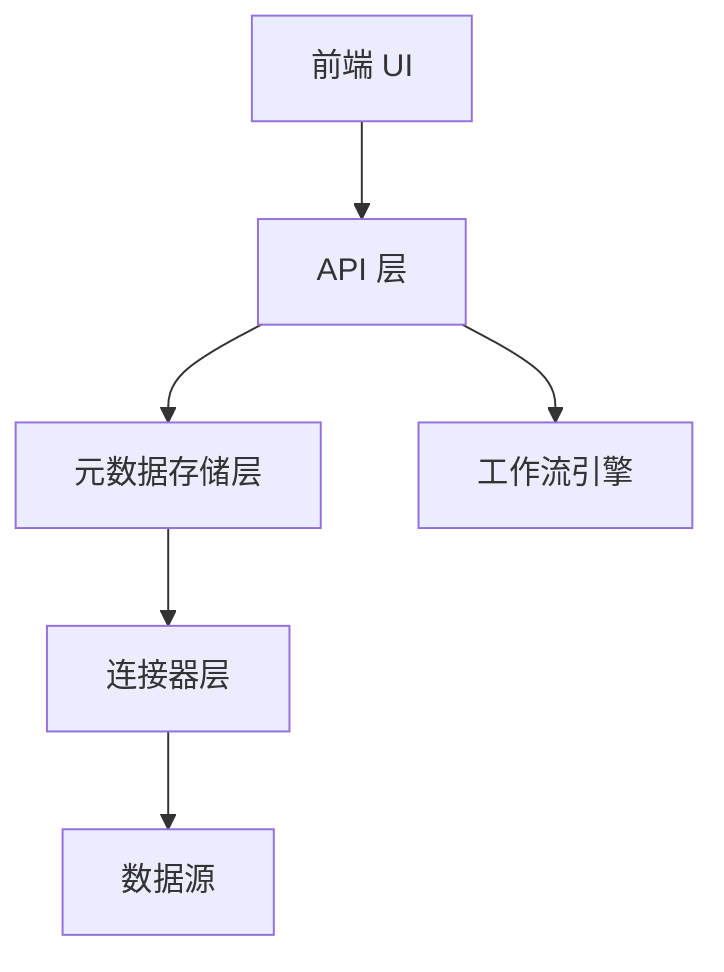

**技术特色**：
- 基于 TypeScript/JavaScript 构建，提供类型安全
- 自研元数据存储和管理系统，支持多种数据库后端
- 支持多种数据源连接器，包括 Snowflake、BigQuery、Redshift 等
- 提供完整的 REST API 和 GraphQL 接口
- 内置工作流引擎支持数据治理流程

#### 热度分析

- 项目星数达12,209，近期增长迅速，表明元数据管理领域需求旺盛
- 社区活跃度高，Fork数近2000，显示开发者参与度良好

#### 快速上手

```bash
# 克隆项目
git clone https://github.com/open-metadata/OpenMetadata.git

# 安装依赖并运行
cd OpenMetadata && npm install && npm run dev
```

#### 注意事项

- 项目许可证信息不明确，使用前需确认
- 使用GitHub Issues以外的系统跟踪问题
- 项目依赖较多，初次部署可能需要较长时间
- 需要了解元数据管理的基本概念才能有效使用
- 部署环境需要足够的资源支持，特别是元数据存储部分
- 与现有数据源集成可能需要自定义开发连接器


### 7. Z4nzu/hackingtool — 全能黑客工具集

> **一句话总结**：Python编写的一站式黑客工具集成平台，提供多种渗透测试与安全评估工具。

#### 价值主张

| 维度 | 说明 |
|------|------|
| **解决痛点** | 集成多种安全工具，避免单独安装配置，提高渗透测试效率 |
| **目标用户** | 网络安全研究员、渗透测试人员、道德黑客 |
| **核心亮点** | 多工具集成 + 统一命令界面 + 自动化脚本 + 模块化设计 + 跨平台支持 |

#### 技术架构

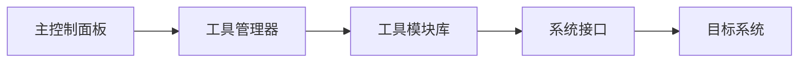

**技术特色**：
- Python实现，跨平台兼容性强
- 模块化设计，工具可独立运行或协同工作
- 统一命令行接口，简化操作流程

#### 热度分析
- 获近6万星，每日新增500+星，显示在安全领域极高关注度和实用价值
- 作为开源安全工具集，在渗透测试社区具有重要地位，但需注意合法使用边界

#### 快速上手

```bash
# 克隆项目
git clone https://github.com/Z4nzu/hackingtool.git
cd hackingtool
# 安装依赖并运行
pip install -r requirements.txt
python hackingtool.py
```

#### 注意事项
- 本工具仅用于授权的安全测试和教育目的，未经授权的系统测试可能违法
- 使用前请确保遵守当地法律法规，尊重隐私和网络安全伦理
- 工具可能包含某些敏感功能，请谨慎使用并了解其工作原理


### 8. koala73/worldmonitor — 全球情报监控

> **一句话总结**：AI驱动的实时全球情报仪表板，整合新闻、地缘政治和基础设施监控

#### 价值主张

| 维度 | 说明 |
|------|------|
| **解决痛点** | 信息过载环境下缺乏实时全球态势感知能力 |
| **目标用户** | 情报分析师、地缘政治研究员、安全专家 |
| **核心亮点** | AI新闻聚合+实时监控+态势可视化+多源数据整合 |

#### 技术架构

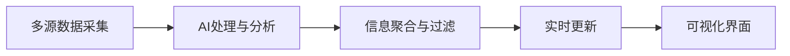

**技术特色**：
- 多源数据智能采集与处理
- AI驱动的信息过滤与优先级排序
- 实时数据流处理与可视化展示

#### 热度分析

- 项目获得超过5万星，日增400+，表明其价值获得广泛认可
- 零开放问题，显示项目维护良好，用户体验稳定

#### 快速上手

```bash
# 克隆项目
git clone https://github.com/koala73/worldmonitor.git

# 安装依赖
npm install

# 启动开发服务器
npm run dev
```

#### 注意事项

- 项目使用TypeScript开发，需要Node.js环境
- 可能需要配置API密钥以访问数据源
- 项目依赖大量外部数据源，需注意数据可用性和合规性


### 9. KeygraphHQ/shannon — AI安全测试

> **一句话总结**：自主AI渗透测试工具，分析源代码识别Web应用和API漏洞，在生产环境前验证安全风险。

#### 价值主张

| 维度 | 说明 |
|------|------|
| **解决痛点** | 提前发现Web应用和API漏洞，避免生产环境安全事件 |
| **目标用户** | 开发团队、安全测试人员、DevOps工程师 |
| **核心亮点** | 白盒分析 + 自动化渗透测试 + 实际漏洞验证 |

#### 技术架构

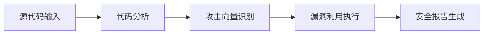

**技术特色**：
- AI驱动的代码安全分析技术
- 自动化漏洞验证与利用
- 白盒安全测试方法
- 实际攻击向量验证

#### 热度分析

- 项目获得近4万星，单日增长372星，表明安全测试领域对AI工具需求旺盛
- 高关注度但无开放问题，可能项目已成熟或社区主要通过其他渠道提供反馈

#### 快速上手

```bash
# 安装Shannon
npm install -g @keygraphhq/shannon

# 运行测试
shannon scan ./src --output report.json
```

#### 注意事项

- 该工具执行实际漏洞利用，需在隔离环境中使用
- 可能需要配置API密钥以访问某些功能
- 结果报告需由专业人员解读，避免误判


### 10. vercel-labs/skills — AI技能工具

> **一句话总结**：开源AI代理技能工具，通过npx一键创建、管理和部署AI技能

#### 价值主张

| 维度 | 说明 |
|------|------|
| **解决痛点** | 简化AI技能开发流程，降低AI应用构建门槛 |
| **目标用户** | AI应用开发者、代理系统构建者、AI工具创作者 |
| **核心亮点** | 开源技能生态 + npx直接运行 + 技能共享平台 + 类型安全 + Vercel支持 |

#### 技术架构

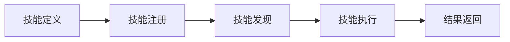

**技术特色**：
- 基于TypeScript开发，提供完整的类型安全保障
- 支持技能包的版本管理和依赖解析
- 提供标准化的技能接口规范，确保兼容性

#### 热度分析

- 项目Star数超15k且持续快速增长，表明开发者对该工具需求旺盛
- 作为Vercel实验室项目，在AI开发工具领域具有显著影响力

#### 快速上手

```bash
# 安装并运行技能工具
npx skills

# 初始化新技能项目
npx skills init my-skill
```

#### 注意事项

- 项目需要Node.js环境支持
- 某些高级功能可能需要OpenAI API或其他AI服务密钥
- 技能生态仍在发展中，部分功能可能处于实验阶段


### 11. AIDC-AI/Pixelle-Video — AI视频自动化生成

> **一句话总结**：利用AI技术全自动生成短视频内容，降低视频创作门槛，提升内容生产效率。

#### 价值主张

| 维度 | 说明 |
|------|------|
| **解决痛点** | 传统视频制作专业技能门槛高，AI引擎简化创作流程，实现零基础快速生成 |
| **目标用户** | 内容创作者、营销人员、自媒体运营者、中小企业营销团队 |
| **核心亮点** | AI全自动生成 + 多模态内容融合 + 智能剪辑 + 快速批量生产 |

#### 技术架构

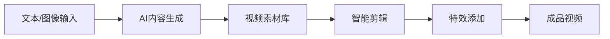

**技术特色**：
- 多模态AI融合技术，整合文本、图像和视频处理能力
- 智能场景自动识别与适配，根据内容生成相应画面
- 高效渲染引擎，支持批量视频生成与处理

#### 热度分析

- 项目Star数增长迅速，单日新增308个Star，表明社区关注度高
- Fork数相对Star数比例约为16%，具有较好的技术参考价值

#### 快速上手

```bash
# 克隆项目
git clone https://github.com/AIDC-AI/Pixelle-Video.git
cd Pixelle-Video

# 安装依赖并运行
pip install -r requirements.txt
python main.py --input "示例文本" --output "output.mp4"
```

#### 注意事项

- 项目许可证未知，商业使用前需确认授权条款
- AI生成内容可能涉及版权问题，需注意素材合规性
- 项目依赖较多AI服务，可能需要相应的API密钥和配置


### 12. langfuse/langfuse — LLM工程平台

> **一句话总结**：开源LLM工程平台，提供完整观测性、指标评估和提示管理解决方案。

#### 价值主张

| 维度 | 说明 |
|------|------|
| **解决痛点** | 解决LLM应用开发、部署和监控中的可观测性和评估难题 |
| **目标用户** | AI/ML工程师、LLM应用开发者和数据科学家 |
| **核心亮点** | LLM可观测性+提示管理+评估系统+数据集管理+Playground |

#### 技术架构

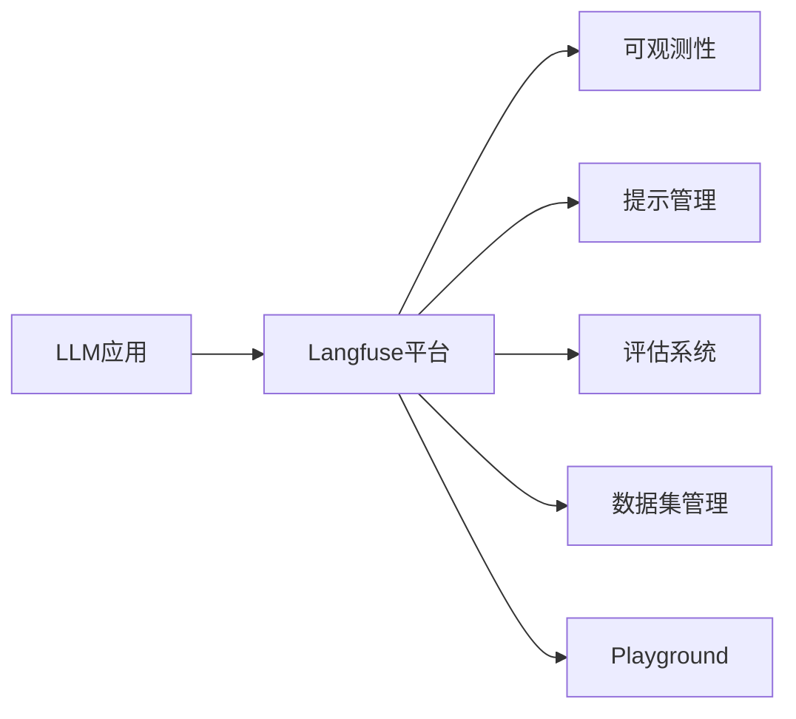

**技术特色**：
- 支持OpenTelemetry标准，实现广泛兼容性
- 提供完整的LLM生命周期管理工具链
- 集成主流LLM框架和SDK，包括Langchain和OpenAI SDK

#### 热度分析

- 25k+高星且持续增长，表明项目获得广泛认可
- 作为YC W23项目，已形成活跃的开发者生态和丰富的集成生态

#### 快速上手

```bash
# 安装
npm install @langfuse/core

# 初始化
import { Langfuse } from "@langfuse/core";
const langfuse = new Langfuse({
  secretKey: "your-secret-key",
  publicKey: "your-public-key",
  baseUrl: "https://cloud.langfuse.com"
});
```

#### 注意事项

- 需要配置API密钥才能使用云服务
- 本地部署需要适当的资源支持
- 与现有LLM框架集成可能需要额外配置


## 今日推荐

| 主题 | 推荐项目 | 亮点 |
|------|----------|------|
| 今日最热 | [Fincept-Corporation/FinceptTerminal](https://github.com/Fincept-Corporation/FinceptTerminal) | FinceptTerminal i... |
| 值得关注 | [sansan0/TrendRadar](https://github.com/sansan0/TrendRadar) | ⭐AI-driven public... |
| 快速上手 | [zilliztech/claude-context](https://github.com/zilliztech/claude-context) | Code search MCP f... |
| 长期潜力 | [HKUDS/RAG-Anything](https://github.com/HKUDS/RAG-Anything) | "RAG-Anything: Al... |

---

<div align="center">

*Generated on 2026-04-23 | Powered by GitHub Trending Reporter*

</div>