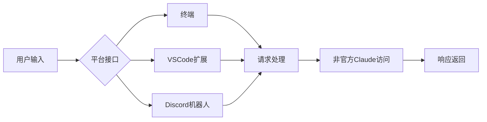
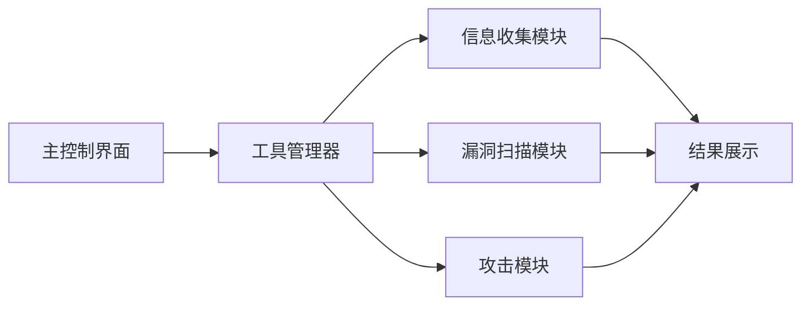
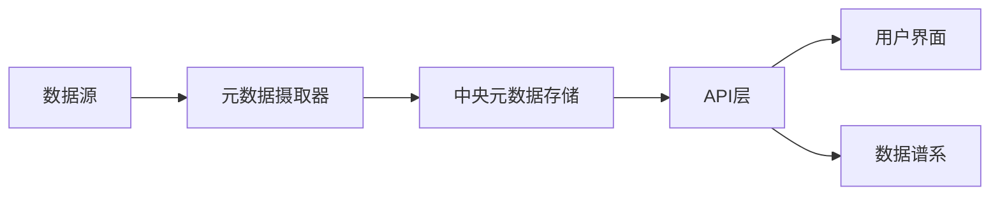
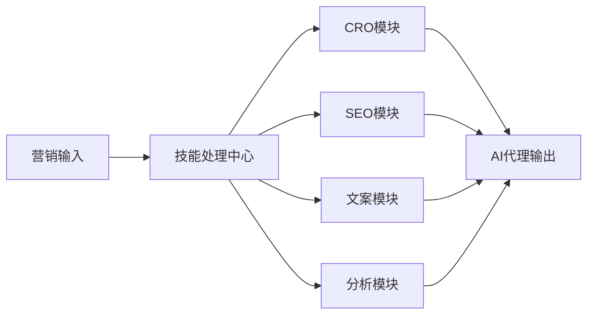
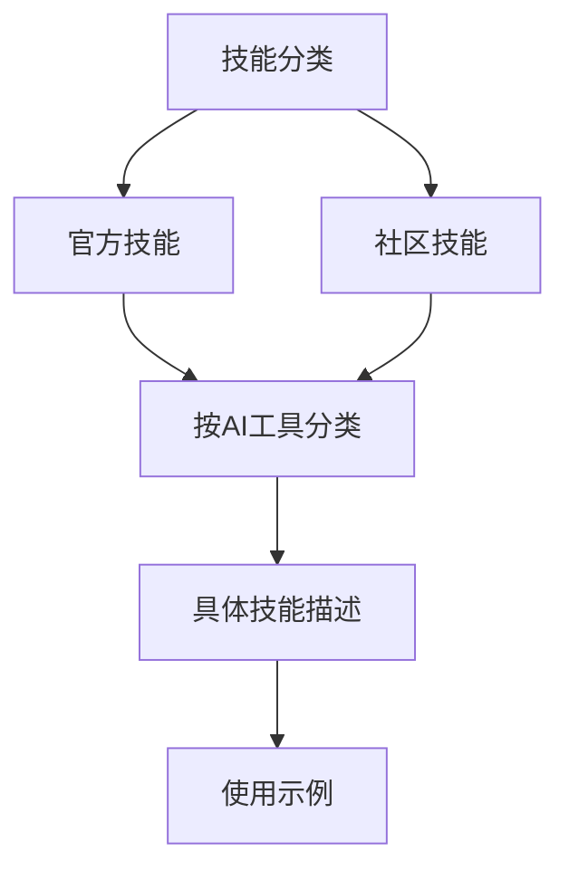

## 今日热点

AI代理与助手工具爆发式增长，RAG技术持续火热，开发者积极构建无审查的生成式AI工具，AI工程化资源日益丰富。

---

## 热门项目一览

| 排名 | 项目 | 语言 | 今日 | 总计 | 简介 |
|:---:|------|:----:|------:|-----:|------|
| 1 | [Alishahryar1/free-claude-code](https://github.com/Alishahryar1/free-claude-code) | Python | +1,962 | 5,670 | Use claude-code for free in... |
| 2 | [Z4nzu/hackingtool](https://github.com/Z4nzu/hackingtool) | Python | +1,383 | 61,128 | ALL IN ONE Hacking Tool For... |
| 3 | [zilliztech/claude-context](https://github.com/zilliztech/claude-context) | TypeScript | +1,011 | 8,463 | Code search MCP for Claude ... |
| 4 | [open-metadata/OpenMetadata](https://github.com/open-metadata/OpenMetadata) | TypeScript | +776 | 12,959 | OpenMetadata is a unified m... |
| 5 | [huggingface/ml-intern](https://github.com/huggingface/ml-intern) | Python | +720 | 3,430 | 🤗 ml-intern: an open-source... |
| 6 | [HKUDS/RAG-Anything](https://github.com/HKUDS/RAG-Anything) | Python | +590 | 18,219 | "RAG-Anything: All-in-One R... |
| 7 | [ruvnet/RuView](https://github.com/ruvnet/RuView) | Rust | +429 | 49,855 | π RuView: WiFi DensePose tu... |
| 8 | [Anil-matcha/Open-Generative-AI](https://github.com/Anil-matcha/Open-Generative-AI) | JavaScript | +316 | 6,996 | Uncensored, open-source alt... |
| 9 | [coreyhaines31/marketingskills](https://github.com/coreyhaines31/marketingskills) | JavaScript | +285 | 23,886 | Marketing skills for Claude... |
| 10 | [mksglu/context-mode](https://github.com/mksglu/context-mode) | TypeScript | +238 | 9,462 | Context window optimization... |
| 11 | [VoltAgent/awesome-agent-skills](https://github.com/VoltAgent/awesome-agent-skills) | Unknown | +228 | 18,141 | A curated collection of 100... |
| 12 | [chiphuyen/aie-book](https://github.com/chiphuyen/aie-book) | Jupyter Notebook | +215 | 15,201 | [WIP] Resources for AI engi... |

---

## 趋势洞察

```
┌─────────────────────────────────────────────────────────────────┐
│  AI/ML 工具         ████████████████████████  12 个项目        │
│  开发工具             ████                      2 个项目        │
│  开发框架             ██                        1 个项目        │
│  多媒体应用            ██                        1 个项目        │
└─────────────────────────────────────────────────────────────────┘
```

---

## 项目深度解读

### 1. Alishahryar1/free-claude-code — 免费Claude访问

> **一句话总结**：提供免费使用Claude Code的终端、VSCode和Discord访问方式，无需官方API密钥。

#### 价值主张

| 维度 | 说明 |
|------|------|
| **解决痛点** | 让用户无需付费或获取官方API密钥即可使用Claude Code功能 |
| **目标用户** | 需要使用Claude但不想付费或无法获取API密钥的开发者和普通用户 |
| **核心亮点** | 多平台支持 + 免费使用 + 无需官方API + 类OpenClaw替代方案 |

#### 技术架构



**技术特色**：
- 通过非官方渠道实现Claude免费访问
- 提供多平台统一接口体验
- 可能使用代理或中间层处理API请求

#### 热度分析

- 项目短时间内获近2000个Star，表明解决了用户迫切需求
- 作为Claude API替代方案，填补了免费使用的市场空白

#### 快速上手

```bash
# 克隆仓库
git clone https://github.com/Alishahryar1/free-claude-code.git
cd free-claude-code
# 安装依赖
pip install -r requirements.txt
```

#### 注意事项

- 由于使用非官方渠道访问Claude，可能存在服务不稳定或随时失效的风险
- 项目可能违反Claude的使用条款，使用时需自行承担风险
- 许可证未知，使用前应确认项目的授权方式
- 项目可能依赖于特定的网络环境或配置


### 2. Z4nzu/hackingtool — 渗透测试工具集

> **一句话总结**：集成多种渗透测试工具的一站式安全评估平台，简化黑客工具使用流程。

#### 价值主张

| 维度 | 说明 |
|------|------|
| **解决痛点** | 整合分散的渗透测试工具，减少工具切换与配置成本 |
| **目标用户** | 渗透测试人员、网络安全研究员、道德黑客 |
| **核心亮点** | 多功能集成 + 模块化设计 + 跨平台支持 + 用户友好界面 |

#### 技术架构



**技术特色**：
- 基于Python开发，确保跨平台兼容性
- 采用模块化架构，便于功能扩展
- 集成多种安全工具，提供统一操作接口

#### 热度分析

- 超过6万星且持续增长，表明在安全工具领域有较高认可度
- 作为工具集填补了市场空白，形成了独特的安全工具生态位

#### 快速上手

```bash
# 克隆项目
git clone https://github.com/Z4nzu/hackingtool.git

# 安装依赖
cd hackingtool
pip install -r requirements.txt

# 运行工具
python hackingtool.py
```

#### 注意事项
- 此工具仅用于授权的安全测试和教育目的
- 使用前必须获得系统所有者的明确书面授权
- 遵守当地法律法规，禁止用于任何非法活动


### 3. zilliztech/claude-context — 代码库上下文工具

> **一句话总结**：为Claude Code提供代码搜索MCP服务，将整个代码库作为上下文提供给任何编码代理使用。

#### 价值主张

| 维度 | 说明 |
|------|------|
| **解决痛点** | 解决Claude Code无法直接访问和理解完整代码库的问题 |
| **目标用户** | 使用Claude Code的开发团队和AI辅助编程者 |
| **核心亮点** | + 支持完整代码库作为上下文 + MCP协议集成 + 高效代码搜索能力 |

#### 技术架构


**技术特色**：
- 基于MCP协议实现与Claude的深度集成
- 支持大型代码库的高效索引和检索
- 提供上下文感知的代码搜索能力

#### 热度分析

- 项目Star数8,463且近期增长迅猛(+1,011 today)，表明其受到开发者高度关注
- 作为Claude生态的重要工具，处于AI辅助编程工具链的关键位置

#### 快速上手

```bash
# 安装claude-context
npm install -g @zilliz/claude-context

# 初始化配置
claude-context init

# 启动服务
claude-context start
```

#### 注意事项

- 需要Claude Code环境才能正常使用
- 对于大型代码库，可能需要配置适当的索引策略以获得最佳性能
- 项目许可证信息不明确，使用前需确认商业使用限制


### 4. open-metadata/OpenMetadata — 数据治理平台

> **一句话总结**：统一元数据平台实现数据发现、可观察性和治理，助力团队协作提升数据资产价值。

#### 价值主张

| 维度 | 说明 |
|------|------|
| **解决痛点** | 企业数据孤岛严重，缺乏统一治理机制，数据资产难以管理和价值挖掘 |
| **目标用户** | 数据工程师、数据分析师、数据治理团队和IT决策者 |
| **核心亮点** | 中央元数据存储库 + 列级别谱系追踪 + 团队协作功能 + 数据发现能力 + 数据可观察性 |

#### 技术架构



**技术特色**：
- 基于 TypeScript 构建的现代化前端架构
- 支持多种数据源的元数据摄取
- 提供完整的 REST API 用于系统集成
- 支持列级别的数据谱系追踪
- 提供丰富的用户界面进行数据探索

#### 热度分析

- 项目 Star 数量接近 13K 且单日增长 776，表明正处于快速增长阶段
- 社区活跃度较高，Fork 数量适中，显示良好的开发者参与度

#### 快速上手

```bash
# 克隆仓库
git clone https://github.com/open-metadata/OpenMetadata.git

# 安装依赖
npm install

# 启动开发服务器
npm run dev
```

#### 注意事项

- 项目部署配置复杂度高，特别是对于大规模环境
- 需要了解多种数据源的连接方式才能充分利用元数据管理能力
- 许可证信息不明确，使用前需确认具体开源许可条款


### 5. huggingface/ml-intern — 自动化ML工程师

> **一句话总结**：开源AI助手，能自动研读论文、训练模型并完成部署，大幅提升ML开发效率。

#### 价值主张

| 维度 | 说明 |
|------|------|
| **解决痛点** | 自动化ML全流程，减少重复性工作，加速模型从研究到部署的周期 |
| **目标用户** | 机器学习工程师、研究人员、数据科学家及AI产品开发团队 |
| **核心亮点** | 自动论文理解 + 智能模型训练 + 一键式部署 |

#### 技术架构


**技术特色**：
- 基于大语言模型的论文理解与提取系统
- 智能模型选择与超参数优化框架
- 跨平台模型自动化部署流水线

#### 热度分析
- 单日增长720 stars，显示社区对AI自动化工具的强烈需求
- 作为HuggingFace生态项目，具备强大的社区影响力和技术背书

#### 快速上手

```bash
# 安装ml-intern
pip install ml-intern

# 基于论文训练模型
ml-intern train --paper "https://arxiv.org/abs/xxxx.xxxx"

# 部署训练好的模型
ml-intern deploy --model-path ./trained_model
```

#### 注意事项
- 需要一定的机器学习基础知识以充分利用项目功能
- 模型训练过程可能需要高性能计算资源支持
- 论文理解能力可能受限于当前NLP技术水平


### 6. HKUDS/RAG-Anything — 全能RAG框架

> **一句话总结**：一站式集成多种检索增强生成技术，简化AI应用开发流程

#### 价值主张

| 维度 | 说明 |
|------|------|
| **解决痛点** | 简化RAG系统构建复杂度，降低技术整合门槛 |
| **目标用户** | AI应用开发者、研究人员、企业技术团队 |
| **核心亮点** | 多模态支持 + 模块化设计 + 高度可扩展 + 一站式部署 |

#### 技术架构


**技术特色**：
- 支持多种向量数据库和嵌入模型无缝切换
- 提供灵活的检索策略和排序机制
- 内置评估工具和性能监控

#### 热度分析

- 项目获得18k+ Star且单日增长近600，显示RAG领域热度持续攀升
- 作为全能框架，正成为AI应用开发者的基础设施选择

#### 快速上手

```bash
git clone https://github.com/HKUDS/RAG-Anything.git
cd RAG-Anything
pip install -e . && rag-anything init
```

#### 注意事项

- 需要配置API密钥和访问权限，确保数据源连接正常
- 处理大规模数据时需考虑硬件资源需求，建议GPU加速
- 部分高级功能需要额外依赖，请根据需求选择性安装


### 7. ruvnet/RuView — [WiFi感知]

> **一句话总结**：利用普通WiFi信号实现无摄像头的人体姿态和生命体征实时监测

#### 价值主张

| 维度 | 说明 |
|------|------|
| **解决痛点** | 解决隐私敏感场景下无接触人体监测需求 |
| **目标用户** | 隐私敏感场所、医疗监护、智能家居开发者 |
| **核心亮点** | 利用普通WiFi设备 + 实时姿态估计 + 无摄像头隐私保护 + 生命体征监测 |

#### 技术架构


**技术特色**：
- 利用普通WiFi设备实现非接触式人体感知
- 通过信号波动分析提取人体姿态和生命体征
- 无需摄像头保护用户隐私同时实现监测功能

#### 热度分析

- 项目Star数近5万，日增429，表明技术方向受到高度关注
- 零开放问题反映项目成熟度高，适合工业应用

#### 快速上手

```bash
git clone https://github.com/ruvnet/RuView.git
cd RuView
cargo run --example demo
```

#### 注意事项

- 项目依赖特定的WiFi硬件支持，并非所有设备都能完美运行
- 精度可能受环境干扰和WiFi信号质量影响
- 需要一定的Rust编程基础才能进行二次开发


### 8. Anil-matcha/Open-Generative-AI — 开源AI生成平台

> **一句话总结**：开源无限制的AI图像视频生成平台，集成200+模型，支持自托管，无内容过滤。

#### 价值主张

| 维度 | 说明 |
|------|------|
| **解决痛点** | 打破商业平台的内容限制，提供完全自由的AI创作环境 |
| **目标用户** | 需要突破内容限制的艺术家、设计师和AI开发者 |
| **核心亮点** | 200+模型支持 + 无内容过滤 + 自托管部署 + 多种流行模型集成 + MIT许可 |

#### 技术架构


**技术特色**：
- 基于JavaScript的全栈实现，便于快速部署和扩展
- 集成多种主流AI模型，提供统一接口管理
- 支持自托管部署，保证数据隐私和控制权

#### 热度分析

- 项目获得近7K星，单日增长300+，表明社区高度关注该开源替代方案
- Fork数超过1.3K，显示用户积极参与项目定制和二次开发

#### 快速上手

```bash
# 克隆项目
git clone https://github.com/Anil-matcha/Open-Generative-AI.git

# 安装依赖
npm install

# 启动服务
npm start
```

#### 注意事项

- 项目需要计算资源支持AI模型运行，建议使用GPU加速
- 自托管部署需要一定的技术基础和服务器配置能力
- 部分模型可能有使用许可限制，需注意合规性


### 9. coreyhaines31/marketingskills — AI营销技能库

> **一句话总结**：为AI代理提供专业营销技能，包括转化优化、SEO、文案和数据分析能力。

#### 价值主张

| 维度 | 说明 |
|------|------|
| **解决痛点** | 为AI代理提供专业营销技能，弥补AI在营销领域的知识盲区 |
| **目标用户** | 使用Claude Code的开发者和AI代理构建者 |
| **核心亮点** | CRO技术 + SEO优化 + 文案写作 + 数据分析 + 增长工程 |

#### 技术架构



**技术特色**：
- 模块化营销技能设计，便于AI调用
- JavaScript实现，兼容多种AI开发环境
- 专业化营销算法，提升AI营销决策质量

#### 热度分析

- 项目获近24k星且持续增长，反映AI营销领域需求旺盛
- 在AI辅助营销工具生态中占据重要位置，社区活跃度高

#### 快速上手

```bash
# 克隆项目
git clone https://github.com/coreyhaines31/marketingskills.git

# 安装依赖
cd marketingskills && npm install

# 引入技能模块
const { seo, copywriting, analytics } = require('./index');
```

#### 注意事项

- 项目许可证不明确，使用前需确认授权方式
- 技能效果可能需要结合具体业务场景进行调整
- 部分高级功能可能需要Claude Code环境才能充分发挥


### 10. mksglu/context-mode — AI上下文优化器

> **一句话总结**：通过沙箱化工具输出，实现AI编码代理上下文窗口98%的优化。

#### 价值主张

| 维度 | 说明 |
|------|------|
| **解决痛点** | AI编码代理上下文窗口过大导致的性能和成本问题 |
| **目标用户** | AI编码工具开发者和使用者 |
| **核心亮点** | 沙箱化工具输出 + 98%上下文减少 + 支持12平台 |

#### 技术架构


**技术特色**：
- 工具输出沙箱隔离技术
- 智能上下文压缩算法
- 跨平台兼容性架构

#### 热度分析

- 高星增长表明项目获得开发者广泛认可，日增238星显示热度持续上升
- 零未解决问题反映项目维护良好，社区协作高效

#### 快速上手

```bash
# 安装依赖
npm install context-mode

# 基本使用
import { ContextMode } from 'context-mode';
const cm = new ContextMode();
cm.initialize();
```

#### 注意事项

- 需要确认开源许可协议，目前显示为Unknown
- 项目详细实现机制需进一步研究文档了解
- 可能需要特定环境配置才能正常使用


### 11. VoltAgent/awesome-agent-skills — AI技能聚合库

> **一句话总结**：精选1000+AI代理技能集合，兼容主流开发工具，提升AI开发效率与能力边界。

#### 价值主张

| 维度 | 说明 |
|------|------|
| **解决痛点** | 解决AI工具间技能不互通、缺乏统一技能库的问题 |
| **目标用户** | AI开发者、提示工程师、多模态应用构建者 |
| **核心亮点** | 1000+精选技能 + 多平台兼容 + 社区驱动更新 + 官方团队贡献 + 结构化分类 |

#### 技术架构



**技术特色**：
- 结构化技能分类系统
- 多平台兼容性设计
- 社区贡献与审核机制

#### 热度分析

- 项目获得18k+星标，日增长228星，显示强劲社区支持
- 零开放问题表明维护良好，处于AI开发工具链核心位置

#### 快速上手

```bash
# 克隆项目仓库
git clone https://github.com/VoltAgent/awesome-agent-skills.git

# 查看README获取使用指南
cat README.md

# 探索特定AI工具的技能
ls claude/ codex/ gemini/ cursor/
```

#### 注意事项

- 技能需要根据具体AI工具和环境进行适配
- 某些技能可能需要API密钥或额外配置
- 社区贡献的技能需要自行验证有效性
- 定期更新以获取最新技能和兼容性改进


### 12. chiphuyen/aie-book — AI工程资源

> **一句话总结**：AI工程师实用资源库，提供前沿AI工程知识与实践指导

#### 价值主张

| 维度 | 说明 |
|------|------|
| **解决痛点** | 提供AI工程系统性知识框架，弥合理论与产业实践差距 |
| **目标用户** | AI工程师、数据科学家、机器学习研究者 |
| **核心亮点** | 实践导向 + 前沿技术覆盖 + 工程化思维培养 + 产业案例 + 书籍配套资源 |

#### 技术架构

由于这是一个Jupyter Notebook资源库，没有明确的技术流程，因此省略mermaid图部分。

**技术特色**：
- 基于Jupyter Notebook的交互式学习体验
- 融合理论与实践的案例教学
- 提供可直接运行的代码示例

#### 热度分析

- 项目获得15k+星标，日均增长约215颗，表明AI工程领域高度关注
- 零开放问题显示项目维护良好，社区参与度高

#### 快速上手

```bash
# 克隆仓库
git clone https://github.com/chiphuyen/aie-book.git

# 运行Jupyter Notebook
cd aie-book
jupyter notebook
```

#### 注意事项

- 项目仍在开发中(WIP)，部分内容可能不完整
- 需要基础的Python和机器学习知识才能充分利用资源
- 配套书籍尚未发布(2025年)，目前仅提供部分预览内容


### 13. microsoft/ai-agents-for-beginners — AI智能体入门

> **一句话总结**：微软官方出品的12课AI智能体入门教程，通过Jupyter Notebook帮助初学者系统构建AI智能体开发能力。

#### 价值主张

| 维度 | 说明 |
|------|------|
| **解决痛点** | 降低AI智能体开发门槛，提供系统化学习路径 |
| **目标用户** | AI开发初学者、希望了解智能体技术的开发者 |
| **核心亮点** | + 微软官方出品 + 12结构化课程 + 实践导向 + Jupyter Notebook交互式学习 |

#### 技术架构


**技术特色**：
- 基于Jupyter Notebook的交互式学习环境
- 微软官方出品，内容权威可靠
- 循序渐进的课程设计，从基础到应用

#### 热度分析

- Star数达58,834且持续增长(+208 today)，表明项目非常受欢迎且保持活跃
- 作为微软官方教育项目，在AI智能体入门领域具有标杆地位

#### 快速上手

```bash
# 克隆仓库
git clone https://github.com/microsoft/ai-agents-for-beginners.git

# 运行第一个课程
cd ai-agents-for-beginners/Lesson-1
jupyter notebook Lesson-1.ipynb
```

#### 注意事项

- 项目使用Jupyter Notebook，需要安装Python和相关依赖
- 建议按顺序学习12个课程，以获得最佳学习效果
- 可能需要OpenAI API密钥来完成部分实践内容


### 14. cline/cline — IDE智能编程助手

> **一句话总结**：集成于IDE的自主编程助手，可创建/编辑文件、执行命令和浏览器操作，全程需用户许可。

#### 价值主张

| 维度 | 说明 |
|------|------|
| **解决痛点** | 解决开发过程中重复性编码任务和复杂操作的需求 |
| **目标用户** | 开发者、编程爱好者和需要自动化编程任务的专业人士 |
| **核心亮点** | IDE深度集成 + 每步操作需用户确认 + 多功能自动化能力 |

#### 技术架构


**技术特色**：
- 基于TypeScript开发，跨平台IDE兼容性强
- 每步操作需用户确认，确保安全可控
- 多功能集成，支持文件操作、命令执行和浏览器控制

#### 热度分析

- Star数超过6万且持续增长(+123 today)，表明项目获得开发者高度认可
- 零开放Issues反映项目维护良好，社区问题解决效率高

#### 快速上手

```bash
# 安装Cline VS Code扩展
code --install-extension cline.cline

# 或通过IDE扩展市场搜索"Cline"进行安装
```

#### 注意事项

- 注意确认操作权限，确保安全执行
- 可能需要配置API密钥或账户才能使用完整功能
- 建议在使用前备份重要代码，以防意外修改


### 15. PowerShell/PowerShell — 跨平台自动化引擎

> **一句话总结**：微软开发的跨平台任务自动化框架，提供强大命令行和脚本能力，支持Windows、Linux和macOS。

#### 价值主张

| 维度 | 说明 |
|------|------|
| **解决痛点** | 统一跨平台系统管理体验，解决自动化任务和配置管理需求 |
| **目标用户** | 系统管理员、DevOps工程师、IT专业人员及自动化脚本开发者 |
| **核心亮点** | 跨平台支持 + 对象管道处理 + 丰富模块生态 + .NET深度集成 + 强大的远程管理能力 |

#### 技术架构


**技术特色**：
- 基于.NET Core构建，实现真正的跨平台兼容性
- 采用对象管道而非纯文本处理，提供更强大的数据处理能力
- 支持异步操作和并行处理，提高批量任务执行效率
- 丰富的Cmdlet和模块生态系统，功能可高度扩展
- 集成Desired State Configuration (DSC)，支持基础设施即代码

#### 热度分析
- 项目获得52,800个星标，近期每日增长约67个，显示持续高关注度和发展活力
- 作为微软官方项目，在系统管理工具领域占据核心地位，拥有活跃的开发者社区和丰富的第三方模块生态

#### 快速上手

```bash
# 安装PowerShell (Ubuntu示例)
sudo apt-get update
sudo apt-get install -y powershell

# 启动PowerShell并查看信息
pwsh
Get-ComputerInfo
```

#### 注意事项
- PowerShell在Linux/macOS上的某些Windows特定功能可能不可用
- 从Windows PowerShell过渡到PowerShell Core时，部分模块和命令可能存在兼容性问题
- 学习曲线较陡，特别是对于习惯了传统Bash或CMD的用户
- 执行某些系统操作可能需要额外的权限配置


### 16. microsoft/onnxruntime — 高性能推理引擎

> **一句话总结**：跨平台高性能的ONNX模型推理与训练加速器，支持多种硬件后端

#### 价值主张

| 维度 | 说明 |
|------|------|
| **解决痛点** | 解决机器学习模型在不同平台上部署时性能不一致、兼容性差的问题 |
| **目标用户** | 机器学习开发者、AI工程师、模型部署工程师、MLOps团队 |
| **核心亮点** | 高性能推理 + 跨平台支持 + 硬件加速优化 + 训练能力 + 丰富语言绑定 |

#### 技术架构


**技术特色**：
- 支持CPU、GPU、TPU等多种硬件后端
- 图优化和算子融合技术提升性能
- 轻量级设计，适合边缘设备部署

#### 热度分析

- 高星项目持续增长，表明在AI推理领域受广泛认可
- 微软背书，已成为模型推理标准组件之一

#### 快速上手

```bash
# 安装ONNX Runtime
pip install onnxruntime

# Python简单示例
import onnxruntime as ort
sess = ort.InferenceSession("model.onnx")
outputs = sess.run(None, {"input_name": input_data})
```

#### 注意事项

- 不同硬件后端需要不同的构建配置
- 对于复杂模型，可能需要手动优化图执行
- 版本更新可能引入API变更，需要注意兼容性


## 今日推荐

| 主题 | 推荐项目 | 亮点 |
|------|----------|------|
| 今日最热 | [Alishahryar1/free-claude-code](https://github.com/Alishahryar1/free-claude-code) | Use claude-code f... |
| 值得关注 | [Z4nzu/hackingtool](https://github.com/Z4nzu/hackingtool) | ALL IN ONE Hackin... |
| 快速上手 | [zilliztech/claude-context](https://github.com/zilliztech/claude-context) | Code search MCP f... |
| 长期潜力 | [open-metadata/OpenMetadata](https://github.com/open-metadata/OpenMetadata) | OpenMetadata is a... |

---

<div align="center">

*Generated on 2026-04-24 | Powered by GitHub Trending Reporter*

</div>