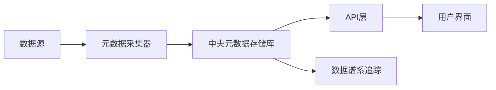
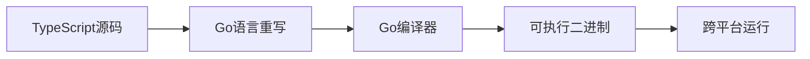

## 今日热点

AI助手与开源模型工具持续火爆，Claude相关项目备受关注；同时，安全工具与开发者平台也获得显著增长，显示开发者对高效工具和AI辅助开发的需求旺盛。

---

## 热门项目一览

| 排名 | 项目 | 语言 | 今日 | 总计 | 简介 |
|:---:|------|:----:|------:|-----:|------|
| 1 | [huggingface/ml-intern](https://github.com/huggingface/ml-intern) | Python | +2,985 | 5,375 | 🤗 ml-intern: an open-source... |
| 2 | [Alishahryar1/free-claude-code](https://github.com/Alishahryar1/free-claude-code) | Python | +2,638 | 9,054 | Use claude-code for free in... |
| 3 | [Z4nzu/hackingtool](https://github.com/Z4nzu/hackingtool) | Python | +1,378 | 62,398 | ALL IN ONE Hacking Tool For... |
| 4 | [codecrafters-io/build-your-own-x](https://github.com/codecrafters-io/build-your-own-x) | Markdown | +991 | 494,824 | Master programming by recre... |
| 5 | [Anil-matcha/Open-Generative-AI](https://github.com/Anil-matcha/Open-Generative-AI) | JavaScript | +842 | 7,707 | Uncensored, open-source alt... |
| 6 | [zilliztech/claude-context](https://github.com/zilliztech/claude-context) | TypeScript | +706 | 9,022 | Code search MCP for Claude ... |
| 7 | [open-metadata/OpenMetadata](https://github.com/open-metadata/OpenMetadata) | TypeScript | +530 | 13,362 | OpenMetadata is a unified m... |
| 8 | [dani-garcia/vaultwarden](https://github.com/dani-garcia/vaultwarden) | Rust | +268 | 59,179 | Unofficial Bitwarden compat... |
| 9 | [google/osv-scanner](https://github.com/google/osv-scanner) | Go | +141 | 9,522 | Vulnerability scanner writt... |
| 10 | [PostHog/posthog](https://github.com/PostHog/posthog) | Python | +85 | 33,122 | 🦔 PostHog is an all-in-one ... |
| 11 | [deepseek-ai/DeepEP](https://github.com/deepseek-ai/DeepEP) | Cuda | +52 | 9,338 | DeepEP: an efficient expert... |
| 12 | [microsoft/typescript-go](https://github.com/microsoft/typescript-go) | Go | +38 | 25,021 | Staging repo for developmen... |

---

## 趋势洞察

```
┌─────────────────────────────────────────────────────────────────┐
│  AI/ML 工具         ████████████████████████  7 个项目        │
│  其他               ██████████                3 个项目        │
│  开发工具             ███                       1 个项目        │
│  数据分析             ███                       1 个项目        │
└─────────────────────────────────────────────────────────────────┘
```

---

## 项目深度解读

### 1. huggingface/ml-intern — [自动化AI助手]

> **一句话总结**：开源AI工程师，自动完成论文研究、模型训练到部署的全流程。

#### 价值主张

| 维度 | 说明 |
|------|------|
| **解决痛点** | 简化从研究到部署的机器学习全流程，降低技术门槛 |
| **目标用户** | 机器学习研究人员、工程师及AI爱好者 |
| **核心亮点** | 自动论文解析 + 模型训练自动化 + 一键部署 + 开源可定制 |

#### 技术架构


**技术特色**：
- 基于transformer的论文理解与提取技术
- 自动化模型训练与优化流程
- 无缝集成Hugging Face生态系统

#### 热度分析

- 短时间内激增近3000个Star，表明AI自动化领域需求强烈
- 作为Hugging Face生态项目，具备强大的社区支持和资源整合能力

#### 快速上手

```bash
# 安装ml-intern
pip install ml-intern

# 基本使用
ml-intern --paper "arxiv:1234.5678" --train --deploy
```

#### 注意事项

- 项目可能需要较强的计算资源，特别是模型训练阶段
- 作为较新的项目，API和功能可能仍在快速迭代中
- 需要确保与Hugging Face生态系统的兼容性


### 2. Alishahryar1/free-claude-code — 免费Claude客户端

> **一句话总结**：提供终端、VSCode和Discord三种方式免费使用Claude Code的解决方案。

#### 价值主张

| 维度 | 说明 |
|------|------|
| **解决痛点** | 解决Claude Code付费使用门槛，提供免费替代方案 |
| **目标用户** | 需要使用Claude Code但不愿付费的开发者和AI工具用户 |
| **核心亮点** | 终端支持 + VSCode扩展 + Discord集成 + 免费使用 + 易于部署 |

#### 技术架构


**技术特色**：
- 通过API代理绕过Claude Code的付费限制
- 提供多平台支持（终端、VSCode、Discord）
- 使用Python实现，跨平台兼容性好

#### 热度分析

- 项目近期获得大量关注，Star数一周内增长近3000，显示社区对免费AI工具的强烈需求
- Fork数超过1300，表明用户积极参与项目定制和二次开发，社区活跃度高

#### 快速上手

```bash
# 克隆项目
git clone https://github.com/Alishahryar1/free-claude-code.git
cd free-claude-code
# 安装依赖
pip install -r requirements.txt
# 运行服务
python app.py
```

#### 注意事项

- 使用此类工具可能违反Claude Code的服务条款
- 项目安全性未经验证，使用时需注意数据安全
- API稳定性依赖于项目维护，可能随时失效


### 3. Z4nzu/hackingtool — 综合黑客工具集

> **一句话总结**：集成多种安全测试与渗透工具的Python一站式安全平台

#### 价值主张

| 维度 | 说明 |
|------|------|
| **解决痛点** | 整合分散的安全工具，简化工具获取与部署流程 |
| **目标用户** | 网络安全研究员、渗透测试人员、道德黑客 |
| **核心亮点** | 模块化设计+多工具集成+统一界面+持续更新+跨平台支持 |

#### 技术架构


**技术特色**：
- 基于Python构建，实现跨平台兼容性
- 采用模块化架构，支持工具动态加载
- 统一接口封装，简化复杂工具调用流程

#### 热度分析

- 项目星数超6.2万，日增约1300，表明在安全领域关注度极高
- 作为安全工具集合，在安全研究社区具有重要地位，需谨慎使用

#### 快速上手

```bash
# 克隆项目
git clone https://github.com/Z4nzu/hackingtool.git

# 安装依赖
cd hackingtool
pip install -r requirements.txt

# 运行工具
python hackingtool.py
```

#### 注意事项

- 本项目仅用于教育和合法的安全测试目的
- 使用前必须获得明确的书面授权
- 未经授权的系统测试可能违反法律
- 建议在隔离环境中测试，避免意外影响
- 负责任地使用，避免对他人造成伤害


### 4. codecrafters-io/build-your-own-x — 实践编程指南

> **一句话总结**：通过从零构建熟悉技术，提供深度实践驱动的编程学习体验。

#### 价值主张

| 维度 | 说明 |
|------|------|
| **解决痛点** | 理论与实践脱节，开发者难以深入理解技术底层原理 |
| **目标用户** | 有基础编程经验，希望提升技术深度的开发者 |
| **核心亮点** | 项目驱动学习 + 多语言实现 + 渐进式难度设计 |

#### 技术架构

由于该项目主要是以Markdown格式组织的教程集合，不涉及具体技术实现流程，因此省略mermaid图部分。

**技术特色**：
- 涵盖多种编程语言和技术栈，适应不同背景开发者
- 从基础到高级，提供结构化学习路径
- 每个项目包含分步指导，降低学习门槛

#### 热度分析

- 项目近50万星，日均增长近千，表明其学习价值获得广泛认可
- fork数与star数比例合理，说明学习者积极实践并参与贡献

#### 快速上手

```bash
# 克隆项目仓库
git clone https://github.com/codecrafters-io/build-your-own-x.git

# 浏览可学习项目列表
ls build-your-own-x
```

#### 注意事项

- 需要一定编程基础，不适合完全初学者
- 完成每个项目需投入较多时间，建议循序渐进
- 学习重点应放在理解原理而非仅完成代码


### 5. Anil-matcha/Open-Generative-AI — 开源无限制AI生成平台

> **一句话总结**：开源无限制的AI图像视频生成平台，提供200+模型且无需内容过滤。

#### 价值主张

| 维度 | 说明 |
|------|------|
| **解决痛点** | 提供无内容限制、开源的AI图像视频生成替代方案 |
| **目标用户** | 需要无限制AI生成能力的研究者和开发者 |
| **核心亮点** | 200+模型支持 + 无内容过滤 + 自托管部署 + 多种前沿模型集成 |

#### 技术架构


**技术特色**：
- 前后端分离架构设计
- 多模型集成框架
- 无内容过滤的处理管道

#### 热度分析

- 项目Star数快速增长，单日新增842个Star，显示出社区对该项目的强烈兴趣
- 作为开源无限制AI生成平台，填补了市场空白，吸引了大量关注

#### 快速上手

```bash
# 克隆仓库
git clone https://github.com/Anil-matcha/Open-Generative-AI.git

# 安装依赖
npm install

# 启动服务
npm start
```

#### 注意事项

- 由于项目无内容过滤，使用者需要自行负责生成内容的合规性
- 自托管部署需要一定的技术能力和服务器资源
- 项目使用多种前沿AI模型，可能需要强大的计算资源


### 6. zilliztech/claude-context — 代码上下文增强

> **一句话总结**：通过MCP协议将整个代码库作为上下文提供给Claude Code，提升代码搜索和理解能力。

#### 价值主张

| 维度 | 说明 |
|------|------|
| **解决痛点** | 解决AI助手无法全面理解整个代码库上下文的限制 |
| **目标用户** | 使用Claude Code的开发者和AI辅助编程工具的用户 |
| **核心亮点** | MCP协议集成 + 全代码库索引 + 增强AI编程准确性 |

#### 技术架构


**技术特色**：
- 基于MCP协议实现代码上下文无缝集成
- 支持大型代码库的高效索引和快速检索
- 提供完整的代码上下文给AI编程助手

#### 热度分析

- 项目获得9022颗星且单日增长706，表明其在AI编程辅助领域备受关注，热度持续上升。
- 作为Claude Code的扩展工具，处于AI编程助手生态的关键位置，解决了上下文理解的核心痛点。

#### 快速上手

```bash
# 安装依赖
npm install @zilliztech/claude-context

# 启动MCP服务器
npx claude-context --port 8080
```

#### 注意事项

- 需要Claude Code环境支持MCP协议
- 可能需要适当的配置才能与现有代码库集成
- 性能可能受代码库大小影响


### 7. open-metadata/OpenMetadata — 数据元数据平台

> **一句话总结**：统一元数据平台，实现数据发现、谱系追踪与团队协作，助力企业数据治理。

#### 价值主张

| 维度 | 说明 |
|------|------|
| **解决痛点** | 企业数据分散难以发现，缺乏有效谱系追踪与治理机制 |
| **目标用户** | 数据工程师、数据分析师、数据科学家及数据治理团队 |
| **核心亮点** | 中央元数据存储库 + 列级谱系追踪 + 团队协作功能 + 数据发现能力 + 数据可观察性 |

#### 技术架构



**技术特色**：
- 基于TypeScript构建的全栈应用架构
- 支持多种数据源的元数据自动采集与集成
- 实现细粒度的列级数据谱系追踪能力
- 提供RESTful API进行元数据管理与操作

#### 热度分析

- 项目Star数超13,000且单日新增530，处于快速增长期，受数据治理领域高度关注
- Fork数2,037，表明有较多开发者参与贡献和二次开发，社区活跃度高

#### 快速上手

```bash
# 克隆项目
git clone https://github.com/open-metadata/OpenMetadata.git

# 安装依赖
npm install

# 启动开发服务器
npm run dev
```

#### 注意事项

- 项目License未知，使用前需确认开源协议
- 作为元数据平台，可能需要较多计算资源存储和处理大量元数据
- 与现有数据源的集成可能需要额外配置工作


### 8. dani-garcia/vaultwarden — 密码管理服务器

> **一句话总结**：用Rust编写的Bitwarden兼容密码管理服务器，提供安全可靠的自托管密码存储解决方案。

#### 价值主张

| 维度 | 说明 |
|------|------|
| **解决痛点** | 提供自托管密码管理方案，避免第三方服务数据安全风险 |
| **目标用户** | 注重隐私安全的技术用户和小型企业团队 |
| **核心亮点** | Rust高性能实现 + 完全自托管控制 + 与Bitwarden客户端无缝兼容 |

#### 技术架构


**技术特色**：
- Rust内存安全模型确保无缓冲区溢出等漏洞
- 端到端加密保护用户敏感数据
- 轻量级设计，资源占用低

#### 热度分析

- 高Star数(59k+)且持续稳定增长(+268/天)，表明项目成熟度高且社区活跃
- 作为Bitwarden重要替代方案，在隐私优先领域占据关键生态位置

#### 快速上手

```bash
# 使用Docker快速部署
docker run -d --name vaultwarden \
  -e SIGNUPS_ALLOWED=true \
  -e ROCKET_PORT=8080 \
  -v /vw-data:/data \
  vaultwarden/server:latest
```

#### 注意事项

- 需自行负责数据备份和服务器安全维护
- 某些企业级功能可能不如官方Bitwarden完整
- 建议定期更新以获取安全修复和新功能


### 9. google/osv-scanner — 开源漏洞扫描器

> **一句话总结**：Go语言编写的开源漏洞扫描工具，利用OSV数据库快速检测项目依赖中的安全漏洞

#### 价值主张

| 维度 | 说明 |
|------|------|
| **解决痛点** | 帮助开发者快速发现项目依赖中的已知安全漏洞 |
| **目标用户** | 开发者、安全工程师、DevOps团队 |
| **核心亮点** | 高效扫描 + 多语言支持 + 精确匹配 + 实时更新漏洞数据 + 简单易用 |

#### 技术架构


**技术特色**：
- 基于Go语言的高性能实现
- 集成OSV官方漏洞数据源
- 支持多种包管理器依赖文件
- 精确的版本匹配算法

#### 热度分析

- 项目获得9522颗星，近期增长迅速(今日+141)，表明社区认可度高
- 作为Google维护的安全工具，在开源安全领域具有重要生态位置

#### 快速上手

```bash
# 安装osv-scanner
go install github.com/google/osv-scanner/cmd/osv-scanner@latest

# 扫描当前目录
osv-scanner

# 扫描指定目录
osv-scanner /path/to/project
```

#### 注意事项

- 需要网络连接以获取最新的漏洞数据
- 漏洞数据库可能存在延迟，最新漏洞可能不会立即被发现
- 扫描结果需要人工验证，避免误报


### 10. PostHog/posthog — 全栈分析平台

> **一句话总结**：PostHog是集成产品分析、会话回放、错误跟踪等功能的开发者一站式平台。

#### 价值主张

| 维度 | 说明 |
|------|------|
| **解决痛点** | 解决开发者分散使用多种工具导致数据孤岛的问题 |
| **目标用户** | 产品团队、开发人员、数据分析师 |
| **核心亮点** | 全栈式产品分析 + 会话回放 + 错误跟踪 + 功能标志 + AI助手 |

#### 技术架构


**技术特色**：
- 基于Python构建的全栈式开发者平台
- 集成多种分析工具于一身，减少技术栈复杂性
- 提供AI助手辅助开发决策和问题排查

#### 热度分析

- PostHog获得33,122个Star，日均增长约85个，表明项目热度持续上升
- 作为开源分析工具，PostHog在开发者社区中具有较高活跃度和影响力

#### 快速上手

```bash
# 安装PostHog Python客户端
pip install posthog

# 初始化PostHog客户端
from posthog import Posthog
posthog = Posthog('YOUR_API_KEY')

# 记录事件
posthog.capture('user_id', 'event_name', properties={'property1': 'value'})
```

#### 注意事项

- 需要配置API密钥才能开始使用
- 数据隐私和合规性需要根据当地法规进行配置
- 大规模部署可能需要考虑资源优化和性能调优


### 11. deepseek-ai/DeepEP — 高效专家并行库

> **一句话总结**：DeepEP是专为CUDA环境设计的高效专家并行通信库，优化大模型训练中的跨专家数据交换。

#### 价值主张

| 维度 | 说明 |
|------|------|
| **解决痛点** | 解决大模型训练中专家并行通信效率低、延迟高的问题 |
| **目标用户** | 大型语言模型研究人员、分布式系统开发者 |
| **核心亮点** | 高效通信算法 + 低延迟设计 + 可扩展架构 |

#### 技术架构


**技术特色**：
- 基于CUDA的高效并行通信实现
- 针对专家并行优化的通信算法
- 支持大规模分布式训练环境

#### 热度分析

- 项目Star数持续增长，近期单日增加52个，显示社区高度关注
- 作为deepseek-ai旗下项目，在大模型训练领域具有较高影响力

#### 快速上手

```bash
# 克隆项目
git clone https://github.com/deepseek-ai/DeepEP.git
cd DeepEP

# 编安装
make install
```

#### 注意事项

- 需要CUDA环境支持
- 适用于大规模分布式训练场景
- 可能需要根据具体硬件环境进行参数调优


### 12. microsoft/typescript-go — TypeScript Go移植

> **一句话总结**：将TypeScript编译器移植到Go语言，实现跨语言编译能力

#### 价值主张

| 维度 | 说明 |
|------|------|
| **解决痛点** | 解决TypeScript在非Node环境中的部署限制 |
| **目标用户** | 需要TypeScript编译功能但偏好Go生态的开发者 |
| **核心亮点** | Go语言实现 + 跨平台部署 + 保持TypeScript完整功能 |

#### 技术架构



**技术特色**：
- 将TypeScript编译核心逻辑用Go完全重写
- 保持与原TypeScript编译器功能完全一致
- 生成原生二进制文件，无需Node.js环境

#### 热度分析

- 高关注度项目，Star数超过2.5万，表明开发者社区对TypeScript跨语言实现的强烈需求
- 作为微软官方项目，具有高可信度，有望成为TypeScript生态的重要组成部分

#### 快速上手

```bash
# 克隆仓库
git clone https://github.com/microsoft/typescript-go.git

# 构建项目
cd typescript-go
go build

# 运行编译器
./tsc-go your-file.ts
```

#### 注意事项

- 项目目前处于开发阶段（staging repo），API和功能可能不稳定
- 需要Go环境才能运行，与原TypeScript的Node.js生态有差异
- 可能与某些特定于Node.js的TypeScript功能不完全兼容


## 今日推荐

| 主题 | 推荐项目 | 亮点 |
|------|----------|------|
| 今日最热 | [huggingface/ml-intern](https://github.com/huggingface/ml-intern) | 🤗 ml-intern: an o... |
| 值得关注 | [Alishahryar1/free-claude-code](https://github.com/Alishahryar1/free-claude-code) | Use claude-code f... |
| 快速上手 | [Z4nzu/hackingtool](https://github.com/Z4nzu/hackingtool) | ALL IN ONE Hackin... |
| 长期潜力 | [codecrafters-io/build-your-own-x](https://github.com/codecrafters-io/build-your-own-x) | Master programmin... |

---

<div align="center">

*Generated on 2026-04-25 | Powered by GitHub Trending Reporter*

</div>